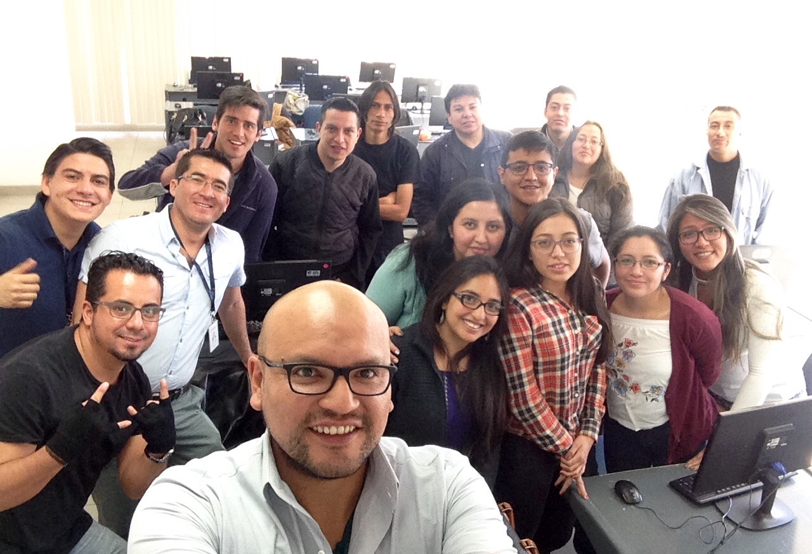
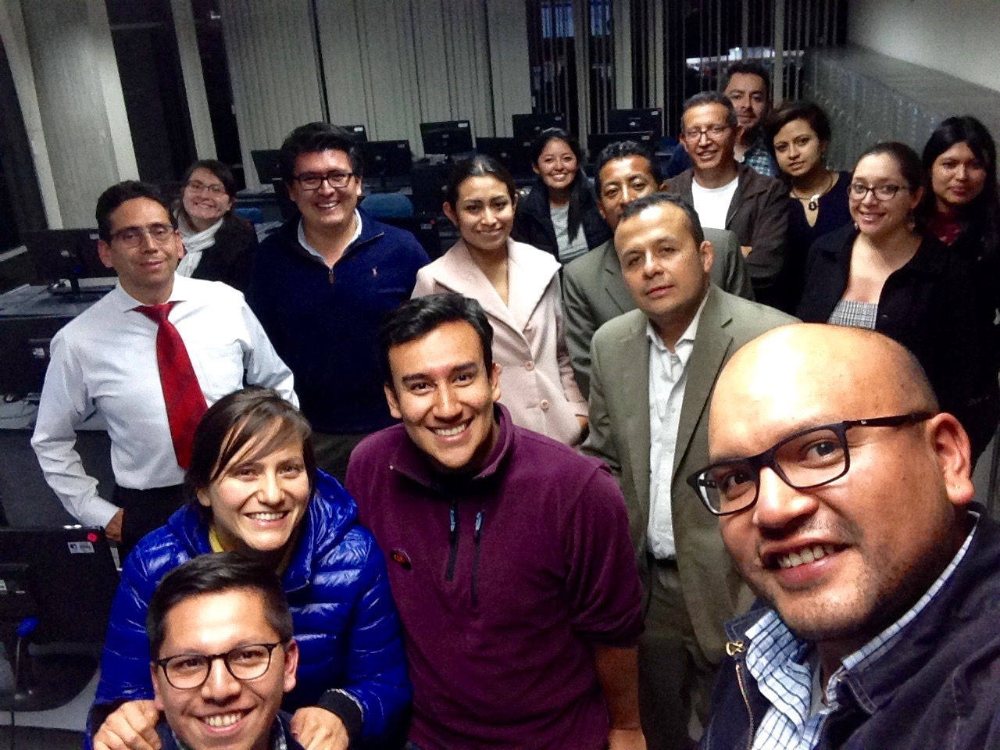
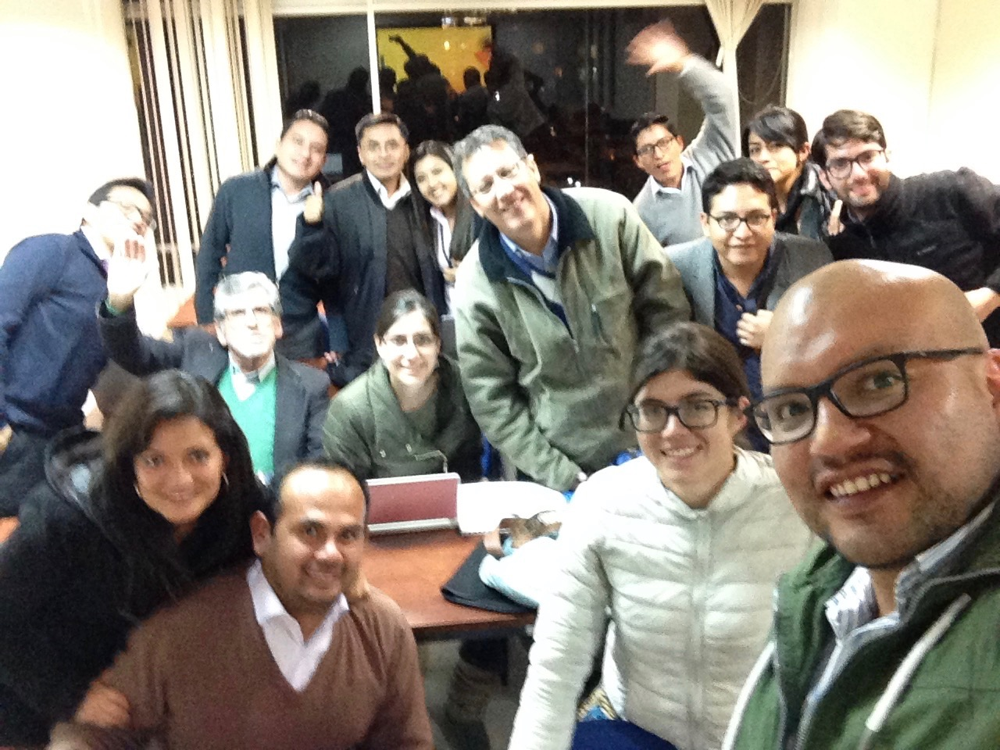

-   [Estadística y Técnicas de Machine Learning con
    R](#estadistica-y-tecnicas-de-machine-learning-con-r)
    -   [Banco Solidario
        11-07-18/01-08-18](#banco-solidario-11-07-1801-08-18)
-   [Análisis Estadístico con R](#analisis-estadistico-con-r)
    -   [FLACSO 18-06-18/06-07-18](#flacso-18-06-1806-07-18)
-   [Análisis Estadístico con R - Grupo
    A,](#analisis-estadistico-con-r---grupo-a)
    -   [FLACSO 19-03-18/17-03-18](#flacso-19-03-1817-03-18)
-   [Análisis Estadístico con R](#analisis-estadistico-con-r-1)
    -   [Grupo B, FLACSO
        19-03-18/17-03-18](#grupo-b-flacso-19-03-1817-03-18)

<!--
La revisión metodológica aquí vertida se basa en [@Wang_2012].
-->
Estadística y Técnicas de Machine Learning con R
================================================

Banco Solidario 11-07-18/01-08-18
---------------------------------

Análisis Estadístico con R
==========================

FLACSO 18-06-18/06-07-18
------------------------

Análisis Estadístico con R - Grupo A,
=====================================

FLACSO 19-03-18/17-03-18
------------------------

Análisis Estadístico con R
==========================

Grupo B, FLACSO 19-03-18/17-03-18
---------------------------------

