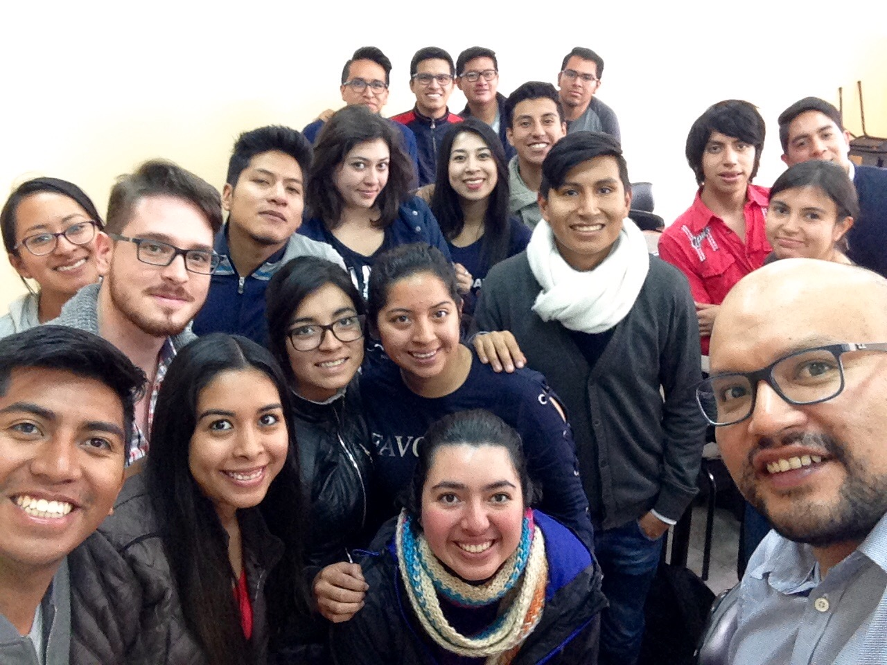

<!--
La revisión metodológica aquí vertida se basa en [@Wang_2012].
-->
Estadística y Técnicas de Machine Learning con R
================================================

Banco Solidario 11-07-18/01-08-18
---------------------------------

Análisis Estadístico con R
==========================

FLACSO 18-06-18/06-07-18
------------------------

Análisis Estadístico con R - Grupo A,
=====================================

FLACSO 19-03-18/17-03-18
------------------------

Análisis Estadístico con R
==========================

Grupo B, FLACSO 19-03-18/17-03-18
---------------------------------

Escuela de Verano, Estadística en R
===================================

Escuela Politécnica Nacional 28-09-18/24-11-18
----------------------------------------------

