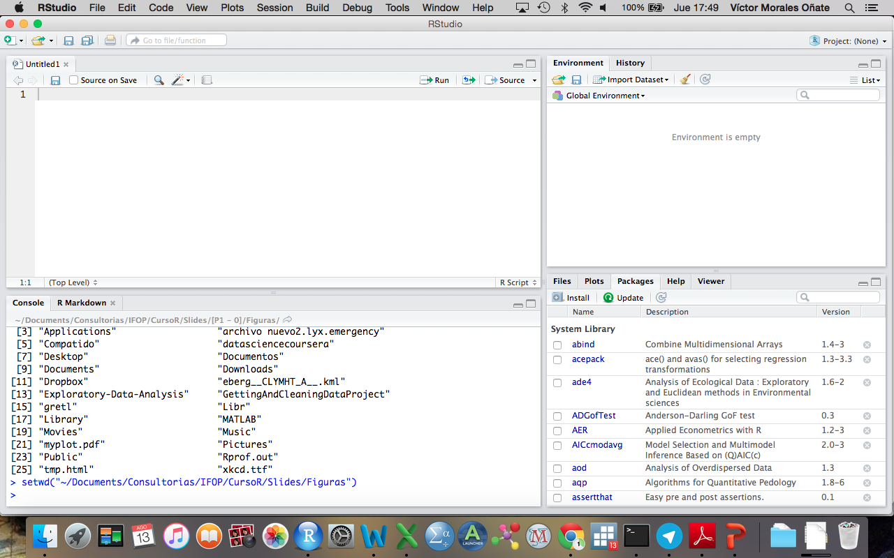

-   [Introducción y Preliminares](#introduccion-y-preliminares)
-   [Importando datos en R](#importando-datos-en-r)

<!--
La revisión metodológica aquí vertida se basa en [@Wang_2012].
-->
Introducción y Preliminares
===========================

¿Qué es R?
----------

-   R es un ambiente y lenguaje para estadística computacional y
    gráficos.
-   R es un dialecto del lenguaje S, es un proyecto
    [GNU](http://www.gnu.org/).

¿Qué es S?
----------

-   S es un lenguaje que fue desarrollado por John Chambers y sus
    colegas en laboratorios Bell.
-   S se inició en 1976 como un ambiente interno de análisis
    estadístico - originalmente implementado como librerías
    [Fortran](https://es.wikipedia.org/wiki/Fortran).
-   Las versiones nacientes del lenguaje no contenían funciones para
    modelamiento estadístico.
-   En 1988 el sistema fue re-escrito en C y empezó a parecerse al
    sistema que tenemos ahora (esta fue la versión 3 del lenguaje). El
    libro [Statistical Models in
    S](http://www.amazon.com/Statistical-Models-J-M-Chambers/dp/041283040X)
    *Chambers y Hastie* documenta la funcionalidad del análisis
    estadístico.
-   La versión 4 del lenguaje S fue liberada en 1998 y es la versión que
    se usa actualmente. El libro [Programming with
    Data](http://www.springer.com/us/book/9780387985039) de *John
    Chambers* documenta esta versión del lenguaje.

Notas Históricas
----------------

-   En 1993, Laboratorios Bell le dio a *StatSci* (ahora corporación
    *Insightful*) una licencia exclusiva para desarrollar y vender el
    lenguaje S.
-   En el 2004, Insightful compró a Lucent el lenguaje S por USD 2
    millones y es el dueño actual.
-   En el 2006, Alcatel compró Lucent y se llama Alcatel-Lucent
-   Los fundamentos del lenguaje S no han cambiado desde 1998.

De regreso a R
--------------

-   1991: Creado en Nueva Zelanda por Ross Ihaka y Robert Gentleman.
-   1993: Primer anuncio de R al público
-   1995: Martin Mächler convence a Ross y Robert que usen una licencia
    pública general GNU para hacer libre al software.
-   1997: Se forma el *R Core Group* (con personas asciadas con S). Este
    grupo controla el código fuente de R.
-   2000: La versión 1.0.0 se libera.
-   2015: Se libera la versión 3.2.2.

Caraterísticas
--------------

-   R es gratis y de código libre.
-   Disponible para Windows, Mac y Linux.
-   Los gráficos de alta calidad (revelaciones de la visualización de
    datos y producción de gráficas para papers).
-   La comunidad de R es muy dinámica (ej., crecimiento en número de
    paquetes), integrada por estadísticos de gran renombre.

Sofware Libre (libertades)
--------------------------

1.  Libertad de correr el programa para cualquier propósito.
2.  Libertad de estudiar cómo funciona el programa, adaptarlo a tus
    necesidades. Se puede acceder al código fuente.
3.  Libertad de re-distribuir copias.
4.  Libertad de mejorar el programa y liberar tus mejoras al público de
    tal manera que se beneficie toda la comunidad.

Algunos recursos
----------------

Disponibles en el CRAN (<https://cran.r-project.org/>)

-   An Introduction to R
-   R Data Import/Export
-   R Installation and Administration
-   Writing R Extensions
-   R Internals

En línea
--------

-   En Google +: [R en
    Español](https://plus.google.com/u/0/communities/113701715197444918479).
-   <http://stackoverflow.com>
-   En Facebook: [R proyect en
    español](https://www.facebook.com/groups/rprojectsp/)
-   En YouTube: [Introducción al R -
    M1](https://www.youtube.com/watch?v=fOpr4-7m_ds), [Introducción al
    R - M2](https://www.youtube.com/watch?v=njqjlRrOHGY)

Libros
------

-   Matloff (2011). *The art of R programming*, William Pollock.
-   Albert (2012). *R by example*, Springer.

En general, la colección de libros [USE
R!](http://www.r-project.org/doc/bib/R-books.html) son excelentes.

¿Cómo funciona?
---------------

Tomado de [R para
Principiantes](https://cran.r-project.org/doc/contrib/rdebuts_es.pdf)

Entorno
-------

Abre el R Studio

-   Script (panel superior izquerdo): es un archivo donde se almacenan
    las sintáxis/códigos de programación.
-   Consola (panel inferior izquerdo): lugar donde se despliegan los
    resultados así como los comandos ejecutados (aquí se reportan los
    errores)
-   Objetos (panel superior derecho): vectores, listas, matrices, entre
    otros.
-   Ventana auxiliar (panel inferior derecho): ayuda, gráficos,
    paquetes.

R como una calculadora
----------------------

R se puede usar como una calculadora. Digite los siguientes comandos en
la consola (seguido del *enter*):

    5+3

    ## [1] 8

    15.3 * 23.4 

    ## [1] 358.02

    sqrt(16)

    ## [1] 4

Almacenado y nombres
--------------------

Puede guardar los valores de las variables con algún nombre para su
posterior reutilización:

    producto = 15.3 * 23.4 
    producto <- 15.3 * 23.4 

Una vez que se guardan las variables, se las puede referenciar con otros
operadores y funciones:

    log(producto) 

    ## [1] 5.880589

    log10(producto) 

    ## [1] 2.553907

    log(producto, base=2) 

    ## [1] 8.483896

Tips
----

-   Los nombres válidos para una variable (objeto) son combinaciones de
    letras, números, y el punto (".").
-   Los nombres no pueden empezar con un número.
-   R es "case-sensitive". x != X.
-   Hay nombres reservados ("function", "if", etc).
-   Para comentar line-in en R se usa “\#”
-   Las asignaciones se hacen con "&lt;-", y es buen estilo el rodear
    "&lt;-" por un espacio a cada lado:

<!-- -->

    x<-1:5 # Mal estilo

    x <- 1:5 # Mucho mejor

-   Para comentar bloques se usa:

<!-- -->

    '
    Este es un bloque de comentarios
    '

-   La estructura de una función en R es:

> nombredefuncion( arg1 , arg2, …)

-   Las funciones se enmarcan en paréntesis y los argumentos se separan
    con “comas”
-   En RStudio, se puede usar TAB para escribir una función más
    ágilmente, la completa.
-   Si observa un signo “+” en la consola, quiere decir que R espera un
    comando, para salir use ESC

Generación de datos
-------------------

Secuencia regular de números enteros

    X <- 1:10 # Note el uso del operador “:”

*seq* genera secuencias de números reales:

    seq(1, 5, 0.5)

    ## [1] 1.0 1.5 2.0 2.5 3.0 3.5 4.0 4.5 5.0

*scan* sirve para ingresar valores (doble enter para terminar):

    # z <- scan()

*rep* sirve para crear un vector con elementos idénticos:

    rep(1, 20)

    ##  [1] 1 1 1 1 1 1 1 1 1 1 1 1 1 1 1 1 1 1 1 1

Funciones simples
-----------------

<table style="width:39%;">
<colgroup>
<col width="5%" />
<col width="33%" />
</colgroup>
<thead>
<tr class="header">
<th>Función</th>
<th>Descripción</th>
</tr>
</thead>
<tbody>
<tr class="odd">
<td>sum(x)</td>
<td>suma de los elementos de x</td>
</tr>
<tr class="even">
<td>prod(x)</td>
<td>producto de los elementos de x</td>
</tr>
<tr class="odd">
<td>max(x)</td>
<td>valor máximo en el objeto x</td>
</tr>
<tr class="even">
<td>min(x)</td>
<td>valor mínimo en el objeto x</td>
</tr>
<tr class="odd">
<td>which.max(x)</td>
<td>devuelve el índice del elemento máximo de x</td>
</tr>
<tr class="even">
<td>which.min(x)</td>
<td>devuelve el índice del elemento mínimo de x</td>
</tr>
<tr class="odd">
<td>length(x)</td>
<td>número de elementos en x</td>
</tr>
<tr class="even">
<td>round(x, n)</td>
<td>redondea los elementos de x a n cifras decimales</td>
</tr>
<tr class="odd">
<td>sort(x)</td>
<td>ordena los elementos de x en orden ascendente; para hacerlo en orden descendente: rev(sort(x))</td>
</tr>
<tr class="even">
<td>which(x==a)</td>
<td>Devuelve un vector de los índices de x si la operaciones (TRUE (en este ejemplo, los valores de i para los cuales x[i]==a).El argumento de esta función debe ser una variable de tipo lógico</td>
</tr>
</tbody>
</table>

Podemos también crear una función

    f_x <- function(x){
     y <- x^2
      y
    }

Importando datos en R
=====================

Es importante fijar el directorio de trabajo

    getwd() # Me dice el directorio actual
    setwd("C:/data") # Fijo un nuevo directorio

Los archivos más usados para importación son:

-   Excel .xml (.csv)
-   Stata .dta
-   SPSS .sav

Recuerden que el comando *setwd* se lo utiliza en función del directorio
en donde hayan creado la carpeta donde almacen los datos por ejemplo

    setwd("~/Documents/Consultorias&Cursos/DataLectures")
    getwd()

    ## [1] "/Users/victormoralesonate/Documents/Consultorias&Cursos/DataLectures"

### Excel

Excel: En este caso se debe abrir la hoja de datos de Excel e ir a la
opción *guardar como*. En esta opción se elige *valores delimitados por
comas*.

    datos.excel <- read.csv("Mundo.csv", sep=";", header=TRUE)
    str(datos.excel) #Describe las variables del dataframe

    ## 'data.frame':    146 obs. of  13 variables:
    ##  $ NOMBRE    : Factor w/ 146 levels "AFGANISTAN         ",..: 4 6 14 16 19 20 22 23 31 32 ...
    ##  $ PNB       : int  NA 60728 1315 1202 1589 1205 170 10494 159 1761 ...
    ##  $ REGION    : int  1 1 1 1 1 1 1 1 1 1 ...
    ##  $ Pob_Urbana: num  28.3 44.7 42 23.6 9 7.3 61.5 49.4 27.6 42.2 ...
    ##  $ poblacion : num  10 25.4 4.7 1.3 9 5.5 0.4 11.2 0.5 2 ...
    ##  $ natalidad : num  47.2 40.2 50.5 47.3 47.2 45.7 38.4 41.6 45.6 44.4 ...
    ##  $ exp_vida  : num  44 62.5 46 56.5 47.2 48.5 61.5 52.9 52 48.5 ...
    ##  $ tasaM_inf : int  137 74 110 67 138 112 66 94 80 73 ...
    ##  $ PNB_PC    : int  NA 2629 305 1059 191 241 494 966 372 873 ...
    ##  $ tasa_ferti: num  6.4 6.1 7 6.3 6.5 6.3 5.2 5.8 6.2 6 ...
    ##  $ tasa_crec : num  2.7 3.12 3.15 3.51 2.67 2.88 2.81 2.6 3.11 2.73 ...
    ##  $ tasa_mort : int  20 9 19 12 19 17 10 16 15 17 ...
    ##  $ calorias  : int  NA 113 93 93 83 95 111 89 89 114 ...

    help(read.csv)
    head(datos.excel) #Muestra los 6 primeros valores

### Stata

Se requiere el paquete *foreign*

    # install.packages("foreign")
    library(foreign)

    datos.stata <- read.dta("per12_2010.dta",convert.factors=TRUE)
    help(read.dta)
    head(datos.stata)

### SPSS

    datos.spss <- read.spss("per12_2010.sav",use.value.labels=TRUE, max.value.labels=TRUE, to.data.frame=TRUE)
    head(datos.spss)
