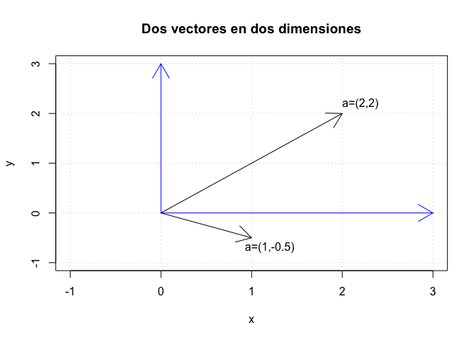

-   [Manipulaciones simples: números y
    vectores](#manipulaciones-simples-numeros-y-vectores)
    -   [Objetos](#objetos)
    -   [Álgebra de Vectores](#algebra-de-vectores)
    -   [Propiedades de indexación](#propiedades-de-indexacion)

<!--
La revisión metodológica aquí vertida se basa en [@Wang_2012].
-->
Manipulaciones simples: números y vectores
==========================================

Objetos
-------

-   Los objetos son entidades que tienen un determinado estado,
    comportamiento (método) e identidad.
    -   El estado está compuesto de datos o informaciones; serán uno o
        varios atributos a los que se habrán asignado unos valores
        concretos (datos).
    -   El comportamiento está definido por los métodos o mensajes a los
        que sabe responder dicho objeto, es decir, qué operaciones se
        pueden realizar con él.
    -   La identidad es una propiedad de un objeto que lo diferencia del
        resto; dicho con otras palabras, es su identificador (concepto
        análogo al de identificador de una variable o una constante).

### Tipos de vectores

R tiene 5 clases de básicos de vectores

-   character
-   numeric (real numbers)
-   integer
-   complex
-   logical (True/False)

### Números

-   Números en R son tratados como objetos numéricos (esto es, con doble
    presición)
-   Si se necesita un entero se debe usar el sufijo *L*
-   Pruebe con 4 y 4*L*.
-   También hay un número especial *I**n**f* que representa infinito.
    Trate con un ejemplo.
-   El valor *N**a**N* representa un valor no definido (`not a number`).
    Por ejemplo 0/0. Puede ser pensado como un *valor perdido*.

### Atributos

Los objetos en R pueden tener atributos

-   names, dimnames
-   dimensions (e.g. matrices, arrays)
-   class
-   length
-   Otros user-defined attributes/metadata

Se puede acceder a los atributos de un objeto con la función
`attributes()`.

### Vectores

(Casi) todo en R es un objeto

-   El objeto más básico en R es un vector
-   Vector: Colección ordenada elementos del mismo tipo.

<!-- -->

    x <- c(1, 2, 3); y <- c("a", "b", "Hola")
    z1 <- c(TRUE, TRUE, FALSE)
    x  <-  9:29
    x <- c(1+0i, 2+4i)

-   Se puede crear vectores vacíos con la función:
    `x <- vector("numeric", length = 10)`

### Mezclando Objetos

Qué tal si hacemos esto:

    y <- c(1.7, "a")    ## character
    y <- c(TRUE, 2)     ## numeric
    y <- c("a", TRUE)   ## character

Cuando diferentes objetos son mezclados en un vector ocurre una
*coerción* tal que el vector se de la misma clase.

Se puede cambiar la clase de los objetos usando funciones del tipo

    x <- 0:6
    class(x)

    ## [1] "integer"

    as.numeric(x)

    ## [1] 0 1 2 3 4 5 6

    as.logical(x)

    ## [1] FALSE  TRUE  TRUE  TRUE  TRUE  TRUE  TRUE

    as.character(x)

    ## [1] "0" "1" "2" "3" "4" "5" "6"

    as.complex(x)

    ## [1] 0+0i 1+0i 2+0i 3+0i 4+0i 5+0i 6+0i

Álgebra de Vectores
-------------------

-   Un *vector columna* es una lista de números agrupados uno sobre el
    otro:

$$
a = \\begin{bmatrix}
       2    \\\\
       1 \\\\
       3
     \\end{bmatrix}
$$

-   Un *vector fila* es una lista de números escritos uno después del
    otro:

$$
b = \\begin{bmatrix}
       2  & 1 & 3
     \\end{bmatrix}
$$

-   En ambos casos, la lista es ordenada:

$$
\\begin{bmatrix}
       2  & 1 & 3
\\end{bmatrix} \\neq \\begin{bmatrix}
       1  & 2 & 3
\\end{bmatrix}
$$

-   Todos los vectores son columna (a menos que se diga lo contrario)
-   En general, un vector tiene la forma:

$$
a = \\begin{bmatrix}
       a\_{1} \\\\
       a\_{2} \\\\
       \\vdots \\\\
       a\_{n}
\\end{bmatrix}
$$

-   Los vectores en R se imprimen en *fila*, pero se puden ser vistos
    como fila.

<!-- -->

    a <- c(1,3,2)
    a

    ## [1] 1 3 2

### Transponer vectores

Transponer significa *convertir* una fila en columna (o al revés). Se
denota como: ***T*.

$$
\\begin{bmatrix}
       1    \\\\
       3 \\\\
       2
\\end{bmatrix} ^{T} = \\begin{bmatrix}
       1  & 3 & 2
     \\end{bmatrix}
$$

Luego, al transponer dos veces se regresa al vector original:

*a* = (*a**T*)*T*

    t(a)

    ##      [,1] [,2] [,3]
    ## [1,]    1    3    2

### Multiplicando un vector por un número

Si *a* es un vector y *α* es un número, entonces *α**a* es el vector

$$
\\alpha a = \\begin{bmatrix}
       \\alpha a\_1    \\\\
       \\alpha a\_2 \\\\
       \\vdots \\\\
       \\alpha a\_{n}
\\end{bmatrix}
$$

Por ejemplo:

$$
7  \\begin{bmatrix}
       1 \\\\
       3 \\\\
       2
\\end{bmatrix} = \\begin{bmatrix}
       7 \\\\
       21 \\\\
       14
\\end{bmatrix}
$$

    7*a

    ## [1]  7 21 14

### Suma de vectores

Se suman los vectores uno a uno.

    a <- c(1,3,2)
    b <- c(2,8,9)
    a+b

    ## [1]  3 11 11

### Producto interno (punto)

El producto punto es un número, no un vector

    sum(a*b)

    ## [1] 44

### Norma de un vector

La norma del vector *a* es

$$
\\| a\\| = \\sqrt{a.a} = \\sqrt{\\sum\_{i = 1}^{n}a\_{i}^{2}}
$$

    sqrt(sum(a*a))

    ## [1] 3.741657

### Vectores ortogonales

Dos vectores *v*1 y *v*2 son ortogonales si su
producto interno es cero:

*v*1 ⊥ *v*2 ⇔ *v*1.*v*2 = 0

Propiedades de indexación
-------------------------

### Indexación

Extrae los elementos 1 y 3 de *y*

    y <- c(1.2,3.9,0.4,0.12)
    y[c(1,3)] 

    ## [1] 1.2 0.4

Se puede crear un *filtro* en otro vector

    v <- 3:4
    y[v]

    ## [1] 0.40 0.12

Se puede extraer duplicados

    x <- c(4,2,17,5)
    y <- x[c(1,1,3)] 
    y

    ## [1]  4  4 17

El *-* se usar para excluir elementos

    z <- c(5,12,13)
    z[-1] 

    ## [1] 12 13

    z[-1:-2] 

    ## [1] 13

Otro ejemplo:

    z[1:length(z)-1]

    ## [1]  5 12

    z[-length(z)]

    ## [1]  5 12

### El operador ":"

    i <- 2
    (1:i)-1 # Esto significa (1:i) NO 1:(i-1)

    ## [1] 0 1

    1:(i-1)

    ## [1] 1

### Secuencias:

Desde, hasta y longitud:

    seq(from=12,to=30,by=3)

    ## [1] 12 15 18 21 24 27 30

    seq(from=1.1,to=2,length=10)

    ##  [1] 1.1 1.2 1.3 1.4 1.5 1.6 1.7 1.8 1.9 2.0

Usando la longitud de un vector

    x <- c(5,12,13);x

    ## [1]  5 12 13

    seq(x)

    ## [1] 1 2 3

    x <- NULL;x

    ## NULL

    seq(x)

    ## integer(0)

    length(seq(x))

    ## [1] 0

### Repeticiones:

    x <- rep(8,4);x

    ## [1] 8 8 8 8

    rep(c(5,12,13),3)

    ## [1]  5 12 13  5 12 13  5 12 13

    length(rep(c(5,12,13),3))

    ## [1] 9

    rep(c(5,12,13),each=2)# Se intercalan las copias de X

    ## [1]  5  5 12 12 13 13

Algunos atributos

    str(x)

    ##  num [1:4] 8 8 8 8

    typeof(x)

    ## [1] "double"

    typeof(6L)

    ## [1] "integer"

¿Qué pasa si se suma/multiplica vectores de diferente longitud?

    x <- c(1,2,3)
    y <- c(3,4)
    x+y

    ## Warning in x + y: longer object length is not a multiple of shorter object
    ## length

    ## [1] 4 6 6

    x*y

    ## Warning in x * y: longer object length is not a multiple of shorter object
    ## length

    ## [1] 3 8 9
