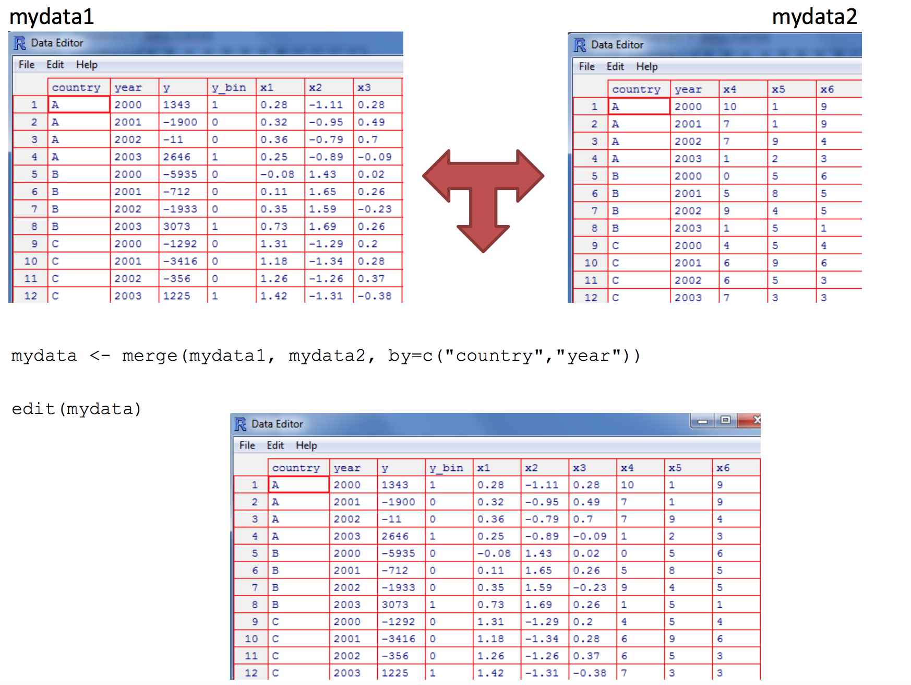
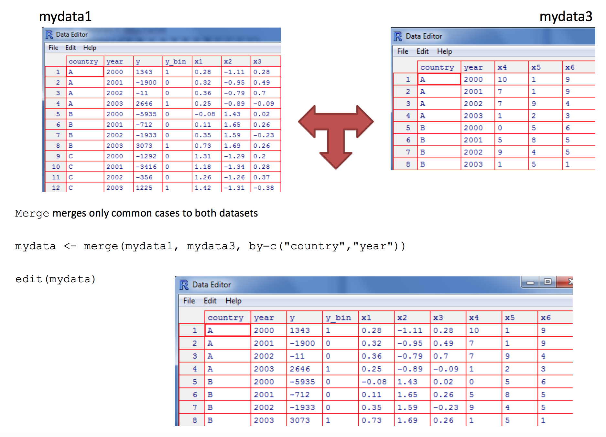
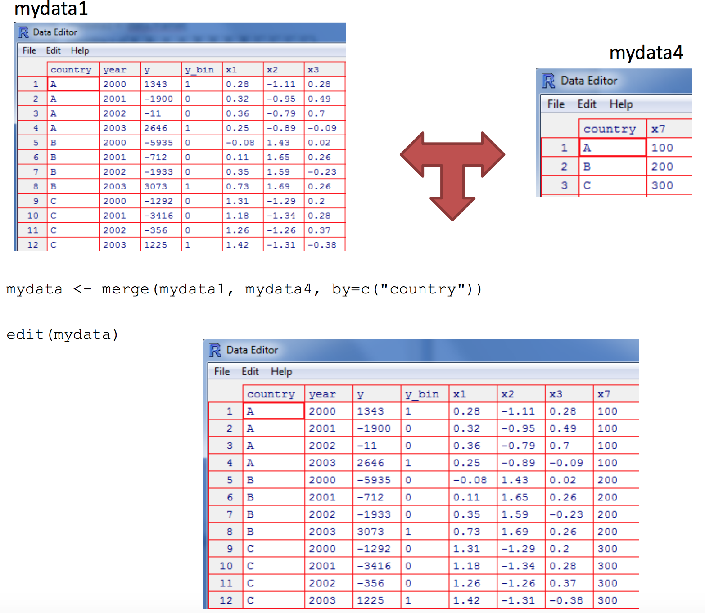
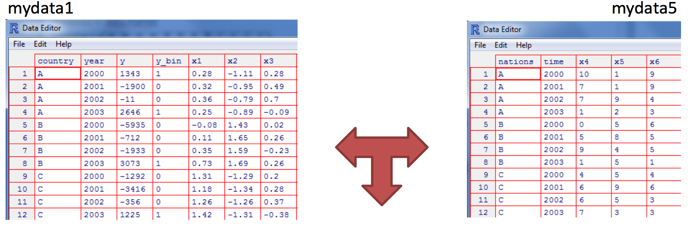
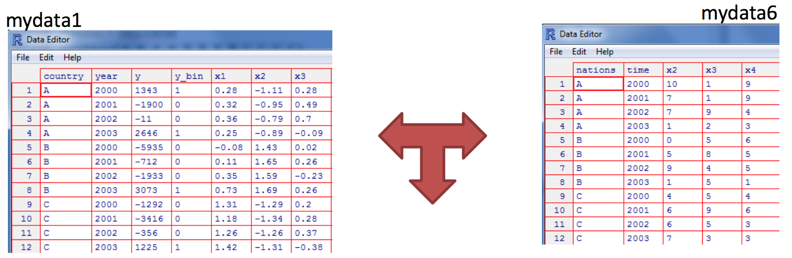
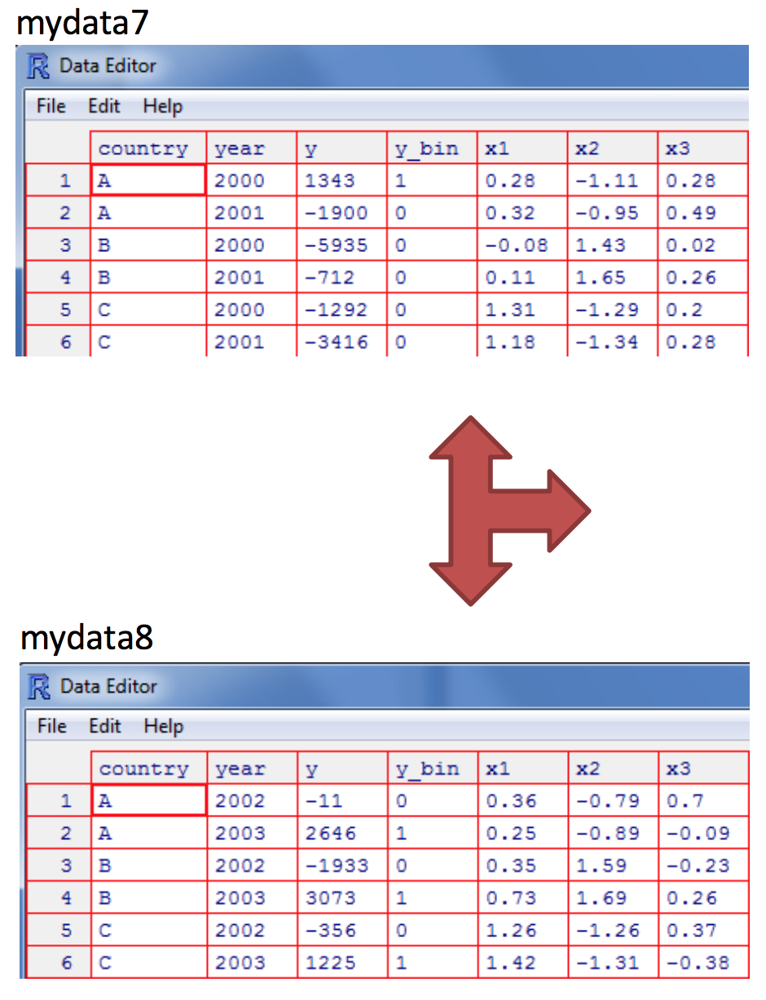

-   [Objetos](#objetos)
    -   [Factor](#factor)
    -   [Listas](#listas)
        -   [Missing Values](#missing-values)
    -   [Matrices y Dataframes](#matrices-y-dataframes)
        -   [Matrices](#matrices)
        -   [Data.frame](#data.frame)
        -   [Operaciones con matrices](#operaciones-con-matrices)
    -   [Arrays](#arrays)
-   [Bucles](#bucles)
    -   [FOR](#for)
    -   [While](#while)
    -   [If - Else](#if---else)
-   [Funciones](#funciones)
    -   [Oasis: Algo de cálculo](#oasis-algo-de-calculo)
    -   [VAN](#van)
-   [La Familia Apply](#la-familia-apply)
    -   [lapply](#lapply)
    -   [sapply](#sapply)
    -   [apply](#apply)
    -   [tapply](#tapply)
        -   [Ejercicio](#ejercicio)
-   [Administración de datos](#administracion-de-datos)
    -   [Ordenar datos](#ordenar-datos)
    -   [Unir datos](#unir-datos)
        -   [Ejemplo 1](#ejemplo-1)
        -   [Ejemplo 2 (una tabla no tiene un
            país)](#ejemplo-2-una-tabla-no-tiene-un-pais)
        -   [Ejemplo 3 (muchos a uno)](#ejemplo-3-muchos-a-uno)
        -   [Ejemplo 4 (ids comunes con nombres
            diferentes)](#ejemplo-4-ids-comunes-con-nombres-diferentes)
        -   [Ejemplo 5 (variables diferentes, mismo
            nombre)](#ejemplo-5-variables-diferentes-mismo-nombre)
    -   [Append](#append)
    -   [Aggregate y By](#aggregate-y-by)
        -   [By](#by)
        -   [Aggregate](#aggregate)
    -   [Reshape](#reshape)
        -   [El paquete `reshape`](#el-paquete-reshape)

<!--
La revisión metodológica aquí vertida se basa en [@Wang_2012].
-->
Objetos
=======

Ya hemos visto la definición de un objeto, además de nuestro primer
objeto: un vector. Ahora veremos cuatro de los objetos más usados en los
primetos pasos en R: factores, listas, matrices y data.frames.

Factor
------

-   Un tipo de vector para datos categóricos

<!-- -->

    z <- factor(LETTERS[1:3], ordered = TRUE)
    x <- factor(c("a", "b", "b", "a"))
    x

    ## [1] a b b a
    ## Levels: a b

Los factores son útiles cuando se conocen los valores posibles de una
variable puede tomar, incluso si no se ve todos los valores en un
determinado conjunto de datos. El uso de un factor en lugar de un vector
de caracteres hace evidente cuando algunos grupos no contienen
observaciones:

    sex_char <- c("m", "m", "m")
    sex_factor <- factor(sex_char, levels = c("m", "f"))

    table(sex_char)

    ## sex_char
    ## m 
    ## 3

    table(sex_factor)

    ## sex_factor
    ## m f 
    ## 3 0

Listas
------

Es *vector generalizado*. Cada lista está formada por componentes (que
pueden ser otras listas), y cada componente puede ser de un tipo
distinto. Son unos "contenedores generales”.

    n <- c(2, 3, 5) 
    s <- c("aa", "bb", "cc", "dd", "ee") 
    b <- c(TRUE, FALSE, TRUE, FALSE, FALSE) 
    x <- list(n, s, b, 3)

A las listas a veces se les llama *vectores recursivos*, porque pueden
contener otras listas.

    x <- list(list(list(list())))
    str(x)

    ## List of 1
    ##  $ :List of 1
    ##   ..$ :List of 1
    ##   .. ..$ : list()

    is.recursive(x)

    ## [1] TRUE

`c()` combinará varias listas en una sola. Si se tiene una combinación
de vectores y listas, `c()` coerciona a los vectores como listas antes
de combinarlos. Compara los resultados de `list()` y `c()`:

    x <- list(list(1, 2), c(3, 4))
    y <- c(list(1, 2), c(3, 4))
    str(x)

    ## List of 2
    ##  $ :List of 2
    ##   ..$ : num 1
    ##   ..$ : num 2
    ##  $ : num [1:2] 3 4

    str(y)

    ## List of 4
    ##  $ : num 1
    ##  $ : num 2
    ##  $ : num 3
    ##  $ : num 4

### Missing Values

Los valores perdidos se denotan por `NA` o `NaN` para operaciones
matemáticas no definidas.

-   `is.na()` se usa para comprobar si un objeto es `NA`
-   `is.nan()` se usa para comprobar si un objeto es `NaN`
-   `NA` también pertenecen a una clase como numeric `NA`, existe
    character `NA`, etc.
-   Un `NaN` también es un `NA` pero al revés no es cierto

<!-- -->

    x <- c(1, 2, NA, 10, 3)
    is.na(x)

    ## [1] FALSE FALSE  TRUE FALSE FALSE

    is.nan(x)

    ## [1] FALSE FALSE FALSE FALSE FALSE

    x <- c(1, 2, NaN, NA, 4)
    is.na(x)

    ## [1] FALSE FALSE  TRUE  TRUE FALSE

    is.nan(x)

    ## [1] FALSE FALSE  TRUE FALSE FALSE

Matrices y Dataframes
---------------------

En esta clase, vamos a cubrir las *matrices* y *data frames*. Ambos
representan los tipos de datos "rectangulares", lo que significa que se
utilizan para almacenar datos tabulares, con filas y columnas.

La principal diferencia, como se verán, es que las matrices sólo pueden
contener una sola clase de datos, mientras que las data frames pueden
consistir en muchas clases diferentes de datos.

### Matrices

Es un tipo de objeto que contiene elementos del mismo tipo. A diferencia
de los vectores, este tiene el atributo `dim`, veamos:

-   Vamos a crear un vector que contiene los números del 1 al 20 con el
    operador `:` . Almacenar el resultado en una variable llamada
    my\_vector.

-   Escribe `dim(my_vector)`. Resulta que no tiene este atributo.

-   Sin embargo, la función `dim` se usa para pedir o asignar este
    atributo. Escribe `dim(my_vector) <- c(4, 5)`

-   Ahora, mira cuál es la dimensión de `my_vector`
    -   Al igual que en la clase de matemáticas, cuando se trata de un
        objeto de 2 dimensiones (piense mesa rectangular), el primer
        número es el número de filas y el segundo es el número de
        columnas. Por lo tanto, `my_vector` ahora tiene 4 filas y 5
        columnas.
    -   ¡Pero espera! Eso no suena como un vector más. Bueno, no lo es.
        Ahora es una matriz. Ver el contenido de `my_vector` ahora para
        ver lo que parece. Imprime el contenido de `my_vector`
-   Ves, ahora tenemos una matriz, confirmemos esto usando a función
    `class()`, así: `class(my_vector)`.

-   Efectivamente, `my_vector` es ahora una matriz. Deberíamos
    almacenarlo en una nueva variable que nos ayuda a recordar lo que
    es. Almacena el valor de `my_vector` en una nueva variable llamada
    `my_matrix`.

El código del ejemplo anterior sería:

    my_vector <- 1:20
    dim(my_vector)

    ## NULL

    dim(my_vector) <- c(4, 5)
    my_vector

    ##      [,1] [,2] [,3] [,4] [,5]
    ## [1,]    1    5    9   13   17
    ## [2,]    2    6   10   14   18
    ## [3,]    3    7   11   15   19
    ## [4,]    4    8   12   16   20

    class(my_vector)

    ## [1] "matrix"

    my_matrix <- my_vector

El ejemplo que hemos utilizado hasta ahora estaba destinado a ilustrar
el punto de que una matriz es simplemente un vector con un atributo de
dimensión. Un método más directo de la creación de la misma matriz
utiliza la función de `matrix()`.

-   Mira la ayuda de `matrix()`. Encuentra la manera de crear una matriz
    que contiene los mismos números (1-20) y dimensiones (4 filas, 5
    columnas) usando a la función de `matrix()`. Almacenar el resultado
    en una variable llamada `my_matrix2`.

-   Ahora veamos si `my_matrix` y `my_matrix2` son idénticas. Usamos la
    función `identical()`

El código sería:

    my_matrix2 <- matrix(1:20, nrow = 4, ncol = 5)
    identical(my_matrix , my_matrix2)

    ## [1] TRUE

Ahora, imagina que los números en la mesa representan algunas medidas de
un experimento clínico, donde cada fila representa un paciente y cada
columna representa una variable para la que se tomaron mediciones.

Podemos querer etiquetar las filas, para que sepamos qué números
pertenecen a cada paciente en el experimento. Una forma de hacer esto es
agregar una columna a la matriz, que contiene los nombres de las cuatro
personas.

-   Vamos a empezar por la creación de un vector de caracteres que
    contiene los nombres de nuestros pacientes - Josefa, Gina, Jose, y
    Julio Recuerda que las comillas dobles dicen R que algo es una
    cadena de caracteres. Almacena el resultado en la variable llamada
    `patients`.

-   Ahora vamos a utilizar la función `cbind()` para *combinar
    columnas*. No te preocupes por guardar el resultado en una nueva
    variable. Sólo tienes que usar `cbind()` con dos argumentos - el
    vector de los pacientes y `my_matrix`.

    -   Algo está raro en el resultado! Parece que la combinación del
        vector *character* con nuestra matriz de números hizo que todo
        esté entre comillas dobles. Esto significa que nos quedamos con
        una matriz de caracteres, lo que no es bueno.
    -   Si recuerdas, dijimos que las matrices sólo pueden contener un
        tipo de datos. Por lo tanto, cuando tratamos de combinar un
        vector de caracteres con una matriz numérica, `R` se vio
        obligado a *coeccionar* los números en caracteres, de ahí las
        comillas dobles.

### Data.frame

-   Por lo tanto, estamos todavía con la cuestión de cómo incluir los
    nombres de nuestros pacientes en la tabla sin dañar de nuestros
    datos numéricos. Prueba lo siguiente -
    `my_data <- data.frame(patients, my_matrix)`

Parece que la función `data.frame()` nos permitió guardar nuestro vector
de caracteres de los nombres justo al lado de nuestra matriz de números.
Eso es exactamente lo que esperábamos!

-   Chequea el tipo de objeto que hemos creado con `class(my_data)`

También es posible asignar nombres a las filas y columnas de un data
frame, lo cual es otra posible forma de determinar qué fila de valores
en nuestra tabla pertenece a cada paciente.

-   Ya que tenemos seis columnas (incluyendo nombres de los pacientes),
    tendremos que crear primero un vector que contiene un elemento para
    cada columna. Crea un vector de caracteres llamado `cnames` que
    contiene los valores siguientes (en orden) - *patient*, *age*,
    *weight*, *bp*, *rating*, *test*.

-   Ahora, utilice los `colnames()` para establecer el atributo
    `colnames` para nuestro data frame. Es similar a la función `dim()`
    que usamos antes. Imprime `my_data`.

El código sería:

    patients <- c("Josefa", "Gina", "Jose", "Julio")
    cbind(patients,my_matrix)

    ##      patients                       
    ## [1,] "Josefa" "1" "5" "9"  "13" "17"
    ## [2,] "Gina"   "2" "6" "10" "14" "18"
    ## [3,] "Jose"   "3" "7" "11" "15" "19"
    ## [4,] "Julio"  "4" "8" "12" "16" "20"

    my_data <- data.frame(patients, my_matrix)
    cnames <- c("patient", "age", "weight", "bp", "rating", "test")
    colnames(my_data) <- cnames

Desde luego, podemos crear un data frame directamente, por ejemplo

    my.data.frame <- data.frame(
        ID = c("Carla", "Pedro",    "Laura"), 
        Edad = c(10, 25, 33), 
        Ingreso = c(NA, 34, 15),
        Sexo = c(TRUE, FALSE, TRUE),
      Etnia = c("Mestizo","Afroecuatoriana","Indígena")
    )

### Operaciones con matrices

-   R posee facilidades para manipular y hacer operaciones con matrices.
    Las funciones `rbind()` y `cbind()` unen matrices con respecto a sus
    filas o columnas respectivamente:

<!-- -->

    m1 <- matrix(1, nr = 2, nc = 2) 
    m2 <- matrix(2, nr = 2, nc = 2) 

    rbind(m1, m2) 
    cbind(m1,m2)

-   El operador para el producto de dos matrices es `%*%`. Por ejemplo,
    considerando las dos matrices m1 y m2:

<!-- -->

    ma <- rbind(m1, m2) %*% cbind(m1, m2) 

-   La transpuesta de una matriz se realiza con la función `t`; esta
    función también funciona con data frames.

<!-- -->

    t(ma)

    ##      [,1] [,2] [,3] [,4]
    ## [1,]    2    2    4    4
    ## [2,]    2    2    4    4
    ## [3,]    4    4    8    8
    ## [4,]    4    4    8    8

-   Para el cálculo de la inversa se usa `solve`

<!-- -->

    solve(ma)

Otro uso de la función `solve()` es la solución de sistemas de
ecuaciones, por ejemplo:

Cuya solución en `R` sería:

    A <- matrix(c(3,5,1,2,3,1,1,4,-1),ncol=3)
    b <- c(1,2,1)
    solve(A,b)

    ## [1] -4  6  1

Arrays
------

-   Generalización multidimensional de vector. Elementos del mismo tipo.

<!-- -->

    x <- array(1:20, dim=c(4,5))

Bucles
======

-   Una ventaja de R comparado con otros programas estadísticos con
    “menus y botones” es la posibilidad de programar de una manera muy
    sencilla una serie de análisis que se puedan ejecutar de manera
    sucesiva.

-   Por ejemplo, definamos un vector con 50.000 componentes y calculemos
    el cuadrado de cada componente primero usando las propiedades de R
    de realizar cálculos componente a componente y luego usando un
    ciclo.

<!-- -->

    x <- 1:50000
    y <- x^2

-   Con bucles:

<!-- -->

    z <- 0
    for (i in 1:50000) z[i] <- x[i]^2 

FOR
---

La sintaxis de la intrucción es:

> for (i in valores ) { instrucciones }

Ejemplo:

    for (i in 1:5)
    {
      print (i)
    }

    ## [1] 1
    ## [1] 2
    ## [1] 3
    ## [1] 4
    ## [1] 5

Ejemplos

-   ivalores: numérico

<!-- -->

    for (i in c(3,2,9,6)){
        print(i^2)
    }

    ## [1] 9
    ## [1] 4
    ## [1] 81
    ## [1] 36

-   i caractér e ivalores vector:

<!-- -->

    medios.transporte <- c("carro", "camion","metro", "moto")
        for (vehiculo in medios.transporte)
        {print (vehiculo)}

    ## [1] "carro"
    ## [1] "camion"
    ## [1] "metro"
    ## [1] "moto"

While
-----

-   Ejemplo 1:

<!-- -->

    i <- 1
    while (i<=10) i <- i+4
    i

    ## [1] 13

-   Ejemplo 2:

<!-- -->

    i <- 1
    while (TRUE){ # Loop similar al anterior
      i <- i+4
      if(i>10) break
    }
    i

    ## [1] 13

If - Else
---------

-   Empecemos con un ejemplo simple:

<!-- -->

    r <- 5
    if(r==4){
      x <-1
    }else{
      x <- 3
      y <- 4
    }

Funciones
=========

Las funciones son declaradas con `function(x,y,...)` seguido de llaves
`{}`. Los valores dentro de la función son los parámetros o valores de
entrada. Dentro de las llaves se ubican las operaciones a realizar con
dichos parámetros.

**Combinando lo aprendido**

-   Realicemos una función que cuenta el número de elementos impares en
    un vector:

<!-- -->

    oddcount <- function(x)
    { 
      k <- 0 # se asigna 0 a k
      for( n in x)
        {
        if(n%%2 ==1) k <- k+1
        }
      return(k)
    }

-   Probemos la función

<!-- -->

    x <- seq(1:3)
    oddcount(x)

    ## [1] 2

### Oasis: Algo de cálculo

-   Derivada de *f*(*x*)=*e*2*x*

<!-- -->

    D(expression(exp(x^2)),"x") 

    ## exp(x^2) * (2 * x)

-   Integral de ∫01*x*2

<!-- -->

    integrate(function(x) x^2,0,1)

    ## 0.3333333 with absolute error < 3.7e-15

-   Chequear el paquete `ryacas` para mas cálculo simbólico

### VAN

Su expresión es $VAN = \\sum\_{i=0}^{n}\\frac{Vi}{(1+K)^i} - I\_{0}$

    VAN <- function(I0,n,K,V)
      {
      for (i in 1:n)
        {
        y[i] <- V/(1+K)^i
        }
      sum(y) - I0
      }

La Familia Apply
================

-   Existen algunas funciones que nos facilitan la vida en lugar de usar
    *loops*:

    -   lapply: Itera sobre una lista y evalúa una función en cada
        elemento.
    -   sapply: Lo mismo que laaply pero trata de simplifica el
        resultado.
    -   apply: Aplica una función sobre las dimensiones de un array.
    -   tapply: Aplica una función sobre subconjuntos de un vector
    -   mapply: Versión multivariada de lapply

lapply
------

-   *lapply* siempre retorna una lista, independientemente de la clase
    del objeto de entrada

<!-- -->

    x <- list(a = 1:5, b = rnorm(10))
    lapply(x, mean)

    ## $a
    ## [1] 3
    ## 
    ## $b
    ## [1] -0.1291634

    x <- list(a = 1:4, b = rnorm(10), 
    c = rnorm(20, 1), d = rnorm(100, 5))
    lapply(x, mean)

    ## $a
    ## [1] 2.5
    ## 
    ## $b
    ## [1] 0.07057489
    ## 
    ## $c
    ## [1] 1.163753
    ## 
    ## $d
    ## [1] 4.978351

    x <- 1:4
    lapply(x, runif)

    ## [[1]]
    ## [1] 0.1100094
    ## 
    ## [[2]]
    ## [1] 0.5912755 0.8911489
    ## 
    ## [[3]]
    ## [1] 0.3677265 0.9706411 0.8512616
    ## 
    ## [[4]]
    ## [1] 0.002771599 0.001517526 0.170103823 0.315488022

sapply
------

-   *sapply* tratará de simplificar el resultado de lapply de ser
    posible

-   Si el resultado es una lista donde cada elemento es de longitud 1,
    entonces retorna un vector
-   Si el resultado es una lista donde cada elemento es un vector de la
    misma longitud (&gt;1), retorna una matriz.
-   Si lo puede descifrar las cosas, retorna una lista

<!-- -->

    x <- list(a = 1:4, b = rnorm(10), c = rnorm(20, 1), d = rnorm(100, 5))
    lapply(x, mean)

    ## $a
    ## [1] 2.5
    ## 
    ## $b
    ## [1] 0.04029814
    ## 
    ## $c
    ## [1] 0.9950403
    ## 
    ## $d
    ## [1] 4.972297

    sapply(x, mean)

    ##          a          b          c          d 
    ## 2.50000000 0.04029814 0.99504029 4.97229699

    mean(x)

    ## [1] NA

apply
-----

-   *apply* se use para evaluar una función sobre las dimensiones de un
    array
-   Es más usado para evaluar una función sobre las filas o columnas de
    una matriz
-   En general no es más rápido que un loop, pero cabe en una sola línea
    (:

<!-- -->

    x <- matrix(rnorm(200), 20, 10)
    apply(x, 2, mean)

    ##  [1]  0.01226048  0.37164676  0.37242048  0.29842242  0.28081489
    ##  [6]  0.07786007  0.10714589  0.04965964  0.01041773 -0.05544093

    apply(x, 1, sum)

    ##  [1] -2.5124883  4.7323579 -0.3471166  2.8809606 -3.5608521  7.7228297
    ##  [7] -2.3626684 -1.3830926  1.3757832  0.7716642 -1.1891399  1.0899103
    ## [13]  1.5883931  4.6538588  5.5342077 -0.5565852  7.1760342 -0.5222012
    ## [19]  7.1663951 -1.7541019

-   Para sumas y medias de matrices tenemos algunos :

    -   `rowSums = apply(x, 1, sum)`
    -   `rowMeans = apply(x, 1, mean)`
    -   `colSums = apply(x, 2, sum)`
    -   `colMeans = apply(x, 2, mean)`

-   Las funciones cortas son más rápidas, pero no se nota menos que se
    use matrices grades.

tapply
------

-   *tapply* Se usa para aplicar funciones sobre subconjuntos de un
    vector.

-   Tomamos medias por grupo:

<!-- -->

    x <- c(rnorm(10), runif(10), rnorm(10, 1))
    f <- gl(3, 10)
    f

    ##  [1] 1 1 1 1 1 1 1 1 1 1 2 2 2 2 2 2 2 2 2 2 3 3 3 3 3 3 3 3 3 3
    ## Levels: 1 2 3

    tapply(x, f, mean)

    ##           1           2           3 
    ## -0.04865868  0.41079496  0.70619120

-   Para encontrar rangos por grupo:

<!-- -->

    tapply(x, f, range)

    ## $`1`
    ## [1] -2.710301  2.284624
    ## 
    ## $`2`
    ## [1] 0.0002453458 0.8952404368
    ## 
    ## $`3`
    ## [1] -1.077897  2.447758

### Ejercicio

Al evaluar la relación estadística de dos variables, hay muchas
alternativas a la medida de correlación estándar (correlación
producto-momento de Pearson). Algunos pueden haber oído hablar de la
correlación de rangos de Spearman, por ejemplo. Estas medidas
alternativas tienen varias motivaciones, como la solidez de valores
atípicos, que son elementos de datos extremos y posiblemente erróneos.

Aquí, propongamos una nueva medida de este tipo (en realidad se
relaciona con uno de amplio uso, **τ* de Kendall*), pero para ilustrar
algunas de las técnicas de programación R introducidas hasta el momento,
especialmente `ifelse ()`.

Ayuda: Considere los vectores `x` e `y`, que son series temporales, por
ejemplo, para las mediciones de las acciones de dos empresas recogidas
una vez por hora. Definiremos nuestra medida de asociación entre ellos
como la *fracción del tiempo `x` y `y` que aumentan o disminuyen
juntos*, es decir, la proporción de `i` para la cual `y[i + 1] -y [i]`
tiene el mismo signo que `x[i + 1] -x [i]`.

    x <- c(5,12,13,3,6,0,1,15,16,8,88)
    y <- c(4,2,3,23,6,10,11,12,6,3,2)
    udcorr(x,y)

    ## [1] 0.4

Administración de datos
=======================

Ordenar datos
-------------

Para ordenar un marco de datos en R, use la función `order()`. Por
defecto, la clasificación es **ascendente**. Anteponga la variable de
clasificación con un signo menos para indicar el orden **descendente**.
Veamos unos ejemplos:

-   Leemos los datos `mtcars`, vemos su estructura y realizamos un
    `attach`

<!-- -->

    data(mtcars)
    str(mtcars)

    ## 'data.frame':    32 obs. of  11 variables:
    ##  $ mpg : num  21 21 22.8 21.4 18.7 18.1 14.3 24.4 22.8 19.2 ...
    ##  $ cyl : num  6 6 4 6 8 6 8 4 4 6 ...
    ##  $ disp: num  160 160 108 258 360 ...
    ##  $ hp  : num  110 110 93 110 175 105 245 62 95 123 ...
    ##  $ drat: num  3.9 3.9 3.85 3.08 3.15 2.76 3.21 3.69 3.92 3.92 ...
    ##  $ wt  : num  2.62 2.88 2.32 3.21 3.44 ...
    ##  $ qsec: num  16.5 17 18.6 19.4 17 ...
    ##  $ vs  : num  0 0 1 1 0 1 0 1 1 1 ...
    ##  $ am  : num  1 1 1 0 0 0 0 0 0 0 ...
    ##  $ gear: num  4 4 4 3 3 3 3 4 4 4 ...
    ##  $ carb: num  4 4 1 1 2 1 4 2 2 4 ...

    attach(mtcars)

-   Si deseamos re ordenar nuestra tabla de datos según `mpg`,
    realizamos:

<!-- -->

    # ordeno por mpg
    newdata <- mtcars[order(mpg),] 
    #Comparamos los resultados:
    head(mtcars)

    ##                    mpg cyl disp  hp drat    wt  qsec vs am gear carb
    ## Mazda RX4         21.0   6  160 110 3.90 2.620 16.46  0  1    4    4
    ## Mazda RX4 Wag     21.0   6  160 110 3.90 2.875 17.02  0  1    4    4
    ## Datsun 710        22.8   4  108  93 3.85 2.320 18.61  1  1    4    1
    ## Hornet 4 Drive    21.4   6  258 110 3.08 3.215 19.44  1  0    3    1
    ## Hornet Sportabout 18.7   8  360 175 3.15 3.440 17.02  0  0    3    2
    ## Valiant           18.1   6  225 105 2.76 3.460 20.22  1  0    3    1

    head(newdata)

    ##                      mpg cyl disp  hp drat    wt  qsec vs am gear carb
    ## Cadillac Fleetwood  10.4   8  472 205 2.93 5.250 17.98  0  0    3    4
    ## Lincoln Continental 10.4   8  460 215 3.00 5.424 17.82  0  0    3    4
    ## Camaro Z28          13.3   8  350 245 3.73 3.840 15.41  0  0    3    4
    ## Duster 360          14.3   8  360 245 3.21 3.570 15.84  0  0    3    4
    ## Chrysler Imperial   14.7   8  440 230 3.23 5.345 17.42  0  0    3    4
    ## Maserati Bora       15.0   8  301 335 3.54 3.570 14.60  0  1    5    8

-   Si se desea ordenar los datos en función de más de una variable:

<!-- -->

    # sort by mpg and cyl
    newdata <- mtcars[order(mpg, cyl),]
    # comparamos resultados:
    head(mtcars[,c("mpg","cyl")])

    ##                    mpg cyl
    ## Mazda RX4         21.0   6
    ## Mazda RX4 Wag     21.0   6
    ## Datsun 710        22.8   4
    ## Hornet 4 Drive    21.4   6
    ## Hornet Sportabout 18.7   8
    ## Valiant           18.1   6

    head(newdata[,c("mpg","cyl")])

    ##                      mpg cyl
    ## Cadillac Fleetwood  10.4   8
    ## Lincoln Continental 10.4   8
    ## Camaro Z28          13.3   8
    ## Duster 360          14.3   8
    ## Chrysler Imperial   14.7   8
    ## Maserati Bora       15.0   8

-   Si deseamos ordenar de forma ascendente por una variable y
    descendente en otra:

<!-- -->

    newdata <- mtcars[order(mpg, -cyl),] 

-   También podemos realizar lo anterior usando el argumento
    `descending`:

<!-- -->

    newdata1 <- mtcars[order(mpg,cyl, decreasing = c(FALSE,TRUE)),] 
    # comparamos resultados:
    tail(newdata[,c("mpg","cyl")])

    ##                 mpg cyl
    ## Porsche 914-2  26.0   4
    ## Fiat X1-9      27.3   4
    ## Honda Civic    30.4   4
    ## Lotus Europa   30.4   4
    ## Fiat 128       32.4   4
    ## Toyota Corolla 33.9   4

    tail(newdata1[,c("mpg","cyl")])

    ##                 mpg cyl
    ## Porsche 914-2  26.0   4
    ## Fiat X1-9      27.3   4
    ## Honda Civic    30.4   4
    ## Lotus Europa   30.4   4
    ## Fiat 128       32.4   4
    ## Toyota Corolla 33.9   4

Unir datos
----------

Para unir dos tablas de datos (datasets) horizontalmente, use la función
`merge`. En la mayoría de los casos, se une dos tablas de datos por una
o más variables clave comunes (es decir, una unión interna).

### Ejemplo 1

    country <- rep(c("A","B","C"),each=4)
    year <- rep(2000:2003,3)
    y <- c(1343,-1900,-11,2646,-5935,-712,-1933,3073,-1292,-3416,356,1225)
    y_bin <- c(1,0,0,1,0,0,0,1,0,0,0,1)
    x1 <- c(.28,.32,.36,.25,-0.08,0.11,0.35,0.73,1.31,1.18,1.26,1.42)
    x2 <- c(-1.11,-0.95,-0.79,-0.89,1.43,1.65,1.59,1.69,-1.29,-1.34,-1.26,-1.31)
    x3 <- c(.28,.49,.7,-.09,.02,.26,-.23,.26,.2,.28,.37,-.38)
    x4 <- c(10,7,7,1,0,5,9,1,4,6,6,7)
    x5 <- c(1,1,9,2,5,8,4,5,5,9,5,3)
    x6 <- c(9,9,4,3,6,5,5,1,4,6,3,3)

    mydata1 <- data.frame(country,year,y,y_bin,x1,x2,x3)
    mydata2 <- data.frame(country,year,x4,x5,x6)

### Ejemplo 2 (una tabla no tiene un país)

Solo se unen los casos comunes en ambas tablas. Si queremos unir todos
los datos de ambas tablas

    (mydata <- merge(mydata1, mydata3, by=c("country","year"), all=TRUE) )

    ##    country year     y y_bin    x1    x2    x3 x4 x5 x6
    ## 1        A 2000  1343     1  0.28 -1.11  0.28 10  1  9
    ## 2        A 2001 -1900     0  0.32 -0.95  0.49  7  1  9
    ## 3        A 2002   -11     0  0.36 -0.79  0.70  7  9  4
    ## 4        A 2003  2646     1  0.25 -0.89 -0.09  1  2  3
    ## 5        B 2000 -5935     0 -0.08  1.43  0.02  0  5  6
    ## 6        B 2001  -712     0  0.11  1.65  0.26  5  8  5
    ## 7        B 2002 -1933     0  0.35  1.59 -0.23  9  4  5
    ## 8        B 2003  3073     1  0.73  1.69  0.26  1  5  1
    ## 9        C 2000 -1292     0  1.31 -1.29  0.20 NA NA NA
    ## 10       C 2001 -3416     0  1.18 -1.34  0.28 NA NA NA
    ## 11       C 2002   356     0  1.26 -1.26  0.37 NA NA NA
    ## 12       C 2003  1225     1  1.42 -1.31 -0.38 NA NA NA

### Ejemplo 3 (muchos a uno)

### Ejemplo 4 (ids comunes con nombres diferentes)

En este caso usamos las opciones `by.x` y `by.y`. R usará los nombres de
la primera en el resultado.

### Ejemplo 5 (variables diferentes, mismo nombre)

Cuando existen variables con el mismo nombre, R asignará un sufijo `.x`
o `.y` para identificar la data de la que provienen.

    ##    country year     y y_bin    x1  x2.x  x3.x  x2.y  x3.y x4
    ## 1        A 2000  1343     1  0.28 -1.11  0.28 -1.11  0.28 10
    ## 2        A 2001 -1900     0  0.32 -0.95  0.49 -0.95  0.49  7
    ## 3        A 2002   -11     0  0.36 -0.79  0.70 -0.79  0.70  7
    ## 4        A 2003  2646     1  0.25 -0.89 -0.09 -0.89 -0.09  1
    ## 5        B 2000 -5935     0 -0.08  1.43  0.02  1.43  0.02  0
    ## 6        B 2001  -712     0  0.11  1.65  0.26  1.65  0.26  5
    ## 7        B 2002 -1933     0  0.35  1.59 -0.23  1.59 -0.23  9
    ## 8        B 2003  3073     1  0.73  1.69  0.26  1.69  0.26  1
    ## 9        C 2000 -1292     0  1.31 -1.29  0.20 -1.29  0.20  4
    ## 10       C 2001 -3416     0  1.18 -1.34  0.28 -1.34  0.28  6
    ## 11       C 2002   356     0  1.26 -1.26  0.37 -1.26  0.37  6
    ## 12       C 2003  1225     1  1.42 -1.31 -0.38 -1.31 -0.38  7

Append
------

    ##    country year     y y_bin    x1    x2    x3
    ## 1        A 2000  1343     1  0.28 -1.11  0.28
    ## 2        A 2001 -1900     0  0.32 -0.95  0.49
    ## 3        A 2002   -11     0  0.36 -0.79  0.70
    ## 4        A 2003  2646     1  0.25 -0.89 -0.09
    ## 5        B 2000 -5935     0 -0.08  1.43  0.02
    ## 6        B 2001  -712     0  0.11  1.65  0.26
    ## 7        B 2002 -1933     0  0.35  1.59 -0.23
    ## 8        B 2003  3073     1  0.73  1.69  0.26
    ## 9        C 2000 -1292     0  1.31 -1.29  0.20
    ## 10       C 2001 -3416     0  1.18 -1.34  0.28
    ## 11       C 2002   356     0  1.26 -1.26  0.37
    ## 12       C 2003  1225     1  1.42 -1.31 -0.38

Aggregate y By
--------------

### By

-   Para ejecutar esta función, usaremos la base de datos *InsectSprays*

<!-- -->

    data(InsectSprays)
    InsectSprays$x <- rnorm(length(InsectSprays$count))
    by(InsectSprays,InsectSprays$spray,summary)

    ## InsectSprays$spray: A
    ##      count       spray        x           
    ##  Min.   : 7.00   A:12   Min.   :-0.84230  
    ##  1st Qu.:11.50   B: 0   1st Qu.:-0.26253  
    ##  Median :14.00   C: 0   Median : 0.06278  
    ##  Mean   :14.50   D: 0   Mean   : 0.37572  
    ##  3rd Qu.:17.75   E: 0   3rd Qu.: 0.92579  
    ##  Max.   :23.00   F: 0   Max.   : 2.88728  
    ## -------------------------------------------------------- 
    ## InsectSprays$spray: B
    ##      count       spray        x           
    ##  Min.   : 7.00   A: 0   Min.   :-1.91073  
    ##  1st Qu.:12.50   B:12   1st Qu.:-0.40056  
    ##  Median :16.50   C: 0   Median : 0.22716  
    ##  Mean   :15.33   D: 0   Mean   : 0.06074  
    ##  3rd Qu.:17.50   E: 0   3rd Qu.: 0.74773  
    ##  Max.   :21.00   F: 0   Max.   : 1.41675  
    ## -------------------------------------------------------- 
    ## InsectSprays$spray: C
    ##      count       spray        x            
    ##  Min.   :0.000   A: 0   Min.   :-1.704142  
    ##  1st Qu.:1.000   B: 0   1st Qu.:-0.692762  
    ##  Median :1.500   C:12   Median :-0.004953  
    ##  Mean   :2.083   D: 0   Mean   :-0.045357  
    ##  3rd Qu.:3.000   E: 0   3rd Qu.: 0.655888  
    ##  Max.   :7.000   F: 0   Max.   : 1.372186  
    ## -------------------------------------------------------- 
    ## InsectSprays$spray: D
    ##      count        spray        x           
    ##  Min.   : 2.000   A: 0   Min.   :-2.19523  
    ##  1st Qu.: 3.750   B: 0   1st Qu.:-0.68597  
    ##  Median : 5.000   C: 0   Median :-0.06223  
    ##  Mean   : 4.917   D:12   Mean   :-0.15848  
    ##  3rd Qu.: 5.000   E: 0   3rd Qu.: 0.62945  
    ##  Max.   :12.000   F: 0   Max.   : 1.17125  
    ## -------------------------------------------------------- 
    ## InsectSprays$spray: E
    ##      count      spray        x          
    ##  Min.   :1.00   A: 0   Min.   :-1.9254  
    ##  1st Qu.:2.75   B: 0   1st Qu.:-1.0105  
    ##  Median :3.00   C: 0   Median :-0.4535  
    ##  Mean   :3.50   D: 0   Mean   :-0.3428  
    ##  3rd Qu.:5.00   E:12   3rd Qu.: 0.4325  
    ##  Max.   :6.00   F: 0   Max.   : 1.5362  
    ## -------------------------------------------------------- 
    ## InsectSprays$spray: F
    ##      count       spray        x          
    ##  Min.   : 9.00   A: 0   Min.   :-2.5952  
    ##  1st Qu.:12.50   B: 0   1st Qu.:-0.7137  
    ##  Median :15.00   C: 0   Median : 0.0484  
    ##  Mean   :16.67   D: 0   Mean   :-0.1165  
    ##  3rd Qu.:22.50   E: 0   3rd Qu.: 0.6186  
    ##  Max.   :26.00   F:12   Max.   : 1.7482

### Aggregate

Es relativamente fácil colapsar datos en R usando una o más variables
*BY* y una función definida.

    # agregamos los datos de mtcars por cyl and vs, 
    # regresa las medias de las variables numéricas
    aggdata <-aggregate(mtcars, by=list(cyl,vs), 
      FUN=mean, na.rm=TRUE,data = mtcars)
    print(aggdata)

    ##   Group.1 Group.2      mpg cyl   disp       hp     drat       wt     qsec
    ## 1       4       0 26.00000   4 120.30  91.0000 4.430000 2.140000 16.70000
    ## 2       6       0 20.56667   6 155.00 131.6667 3.806667 2.755000 16.32667
    ## 3       8       0 15.10000   8 353.10 209.2143 3.229286 3.999214 16.77214
    ## 4       4       1 26.73000   4 103.62  81.8000 4.035000 2.300300 19.38100
    ## 5       6       1 19.12500   6 204.55 115.2500 3.420000 3.388750 19.21500
    ##   vs        am     gear     carb
    ## 1  0 1.0000000 5.000000 2.000000
    ## 2  0 1.0000000 4.333333 4.666667
    ## 3  0 0.1428571 3.285714 3.500000
    ## 4  1 0.7000000 4.000000 1.500000
    ## 5  1 0.0000000 3.500000 2.500000

Al usar la función `aggregate()`, las variables by deben estar en una
lista (incluso si solo hay una). La función puede ser incorporada o
proporcionada por el usuario.

Reshape
-------

Use la función `t()` para transponer una matriz o una tabla de datos. En
el caso de `data.frames`, los nombres de fila se convierten en nombres
de variables (columna).

    # ejemplo usando mtcars
    mtcars

    ##                      mpg cyl  disp  hp drat    wt  qsec vs am gear carb
    ## Mazda RX4           21.0   6 160.0 110 3.90 2.620 16.46  0  1    4    4
    ## Mazda RX4 Wag       21.0   6 160.0 110 3.90 2.875 17.02  0  1    4    4
    ## Datsun 710          22.8   4 108.0  93 3.85 2.320 18.61  1  1    4    1
    ## Hornet 4 Drive      21.4   6 258.0 110 3.08 3.215 19.44  1  0    3    1
    ## Hornet Sportabout   18.7   8 360.0 175 3.15 3.440 17.02  0  0    3    2
    ## Valiant             18.1   6 225.0 105 2.76 3.460 20.22  1  0    3    1
    ## Duster 360          14.3   8 360.0 245 3.21 3.570 15.84  0  0    3    4
    ## Merc 240D           24.4   4 146.7  62 3.69 3.190 20.00  1  0    4    2
    ## Merc 230            22.8   4 140.8  95 3.92 3.150 22.90  1  0    4    2
    ## Merc 280            19.2   6 167.6 123 3.92 3.440 18.30  1  0    4    4
    ## Merc 280C           17.8   6 167.6 123 3.92 3.440 18.90  1  0    4    4
    ## Merc 450SE          16.4   8 275.8 180 3.07 4.070 17.40  0  0    3    3
    ## Merc 450SL          17.3   8 275.8 180 3.07 3.730 17.60  0  0    3    3
    ## Merc 450SLC         15.2   8 275.8 180 3.07 3.780 18.00  0  0    3    3
    ## Cadillac Fleetwood  10.4   8 472.0 205 2.93 5.250 17.98  0  0    3    4
    ## Lincoln Continental 10.4   8 460.0 215 3.00 5.424 17.82  0  0    3    4
    ## Chrysler Imperial   14.7   8 440.0 230 3.23 5.345 17.42  0  0    3    4
    ## Fiat 128            32.4   4  78.7  66 4.08 2.200 19.47  1  1    4    1
    ## Honda Civic         30.4   4  75.7  52 4.93 1.615 18.52  1  1    4    2
    ## Toyota Corolla      33.9   4  71.1  65 4.22 1.835 19.90  1  1    4    1
    ## Toyota Corona       21.5   4 120.1  97 3.70 2.465 20.01  1  0    3    1
    ## Dodge Challenger    15.5   8 318.0 150 2.76 3.520 16.87  0  0    3    2
    ## AMC Javelin         15.2   8 304.0 150 3.15 3.435 17.30  0  0    3    2
    ## Camaro Z28          13.3   8 350.0 245 3.73 3.840 15.41  0  0    3    4
    ## Pontiac Firebird    19.2   8 400.0 175 3.08 3.845 17.05  0  0    3    2
    ## Fiat X1-9           27.3   4  79.0  66 4.08 1.935 18.90  1  1    4    1
    ## Porsche 914-2       26.0   4 120.3  91 4.43 2.140 16.70  0  1    5    2
    ## Lotus Europa        30.4   4  95.1 113 3.77 1.513 16.90  1  1    5    2
    ## Ford Pantera L      15.8   8 351.0 264 4.22 3.170 14.50  0  1    5    4
    ## Ferrari Dino        19.7   6 145.0 175 3.62 2.770 15.50  0  1    5    6
    ## Maserati Bora       15.0   8 301.0 335 3.54 3.570 14.60  0  1    5    8
    ## Volvo 142E          21.4   4 121.0 109 4.11 2.780 18.60  1  1    4    2

    t(mtcars)

    ##      Mazda RX4 Mazda RX4 Wag Datsun 710 Hornet 4 Drive Hornet Sportabout
    ## mpg      21.00        21.000      22.80         21.400             18.70
    ## cyl       6.00         6.000       4.00          6.000              8.00
    ## disp    160.00       160.000     108.00        258.000            360.00
    ## hp      110.00       110.000      93.00        110.000            175.00
    ## drat      3.90         3.900       3.85          3.080              3.15
    ## wt        2.62         2.875       2.32          3.215              3.44
    ## qsec     16.46        17.020      18.61         19.440             17.02
    ## vs        0.00         0.000       1.00          1.000              0.00
    ## am        1.00         1.000       1.00          0.000              0.00
    ## gear      4.00         4.000       4.00          3.000              3.00
    ## carb      4.00         4.000       1.00          1.000              2.00
    ##      Valiant Duster 360 Merc 240D Merc 230 Merc 280 Merc 280C Merc 450SE
    ## mpg    18.10      14.30     24.40    22.80    19.20     17.80      16.40
    ## cyl     6.00       8.00      4.00     4.00     6.00      6.00       8.00
    ## disp  225.00     360.00    146.70   140.80   167.60    167.60     275.80
    ## hp    105.00     245.00     62.00    95.00   123.00    123.00     180.00
    ## drat    2.76       3.21      3.69     3.92     3.92      3.92       3.07
    ## wt      3.46       3.57      3.19     3.15     3.44      3.44       4.07
    ## qsec   20.22      15.84     20.00    22.90    18.30     18.90      17.40
    ## vs      1.00       0.00      1.00     1.00     1.00      1.00       0.00
    ## am      0.00       0.00      0.00     0.00     0.00      0.00       0.00
    ## gear    3.00       3.00      4.00     4.00     4.00      4.00       3.00
    ## carb    1.00       4.00      2.00     2.00     4.00      4.00       3.00
    ##      Merc 450SL Merc 450SLC Cadillac Fleetwood Lincoln Continental
    ## mpg       17.30       15.20              10.40              10.400
    ## cyl        8.00        8.00               8.00               8.000
    ## disp     275.80      275.80             472.00             460.000
    ## hp       180.00      180.00             205.00             215.000
    ## drat       3.07        3.07               2.93               3.000
    ## wt         3.73        3.78               5.25               5.424
    ## qsec      17.60       18.00              17.98              17.820
    ## vs         0.00        0.00               0.00               0.000
    ## am         0.00        0.00               0.00               0.000
    ## gear       3.00        3.00               3.00               3.000
    ## carb       3.00        3.00               4.00               4.000
    ##      Chrysler Imperial Fiat 128 Honda Civic Toyota Corolla Toyota Corona
    ## mpg             14.700    32.40      30.400         33.900        21.500
    ## cyl              8.000     4.00       4.000          4.000         4.000
    ## disp           440.000    78.70      75.700         71.100       120.100
    ## hp             230.000    66.00      52.000         65.000        97.000
    ## drat             3.230     4.08       4.930          4.220         3.700
    ## wt               5.345     2.20       1.615          1.835         2.465
    ## qsec            17.420    19.47      18.520         19.900        20.010
    ## vs               0.000     1.00       1.000          1.000         1.000
    ## am               0.000     1.00       1.000          1.000         0.000
    ## gear             3.000     4.00       4.000          4.000         3.000
    ## carb             4.000     1.00       2.000          1.000         1.000
    ##      Dodge Challenger AMC Javelin Camaro Z28 Pontiac Firebird Fiat X1-9
    ## mpg             15.50      15.200      13.30           19.200    27.300
    ## cyl              8.00       8.000       8.00            8.000     4.000
    ## disp           318.00     304.000     350.00          400.000    79.000
    ## hp             150.00     150.000     245.00          175.000    66.000
    ## drat             2.76       3.150       3.73            3.080     4.080
    ## wt               3.52       3.435       3.84            3.845     1.935
    ## qsec            16.87      17.300      15.41           17.050    18.900
    ## vs               0.00       0.000       0.00            0.000     1.000
    ## am               0.00       0.000       0.00            0.000     1.000
    ## gear             3.00       3.000       3.00            3.000     4.000
    ## carb             2.00       2.000       4.00            2.000     1.000
    ##      Porsche 914-2 Lotus Europa Ford Pantera L Ferrari Dino Maserati Bora
    ## mpg          26.00       30.400          15.80        19.70         15.00
    ## cyl           4.00        4.000           8.00         6.00          8.00
    ## disp        120.30       95.100         351.00       145.00        301.00
    ## hp           91.00      113.000         264.00       175.00        335.00
    ## drat          4.43        3.770           4.22         3.62          3.54
    ## wt            2.14        1.513           3.17         2.77          3.57
    ## qsec         16.70       16.900          14.50        15.50         14.60
    ## vs            0.00        1.000           0.00         0.00          0.00
    ## am            1.00        1.000           1.00         1.00          1.00
    ## gear          5.00        5.000           5.00         5.00          5.00
    ## carb          2.00        2.000           4.00         6.00          8.00
    ##      Volvo 142E
    ## mpg       21.40
    ## cyl        4.00
    ## disp     121.00
    ## hp       109.00
    ## drat       4.11
    ## wt         2.78
    ## qsec      18.60
    ## vs         1.00
    ## am         1.00
    ## gear       4.00
    ## carb       2.00

### El paquete `reshape`

Básicamente, `funde` (*melt*) los datos para que cada fila sea una
combinación única de variable de identificación. Luego `proyecta`
(*cast*) los datos fundidos en la forma que desee. Aquí hay un ejemplo
muy simple.

    id <- c(1,1,2,2)
    time <- c(2001,2002,2001,2002)
    x1 <- c(5,3,6,2)
    x2 <- c(6,5,1,4)
    (mydata <- data.frame(id,time,x1,x2))

    ##   id time x1 x2
    ## 1  1 2001  5  6
    ## 2  1 2002  3  5
    ## 3  2 2001  6  1
    ## 4  2 2002  2  4

<!-- wide.format <- reshape(mydata, -->
<!--                        # time variable -->
<!--                        timevar="time", -->
<!--                        # variables not to change -->
<!--                        idvar="id",  -->
<!--                        # direction of reshape -->
<!--                        direction = "wide" -->
<!--                        ) -->
<!-- long.format <- reshape(wide.format,  -->
<!--                  # variable names for level one -->
<!--                  varying=c("x1.2001", "x1.2002", "x2.2001", "x2.2002"), -->
<!--                  # new var name for long data -->
<!--                  v.names="income", -->
<!--                  # name for year in long data -->
<!--                  timevar="time",  -->
<!--                  # possible time values -->
<!--                  times=c(2001,2002,2001,2002),  -->
<!--                  # direction to reshape -->
<!--                  direction="long" -->
<!--                        ) -->
Ejemplo:

    library(reshape)
    (mdata <- melt(mydata, id=c("id","time")))

    ##   id time variable value
    ## 1  1 2001       x1     5
    ## 2  1 2002       x1     3
    ## 3  2 2001       x1     6
    ## 4  2 2002       x1     2
    ## 5  1 2001       x2     6
    ## 6  1 2002       x2     5
    ## 7  2 2001       x2     1
    ## 8  2 2002       x2     4

Ahora hacemos un `cast` de los datos:

    (subjmeans <- cast(mdata, id~variable, mean))

    ##   id x1  x2
    ## 1  1  4 5.5
    ## 2  2  4 2.5

    (timemeans <- cast(mdata, time~variable, mean))

    ##   time  x1  x2
    ## 1 2001 5.5 3.5
    ## 2 2002 2.5 4.5
