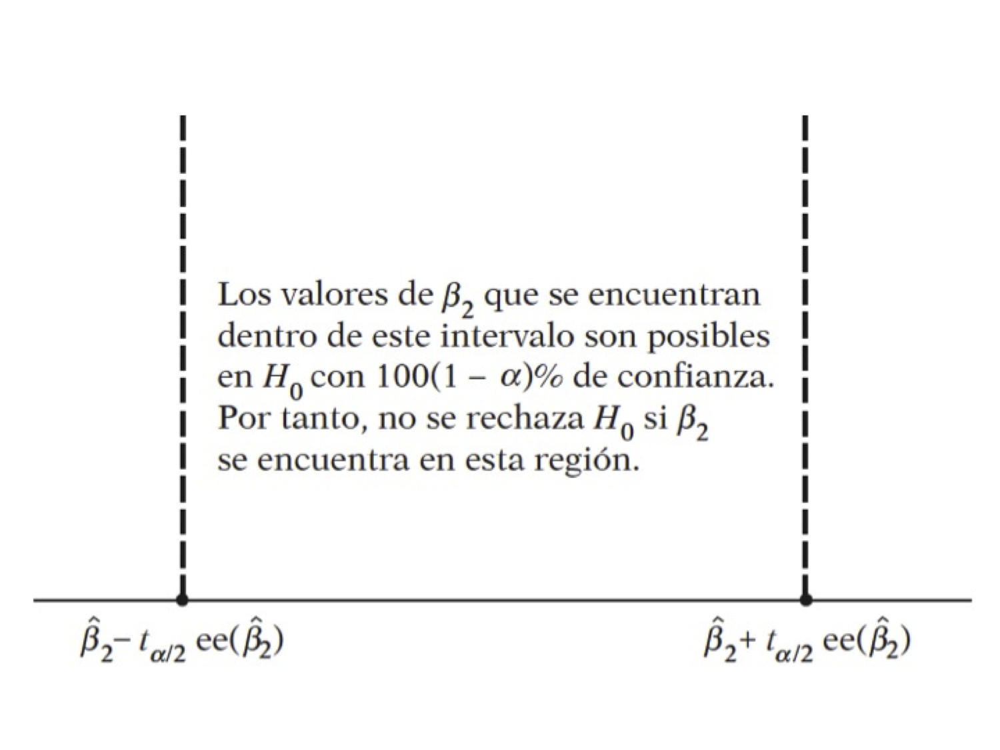
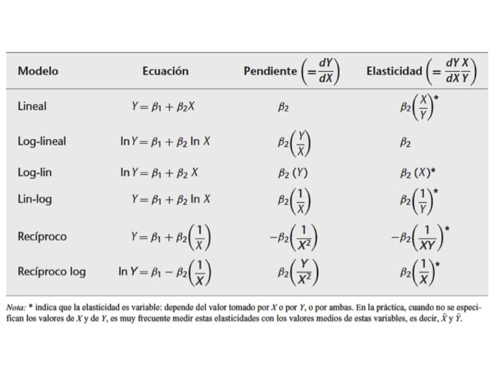

-   [Regresión Lineal](#regresion-lineal)
    -   [Una idea general](#una-idea-general)
    -   [Transformaciones Lineales](#transformaciones-lineales)
    -   [Regresión Lineal Múltiple](#regresion-lineal-multiple)
-   [Referencias](#referencias)

------------------------------------------------------------------------

<!--
La revisión metodológica aquí vertida se basa en [@Wang_2012].
-->
Regresión Lineal
================

Una idea general
----------------

Abordemos las primeras ideas de regresión lineal a través de un ejemplo
práctico:

-   Abrir la `tabla 2.1`
-   Creamos dos variables, Ingreso y Consumo Esperado

<!-- -->

    ingresos <- seq(80,260,20)
    consumoEsperado <- c(65,77,89,101,113,125,137,149,161,173)

Ahora:

-   Generar un gráfico tipo línea entre ingresos y consumo esperado
-   Superponer un gráfico tipo puntos de *X* e *Y* (`tabla 2.1`) sobre
    el gráfico anterior
-   Generar un gráfico tipo puntos *X* e *Y* en azul
-   Superponer un gráfico tipo lineas de Ingresos y consumo esperado
    sobre el gráfico anterior en azul

<!-- -->

    familia <- read.csv(file="Tabla2_1.csv",sep=";",dec=".",header=T)
    attach(familia)
    names(familia)

    ## [1] "X" "Y"

    cbind(ingresos,consumoEsperado) 

    ##       ingresos consumoEsperado
    ##  [1,]       80              65
    ##  [2,]      100              77
    ##  [3,]      120              89
    ##  [4,]      140             101
    ##  [5,]      160             113
    ##  [6,]      180             125
    ##  [7,]      200             137
    ##  [8,]      220             149
    ##  [9,]      240             161
    ## [10,]      260             173

    plot(X,Y,col="blue")
    lines(ingresos,consumoEsperado,col="blue")

-   ¿Qué hemos hecho?

*E*(*Y*|*X**i*)=*f*(*X**i*)

*E*(*Y*|*X**i*)=*β*1 + *β*2*X**i*

*u**i* = *Y**i* − *E*(*Y*|*X**i*)

*Y**i* = *E*(*Y*|*X**i*)+*u**i*

-   ¿Qué significa que sea lineal?

> El término regresión *lineal* siempre significará una regresión lineal
> en los parámetros; los *β* (es decir, los parámetros) se elevan sólo a
> la primera potencia. Puede o no ser lineal en las variables
> explicativas *X*

Para evidenciar la factibilidad del uso de RL en este caso, vamos a
obtener una muestra de la población:

-   Creamos una variable indicadora para obtener una muestra
    `indice=seq(1,55,1)`
-   Usamos `sample` para obtener una muestra sin reemplazo del tamaño
    indicado: `muestra <- sample(indice,size=20)`
-   Obtenemos el valor de la variable *X* en la posición de *muestra* +
    `ingreso.muestra <- X[muestra]` + `consumo.muestra <- Y[muestra]`

<!-- -->

    indice <- seq(1,55,1)  
    muestra <- sample( X ,size=20)
    muestra <- sample(indice,size=20)
    ingreso.muestra <- X[muestra]
    consumo.muestra <- Y[muestra]

-   Graficamos ingreso.muestra vs consumo.muestra
-   Realizar una regresión lineal de las variables muestra:
    -   `plot(ingreso.muestra,consumo.muestra)`
    -   `ajuste.1=(lm(consumo.muestra\sim ingreso.muestra))`
    -   `abline(coef(ajuste.1))`
-   Generar una segunda muestra (muestra.2 por ejemplo) y comparar los
    coeficientes
-   ¿Qué conclusiones puede sacar?

<!-- -->

    plot(ingreso.muestra,consumo.muestra)
    ajuste.1 <- (lm(consumo.muestra~ingreso.muestra))
    ajuste.1

    ## 
    ## Call:
    ## lm(formula = consumo.muestra ~ ingreso.muestra)
    ## 
    ## Coefficients:
    ##     (Intercept)  ingreso.muestra  
    ##         15.4869           0.6123

    coef(ajuste.1)

    ##     (Intercept) ingreso.muestra 
    ##      15.4869110       0.6123037

    abline(coef(ajuste.1))

### Regresión: Paso a paso

La función poblacional sería:

*Y**i* = *β*1 + *β*2*X**i* + *u**i*

Como no es observable, se usa la muestral

$$
Y\_i=\\hat{\\beta}\_1+\\hat{\\beta}\_2X\_i+\\hat{u}\_i
$$

$$
Y\_i=\\hat{Y}\_i+\\hat{u}\_i
$$

$$
\\hat{u}\_i = Y\_i-\\hat{Y}\_i
$$

$$
\\hat{u}\_i = Y\_i- \\hat{\\beta}\_1-\\hat{\\beta}\_2X\_i
$$

Es por esto que los residuos se obtienen a través de los betas:

$$\\label{eq1}
\\sum\\hat{u}\_i^2 =\\sum (Y\_i- \\hat{\\beta}\_1-\\hat{\\beta}\_2X\_i)^2
$$

$$
\\sum\\hat{u}\_i^2 =f(\\hat{\\beta}\_1,\\hat{\\beta}\_2)
$$

Diferenciando (\[\]) se obtiene:

$$
 \\hat{\\beta}\_2 = \\frac{S\_{xy}}{S\_{xx}}
$$

$$
 \\hat\\beta\_1 = \\bar{Y} -  \\hat\\beta\_2\\bar{X}
$$
 donde
$$
S\_{xx} = \\sum\_{i=1}^{n}x\_i^2-n\\bar{x}^2
$$

$$
S\_{xy} = \\sum\_{i=1}^{n}x\_i y\_i-n\\bar{x}\\bar{y}
$$

Abrimos la `tabla3.2`, vamos a obtener:

    uu <- "https://raw.githubusercontent.com/vmoprojs/DataLectures/master/Tabla3_2.csv"

    consumo <- read.csv(url(uu),sep=";",dec=".",header=TRUE)
    attach(consumo)

    media_x <- mean(X, na.rm=T)
    media_y <- mean(Y, na.rm=T)

    n <- length(X)*1

    sumcuad_x <- sum(X*X)
    sum_xy <- sum(X*Y)

    beta_som <- (sum_xy-n*media_x*media_y)/
        (sumcuad_x-n*(media_x^2))
    alpha_som  <- media_y-beta_som*media_x

-   Verificamos lo anterior mediante:

<!-- -->

    reg.1 <- (lm(Y~X))
    coef(reg.1)

    ## (Intercept)           X 
    ##  24.4545455   0.5090909

-   Veamos cómo queda nuestra estimación:

<!-- -->

    y.ajustado <- alpha_som+beta_som*X
    head(cbind(X,y.ajustado))

    ##        X y.ajustado
    ## [1,]  80   65.18182
    ## [2,] 100   75.36364
    ## [3,] 120   85.54545
    ## [4,] 140   95.72727
    ## [5,] 160  105.90909
    ## [6,] 180  116.09091

-   Gráficamente:

<!-- -->

    plot(X,y.ajustado,main="Valores estimados")
    abline(a=alpha_som,b=beta_som)

-   Encontremos los residuos:

<!-- -->

    y.ajustado=alpha_som+beta_som*X
    e <- Y-y.ajustado

-   Comparemos los resultados

<!-- -->

    head(cbind(X,Y,y.ajustado,e))

    ##        X   Y y.ajustado           e
    ## [1,]  80  70   65.18182   4.8181818
    ## [2,] 100  65   75.36364 -10.3636364
    ## [3,] 120  90   85.54545   4.4545455
    ## [4,] 140  95   95.72727  -0.7272727
    ## [5,] 160 110  105.90909   4.0909091
    ## [6,] 180 115  116.09091  -1.0909091

-   Veamos la media y la correlación

<!-- -->

    mean(e) 

    ## [1] -1.421085e-15

    cor(e,X) 

    ## [1] 1.150102e-15

-   Hallemos el coeficiente de determinación o *bondad* de ajuste.

-   Para ello necesitamos la suma de cuadrados total y la suma de
    cuadramos explicada

<!-- -->

    SCT <- sum((Y-media_y)^2)
    SCE <- sum((y.ajustado-media_y)^2)
    SCR <- sum(e^2)
    R_2 <- SCE/SCT

    summary(reg.1)

    ## 
    ## Call:
    ## lm(formula = Y ~ X)
    ## 
    ## Residuals:
    ##     Min      1Q  Median      3Q     Max 
    ## -10.364  -4.977   1.409   4.364   8.364 
    ## 
    ## Coefficients:
    ##             Estimate Std. Error t value Pr(>|t|)    
    ## (Intercept) 24.45455    6.41382   3.813  0.00514 ** 
    ## X            0.50909    0.03574  14.243 5.75e-07 ***
    ## ---
    ## Signif. codes:  0 '***' 0.001 '**' 0.01 '*' 0.05 '.' 0.1 ' ' 1
    ## 
    ## Residual standard error: 6.493 on 8 degrees of freedom
    ## Multiple R-squared:  0.9621, Adjusted R-squared:  0.9573 
    ## F-statistic: 202.9 on 1 and 8 DF,  p-value: 5.753e-07

Pruebas de hipótesis:

*H*0 : *β*2 = 0
*H*1 : *β*2 ≠ 0

-   Abrir la tabla 2.8

-   Regresar el gasto total en el gasto en alimentos
-   ¿Son los coeficientes diferentes de cero?

<!-- -->

    t1 <- (0.43681-0)/0.07832
    1-pt(t1,53)

    ## [1] 4.222605e-07

-   ¿Son los coeficientes diferentes de 0.5?

<!-- -->

    # H0: beta1 = 0.5
    t2 <- (0.43681-0.5)/0.07832
    (1-pt(abs(t2),53))

    ## [1] 0.2116886

Interpretación de los coeficientes

-   El coeficiente de la variable dependiente mide la tasa de cambio
    (derivada=pendiente) del modelo
-   La interpretación suele ser *En promedio, el aumento de una unidad
    en la variable independiente produce un aumento/disminución de
    *β**i* cantidad en la variable dependiente*
-   Interprete la regresión anterior.

#### Práctica: Paridad del poder de compra

Abrir la tabla 5.9, las variables son:

    uu <- "https://raw.githubusercontent.com/vmoprojs/DataLectures/master/Tabla5_9.csv"
    datos <- read.csv(url(uu),sep=";",dec=".",header=TRUE)
    attach(datos)
    names(datos) 

    ## [1] "COUNTRY" "BMACLC"  "BMAC."   "EXCH"    "PPP"     "LOCALC"

-   BMACLC: Big Mac Prices in Local Currency
-   BMAC$: Big Mac Prices in $
-   EXCH: Actual $ Exchange Rate 4/17/2001
-   PPP: Implied Purchasing-Power Parity of the Dollar: Local Price
    Divided by Price in United States
-   LOCALC: Local Currency Under (-)/Over (+) Valuation Against $,
    Percent

Empezamos con el buen `summary`. ¿Notan algo raro?

-   Debemos limpiar los datos

<!-- -->

    datos$EXCH[which(  EXCH  == -99999)] <- NA
    datos$PPP[which(  PPP == -99999)] <- NA
    datos$LOCALC[which(  LOCALC   ==-99999)] <- NA

Regresamos la paridad del poder de compra en la tasa de cambio

    reg1 <- lm(EXCH~PPP)
    summary(reg1)

    ## 
    ## Call:
    ## lm(formula = EXCH ~ PPP)
    ## 
    ## Residuals:
    ##    Min     1Q Median     3Q    Max 
    ## -212.9 -211.0 -208.0 -186.3 4827.8 
    ## 
    ## Coefficients:
    ##              Estimate Std. Error t value Pr(>|t|)    
    ## (Intercept) 2.116e+02  1.675e+02   1.264    0.216    
    ## PPP         1.005e+00  9.306e-03 107.990   <2e-16 ***
    ## ---
    ## Signif. codes:  0 '***' 0.001 '**' 0.01 '*' 0.05 '.' 0.1 ' ' 1
    ## 
    ## Residual standard error: 920.1 on 29 degrees of freedom
    ## Multiple R-squared:  0.9975, Adjusted R-squared:  0.9974 
    ## F-statistic: 1.166e+04 on 1 and 29 DF,  p-value: < 2.2e-16

    reg2 <- lm(EXCH[-13]~PPP[-13])
    summary(reg2)

    ## 
    ## Call:
    ## lm(formula = EXCH[-13] ~ PPP[-13])
    ## 
    ## Residuals:
    ##    Min     1Q Median     3Q    Max 
    ## -203.1 -201.2 -199.0 -179.6 4838.5 
    ## 
    ## Coefficients:
    ##              Estimate Std. Error t value Pr(>|t|)    
    ## (Intercept) 2.018e+02  1.731e+02   1.166    0.254    
    ## PPP[-13]    1.005e+00  9.465e-03 106.157   <2e-16 ***
    ## ---
    ## Signif. codes:  0 '***' 0.001 '**' 0.01 '*' 0.05 '.' 0.1 ' ' 1
    ## 
    ## Residual standard error: 934.8 on 28 degrees of freedom
    ## Multiple R-squared:  0.9975, Adjusted R-squared:  0.9974 
    ## F-statistic: 1.127e+04 on 1 and 28 DF,  p-value: < 2.2e-16

    reg3 <- lm(log(EXCH)~log(PPP))
    summary(reg3)

    ## 
    ## Call:
    ## lm(formula = log(EXCH) ~ log(PPP))
    ## 
    ## Residuals:
    ##      Min       1Q   Median       3Q      Max 
    ## -0.70587 -0.24564 -0.05721  0.26862  0.42295 
    ## 
    ## Coefficients:
    ##             Estimate Std. Error t value Pr(>|t|)    
    ## (Intercept)  0.34363    0.08613    3.99 0.000432 ***
    ## log(PPP)     1.00231    0.02463   40.69  < 2e-16 ***
    ## ---
    ## Signif. codes:  0 '***' 0.001 '**' 0.01 '*' 0.05 '.' 0.1 ' ' 1
    ## 
    ## Residual standard error: 0.3206 on 28 degrees of freedom
    ##   (1 observation deleted due to missingness)
    ## Multiple R-squared:  0.9834, Adjusted R-squared:  0.9828 
    ## F-statistic:  1655 on 1 and 28 DF,  p-value: < 2.2e-16

La PPA sostiene que con una unidad de moneda debe ser posible comprar la
misma canasta de bienes en todos los países.

#### Práctica: Sueño

De la carpeta *Datos*, abrir `sleep.xls`

    uu <- "https://raw.githubusercontent.com/vmoprojs/DataLectures/master/sleep75.csv"
    datos <- read.csv(url(uu), header = FALSE) 

agregamos los nombres:

    names (datos) <- c("age","black","case","clerical","construc","educ","earns74","gdhlth","inlf", "leis1", "leis2", "leis3", "smsa", "lhrwage", "lothinc", "male", "marr", "prot", "rlxall", "selfe", "sleep", "slpnaps", "south", "spsepay", "spwrk75", "totwrk" , "union" , "worknrm" , "workscnd", "exper" , "yngkid","yrsmarr", "hrwage", "agesq")    

Veamos los datos gráficamente y corramos la regresión:

    attach(datos)
    #totwrk minutos trabajados por semana
    #sleep minutos dormidos por semana
    plot(totwrk,sleep)

    dormir <- lm(sleep~totwrk)
    summary(dormir)

    ## 
    ## Call:
    ## lm(formula = sleep ~ totwrk)
    ## 
    ## Residuals:
    ##      Min       1Q   Median       3Q      Max 
    ## -2429.94  -240.25     4.91   250.53  1339.72 
    ## 
    ## Coefficients:
    ##               Estimate Std. Error t value Pr(>|t|)    
    ## (Intercept) 3586.37695   38.91243  92.165   <2e-16 ***
    ## totwrk        -0.15075    0.01674  -9.005   <2e-16 ***
    ## ---
    ## Signif. codes:  0 '***' 0.001 '**' 0.01 '*' 0.05 '.' 0.1 ' ' 1
    ## 
    ## Residual standard error: 421.1 on 704 degrees of freedom
    ## Multiple R-squared:  0.1033, Adjusted R-squared:  0.102 
    ## F-statistic: 81.09 on 1 and 704 DF,  p-value: < 2.2e-16

-   ¿Existe una relación entre estas variables?
-   Interprete el modelo

Intervalo de confianza para *β*2 y veamos los residuos

    -0.15084-2*c(-0.01677,0.01677)

    ## [1] -0.11730 -0.18438

    hist(resid(dormir),freq=F)
    lines(density(resid(dormir)))

Derivaciones del modelo

Transformaciones Lineales
-------------------------

Abrir la `tabla 31.3`, regresar el ingreso per cápita en el número de
celulares por cada 100 personas:

    uu <- "https://raw.githubusercontent.com/vmoprojs/DataLectures/master/Table%2031_3.csv"
    datos <- read.csv(url(uu),sep=";",dec=".",header=TRUE)
    attach(datos)

    reg.1 <- lm(Cellphone ~ Pcapincome)
    summary(reg.1)

    ## 
    ## Call:
    ## lm(formula = Cellphone ~ Pcapincome)
    ## 
    ## Residuals:
    ##     Min      1Q  Median      3Q     Max 
    ## -45.226 -10.829  -2.674   8.950  47.893 
    ## 
    ## Coefficients:
    ##              Estimate Std. Error t value Pr(>|t|)    
    ## (Intercept) 1.248e+01  6.109e+00   2.043   0.0494 *  
    ## Pcapincome  2.313e-03  3.158e-04   7.326  2.5e-08 ***
    ## ---
    ## Signif. codes:  0 '***' 0.001 '**' 0.01 '*' 0.05 '.' 0.1 ' ' 1
    ## 
    ## Residual standard error: 19.92 on 32 degrees of freedom
    ## Multiple R-squared:  0.6265, Adjusted R-squared:  0.6148 
    ## F-statistic: 53.67 on 1 and 32 DF,  p-value: 2.498e-08

    plot(Pcapincome,Cellphone)
    abline(coef(reg.1))

### Modelo recíproco

Abrir la `tabla 6.4`, regresar el Producto Nacional Bruto (PGNP) en la
tasa de mortalidad (CM).

    uu <- "https://raw.githubusercontent.com/vmoprojs/DataLectures/master/tabla_6_4.csv"
    datos <- read.csv(url(uu),sep=";",dec=".",header=TRUE)
    attach(datos)
    names(datos)

    ## [1] "CM"   "FLR"  "PGNP" "TFR"

    plot(CM~ PGNP)

    reg1 <- lm(CM ~ PGNP)
    summary(reg1)

    ## 
    ## Call:
    ## lm(formula = CM ~ PGNP)
    ## 
    ## Residuals:
    ##      Min       1Q   Median       3Q      Max 
    ## -113.764  -53.111   -6.685   48.064  157.758 
    ## 
    ## Coefficients:
    ##               Estimate Std. Error t value Pr(>|t|)    
    ## (Intercept) 157.424441   9.845583  15.989  < 2e-16 ***
    ## PGNP         -0.011364   0.003233  -3.516 0.000826 ***
    ## ---
    ## Signif. codes:  0 '***' 0.001 '**' 0.01 '*' 0.05 '.' 0.1 ' ' 1
    ## 
    ## Residual standard error: 69.93 on 62 degrees of freedom
    ## Multiple R-squared:  0.1662, Adjusted R-squared:  0.1528 
    ## F-statistic: 12.36 on 1 and 62 DF,  p-value: 0.0008262

    reg2 <- lm(CM~I(1/PGNP))
    summary(reg2)

    ## 
    ## Call:
    ## lm(formula = CM ~ I(1/PGNP))
    ## 
    ## Residuals:
    ##      Min       1Q   Median       3Q      Max 
    ## -130.806  -36.410    2.871   31.686  132.801 
    ## 
    ## Coefficients:
    ##             Estimate Std. Error t value Pr(>|t|)    
    ## (Intercept)    81.79      10.83   7.551 2.38e-10 ***
    ## I(1/PGNP)   27273.17    3760.00   7.254 7.82e-10 ***
    ## ---
    ## Signif. codes:  0 '***' 0.001 '**' 0.01 '*' 0.05 '.' 0.1 ' ' 1
    ## 
    ## Residual standard error: 56.33 on 62 degrees of freedom
    ## Multiple R-squared:  0.4591, Adjusted R-squared:  0.4503 
    ## F-statistic: 52.61 on 1 and 62 DF,  p-value: 7.821e-10

### Modelo log-lineal

Abrir los datos `ceosal2.xls`,

    uu <- "https://raw.githubusercontent.com/vmoprojs/DataLectures/master/ceosal2.csv"
    datos <- read.csv(url(uu), header = FALSE) 
    names(datos) = c("salary", "age", "college", "grad", "comten", "ceoten", "sales", "profits","mktval", "lsalary", "lsales", "lmktval", "comtensq", "ceotensq", "profmarg")
    attach(datos)

Regresar la antigüedad del CEO en el logaritmo del salario.

    summary(lm(lsalary~ceoten))

    ## 
    ## Call:
    ## lm(formula = lsalary ~ ceoten)
    ## 
    ## Residuals:
    ##      Min       1Q   Median       3Q      Max 
    ## -2.15314 -0.38319 -0.02251  0.44439  1.94337 
    ## 
    ## Coefficients:
    ##             Estimate Std. Error t value Pr(>|t|)    
    ## (Intercept) 6.505498   0.067991  95.682   <2e-16 ***
    ## ceoten      0.009724   0.006364   1.528    0.128    
    ## ---
    ## Signif. codes:  0 '***' 0.001 '**' 0.01 '*' 0.05 '.' 0.1 ' ' 1
    ## 
    ## Residual standard error: 0.6038 on 175 degrees of freedom
    ## Multiple R-squared:  0.01316,    Adjusted R-squared:  0.007523 
    ## F-statistic: 2.334 on 1 and 175 DF,  p-value: 0.1284

-   Hay una probabilidad de equivocarnos del 12.84% si rechazamos la
    hipótesis nula
-   No hay evidencia de la antiguedad tenga relación con el salario
-   Los CEO con 0 años de antiguedad entran ganando
    `exp(6.505)=668.4757` miles de USD `exp(6.505)`

### Regresión a través del origen

Abrir la `tabla 6.1`, regresar X (rendimientos excedentes de un índice
acciones del sector de bienes de consumo cíclico) en Y (rendimientos
excedentes de un índice acciones de todo el mercado de valores en el
Reino Unido)

    uu <- "https://raw.githubusercontent.com/vmoprojs/DataLectures/master/Table%206_1.csv"
    datos <- read.csv(url(uu),sep=";",dec=".",header=TRUE)
    attach(datos)

    lmod1 <- lm(Y~ -1 + X)
    summary(lmod1)

    ## 
    ## Call:
    ## lm(formula = Y ~ -1 + X)
    ## 
    ## Residuals:
    ##      Min       1Q   Median       3Q      Max 
    ## -20.8053  -3.9760  -0.2102   3.0745  14.7680 
    ## 
    ## Coefficients:
    ##   Estimate Std. Error t value Pr(>|t|)    
    ## X   1.1555     0.0744   15.53   <2e-16 ***
    ## ---
    ## Signif. codes:  0 '***' 0.001 '**' 0.01 '*' 0.05 '.' 0.1 ' ' 1
    ## 
    ## Residual standard error: 5.549 on 239 degrees of freedom
    ## Multiple R-squared:  0.5023, Adjusted R-squared:  0.5003 
    ## F-statistic: 241.2 on 1 and 239 DF,  p-value: < 2.2e-16

    lmod2 <- lm(Y~  X)
    summary(lmod2)

    ## 
    ## Call:
    ## lm(formula = Y ~ X)
    ## 
    ## Residuals:
    ##      Min       1Q   Median       3Q      Max 
    ## -20.4122  -3.5274   0.2316   3.4774  15.1150 
    ## 
    ## Coefficients:
    ##             Estimate Std. Error t value Pr(>|t|)    
    ## (Intercept) -0.44748    0.36294  -1.233    0.219    
    ## X            1.17113    0.07539  15.535   <2e-16 ***
    ## ---
    ## Signif. codes:  0 '***' 0.001 '**' 0.01 '*' 0.05 '.' 0.1 ' ' 1
    ## 
    ## Residual standard error: 5.543 on 238 degrees of freedom
    ## Multiple R-squared:  0.5035, Adjusted R-squared:  0.5014 
    ## F-statistic: 241.3 on 1 and 238 DF,  p-value: < 2.2e-16

-   El coeficiente de la pendiente no es sólo estadísticamente
    significativo, sino que es significativamente mayor que 1 (¿puede
    verificar esto?).
-   Si un coeficiente Beta es mayor que 1, se dice que ese título (en
    este caso, un portafolios de 104 acciones) es volátil

Regresión Lineal Múltiple
-------------------------

Abrir los datos `hprice1.xls`. Correr los siguientes modelos e
interpretarlos:

    uu <- "https://raw.githubusercontent.com/vmoprojs/DataLectures/master/hprice1.csv"
    precios <- read.csv(url(uu), header = FALSE) 

    names(precios)=c("price"   ,  "assess"  , 
                     "bdrms"  ,   "lotsize"  ,
                     "sqrft"   ,  "colonial",
                     "lprice"  ,  "lassess" ,
                     "llotsize" , "lsqrft")

    attach(precios)

    modelo1 <- lm(lprice ~ lassess + llotsize + lsqrft + bdrms)
    summary(modelo1)

    ## 
    ## Call:
    ## lm(formula = lprice ~ lassess + llotsize + lsqrft + bdrms)
    ## 
    ## Residuals:
    ##      Min       1Q   Median       3Q      Max 
    ## -0.53337 -0.06333  0.00686  0.07836  0.60825 
    ## 
    ## Coefficients:
    ##              Estimate Std. Error t value Pr(>|t|)    
    ## (Intercept)  0.263745   0.569665   0.463    0.645    
    ## lassess      1.043065   0.151446   6.887 1.01e-09 ***
    ## llotsize     0.007438   0.038561   0.193    0.848    
    ## lsqrft      -0.103239   0.138431  -0.746    0.458    
    ## bdrms        0.033839   0.022098   1.531    0.129    
    ## ---
    ## Signif. codes:  0 '***' 0.001 '**' 0.01 '*' 0.05 '.' 0.1 ' ' 1
    ## 
    ## Residual standard error: 0.1481 on 83 degrees of freedom
    ## Multiple R-squared:  0.7728, Adjusted R-squared:  0.7619 
    ## F-statistic: 70.58 on 4 and 83 DF,  p-value: < 2.2e-16

    modelo2 <- lm(lprice ~ llotsize + lsqrft + bdrms)
    summary(modelo2)

    ## 
    ## Call:
    ## lm(formula = lprice ~ llotsize + lsqrft + bdrms)
    ## 
    ## Residuals:
    ##      Min       1Q   Median       3Q      Max 
    ## -0.68422 -0.09178 -0.01584  0.11213  0.66899 
    ## 
    ## Coefficients:
    ##             Estimate Std. Error t value Pr(>|t|)    
    ## (Intercept) -1.29704    0.65128  -1.992   0.0497 *  
    ## llotsize     0.16797    0.03828   4.388 3.31e-05 ***
    ## lsqrft       0.70023    0.09287   7.540 5.01e-11 ***
    ## bdrms        0.03696    0.02753   1.342   0.1831    
    ## ---
    ## Signif. codes:  0 '***' 0.001 '**' 0.01 '*' 0.05 '.' 0.1 ' ' 1
    ## 
    ## Residual standard error: 0.1846 on 84 degrees of freedom
    ## Multiple R-squared:  0.643,  Adjusted R-squared:  0.6302 
    ## F-statistic: 50.42 on 3 and 84 DF,  p-value: < 2.2e-16

    modelo3 <- lm(lprice ~  bdrms)
    summary(modelo3)

    ## 
    ## Call:
    ## lm(formula = lprice ~ bdrms)
    ## 
    ## Residuals:
    ##      Min       1Q   Median       3Q      Max 
    ## -0.99586 -0.17202 -0.00319  0.14974  0.71355 
    ## 
    ## Coefficients:
    ##             Estimate Std. Error t value Pr(>|t|)    
    ## (Intercept)  5.03649    0.12635  39.862  < 2e-16 ***
    ## bdrms        0.16723    0.03447   4.851 5.43e-06 ***
    ## ---
    ## Signif. codes:  0 '***' 0.001 '**' 0.01 '*' 0.05 '.' 0.1 ' ' 1
    ## 
    ## Residual standard error: 0.2706 on 86 degrees of freedom
    ## Multiple R-squared:  0.2148, Adjusted R-squared:  0.2057 
    ## F-statistic: 23.53 on 1 and 86 DF,  p-value: 5.426e-06

#### Predicción

    pairs(cbind(lprice,llotsize , lsqrft , bdrms), col=rainbow(5))

-   Forma 1 de predicción:

<!-- -->

    tamano_casa <- 8000
    cuartos <- 4
    tamano_lote <- 2100

    coef(modelo2)

    ## (Intercept)    llotsize      lsqrft       bdrms 
    ## -1.29704057  0.16796682  0.70023213  0.03695833

    valores <- c(1,log(tamano_lote),log(tamano_casa),cuartos)
    valores

    ## [1] 1.000000 7.649693 8.987197 4.000000

    sum(valores*coef(modelo2))

    ## [1] 6.428811

    exp(sum(valores*coef(modelo2)))

    ## [1] 619.4372

-   Forma 2 de predicción:

<!-- -->

    datos.nuevos <- data.frame(llotsize=log(2100),lsqrft=log(8000),bdrms=4)
    predict.lm(modelo2,newdata=datos.nuevos,se.fit=T)

    ## $fit
    ##        1 
    ## 6.428811 
    ## 
    ## $se.fit
    ## [1] 0.1479752
    ## 
    ## $df
    ## [1] 84
    ## 
    ## $residual.scale
    ## [1] 0.1846026

### RLM: Cobb-Douglas

El modelo:

*Y**i* = *β*1*X*2*i**β*2*X*3*i**β*3*e**u**i*

donde

-   *Y*: producción
-   *X*2: insumo trabajo
-   *X*3: insumo capital
-   *u*: término de perturbación
-   *e*: base del logaritmo

Notemos que el modelo es multiplicativo, si tomamos la derivada
obetenemos un modelo más famliar respecto a la regresión lineal
múltiple:

*l**n**Y**i* = *l**n**β*1 + *β*2*l**n*(*X*2*i*)+*β*3*l**n*(*X*3*i*)+*u**i*

La interpretación de los coeficientes es (Gujarati and Porter 2010):

1.  *β*2 es la elasticidad (parcial) de la producción
    respecto del insumo trabajo, es decir, mide el cambio porcentual en
    la producción debido a una variación de 1% en el insumo trabajo, con
    el insumo capital constante.

2.  De igual forma, *β*3 es la elasticidad (parcial) de la
    producción respecto del insumo capital, con el insumo trabajo
    constante.

3.  La suma (*β*2 + *β*3) da información sobre los
    rendimientos a escala, es decir, la respuesta de la producción a un
    cambio proporcional en los insumos. Si esta suma es 1, existen
    rendimientos constantes a escala, es decir, la duplicación de los
    insumos duplica la producción, la triplicación de los insumos la
    triplica, y así sucesivamente. Si la suma es menor que 1, existen
    rendimientos decrecientes a escala: al duplicar los insumos, la
    producción crece en menos del doble. Por último, si la suma es mayor
    que 1, hay rendimientos crecientes a escala; la duplicación de los
    insumos aumenta la producción en más del doble.

Abrir la `tabla 7.3`. Regresar las horas de trabajo (*X*2) e
Inversión de Capital (*X*3) en el Valor Agregado (*Y*)

    uu <- "https://raw.githubusercontent.com/vmoprojs/DataLectures/master/tabla7_3.csv"
    # datos <- read.csv(file="tabla7_3.csv",sep=";",dec=".",header=TRUE)
    datos <- read.csv(url(uu),sep=";",dec=".",header=TRUE)
    attach(datos)

    W <- log(X2)

    K <- log(X3)

    LY <- log(Y)

    reg.1 <- lm(LY~W+K)
    summary(reg.1)

    ## 
    ## Call:
    ## lm(formula = LY ~ W + K)
    ## 
    ## Residuals:
    ##      Min       1Q   Median       3Q      Max 
    ## -0.15919 -0.02917  0.01179  0.04087  0.09640 
    ## 
    ## Coefficients:
    ##             Estimate Std. Error t value Pr(>|t|)    
    ## (Intercept)  -3.3387     2.4491  -1.363 0.197845    
    ## W             1.4987     0.5397   2.777 0.016750 *  
    ## K             0.4899     0.1020   4.801 0.000432 ***
    ## ---
    ## Signif. codes:  0 '***' 0.001 '**' 0.01 '*' 0.05 '.' 0.1 ' ' 1
    ## 
    ## Residual standard error: 0.0748 on 12 degrees of freedom
    ## Multiple R-squared:  0.8891, Adjusted R-squared:  0.8706 
    ## F-statistic: 48.08 on 2 and 12 DF,  p-value: 1.864e-06

    aov(reg.1)

    ## Call:
    ##    aov(formula = reg.1)
    ## 
    ## Terms:
    ##                         W         K Residuals
    ## Sum of Squares  0.4090674 0.1289876 0.0671410
    ## Deg. of Freedom         1         1        12
    ## 
    ## Residual standard error: 0.07480028
    ## Estimated effects may be unbalanced

-   Las elasticidades de la producción respecto del trabajo y el capital
    fueron 1.49 y 0.48.

Ahora, si existen rendimientos constantes a escala (un cambio equi
proporcional en la producción ante un cambio equiproporcional en los
insumos), la teoría económica sugeriría que:

*β*2 + *β*3 = 1

    LY_K <- log(Y/X3)
    W_K <- log(X2/X3)

    reg.2 <- lm(LY_K~W_K)
    summary(reg.2)

    ## 
    ## Call:
    ## lm(formula = LY_K ~ W_K)
    ## 
    ## Residuals:
    ##       Min        1Q    Median        3Q       Max 
    ## -0.164785 -0.041608 -0.008268  0.076112  0.098587 
    ## 
    ## Coefficients:
    ##             Estimate Std. Error t value Pr(>|t|)   
    ## (Intercept)   1.7083     0.4159   4.108  0.00124 **
    ## W_K           0.3870     0.0933   4.147  0.00115 **
    ## ---
    ## Signif. codes:  0 '***' 0.001 '**' 0.01 '*' 0.05 '.' 0.1 ' ' 1
    ## 
    ## Residual standard error: 0.08388 on 13 degrees of freedom
    ## Multiple R-squared:  0.5695, Adjusted R-squared:  0.5364 
    ## F-statistic:  17.2 on 1 and 13 DF,  p-value: 0.001147

    aov(reg.2)

    ## Call:
    ##    aov(formula = reg.2)
    ## 
    ## Terms:
    ##                        W_K  Residuals
    ## Sum of Squares  0.12100534 0.09145854
    ## Deg. of Freedom          1         13
    ## 
    ## Residual standard error: 0.08387653
    ## Estimated effects may be unbalanced

**¿Se cumple la hipótesis nula? ¿Existen rendimientos constantes de
escala?**

Una forma de responder a la pregunta es mediante la prueba *t*, para
*H**o* : *β*2 + *β*3 = 1, tenemos

$$
t = \\frac{(\\hat{\\beta}\_2+\\hat{\\beta}\_3)-(\\beta\_2+\\beta\_3)}{ee(\\hat{\\beta}\_2+\\hat{\\beta}\_3)}
$$
$$
t = \\frac{(\\hat{\\beta}\_2+\\hat{\\beta}\_3)-1}{\\sqrt{var(\\hat{\\beta}\_2)+var(\\hat{\\beta}\_3)+2cov(\\hat{\\beta}\_2,\\hat{\\beta}\_3})}
$$
 donde la información nececesaria para obtener
$cov(\\hat{\\beta}\_2,\\hat{\\beta}\_3)$ en `R` es `vcov(fit.model)` y
`fit.model` es el ajuste del modelo.

Otra forma de hacer la prueba es mediante el estadístico *F*:

<!-- $$ -->
<!-- F = \frac{Q_2/gl}{Q_4/gl} -->
<!-- $$ -->
$$
F = \\frac{(SCE\_{R}-SCE\_{NR})/m}{SCR\_{NR}/(n-k)}
$$

donde *m* es el número de restricciones lineales y *k* es el número de
parámetros de la regresión no restringida.

    SCRNR <- 0.0671410  
    SCRRes <- 0.09145854 
    numero_rest <- 1
    grad <- 12

    est_F <- ((SCRRes-SCRNR)/numero_rest)/(SCRNR/grad)
    est_F

    ## [1] 4.346234

    valor.p <- 1-pf(est_F,1,12)
    valor.p

    ## [1] 0.05912184

No se tiene suficiente evidencia para rechazar la hipótesis nula de que
sea una economía de escala.

Notemos que existe una relación directa entre el coeficiente de
determinación o bondad de ajuste *R*2 y *F*. En primero
lugar, recordemos la descomposición de los errores:

*S**C**T* = *S**C**E* + *S**C**R*

$$
\\sum\_{i=1}^{n}(Y-\\bar{Y})^2 = \\sum\_{i=1}^{n}(\\hat{Y}-\\bar{Y})^2 + \\sum\_{i=1}^{n}(\\hat{u})^2
$$

De cuyos elementos podemos obtener tanto *R*2 como *F*:

$$
R^2 = \\frac{SCE}{SCT}
$$

$$
F = \\frac{SCE/(k-1)}{SCT/(n-k)}
$$

donde *k* es el número de variables (incluido el intercepto) y sigue una
distribución *F* con *k* − 1 y *n* − *k* grados de libertad.

### RLM: Dicotómicas

Abrir la `tabla 9.1`. ¿Hay alguna diferencia entre la ubicación del
estado en los salarios?

    uu <- "https://raw.githubusercontent.com/vmoprojs/DataLectures/master/Table%209_1.csv"
    datos <- read.csv(url(uu),sep=";",dec=".",header=TRUE)
    attach(datos)
    names(datos)

    ## [1] "State"    "Salary"   "Spending" "D2"       "D3"

-   "State"  
-   "Salary" salario prmedio de los profesores
-   "Spending" gasto promedio en cada estudiante
-   "D2" 1 si el estado se encuentra en el norte este/centr de EEUU
-   "D3" 1 si el estado se encuentra en el Sur de EEUU
-   D1 podria ser lo que no es ni D2 ni D3 (0,0)

<!-- -->

    reg1 <- lm(Salary~D2+D3)
    summary(reg1)

    ## 
    ## Call:
    ## lm(formula = Salary ~ D2 + D3)
    ## 
    ## Residuals:
    ##    Min     1Q Median     3Q    Max 
    ## -14161  -4566  -1638   4632  15625 
    ## 
    ## Coefficients:
    ##             Estimate Std. Error t value Pr(>|t|)    
    ## (Intercept)    48015       1857  25.853   <2e-16 ***
    ## D2              1524       2363   0.645    0.522    
    ## D3             -1721       2467  -0.698    0.489    
    ## ---
    ## Signif. codes:  0 '***' 0.001 '**' 0.01 '*' 0.05 '.' 0.1 ' ' 1
    ## 
    ## Residual standard error: 6696 on 48 degrees of freedom
    ## Multiple R-squared:  0.04397,    Adjusted R-squared:  0.004134 
    ## F-statistic: 1.104 on 2 and 48 DF,  p-value: 0.3399

Esto es un análisis de varianza, se analiza la var continua (salarios)
con factores (categorias)

¿Hay alguna diferencia entre la ubicación del estado en los salarios?

    reg2 <- lm(Salary~Spending+D2+D3)
    summary(reg2)

    ## 
    ## Call:
    ## lm(formula = Salary ~ Spending + D2 + D3)
    ## 
    ## Residuals:
    ##    Min     1Q Median     3Q    Max 
    ## -10556  -2471    106   2066  15084 
    ## 
    ## Coefficients:
    ##               Estimate Std. Error t value Pr(>|t|)    
    ## (Intercept) 28694.9180  3262.5213   8.795 1.70e-11 ***
    ## Spending        2.3404     0.3592   6.515 4.45e-08 ***
    ## D2          -2954.1268  1862.5756  -1.586   0.1194    
    ## D3          -3112.1948  1819.8725  -1.710   0.0938 .  
    ## ---
    ## Signif. codes:  0 '***' 0.001 '**' 0.01 '*' 0.05 '.' 0.1 ' ' 1
    ## 
    ## Residual standard error: 4905 on 47 degrees of freedom
    ## Multiple R-squared:  0.4977, Adjusted R-squared:  0.4656 
    ## F-statistic: 15.52 on 3 and 47 DF,  p-value: 3.762e-07

-   Esto es un análisis de la varianza con covariadas (el covariado es
    el gasto por estudiante).
-   Se quiere mostrar que en los estados del sur se gana menos que los
    otros:

*H*0 : *β*3 &gt; =0
*H**a* : *β*3 &lt; 0

### Diferencias en medias, enfoque RLM

Abrir los datos wage1.xls. Correr los modelos. Se desea saber si el
género tiene relación con el salario y en qué medida.

    uu <- "https://raw.githubusercontent.com/vmoprojs/DataLectures/master/wage1.csv"
    salarios <- read.csv(url(uu), header = FALSE) 

    names(salarios) <- c("wage", "educ", "exper", "tenure", "nonwhite", "female", "married",
                         "numdep", "smsa", "northcen", "south", "west", "construc", "ndurman",
                         "trcommpu", "trade", "services",  "profserv", "profocc", "clerocc",
                         "servocc", "lwage", "expersq", "tenursq")
    attach(salarios)

    reg3 <- lm(wage~female)
    summary(reg3)

    ## 
    ## Call:
    ## lm(formula = wage ~ female)
    ## 
    ## Residuals:
    ##     Min      1Q  Median      3Q     Max 
    ## -5.5995 -1.8495 -0.9877  1.4260 17.8805 
    ## 
    ## Coefficients:
    ##             Estimate Std. Error t value Pr(>|t|)    
    ## (Intercept)   7.0995     0.2100  33.806  < 2e-16 ***
    ## female       -2.5118     0.3034  -8.279 1.04e-15 ***
    ## ---
    ## Signif. codes:  0 '***' 0.001 '**' 0.01 '*' 0.05 '.' 0.1 ' ' 1
    ## 
    ## Residual standard error: 3.476 on 524 degrees of freedom
    ## Multiple R-squared:  0.1157, Adjusted R-squared:  0.114 
    ## F-statistic: 68.54 on 1 and 524 DF,  p-value: 1.042e-15

    reg4 <- lm(wage~female + educ+ exper + tenure)
    summary(reg4)

    ## 
    ## Call:
    ## lm(formula = wage ~ female + educ + exper + tenure)
    ## 
    ## Residuals:
    ##     Min      1Q  Median      3Q     Max 
    ## -7.7675 -1.8080 -0.4229  1.0467 14.0075 
    ## 
    ## Coefficients:
    ##             Estimate Std. Error t value Pr(>|t|)    
    ## (Intercept) -1.56794    0.72455  -2.164   0.0309 *  
    ## female      -1.81085    0.26483  -6.838 2.26e-11 ***
    ## educ         0.57150    0.04934  11.584  < 2e-16 ***
    ## exper        0.02540    0.01157   2.195   0.0286 *  
    ## tenure       0.14101    0.02116   6.663 6.83e-11 ***
    ## ---
    ## Signif. codes:  0 '***' 0.001 '**' 0.01 '*' 0.05 '.' 0.1 ' ' 1
    ## 
    ## Residual standard error: 2.958 on 521 degrees of freedom
    ## Multiple R-squared:  0.3635, Adjusted R-squared:  0.3587 
    ## F-statistic:  74.4 on 4 and 521 DF,  p-value: < 2.2e-16

-   La hipotesis es que saber si el coeficiente de female es menor a
    cero
-   Se nota que es menor,
-   Tomando en cuenta, educacion experiencia y edad, en promedio a la
    mujer le pagan 1.81 menos

### RLM: Educación con insumos

Abrir los datos gpa1.xls. Correr los modelos.

-   ¿Afecta el promedio el tener o no una computadora?

<!-- -->

    uu <- "https://raw.githubusercontent.com/vmoprojs/DataLectures/master/gpa1.csv"
    datosgpa <- read.csv(url(uu), header = FALSE) 

    names(datosgpa) <- c("age",  "soph",  "junior",    "senior",    "senior5",  "male", "campus",   "business", "engineer", "colGPA",   "hsGPA",    "ACT",  "job19",    "job20",    "drive",    "bike", "walk", "voluntr",  "PC",   "greek",    "car",  "siblings", "bgfriend", "clubs",    "skipped",  "alcohol",  "gradMI",   "fathcoll", "mothcoll")
    attach(datosgpa)

Realizamos la regresión lineal:

    reg4 <- lm(colGPA ~ PC )
    summary(reg4)

    ## 
    ## Call:
    ## lm(formula = colGPA ~ PC)
    ## 
    ## Residuals:
    ##      Min       1Q   Median       3Q      Max 
    ## -0.95893 -0.25893  0.01059  0.31059  0.84107 
    ## 
    ## Coefficients:
    ##             Estimate Std. Error t value Pr(>|t|)    
    ## (Intercept)  2.98941    0.03950  75.678   <2e-16 ***
    ## PC           0.16952    0.06268   2.704   0.0077 ** 
    ## ---
    ## Signif. codes:  0 '***' 0.001 '**' 0.01 '*' 0.05 '.' 0.1 ' ' 1
    ## 
    ## Residual standard error: 0.3642 on 139 degrees of freedom
    ## Multiple R-squared:  0.04999,    Adjusted R-squared:  0.04315 
    ## F-statistic: 7.314 on 1 and 139 DF,  p-value: 0.007697

    reg5 <- lm(colGPA~ PC + hsGPA + ACT)
    summary(reg5)

    ## 
    ## Call:
    ## lm(formula = colGPA ~ PC + hsGPA + ACT)
    ## 
    ## Residuals:
    ##     Min      1Q  Median      3Q     Max 
    ## -0.7901 -0.2622 -0.0107  0.2334  0.7570 
    ## 
    ## Coefficients:
    ##             Estimate Std. Error t value Pr(>|t|)    
    ## (Intercept) 1.263520   0.333126   3.793 0.000223 ***
    ## PC          0.157309   0.057287   2.746 0.006844 ** 
    ## hsGPA       0.447242   0.093647   4.776 4.54e-06 ***
    ## ACT         0.008659   0.010534   0.822 0.412513    
    ## ---
    ## Signif. codes:  0 '***' 0.001 '**' 0.01 '*' 0.05 '.' 0.1 ' ' 1
    ## 
    ## Residual standard error: 0.3325 on 137 degrees of freedom
    ## Multiple R-squared:  0.2194, Adjusted R-squared:  0.2023 
    ## F-statistic: 12.83 on 3 and 137 DF,  p-value: 1.932e-07

### RLM: Cambio estructural

> Cuando utilizamos un modelo de regresión que implica series de tiempo,
> tal vez se dé un cambio estructural en la relación entre la regresada
> Y y las regresoras. Por cambio estructural nos referimos a que los
> valores de los parámetros del modelo no permanecen constantes a lo
> largo de todo el periodo (Gujarati and Porter (2010))

La tasa de desempleo civil alcanzó 9.7%,

la más alta desde 1948. Un suceso como éste pudo perturbar la relación
entre el ahorro y el IPD. Para ver si lo anterior sucedió, dividamos la
muestra en dos periodos: 1970-1981 y 1982-1995, antes y después de la
recesión de 1982.

Ahora tenemos tres posibles regresiones:

1970-1981: *Y**t* = *λ*1 + *λ*2*X**t* + *u*1*t*

1982-1995: *Y**t* = *γ*1 + *γ*2*X**t* + *u*2*t*

1970-1995: *Y**t* = *α*1 + *α*2*X**t* + *u*2*t*

De los períodos parciales se desprende cuatro posibilidades:

Para evaluar si hay diferencias, podemos utilizar los modelos de
regresión con variables dicotómicas:

*Y**t* = *α*1 + *α*2*D**t* + *β*1*X**t* + *β*2(*D**t**X**t*)+*u**t*

donde

-   *Y*: ahorro
-   *X*: ingreso
-   *t*: tiempo
-   *D*: 1 para el período 1982-1995, 0 en otro caso.

La variable dicotómica de la ecuacuión $\\eqref{chow3}$ es quien me
permite estimar las ecuaciones $\\eqref{chow1}$ y $\\eqref{chow2}$ al
*mismo tiempo*. Es decir:

Función de ahorros medios para 1970-1981:

*E*(*Y**t*|*D**t* = 0, *X**t*)=*α*1 + *β*1*X**t*

Función de ahorros medios para 1982-1995:

*E*(*Y**t*|*D**t* = 1, *X**t*)=(*α*1 + *α*2)+(*β*1 + *β*2)*X**t*

Notemos que se trata de las mismas funciones que en $\\eqref{chow1}$ y
$\\eqref{chow2}$, con

-   *λ*1 = *α*1
-   *λ*2 = *β*1
-   *γ*1 = (*α*1 + *α*2)
-   *γ*2 = (*β*1 + *β*2)

Abrir los `datos 8.9`. Veamos las variables gráficamente:

    uu <- "https://raw.githubusercontent.com/vmoprojs/DataLectures/master/tabla_8_9.csv"

    datos <- read.csv(url(uu),sep=";",dec=".",header=TRUE)
    attach(datos)
    names(datos)

    ## [1] "YEAR"    "SAVINGS" "INCOME"

    par(mfrow = c(1,2))
    plot(INCOME,SAVINGS,main="Ahorro VS Ingresos")
    plot(YEAR,SAVINGS,main="Ahorro VS Tiempo",t="l")
    abline(v=1981,col ="red")

    par(mfrow = c(1,1))

¿Hubo algún cambio en la relación entre ingreso y ahorro en el 80?

-   Hay varias formas de hacer la prueba, la mas fácil es mediante
    variables dicotómicas

<!-- -->

    ajuste_chow <- lm(SAVINGS~INCOME)
    summary(ajuste_chow)

    ## 
    ## Call:
    ## lm(formula = SAVINGS ~ INCOME)
    ## 
    ## Residuals:
    ##     Min      1Q  Median      3Q     Max 
    ## -62.236 -21.208  -9.271  18.726  67.399 
    ## 
    ## Coefficients:
    ##              Estimate Std. Error t value Pr(>|t|)    
    ## (Intercept) 62.422671  12.760749   4.892 5.47e-05 ***
    ## INCOME       0.037679   0.004237   8.894 4.61e-09 ***
    ## ---
    ## Signif. codes:  0 '***' 0.001 '**' 0.01 '*' 0.05 '.' 0.1 ' ' 1
    ## 
    ## Residual standard error: 31.12 on 24 degrees of freedom
    ## Multiple R-squared:  0.7672, Adjusted R-squared:  0.7575 
    ## F-statistic:  79.1 on 1 and 24 DF,  p-value: 4.607e-09

    cambio <- (YEAR>1981)*1

    ajuste_chow <- lm(SAVINGS~INCOME+cambio)
    summary(ajuste_chow)

    ## 
    ## Call:
    ## lm(formula = SAVINGS ~ INCOME + cambio)
    ## 
    ## Residuals:
    ##     Min      1Q  Median      3Q     Max 
    ## -53.053 -20.645  -4.828  15.793  69.159 
    ## 
    ## Coefficients:
    ##              Estimate Std. Error t value Pr(>|t|)    
    ## (Intercept) 71.705871  13.545668   5.294 2.26e-05 ***
    ## INCOME       0.026468   0.007925   3.340  0.00285 ** 
    ## cambio      37.833470  22.905072   1.652  0.11217    
    ## ---
    ## Signif. codes:  0 '***' 0.001 '**' 0.01 '*' 0.05 '.' 0.1 ' ' 1
    ## 
    ## Residual standard error: 30.06 on 23 degrees of freedom
    ## Multiple R-squared:  0.7919, Adjusted R-squared:  0.7738 
    ## F-statistic: 43.76 on 2 and 23 DF,  p-value: 1.446e-08

Veamos el modelo en términos de interacciones y la matriz de diseño:

    ajuste_chow1 <- lm(SAVINGS~INCOME+cambio+INCOME*cambio, x = TRUE)
    summary(ajuste_chow1)

    ## 
    ## Call:
    ## lm(formula = SAVINGS ~ INCOME + cambio + INCOME * cambio, x = TRUE)
    ## 
    ## Residuals:
    ##     Min      1Q  Median      3Q     Max 
    ## -38.729 -14.777  -1.398  11.689  50.535 
    ## 
    ## Coefficients:
    ##                Estimate Std. Error t value Pr(>|t|)    
    ## (Intercept)     1.01612   20.16483   0.050 0.960266    
    ## INCOME          0.08033    0.01450   5.541 1.44e-05 ***
    ## cambio        152.47855   33.08237   4.609 0.000136 ***
    ## INCOME:cambio  -0.06547    0.01598  -4.096 0.000477 ***
    ## ---
    ## Signif. codes:  0 '***' 0.001 '**' 0.01 '*' 0.05 '.' 0.1 ' ' 1
    ## 
    ## Residual standard error: 23.15 on 22 degrees of freedom
    ## Multiple R-squared:  0.8819, Adjusted R-squared:  0.8658 
    ## F-statistic: 54.78 on 3 and 22 DF,  p-value: 2.268e-10

    ajuste_chow1$x

    ##    (Intercept) INCOME cambio INCOME:cambio
    ## 1            1  727.1      0           0.0
    ## 2            1  790.2      0           0.0
    ## 3            1  855.3      0           0.0
    ## 4            1  965.0      0           0.0
    ## 5            1 1054.2      0           0.0
    ## 6            1 1159.2      0           0.0
    ## 7            1 1273.0      0           0.0
    ## 8            1 1401.4      0           0.0
    ## 9            1 1580.1      0           0.0
    ## 10           1 1769.5      0           0.0
    ## 11           1 1973.3      0           0.0
    ## 12           1 2200.2      0           0.0
    ## 13           1 2347.3      1        2347.3
    ## 14           1 2522.4      1        2522.4
    ## 15           1 2810.0      1        2810.0
    ## 16           1 3002.0      1        3002.0
    ## 17           1 3187.6      1        3187.6
    ## 18           1 3363.1      1        3363.1
    ## 19           1 3640.8      1        3640.8
    ## 20           1 3894.5      1        3894.5
    ## 21           1 4166.8      1        4166.8
    ## 22           1 4343.7      1        4343.7
    ## 23           1 4613.7      1        4613.7
    ## 24           1 4790.2      1        4790.2
    ## 25           1 5021.7      1        5021.7
    ## 26           1 5320.8      1        5320.8
    ## attr(,"assign")
    ## [1] 0 1 2 3

Referencias
===========

Gujarati, Damodar, and Dawn Porter. 2010. *Econometría*. 5th ed. México:
McGRAW-HILL/INTERAMERICANA EDITORES, SS DE CV.
