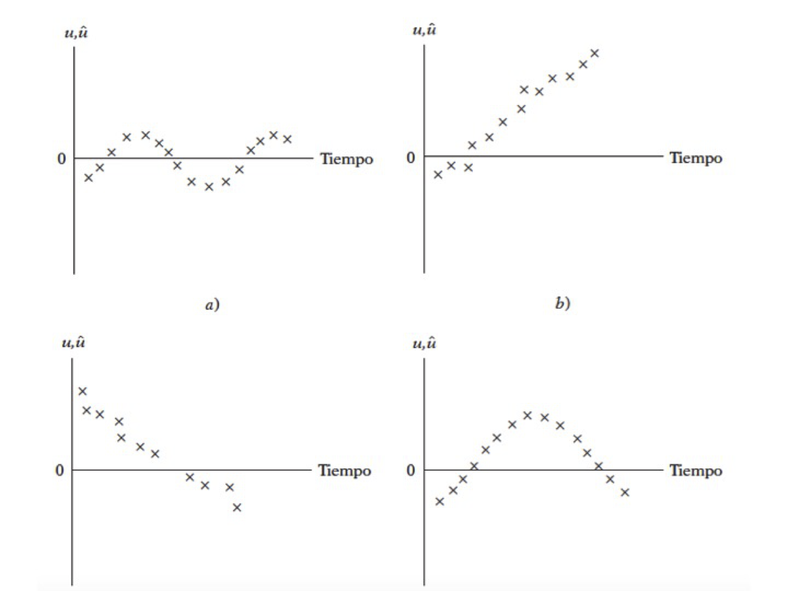

-   [RLM: Supuestos](#rlm-supuestos)
    -   [Multicolinealidad](#multicolinealidad)
    -   [Heterocedasticidad](#heterocedasticidad)
    -   [Autocorrelación](#autocorrelacion)

<!--
La revisión metodológica aquí vertida se basa en [@Wang_2012].
-->
RLM: Supuestos
==============

Multicolinealidad
-----------------

#### El problema:

$$
\\hat{\\beta}=(X'X)^{-1}X'Y
$$
 - Se tiene un problema en cuanto a la transpuesta de la matriz
(*X*′*X*)

-   Perfecta: Si se tiene este tipo, el modelo simplemente no toma en
    cuenta esta variable
-   Imperfecta: El cáclulo de la inversa es computacionalmente exigente

#### Posibles causas

-   El método de recolección de información
-   Restricciones en el modelo o en la población objeto de muestreo
-   Especificación del modelo
-   Un modelo sobredetermindado
-   Series de tiempo

#### ¿Cuál es la naturaleza de la multicolinealidad?

**Causas** - ¿Cuáles son sus consecuencias prácticas?

**Incidencia en los errores estándar y sensibilidad**

-   ¿Cómo se detecta?

**Pruebas**

#### ¿Qué medidas pueden tomarse para aliviar el problema de multicolinealidad?

-   No hacer nada
-   Eliminar variables
-   Transformación de variables
-   Añadir datos a la muestra
-   Componentes principales, factores, entre otros

#### ¿Cómo se detecta?

-   Un *R*2 elevado pero con pocas razones *t* significativas
-   Regresiones auxiliares (Pruebas de Klein)
-   Factor de inflación de la varianza
    $$
    VIF = \\frac{1}{(1-R^2)}
    $$

#### Ejemplo 1

-   Haremos uso del paquete AER
-   Abrir la tabla 10.8
-   Ajusta el modelo

donde

-   *X*1 índice implícito de deflación de precios para el
    PIB,
-   *X*2 es el PIB (en millones de dólares),
-   *X*3 número de desempleados (en miles),
-   *X*4 número de personas enlistadas en las fuerzas
    armadas,
-   *X*5 población no institucionalizada mayor de 14 años de
    edad
-   *X*6 año (igual a 1 para 1947, 2 para 1948 y 16 para
    1962).

*Y**i* = *β*0 + *β*1*X*1 + *β*2*X*2 + *β*3*X*3 + *β*4*X*4 + *β*5*X*5 + *u**i*

-   Analice los resultados

<!-- -->

    uu <- "https://raw.githubusercontent.com/vmoprojs/DataLectures/master/tabla10_8.csv"
    datos<- read.csv(url(uu),sep=";",header=TRUE)
    attach(datos)

Agreguemos el tiempo: - Las correlaciones muy altas también suelen ser
síntoma de multicolinealidad

    ajuste.2 <- lm(Y~X1+X2+X3+X4+X5+TIME)
    summary(ajuste.2)

    ## 
    ## Call:
    ## lm(formula = Y ~ X1 + X2 + X3 + X4 + X5 + TIME)
    ## 
    ## Residuals:
    ##    Min     1Q Median     3Q    Max 
    ## -381.7 -167.6   13.7  105.5  488.9 
    ## 
    ## Coefficients:
    ##               Estimate Std. Error t value Pr(>|t|)   
    ## (Intercept)  6.727e+04  2.324e+04   2.895  0.02005 * 
    ## X1          -2.051e+00  8.710e+00  -0.235  0.81974   
    ## X2          -2.733e-02  3.317e-02  -0.824  0.43385   
    ## X3          -1.952e+00  4.767e-01  -4.095  0.00346 **
    ## X4          -9.582e-01  2.162e-01  -4.432  0.00219 **
    ## X5           5.134e-02  2.340e-01   0.219  0.83181   
    ## TIME         1.585e+03  4.827e+02   3.284  0.01112 * 
    ## ---
    ## Signif. codes:  0 '***' 0.001 '**' 0.01 '*' 0.05 '.' 0.1 ' ' 1
    ## 
    ## Residual standard error: 295.6 on 8 degrees of freedom
    ## Multiple R-squared:  0.9955, Adjusted R-squared:  0.9921 
    ## F-statistic: 295.8 on 6 and 8 DF,  p-value: 6.041e-09

    cor(cbind(X1,X2,X3,X4,X5,TIME))

    ##             X1        X2         X3         X4        X5      TIME
    ## X1   1.0000000 0.9936689  0.5917342  0.4689737 0.9833160 0.9908435
    ## X2   0.9936689 1.0000000  0.5752804  0.4587780 0.9896976 0.9947890
    ## X3   0.5917342 0.5752804  1.0000000 -0.2032852 0.6747642 0.6465669
    ## X4   0.4689737 0.4587780 -0.2032852  1.0000000 0.3712428 0.4222098
    ## X5   0.9833160 0.9896976  0.6747642  0.3712428 1.0000000 0.9957420
    ## TIME 0.9908435 0.9947890  0.6465669  0.4222098 0.9957420 1.0000000

-   Prueba de Klein: Se basa en realizar regresiones auxiliares de
    *todas contra todas* las variables regresoras.
-   Si el *R*2 de la regresión aux es mayor que la global,
    esa variable regresora podría ser la que genera multicolinealidad
-   ¿Cuántas regresiones auxiliares se tiene en un modelo en general?

Regresemos una de las variables

    ajuste.3<- lm(X1~X2+X3+X4+X5+TIME)
    summary(ajuste.3)

    ## 
    ## Call:
    ## lm(formula = X1 ~ X2 + X3 + X4 + X5 + TIME)
    ## 
    ## Residuals:
    ##      Min       1Q   Median       3Q      Max 
    ## -18.8602  -4.3277  -0.3175   4.3726  14.8438 
    ## 
    ## Coefficients:
    ##               Estimate Std. Error t value Pr(>|t|)  
    ## (Intercept)  1.529e+03  7.288e+02   2.098   0.0653 .
    ## X2           2.543e-03  9.453e-04   2.690   0.0248 *
    ## X3           3.056e-02  1.514e-02   2.019   0.0742 .
    ## X4           1.011e-02  7.559e-03   1.337   0.2140  
    ## X5          -1.263e-02  7.903e-03  -1.598   0.1445  
    ## TIME        -1.621e+01  1.766e+01  -0.918   0.3826  
    ## ---
    ## Signif. codes:  0 '***' 0.001 '**' 0.01 '*' 0.05 '.' 0.1 ' ' 1
    ## 
    ## Residual standard error: 11.31 on 9 degrees of freedom
    ## Multiple R-squared:  0.9923, Adjusted R-squared:  0.9881 
    ## F-statistic: 232.5 on 5 and 9 DF,  p-value: 3.127e-09

    tolerancia<-1-0.9923

**Factor de inflación de la varianza**

Si este valor es mucho mayor que 10 y se podría concluir que si hay
multicolinealidad

    vif <- 1/tolerancia
    vif

    ## [1] 129.8701

Ahora vamos a usar el paquete `AER`:

    library(AER)

    vif1 <- vif(ajuste.2)
    Raux <- (vif1-1)/vif1
    Rglobal <- 0.9955

    Rglobal-Raux

    ##           X1           X2           X3           X4           X5 
    ##  0.003181137 -0.003829181  0.026533869  0.254649059 -0.001623122 
    ##         TIME 
    ## -0.003160352

Se podría no hacer nada ante este problema. O se puede tratar con
transformaciones. Deflactamos el PIB: `PIB_REAL <- X2/X1`

    # La variable X5 (población) 
    # esta correlacionada con el tiempo
    PIB_REAL <- X2/X1
    ajuste.4<-lm(Y~PIB_REAL+X3+X4)
    summary(ajuste.4)

    ## 
    ## Call:
    ## lm(formula = Y ~ PIB_REAL + X3 + X4)
    ## 
    ## Residuals:
    ##     Min      1Q  Median      3Q     Max 
    ## -760.29 -197.71  -53.69  234.77  603.15 
    ## 
    ## Coefficients:
    ##               Estimate Std. Error t value Pr(>|t|)    
    ## (Intercept) 42716.5646   710.1206  60.154 3.31e-15 ***
    ## PIB_REAL       72.0074     3.3286  21.633 2.30e-10 ***
    ## X3             -0.6810     0.1693  -4.023  0.00201 ** 
    ## X4             -0.8392     0.2206  -3.805  0.00292 ** 
    ## ---
    ## Signif. codes:  0 '***' 0.001 '**' 0.01 '*' 0.05 '.' 0.1 ' ' 1
    ## 
    ## Residual standard error: 389 on 11 degrees of freedom
    ## Multiple R-squared:  0.9893, Adjusted R-squared:  0.9864 
    ## F-statistic: 339.5 on 3 and 11 DF,  p-value: 4.045e-11

    vif(ajuste.4)

    ## PIB_REAL       X3       X4 
    ## 3.054580 2.346489 2.318500

    ajuste.5<-lm(Y~PIB_REAL+X3+X4)
    summary(ajuste.5)

    ## 
    ## Call:
    ## lm(formula = Y ~ PIB_REAL + X3 + X4)
    ## 
    ## Residuals:
    ##     Min      1Q  Median      3Q     Max 
    ## -760.29 -197.71  -53.69  234.77  603.15 
    ## 
    ## Coefficients:
    ##               Estimate Std. Error t value Pr(>|t|)    
    ## (Intercept) 42716.5646   710.1206  60.154 3.31e-15 ***
    ## PIB_REAL       72.0074     3.3286  21.633 2.30e-10 ***
    ## X3             -0.6810     0.1693  -4.023  0.00201 ** 
    ## X4             -0.8392     0.2206  -3.805  0.00292 ** 
    ## ---
    ## Signif. codes:  0 '***' 0.001 '**' 0.01 '*' 0.05 '.' 0.1 ' ' 1
    ## 
    ## Residual standard error: 389 on 11 degrees of freedom
    ## Multiple R-squared:  0.9893, Adjusted R-squared:  0.9864 
    ## F-statistic: 339.5 on 3 and 11 DF,  p-value: 4.045e-11

    vif(ajuste.5)

    ## PIB_REAL       X3       X4 
    ## 3.054580 2.346489 2.318500

Heterocedasticidad
------------------

Ocurre cuando la varianza no es constante.

¿Cuál es la naturaleza de la heterocedasticidad?

-   Modelos de aprendizaje de los errores: con el paso del tiempo, las
    personas cometen menos errores de comportamiento. Es decir que la
    varianza disminuye.
-   Ingreso direccional: Es probable que la varianza aumente con el
    ingreso dado que el aumento del ingreso se tiene más opciones del
    cómo disponer de él.

-   Técnicas de recolección de datos: si la técnica mejora, es probable
    que la varianza se reduzca.
-   Datos atípicos o aberrantes: Sensibilidad en las estimaciones
-   Especificaciones del modelo: Omisión de variables importantes en el
    modelo.
-   Asimentría: Surge a partir de la distribución de una o más
    regresoras en el modelo. Ejemplo: Distribución del ingreso
    *generalmente inequitativo*

#### ¿Cómo detectarla?

Método gráfico

Veamos las pruebas de detección en un ejemplo

-   Abrir la base de datos *wage1* de Wooldrigde

<!-- -->

    uu <- "https://raw.githubusercontent.com/vmoprojs/DataLectures/master/wage1.csv"
    datos <- read.csv(url(uu),header=FALSE)
    names(datos) <- c("wage",  "educ",  "exper",  "tenure",    
                   "nonwhite",  "female",   "married",  
                   "numdep",    "smsa", "northcen", "south",
                   "west",  "construc", "ndurman",  "trcommpu",
                   "trade", "services", "profserv", "profocc",
                   "clerocc",   "servocc",  "lwage",    "expersq",
                   "tenursq")
    attach(datos)

    casados = (1-female)*married  # female 1=mujer  married=1 casado
    casadas = (female)*married
    solteras = (female)*(1-married)
    solteros = (1-female)*(1-married)

-   Correr el modelo
    *l**w**a**g**e* = *β*0 + *β*1*c**a**s**a**d**o**s* + *β*2*c**a**s**a**d**a**s* + *β*3*s**o**l**t**e**r**a**s* + *β*4*e**d**u**c* + *β*5*e**x**p**e**r* + *β*6*e**x**p**e**r**s**q* + *β*7*t**e**n**u**r**e* + *β*8*t**e**n**u**r**e**s**q* + *u**i*
-   Hacer un gráfico de los valores estimados y los residuos al cuadrado

### Prueba de Breusch Pagan

-   Correr un modelo de los residuos al cuadrado regresado en las
    variables explicativas del modelo global.
    *s**q**r**e**s**i**d* = *β*0 + *β*1*c**a**s**a**d**o**s* + *β*2*c**a**s**a**d**a**s* + *β*3*s**o**l**t**e**r**a**s* + *β*4*e**d**u**c* + *β*5*e**x**p**e**r* + *β*6*e**x**p**e**r**s**q* + *β*7*t**e**n**u**r**e* + *β*8*t**e**n**u**r**e**s**q* + *u**i*
-   `bptest(objeto)`: si el pvalor es inferior a 0.05,
    `Ho: Homocedasticidad`

El códgio en R sería:

    ajuste1 <- lm(lwage~casados+casadas+solteras+educ+exper+
                      expersq+tenure+tenursq)

    summary(ajuste1)

    ## 
    ## Call:
    ## lm(formula = lwage ~ casados + casadas + solteras + educ + exper + 
    ##     expersq + tenure + tenursq)
    ## 
    ## Residuals:
    ##      Min       1Q   Median       3Q      Max 
    ## -1.89697 -0.24060 -0.02689  0.23144  1.09197 
    ## 
    ## Coefficients:
    ##               Estimate Std. Error t value Pr(>|t|)    
    ## (Intercept)  0.3213780  0.1000090   3.213 0.001393 ** 
    ## casados      0.2126756  0.0553572   3.842 0.000137 ***
    ## casadas     -0.1982677  0.0578355  -3.428 0.000656 ***
    ## solteras    -0.1103502  0.0557421  -1.980 0.048272 *  
    ## educ         0.0789103  0.0066945  11.787  < 2e-16 ***
    ## exper        0.0268006  0.0052428   5.112 4.50e-07 ***
    ## expersq     -0.0005352  0.0001104  -4.847 1.66e-06 ***
    ## tenure       0.0290875  0.0067620   4.302 2.03e-05 ***
    ## tenursq     -0.0005331  0.0002312  -2.306 0.021531 *  
    ## ---
    ## Signif. codes:  0 '***' 0.001 '**' 0.01 '*' 0.05 '.' 0.1 ' ' 1
    ## 
    ## Residual standard error: 0.3933 on 517 degrees of freedom
    ## Multiple R-squared:  0.4609, Adjusted R-squared:  0.4525 
    ## F-statistic: 55.25 on 8 and 517 DF,  p-value: < 2.2e-16

    residuos <- resid(ajuste1)
    sqresid <- residuos^2
    y_techo <- fitted(ajuste1)
    plot(y_techo,sqresid) 

    plot(fitted(ajuste1),resid(ajuste1))

    # Usando el "default" de R:
    par(mfrow=c(2,2))
    plot(ajuste1)

    par(mfrow=c(1,1))

    library(sandwich)
    library(lmtest)
    #install.packages("lmSupport")
    library(lmSupport)

    # Test para ver si hay heterocedasticidad
    residuos <- resid(ajuste1)
    sqresid <- (residuos)^2
    ajuste2 <- lm(sqresid~casados+casadas+solteras+educ+exper+expersq+tenure+tenursq)
    summary(ajuste2)

    ## 
    ## Call:
    ## lm(formula = sqresid ~ casados + casadas + solteras + educ + 
    ##     exper + expersq + tenure + tenursq)
    ## 
    ## Residuals:
    ##     Min      1Q  Median      3Q     Max 
    ## -0.2346 -0.1237 -0.0887  0.0202  3.4689 
    ## 
    ## Coefficients:
    ##               Estimate Std. Error t value Pr(>|t|)   
    ## (Intercept)  5.029e-02  6.893e-02   0.729  0.46603   
    ## casados     -4.870e-02  3.816e-02  -1.276  0.20241   
    ## casadas     -5.147e-02  3.986e-02  -1.291  0.19727   
    ## solteras     4.162e-03  3.842e-02   0.108  0.91379   
    ## educ         3.849e-03  4.614e-03   0.834  0.40462   
    ## exper        1.008e-02  3.614e-03   2.790  0.00546 **
    ## expersq     -2.071e-04  7.611e-05  -2.720  0.00674 **
    ## tenure       4.763e-04  4.661e-03   0.102  0.91864   
    ## tenursq      8.670e-05  1.594e-04   0.544  0.58672   
    ## ---
    ## Signif. codes:  0 '***' 0.001 '**' 0.01 '*' 0.05 '.' 0.1 ' ' 1
    ## 
    ## Residual standard error: 0.2711 on 517 degrees of freedom
    ## Multiple R-squared:  0.02507,    Adjusted R-squared:  0.009989 
    ## F-statistic: 1.662 on 8 and 517 DF,  p-value: 0.105

    # F =1.662 y pvalue=0.105 NO EXISTE HETEROCEDASTICIDAD
    #Breusch-Pagan test

    'bptest es igual a hettest en STATA'

    ## [1] "bptest es igual a hettest en STATA"

    bptest(ajuste1)

    ## 
    ##  studentized Breusch-Pagan test
    ## 
    ## data:  ajuste1
    ## BP = 13.189, df = 8, p-value = 0.1055

Para estimar errores robustos (como `robust` en stata):

    coeftest(ajuste1, vcovHC(ajuste1,"HC0"))

    ## 
    ## t test of coefficients:
    ## 
    ##                Estimate  Std. Error t value  Pr(>|t|)    
    ## (Intercept)  0.32137805  0.10852844  2.9612 0.0032049 ** 
    ## casados      0.21267564  0.05665095  3.7541 0.0001937 ***
    ## casadas     -0.19826765  0.05826506 -3.4029 0.0007186 ***
    ## solteras    -0.11035021  0.05662552 -1.9488 0.0518632 .  
    ## educ         0.07891029  0.00735096 10.7347 < 2.2e-16 ***
    ## exper        0.02680057  0.00509497  5.2602 2.111e-07 ***
    ## expersq     -0.00053525  0.00010543 -5.0770 5.360e-07 ***
    ## tenure       0.02908752  0.00688128  4.2270 2.800e-05 ***
    ## tenursq     -0.00053314  0.00024159 -2.2068 0.0277671 *  
    ## ---
    ## Signif. codes:  0 '***' 0.001 '**' 0.01 '*' 0.05 '.' 0.1 ' ' 1

Autocorrelación
---------------

-   ¿Cuál es la naturaleza de la autocorrelación?
-   ¿Cuáles son las consecuencias teóricas y prácticas de la
    autocorrelación?
-   ¿Cómo remediar el problema de la autocorrelación?

> *Autocorrelación:* correlación entre miembros de series de
> observaciones ordenadas en el tiempo \[como en datos de series de
> tiempo\] o en el espacio \[como en datos de corte transversal\]:

$$
E(u\_i,u\_j) \\neq 0 \\\\
i \\neq j
$$
 El supuesto es:
$$
cov(u\_i,u\_j|x\_i,x\_j)  = E(u\_i,u\_j) = 0 \\\\
i \\neq j
$$

-   Datos atípicos o aberrantes: Sensibilidad en las estimaciones
-   Especificaciones del modelo: Omisión de variables importantes en el
    modelo.
-   Asimentría: Surge a partir de la distribución de una o más
    regresoras en el modelo. Ejemplo: Distribución del ingreso
    *generalmente inequitativo*

#### Cómo detectarla sesgos de especificación

Método gráfico

 

Veamos las pruebas de detección en un ejemplo

#### Ejemplo

Abrir la `tabla 12.4`. Veamos los datos en forma gráfica, y corramos el
modelo:

-   Y, índices de remuneración real por hora
-   X, producción por hora X

<!-- -->

    uu <- "https://raw.githubusercontent.com/vmoprojs/DataLectures/master/tabla12_4.csv"
    datos1<- read.csv(url(uu), sep=";",dec=".", header=T)
    attach(datos1)

    #Indice de compensacion real (salario real)
    plot(X,Y)

    ajuste.indice<-lm(Y~X)
    summary(ajuste.indice)

    ## 
    ## Call:
    ## lm(formula = Y ~ X)
    ## 
    ## Residuals:
    ##    Min     1Q Median     3Q    Max 
    ## -5.138 -2.130  0.364  2.201  3.632 
    ## 
    ## Coefficients:
    ##             Estimate Std. Error t value Pr(>|t|)    
    ## (Intercept)  29.5192     1.9424   15.20   <2e-16 ***
    ## X             0.7137     0.0241   29.61   <2e-16 ***
    ## ---
    ## Signif. codes:  0 '***' 0.001 '**' 0.01 '*' 0.05 '.' 0.1 ' ' 1
    ## 
    ## Residual standard error: 2.676 on 38 degrees of freedom
    ## Multiple R-squared:  0.9584, Adjusted R-squared:  0.9574 
    ## F-statistic: 876.5 on 1 and 38 DF,  p-value: < 2.2e-16

Revisemos si hay autocorelación:

    residuos<- resid(ajuste.indice)
    plot(residuos,t="l",xlab="Tiempo")

    par(mfrow = c(2,2))
    plot(ajuste.indice)

    par(mfrow = c(1,1))

-   Los datos NO DEBEN TENER UN PATRON (si tienen patron, algo anda mal)
-   En este caso se tiene un curva cuadrática, el modelo podría estar
    mal especificado
-   Podría ser que el modelo no se lineal o estar correlacionado

Veamos si se trata de una función cuadrática y cúbica

    ajuste2 <- lm(Y~X+I(X^2))
    summary(ajuste2)

    ## 
    ## Call:
    ## lm(formula = Y ~ X + I(X^2))
    ## 
    ## Residuals:
    ##      Min       1Q   Median       3Q      Max 
    ## -1.58580 -0.76248  0.09209  0.68442  2.63570 
    ## 
    ## Coefficients:
    ##               Estimate Std. Error t value Pr(>|t|)    
    ## (Intercept) -1.622e+01  2.955e+00  -5.489 3.09e-06 ***
    ## X            1.949e+00  7.799e-02  24.987  < 2e-16 ***
    ## I(X^2)      -7.917e-03  4.968e-04 -15.936  < 2e-16 ***
    ## ---
    ## Signif. codes:  0 '***' 0.001 '**' 0.01 '*' 0.05 '.' 0.1 ' ' 1
    ## 
    ## Residual standard error: 0.9669 on 37 degrees of freedom
    ## Multiple R-squared:  0.9947, Adjusted R-squared:  0.9944 
    ## F-statistic:  3483 on 2 and 37 DF,  p-value: < 2.2e-16

    ajuste3 <- lm(Y~X+I(X^2)+I(X^3))
    summary(ajuste3)

    ## 
    ## Call:
    ## lm(formula = Y ~ X + I(X^2) + I(X^3))
    ## 
    ## Residuals:
    ##      Min       1Q   Median       3Q      Max 
    ## -1.63265 -0.79419  0.06568  0.66627  2.43810 
    ## 
    ## Coefficients:
    ##               Estimate Std. Error t value Pr(>|t|)    
    ## (Intercept) -2.222e+01  1.344e+01  -1.653 0.107060    
    ## X            2.196e+00  5.466e-01   4.018 0.000286 ***
    ## I(X^2)      -1.119e-02  7.178e-03  -1.559 0.127658    
    ## I(X^3)       1.398e-05  3.054e-05   0.458 0.649958    
    ## ---
    ## Signif. codes:  0 '***' 0.001 '**' 0.01 '*' 0.05 '.' 0.1 ' ' 1
    ## 
    ## Residual standard error: 0.9774 on 36 degrees of freedom
    ## Multiple R-squared:  0.9947, Adjusted R-squared:  0.9943 
    ## F-statistic:  2272 on 3 and 36 DF,  p-value: < 2.2e-16

Nos quedamos con el ajuste 2

El gráfico de los val ajustados, muestra que se ha eliminado el patron
inicial

    par(mfrow = c(2,2))
    plot(ajuste2)  

    par(mfrow = c(1,1))

    residuos2 <- resid(ajuste2)
    plot(residuos2,t="l",xlab="Tiempo")
    points(residuos2)
    abline(h=0,col="blue")

Cómo debe ser el gráfico

    aleatorios=rnorm(40,0,1)
    plot(aleatorios,t="l",xlab="Tiempo")
    points(aleatorios)
    abline(h=0,col="blue")

¿Se parece?

Ejemplo: Pruebas

> Ho: No hay autocorrelación

    dwtest(ajuste2)

    ## 
    ##  Durbin-Watson test
    ## 
    ## data:  ajuste2
    ## DW = 1.03, p-value = 0.0001178
    ## alternative hypothesis: true autocorrelation is greater than 0

¿Cuál es la conclusión?

Otra prueba:

    # Ajuste Breuch Godfrey (Ho: No hay autocorrelación)
    bgtest(ajuste2,order=4)

    ## 
    ##  Breusch-Godfrey test for serial correlation of order up to 4
    ## 
    ## data:  ajuste2
    ## LM test = 14.945, df = 4, p-value = 0.004817
