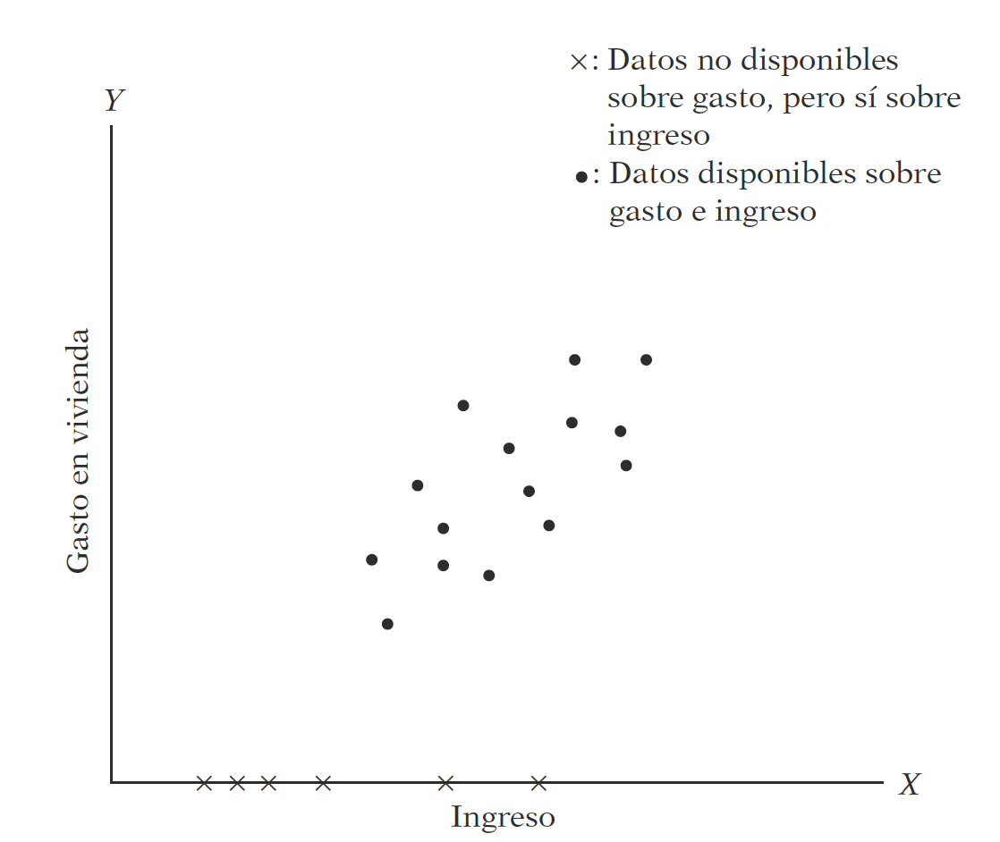

-   [Probabilidad lineal](#probabilidad-lineal)
-   [Logit](#logit)
    -   [Ejemplo 1](#ejemplo-1)
    -   [Ejemplo 2](#ejemplo-2)
-   [Probit](#probit)
    -   [Ejemplo 1](#ejemplo-1-1)
    -   [Ejemplo 2](#ejemplo-2-1)
    -   [Ejemplo 3](#ejemplo-3)
    -   [Test de Wald](#test-de-wald)
    -   [Conclusiones:](#conclusiones)
-   [Referencias](#referencias)

<!--
La revisión metodológica aquí vertida se basa en [@Wang_2012].
-->
Probabilidad lineal
===================

En este caso la variable dependiente es una dummy


Se trata de modelos del tipo:

Veamos un ejemplo: Abrir la base `MROZ` de Wooldridge y ajuste el
modelo:

*i**n**l**f* = *β*<sub>0</sub>*n**w**i**f**e**i**n**c* + *β*<sub>1</sub>*e**d**u**c* + *β*<sub>2</sub>*e**x**p**e**r* + *β*<sub>3</sub>*e**x**p**e**r**s**q* + *β*<sub>4</sub>*a**g**e* + *β*<sub>5</sub>*k**i**d**s**l**t*6 + *β*<sub>6</sub>*k**i**d**s**g**e*6

En R:

    uu <- "https://raw.githubusercontent.com/vmoprojs/DataLectures/master/mroz.csv"
    datos <- read.csv(url(uu),header=FALSE,na.strings = ".")
    # str(datos)

    # De ser necesario, quitar comentario y ejecutar:
    # datos$V1[1] <- 1
    # datos$V1 <- as.numeric(as.character(datos$V1))

    names(datos) <- c("inlf","hours",  "kidslt6", "kidsge6", 
                   "age", "educ",  "wage",    
                   "repwage",
                   "hushrs"  ,  "husage", "huseduc" ,
                   "huswage"  , "faminc", "mtr","motheduc",
                   "fatheduc" , "unem"    ,  "city"     , "exper"   ,  "nwifeinc" , "lwage" ,    "expersq" )
    attach(datos)

    reg1 <- lm(inlf~nwifeinc+educ + exper +
                expersq + age + kidslt6 + 
                kidsge6)
    summary(reg1)

    ## 
    ## Call:
    ## lm(formula = inlf ~ nwifeinc + educ + exper + expersq + age + 
    ##     kidslt6 + kidsge6)
    ## 
    ## Residuals:
    ##      Min       1Q   Median       3Q      Max 
    ## -0.93432 -0.37526  0.08833  0.34404  0.99417 
    ## 
    ## Coefficients:
    ##               Estimate Std. Error t value Pr(>|t|)    
    ## (Intercept)  0.5855192  0.1541780   3.798 0.000158 ***
    ## nwifeinc    -0.0034052  0.0014485  -2.351 0.018991 *  
    ## educ         0.0379953  0.0073760   5.151 3.32e-07 ***
    ## exper        0.0394924  0.0056727   6.962 7.38e-12 ***
    ## expersq     -0.0005963  0.0001848  -3.227 0.001306 ** 
    ## age         -0.0160908  0.0024847  -6.476 1.71e-10 ***
    ## kidslt6     -0.2618105  0.0335058  -7.814 1.89e-14 ***
    ## kidsge6      0.0130122  0.0131960   0.986 0.324415    
    ## ---
    ## Signif. codes:  0 '***' 0.001 '**' 0.01 '*' 0.05 '.' 0.1 ' ' 1
    ## 
    ## Residual standard error: 0.4271 on 745 degrees of freedom
    ## Multiple R-squared:  0.2642, Adjusted R-squared:  0.2573 
    ## F-statistic: 38.22 on 7 and 745 DF,  p-value: < 2.2e-16

¿Qué hemos ajustado?

    plot(inlf~educ)
    abline(coef(lm(inlf~educ)))


-   Excepto *kidsge6* los coeficientes son significativos.
-   Se introdujo la experiencia cuadrática para capturar un efecto
    decreciente en el efecto deseado (inlf). ¿Cómo lo interpretamos?

`.039 - 2(.0006)exper = 0.39 - .0012exper`

-   El punto en el que la experiencia ya no tiene efecto en *inlf* es
    .039/.0012 = 32.5. ¿Cuantos elementos de la muestra tienen más de 32
    años de experiencia?

Se añade exper al cuadrado porque queremos dar la posibilidad que los
años adicionales de expericnecia contribuyan con un efecto decreciente.

Trabajemos ahora con la predicción, y revisemos el resultado:

    prediccion <- predict(reg1)
    head(cbind(inlf,prediccion))

    ##   inlf prediccion
    ## 1    1  0.6636123
    ## 2    1  0.7009166
    ## 3    1  0.6727286
    ## 4    1  0.7257441
    ## 5    1  0.5616358
    ## 6    1  0.7928528

    summary(prediccion)

    ##    Min. 1st Qu.  Median    Mean 3rd Qu.    Max. 
    ## -0.3451  0.4016  0.5880  0.5684  0.7592  1.1272

¿Qué podemos notar?

-   Existen valores mayores a 1 e inferiores a 0.
-   *R*<sup>2</sup> ya no es interpretable en estas regresiones
-   Usaremos una probabilidad de ocurrencia, digamos 0.5

<!-- -->

    prediccion.inlf <- (prediccion>=0.5)*1
    head(cbind(inlf,prediccion,prediccion.inlf))

    ##   inlf prediccion prediccion.inlf
    ## 1    1  0.6636123               1
    ## 2    1  0.7009166               1
    ## 3    1  0.6727286               1
    ## 4    1  0.7257441               1
    ## 5    1  0.5616358               1
    ## 6    1  0.7928528               1

    sum(inlf)-sum(prediccion.inlf)

    ## [1] -44

-   Viendo la tabla, ¿cuál será la tasa de predicción del modelo actual?

<!-- -->

    tabla1 <- table(inlf,prediccion.inlf)
    tabla1

    ##     prediccion.inlf
    ## inlf   0   1
    ##    0 203 122
    ##    1  78 350

    porcentaje.correcto <- (tabla1[1,1]+tabla1[2,2])/length(prediccion)
    porcentaje.correcto

    ## [1] 0.7343958

Para resolver el problema anterior de los valores fuera del intervalo
0-1, se propone una función diferente.

Logit
=====

La regresión logística puede entenderse simplemente como encontrar los
parámtros *β* que mejor asjuten:

$$
y={\\begin{cases}1&\\beta\_{1}+\\beta\_{2}X\_{1}+\\cdots+\\beta\_{k}X\_{k}+u &gt;0\\\\0&{\\text{en otro caso}}\\end{cases}}
$$

Donde se asume que el error tiene una [distribución logística
estándar](https://es.wikipedia.org/wiki/Distribuci%C3%B3n_log%C3%ADstica)

$$
{\\displaystyle f(x;\\mu ,s)={\\frac {e^{-{\\frac {x-\\mu }{s}}}}{s\\left(1+e^{-{\\frac {x-\\mu }{s}}}\\right)^{2}}}={\\frac {1}{s\\left(e^{\\frac {x-\\mu }{2s}}+e^{-{\\frac {x-\\mu }{2s}}}\\right)^{2}}}={\\frac {1}{4s}}\\operatorname {sech} ^{2}\\!\\left({\\frac {x-\\mu }{2s}}\\right).}
$$
 Donde *s* es el parámetro de escala y *μ* el de locación (*sech* es la
función secante hiperbólico).

Otra forma de entender la regresión logística es a través de la función
logística:

$$
\\sigma (t)={\\frac {e^{t}}{e^{t}+1}}={\\frac {1}{1+e^{-t}}}
$$

donde *t* ∈ ℝ y 0 ≤ *σ*(*t*)≤1.

Asumiento *t* como una función lineal de una variable explicativa *x*,
tenemos:

*t* = *β*<sub>0</sub> + *β*<sub>1</sub>*x*

Ahora la función logística se puede expresar:

$$
p(x)={\\frac {1}{1+e^{-(\\beta \_{0}+\\beta \_{1}x)}}}
$$

Ten en cuenta que *p*(*x*) se interpreta como la probabilidad de que la
variable dependiente iguale a *éxito* en lugar de un *fracaso*. Está
claro que las variables de respuesta *Y*<sub>*i*</sub> no se distribuyen
de forma idéntica: $ P (Y\_ {i} = 1  mid X )$ difiere de un punto
*X*<sub>*i*</sub> a otro, aunque son independientes dado que la matriz
de diseño *X* y los parámetros compartidos *β*.

Finalmente definimos la inversa de la función logística, *g*, el
**logit** (log odds):

$$
{\\displaystyle g(p(x))=\\ln \\left({\\frac {p(x)}{1-p(x)}}\\right)=\\beta \_{0}+\\beta \_{1}x,}
$$

lo que es equivalente a:

$$
{\\frac {p(x)}{1-p(x)}}=e^{\\beta \_{0}+\\beta \_{1}x}
$$

**Interpretación**:

-   *g* es la función logit. La ecuación para *g*(*p*(*x*)) ilustra que
    el logit (es decir, log-odds o logaritmo natural de las
    probabilidades) es equivalente a la expresión de regresión lineal.
-   *l**n* denota el logaritmo natural.
-   *p*(*x*) es la probabilidad de que la variable dependiente sea igual
    a un caso, dada alguna combinación lineal de los predictores. La
    fórmula para *p*(*x*) ilustra que la probabilidad de que la variable
    dependiente iguale un caso es igual al valor de la función logística
    de la expresión de regresión lineal. Esto es importante porque
    muestra que el valor de la expresión de regresión lineal puede
    variar de infinito negativo a positivo y, sin embargo, después de la
    transformación, la expresión resultante para la probabilidad
    *p*(*x*) oscila entre 0 y 1.
-   *β*<sub>0</sub> es la intersección de la ecuación de regresión
    lineal (el valor del criterio cuando el predictor es igual a cero).
-   *β*<sub>1</sub>*x* es el coeficiente de regresión multiplicado por
    algún valor del predictor.
-   la base *e* denota la función exponencial.

<!-- \begin{eqnarray} -->
<!-- Y &=& f(\beta_{1}+\beta_{2}X_{1}+\cdots+\beta_{k}X_{k}) + u\nonumber \\ -->
<!-- f(z) &=& \frac{e^{z}}{1+e^{z}}\nonumber \\ -->
<!-- E[Y]&=& P(Y = 1) = \frac{e^{\beta_{1}+\beta_{2}X_{1}+\cdots+\beta_{k}X_{k}}}{1+e^{\beta_{1}+\beta_{2}X_{1}+\cdots+\beta_{k}X_{k}}} \nonumber -->
<!-- \end{eqnarray} -->
#### Ejemplo 1

-   Abra la base de datos `wells.dat`
-   Note que existe una variable llamada `switch`. Dado que esta palabra
    es un condicional, debemos cambiar el nombre de la variable:
    `names(datos)[1]="Switch"`
-   Realice un gráfico del cambio vs arsénico e interprete

<!-- -->

    uu <- "https://raw.githubusercontent.com/vmoprojs/DataLectures/master/wells.dat"
    datos <- read.csv(url(uu),sep="",dec=".",header=TRUE)
    names(datos)[1]="Switch"
    attach(datos)
    plot(Switch~arsenic, main="Cambio VS contenido de arsenico")


-   Corra el siguiente
    modelo:`ajuste2 <- glm(Switch ~ dist1,family=binomial(link="logit"),x=T)`
-   Donde: `dist1 <- dist/100`
-   Interpretación: Si la distancia es cero, la probabilidad de cambio
    es de 0.6, es decir 60%

<!-- -->

    dist1 <- dist/100
    ajuste2 <- glm(Switch~dist1,family=binomial(link="logit"), x = T)
    summary(ajuste2)

    ## 
    ## Call:
    ## glm(formula = Switch ~ dist1, family = binomial(link = "logit"), 
    ##     x = T)
    ## 
    ## Deviance Residuals: 
    ##     Min       1Q   Median       3Q      Max  
    ## -1.4406  -1.3058   0.9669   1.0308   1.6603  
    ## 
    ## Coefficients:
    ##             Estimate Std. Error z value Pr(>|z|)    
    ## (Intercept)  0.60596    0.06031  10.047  < 2e-16 ***
    ## dist1       -0.62188    0.09743  -6.383 1.74e-10 ***
    ## ---
    ## Signif. codes:  0 '***' 0.001 '**' 0.01 '*' 0.05 '.' 0.1 ' ' 1
    ## 
    ## (Dispersion parameter for binomial family taken to be 1)
    ## 
    ##     Null deviance: 4118.1  on 3019  degrees of freedom
    ## Residual deviance: 4076.2  on 3018  degrees of freedom
    ## AIC: 4080.2
    ## 
    ## Number of Fisher Scoring iterations: 4

-   Para la interpretación se suele usar los *efectos marginales*.
-   Instalar el paquete *erer*
-   Correr el comando:

`ea <- maBina(w = ajuste2, x.mean = T, rev.dum = TRUE) ea$out`

-   Interpretación: La probabilidad de que se cambien a un pozo seguro
    disminuye 15% en una familia que est? a una distancia de una unidad
    respecto a la distancia promedio (0.48)

<!-- -->

    library(erer)
    ea <- maBina(w = ajuste2, x.mean = TRUE, rev.dum = TRUE)
    ea$out

    ##             effect error t.value p.value
    ## (Intercept)  0.148 0.014  10.404       0
    ## dist1       -0.152 0.024  -6.382       0

-   Aunque no tan exacto, una forma de obtener los efectos marginales
    (aunque sin tanta precisión), es:

`coef(ajuste2)/4` - Interpretación: La probabilidad de que se cambien a
un pozo seguro disminuye 15% en una familia que está a una distancia de
una unidad respecto a la distancia promedio (0.48)

    coef(ajuste2)/4

    ## (Intercept)       dist1 
    ##   0.1514898  -0.1554705

-   Ajuste un nuevo modelo incluyendo la variable *arsenic*
-   Calcule los efectos marginales

<!-- -->

    ajuste3 <- glm(Switch~dist1+arsenic,family=binomial(link="logit"), x = T)
    summary(ajuste3)

    ## 
    ## Call:
    ## glm(formula = Switch ~ dist1 + arsenic, family = binomial(link = "logit"), 
    ##     x = T)
    ## 
    ## Deviance Residuals: 
    ##     Min       1Q   Median       3Q      Max  
    ## -2.6351  -1.2139   0.7786   1.0702   1.7085  
    ## 
    ## Coefficients:
    ##              Estimate Std. Error z value Pr(>|z|)    
    ## (Intercept)  0.002749   0.079448   0.035    0.972    
    ## dist1       -0.896644   0.104347  -8.593   <2e-16 ***
    ## arsenic      0.460775   0.041385  11.134   <2e-16 ***
    ## ---
    ## Signif. codes:  0 '***' 0.001 '**' 0.01 '*' 0.05 '.' 0.1 ' ' 1
    ## 
    ## (Dispersion parameter for binomial family taken to be 1)
    ## 
    ##     Null deviance: 4118.1  on 3019  degrees of freedom
    ## Residual deviance: 3930.7  on 3017  degrees of freedom
    ## AIC: 3936.7
    ## 
    ## Number of Fisher Scoring iterations: 4

    ea <- maBina(w = ajuste3, x.mean = TRUE, rev.dum = TRUE)
    ea$out

    ##             effect error t.value p.value
    ## (Intercept)  0.001 0.019   0.035   0.972
    ## dist1       -0.218 0.025  -8.598   0.000
    ## arsenic      0.112 0.010  11.217   0.000

-   Interpretación:
    -   cambio disminuye 22% para una casa que está a una unidad
        adicional de la distancia promedio.
    -   a una distancia fija, comparando un pozo de contenido de
        arsénico promedio más una unidad, la probabilidad aumenta un 11%

¿Cual de las dos variables es más importante en la decisión de cambio?

-   Se debe calcular los coeficientes estandarizados.

<!-- -->

    #este es el coeficiente estandarizado de la distancia
    d <- sd(dist1)*(-0.896644) 
    # este es el coeficiente estandarizado del ars?nico
    a <- sd(arsenic)*(0.460775) 
    abs(a);abs(d)

    ## [1] 0.5102563

    ## [1] 0.3450167

    # de modo que el arsénico es mas importante, 
    # pero para decirlo por probabilidades:

#### Ejemplo 2

Abra la tabla 15.7

-   Los datos son el efecto del Sistema de Enseñanza Personalizada (PSI)
    sobre las calificaciones.
    -   Calificación *Y* = 1 si la calificación final fue A
    -   *Y* = 0 si la calificación final fue B o C
    -   `TUCE` = calificación en un examen presentado al comienzo del
        curso para evaluar los conocimientos previos de macroeconomía
    -   `PSI` = 1 con el nuevo método de enseñanza, 0 en otro caso
    -   `GPA` = promedio de puntos de calificación inicial
-   Ajuste el siguiente modelo:
    `ajuste1 <- glm(GRADE~GPA+TUCE+PSI, family=binomial(link="logit"),x=T)`
-   Interprete el modelo

En los modelos cuya variable regresada binaria, la bondad del ajuste
tiene una importancia secundaria. Lo que interesa son los signos
esperados de los coeficientes de la regresión y su importancia práctica
y/o estadística

Importamos los datos y revisamos la variable dependiente:

    uu <- "https://raw.githubusercontent.com/vmoprojs/DataLectures/master/tabla15_7.csv"
    datos <- read.csv(url(uu),sep=";",dec=".",header=TRUE)
    attach(datos)
    table(GRADE)

    ## GRADE
    ##  0  1 
    ## 21 11

Ajustamos el modelo:

    ajuste1 <- glm(GRADE~GPA+TUCE+PSI,family=binomial(link="logit"),x=T)
    summary(ajuste1)

    ## 
    ## Call:
    ## glm(formula = GRADE ~ GPA + TUCE + PSI, family = binomial(link = "logit"), 
    ##     x = T)
    ## 
    ## Deviance Residuals: 
    ##     Min       1Q   Median       3Q      Max  
    ## -1.9551  -0.6453  -0.2570   0.5888   2.0966  
    ## 
    ## Coefficients:
    ##              Estimate Std. Error z value Pr(>|z|)   
    ## (Intercept) -13.02135    4.93127  -2.641  0.00828 **
    ## GPA           2.82611    1.26293   2.238  0.02524 * 
    ## TUCE          0.09516    0.14155   0.672  0.50143   
    ## PSI           2.37869    1.06456   2.234  0.02545 * 
    ## ---
    ## Signif. codes:  0 '***' 0.001 '**' 0.01 '*' 0.05 '.' 0.1 ' ' 1
    ## 
    ## (Dispersion parameter for binomial family taken to be 1)
    ## 
    ##     Null deviance: 41.183  on 31  degrees of freedom
    ## Residual deviance: 25.779  on 28  degrees of freedom
    ## AIC: 33.779
    ## 
    ## Number of Fisher Scoring iterations: 5

Para la interpretación:

    ea <- maBina(w = ajuste1, x.mean = TRUE, rev.dum = TRUE)
    ea$out

    ##             effect error t.value p.value
    ## (Intercept) -2.460 0.818  -3.008   0.006
    ## GPA          0.534 0.237   2.252   0.032
    ## TUCE         0.018 0.026   0.685   0.499
    ## PSI          0.456 0.181   2.521   0.018

¿Son, en conjunto, los coeficientes significativos?: Test de razón de
verosimilitud

`with(ajuste1, pchisq(null.deviance - deviance,      df.null - df.residual, lower.tail = FALSE))`

-   Odds Ratio:

`exp(coef(ajuste1))`

    # el análogo de la prueba F
    with(ajuste1, pchisq(null.deviance - deviance, df.null - df.residual, lower.tail = FALSE))

    ## [1] 0.001501879

    # Odds ratio:
    exp(coef(ajuste1))

    ##  (Intercept)          GPA         TUCE          PSI 
    ## 2.212590e-06 1.687971e+01 1.099832e+00 1.079073e+01

Esto indica que los estudiantes expuestos al nuevo método de enseñanza
son por encima de 10 veces más propensos a obtener una A que quienes no
están expuestos al nuevo método, en tanto no cambien los demás factores.

Probit
======

En los modelos logia se propuso la logística, en este caso se propone la
Función de Distribución Acumulada Normal. Suponga que la variable de
respuesta es binaria, 1 o 0. *Y* podría representar la
presencia/ausencia de una condición, éxito/fracaso, si/no. Se tiene
también un vector de regresoras *X*, el modelo toma la forma:

Pr(*Y* = 1 ∣ *X*)=*Φ*(*X*<sup>*T*</sup>*β*),

donde *P**r* es la prbabilidad y *Φ* distribución acumulada de la normal
estándar
${\\displaystyle \\Phi (x)={\\frac {1}{\\sqrt {2\\pi }}}\\int \_{-\\infty }^{x}e^{-t^{2}/2}\\,dt}$.
Los parámetros *β* se estiman típicamente con el método de máxima
verosimilitud.

#### Ejemplo 1

-   Realizamos el mismo procedimiento que en el logit
-   Abra la tabla 15.7
-   Los datos son el efecto del Sistema de Ense?anza Personalizada (PSI)
    sobre las calificaciones.
-   Ajuste el siguiente modelo:

`ajuste1 <- glm(GRADE~GPA+TUCE+PSI, family=binomial(link="probit"),x=T)`

-   Interprete el modelo

<!-- -->

    uu <- "https://raw.githubusercontent.com/vmoprojs/DataLectures/master/tabla15_7.csv"
    datos <- read.csv(url(uu),sep=";",dec=".",header=TRUE)
    attach(datos)

    ajuste2 <- glm(GRADE~GPA+TUCE+PSI,family=binomial(link="probit"),x=T)
    summary(ajuste2)

    ## 
    ## Call:
    ## glm(formula = GRADE ~ GPA + TUCE + PSI, family = binomial(link = "probit"), 
    ##     x = T)
    ## 
    ## Deviance Residuals: 
    ##     Min       1Q   Median       3Q      Max  
    ## -1.9392  -0.6508  -0.2229   0.5934   2.0451  
    ## 
    ## Coefficients:
    ##             Estimate Std. Error z value Pr(>|z|)   
    ## (Intercept) -7.45231    2.57152  -2.898  0.00376 **
    ## GPA          1.62581    0.68973   2.357  0.01841 * 
    ## TUCE         0.05173    0.08119   0.637  0.52406   
    ## PSI          1.42633    0.58695   2.430  0.01510 * 
    ## ---
    ## Signif. codes:  0 '***' 0.001 '**' 0.01 '*' 0.05 '.' 0.1 ' ' 1
    ## 
    ## (Dispersion parameter for binomial family taken to be 1)
    ## 
    ##     Null deviance: 41.183  on 31  degrees of freedom
    ## Residual deviance: 25.638  on 28  degrees of freedom
    ## AIC: 33.638
    ## 
    ## Number of Fisher Scoring iterations: 6

    ajuste3 <- glm(GRADE~GPA+PSI,family=binomial(link="probit"),x=T)
    summary(ajuste2)

    ## 
    ## Call:
    ## glm(formula = GRADE ~ GPA + TUCE + PSI, family = binomial(link = "probit"), 
    ##     x = T)
    ## 
    ## Deviance Residuals: 
    ##     Min       1Q   Median       3Q      Max  
    ## -1.9392  -0.6508  -0.2229   0.5934   2.0451  
    ## 
    ## Coefficients:
    ##             Estimate Std. Error z value Pr(>|z|)   
    ## (Intercept) -7.45231    2.57152  -2.898  0.00376 **
    ## GPA          1.62581    0.68973   2.357  0.01841 * 
    ## TUCE         0.05173    0.08119   0.637  0.52406   
    ## PSI          1.42633    0.58695   2.430  0.01510 * 
    ## ---
    ## Signif. codes:  0 '***' 0.001 '**' 0.01 '*' 0.05 '.' 0.1 ' ' 1
    ## 
    ## (Dispersion parameter for binomial family taken to be 1)
    ## 
    ##     Null deviance: 41.183  on 31  degrees of freedom
    ## Residual deviance: 25.638  on 28  degrees of freedom
    ## AIC: 33.638
    ## 
    ## Number of Fisher Scoring iterations: 6

En la media muestral de *G**P**A* de 3.117, el efecto de *P**S**I* sobre
la probabilidad es 0.465.

    library(erer)
    ea1 <- maBina(w = ajuste2, x.mean = TRUE, rev.dum = TRUE)
    ea1$out

    ##             effect error t.value p.value
    ## (Intercept) -2.445 0.765  -3.198   0.003
    ## GPA          0.533 0.227   2.353   0.026
    ## TUCE         0.017 0.026   0.645   0.524
    ## PSI          0.464 0.171   2.712   0.011

En el caso actual, el efecto marginal para PSI de 0.456 nos dice que,
para dos individuos hipotéticos con valores promedio en *G**P**A* (3.12)
y *T**U**C**E* (21.94), la probabilidad de éxito prevista es 0.456 mayor
para el individuo en *P**S**I* que para alguien que está en un aula
tradicional.

Los efectos marginales para variables continuas miden la tasa de cambio
instantáneo, que puede o no estar cerca del efecto en *P*(*Y* = 1) de un
aumento de una unidad en *X*<sub>*k*</sub>. Lo que el efecto marginal
más o menos le dice es que, si, por ejemplo, *X*<sub>*k*</sub> aumentara
en una cantidad muy pequeña (por ejemplo, 0.001), entonces *P*(*Y* = 1)
aumentaría en aproximadamente 0.001 \* 0.534 = .000534, por ejemplo.

#### Ejemplo 2

Volvamos al ejemplo del cambio debido al arsénico

    uu <- "https://raw.githubusercontent.com/vmoprojs/DataLectures/master/wells.dat"
    datos <- read.csv(url(uu),sep="",dec=".",header=TRUE)
    names(datos)[1]="Switch"
    datos$dist1 <- datos$dist/100
    ajuste1 <- glm(Switch~dist1,family=binomial(link="probit"),x=T,data = datos)
    ea <- maBina(w = ajuste1, x.mean = T, rev.dum = TRUE)
    ea$out

    ##             effect error t.value p.value
    ## (Intercept)  0.148 0.014  10.410       0
    ## dist1       -0.152 0.024  -6.419       0

Se puede apreciar que no siempre deseamos evaluar las cosas en la
*media*. En `R` se puede programar una función para este caso.
Comprobemos los resultados de la media funcionalmente.

    punt_eval<-function(x){
        t = coef(ajuste1)[1] + 
            coef(ajuste1)[2]*x 
        t
    }
    # Si quiero evaluar en la media como comprobación:
    x <- as.numeric(punt_eval(mean(datos$dist1)))
    dnorm(x,0,1)*coef(ajuste1)[2]

    ##      dist1 
    ## -0.1517748

    # Si quiero evaluar en el máximo:
    x <- as.numeric(punt_eval(max(datos$dist1)))
    dnorm(x,0,1)*coef(ajuste1)[2]

    ##      dist1 
    ## -0.0995863

#### Ejemplo 3

Se desea saber si la variable ranking es significativa en la admisión.

    rm(list=ls())
    admisiones <- read.csv(file="https://stats.idre.ucla.edu/stat/data/binary.csv", 
                          header=T, sep=",", dec=".")
    head(admisiones)

    ##   admit gre  gpa rank
    ## 1     0 380 3.61    3
    ## 2     1 660 3.67    3
    ## 3     1 800 4.00    1
    ## 4     1 640 3.19    4
    ## 5     0 520 2.93    4
    ## 6     1 760 3.00    2

    attach(admisiones)
    # estudiantes aplicando a un posgrado 1 si es admitido 0 si no
    aj.adm <- glm(admit~gre+gpa+factor(rank), 
                 family = binomial(link="probit"),x=T)           #modelo probit 
    summary(aj.adm)

    ## 
    ## Call:
    ## glm(formula = admit ~ gre + gpa + factor(rank), family = binomial(link = "probit"), 
    ##     x = T)
    ## 
    ## Deviance Residuals: 
    ##     Min       1Q   Median       3Q      Max  
    ## -1.6163  -0.8710  -0.6389   1.1560   2.1035  
    ## 
    ## Coefficients:
    ##                Estimate Std. Error z value Pr(>|z|)    
    ## (Intercept)   -2.386836   0.673946  -3.542 0.000398 ***
    ## gre            0.001376   0.000650   2.116 0.034329 *  
    ## gpa            0.477730   0.197197   2.423 0.015410 *  
    ## factor(rank)2 -0.415399   0.194977  -2.131 0.033130 *  
    ## factor(rank)3 -0.812138   0.208358  -3.898 9.71e-05 ***
    ## factor(rank)4 -0.935899   0.245272  -3.816 0.000136 ***
    ## ---
    ## Signif. codes:  0 '***' 0.001 '**' 0.01 '*' 0.05 '.' 0.1 ' ' 1
    ## 
    ## (Dispersion parameter for binomial family taken to be 1)
    ## 
    ##     Null deviance: 499.98  on 399  degrees of freedom
    ## Residual deviance: 458.41  on 394  degrees of freedom
    ## AIC: 470.41
    ## 
    ## Number of Fisher Scoring iterations: 4

Para dos individuos hipotéticos con valores promedio en *g**r**e* (580)
y *g**p**a* (3.39), la probabilidad de éxito prevista es 0.4153 menor
para el individuo en el ranking 2 que para alguien que está en el
ranking 1.

#### Test de Wald

Se usa para ver la significancia de uno o varios coeficientes del modelo
de manera conjunta. En el caso univariado, el Wald estadística es

$$
{\\displaystyle {\\frac {({\\widehat {\\theta }}-\\theta\_{0})^{2}}{\\operatorname {var} ({\\hat {\\theta }})}}}
$$

que se compara contra una distribución de chi-cuadrada.

    library(aod)
    wald.test(b=coef(aj.adm), Sigma = vcov(aj.adm), Term=4:6)

    ## Wald test:
    ## ----------
    ## 
    ## Chi-squared test:
    ## X2 = 21.4, df = 3, P(> X2) = 8.9e-05

La variable es significativa.

Encontremos las probabilidades de ser aceptado en función de algunos
datos, se obtienen de la siguiente manera:

    nuevos.datos <- data.frame(gre=c(350,450,550,650),
                              gpa=c(2.5,3,3.5,3.99), rank=factor(c(1,1,2,2)))
    nuevos.datos

    ##   gre  gpa rank
    ## 1 350 2.50    1
    ## 2 450 3.00    1
    ## 3 550 3.50    2
    ## 4 650 3.99    2

    predict(aj.adm, nuevos.datos, type="response",se.fit=T)

    ## $fit
    ##         1         2         3         4 
    ## 0.2385252 0.3689520 0.3543489 0.4992185 
    ## 
    ## $se.fit
    ##          1          2          3          4 
    ## 0.08062956 0.07428600 0.04308419 0.06150729 
    ## 
    ## $residual.scale
    ## [1] 1

#### Conclusiones:

-   Los modelos probit y logit arrojan probabilidades semejantes (en
    términos marginales)
-   La diferencia principal es que la distribución logística tiene las
    colas un poco más anchas
-   En general se prefiere usar modelos logit por su facilidad de
    implementación matemática e interpretación más rápida

<!-- # Tobit -->
<!-- Una extensión del modelo probit es el modelo tobit, desarrollado por James Tobin, economista -->
<!-- laureado con el Nobel. -->
<!-- -    Se lo conoce también como *modelos de datos censurados* -->
<!-- -    Se persigue el mismo objetivo que la regresión lineal, pero tomando en cuenta toda la muestra. -->
<!--  -->
<!-- #### Ejemplo -->
<!-- Las variables del modelo son: -->
<!-- -  $Y$: Num de relaciones extramaritales durante el año anterior  -->
<!-- -  $Z1$: 0 para mujer y 1 hombre; $Z2$: edad -->
<!-- -  $Z3$: Número de años de matrimonio  -->
<!-- -  $Z4$: 0 si no tienen hijos, 1 si tienen  -->
<!-- -  $Z5$: religiosidad en escala ascendente  -->
<!-- -  $Z6$: escolaridad; $Z7$:ocupación; $Z8$: autoevaluación del matrimonio (1 muy infeliz 5 muy feliz) -->
<!-- Abramos y exploremos los datos: -->
<!-- ```{r} -->
<!-- rm(list=ls()) -->
<!-- a <- "http://people.stern.nyu.edu/wgreene/Text/Edition7/TableF18-1.txt" -->
<!-- rex <- read.csv(file=a, sep="", dec=".") -->
<!-- attach(rex) -->
<!-- head(rex) -->
<!-- # 7 es una codificacion [4,10] -->
<!-- table(Y) -->
<!-- plot(Y~Z6) # Z6 es escolaridad -->
<!-- ``` -->
<!-- Ajustemos el modelo: -->
<!-- ```{r} -->
<!-- library(AER) -->
<!-- aj.rex = tobit(Y ~ Z1+Z2+Z3+Z4+Z5+Z6+Z7+Z8, -->
<!--                left=0,right=Inf,dist = "gaussian") -->
<!-- summary(aj.rex) -->
<!-- ``` -->
<!-- Dejemos únicamente las variables significativas: -->
<!-- ```{r} -->
<!-- aj.rex2 = tobit(Y ~ Z2+Z3+Z5+Z8,left=0,right=Inf,dist = "gaussian") -->
<!-- summary(aj.rex2) -->
<!-- ``` -->
<!-- Interpretación: El coeficiente negativo de $Z8$ (felicidad marital) significa que mientras más feliz se es, menor es la incidencia de las relaciones extramaritales. -->
Referencias
===========
