-   [Introducción](#introduccion)
    -   [¿Qué es el análisis de
        supervivencia?](#que-es-el-analisis-de-supervivencia)
    -   [Censura](#censura)
    -   [Notación](#notacion)
    -   [Funciones de
        supervivencia/riesgo](#funciones-de-supervivenciariesgo)
    -   [Relación entre funciones](#relacion-entre-funciones)
    -   [Algunas distribuciones
        comunes](#algunas-distribuciones-comunes)
-   [El estimador de Kaplan-Meyer
    (K-M)](#el-estimador-de-kaplan-meyer-k-m)
    -   [Estimando la superviviencia a través del estimador de
        K-M](#estimando-la-superviviencia-a-traves-del-estimador-de-k-m)
    -   [Intervalos de confianza puntuales para
        *S*(*t*)](#intervalos-de-confianza-puntuales-para-st)
    -   [Comparando curvas de
        supervivencia](#comparando-curvas-de-supervivencia)
    -   [Pros y contras del estimador
        K-M](#pros-y-contras-del-estimador-k-m)
-   [El modelo de riesgos proporcionales de
    Cox](#el-modelo-de-riesgos-proporcionales-de-cox)
    -   [El modelo semiparamétrico](#el-modelo-semiparametrico)
    -   [Estimación](#estimacion)
    -   [Cálculo del ratio de riesgo](#calculo-del-ratio-de-riesgo)
    -   [Test de hipótesis](#test-de-hipotesis)
    -   [Ajustando curvas de
        supervivencia](#ajustando-curvas-de-supervivencia)
    -   [¿Cómo evaluar el supuesto PH?](#como-evaluar-el-supuesto-ph)
    -   [Riesgos no proporcionales... ¿y ahora
        qué?](#riesgos-no-proporcionales...-y-ahora-que)
    -   [¿Por qué el modelo PH de Cox es tan popular? (pros del
        modelo)](#por-que-el-modelo-ph-de-cox-es-tan-popular-pros-del-modelo)
-   [Ejercicio](#ejercicio)
-   [Referencias](#referencias)

<script type="text/x-mathjax-config">
    MathJax.Hub.Config({ TeX: { equationNumbers: {autoNumber: "all"} } });
  </script>

------------------------------------------------------------------------

<!--
La revisión metodológica aquí vertida se basa en [@Wang_2012].
-->
Esta sección es principalmente una síntesis y traducción de Sestelo
(2017). En el cuerpo del material se irán citando las referencias
específicas a contenidos para profundizar algunos elementos necesatios
y/o deseados para su produndización.

Introducción
============

Esta sección de una idea general del tipo de problema abordado por el
análisis de supervivencia, la variable de resultado considerada, la
necesidad de tener en cuenta datos censurados, qué representan una
función de supervivencia y una función de riesgo, los objetivos del
análisis de supervivencia y algunos ejemplos de análisis de
supervivencia

¿Qué es el análisis de supervivencia?
-------------------------------------

De modo general, el análisis de superviviencia es una colección de
procedimientos estadísticos para el análisis de datos en los que la
variable de interés es el **tiempo hasta que ocurra un evento**, a
menudo llamado *tiempo de falla*, *tiempo de superviviencia*, o *tiempo
del evento*.

El tiempo de supervivencia ser refiere a una variable que mide el tiempo
desde un punto específico (por ejemplo, tiempo donde inicia un
tratamiento) a un punto de tiempo final de interés: **tiempo
transcurrido**.

El problema de analizar datos de tiempo transcurrido hasta el evento en
varios campos aplicados:

-   medicina, biología, salud pública (tiempo hasta fallecimiento)
-   ciencias sociales (tiempo para realizar alguna tarea)
-   economía (tiempo en buscar empleo)
-   scoring financiero o de crédito (tiempo de incumplimiento)
-   ingeniería (tiempo de falla de algún componente electrónico)

### Tiempo, tiempo de origen, escala del tiempo, evento

Para una definición precisa del tiempo de fallo (finalización) de un
individuo se necesitan tres requisitos:

-   Por **tiempo** entenderemos años, meses, semanas, o días desde el
    inicio del seguimiento a un individuo hasta que el evento de estudio
    ocurra, pero necesitamos **especificar la escala**.

-   Por **tiempo de origen** entendemos el tiempo de entrada al estudio

-   Por **evento** entendemos -dependiendo del campo de aplicación-
    muerte, incidencia de una enfermedad, recuperación (por ejemplo,
    regreso al trabajo), incumplimiento del crédito, renovación del
    seguro, fallo de equipos, etc.

En general se asume que solo **un evento** es de interés. Cuando más de
un evento es considerado (por ejemplo, muerte por diferentes causas), el
problema estadístico se caracteriza como un **evento recurrente** o
**riesgo competitivo** (veremos el caso de eventos recurrentes con
`condSURV`).

Veamos un ejemplo en un conjunto de datos real.

*[Prosper.com](https://www.prosper.com/)* es un mercado de préstamos de
pares (peer-to-peer). Los prestatarios hacen solicitudes de préstamos y
los inversionistas contribuyen con tan solo $25 para los préstamos de su
elección. Históricamente, Prosper hizo públicos sus datos de préstamos
cada noche, sin embargo, a partir de enero de 2015, la información está
disponible 45 días después del final de cada trimestre.

    loan <- read.csv("prosperLoanData.csv")
    head(loan)[, c(51, 65, 6, 7, 19, 18, 50)]

<script data-pagedtable-source type="application/json">
{"columns":[{"label":[""],"name":["_rn_"],"type":[""],"align":["left"]},{"label":["LoanKey"],"name":[1],"type":["fctr"],"align":["left"]},{"label":["LoanOriginationDate"],"name":[2],"type":["fctr"],"align":["left"]},{"label":["LoanStatus"],"name":[3],"type":["fctr"],"align":["left"]},{"label":["ClosedDate"],"name":[4],"type":["fctr"],"align":["left"]},{"label":["Occupation"],"name":[5],"type":["fctr"],"align":["left"]},{"label":["BorrowerState"],"name":[6],"type":["fctr"],"align":["left"]},{"label":["StatedMonthlyIncome"],"name":[7],"type":["dbl"],"align":["right"]}],"data":[{"1":"E33A3400205839220442E84","2":"2007-09-12 00:00:00","3":"Completed","4":"2009-08-14 00:00:00","5":"Other","6":"CO","7":"3083.333","_rn_":"1"},{"1":"9E3B37071505919926B1D82","2":"2014-03-03 00:00:00","3":"Current","4":"","5":"Professional","6":"CO","7":"6125.000","_rn_":"2"},{"1":"6954337960046817851BCB2","2":"2007-01-17 00:00:00","3":"Completed","4":"2009-12-17 00:00:00","5":"Other","6":"GA","7":"2083.333","_rn_":"3"},{"1":"A0393664465886295619C51","2":"2012-11-01 00:00:00","3":"Current","4":"","5":"Skilled Labor","6":"GA","7":"2875.000","_rn_":"4"},{"1":"A180369302188889200689E","2":"2013-09-20 00:00:00","3":"Current","4":"","5":"Executive","6":"MN","7":"9583.333","_rn_":"5"},{"1":"C3D63702273952547E79520","2":"2013-12-24 00:00:00","3":"Current","4":"","5":"Professional","6":"NM","7":"8333.333","_rn_":"6"}],"options":{"columns":{"min":{},"max":[10]},"rows":{"min":[10],"max":[10]},"pages":{}}}
  </script>

### Objetivos del análisis de superviencia

-   Estimar el tiempo transcurrido hasta un evento para un grupo de
    individuos, como tiempo de incumplimiento de un grupo de clientes.

-   Comparar el tiempo transcurrido entre dos o más grupos, como lugar
    de residencia de clientes.

-   Evaluar la relación de las covariables al tiempo transcurrido, como
    ocupación, provincia, ingreso, etc.

Censura
-------

Una característica que distingue al análisis de supervivencia es que
incorpora un fenómeno llamado **censura**. La censusa ocurre cuando
tenemos algo de información del tiempo de supervivencia de un individuo,
pero no con exactitud.

Razones para que ocurra la censura:

-   una persona no experimenta el evento antes de que termine el estudio
-   una persona se *pierde* durante el seguimiento del estudio
-   una persona se retira del estudio debido a la muerte (si la muerte
    no es el evento de interés) u otra razón.

Tendemos tres tipos de censura:

1.  **Censura por la derecha**: La censura aleatoria por la derecha
    surge a menudo en aplicaciones médicas, biológicas y financieras. En
    estos estudios, los pacientes pueden ingresar al estudio en
    diferentes momentos y el **tiempo real del evento es mayor que el
    tiempo observado**. Se presenta cuando hasta la última observación
    que se le hace al individuo, aún no ha ocurrido el evento que se
    desea observar.

Sabemos que el verdadero tiempo de supervivencia de la persona se vuelve
incompleto en el lado derecho del período de seguimiento, que ocurre
cuando finaliza el estudio o cuando la persona se pierde durante el
seguimiento o se retira. Para estos datos, el intervalo de tiempo de
supervivencia completo, que realmente no conocemos, se ha cortado (es
decir, censurado) en el lado derecho del intervalo de tiempo de
supervivencia observado. **Esta es la censura asumida en el caso de la
calificación crediticia**.

1.  **Censura por la izquierda**: El tiempo de supervivencia de un
    sujeto se considera censurado a la izquierda si es menor que el
    valor observado. Es decir, **el evento de interés ya se ha producido
    para el individuo antes del tiempo observado** (no es fácil de
    tratar). Es poco común en análisis de supervivencia, se presenta
    cuando para la primer observación que se realiza sobre el individuo,
    ya ha ocurrido el evento que se desea observar.

Por ejemplo, si seguimos a personas hasta que se vuelvan VIH positivas,
podemos registrar una falla cuando un sujeto da positivo por primera vez
en el virus. Sin embargo, es posible que no sepamos la hora exacta de la
primera exposición al virus y, por lo tanto, no sabemos exactamente
cuándo ocurrió la falla. Por lo tanto, el tiempo de supervivencia se
censura en el lado izquierdo ya que el tiempo de supervivencia real, que
finaliza en la exposición, es más corto que el tiempo de seguimiento,
que finaliza cuando la prueba del sujeto es positiva.

1.  **Censura por intervalos**: Cuando **el tiempo de supervivencia solo
    se sabe que ocurre dentro de un intervalo**. Es decir, se presenta
    cuando solo se sabe que al individuo le ocurre el evento de interés
    entre un instante *t*<sub>*i*</sub> y un tiempo *t*<sub>*j*</sub>.

Dicha censura de intervalo ocurre cuando los pacientes en un ensayo
clínico o estudio longitudinal tienen un seguimiento periódico y se sabe
que el tiempo del evento del paciente disminuye en algún intervalo. Como
ejemplo, una vez más considerando el VIH, un sujeto puede haber tenido
dos pruebas de VIH, en las que era VIH negativo en el momento de la
primera prueba (*t*<sub>1</sub>) y VIH positivo en el momento de la
segunda prueba (*t*<sub>2</sub>). En tal caso, el verdadero tiempo de
supervivencia del sujeto se produjo después del tiempo *t*<sub>1</sub> y
antes del tiempo *t*<sub>2</sub>, es decir, el sujeto está censurado por
intervalo en el intervalo de tiempo (*t*<sub>1</sub>, *t*<sub>2</sub>).


> Es importante resaltar en este contexto (tiempo hasta el
> incumplimiento) qué situaciones vamos a considerar censuradas. El
> banco tiene características especiales que no se ven en otras
> aplicaciones. Los casos censurados se consideran **préstamos que no
> experimentaron el incumplimiento en el momento de la recolección de
> datos**. Además, el reembolso anticipado y los casos maduros (o
> completos, aquellos que **alcanzan su fecha de finalización
> predefinida antes del momento de la recolección de datos**) también se
> marcan como censurados.

**Otras clasificaciones**

-   **Censura de tipo aleatorio I**: también conocida como *Censura de
    tipo I generalizada*. Cuando las personas ingresan al estudio en
    diferentes momentos y el punto terminal del estudio está
    predeterminado por el investigador, de modo que se conocen los
    tiempos de censura cuando se ingresa al estudio.

-   **Tipo II de censura**: el estudio continúa hasta la falla de los
    primeros *r* individuos, donde *r* es un entero predeterminado
    (*r* &lt; *n*). Todos los sujetos se ponen a prueba al mismo tiempo,
    y la prueba finaliza cuando *r* de los *n* sujetos ha *fallado*.

-   **Entrata tardía al estudio (truncamiento por la izquierda)**: Se
    presenta cuando el individuo comienza a observarse posteriormente al
    verdadero evento inicial.

-   **Truncamiento por la derecha**: Se presenta cuando solo se incluyen
    los individuos que presentan el evento o falla de interés.

Ver Klein and Moeschberger (2006) y Andersen et al. (2012) para más
información sobre este tema.

Notación
--------

Sea *T* una variable aleatoria que denota el tiempo de supervivencia, es
decir, el tiempo hasta que el evento ocurre. Como *T* denota tiempo, sus
valores son no negativos (mayores a cero) *T* &gt; 0. Además, *t* será
cualquier valor específico de la variable aleatoria de interés *T*.

Adicionalmente, cuando cada sujeto tiene un tiempo de censura por la
derecha aleatorio *C*<sub>*i*</sub> que es independiente del tiempo de
falla *T*<sub>*i*</sub>, los datos se representan por
(*Y*<sub>*i*</sub>, *Δ*<sub>*i*</sub>), donde
*Y*<sub>*i*</sub> = *m**i**n*(*T*<sub>*i*</sub>, *C*<sub>*i*</sub>) y
*Δ*<sub>*i*</sub> = *I*(*T*<sub>*i*</sub> ≤ *C*<sub>*i*</sub>). Este *Δ*
define una variable aleatoria (0, 1) que indica si se trata de dallo o
censura. Esto es, *Δ* = 1 para el fallo si el evento ocurre durante el
periodo del estudio, o *Δ* = 0 si el tiempo de supervivencia es
censurado por el final del periodo de estudio.

Funciones de supervivencia/riesgo
---------------------------------

Asumiendo *T* como una variable aleatoria continua no-negativa que
denota el tiempo de ocurrencia, existe una cierta probabilidad de que un
individuo tenga un evento a exactamente el tiempo *t*. Por ejemplo, en
longevidad, los seres humanos tienen cierta probabilidad de morir a las
edades 2, 20, 80 y 140, esto puede escribirse: *P*(*T* = 2),
*P*(*T* = 20), *P*(*T* = 80) y *P*(*T* = 140).

De modo similar, los seres humanos tienen cierta probabilidad de estar
vivos a esas edades: *P*(*T* &gt; 2), *P*(*T* &gt; 0), *P*(*T* &gt; 80)
y *P*(*T* &gt; 140).

Veamos un ejemplo[1] con datos reales (si deseas revisar `dplyr`, revisa
[este
post](https://cran.r-project.org/web/packages/dplyr/vignettes/dplyr.html)
):

    data <- read.table("deaths_esp.txt", header = TRUE, sep = "")
    data <- data[!data$Age == "110+", ] # para evitar errores
    data$Age_cut <- cut(as.numeric(as.character(data$Age)), 
                     breaks =  seq(0,110, 10), right = FALSE)

    library(dplyr)
    by_age <- data %>%
      group_by(Age_cut)  %>%
      summarise (sum_deaths = sum(Total, na.rm = TRUE))

    barplot(by_age$sum_deaths/sum(data$Total), names.arg = by_age$Age_cut, ylab= "Frecuencia Relativa",main = "Frecuencia Relativa por grupos de edad")


En el caso de la longevidad, la probabilidad de muerte es mayor en al
principio y al final de los años de vida (en España). Por lo tanto, es
improbable que *T* siga una distribución normal. Podemos ver que hay un
chance más alto de morir (evento de interés) a los 70's u 80's y un
chance menor a los 100's o 110's, porque pocas personas llegan a esa
edad.

La función que da la probabilidad de que ocurra el tiempo de fallo en
exactamente *t* es la función de densidad *f*(*t*):

$$
f(t) = \\underset{\\Delta t \\to 0}{lim}\\frac{P(t\\leq T&lt;t+\\Delta t)}{\\Delta t}
$$

y la función que da la probabilidad de que el tiempo de fallo ocurra
antes o exacatamente en *t* es la **función de distribución acumulada**
*F*(*t*)

*F*(*t*)=*P*(*T* ≤ *t*)=∫<sub>0</sub><sup>*t*</sup>*f*(*u*)*d**u*.

Notemos que *F*(*t*) es más interesante que *f*(*t*)... ¿por qué? Bueno,
como se dijo, **el propósito del análisis de supervivencia es estimar y
comparar experiencias de diferentes grupos** y la experiencia de
supervivencia es descrita por la función de supervivencia

*S*(*t*)=*P*(*T* &gt; *t*)=1 − *F*(*t*)

La función de supervivencia da la probabilidad de que una persona
sobreviva más de un tiempo especifico *t*: esto es, *S*(*t*) da la
probabilidad de que la variable aleatoria *T* sobrepase el tiempo
específico *t*. Algunas características importantes:

-   Es no creciente; esto es, va hacia abajo mientras aumenta *t*.
-   En *t* = 0, *S*(*t*)=*S*(0)=1; esto es, al inicio del estudio, dado
    que nadie ha experimentado el evento aún, la probabilidad de
    sobrevivir el tiempo después de cero es uno.
-   En el tiempo *t* = *i**n**f*, *S*(*t*)=*S*(*i**n**f*)=0; esto es,
    teóricamente, si tiempo del estudio aumenta indefinidamente,
    eventualmente nadie sobrevive, de modo que la curva de supervivencia
    eventualmente es igual a cero.

<!-- -->

    t <- seq(0, 110, 1)
    tdf <- pweibull(t, scale = 80, shape = 5) # weibull dist

    d <- reshape2::melt(data.frame(x = t, dist = tdf, surv = 1 - tdf), id = "x")
    library(ggplot2)
    qplot(x = x, y = value, col = variable, data = d, geom = "line", 
          ylab = "probability", xlab = "t") + 
      scale_colour_discrete(labels= c("F(t)", "S(t)"), name = "") 

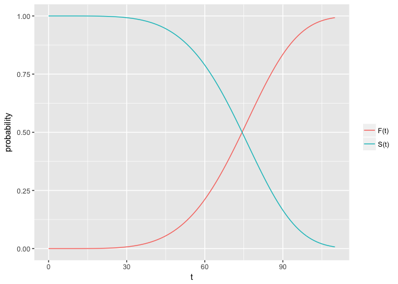

Ten en cuenta que estas son las propiedades teóricas de las curvas de
supervivencia. En la práctica, al usar datos reales, generalmente
obtenemos gráficos que son funciones de pasos, en lugar de curvas
suaves. Además, dado que el período de estudio nunca tiene una duración
infinita y puede haber riesgos competitivos para el fracaso, es posible
que no todas las personas estudiadas obtengan el evento. La función de
supervivencia estimada, $\\hat{S}(t)$ podría no llegar a cero al final
del estudio.

    by_age <- data %>%
      group_by(Age)  %>%
      summarise (sum_deaths = sum(Total, na.rm = T))
    t <- rep(as.numeric(as.character(by_age$Age)), by_age$sum_deaths) # tiempos reales

    aux <- ecdf(t)
    x <- seq(0, 110, 1)
    edf <- aux(x) # evaluanto la ecdf en algunos puntos
    esf <- 1- edf

    d <- reshape2::melt(data.frame(x = x, dist = edf, surv = esf), id = "x")
    qplot(x = x, y = value, col = variable, data = d, geom = "step", 
          ylab = "Probability", xlab = "t") + scale_colour_discrete(labels = c("F(t)", "S(t)"), name = "")

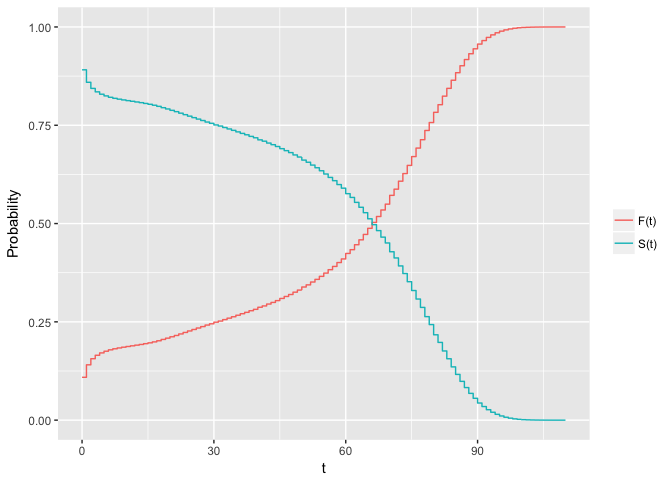

La función de riesgo (*hazard*) *h*(*t*), está dada por la fórmula:

$$
h(t) = \\underset{\\Delta t \\to 0}{lim}\\frac{P(t\\leq T&lt;t+\\Delta t|T\\geq t)}{\\Delta t}
$$
 Es difícil explicar la función de riesgo en términos prácticos.
Podríamos decir que la función de riesgo es la probabilidad de que si
sobrevives al tiempo *t*, experimentarás el evento en el próximo
instante, o en otras palabras, **la función de riesgo proporciona el
potencial instantáneo por unidad de tiempo para que ocurra el evento,
dado que el individuo ha sobrevivido hasta el tiempo *t***. Debido al
signo dado aquí, la función de riesgo a veces se denomina **tasa de
falla condicional**.

Tenga en cuenta que, a diferencia de la función de supervivencia, que se
enfoca en no fallar, la función de riesgo se enfoca en fallar, es decir,
en el evento que ocurre. Por lo tanto, en cierto sentido, se puede
considerar que la función de riesgo da el lado opuesto de la información
dada por la función de superviviencia.

Adicionalmente, en contraste con la función de supervivencia, el gráfico
de *h*(*t*) no tiene que empezar en 1 e ir a 0, en su lugar, puede
empezar en cualquier lugar e ir abajo, arriba o a cualquier lugar a
medida que aumenta el tiempo. En particular, para un valor específico de
*t*, la función de riesgo tiene las siguientes características:

-   Es siempre no negativa, igual o mayor que cero.
-   No tiene cota superior.

Finalmente, notemos que la función de riesgo puede ser expresada como la
función de densidad dividida para la función de supervivencia,
$h(t) = \\frac{f(t)}{S(t)}$:

$$
P(t \\leq T &lt; t + dt | T \\ge t) = \\frac{P(t \\leq T &lt; t + dt, T \\geq t)}{P(T \\geq t)} = \\frac{P(t \\leq T &lt; t + dt)}{P(T \\geq t)}
$$

    h <- hist(t, plot = FALSE)
    x <- h$mids
    dens <- h$density
    surv <- 1 - aux(x)
    hazard <- dens/surv
    qplot(x = x, y = hazard, geom = "line", ylab = "Probabilidad condicional de muerte",
          xlab = "Edad")

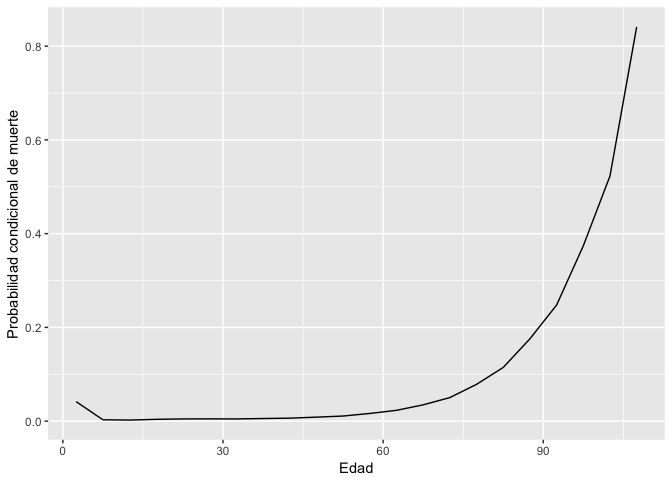

En algunos casos será de interés presentar el riesgo acumulado. Será

*H*(*t*)=∫<sub>0</sub><sup>*t*</sup>*h*(*u*)*d**u*.

> **Riesgo vs Densidad**: De acuerdo con el estudio de la longevidad
> humana, ten en cuenta que cuando naces, tienes una cierta probabilidad
> de morir a cualquier edad, que será *P*(*T* = *t*), es decir, la
> función de densidad. Una mujer nacida hoy tiene, por ejemplo, una
> probabilidad del 1% de morir a los 80 años. Sin embargo, a medida que
> sobrevive por un tiempo, sus probabilidades siguen cambiando, y estas
> nuevas probabilidades condicionales vienen dadas por la función de
> riesgo. En tal caso, tenemos una mujer que hoy tiene 79 años y tiene,
> digamos, un 7% de probabilidades de morir a los 80 años.

Relación entre funciones
------------------------

Para los modelos de supervivencia paramétrica, se supone que el tiempo
sigue alguna distribución conocida cuya función de densidad *f*(*t*)
puede expresarse en términos de parámetros desconocidos. Una vez que se
especifica una función de densidad para el tiempo de supervivencia, se
pueden determinar las funciones de supervivencia y riesgo
correspondientes.

Por ejemplo, la función de supervivencia puede determinarse a partir de
la función de densidad integrándola desde el tiempo *t* hasta el
infinito, o calculando la diferencia entre uno y la función de
distribución acumulada *F*(*t*). El riesgo se puede encontrar dividiendo
la derivada negativa de la función de supervivencia por la función de
supervivencia. Tenga en cuenta que las funciones *f*(*t*), *F*(*t*),
*h*(*t*), y *H*(*t*) están todas relacionadas.

1.  Ausmiendo que *T* es no negativa y contínua:

    -   La densidad:
        -   $f(t) = F'(t) = \\frac{dF(t)}{dt}$
    -   La distribución acumulada:
        -   *F*(*t*)=*P*(*T* ≤ *t*)=∫<sub>0</sub><sup>*t*</sup>*f*(*u*)*d**u*
    -   Función de supervivencia:
        -   *S*(*t*)=1 − *F*(*t*)
        -   *S*(*t*)=*P*(*T* &gt; *t*)=∫<sub>*t*</sub><sup>+∞</sup>*f*(*u*)*d**u*
        -   *S*(*t*)=*e**x**p*(−∫<sub>0</sub><sup>*t*</sup>*h*(*u*)*d**u*)
        -   *S*(*t*)=*e**x**p*(−∫<sub>0</sub><sup>*t*</sup>*h*(*u*)*d**u*)
    -   Función de riesgo:
        -   $h(t) = \\frac{ f(t)}{S(t)}= \\frac{ -d\[S(t)\]/dt}{S(t)}$
    -   Riesgo acumulado:
        -   *H*(*t*)=∫<sub>0</sub><sup>*t*</sup>*h*(*u*)*d**u*

2.  Ausmiendo que *T* es no negativa y discreta:

    -   La función de probabilidad:
        -   *p*(*t*<sub>*i*</sub>)=*P*(*T* = *t*<sub>*i*</sub>)
        -   *p*(*t*<sub>*i*</sub>)=*S*(*t*<sub>*i* − 1</sub>)−*S*(*t*<sub>*i*</sub>)
        -   *p*(*t*<sub>*i*</sub>)=*F*(*t*<sub>*i*</sub>)−*F*(*t*<sub>*i* − 1</sub>)
    -   La distribución acumulada:
        -   *F*(*t*)=*P*(*T* ≤ *t*)=∑<sub>*t*<sub>*i*</sub> ≤ *t*</sub>*p*(*t*<sub>*i*</sub>)
    -   Función de supervivencia:
        -   *S*(*t*)=∏<sub>*t*<sub>*i*</sub> ≤ *t*</sub>(1−*h*(*t*<sub>*i*</sub>))
    -   Función de riesgo:
        -   $h(t) = \\frac{ p(t\_i)}{S(t\_{i-1})}= \\frac{ -d\[S(t)\]/dt}{S(t)}$
        -   $h(t) = 1- \\frac{ S(t\_i)}{S(t\_{i-1})}$
    -   Riesgo acumulado:
        -   *H*(*t*)=∑<sub>*t*<sub>*i*</sub> ≤ *t*</sub>*h*(*t*<sub>*i*</sub>)

Algunas distribuciones comunes
------------------------------

<table style="width:82%;">
<colgroup>
<col width="13%" />
<col width="30%" />
<col width="37%" />
</colgroup>
<thead>
<tr class="header">
<th>Definición</th>
<th>Funciones</th>
<th>Medidas</th>
</tr>
</thead>
<tbody>
<tr class="odd">
<td></td>
<td><span class="math inline"><em>f</em>(<em>t</em>)=<em>λ</em><em>e</em><em>x</em><em>p</em>(−<em>λ</em><em>t</em>)</span>, <span class="math inline"><em>t</em> ≥ 0</span>,<span class="math inline"><em>λ</em> &gt; 0</span></td>
<td></td>
</tr>
<tr class="even">
<td>Exponencial</td>
<td><span class="math inline"><em>F</em>(<em>t</em>)=1 − <em>e</em><em>x</em><em>p</em>(−<em>λ</em><em>t</em>)</span></td>
<td><span class="math inline">$E(T)=\int_0^{+\infty}uf(u) du= \frac{1}{\lambda}$</span></td>
</tr>
<tr class="odd">
<td><span class="math inline"><em>T</em> ∼ <em>E</em><em>x</em><em>p</em>(<em>λ</em>)</span></td>
<td><span class="math inline"><em>S</em>(<em>t</em>)=<em>e</em><em>x</em><em>p</em>(−<em>λ</em><em>t</em>)</span></td>
<td><span class="math inline">$Var(T)=E(T^2)-E(T)^2 = \ldots = \frac{1}{\lambda^2}$</span></td>
</tr>
<tr class="even">
<td></td>
<td><span class="math inline"><em>h</em>(<em>t</em>)=<em>λ</em></span></td>
<td></td>
</tr>
<tr class="odd">
<td></td>
<td><span class="math inline"><em>H</em>(<em>t</em>)=<em>λ</em><em>t</em></span></td>
<td></td>
</tr>
<tr class="even">
<td></td>
<td></td>
<td></td>
</tr>
<tr class="odd">
<td></td>
<td><span class="math inline">$f(t)=\frac{a}{b} (\frac{t}{b})^{a-1} exp^{-\left(\frac{t} {b} \right)^a}$</span>, <span class="math inline"><em>t</em> ≥ 0</span>,<span class="math inline"><em>a</em>, <em>b</em> &gt; 0</span></td>
<td><span class="math inline">$E(T)=b\Gamma \left(1+ \frac{1}{a}\right)$</span></td>
</tr>
<tr class="even">
<td>Weibull</td>
<td><span class="math inline">$F(t)= 1-exp^{- \left(\frac{t}{b} \right)^a}$</span></td>
<td><span class="math inline">$Var(T) = b^2 \Gamma \left(1+ \frac{2}{a}\right) - b^2 \left [ \Gamma \left(1+ \frac{1}{a}\right)\right]^2$</span></td>
</tr>
<tr class="odd">
<td><span class="math inline"><em>T</em> ∼ <em>W</em><em>e</em><em>i</em><em>b</em>(<em>a</em>, <em>b</em>)</span></td>
<td><span class="math inline">$S(t)=exp^{-\left( \frac{t}{b} \right)^a}$</span></td>
<td>donde <span class="math inline"><em>Γ</em>(<em>k</em>)</span> es la función gamma.</td>
</tr>
<tr class="even">
<td><span class="math inline"><em>a</em></span> es la forma y <span class="math inline"><em>b</em></span> la escala</td>
<td><span class="math inline"><em>h</em>(<em>t</em>)=<em>a</em><em>b</em><sup>−<em>a</em></sup><em>t</em><sup><em>a</em> − 1</sup></span></td>
<td><span class="math inline"><em>Γ</em>(<em>k</em>)=∫<sub>0</sub><sup>+∞</sup><em>u</em><sup><em>k</em> − 1</sup><em>e</em><em>x</em><em>p</em><sup>−<em>u</em></sup><em>d</em><em>u</em></span></td>
</tr>
<tr class="odd">
<td></td>
<td><span class="math inline">$H(t)=(\frac{t} {b})^a$</span></td>
<td></td>
</tr>
</tbody>
</table>

Hay más distribuciones como la Log-Normal, Log-logística, Pareto,
Rayleigh, Gomptertz, etc. Para más detalles ver
(<http://data.princeton.edu/pop509/ParametricSurvival.pdf>).

El estimador de Kaplan-Meyer (K-M)
==================================

Una vez que hemos explicado qué es la curva de supervivencia y otras
cuestiones introductorias, avanzamos en la estimación. Tenga en cuenta
que podemos estimar la función de supervivencia (o riesgo) de dos
maneras:

-   especificando un modelo paramétrico *λ*(*t*) basado en una densidad
    particular *f*(*t*) (estimación paramétrica)
-   desarrollando una estimación empírica de la función de supervivencia
    (estimación no paramétrica)

Esta sección describe cómo trazar e interpretar datos de supervivencia
utilizando el estimador de Kaplan-Meier (KM) (no paramétrico) y cómo
probar si dos o más curvas de KM son equivalentes usando la prueba de
*log-rank*. También se describen pruebas alternativas para la prueba de
log-rank. Además, se proporcionan métodos para calcular (1 − *α*)%
intervalos de confianza para una curva KM.

Estimando la superviviencia a través del estimador de K-M
---------------------------------------------------------

Si no hay observaciones censuradas en la muestra de dimensión *n*, el
estimador natural de supervivencia es el estimador empírico, dado por:

$$
\\hat {S}(t) = P(T &gt; t) = \\frac{1}{n} \\sum\_{i=1}^{n} I(t\_i &gt; t)
$$

esto es, la proporción de observaciones con tiempo de fallo mayor que
*t*.

    x <- c(1, 1, 2, 2, 3, 4, 4, 5, 5, 8, 8, 8, 8, 11, 11, 12, 12, 15, 17, 22, 23)
    sum(x > 8)/length(x) # hat S(8) 

    ## [1] 0.3809524

    sum(x > 12)/length(x) # hat S(12) 

    ## [1] 0.1904762

Otra opción para estimar la supervivencia puede ser el riesgo:

$$
\\hat S(t) = \\prod\_{k = 1}^{t-1} \\bigg \[ 1- \\hat \\lambda(k)\\bigg\] \\quad {\\text{where}} \\quad  \\hat \\lambda(t) = \\frac{\\sum\_{i=1}^{n} I(Y\_i = t)}{\\sum\_{i=1}^{n} I (Y\_i \\geq t)}
$$

Nota que $\\hat \\lambda(t)$ se obtiene como el número de individuos que
mueren en el tiempo *t* dividido para el número de individuos que
sobreviven en *t*, el número de individuos en riesgo en *t* (usando la
muerte del inidividuo como el evento de estudio).

Sin embargo, otros métodos se necesitan para incorporar la censura.

    #  pre proceso de datos
    head(loan)[, c(51, 65, 6, 7, 19, 18, 50)]

<script data-pagedtable-source type="application/json">
{"columns":[{"label":[""],"name":["_rn_"],"type":[""],"align":["left"]},{"label":["LoanKey"],"name":[1],"type":["fctr"],"align":["left"]},{"label":["LoanOriginationDate"],"name":[2],"type":["fctr"],"align":["left"]},{"label":["LoanStatus"],"name":[3],"type":["fctr"],"align":["left"]},{"label":["ClosedDate"],"name":[4],"type":["fctr"],"align":["left"]},{"label":["Occupation"],"name":[5],"type":["fctr"],"align":["left"]},{"label":["BorrowerState"],"name":[6],"type":["fctr"],"align":["left"]},{"label":["StatedMonthlyIncome"],"name":[7],"type":["dbl"],"align":["right"]}],"data":[{"1":"E33A3400205839220442E84","2":"2007-09-12 00:00:00","3":"Completed","4":"2009-08-14 00:00:00","5":"Other","6":"CO","7":"3083.333","_rn_":"1"},{"1":"9E3B37071505919926B1D82","2":"2014-03-03 00:00:00","3":"Current","4":"","5":"Professional","6":"CO","7":"6125.000","_rn_":"2"},{"1":"6954337960046817851BCB2","2":"2007-01-17 00:00:00","3":"Completed","4":"2009-12-17 00:00:00","5":"Other","6":"GA","7":"2083.333","_rn_":"3"},{"1":"A0393664465886295619C51","2":"2012-11-01 00:00:00","3":"Current","4":"","5":"Skilled Labor","6":"GA","7":"2875.000","_rn_":"4"},{"1":"A180369302188889200689E","2":"2013-09-20 00:00:00","3":"Current","4":"","5":"Executive","6":"MN","7":"9583.333","_rn_":"5"},{"1":"C3D63702273952547E79520","2":"2013-12-24 00:00:00","3":"Current","4":"","5":"Professional","6":"NM","7":"8333.333","_rn_":"6"}],"options":{"columns":{"min":{},"max":[10]},"rows":{"min":[10],"max":[10]},"pages":{}}}
  </script>

    table(loan$LoanStatus)

    ## 
    ##              Cancelled             Chargedoff              Completed 
    ##                      5                  11992                  38074 
    ##                Current              Defaulted FinalPaymentInProgress 
    ##                  56576                   5018                    205 
    ##   Past Due (>120 days)   Past Due (1-15 days)  Past Due (16-30 days) 
    ##                     16                    806                    265 
    ##  Past Due (31-60 days)  Past Due (61-90 days) Past Due (91-120 days) 
    ##                    363                    313                    304

    # eliminando duplicados
    loan_nd <- loan[unique(loan$LoanKey), ] 

    # elimnando LoanStatus no necesitados
    sel_status  <- loan_nd$LoanStatus %in% c("Completed", "Current", 
                                              "ChargedOff", "Defaulted", 
                                              "Cancelled")
    loan_filtered <- loan_nd[sel_status, ]

    # creando una variable de estado para la censura
    loan_filtered$status <- ifelse(
      loan_filtered$LoanStatus == "Defaulted" |
        loan_filtered$LoanStatus == "Chargedoff",  1, 0)

    # añadiendo la fecha final al estado "actual"
    head(levels(loan_filtered$ClosedDate))

    ## [1] ""                    "2005-11-25 00:00:00" "2005-11-29 00:00:00"
    ## [4] "2005-11-30 00:00:00" "2005-12-08 00:00:00" "2005-12-28 00:00:00"

    levels(loan_filtered$ClosedDate)[1] <- "2014-11-03 00:00:00"

    # creando variable de tiempo transcurrido
    loan_filtered$start <- as.Date(loan_filtered$LoanOriginationDate)
    loan_filtered$end <- as.Date(loan_filtered$ClosedDate)
    loan_filtered$time <- as.numeric(difftime(loan_filtered$end, loan_filtered$start, units = "days"))

    # hay un error en los datos (tiempo transcurrido menor a 0)
    loan_filtered <- loan_filtered[-loan_filtered$time < 0, ]

    # solo se considera un año de creación de préstamos:
    ii <- format(as.Date(loan_filtered$LoanOriginationDate),'%Y') %in% c("2006")
    loan_filtered <- loan_filtered[ii, ] 

    dim(loan_filtered)

    ## [1] 4923   85

    head(loan_filtered)[, c(51, 65, 6, 7, 19, 18, 50, 83, 84, 85)]

<script data-pagedtable-source type="application/json">
{"columns":[{"label":[""],"name":["_rn_"],"type":[""],"align":["left"]},{"label":["LoanKey"],"name":[1],"type":["fctr"],"align":["left"]},{"label":["LoanOriginationDate"],"name":[2],"type":["fctr"],"align":["left"]},{"label":["LoanStatus"],"name":[3],"type":["fctr"],"align":["left"]},{"label":["ClosedDate"],"name":[4],"type":["fctr"],"align":["left"]},{"label":["Occupation"],"name":[5],"type":["fctr"],"align":["left"]},{"label":["BorrowerState"],"name":[6],"type":["fctr"],"align":["left"]},{"label":["StatedMonthlyIncome"],"name":[7],"type":["dbl"],"align":["right"]},{"label":["start"],"name":[8],"type":["date"],"align":["right"]},{"label":["end"],"name":[9],"type":["date"],"align":["right"]},{"label":["time"],"name":[10],"type":["dbl"],"align":["right"]}],"data":[{"1":"569F3376160094112B0CCBC","2":"2006-12-07 00:00:00","3":"Completed","4":"2009-07-27 00:00:00","5":"Professional","6":"","7":"4534.250","8":"2006-12-07","9":"2009-07-27","10":"963","_rn_":"55706"},{"1":"E3C433749566192177F6A25","2":"2006-11-21 00:00:00","3":"Completed","4":"2008-07-03 00:00:00","5":"Other","6":"","7":"3833.333","8":"2006-11-21","9":"2008-07-03","10":"590","_rn_":"5258"},{"1":"3E5A33783711441966A924A","2":"2006-12-29 00:00:00","3":"Completed","4":"2009-12-29 00:00:00","5":"Doctor","6":"","7":"18083.333","8":"2006-12-29","9":"2009-12-29","10":"1096","_rn_":"64330"},{"1":"AC4533744391314602B8E3A","2":"2006-12-07 00:00:00","3":"Completed","4":"2008-11-21 00:00:00","5":"Other","6":"IN","7":"4576.000","8":"2006-12-07","9":"2008-11-21","10":"715","_rn_":"1485"},{"1":"08B63364821540522E94FD2","2":"2006-06-13 00:00:00","3":"Completed","4":"2007-09-05 00:00:00","5":"","6":"","7":"3458.333","8":"2006-06-13","9":"2007-09-05","10":"449","_rn_":"22540"},{"1":"31C9337247671326054DF29","2":"2006-11-03 00:00:00","3":"Completed","4":"2009-11-03 00:00:00","5":"Professional","6":"IN","7":"15666.667","8":"2006-11-03","9":"2009-11-03","10":"1096","_rn_":"50637"}],"options":{"columns":{"min":{},"max":[10]},"rows":{"min":[10],"max":[10]},"pages":{}}}
  </script>

    # estado de censura 0 = censurado, 1 = no cesurado (default)
    table(loan_filtered$status)

    ## 
    ##    0    1 
    ## 3560 1363

    prop.table(table(loan_filtered$status))

    ## 
    ##         0         1 
    ## 0.7231363 0.2768637

    # mediana del tiempo hasta incumplimiento (tomando en cuenta solo datos no censusados)
    median(loan_filtered$time[loan_filtered$status==1])  # Estamos sub estimando!

    ## [1] 333

    #  mediana del tiempo hasta incumplimiento (con todos los datos)
    mean(loan_filtered$time)  # Tambien estamos sub estimando la mediana de supervivencia

    ## [1] 633.4331

    # (en tiempos censurados, el tiempo real es mayor)

Kaplan and Meier (1958) desarrollaron un estimador no paramétrico de la
función de supervivencia:

$$
\\hat S(t) = P(T &gt; t) = \\prod\_{i:t\_i \\le t} \\bigg\[1-\\frac{d\_i}{n\_i} \\bigg\]
$$
 donde *t*<sub>1</sub>, *t*<sub>2</sub>, …, *t*<sub>*n*</sub> son los
tiempos observados, *d*<sub>*i*</sub> es el número de eventos al tiempo
*t*<sub>*i*</sub>, y *n*<sub>*i*</sub> es el número de individuos en
riesgo al tiempo *t*<sub>*i*</sub> (esto es, la muestra original menos
todos aquellos que tuvieron el evento antes de *t*<sub>*j*</sub>).

Note que $\\frac{d\_i}{n\_i}$ es la proporción de fracaso en el tiempo
*t*<sub>*i*</sub> y $1-\\frac{d\_i}{n\_i}$ es la proporción de
supervivencia en *t*<sub>*j*</sub>.

La estimación de Kaplan-Meier es una función escalonada con saltos en
los momentos del evento. El tamaño de los pasos depende de la cantidad
de eventos y la cantidad de personas en riesgo en el momento
correspondiente. Tenga en cuenta que si los últimos datos son
censurados, el estimador no alcanzará el valor cero.

    library(survival)
    km <- survfit(Surv(time, status) ~ 1, data = loan_filtered)
    km  # podemos ver la media correctamente estimada

    ## Call: survfit(formula = Surv(time, status) ~ 1, data = loan_filtered)
    ## 
    ##       n  events  median 0.95LCL 0.95UCL 
    ##    4923    1363    1189    1158    1217

    print(km, print.rmean = TRUE)

    ## Call: survfit(formula = Surv(time, status) ~ 1, data = loan_filtered)
    ## 
    ##          n     events     *rmean *se(rmean)     median    0.95LCL 
    ##    4923.00    1363.00     926.53       6.85    1189.00    1158.00 
    ##    0.95UCL 
    ##    1217.00 
    ##     * restricted mean with upper limit =  1224

### Otra representación

Asumamos que $\\widetilde T\_i = min (T\_i, C\_i)$ y
*Δ*<sub>*i*</sub> = *I*(*T*<sub>*i*</sub> ≤ *C*<sub>*i*</sub>),
introducimos una representación de media ponderada del estimador K-M que
será usado adelante para la función de supervivencia condicionada:

$$
\\widehat S(y)=1-\\sum\_{i=1}^{n}W\_{i}I(\\widetilde T\_{(i)}\\leq y),
$$

donde
$\\widetilde T\_{\\left( 1\\right) }\\leq ...\\leq \\widetilde T\_{\\left( n\\right) }$
denota una $\\widetilde T$ muestra y

$$
W\_{i}=\\frac{\\Delta\_{\\left\[ i\\right\] }}{n-i+1}\\prod\_{j=1}^{i-1}\\left\[ 1-\\frac{%
\\Delta \_{\\left\[ j\\right\] }}{n-j+1}\\right\]
$$

es la ponderación K-M de $\\widetilde T\_{(i)}$. En la expresión de
*W*<sub>*i*</sub>, la notación *Δ*<sub>\[*i*\]</sub> es usada para el
iésimo valor concomitante del indicador de censura (esto es,
*Δ*<sub>\[*i*\]</sub> = *Δ*<sub>*j*</sub> si
$\\widetilde T\_{\\left( i\\right) }=\\widetilde T\_{j}$).

Intervalos de confianza puntuales para *S*(*t*)
-----------------------------------------------

Para los intervalos de confianza se puede usar el estimador de
*Greenwood* Greenwood and others (1926). La estimación de varianza de
Greenwood para la curva K-M se define como:

$$
\\hat \\sigma^2\[\\hat S(t)\] = \\widehat var\[\\hat S(t)\] = \\hat S(t)^2 \\sum\_{i:t\_i \\leq t} \\frac{d\_i}{n\_i(n\_i-d\_i)}
$$

Es posible usar este estimador para generar intervalos de confianza para
todos los puntos *t*. Asumiendo normalidad asintótica
($\\hat S(t) \\simeq N(\\hat S(t), \\sigma(t)/\\sqrt(n))$) y *σ* notando
la desviación estándar, los intervalos de confianza de la función de
supervivencia se calculan como (plain):

$$
\\bigg(\\hat S(t) \\pm z\_{1-\\alpha/2}  \\cdot \\hat \\sigma/\\sqrt(n) \\bigg),
$$

donde $\\hat \\sigma = se(\\hat S(t))$ es calculado usando la fórmula de
Greenwood.

Es importante resaltar que el intervalo de confianza puede estar fuera
del intervalo (0, 1). Para resolver esto, la aproximación a la normal es
mejorada usando una transformación **log-menos-log**

$$
\\bigg(\\hat S(t) \\pm e^{z\_{1-\\alpha/2}  \\cdot  \\frac{\\hat\\sigma}{\\hat S(t) ln \\hat S(t)}} \\bigg).
$$

Otras opciones incluyen la transformación log

$$
\\exp \\bigg( \\ln(\\hat S(t)) \\pm z\_{1-\\alpha/2}  \\cdot \\hat\\sigma/ \\hat S(t)  \\bigg).
$$

En `R` podemos escoger estas opciones como: `log` (valor por defecto),
`log-log` y `plain`.

    km1 <- survfit(Surv(time, status) ~ 1, data = loan_filtered) # conf.type = "log" (default) 
    summary(km1, times = c(200, 1100))

    ## Call: survfit(formula = Surv(time, status) ~ 1, data = loan_filtered)
    ## 
    ##  time n.risk n.event survival std.err lower 95% CI upper 95% CI
    ##   200   4207     201    0.955 0.00309        0.949        0.961
    ##  1100    143    1130    0.626 0.01369        0.600        0.653

    km2 <- survfit(Surv(time, status) ~ 1, data = loan_filtered, conf.type = "plain") 
    summary(km2, times = c(200, 1100))

    ## Call: survfit(formula = Surv(time, status) ~ 1, data = loan_filtered, 
    ##     conf.type = "plain")
    ## 
    ##  time n.risk n.event survival std.err lower 95% CI upper 95% CI
    ##   200   4207     201    0.955 0.00309        0.949        0.961
    ##  1100    143    1130    0.626 0.01369        0.599        0.653

    km3 <- survfit(Surv(time, status) ~ 1, data = loan_filtered, conf.type = "log-log") 
    summary(km3, times = c(200, 1100))

    ## Call: survfit(formula = Surv(time, status) ~ 1, data = loan_filtered, 
    ##     conf.type = "log-log")
    ## 
    ##  time n.risk n.event survival std.err lower 95% CI upper 95% CI
    ##   200   4207     201    0.955 0.00309        0.949        0.961
    ##  1100    143    1130    0.626 0.01369        0.598        0.652

> mira los argumentos `times` y `censored` de la función
> `summary.survfit`

Comparando curvas de supervivencia
----------------------------------

Como hemos visto antes, podemos utilizar la función `survfit` para
obtener el estimador de Kaplan-Meier teniendo en cuenta los datos
censurados. Además, es posible incluir un factor en el modelo y obtener
la supervivencia estimada para cada uno de los niveles del factor.

    model <- survfit(Surv(time, status) ~ IsBorrowerHomeowner, data = loan_filtered)
    plot(model, ylab = "Supervivencia", xlab = "Tiempo (en días)", col = 1:2, mark.time = TRUE)
    legend("topright", col = 1:2, legend =
             levels(factor(lung$sex)), 
           bty = "n", pch = 19)

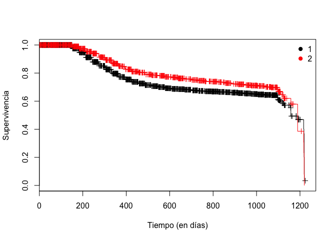

Ahora, las preguntas que surgen es si **estas dos curvas son
estadísticamente equivalentes**. Para responderlo, podemos usar la
prueba de *log-rank* (Mantel (1966), R. Peto and Peto (1972)). Este es
el método más conocido y ampliamente utilizado para probar la
**hipótesis nula de que no hay diferencia en la supervivencia entre dos
o más grupos independientes**. Es una prueba de chi cuadrado de muestra
grande que se obtiene al construir una tabla de contingencia de dos por
dos en cada tiempo de evento, y al comparar las tasas de falla entre los
dos grupos, condicionadas al número en riesgo en cada grupo. La prueba
compara toda la experiencia de supervivencia entre grupos y puede
considerarse como una prueba de si las curvas de supervivencia son
idénticas o no.

> Cuando declaramos que dos curvas KM son estadísticamente equivalentes,
> nos referimos a que, en base a un procedimiento de prueba que compara
> las dos curvas en un sentido general, no tenemos evidencia que indique
> que las curvas de supervivencia verdadera (población) sean diferentes.

La hipótesis nula de la prueba ***H*<sub>0</sub> es que no hay
diferencias entre las dos (o *k*) curvas**. Bajo esta *H*<sub>0</sub>,
el estadístico log-rank sigue aproximadamente una distribución
chi-cuadrado con *k* − 1 grados de libertad. De modo que se usa esta
distribución para determinar los valores p.

Esta prueba es la que tiene más poder para probar las diferencias que se
ajustan al modelo de riesgos proporcionales, por lo que funciona bien
como un `setup` para la posterior regresión de Cox. Da igual importancia
a las fallas tempranas y tardías.

Una prueba alternativa que se usa a menudo es la modificación de R. Peto
and Peto (1972) de la prueba de Gehan (1965). Esta última es una
variación del estadístico de prueba de log-rank y se obtiene aplicando
diferentes ponderaciones en el *f*-ésimo momento de falla. Este enfoque
es más sensible a las diferencias tempranas (o puntos temporales
anteriores) entre la supervivencia.

Este tipo de ponderación puede utilizarse para evaluar si el efecto de
una campaña de marketing/tratamiento sobre la supervivencia es más
fuerte en las fases anteriores de administración/contacto y tiende a ser
menos eficaz a lo largo del tiempo.

En ausencia de censura, estos métodos se reducen a la prueba de suma de
rangos de Wilcoxon-Mann-Whitney Mann and Whitney (1947) para dos
muestras y a la prueba de Kruskal-Wallis Kruskal and Wallis (1952) para
más de dos grupos de supervivencia.

La prueba de log-rank y la de Peto se pueden realizar con el comando
`survdiff` de la librería `survival`

    survdiff(Surv(time, status) ~ IsBorrowerHomeowner, data = loan_filtered, rho = 0) # log-rank

    ## Call:
    ## survdiff(formula = Surv(time, status) ~ IsBorrowerHomeowner, 
    ##     data = loan_filtered, rho = 0)
    ## 
    ##                              N Observed Expected (O-E)^2/E (O-E)^2/V
    ## IsBorrowerHomeowner=False 3342     1001      926      6.13      19.4
    ## IsBorrowerHomeowner=True  1581      362      437     12.98      19.4
    ## 
    ##  Chisq= 19.4  on 1 degrees of freedom, p= 1.04e-05

    survdiff(Surv(time, status) ~ IsBorrowerHomeowner, data = loan_filtered, rho = 1)# peto & peto

    ## Call:
    ## survdiff(formula = Surv(time, status) ~ IsBorrowerHomeowner, 
    ##     data = loan_filtered, rho = 1)
    ## 
    ##                              N Observed Expected (O-E)^2/E (O-E)^2/V
    ## IsBorrowerHomeowner=False 3342      846      774      6.71      24.8
    ## IsBorrowerHomeowner=True  1581      294      366     14.18      24.8
    ## 
    ##  Chisq= 24.8  on 1 degrees of freedom, p= 6.37e-07

    # con más de dos grupos
    survdiff(Surv(time, status) ~ CreditGrade, data = loan_filtered)

    ## Call:
    ## survdiff(formula = Surv(time, status) ~ CreditGrade, data = loan_filtered)
    ## 
    ##                  N Observed Expected (O-E)^2/E (O-E)^2/V
    ## CreditGrade=A  428       42    115.5     46.77      51.8
    ## CreditGrade=AA 481       21    115.0     76.81      85.1
    ## CreditGrade=B  535       88    156.1     29.74      34.0
    ## CreditGrade=C  749      141    237.3     39.05      48.9
    ## CreditGrade=D  808      195    240.6      8.63      10.6
    ## CreditGrade=E  929      339    254.6     27.99      35.0
    ## CreditGrade=HR 915      487    223.8    309.49     378.5
    ## CreditGrade=NC  78       50     20.2     44.09      47.7
    ## 
    ##  Chisq= 597  on 7 degrees of freedom, p= 0

Si la hipótesis nula es rechazada, podemos hacer análisis post-hoc. Un
enfoque es realizar comparaciones en parejas. Esto se puede hacer con la
función `pairwise_survdiff` del paquete `survminer` que calcula
comparaciones en parejas entre los niveles de los grupos.

    library(survminer)
    pairwise_survdiff(Surv(time, status) ~ CreditGrade,data = loan_filtered)

    ## 
    ##  Pairwise comparisons using Log-Rank test 
    ## 
    ## data:  loan_filtered and CreditGrade 
    ## 
    ##    A       AA      B       C       D       E       HR    
    ## AA 0.0088  -       -       -       -       -       -     
    ## B  0.0154  8.9e-07 -       -       -       -       -     
    ## C  0.0100  4.7e-07 0.8366  -       -       -       -     
    ## D  8.9e-07 1.1e-12 0.0041  0.0026  -       -       -     
    ## E  < 2e-16 < 2e-16 1.6e-13 < 2e-16 2.0e-08 -       -     
    ## HR < 2e-16 < 2e-16 < 2e-16 < 2e-16 < 2e-16 4.4e-12 -     
    ## NC < 2e-16 < 2e-16 < 2e-16 < 2e-16 9.2e-15 9.8e-06 0.1953
    ## 
    ## P value adjustment method: BH

Gráficos más atractivos:

    survMisc::autoplot(model) #usando ggplot2

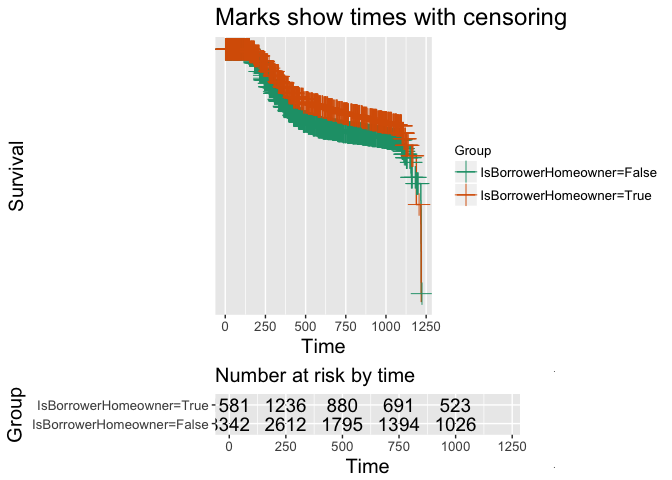

    survminer::ggsurvplot(model)

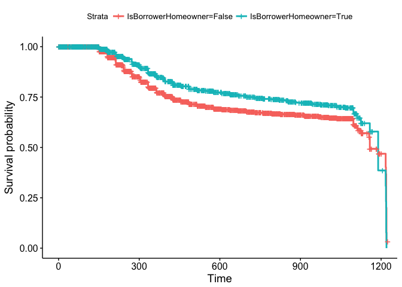

    survminer::ggsurvplot(model, conf.int = TRUE)

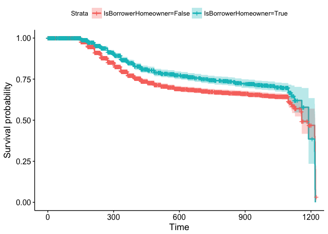

Pros y contras del estimador K-M
--------------------------------

Pros:

-   Se usa comúnmente para describir la supervivencia.
-   Se usa comúnmente para comparar dos poblaciones de estudio.
-   Es una presentación gráfica intuitiva.

Contras:

-   Es principalmente descriptivo.
-   No controla por covariables.
-   No se puede acomodar variables dependientes del tiempo

El modelo de riesgos proporcionales de Cox
==========================================

El modelo de riesgos proporcionales de Cox sirve para analizar datos de
supervivencia.

Como vimos antes, la función de supervivencia es la probabilidad de que
el tiempo hasta el evento (tiempo transucurido) sea mayor que algún
tiempo especificado y esta probabilidad depende de:

-   la función de riesgo subyacente (cómo se produce el riesgo de que el
    evento por unidad de tiempo cambie con el tiempo en las covariables
    de referencia)

-   los parámetros del efecto (cómo el riesgo varía en respuesta a las
    covariables)

Vamos a utilizar el modelo de riesgos proporcionales de Cox para
determinar el efecto de las covariables sobre la supervivencia.

El modelo semiparamétrico
-------------------------

Un modelo de supervivencia paramétrico es aquel en el que se supone que
el tiempo de supervivencia (el resultado) sigue una distribución
conocida. Ejemplos de distribuciones que se usan comúnmente para el
tiempo de supervivencia son: Weibull, exponencial (un caso especial de
Weibull), el log-logístico, el log-normal, etc.

El modelo de riesgos proporcionales de Cox, por el contrario, no es un
modelo totalmente paramétrico. Más bien es un modelo semiparamétrico
porque incluso si se conocen los parámetros de regresión (los betas), la
distribución del resultado permanece desconocida. La función de
supervivencia (o riesgo) de referencia no se especifica en un modelo de
Cox (no asumimos ninguna forma).

Como antes, sea *T* el tiempo hasta algún evento. Nuestros datos,
basados en un tamaño muestral *n*, consiste de la tripleta
$(\\tilde{T}\_i,\\Delta\_i,\\mathbf{X}\_i)$, *i* = 1, …, *n*, donde
$\\tilde{T}\_i$ es el tiempo de estudio para el iésimo paciente,
*Δ*<sub>*i*</sub> es la indicatriz de evento para el iésimo paciente
(*Δ*<sub>*i*</sub> = 1 si el evento ya ha ocurrido, y
*Δ*<sub>*i*</sub> = 0 si el tiempo de vida es censurado por la derecha)
y
**X**<sub>*i*</sub> = (*X*<sub>*i*1</sub>, …, *X*<sub>*i**p*</sub>)<sup>*t*</sup>
es el vector de covariables o factores de riesgo para el iésimo
individuo que puede afectar la distribución de supervivencia de *T*.

> Notemos que las covariables *X*<sub>*i**j*</sub>, con *j* = 1, …, *p*
> podrían depender del tiempo
> **X**<sub>*i*</sub>(*t*)=(*X*<sub>*i*1</sub>, …, *X*<sub>*i**p*</sub>)<sup>*t*</sup>.
> Esta situación debe ser analizada por el modelo PR Cox extendido. En
> esta guía consideramos únicamente el caso de covariables fijas.

El modelo PR de Cox Cox (1972) se escribe usualmente en términos de la
fórmula de riesgo como:

$$
h(t,\\mathbf{X}) = h\_0(t)e^{\\sum\_{j=1}^{p}\\beta\_jX\_j}
$$

Este modelo da una expresión para el riesgo en el tiempo *t* para un
individuo con una especificación dada de un conjunto de variables
explicativas denotadas por **X**.

Basados en este modelo podemos decir que el riesgo al tiempo *t* es el
producto de dos cantidades:

-   El primero, *h*<sub>0</sub>(*t*) es llamada la **función de riesgo
    de línea base** o el riesgo para un individuo de referencia con 0
    covariables.

-   Lo segundo es un **componente paramétrico** lo cual es una función
    lineal de un conjunto de *p* variables explicativas *X* que son
    exponenciadas (será el riesgo relativo asociado con las covariables
    *X*)

Ten en cuenta que una característica importante de este modelo, que se
refiere al *supuesto de riesgos proporcionales (PH)*, es que el riesgo
de referencia es una función de *t*, pero no involucra las covariables.
Por el contrario, la expresión exponencial implica las *X*'s pero no el
tiempo. Las covariables aquí tienen un efecto multiplicativo y se llaman
**tiempo-independientes**[2].

Nota que el modelo asume **riesgos proporcionales** (el riesgo para un
individuo *i* es una proporción fija del riesgo para cualquier otro
individuo *j*), esto es,

$$
\\frac{h\_i(t|\\textbf X\_i)}{h\_j(t|\\textbf X\_j)} = exp(\\boldsymbol \\beta(\\textbf X\_i - \\textbf X\_j))
$$
 o
$$
h\_i(t|\\textbf X\_i) = \\exp( \\boldsymbol \\beta(\\textbf X\_i - \\textbf X\_j)) h\_j(t|\\textbf X\_j)
$$

Por lo tanto, las funciones de riesgo para cada individuo deben ser
estrictamente paralelas y el ratio de riesgo es constante en el tiempo.

Estimación
----------

La estimación del modelo se obtiene mediante Máxima Verosimilitud, que
maximiza la función de verosimilitud *parcial* en lugar de la función de
verosimilitud (completa). El término probabilidad *parcial* se usa
porque la fórmula de probabilidad solo considera las probabilidades para
aquellos sujetos que fracasan, y no considera explícitamente las
probabilidades para aquellos sujetos censurados. La verosimilitud
parcial está dada por:

$$
L(\\boldsymbol \\beta) = \\prod\_{i:\\Delta\_i = 1} \\frac{\\exp\\bigg\[ \\sum\_{j=1}^{p}\\beta\_j X\_{(i)j} \\bigg\]}{\\sum\_{k \\in R(t\_i)} \\exp \\bigg\[ \\sum\_{j=1}^{p}\\beta\_j X\_{(k)j} \\bigg\]}
$$

siendo
*t*<sub>1</sub> &lt; *t*<sub>2</sub> &lt; … &lt; *t*<sub>*D*</sub> los
tiempos ordenados. *X*<sub>(*i*)*j*</sub> es la jésima covariable
asociada con el individuo cuyo fracaso es *t*<sub>*i*</sub> y
*R*(*t*<sub>*i*</sub>) es el conjunto de riesgo al tiempo
*t*<sub>*i*</sub>, esto es, el conjunto de todas las personas que aún
están en estudio en un momento anterior a *t*<sub>*i*</sub>.

Ten en cuenta que el numerador de la probabilidad depende solo de la
información de la persona que experimenta el evento, mientras que el
denominador utiliza información sobre todas las personas que aún no han
experimentado el evento (incluidas algunas personas que serán censuradas
más adelante).

Las estimaciones de máxima verosimilitud (parcial) se encuentran
maximizando $ln (L(\\boldsymbol \\beta))$, particularmente, tomando las
derivadas parciales respecto a cada parámetro del modelo, y luego
resolviendo el sistema de ecuaciones. Para este algoritmo se utilizan
métodos como el de Newton-Raphson Ypma (1995), o esperanza-maximización
Dempster, Laird, and Rubin (1977)[3].

En `R` podemos estimar este modelo utilizando `coxph` del paquete
`survival`.

    loan_filtered$LoanOriginalAmount2 <-  loan_filtered$LoanOriginalAmount/10000

    model <- coxph(Surv(time, status) ~ LoanOriginalAmount2 + IsBorrowerHomeowner +
                     IncomeVerifiable, data = loan_filtered)

Para tomar en cuenta los *empates*, podemos usar el argumento `method`

    coxph(Surv(time, status) ~ LoanOriginalAmount2 + IsBorrowerHomeowner +
            IncomeVerifiable, data = loan_filtered, method = "efron") 

    ## Call:
    ## coxph(formula = Surv(time, status) ~ LoanOriginalAmount2 + IsBorrowerHomeowner + 
    ##     IncomeVerifiable, data = loan_filtered, method = "efron")
    ## 
    ##                            coef exp(coef) se(coef)     z       p
    ## LoanOriginalAmount2     -0.1218    0.8854   0.0666 -1.83   0.068
    ## IsBorrowerHomeownerTrue -0.2481    0.7802   0.0623 -3.98 6.8e-05
    ## IncomeVerifiableTrue     0.2926    1.3399   0.3029  0.97   0.334
    ## 
    ## Likelihood ratio test=24.5  on 3 df, p=2e-05
    ## n= 4923, number of events= 1363

    coxph(Surv(time, status) ~ LoanOriginalAmount2 + IsBorrowerHomeowner +
            IncomeVerifiable, data = loan_filtered, method = "breslow") 

    ## Call:
    ## coxph(formula = Surv(time, status) ~ LoanOriginalAmount2 + IsBorrowerHomeowner + 
    ##     IncomeVerifiable, data = loan_filtered, method = "breslow")
    ## 
    ##                            coef exp(coef) se(coef)     z       p
    ## LoanOriginalAmount2     -0.1191    0.8877   0.0665 -1.79   0.074
    ## IsBorrowerHomeownerTrue -0.2480    0.7804   0.0623 -3.98 6.9e-05
    ## IncomeVerifiableTrue     0.2914    1.3383   0.3029  0.96   0.336
    ## 
    ## Likelihood ratio test=24.2  on 3 df, p=2.24e-05
    ## n= 4923, number of events= 1363

    coxph(Surv(time, status) ~ LoanOriginalAmount2 + IsBorrowerHomeowner +
            IncomeVerifiable, data = loan_filtered, method = "exact") 

    ## Call:
    ## coxph(formula = Surv(time, status) ~ LoanOriginalAmount2 + IsBorrowerHomeowner + 
    ##     IncomeVerifiable, data = loan_filtered, method = "exact")
    ## 
    ##                            coef exp(coef) se(coef)     z       p
    ## LoanOriginalAmount2     -0.1205    0.8864   0.0670 -1.80   0.072
    ## IsBorrowerHomeownerTrue -0.2517    0.7775   0.0628 -4.01 6.1e-05
    ## IncomeVerifiableTrue     0.2944    1.3423   0.3042  0.97   0.333
    ## 
    ## Likelihood ratio test=24.6  on 3 df, p=1.89e-05
    ## n= 4923, number of events= 1363

Cálculo del ratio de riesgo
---------------------------

Uno de los principales objetivos del modelo Cox PH es comparar las tasas
de riesgo de individuos que tienen diferentes valores para las
covariables. La idea es que nos interesa más la comparación de grupos
que la estimación de la supervivencia absoluta. Para este fin, vamos a
usar la razón de riesgos (HR).

La razón de riesgos se define como el riesgo para un individuo dividido
por el riesgo de un individuo diferente. Los dos individuos que se
comparan se pueden distinguir por sus valores para el conjunto de
predictores, es decir, las *X*. Podemos escribir el ratio de riesgo como
la estimación de

$$
\\widehat{HR} = \\frac{\\hat h\_i(t|\\textbf X\_i)}{h\_j(t|\\textbf X\_j)} = \\frac{\\hat h\_0(t) \\exp (\\boldsymbol{\\hat \\beta} \\textbf X\_i)}{\\hat h\_0(t) \\exp (\\boldsymbol{\\hat \\beta}\\textbf X\_j)}=exp(\\boldsymbol{\\hat \\beta}(\\textbf X\_i - \\textbf X\_j)).
$$

Adcionalmente, se puede construir un intervalo de confiaza (1 − *α*)%
para la razón de riesgos

$$
\\exp( \\boldsymbol{\\hat \\beta}(\\textbf X\_i - \\textbf X\_j) \\pm z\_{1-\\alpha/2} \\hspace{0.2cm} \\widehat{se}(\\boldsymbol{\\hat \\beta}(\\textbf X\_i - \\textbf X\_j)),
$$

donde
$\\widehat{se}(\\boldsymbol{\\hat \\beta}(\\textbf X\_i - \\textbf X\_j))$
es igual a
$\\sqrt{ \\widehat{Var}(\\boldsymbol{\\hat \\beta}(\\textbf X\_i - \\textbf X\_j))}$.

Para entender lo que la razón de riesgos significa, vamos a ver
ejemplos.

En el primero usamos a usar un **predictor discreto** (`smoking`) y
veremos la razón de riesgos de fumar vs no fumar ajustado por edad.
Entonces, sea $\\textbf X\_i:(smoking=1, age = 60)$ y
$\\textbf X\_j:(smoking=0, age = 60)$, la razón de riesgos es:

$$
HR= \\frac{h\_i(t|\\textbf X\_i)}{h\_j(t|\\textbf X\_j)} = \\frac{h\_0(t) e^{\\beta\_{smoking} \\cdot 1 + \\beta\_{age} \\cdot 60}}{h\_0(t) e^{\\beta\_{age} \\cdot 60}} = e^ {\\beta\_{smoking}}
$$

Por ejemplo, si *β*<sub>*s**m**o**k**i**n**g*</sub> = 0.5 la razón de
riesgos de fumar ajustado por edad será *e**x**p*(0.5)=1.65. Esto es, el
riesgo de muerte aumenta 65% para fumadores.

En el segundo ejemplo usaremos con **predictor contínuo**, edad (`age`)
de los individuos. Sea $\\textbf X\_i:(smoking=0, age = 70)$ y
$\\textbf X\_j:(smoking=0, age = 60)$, la razón de riesgos para un
incremento de 10 años en la edad ajustado por `smoking` es

$$
HR= \\frac{h\_i(t|\\textbf X\_i)}{h\_j(t|\\textbf X\_j)} = \\frac{h\_0(t) e^{\\beta\_{smoking} \\cdot 0 + \\beta\_{age} \\cdot 70}}{h\_0(t) e^{\\beta\_{smoking} \\cdot 0+ \\beta\_{age} \\cdot 60}} = e^{\\beta\_{age}(70-60)} = e^{\\beta\_{age}\\cdot 10 = (e^{\\beta\_{age}})^{10} }
$$

Note que *e*<sup>*β*<sub>*a**g**e*</sub></sup> es la razón de riesgo
para el incremento de una unidad en el predictor.

> Interpretación de la razón de riesgo - HR=1: no hay efecto - HR&gt;1:
> incremento en el riesgo - HR&lt;1: reducción en el riesgo

En `R`, podemos ver la razón de riesgos para las covariables incluidas
en el modelo:

    m1 <- coxph(Surv(time, status) ~ 
                  LoanOriginalAmount2 + IsBorrowerHomeowner +
                  IncomeVerifiable, data = loan_filtered) 
    summary(m1)

    ## Call:
    ## coxph(formula = Surv(time, status) ~ LoanOriginalAmount2 + IsBorrowerHomeowner + 
    ##     IncomeVerifiable, data = loan_filtered)
    ## 
    ##   n= 4923, number of events= 1363 
    ## 
    ##                             coef exp(coef) se(coef)      z Pr(>|z|)    
    ## LoanOriginalAmount2     -0.12177   0.88535  0.06661 -1.828   0.0675 .  
    ## IsBorrowerHomeownerTrue -0.24815   0.78025  0.06231 -3.982 6.82e-05 ***
    ## IncomeVerifiableTrue     0.29263   1.33995  0.30286  0.966   0.3339    
    ## ---
    ## Signif. codes:  0 '***' 0.001 '**' 0.01 '*' 0.05 '.' 0.1 ' ' 1
    ## 
    ##                         exp(coef) exp(-coef) lower .95 upper .95
    ## LoanOriginalAmount2        0.8854     1.1295    0.7770    1.0088
    ## IsBorrowerHomeownerTrue    0.7802     1.2816    0.6905    0.8816
    ## IncomeVerifiableTrue       1.3399     0.7463    0.7401    2.4260
    ## 
    ## Concordance= 0.558  (se = 0.008 )
    ## Rsquare= 0.005   (max possible= 0.988 )
    ## Likelihood ratio test= 24.46  on 3 df,   p=1.999e-05
    ## Wald test            = 23.33  on 3 df,   p=3.44e-05
    ## Score (logrank) test = 23.46  on 3 df,   p=3.238e-05

    termplot(m1, terms = "IsBorrowerHomeowner")

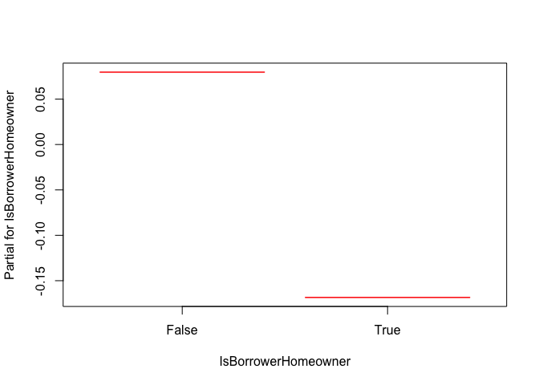

La razón de riesgos estimada para `IsBorrowerHomeowner == True` vs
`IsBorrowerHomeowner == False` es 0.78 con un intervalo de confianza del
95% de (0.69, 0.88), esto es, `IsBorrowerHomeowner == True` tiene 0.78
veces el riesgo de `IsBorrowerHomeowner == False`, un 22% de razón de
riesgo menor. El ratio de riesgo estimado para
`IsBorrowerHomeowner == False` vs `IsBorrowerHomeowner == True` es 1.28.
El procedimiento es el mismo para las demás covariables.

Test de hipótesis
-----------------

Para evaluar la significancia de una variable o una interacción en el
modelo podemos usar dos procedimientos:

-   un **test de Wald** (tipicamente usado con estimaciones de Máxima
    Verosimilitud)
-   un **test de razón de verosimilitud (LRT)** (usa la
    log-verosimilitud para comparar dos modelos anidados)

La hipótesis nula del **tes de Wald** plantea que el coeficiente
*β*<sub>*j*</sub> es igual a 0. El estadístico de prueba es:

$$
Z = \\frac{\\hat \\beta\_j - 0}{Std. Err (\\hat \\beta\_j)} \\sim N(0,1)
$$

    summary(m1)$coef

    ##                               coef exp(coef)   se(coef)         z
    ## LoanOriginalAmount2     -0.1217675 0.8853542 0.06661063 -1.828049
    ## IsBorrowerHomeownerTrue -0.2481456 0.7802463 0.06231124 -3.982357
    ## IncomeVerifiableTrue     0.2926323 1.3399500 0.30286111  0.966226
    ##                             Pr(>|z|)
    ## LoanOriginalAmount2     6.754227e-02
    ## IsBorrowerHomeownerTrue 6.823526e-05
    ## IncomeVerifiableTrue    3.339311e-01

    # a mano... para IncomeVerifiable
    z <- summary(m1)$coef[3, 1]/summary(m1)$coef[3, 3] 
    pvalue <- 2 * pnorm(z, lower.tail = FALSE)
    pvalue

    ## [1] 0.3339311

De acuerdo al p-valor del test, la hipótesis nula no es rechazada -
aceptada - (para la variable `IncomeVerifiable`). Entonces, el modelo no
debe incluir esta variable.

El otro enfoque es usar el **test de Razón de Verosimilitud**. En este
caso, necesitamos calcular la diferencia entre el estadístico de
log-verosimilitud del modelo reducido que no contiene la variable que
queremos probar y la estadística de verosimilitud de log del modelo
completo que contiene la variable. En general, la estadística LRT se
puede escribir

$$
LRT = -2 ln \\frac{L\_R}{L\_F}= 2 ln(L\_F) - 2 ln(L\_R) \\sim \\chi^2\_p
$$

donde *L*<sub>*R*</sub> denota la log-verosimilitud del modelo reducido
con parámetro *k* y *L*<sub>*F*</sub> es la log-verosimilitud del modelo
completo con *k* + *p* parámetros. *χ*<sub>*p*</sub><sup>2</sup> una
Chi-cuadrado con *p* grados de libertad, donde *p* denota el número de
parámetros evaluados.

> En general, la prueba de razón de verosimilitud y las estadísticas de
> Wald pueden no dar exactamente la misma respuesta. Se ha demostrado
> que de los dos procedimientos de prueba, el estadístico LR tiene
> mejores propiedades estadísticas, por lo que, en caso de duda, debe
> utilizar el LRT.

    m_red <- coxph(Surv(time, status) ~ LoanOriginalAmount2 + IsBorrowerHomeowner,
                   data = loan_filtered) 
    anova(m_red, m1) #primero el reducido, segundo el completo

<script data-pagedtable-source type="application/json">
{"columns":[{"label":[""],"name":["_rn_"],"type":[""],"align":["left"]},{"label":["loglik"],"name":[1],"type":["dbl"],"align":["right"]},{"label":["Chisq"],"name":[2],"type":["dbl"],"align":["right"]},{"label":["Df"],"name":[3],"type":["int"],"align":["right"]},{"label":["P(>|Chi|)"],"name":[4],"type":["dbl"],"align":["right"]}],"data":[{"1":"-10837.03","2":"NA","3":"NA","4":"NA","_rn_":"1"},{"1":"-10836.52","2":"1.029709","3":"1","4":"0.310227","_rn_":"2"}],"options":{"columns":{"min":{},"max":[10]},"rows":{"min":[10],"max":[10]},"pages":{}}}
  </script>

    # a mano... para la variable IncomeVerifiable
    m1$loglik  # el primero es la log-verosimilitud de un modelo que  no contiene ningún predictor, entonces necesitamos un segundo modelo

    ## [1] -10848.75 -10836.52

    chi <- 2 * m1$loglik[2] - 2 * m_red$loglik[2]
    pvalue <- 1 - pchisq(chi, df = 1) # df = 3 - 2
    pvalue

    ## [1] 0.310227

En este caso, usando un *α* = 0.5 y probando la significancia de la
variable `IncomeVerifiable`, debemos removerla del modelo.

Ajustando curvas de supervivencia
---------------------------------

Desde el punto de supervivencia, queremos obtener también estimaciones
para la curva de supervivencia. Recuerde que si no usamos un modelo,
podemos aplicar el estimador de Kaplan-Meier. Sin embargo, cuando se usa
un modelo de Cox para ajustar los datos de supervivencia, se pueden
obtener curvas de supervivencia ajustadas para las variables
explicativas utilizadas como predictores. Estas se llaman curvas de
supervivencia ajustadas y, al igual que las curvas de Kaplan-Meier,
también se trazan como funciones escalonadas.

La fórmula de riesgo vista anteriormente se puede convertir en una
función de supervivencia como

$$
S(t|\\textbf X) = \\bigg\[ S\_0(t) \\bigg\]^{e^{\\sum\_{j=1}^p \\beta\_j X\_j}}.
$$

Esta fórmula de función de supervivencia es la base para determinar las
curvas de supervivencia ajustadas. Las estimaciones de $\\hat {S}\_0(t)$
y $\\hat b\_j$ son estimadas con software que estima el modelo de Cox.
Las *X*′*s*, sin embargo, deben ser especificadas por el investigador
antes de la estimación en software.

> Típicamente, al calcular las curvas de supervivencia ajustadas, el
> valor elegido para una covariable ajustada es una medida de tendencia
> central como el promedio o una mediana.

La función `survfit` estima *S*(*t*), por defecto se estima en el
promedio de las covariables:

    m2 <- m_red
    newdf <- data.frame(IsBorrowerHomeowner = levels(loan_filtered$IsBorrowerHomeowner), 
                        LoanOriginalAmount2 = rep(mean(loan_filtered$LoanOriginalAmount2), 2))
    fit <- survfit(m2, newdata = newdf)
    #summary(fit) # para mirar los valores estimados
    plot(fit, conf.int = TRUE, col = c(1,2))
    legend("bottomleft", levels(newdf[,1]), col = c(1, 2), lty = c(1,1))

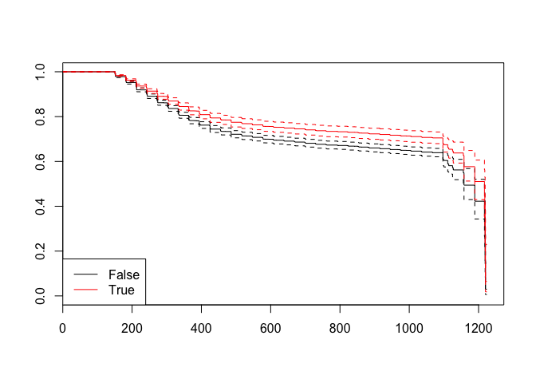

    # otra opción es usar el paquete survminer
    survminer::ggsurvplot(fit, data = newdf)

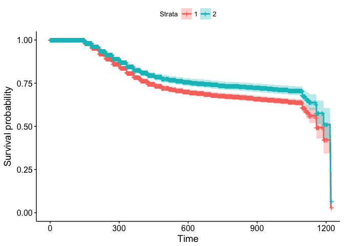

¿Cómo evaluar el supuesto PH?
-----------------------------

Ahora vamos a ilustrar dos métodos para evaluar los supuestos de riesgos
proporcionales: un enfoque gráfico y una prueba de bondad de ajuste.
Recuerde que la razón de riesgos que compara dos especificaciones de las
covariables (definidas como **X**<sup>\*</sup> y **X**) se puede
expresar como

$$
HR = \\exp(\\sum\_{j=1}^p \\beta\_j (X\_j^\* - X\_j))
$$

donde
**X**<sup>\*</sup> = (*X*<sub>1</sub><sup>\*</sup>, *X*<sub>2</sub><sup>\*</sup>, …, *X*<sub>*j*</sub><sup>\*</sup>)
y **X** = (*X*<sub>1</sub>, *X*<sub>2</sub>, …, *X*<sub>*j*</sub>), y el
supuesto de proporcionalidad del riesgo indica que esta cantidad es
constante en el tiempo. De forma equivalente, esto significa que el
riesgo para un individuo es proporcional al peligro para cualquier otro
individuo, donde la constante de proporcionalidad es independiente del
tiempo.

> Es importante observar que si la gráfica de los peligros se cruza para
> dos o más categorías de un predictor de interés, la suposición de PH
> no se cumple. Sin embargo, aunque las funciones de peligro no se
> cruzan, es posible que la suposición de PH no se cumpla. Por lo tanto,
> en lugar de verificar los riesgos de cruce, necesitamos usar otros
> enfoques

### Enfoque gráfico

Las técnicas gráficas más populares para evaluar el supuesto de PH
implican la comparación de curvas de supervivencia -ln (-ln) estimadas
sobre diferentes (combinaciones de) categorías de variables que se
investigan.

Una curva de supervivencia logarítmica es simplemente una transformación
de una curva de supervivencia estimada que resulta de tomar el logaritmo
natural de una probabilidad de supervivencia estimada dos veces[4].

Como dijimos, la función de peligro puede reescribirse como

$$
S(t|\\textbf X) = \\bigg\[ S\_0(t) \\bigg\]^{e^{\\sum\_{j=1}^p \\beta\_j X\_j}}
$$

aplicando −*l**n*(−*l**n*), puede reescribirse como

$$
-\\ln \\bigg\[-\\ln S(t|\\textbf X) \\bigg\] =  - \\sum\_{j=1}^p \\beta\_j X\_j - \\ln  \\bigg\[-\\ln S\_0(t|\\textbf X) \\bigg\].
$$

Ahora, considerando dos especificaciones diferentes de las covariables,
correspondientes a dos individuos diferentes, $\\textbf X\_1$ y
$\\textbf X\_2$, y restando la segunda curva log-log de la primera da la
expresión

$$
-\\ln \\bigg\[-\\ln S(t|\\textbf X\_1) \\bigg\] = -\\ln \\bigg\[-\\ln S(t|\\textbf X\_2) \\bigg\] + \\sum\_{j=1}^p \\beta\_j (X\_{1j} - X\_{2j})
$$

Esta expresión indica que si usamos un modelo de Cox (bien utilizado) y
graficamos las curvas de supervivencia log-log estimadas para individuos
en el mismo gráfico, **las dos gráficas serían aproximadamente
paralelas**. La distancia entre las dos curvas es la expresión lineal
que implica las diferencias en los valores de predicción, que no implica
tiempo.

Tenga en cuenta que hay un **problema importante** asociado con este
enfoque, es decir, **cómo decidir** *¿qué tan paralelo es el paralelo?*.
Este hecho puede ser subjetivo, por lo que la propuesta debe ser
conservadora para esta decisión al asumir que la suposición de PH se
cumple a menos que haya una fuerte evidencia de no paralelismo de las
curvas log-log.

Ahora vamos a verificar el supuesto de riesgos proporcionales para la
variable `IsBorrowerHomeowner`. Esto se puede hacer trazando las
**estimaciones de supervivencia de log-log Kaplan Meier** frente al
tiempo (o frente al log del tiempo) y evaluando si las curvas son
razonablemente paralelas.

    km_home <- survfit(Surv(time, status) ~ IsBorrowerHomeowner, data = loan_filtered)
    #autoplot(km_home) # solo para ver las curvas km

    plot(km_home, fun = "cloglog", xlab = "Tiempo (en días) usando log",
         ylab = "log-log survival", main = "log-log curvas por clínica") 

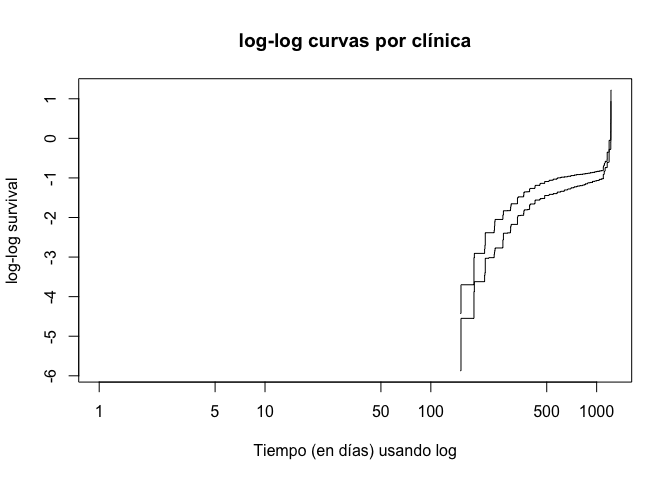

    # otra opción
    ggsurvplot(km_home, fun = "cloglog")

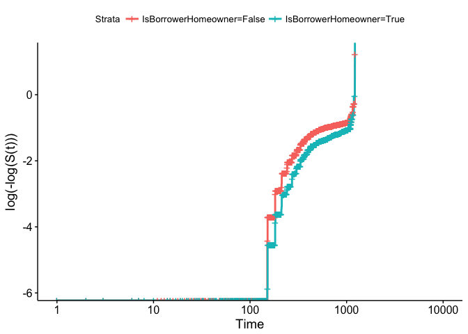

Parece que se **viola el supuesto de riesgos proporcionales** ya que las
curvas de supervivencia log-log no son paralelas.

Otra opción gráfica podría ser usar los **residuos de Schoenfeld** para
examinar el ajuste del modelo y detectar valores de covariables
periféricas. Los residuos de Shoenfeld representan la diferencia entre
la covariable observada y la esperada dado el riesgo establecido en ese
momento. Deben ser planas, centradas alrededor de cero. Puedes ver la
explicación en este
[documento.](http://citeseerx.ist.psu.edu/viewdoc/download?doi=10.1.1.544.6796&rep=rep1&type=pdf)

La idea principal es que definió un residuo parcial como la diferencia
entre el valor observado de *X*<sub>*i*</sub> y su esperanza condicional
dado el conjunto de riesgos *R*<sub>*i*</sub> y demostró que estos
residuos deben ser independientes del tiempo. Por lo tanto, si los
representa ordenados por su tiempo de evento, esta gráfica no debe
mostrar ningún patrón.

    ggcoxdiagnostics(m2, type = "schoenfeld")


    # otra opción
    zph <- cox.zph(m2)
    par(mfrow = c(1, 2))
    plot(zph, var = 1)
    plot(zph, var = 2)

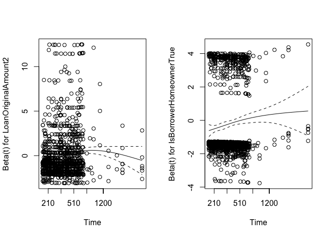

### Prueba de bondad de ajuste

Un segundo enfoque para evaluar la suposición de PH implica **pruebas de
bondad de ajuste (GOF)**. Para este objetivo, diferentes pruebas han
sido propuestas en la literatura (Grambsch and Therneau (1994)). Nos
enfocamos en Harrell (1983), una variación de una prueba propuesta
originalmente por Schoenfeld (1982). Esta es una prueba de correlación
entre los residuos de Schoenfeld y el tiempo de supervivencia. Una
correlación de cero indica que el modelo cumplió con la suposición de
riesgos proporcionales (la hipótesis nula).

En el paquete `survival` tenemos la función `cox.zph`

    cox.zph(m2)

    ##                           rho chisq        p
    ## LoanOriginalAmount2     0.130  27.1 1.96e-07
    ## IsBorrowerHomeownerTrue 0.103  14.0 1.81e-04
    ## GLOBAL                     NA  49.3 1.96e-11

Parece nuevamente que el supuesto de riesgos proporcionales no se ha
cumplido (como vimos con las curvas de supervivencia de log-log).

Riesgos no proporcionales... ¿y ahora qué?
------------------------------------------

Una no proporcionalidad no significativa puede no hacer ninguna
diferencia en la interpretación de un conjunto de datos, en particular
para tamaños de muestra grandes. ¿Qué pasa si la no proporcionalidad es
grande y real? Posibles enfoques son posibles en el contexto del propio
modelo de Cox:

-   **Estratificar.** Las covariables con efectos no proporcionales se
    pueden incorporar al modelo como factores de estratificación en
    lugar de predictores (pero ... ten cuidado, la estratificación
    funciona naturalmente para variables categóricas, sin embargo, para
    variables cuantitativas, debe discretizar).

-   **Partición del eje de tiempo**, si el supuesto de riesgos
    proporcionales se mantiene durante períodos de tiempo cortos, pero
    no para todo el estudio.

-   **Efecto no lineal.** Las covariables continuas con efecto no lineal
    pueden conducir a efectos no proporcionales.

### Un ejemplo... Modelos de riesgo proporcional estratificado

Algunas veces se viola el supuesto de riesgo proporcional para alguna
covariable. En tales casos, es posible estratificar tomando en cuenta
esta variable y usar el modelo de riesgos proporcionales en cada estrato
para las otras covariables. Incluimos en los modelos predictores que
satifican el supuesto de riesgo proporcional y eliminan de él el
predictor que está estratificado.

Ahora, los **sujetos en el estrato z-ésimo** tienen una función de
riesgo arbitraria de línea de base *h*<sub>0*z*</sub>(*t*) y el efecto
de otras variables explicativas sobre la función de riesgo se puede
representar mediante un modelo de riesgos proporcionales en ese estrato

$$
h\_z(t, \\textbf X) = h\_{0z}(t)  e^{\\sum\_{j=1}^p \\beta\_j X\_j}
$$

con *z* = 1, …, *k* niveles para la variable que es estratificada.

En el **Modelo de riesgos proporcionales estratificados, se supone que
los coeficientes de regresión son los mismos para cada estrato**, aunque
las **funciones de riesgo de linea de base** pueden ser diferentes y no
estar relacionadas por completo.

    m3 <- coxph(Surv(time, status) ~ LoanOriginalAmount2  +
                  strata(IsBorrowerHomeowner), data = loan_filtered) 
    summary(m3)

    ## Call:
    ## coxph(formula = Surv(time, status) ~ LoanOriginalAmount2 + strata(IsBorrowerHomeowner), 
    ##     data = loan_filtered)
    ## 
    ##   n= 4923, number of events= 1363 
    ## 
    ##                         coef exp(coef) se(coef)      z Pr(>|z|)  
    ## LoanOriginalAmount2 -0.11967   0.88721  0.06667 -1.795   0.0726 .
    ## ---
    ## Signif. codes:  0 '***' 0.001 '**' 0.01 '*' 0.05 '.' 0.1 ' ' 1
    ## 
    ##                     exp(coef) exp(-coef) lower .95 upper .95
    ## LoanOriginalAmount2    0.8872      1.127    0.7785     1.011
    ## 
    ## Concordance= 0.54  (se = 0.01 )
    ## Rsquare= 0.001   (max possible= 0.983 )
    ## Likelihood ratio test= 3.35  on 1 df,   p=0.06731
    ## Wald test            = 3.22  on 1 df,   p=0.07264
    ## Score (logrank) test = 3.22  on 1 df,   p=0.07255

Puede ver que el resultado es similar al modelo anterior sin
estratificación, sin embargo, en este caso, no tenemos información sobre
la razón de riesgo de la variable de estratificación,
`IsBorrowerHomeowner`. Esta variable no está realmente en el modelo. En
cualquier caso, puedes graficarlo ...

    ggsurvplot(survfit(m3), data = loan_filtered, conf.int = TRUE)

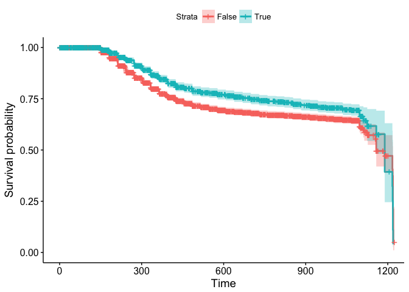

¿Por qué el modelo PH de Cox es tan popular? (pros del modelo)
--------------------------------------------------------------

-   Es un **modelo "robusto"**, por lo que los resultados del uso del
    modelo de Cox se **aproximarán** mucho a los resultados del **modelo
    paramétrico correcto** (aunque el riesgo de referencia no se
    especifique).

-   Aunque la parte de **línea de base de riesgo del modelo** no está
    especificada, podemos estimar las betas en la parte exponencial del
    modelo (como hemos visto). Entonces, la función de riesgo
    $h(t,\\textbf X)$ y sus curvas de supervivencia $S(t, \\textbf X)$
    correspondientes también se pueden estimar.

-   Finalmente, **se prefiere sobre el modelo logístico** cuando la
    información de tiempo de supervivencia está disponible y hay
    censura. ¡Porque puedes obtener más información!

<!-- ## Bonus 1: El modelo de Cox aditivo -->
<!-- El modelo Cox PH supone un efecto lineal de los predictores. Si el verdadero efecto es altamente no lineal, esto puede conducir a riesgos no proporcionales o conclusiones estadísticas engañosas. -->
<!-- Un enfoque alternativo es usar un modelo Additive Cox (@hastie2017generalized) de la forma -->
<!-- $$ -->
<!-- h(t, \textbf X) = h_0(t) e^{\sum_{j=1}^p f_j(\textbf X_j)} -->
<!-- $$ -->
<!-- con $f_j$ siendo una función suave y desconocida. -->
<!-- Para estimar este modelo uno puede usar el paquete `mgcv`: -->
<!-- ```{r} -->
<!-- m4 <- mgcv::gam(time ~ s(LoanOriginalAmount2) + IsBorrowerHomeowner,  -->
<!--                 data = loan_filtered, family = "cox.ph", weights = status) -->
<!-- summary(m4) -->
<!-- plot(m4, pages = 1, all.terms = TRUE) -->
<!-- ``` -->
<!-- > Tenga en cuenta el cambio en la sintaxis en comparación con los ejemplos anteriores. El indicador de estado es utilizado en el argumento `weights`. -->
<!-- ## Bonus 2: Machile Learning para estimar el modelo PH de Cox. -->
<!-- # Modelos conjuntos para datos longitudinales y tiempo transcurrido -->
<!-- ## Modelos lineales mixtos -->
<!-- ## Estimación del modelo conjunto -->
<!-- ## El paquete `JM` -->
<!-- # Superviviencia condicional con `condSURV` -->
Ejercicio
=========

<!-- d -->
<!-- ```{r} -->
<!-- # https://www.analyticsvidhya.com/blog/2014/04/solving-survival-model/ -->
<!-- Customer_id <- c(213,701,762,719,7,259,174,306,245,16,57,668,653,803) -->
<!-- Last_Response_tag <- c(0,0,1,0,0,1,0,0,0,1,0,1,1,0) -->
<!-- Platinum_flag <- c(1,1,1,0,0,0,1,0,0,1,0,1,0,1) -->
<!-- Months <- c(8,3,3,7,8,0,8,5,4,2,9,1,1,5) -->
<!-- Purchase_2k <- c(0,1,1,0,0,1,0,0,0,0,0,1,1,1) -->
<!-- # Preparación de datos: -->
<!-- Cust <- Customer_id -->
<!-- l_resp <- Last_Response_tag -->
<!-- Plat <- Platinum_flag -->
<!-- span <- Months -->
<!-- Resp <- Purchase_2k -->
<!-- X <- cbind(l_resp,Plat) -->
<!-- # Solución no paramétrica -->
<!-- kmsurv <- survfit(Surv(span,Resp) ~ 1) -->
<!-- summary(kmsurv) -->
<!-- plot(kmsurv,xlab = "span",ylab="Survival Proabability") -->
<!-- group1 <- l_resp -->
<!-- group2<- Plat -->
<!-- kmsurv1 <- survfit(Surv(span,Resp) ~ group1) -->
<!-- summary(kmsurv1) -->
<!-- plot(kmsurv1,xlab = "span",ylab="Survival Proabbility") -->
<!-- # Solucion semiparamétrica: -->
<!-- coxph <- coxph(Surv(span,Resp)~X,method = "breslow") -->
<!-- summary(coxph) -->
<!-- ``` -->
Realice un análisis de supervivencia con los datos `Base_consultaCC.csv`

`Surv(TiempoEvento, Censura) ~B6_RangoAtraso_SectorReal_1+IndicadorMaloEvidente+PETROLEO_WTI_5_T_1`

Referencias
===========

Andersen, Per K, Ornulf Borgan, Richard D Gill, and Niels Keiding. 2012.
*Statistical Models Based on Counting Processes*. Springer Science &
Business Media.

Cox, David R. 1972. “MRegression Models and Life Tables (with
Discussion).” *N Journal of the Royal Statistical Society, Series B* 34
(2).

Dempster, Arthur P, Nan M Laird, and Donald B Rubin. 1977. “Maximum
Likelihood from Incomplete Data via the Em Algorithm.” *Journal of the
Royal Statistical Society. Series B (Methodological)*. JSTOR, 1–38.

Gehan, Edmund A. 1965. “A Generalized Wilcoxon Test for Comparing
Arbitrarily Singly-Censored Samples.” *Biometrika* 52 (1-2). Oxford
University Press: 203–24.

Grambsch, Patricia M, and Terry M Therneau. 1994. “Proportional Hazards
Tests and Diagnostics Based on Weighted Residuals.” *Biometrika* 81 (3).
Oxford University Press: 515–26.

Greenwood, Major, and others. 1926. “A Report on the Natural Duration of
Cancer.” *A Report on the Natural Duration of Cancer.*, no. 33. London:
HMSO.

Harrell, Frank E. 1983. “The Phglm Procedure.” *Supplemental Library
User’s Guide*. SAS Institute, 267–94.

Kaplan, Edward L, and Paul Meier. 1958. “Nonparametric Estimation from
Incomplete Observations.” *Journal of the American Statistical
Association* 53 (282). Taylor & Francis: 457–81.

Klein, John P, and Melvin L Moeschberger. 2006. *Survival Analysis:
Techniques for Censored and Truncated Data*. Springer Science & Business
Media.

Kruskal, William H, and W Allen Wallis. 1952. “Use of Ranks in
One-Criterion Variance Analysis.” *Journal of the American Statistical
Association* 47 (260). Taylor & Francis Group: 583–621.

Mann, Henry B, and Donald R Whitney. 1947. “On a Test of Whether One of
Two Random Variables Is Stochastically Larger Than the Other.” *The
Annals of Mathematical Statistics*. JSTOR, 50–60.

Mantel, Nathan. 1966. “Evaluation of Survival Data and Two New Rank
Order Statistics Arising in Its Consideration.” *Cancer Chemother Rep*
50: 163–70.

Peto, Richard, and Julian Peto. 1972. “Asymptotically Efficient Rank
Invariant Test Procedures.” *Journal of the Royal Statistical Society.
Series A (General)*. JSTOR, 185–207.

Schoenfeld, David. 1982. “Partial Residuals for the Proportional Hazards
Regression Model.” *Biometrika* 69 (1). Oxford University Press: 239–41.

Sestelo, Marta. 2017. *A Short Course on Survival Analysis Applied to
the Financial Industry*. Madrid: BBVA Data & Analytics.

Ypma, Tjalling J. 1995. “Historical Development of the Newton–Raphson
Method.” *SIAM Review* 37 (4). SIAM: 531–51.

[1] Los datos fueron obtenidos de <https://www.mortality.org/>

[2] Sin embargo, es posible considerar covariables que implican tiempo.
Tales covariables se llaman variables tiempo-dependientes. Cuando
consideramos estas covariables, el modelo se denomina modelo extendido
de Cox y en este caso ya no satisface la suposición de riesgos
proporcionales.

[3] Tenga en cuenta que la escala del eje y de una curva de
supervivencia estimada oscila entre 0 y 1, mientras que la escala
correspondiente para una curva −*l**n*(−*l**n*) oscila entre −∞ e ∞.

[4] Tenga en cuenta que la escala del eje y de una curva de
supervivencia estimada oscila entre 0 y 1, mientras que la escala
correspondiente para una curva −*l**n*(−*l**n*) oscila entre −∞ e ∞.
