-   [Introducción](#introduccion)
    -   [Clasificación del ML](#clasificacion-del-ml)
-   [Aprendizaje supervizado](#aprendizaje-supervizado)
    -   [Regresión](#regresion)
    -   [Análisis discriminante](#analisis-discriminante)
    -   [Árboles de decisión](#arboles-de-decision)
    -   [Vecinos más cercanos](#vecinos-mas-cercanos)
    -   [Redes neuronales](#redes-neuronales)
    -   [Análisis de componentes
        principales](#analisis-de-componentes-principales)
-   [Aprendizaje no supervizado
    (Clustering)](#aprendizaje-no-supervizado-clustering)
    -   [kmedias](#kmedias)
    -   [kmedoides](#kmedoides)
-   [Referencias](#referencias)

<script type="text/x-mathjax-config">
    MathJax.Hub.Config({ TeX: { equationNumbers: {autoNumber: "all"} } });
  </script>

------------------------------------------------------------------------

<!--
La revisión metodológica aquí vertida se basa en [@Wang_2012].
-->
Introducción
============

-   El campo de estudio interesado en el desarrollo de algoritmos de
    computadora para transformar datos en acción inteligente se conoce
    como **aprendizaje automático (machine learning)**.

-   Este campo se originó en un entorno donde los datos disponibles, los
    métodos estadísticos y el poder de cómputo evolucionaron rápida y
    simultáneamente.

ML has sido usado en:

-   Predecir los resultados de las elecciones
-   Identificar y filtrar los mensajes no deseados del correo
    electrónico
-   Prever actividad criminal
-   Automatice las señales de tráfico según las condiciones de la
    carretera
-   Producir estimaciones financieras de tormentas y desastres naturales
-   Examine la rotación de clientes
-   Crear aviones de pilotaje automático y automóviles de conducción
    automática
-   Identificar individuos con la capacidad de donar
-   Dirigir publicidad a tipos específicos de consumidores

**¿Cómo aprenden las máquinas?**

> Una máquina aprende si es capaz de llevar la experiencia y utilizarla
> de manera que su desempeño mejore en experiencias similares en el
> futuro. (Tom M. Mitchell)

El proceso de aprendizaje puede considerarse comprendido en tres pasos:

-   **Entrada de datos:** utiliza la observación, el almacenamiento de
    memoria y la recuperación para proporcionar una base fáctica para un
    mayor razonamiento.
-   **Abstracción:** implica la traducción de datos en representaciones
    más amplias.
-   **Generalización:** Utiliza datos resumidos para formar una base
    para la acción.

**Pasos para aplicar ML**

1.  **Recopilación de datos:** si los datos están escritos en papel,
    grabados en archivos de texto y hojas de cálculo, o almacenados en
    una base de datos SQL, deberá reunirlos en un formato electrónico
    adecuado para el análisis. Esta información servirá como el
    aprendizaje material que usa un algoritmo para generar conocimiento
    procesable.

2.  **Explorar y preparar los datos:** la calidad de cualquier
    aprendizaje automático proyecto se basa en gran medida en la calidad
    de los datos que utiliza. Este paso en la máquina el proceso de
    aprendizaje tiende a requerir una gran cantidad de intervención
    humana. Un estadística citada a menudo sugiere que el 80 por ciento
    del esfuerzo en el aprendizaje automático está dedicado a los datos.
    Gran parte de este tiempo se dedica a aprender más sobre los datos y
    sus matices durante una práctica llamada exploración de datos.

3.  **Formación de un modelo sobre los datos:** cuando los datos han
    sido preparados para análisis, es probable que tenga una idea de lo
    que espera aprender de los datos. La tarea específica de aprendizaje
    automático informará la selección de un algoritmo apropiado, y el
    algoritmo representará los datos en la forma de un modelo.

4.  **Evaluación del rendimiento del modelo:** porque cada modelo de
    aprendizaje automático resultados en una solución sesgada al
    problema de aprendizaje, es importante evaluar qué tan bien el
    algoritmo aprendió de su experiencia. Dependiente en el tipo de
    modelo utilizado, es posible que pueda evaluar la precisión de el
    modelo que usa un conjunto de datos de prueba, o puede necesitar
    desarrollar medidas de rendimiento específico para la aplicación
    prevista.

5.  **Mejora del rendimiento del modelo:** si se necesita un mejor
    rendimiento, se convierte en necesario para utilizar estrategias más
    avanzadas para aumentar el rendimiento del modelo. A veces, puede
    ser necesario cambiar a un tipo diferente de modelo en conjunto. Es
    posible que necesite complementar sus datos con datos, o realizar
    trabajos preparatorios adicionales como en el paso dos de este
    proceso.

Clasificación del ML
--------------------

-   En el **aprendizaje supervisado** (SML), el algoritmo de aprendizaje
    se presenta con entradas de ejemplo etiquetadas, donde las etiquetas
    indican el resultado deseado. SML se compone de clasificación, donde
    el resultado es categórico, y regresión, donde el resultado es
    numérico.

-   En el **aprendizaje no supervisado** (UML), no se proporcionan
    etiquetas, y el algoritmo de aprendizaje se centra únicamente en la
    detección de estructura en los datos de entrada no etiquetados.

Aprendizaje supervizado
=======================

Regresión
---------

Se utiliza para estimar los valores reales (costo de las viviendas,
número de llamadas, ventas totales, etc.) en función de la (s) variable
(s) continua (s). Aquí, establecemos la relación entre las variables
independientes y dependientes ajustando una mejor línea. Esta línea de
mejor ajuste se conoce como línea de regresión y representada por una
ecuación lineal *Y* = *a**X* + *b*.

La mejor forma de entender la regresión lineal es revivir esta
experiencia de la infancia. Digamos, le pides a un niño de quinto grado
que organice a las personas de su clase aumentando el orden de peso sin
pedirles su peso. ¿Qué crees que hará el niño? Es probable que mire
(analice visualmente) a la altura y la estructura de las personas y las
organice utilizando una combinación de estos parámetros visibles. ¡Esto
es una regresión lineal en la vida real! El niño realmente ha
descubierto que la altura y la construcción se correlacionan con el peso
de una relación, que se parece a la ecuación anterior.

En esta ecuación

-   *Y* es la variable dependiente
-   *a* es la pendiente
-   *X* es la variable independiente
-   *b* es el intercepto

Estos coeficientes *a* y *b* se derivan de la minimización de la suma de
la diferencia cuadrada de distancia entre los puntos de datos y la línea
de regresión.

Mira el ejemplo de abajo. Aquí hemos identificado la mejor línea de
ajuste con ecuación lineal *y* = 0.2811*x* + 13.9. Ahora usando esta
ecuación, podemos encontrar el peso, sabiendo la altura de una persona.

La regresión lineal es principalmente de dos tipos: regresión lineal
simple y regresión lineal múltiple. La regresión lineal simple se
caracteriza por una variable independiente. *Y*, la Regresión Lineal
Múltiple (como su nombre indica) se caracteriza por múltiples (más de 1)
variables independientes. Al encontrar la mejor línea de ajuste, puede
ajustarse a una regresión polinómica o curvilínea. Y estos se conocen
como regresión polinómica o curvilínea.

### Paso 1: recopilación de datos

Nota: para leer archivos `.RData` desde github:

-   Click en los datos a importar.
-   Click derecho en en `View Raw` y luego `Copiar dirección de enlace`
-   Guardar en `uu` y leer los datos con `source_data` del paquete
    `repmis`

<!-- -->

    uu <- "https://github.com/vmoprojs/DataLectures/blob/master/insurance.RData?raw=true"
    library(repmis)
    source_data(uu)

    ## [1] "insurance"

<https://github.com/vmoprojs/DataLectures/blob/master/insurance.RData?raw=true>

<!-- ```{r} -->
<!-- load("insurance.RData") -->
<!-- ``` -->
El archivo `insurance.csv` incluye 1338 beneficiarios actualmente
inscritos en el plan de seguro, con características que indican las
características del paciente, así como los gastos médicos totales
cargados al plan para el año calendario.

-   `age`: Este es un número entero que indica la edad del beneficiario
    principal (excluyendo los mayores de 64 años, ya que generalmente
    están cubiertos por el gobierno).

-   `sex`: Este es el sexo del titular de la póliza, ya sea `male` o
    `female`.

-   `bmi`: Este es el índice de masa corporal (IMC), que proporciona una
    idea de qué tan alto o bajo de peso tiene una persona en relación
    con su estatura. El IMC es igual al peso (en kilogramos) dividido
    por la altura (en metros) al cuadrado. Un IMC ideal está dentro del
    rango de 18.5 a 24.9.

-   `children`: Este es un número entero que indica la cantidad de hijos
    / dependientes cubiertos por el plan de seguro.

-   `smoker`: Esto es `yes` o `no` dependiendo de si el asegurado fuma
    tabaco regularmente.

-   `region`: Este es el lugar de residencia del beneficiario en los
    EE.UU., Dividido en cuatro regiones geográficas: noreste, sureste,
    suroeste o noroeste.

Es importante **reflexionar** sobre **cómo estas variables pueden estar
relacionadas** con los gastos médicos facturados. Por ejemplo, podríamos
esperar que las personas mayores y los fumadores corran un mayor riesgo
de grandes gastos médicos.

A diferencia de muchos otros métodos de aprendizaje automático, en el
análisis de regresión, el usuario suele especificar las relaciones entre
las características en lugar de detectarlas automáticamente.

### Paso 2: Explorar y preparar los datos

    str(insurance)

    ## 'data.frame':    1338 obs. of  7 variables:
    ##  $ age     : int  19 18 28 33 32 31 46 37 37 60 ...
    ##  $ sex     : Factor w/ 2 levels "female","male": 1 2 2 2 2 1 1 1 2 1 ...
    ##  $ bmi     : num  27.9 33.8 33 22.7 28.9 ...
    ##  $ children: int  0 1 3 0 0 0 1 3 2 0 ...
    ##  $ smoker  : Factor w/ 2 levels "no","yes": 2 1 1 1 1 1 1 1 1 1 ...
    ##  $ region  : Factor w/ 4 levels "northeast","northwest",..: 4 3 3 2 2 3 3 2 1 2 ...
    ##  $ charges : num  16885 1726 4449 21984 3867 ...

La variable dependiente es `charges`, veamos su distribución:

    summary(insurance$charges)

    ##    Min. 1st Qu.  Median    Mean 3rd Qu.    Max. 
    ##    1122    4740    9382   13270   16640   63770

Como la media es mayor a la mediana, la distribución de los cargos por
seguros es sesgada a la derecha. Podemos confirmalo visualmente:

    hist(insurance$charges)

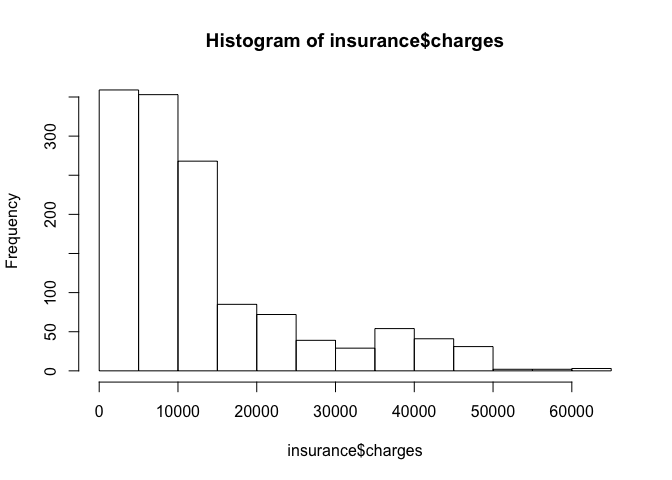

Sabemos que los datos están dividios en 4 regiones, veamos más de cerca
su ditribución

    table(insurance$region)

    ## 
    ## northeast northwest southeast southwest 
    ##       324       325       364       325

Vemos que los datos se distribuyen casi uniformemente. Veamos ahora la
asociación lineal de las variables

    library(psych)
    pairs.panels(insurance[,c("age", "bmi", "children", "charges")])

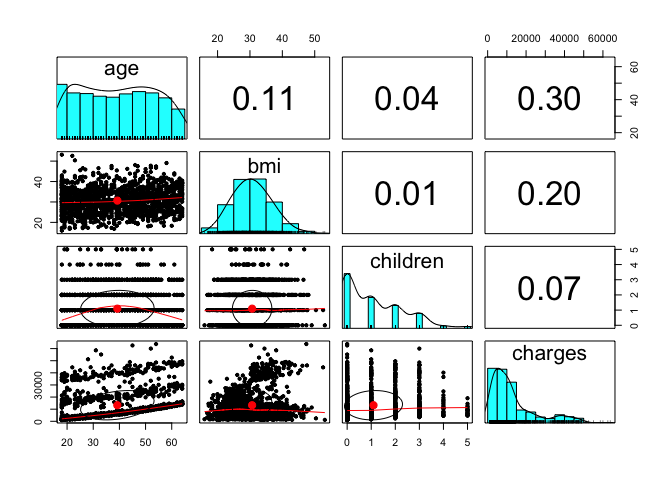

### Paso 3: entrenar un modelo en los datos

Ajustemos un modelo de regresión

    ins_model <- lm(charges ~ age + children + bmi + sex + smoker + region, data = insurance)
    # ins_model <- lm(charges ~ ., data = insurance)
    ins_model

    ## 
    ## Call:
    ## lm(formula = charges ~ age + children + bmi + sex + smoker + 
    ##     region, data = insurance)
    ## 
    ## Coefficients:
    ##     (Intercept)              age         children              bmi  
    ##        -11938.5            256.9            475.5            339.2  
    ##         sexmale        smokeryes  regionnorthwest  regionsoutheast  
    ##          -131.3          23848.5           -353.0          -1035.0  
    ## regionsouthwest  
    ##          -960.1

### Paso 4: evaluar el rendimiento del modelo

    summary(ins_model)

    ## 
    ## Call:
    ## lm(formula = charges ~ age + children + bmi + sex + smoker + 
    ##     region, data = insurance)
    ## 
    ## Residuals:
    ##      Min       1Q   Median       3Q      Max 
    ## -11304.9  -2848.1   -982.1   1393.9  29992.8 
    ## 
    ## Coefficients:
    ##                 Estimate Std. Error t value Pr(>|t|)    
    ## (Intercept)     -11938.5      987.8 -12.086  < 2e-16 ***
    ## age                256.9       11.9  21.587  < 2e-16 ***
    ## children           475.5      137.8   3.451 0.000577 ***
    ## bmi                339.2       28.6  11.860  < 2e-16 ***
    ## sexmale           -131.3      332.9  -0.394 0.693348    
    ## smokeryes        23848.5      413.1  57.723  < 2e-16 ***
    ## regionnorthwest   -353.0      476.3  -0.741 0.458769    
    ## regionsoutheast  -1035.0      478.7  -2.162 0.030782 *  
    ## regionsouthwest   -960.0      477.9  -2.009 0.044765 *  
    ## ---
    ## Signif. codes:  0 '***' 0.001 '**' 0.01 '*' 0.05 '.' 0.1 ' ' 1
    ## 
    ## Residual standard error: 6062 on 1329 degrees of freedom
    ## Multiple R-squared:  0.7509, Adjusted R-squared:  0.7494 
    ## F-statistic: 500.8 on 8 and 1329 DF,  p-value: < 2.2e-16

-   Al ver el resumen de los residuos, concluimos que al menos una de
    las obervaciones tiene un error de aproximadamente 30000.

### Paso 5: mejorando el ajuste

Una de las formas de lograr este objetivo es suavizando el modelo, por
ejemplo tomando un polinomio:

    insurance$age2 <- insurance$age^2

También ayuda el discretizar algunas variables. Supongamos que creemos
que una variable tiene un efecto dado algún segmento de su ditribución.
Podemos crear una dummy con un cierto umbral para capturar este efecto:

    insurance$bmi30 <- ifelse(insurance$bmi >= 30, 1, 0)

Otra forma de logar mejorar el modelo es aumentando
[interacciones](https://www3.nd.edu/~rwilliam/stats2/l55.pdf) en el
modelo.

    ins_model2 <- lm(charges ~ age + age2 + children + bmi + sex +
    bmi30*smoker + region, data = insurance)
    summary(ins_model2)

    ## 
    ## Call:
    ## lm(formula = charges ~ age + age2 + children + bmi + sex + bmi30 * 
    ##     smoker + region, data = insurance)
    ## 
    ## Residuals:
    ##      Min       1Q   Median       3Q      Max 
    ## -17296.4  -1656.0  -1263.3   -722.1  24160.2 
    ## 
    ## Coefficients:
    ##                   Estimate Std. Error t value Pr(>|t|)    
    ## (Intercept)       134.2509  1362.7511   0.099 0.921539    
    ## age               -32.6851    59.8242  -0.546 0.584915    
    ## age2                3.7316     0.7463   5.000 6.50e-07 ***
    ## children          678.5612   105.8831   6.409 2.04e-10 ***
    ## bmi               120.0196    34.2660   3.503 0.000476 ***
    ## sexmale          -496.8245   244.3659  -2.033 0.042240 *  
    ## bmi30           -1000.1403   422.8402  -2.365 0.018159 *  
    ## smokeryes       13404.6866   439.9491  30.469  < 2e-16 ***
    ## regionnorthwest  -279.2038   349.2746  -0.799 0.424212    
    ## regionsoutheast  -828.5467   351.6352  -2.356 0.018604 *  
    ## regionsouthwest -1222.6437   350.5285  -3.488 0.000503 ***
    ## bmi30:smokeryes 19810.7533   604.6567  32.764  < 2e-16 ***
    ## ---
    ## Signif. codes:  0 '***' 0.001 '**' 0.01 '*' 0.05 '.' 0.1 ' ' 1
    ## 
    ## Residual standard error: 4445 on 1326 degrees of freedom
    ## Multiple R-squared:  0.8664, Adjusted R-squared:  0.8653 
    ## F-statistic: 781.7 on 11 and 1326 DF,  p-value: < 2.2e-16

Otra forma de mejorar el modelo es usando la función `step`

    fit1 <- lm(charges ~ ., data = insurance)
    fit2 <- lm(charges ~ 1, data = insurance)
    step(fit1,direction="backward")

    ## Start:  AIC=23280.51
    ## charges ~ age + sex + bmi + children + smoker + region + age2 + 
    ##     bmi30
    ## 
    ##            Df  Sum of Sq        RSS   AIC
    ## - age       1 4.4942e+06 4.7408e+10 23279
    ## - sex       1 9.1647e+06 4.7413e+10 23279
    ## - region    3 1.8862e+08 4.7593e+10 23280
    ## <none>                   4.7404e+10 23280
    ## - bmi       1 3.9891e+08 4.7803e+10 23290
    ## - age2      1 4.6048e+08 4.7864e+10 23291
    ## - children  1 7.0043e+08 4.8104e+10 23298
    ## - bmi30     1 8.8621e+08 4.8290e+10 23303
    ## - smoker    1 1.2253e+11 1.6994e+11 24987
    ## 
    ## Step:  AIC=23278.63
    ## charges ~ sex + bmi + children + smoker + region + age2 + bmi30
    ## 
    ##            Df  Sum of Sq        RSS   AIC
    ## - sex       1 9.0630e+06 4.7417e+10 23277
    ## - region    3 1.8849e+08 4.7597e+10 23278
    ## <none>                   4.7408e+10 23279
    ## - bmi       1 3.9616e+08 4.7805e+10 23288
    ## - children  1 7.3360e+08 4.8142e+10 23297
    ## - bmi30     1 8.9822e+08 4.8307e+10 23302
    ## - age2      1 1.7626e+10 6.5034e+10 23700
    ## - smoker    1 1.2253e+11 1.6994e+11 24985
    ## 
    ## Step:  AIC=23276.89
    ## charges ~ bmi + children + smoker + region + age2 + bmi30
    ## 
    ##            Df  Sum of Sq        RSS   AIC
    ## - region    3 1.8827e+08 4.7606e+10 23276
    ## <none>                   4.7417e+10 23277
    ## - bmi       1 3.9448e+08 4.7812e+10 23286
    ## - children  1 7.3116e+08 4.8149e+10 23295
    ## - bmi30     1 8.9533e+08 4.8313e+10 23300
    ## - age2      1 1.7655e+10 6.5073e+10 23698
    ## - smoker    1 1.2306e+11 1.7048e+11 24987
    ## 
    ## Step:  AIC=23276.19
    ## charges ~ bmi + children + smoker + age2 + bmi30
    ## 
    ##            Df  Sum of Sq        RSS   AIC
    ## <none>                   4.7606e+10 23276
    ## - bmi       1 3.3084e+08 4.7937e+10 23284
    ## - children  1 7.2678e+08 4.8333e+10 23294
    ## - bmi30     1 9.3668e+08 4.8542e+10 23300
    ## - age2      1 1.7777e+10 6.5383e+10 23699
    ## - smoker    1 1.2362e+11 1.7123e+11 24987

    ## 
    ## Call:
    ## lm(formula = charges ~ bmi + children + smoker + age2 + bmi30, 
    ##     data = insurance)
    ## 
    ## Coefficients:
    ## (Intercept)          bmi     children    smokeryes         age2  
    ##   -3578.823      135.992      611.678    23828.987        3.261  
    ##       bmi30  
    ##    2788.688

    step(fit2,direction="forward",scope=list(upper=fit1,lower=fit2))

    ## Start:  AIC=25160.18
    ## charges ~ 1
    ## 
    ##            Df  Sum of Sq        RSS   AIC
    ## + smoker    1 1.2152e+11 7.4554e+10 23868
    ## + age2      1 1.7738e+10 1.7834e+11 25035
    ## + age       1 1.7530e+10 1.7854e+11 25037
    ## + bmi30     1 7.8063e+09 1.8827e+11 25108
    ## + bmi       1 7.7134e+09 1.8836e+11 25108
    ## + children  1 9.0660e+08 1.9517e+11 25156
    ## + region    3 1.3008e+09 1.9477e+11 25157
    ## + sex       1 6.4359e+08 1.9543e+11 25158
    ## <none>                   1.9607e+11 25160
    ## 
    ## Step:  AIC=23868.38
    ## charges ~ smoker
    ## 
    ##            Df  Sum of Sq        RSS   AIC
    ## + age2      1 2.0260e+10 5.4295e+10 23446
    ## + age       1 1.9928e+10 5.4626e+10 23454
    ## + bmi30     1 7.7565e+09 6.6798e+10 23723
    ## + bmi       1 7.4856e+09 6.7069e+10 23729
    ## + children  1 7.5272e+08 7.3802e+10 23857
    ## <none>                   7.4554e+10 23868
    ## + sex       1 1.4213e+06 7.4553e+10 23870
    ## + region    3 1.0752e+08 7.4447e+10 23872
    ## 
    ## Step:  AIC=23446.1
    ## charges ~ smoker + age2
    ## 
    ##            Df  Sum of Sq        RSS   AIC
    ## + bmi30     1 5622934584 4.8672e+10 23302
    ## + bmi       1 5026405143 4.9268e+10 23318
    ## + children  1  776816728 5.3518e+10 23429
    ## <none>                   5.4295e+10 23446
    ## + age       1   10202784 5.4284e+10 23448
    ## + sex       1    2089722 5.4293e+10 23448
    ## + region    3  131673514 5.4163e+10 23449
    ## 
    ## Step:  AIC=23301.82
    ## charges ~ smoker + age2 + bmi30
    ## 
    ##            Df Sum of Sq        RSS   AIC
    ## + children  1 735108434 4.7937e+10 23284
    ## + bmi       1 339172285 4.8333e+10 23294
    ## <none>                  4.8672e+10 23302
    ## + age       1  47604629 4.8624e+10 23302
    ## + sex       1   5103662 4.8667e+10 23304
    ## + region    3 113242561 4.8558e+10 23305
    ## 
    ## Step:  AIC=23283.46
    ## charges ~ smoker + age2 + bmi30 + children
    ## 
    ##          Df Sum of Sq        RSS   AIC
    ## + bmi     1 330842015 4.7606e+10 23276
    ## <none>                4.7937e+10 23284
    ## + sex     1   7267450 4.7929e+10 23285
    ## + age     1   1784079 4.7935e+10 23285
    ## + region  3 124634416 4.7812e+10 23286
    ## 
    ## Step:  AIC=23276.19
    ## charges ~ smoker + age2 + bmi30 + children + bmi
    ## 
    ##          Df Sum of Sq        RSS   AIC
    ## <none>                4.7606e+10 23276
    ## + region  3 188269713 4.7417e+10 23277
    ## + sex     1   8842056 4.7597e+10 23278
    ## + age     1   4268540 4.7601e+10 23278

    ## 
    ## Call:
    ## lm(formula = charges ~ smoker + age2 + bmi30 + children + bmi, 
    ##     data = insurance)
    ## 
    ## Coefficients:
    ## (Intercept)    smokeryes         age2        bmi30     children  
    ##   -3578.823    23828.987        3.261     2788.688      611.678  
    ##         bmi  
    ##     135.992

<!-- ## Regresión logística -->
Análisis discriminante
----------------------

<!-- https://rpubs.com/gabrielmartos/discriminantR -->
El análisis discriminante lineal (LDA) y el discriminante lineal de
Fisher relacionado son métodos utilizados en estadística, reconocimiento
de patrones y aprendizaje automático para encontrar una combinación
lineal de características que caracteriza o separa dos o más clases de
objetos o eventos. La combinación resultante se puede usar como un
clasificador lineal o, más comúnmente, para la reducción de
dimensionalidad antes de la clasificación posterior.

Considere un conjunto de observaciones *x* (también llamadas
características, atributos, variables o medidas) para cada muestra de un
objeto o evento con una clase conocida *y* ∈ {0, 1}. Este conjunto de
muestras se llama conjunto de entrenamiento. El problema de
clasificación es encontrar un buen predictor para la clase *y* de
cualquier muestra de la misma distribución (no necesariamente del
conjunto de entrenamiento), dado solo una observación *x*.

### Objetivos

-   Determinar si existen diferencias significativas entre los perfiles
    de un conjunto de variables de dos o más grupos definidos a priori.

-   Determinar cuál de las variables independientes cuantifica mejor las
    diferencias entre un grupo u otro.

-   Establecer un procedimiento para clasificar a un individuo en base a
    los valores de un conjunto de variables independientes.

### Posibles aplicaciones

-   Predicción de bancarrota: en la predicción de bancarrota basada en
    razones contables y otras variables financieras, el análisis
    discriminante lineal fue el primer método estadístico aplicado para
    explicar sistemáticamente qué empresas entraron en bancarrota vs.
    sobrevivieron.

-   Comercialización: en marketing, el análisis discriminante solía
    utilizarse para determinar los factores que distinguen diferentes
    tipos de clientes y/o productos sobre la base de encuestas u otras
    formas de datos recopilados.

-   Estudios biomédicos: la principal aplicación del análisis
    discriminante en medicina es la evaluación del estado de gravedad de
    un paciente y el pronóstico del desenlace de la enfermedad. Por
    ejemplo, durante el análisis retrospectivo, los pacientes se dividen
    en grupos según la gravedad de la enfermedad, forma leve, moderada y
    grave. Luego, se estudian los resultados de los análisis clínicos y
    de laboratorio para revelar las variables que son estadísticamente
    diferentes en los grupos estudiados. Usando estas variables, se
    construyen funciones discriminantes que ayudan a clasificar
    objetivamente la enfermedad en un futuro paciente en una forma leve,
    moderada o severa.

### Comparación con otras técnicas

La técnica más común para establecer relaciones, predecir y explicar
variables son las técnicas de regresión. El problema está cuando la
variable a explicar no es una variable medible (o métrica); en este caso
existen dos tipos de análisis con los que resolver el problema, el
análisis discriminante y la regresión logística. En ambos análisis
tendremos una variable dependiente categórica y varias variables
independientes numéricas.

En muchas ocasiones la variable categórica consta de dos grupos o
clasificaciones (por ejemplo, bancarrota-no bancarrota). En otras
situaciones la variable categórica tendrá tres o más subgrupos (e.g.
bajo, medio y alto nivel de cierta dosis). La regresión logística o
logia, en su forma básica está restringida a dos grupos frente al
análisis discriminante que vale para más de dos.

### Supuestos

-   La *variable dependiente* (grupos) debe ser categórica en la que el
    número de grupos puede ser de dos o más, pero han de ser mutuamente
    excluyentes y exhaustivos. Aunque la variable dependiente puede ser
    originariamente numérica y que el investigador la cuantifique en
    términos de categorías.

-   Las *variables independientes* numéricas se seleccionan
    identificando las variables en una investigación previa o mediante
    información a priori, de tal manera que se sepa que esas variables
    son importantes para predecir en qué grupo estará la variable
    dependiente. Se puede utilizar el análisis cluster para formar los
    grupos, pero se recomienda seguir los siguientes pasos: dividir los
    datos en 2 grupos, aplicar el análisis cluster en uno de ellos y
    utilizar los resultados en el DA para el segundo grupo de datos.

-   Con respecto al *tamaño de las muestras*, se suele recomendar que
    los tamaños de cada grupo no sean muy diferentes, ya que con esto la
    probabilidad de pertenecer a un grupo o a otro puede variar
    considerablemente. Se necesita que al menos tengamos 4 o 5 veces más
    observaciones por grupo que el número de variables que utilicemos.
    Además, el número de observaciones en el grupo más pequeño debe ser
    mayor que el número de variables.

-   También existen dos hipótesis previas que deben ser contrastadas,
    estas son: la *normalidad multivariante* y la de la estructura de
    varianzas-covarianzas desconocidas pero iguales (*homogeneidad de
    varianzas* entre grupos). Los datos que no cumplen el supuesto de
    normalidad pueden causar problemas en la estimación y en ese caso se
    sugiere utilizar la regresión logística. Si existen grandes
    desviaciones en las varianzas, se puede solucionar con la ampliación
    de la muestra o con técnicas de clasificación cuadráticas. La
    homogeneidad de varianzas significa que la relación entre variables
    debe ser similar para los distintos grupos. Por tanto, una variable
    no puede tener el mismo valor para todas las observaciones dentro de
    un grupo.

-   Los datos además no deben presentar *multicolinealidad*, es decir,
    que dos o más variables independientes estén muy relacionadas. Si
    las variables tienen un valor de correlación de 0.9 o mayor se debe
    eliminar una de ellas.

-   También se supone *linealidad* entre las variables ya que se utiliza
    la matriz de covarianza.

Si no se cumplen los supuestos de normalidad y homogeneidad, podemos
utilizar una transformación logarítmica o de la raíz cuadrada.

### El modelo

El análisis discriminante implica un valor teórico como combinación
lineal de dos o más variables independientes que discrimine entre los
grupos definidos a priori. La discriminación se lleva a cabo
estableciendo las ponderaciones del valor teórico de cada variable, de
tal forma que maximicen la varianza entre-grupos frente a la
intra-grupos. La combinación lineal o función discriminante, toma la
siguiente forma:

*D*<sub>*i*</sub> = *a* + *W*<sub>1</sub>*X*<sub>1, *i*</sub> + *W*<sub>2</sub>*X*<sub>2, *i*</sub> + … + *W*<sub>*n*</sub>*X*<sub>*n*, *i*</sub>

donde: *D*<sub>*i*</sub> es la puntuación discriminante (grupo de
pertenencia) del individuo i-ésimo; a es una constante;
*W*<sub>*j*</sub> es la ponderación de la variable j-ésima. El resultado
de esta función será para un conjunto de variables *X*1, …, *X**n* un
valor de *D* que discrimine al individuo en un grupo u otro. Destacamos
que el análisis discriminante proporcionará una función discriminate
menos que los subgrupos que tengamos, es decir, si la variable
categórica tiene dos subgrupos, obtendremos una función discriminante,
si tiene tres subgrupos obtendremos dos y así sucesivamente.

### Ejemplo 1: clasificación de vinos

En este primer caso de estudio, el conjunto de datos del vino, tenemos
13 concentraciones químicas que describen muestras de vino de tres
cultivos.

    library(car)
    # install.packages('rattle')
    uu <- "https://gist.githubusercontent.com/tijptjik/9408623/raw/b237fa5848349a14a14e5d4107dc7897c21951f5/wine.csv"
    wine <- read.csv(url(uu))
    head(wine)

<script data-pagedtable-source type="application/json">
{"columns":[{"label":[""],"name":["_rn_"],"type":[""],"align":["left"]},{"label":["Wine"],"name":[1],"type":["int"],"align":["right"]},{"label":["Alcohol"],"name":[2],"type":["dbl"],"align":["right"]},{"label":["Malic.acid"],"name":[3],"type":["dbl"],"align":["right"]},{"label":["Ash"],"name":[4],"type":["dbl"],"align":["right"]},{"label":["Acl"],"name":[5],"type":["dbl"],"align":["right"]},{"label":["Mg"],"name":[6],"type":["int"],"align":["right"]},{"label":["Phenols"],"name":[7],"type":["dbl"],"align":["right"]},{"label":["Flavanoids"],"name":[8],"type":["dbl"],"align":["right"]},{"label":["Nonflavanoid.phenols"],"name":[9],"type":["dbl"],"align":["right"]},{"label":["Proanth"],"name":[10],"type":["dbl"],"align":["right"]},{"label":["Color.int"],"name":[11],"type":["dbl"],"align":["right"]},{"label":["Hue"],"name":[12],"type":["dbl"],"align":["right"]},{"label":["OD"],"name":[13],"type":["dbl"],"align":["right"]},{"label":["Proline"],"name":[14],"type":["int"],"align":["right"]}],"data":[{"1":"1","2":"14.23","3":"1.71","4":"2.43","5":"15.6","6":"127","7":"2.80","8":"3.06","9":"0.28","10":"2.29","11":"5.64","12":"1.04","13":"3.92","14":"1065","_rn_":"1"},{"1":"1","2":"13.20","3":"1.78","4":"2.14","5":"11.2","6":"100","7":"2.65","8":"2.76","9":"0.26","10":"1.28","11":"4.38","12":"1.05","13":"3.40","14":"1050","_rn_":"2"},{"1":"1","2":"13.16","3":"2.36","4":"2.67","5":"18.6","6":"101","7":"2.80","8":"3.24","9":"0.30","10":"2.81","11":"5.68","12":"1.03","13":"3.17","14":"1185","_rn_":"3"},{"1":"1","2":"14.37","3":"1.95","4":"2.50","5":"16.8","6":"113","7":"3.85","8":"3.49","9":"0.24","10":"2.18","11":"7.80","12":"0.86","13":"3.45","14":"1480","_rn_":"4"},{"1":"1","2":"13.24","3":"2.59","4":"2.87","5":"21.0","6":"118","7":"2.80","8":"2.69","9":"0.39","10":"1.82","11":"4.32","12":"1.04","13":"2.93","14":"735","_rn_":"5"},{"1":"1","2":"14.20","3":"1.76","4":"2.45","5":"15.2","6":"112","7":"3.27","8":"3.39","9":"0.34","10":"1.97","11":"6.75","12":"1.05","13":"2.85","14":"1450","_rn_":"6"}],"options":{"columns":{"min":{},"max":[10]},"rows":{"min":[10],"max":[10]},"pages":{}}}
  </script>

    scatterplotMatrix(wine[2:6])

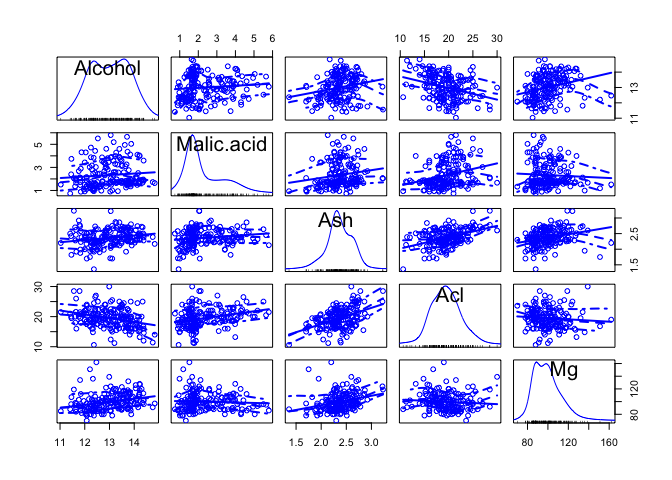

El propósito del análisis discriminante lineal (LDA) en este ejemplo es
encontrar las combinaciones lineales de las variables originales (las 13
concentraciones químicas aquí) que proporcionan la mejor separación
posible entre los grupos (variedades de vino aquí) en nuestro conjunto
de datos. El análisis discriminante lineal también se conoce como
"análisis discriminante canónico", o simplemente "análisis
discriminante".

### Supuestos:

**Homogeneidad de varianzas multivariante**

    library(vegan)
    # seleccionamos las variables ambientales a analizar 
    env.pars2 <- as.matrix(wine[, 2:14])
    # verificamos la homogeneidad multivariada de las matrices de covarianza intra-grupo
    env.pars2.d1 <- dist(env.pars2)
    env.MHV <- betadisper(env.pars2.d1, wine$Wine)
    anova(env.MHV)

<script data-pagedtable-source type="application/json">
{"columns":[{"label":[""],"name":["_rn_"],"type":[""],"align":["left"]},{"label":["Df"],"name":[1],"type":["int"],"align":["right"]},{"label":["Sum Sq"],"name":[2],"type":["dbl"],"align":["right"]},{"label":["Mean Sq"],"name":[3],"type":["dbl"],"align":["right"]},{"label":["F value"],"name":[4],"type":["dbl"],"align":["right"]},{"label":["Pr(>F)"],"name":[5],"type":["dbl"],"align":["right"]}],"data":[{"1":"2","2":"190082.2","3":"95041.09","4":"8.328574","5":"0.000350663","_rn_":"Groups"},{"1":"175","2":"1997003.5","3":"11411.45","4":"NA","5":"NA","_rn_":"Residuals"}],"options":{"columns":{"min":{},"max":[10]},"rows":{"min":[10],"max":[10]},"pages":{}}}
  </script>

    permutest(env.MHV)

    ## 
    ## Permutation test for homogeneity of multivariate dispersions
    ## Permutation: free
    ## Number of permutations: 999
    ## 
    ## Response: Distances
    ##            Df  Sum Sq Mean Sq      F N.Perm Pr(>F)    
    ## Groups      2  190082   95041 8.3286    999  0.001 ***
    ## Residuals 175 1997003   11411                         
    ## ---
    ## Signif. codes:  0 '***' 0.001 '**' 0.01 '*' 0.05 '.' 0.1 ' ' 1

Conclusión: rechazo la hipótesis nula de homogeneidad intra-grupo. Se
podría hacer transformaciones logarítmicas para enfrentar este asunto.

**Normalidad multivariante**

    library(mvnormtest)
    mshapiro.test(t(env.pars2))

    ## 
    ##  Shapiro-Wilk normality test
    ## 
    ## data:  Z
    ## W = 0.83696, p-value = 7.846e-13

Rechazamos la Ho de normalidad multivariante

**Multicolinealidad**

    as.dist(cor(env.pars2))

    ##                           Alcohol   Malic.acid          Ash          Acl
    ## Malic.acid            0.094396941                                       
    ## Ash                   0.211544596  0.164045470                          
    ## Acl                  -0.310235137  0.288500403  0.443367187             
    ## Mg                    0.270798226 -0.054575096  0.286586691 -0.083333089
    ## Phenols               0.289101123 -0.335166997  0.128979538 -0.321113317
    ## Flavanoids            0.236814928 -0.411006588  0.115077279 -0.351369860
    ## Nonflavanoid.phenols -0.155929467  0.292977133  0.186230446  0.361921719
    ## Proanth               0.136697912 -0.220746187  0.009651935 -0.197326836
    ## Color.int             0.546364195  0.248985344  0.258887259  0.018731981
    ## Hue                  -0.071747197 -0.561295689 -0.074666889 -0.273955223
    ## OD                    0.072343187 -0.368710428  0.003911231 -0.276768549
    ## Proline               0.643720037 -0.192010565  0.223626264 -0.440596931
    ##                                Mg      Phenols   Flavanoids
    ## Malic.acid                                                 
    ## Ash                                                        
    ## Acl                                                        
    ## Mg                                                         
    ## Phenols               0.214401235                          
    ## Flavanoids            0.195783770  0.864563500             
    ## Nonflavanoid.phenols -0.256294049 -0.449935301 -0.537899612
    ## Proanth               0.236440610  0.612413084  0.652691769
    ## Color.int             0.199950006 -0.055136418 -0.172379398
    ## Hue                   0.055398196  0.433681335  0.543478566
    ## OD                    0.066003936  0.699949365  0.787193902
    ## Proline               0.393350849  0.498114880  0.494193127
    ##                      Nonflavanoid.phenols      Proanth    Color.int
    ## Malic.acid                                                         
    ## Ash                                                                
    ## Acl                                                                
    ## Mg                                                                 
    ## Phenols                                                            
    ## Flavanoids                                                         
    ## Nonflavanoid.phenols                                               
    ## Proanth                      -0.365845099                          
    ## Color.int                     0.139057013 -0.025249931             
    ## Hue                          -0.262639631  0.295544253 -0.521813193
    ## OD                           -0.503269596  0.519067096 -0.428814942
    ## Proline                      -0.311385188  0.330416700  0.316100113
    ##                               Hue           OD
    ## Malic.acid                                    
    ## Ash                                           
    ## Acl                                           
    ## Mg                                            
    ## Phenols                                       
    ## Flavanoids                                    
    ## Nonflavanoid.phenols                          
    ## Proanth                                       
    ## Color.int                                     
    ## Hue                                           
    ## OD                    0.565468293             
    ## Proline               0.236183447  0.312761075

    library(MASS)
    wine.lda <- lda(Wine ~ ., data=wine)
    wine.lda

    ## Call:
    ## lda(Wine ~ ., data = wine)
    ## 
    ## Prior probabilities of groups:
    ##         1         2         3 
    ## 0.3314607 0.3988764 0.2696629 
    ## 
    ## Group means:
    ##    Alcohol Malic.acid      Ash      Acl       Mg  Phenols Flavanoids
    ## 1 13.74475   2.010678 2.455593 17.03729 106.3390 2.840169  2.9823729
    ## 2 12.27873   1.932676 2.244789 20.23803  94.5493 2.258873  2.0808451
    ## 3 13.15375   3.333750 2.437083 21.41667  99.3125 1.678750  0.7814583
    ##   Nonflavanoid.phenols  Proanth Color.int       Hue       OD   Proline
    ## 1             0.290000 1.899322  5.528305 1.0620339 3.157797 1115.7119
    ## 2             0.363662 1.630282  3.086620 1.0562817 2.785352  519.5070
    ## 3             0.447500 1.153542  7.396250 0.6827083 1.683542  629.8958
    ## 
    ## Coefficients of linear discriminants:
    ##                               LD1           LD2
    ## Alcohol              -0.403399781  0.8717930699
    ## Malic.acid            0.165254596  0.3053797325
    ## Ash                  -0.369075256  2.3458497486
    ## Acl                   0.154797889 -0.1463807654
    ## Mg                   -0.002163496 -0.0004627565
    ## Phenols               0.618052068 -0.0322128171
    ## Flavanoids           -1.661191235 -0.4919980543
    ## Nonflavanoid.phenols -1.495818440 -1.6309537953
    ## Proanth               0.134092628 -0.3070875776
    ## Color.int             0.355055710  0.2532306865
    ## Hue                  -0.818036073 -1.5156344987
    ## OD                   -1.157559376  0.0511839665
    ## Proline              -0.002691206  0.0028529846
    ## 
    ## Proportion of trace:
    ##    LD1    LD2 
    ## 0.6875 0.3125

Esto significa que la primera función discriminante es una combinación
lineal de las variables:
−0.403 \* *A**l**c**o**h**o**l* + 0.165 \* *M**a**l**i**c*…−0.003 \* *P**r**o**l**i**n**e*.
Por conveniencia, el valor de cada función discriminante (por ejemplo,
la primera función discriminante) se escala de modo que su valor medio
sea cero y su varianza sea uno.

La "proporción de traza" que se imprime cuando escribe "wine.lda" (la
variable devuelta por la función `lda()`) es la separación porcentual
lograda por cada función discriminante. Por ejemplo, para los datos del
vino obtenemos los mismos valores que acabamos de calcular (68.75% y
31.25%).

**Histrogramas de resultado**

Una buena forma de mostrar los resultados de un análisis discriminante
lineal (LDA) es hacer un histograma apilado de los valores de la función
discriminante para las muestras de diferentes grupos (diferentes
variedades de vino en nuestro ejemplo).

Podemos hacer esto usando la función `ldahist()` en R. Por ejemplo, para
hacer un histograma apilado de los valores de la primera función
discriminante para muestras de vino de los tres diferentes cultivares de
vino, escribimos:

    wine.lda.values <- predict(wine.lda)
    ldahist(data = wine.lda.values$x[,1], g=wine$Wine)

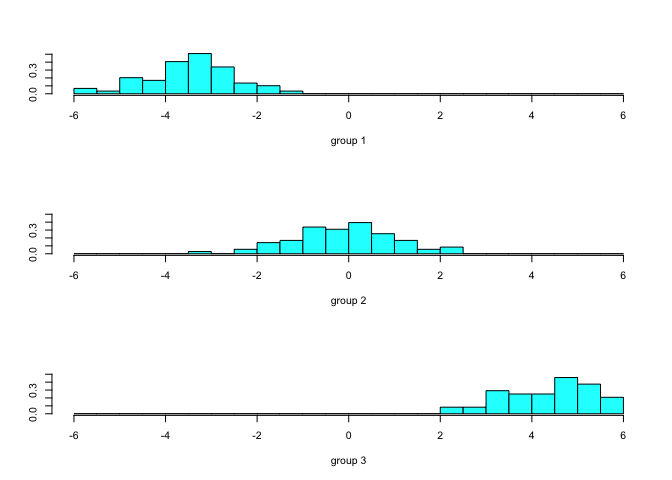

usando la segunda función discriminante:

    ldahist(data = wine.lda.values$x[,2], g=wine$Wine)

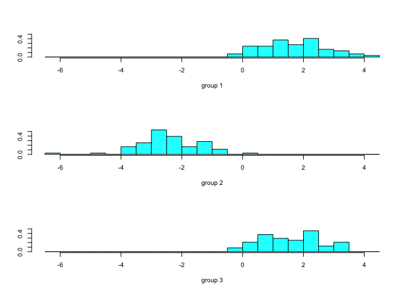

**Gráficos de las funciones discriminantes**

    plot(wine.lda.values$x[,1],wine.lda.values$x[,2]) # se realiza el grafico
    text(wine.lda.values$x[,1],wine.lda.values$x[,2],wine$Wine,cex=0.7,pos=4,col="red") # agregamos etiiquetas

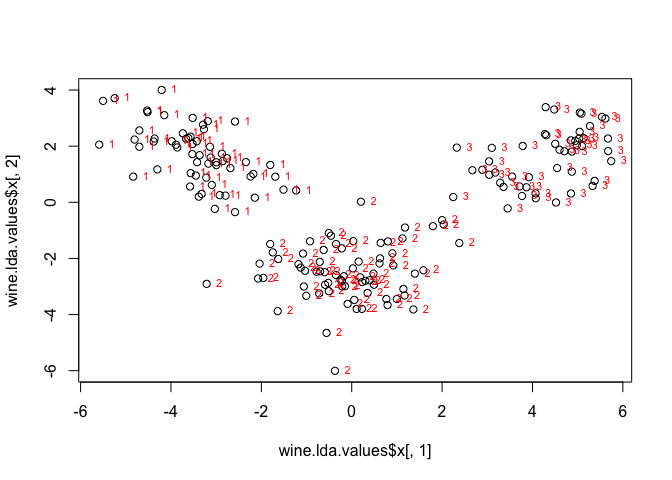

    spe.class <- predict(wine.lda)$class
    (spe.table <-table(wine$Wine, spe.class))

    ##    spe.class
    ##      1  2  3
    ##   1 59  0  0
    ##   2  0 71  0
    ##   3  0  0 48

### Ejemplo 2: Admisiones

El conjunto de datos proporciona datos de admisión para los solicitantes
a las escuelas de posgrado en los negocios. El objetivo es usar los
puntajes de GPA y GMAT para predecir la probabilidad de admisión
(admitir, no admitir y límite).

    url <- 'http://www.biz.uiowa.edu/faculty/jledolter/DataMining/admission.csv'
    admit <- read.csv(url)

    head(admit)

<script data-pagedtable-source type="application/json">
{"columns":[{"label":[""],"name":["_rn_"],"type":[""],"align":["left"]},{"label":["GPA"],"name":[1],"type":["dbl"],"align":["right"]},{"label":["GMAT"],"name":[2],"type":["int"],"align":["right"]},{"label":["De"],"name":[3],"type":["fctr"],"align":["left"]}],"data":[{"1":"2.96","2":"596","3":"admit","_rn_":"1"},{"1":"3.14","2":"473","3":"admit","_rn_":"2"},{"1":"3.22","2":"482","3":"admit","_rn_":"3"},{"1":"3.29","2":"527","3":"admit","_rn_":"4"},{"1":"3.69","2":"505","3":"admit","_rn_":"5"},{"1":"3.46","2":"693","3":"admit","_rn_":"6"}],"options":{"columns":{"min":{},"max":[10]},"rows":{"min":[10],"max":[10]},"pages":{}}}
  </script>

Realizamos un gráfico de los datos:

    adm <- data.frame(admit)
    plot(adm$GPA,adm$GMAT,col=adm$De)

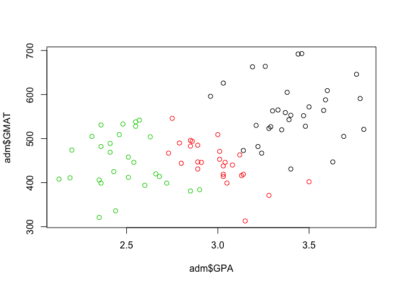

### Supuestos:

**Homogeneidad de varianzas multivariante**

    library(vegan)
    # seleccionamos las variables ambientales a analizar 
    env.pars2 <- as.matrix(adm[, 1:2])
    # verificamos la homogeneidad multivariada de las matrices de covarianza intra-grupo
    env.pars2.d1 <- dist(env.pars2)
    env.MHV <- betadisper(env.pars2.d1, adm$De)
    anova(env.MHV)

<script data-pagedtable-source type="application/json">
{"columns":[{"label":[""],"name":["_rn_"],"type":[""],"align":["left"]},{"label":["Df"],"name":[1],"type":["int"],"align":["right"]},{"label":["Sum Sq"],"name":[2],"type":["dbl"],"align":["right"]},{"label":["Mean Sq"],"name":[3],"type":["dbl"],"align":["right"]},{"label":["F value"],"name":[4],"type":["dbl"],"align":["right"]},{"label":["Pr(>F)"],"name":[5],"type":["dbl"],"align":["right"]}],"data":[{"1":"2","2":"6223.923","3":"3111.961","4":"2.400912","5":"0.09698061","_rn_":"Groups"},{"1":"82","2":"106284.940","3":"1296.158","4":"NA","5":"NA","_rn_":"Residuals"}],"options":{"columns":{"min":{},"max":[10]},"rows":{"min":[10],"max":[10]},"pages":{}}}
  </script>

    permutest(env.MHV)

    ## 
    ## Permutation test for homogeneity of multivariate dispersions
    ## Permutation: free
    ## Number of permutations: 999
    ## 
    ## Response: Distances
    ##           Df Sum Sq Mean Sq      F N.Perm Pr(>F)  
    ## Groups     2   6224  3112.0 2.4009    999  0.095 .
    ## Residuals 82 106285  1296.2                       
    ## ---
    ## Signif. codes:  0 '***' 0.001 '**' 0.01 '*' 0.05 '.' 0.1 ' ' 1

Conclusión: no rechazo la hipótesis nula de homogeneidad intra-grupo.

**Normalidad multivariante**

    library(mvnormtest)
    mshapiro.test(t(env.pars2))

    ## 
    ##  Shapiro-Wilk normality test
    ## 
    ## data:  Z
    ## W = 0.98854, p-value = 0.6623

No rechazamos la Ho de normalidad multivariante

**Multicolinealidad**

    as.dist(cor(env.pars2))

    ##            GPA
    ## GMAT 0.4606332

    library(MASS)
    m1 <- lda(De~.,adm)
    m1

    ## Call:
    ## lda(De ~ ., data = adm)
    ## 
    ## Prior probabilities of groups:
    ##     admit    border  notadmit 
    ## 0.3647059 0.3058824 0.3294118 
    ## 
    ## Group means:
    ##               GPA     GMAT
    ## admit    3.403871 561.2258
    ## border   2.992692 446.2308
    ## notadmit 2.482500 447.0714
    ## 
    ## Coefficients of linear discriminants:
    ##              LD1         LD2
    ## GPA  5.008766354  1.87668220
    ## GMAT 0.008568593 -0.01445106
    ## 
    ## Proportion of trace:
    ##    LD1    LD2 
    ## 0.9673 0.0327

Comenta los resultados.

Realizamos una predicción:

    predict(m1,newdata=data.frame(GPA=3.21,GMAT=497))

    ## $class
    ## [1] admit
    ## Levels: admit border notadmit
    ## 
    ## $posterior
    ##       admit    border     notadmit
    ## 1 0.5180421 0.4816015 0.0003563717
    ## 
    ## $x
    ##        LD1      LD2
    ## 1 1.252409 0.318194

Análisis discrimante cuadrático: Se trata de un procedimiento más
robusto que el lineal, y es útil cuando las matrices de covarianza no
son iguales. Se basa en la distancia de Mahalanobis al cuadrado respecto
al centro del grupo.

    m2 <- qda(De~.,adm)
    m2

    ## Call:
    ## qda(De ~ ., data = adm)
    ## 
    ## Prior probabilities of groups:
    ##     admit    border  notadmit 
    ## 0.3647059 0.3058824 0.3294118 
    ## 
    ## Group means:
    ##               GPA     GMAT
    ## admit    3.403871 561.2258
    ## border   2.992692 446.2308
    ## notadmit 2.482500 447.0714

Realizamos la predicción

    predict(m2,newdata=data.frame(GPA=3.21,GMAT=497))

    ## $class
    ## [1] admit
    ## Levels: admit border notadmit
    ## 
    ## $posterior
    ##       admit    border     notadmit
    ## 1 0.9226763 0.0768693 0.0004544468

**¿Qué modelo es el mejor?**

Para responder a esta pregunta, evaluamos el análisis discriminante
lineal seleccionando aleatoriamente 60 de 85 estudiantes, estimando los
parámetros en los datos de entrenamiento y clasificando a los 25
estudiantes restantes de la muestra retenida. Repetimos esto 100 veces

    n <- 85
    nt <- 60
    neval <-n-nt
    rep <- 100

    ### LDA
    set.seed(123456789)
    errlin <- dim(rep)
    for (k in 1:rep) {
    train <- sample(1:n,nt)
    ## linear discriminant analysis
    m1 <- lda(De~.,adm[train,])
    predict(m1,adm[-train,])$class
    tablin <- table(adm$De[-train],predict(m1,adm[-train,])$class)
    errlin[k] <- (neval-sum(diag(tablin)))/neval
    }
    merrlin <- mean(errlin) #media del error lineal
    merrlin

    ## [1] 0.102

Ahora en el QDA:

    ### QDA
    set.seed(123456789)
    errqda <- dim(rep)
    for (k in 1:rep) {
    train <- sample(1:n,nt)
    ## quadratic discriminant analysis
    m1 <- qda(De~.,adm[train,])
    predict(m1,adm[-train,])$class
    tablin <- table(adm$De[-train],predict(m1,adm[-train,])$class)
    errqda[k] <- (neval-sum(diag(tablin)))/neval
    }
    merrqda <- mean(errlin)
    merrqda

    ## [1] 0.102

Logramos una tasa de clasificación errónea del 10.2% en ambos casos. R
también nos da algunas herramientas de visualización. Por ejemplo en la
librería `klaR`:

    # Gráficos exploratorios para LDA or QDA
    #install.packages('klaR')
    library(klaR)
    partimat(De~.,data=adm,method="lda") 

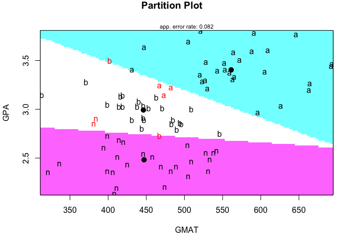

    partimat(De~.,data=adm,method="qda") 


### Ejemplo 3: Score de crédito de un banco alemán

El conjunto de datos de crédito alemán se obtuvo del [Repositorio de
aprendizaje automático UCI](https://archive.ics.uci.edu/ml/index.php).
El conjunto de datos, que contiene atributos y resultados sobre 1000
solicitudes de préstamo, fue proporcionado en 1994 por el Profesor Dr.
Hans Hofmann del Institut fuer Statistik und Oekonometrie de la
Universidad de Hamburgo. Ha servido como un importante conjunto de datos
de prueba para varios algoritmos de puntuación de crédito. Una
descripción de las variables se da en `germancreditDescription.docx` de
`DataLectures`. Comenzamos cargando los datos:

    ## read data 
    credit <- read.csv("http://www.biz.uiowa.edu/faculty/jledolter/DataMining/germancredit.csv")
    head(credit,2) # Mira la codificación en el lugar indicado

<script data-pagedtable-source type="application/json">
{"columns":[{"label":[""],"name":["_rn_"],"type":[""],"align":["left"]},{"label":["Default"],"name":[1],"type":["int"],"align":["right"]},{"label":["checkingstatus1"],"name":[2],"type":["fctr"],"align":["left"]},{"label":["duration"],"name":[3],"type":["int"],"align":["right"]},{"label":["history"],"name":[4],"type":["fctr"],"align":["left"]},{"label":["purpose"],"name":[5],"type":["fctr"],"align":["left"]},{"label":["amount"],"name":[6],"type":["int"],"align":["right"]},{"label":["savings"],"name":[7],"type":["fctr"],"align":["left"]},{"label":["employ"],"name":[8],"type":["fctr"],"align":["left"]},{"label":["installment"],"name":[9],"type":["int"],"align":["right"]},{"label":["status"],"name":[10],"type":["fctr"],"align":["left"]},{"label":["others"],"name":[11],"type":["fctr"],"align":["left"]},{"label":["residence"],"name":[12],"type":["int"],"align":["right"]},{"label":["property"],"name":[13],"type":["fctr"],"align":["left"]},{"label":["age"],"name":[14],"type":["int"],"align":["right"]},{"label":["otherplans"],"name":[15],"type":["fctr"],"align":["left"]},{"label":["housing"],"name":[16],"type":["fctr"],"align":["left"]},{"label":["cards"],"name":[17],"type":["int"],"align":["right"]},{"label":["job"],"name":[18],"type":["fctr"],"align":["left"]},{"label":["liable"],"name":[19],"type":["int"],"align":["right"]},{"label":["tele"],"name":[20],"type":["fctr"],"align":["left"]},{"label":["foreign"],"name":[21],"type":["fctr"],"align":["left"]}],"data":[{"1":"0","2":"A11","3":"6","4":"A34","5":"A43","6":"1169","7":"A65","8":"A75","9":"4","10":"A93","11":"A101","12":"4","13":"A121","14":"67","15":"A143","16":"A152","17":"2","18":"A173","19":"1","20":"A192","21":"A201","_rn_":"1"},{"1":"1","2":"A12","3":"48","4":"A32","5":"A43","6":"5951","7":"A61","8":"A73","9":"2","10":"A92","11":"A101","12":"2","13":"A121","14":"22","15":"A143","16":"A152","17":"1","18":"A173","19":"1","20":"A191","21":"A201","_rn_":"2"}],"options":{"columns":{"min":{},"max":[10]},"rows":{"min":[10],"max":[10]},"pages":{}}}
  </script>

Como se puede ver, solo las variables: duración, cantidad, plazos y edad
son numéricas. Con los restantes (indicadores) los supuestos de una
distribución normal serían, en el mejor de los casos, débiles; por lo
tanto, estas variables no se consideran aquí.

    cred1 <- credit[, c("Default","duration","amount","installment","age")]
    head(cred1)

<script data-pagedtable-source type="application/json">
{"columns":[{"label":[""],"name":["_rn_"],"type":[""],"align":["left"]},{"label":["Default"],"name":[1],"type":["int"],"align":["right"]},{"label":["duration"],"name":[2],"type":["int"],"align":["right"]},{"label":["amount"],"name":[3],"type":["int"],"align":["right"]},{"label":["installment"],"name":[4],"type":["int"],"align":["right"]},{"label":["age"],"name":[5],"type":["int"],"align":["right"]}],"data":[{"1":"0","2":"6","3":"1169","4":"4","5":"67","_rn_":"1"},{"1":"1","2":"48","3":"5951","4":"2","5":"22","_rn_":"2"},{"1":"0","2":"12","3":"2096","4":"2","5":"49","_rn_":"3"},{"1":"0","2":"42","3":"7882","4":"2","5":"45","_rn_":"4"},{"1":"1","2":"24","3":"4870","4":"3","5":"53","_rn_":"5"},{"1":"0","2":"36","3":"9055","4":"2","5":"35","_rn_":"6"}],"options":{"columns":{"min":{},"max":[10]},"rows":{"min":[10],"max":[10]},"pages":{}}}
  </script>

    summary(cred1)

    ##     Default       duration        amount       installment   
    ##  Min.   :0.0   Min.   : 4.0   Min.   :  250   Min.   :1.000  
    ##  1st Qu.:0.0   1st Qu.:12.0   1st Qu.: 1366   1st Qu.:2.000  
    ##  Median :0.0   Median :18.0   Median : 2320   Median :3.000  
    ##  Mean   :0.3   Mean   :20.9   Mean   : 3271   Mean   :2.973  
    ##  3rd Qu.:1.0   3rd Qu.:24.0   3rd Qu.: 3972   3rd Qu.:4.000  
    ##  Max.   :1.0   Max.   :72.0   Max.   :18424   Max.   :4.000  
    ##       age       
    ##  Min.   :19.00  
    ##  1st Qu.:27.00  
    ##  Median :33.00  
    ##  Mean   :35.55  
    ##  3rd Qu.:42.00  
    ##  Max.   :75.00

Transformemos los datos en un data.frame

    cred1 <- data.frame(cred1)

-   Realiza las pruebas de los supuestos y comenta los resultados
-   Estima y compara lda con qda
-   Estima la matriz de confusión
-   ¿Usarías este modelo para una aplicación real?

Árboles de decisión
-------------------

Para ilustrar el proceso de construcción del árbol, consideremos un
ejemplo simple. Imagine que está trabajando para un estudio de cine de
Hollywood, y su escritorio está repleto de guiones. En lugar de leer
cada uno de principio a fin, usted decide desarrollar un algoritmo de
árbol de decisión para predecir si una película potencial podría
clasificarse en una de tres categorías:

-   impacto mainstream,
-   amado por la crítica (critic's choice) o
-   fracaso de taquilla (box office bust).

Después de revisar los datos de 30 guiones de películas diferentes,
surge un patrón. Parece haber una relación entre el **presupuesto** de
rodaje propuesto por la película, el **número de celebridades** de la
*A* para los papeles protagónicos y las categorías de éxito.


Para construir un árbol de decisión simple usando esta información,
podemos aplicar una estrategia de *dividir y vencer*.


Resultado:


> Es posible que hayas notado que las líneas diagonales podrían haber
> dividido los datos aún más limpiamente. Esta es una limitación de del
> árbol de decisiones, que **utiliza divisiones paralelas a los ejes**.
> El hecho de que cada división considere **una característica a la
> vez** evita que el árbol de decisiones forme **decisiones más
> complejas**, como "si el número de celebridades es mayor que el
> presupuesto estimado, entonces será un éxito crítico".

Entonces, ¿qué es un árbol de decisión?

-   El modelo en sí mismo comprende una serie de decisiones lógicas,
    similares a un diagrama de flujo, con nodos de decisión que indican
    una decisión sobre un atributo. Estos se dividen en ramas que
    indican las elecciones de la decisión. El árbol termina con *nodos
    de hoja* o *leaf nodes* (también conocidos como nodos terminales)
    que denotan el resultado de seguir una combinación de decisiones.

<table>
<colgroup>
<col width="46%" />
<col width="53%" />
</colgroup>
<thead>
<tr class="header">
<th>Fortalezas</th>
<th>Debilidades</th>
</tr>
</thead>
<tbody>
<tr class="odd">
<td>Un clasificador multiuso que funciona bien en la mayoría de los problemas</td>
<td>Los modelos de árbol de decisión a menudo están sesgados hacia divisiones en características que tienen una gran cantidad de niveles</td>
</tr>
<tr class="even">
<td>El proceso de aprendizaje altamente automático puede manejar características numéricas o nominales, datos faltantes</td>
<td>Es fácil sobreajustar o ajustar el modelo</td>
</tr>
<tr class="odd">
<td>Utiliza solo las características más importantes</td>
<td>Puede tener problemas para modelar algunas relaciones debido a la dependencia de divisiones paralelas al eje</td>
</tr>
<tr class="even">
<td>Se puede usar en datos con relativamente pocos ejemplos de entrenamiento o un número muy grande</td>
<td>Pequeños cambios en los datos de entrenamiento pueden generar grandes cambios en la lógica de decisión</td>
</tr>
<tr class="odd">
<td>Resultados en un modelo que puede interpretarse sin un fondo matemático (para árboles relativamente pequeños)</td>
<td>Los árboles grandes pueden ser difíciles de interpretar y las decisiones que toman pueden parecer contradictorias</td>
</tr>
<tr class="even">
<td>Más eficiente que otros modelos complejos</td>
<td></td>
</tr>
</tbody>
</table>

### Elegir la *mejor* partición

**Entropía**

> La entropía de una muestra de datos indica qué tan mezclados están los
> valores de clase; el valor mínimo de 0 indica que la muestra es
> completamente homogénea, mientras que 1 indica la cantidad máxima de
> desorden.

$$
Entropy(S) = \\sum\_{i=1}^{c}-p\_ilog\_2(p\_i)
$$

En la fórmula de entropía, para un segmento dado de datos (*S*), el
término *c* se refiere al número de diferentes **niveles de clase**, y
*p*<sub>*i*</sub> se refiere a la proporción de valores que caen en el
nivel de clase *i*. Por ejemplo, supongamos que tenemos una partición de
datos con dos clases: rojo (60 por ciento) y blanco (40 por ciento).
Podemos calcular la entropía como:

    -0.60 * log2(0.60) - 0.40 * log2(0.40)

    ## [1] 0.9709506

Podemos examinar la entropía para todos los posibles arreglos de dos
clases. Si sabemos que la proporción de ejemplos en una clase es *x*,
entonces la proporción en la otra clase es 1 − *x*. Usando la función
`curve()`, podemos trazar la entropía para todos los valores posibles de
*x*:

    curve(-x * log2(x) - (1 - x) * log2(1 - x),col="red", xlab = "x", ylab = "Entropía", lwd=4)

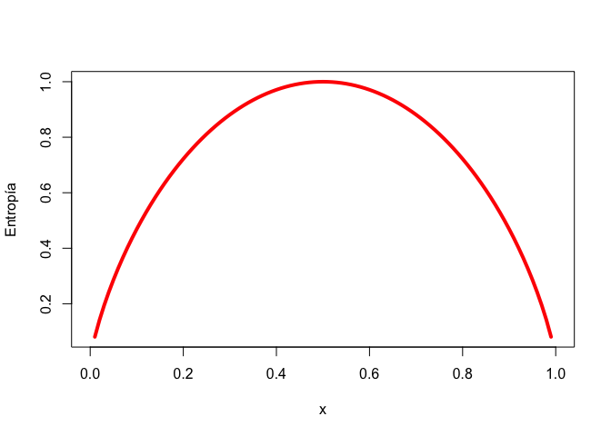

Como se ilustra por el pico en entropía en *x* = 0.50, una división
50 − 50 da como resultado la **entropía máxima**. A medida que una clase
domina cada vez más a la otra, la entropía se reduce a cero.

Dada esta medida de pureza (como la entropía), el algoritmo aún debe
**decidir qué característica dividir**. Para esto, el algoritmo usa la
entropía para calcular el cambio en la homogeneidad resultante de una
división en cada característica posible. El cálculo se conoce como
**ganancia de información**. La ganancia de información para una
característica *F* se calcula como la diferencia entre la entropía en el
segmento antes de la división (*S*<sub>1</sub>) y las particiones
resultantes de la división (*S*<sub>2</sub>)

*I**n**f**o**G**a**i**n*(*F*)=*E**n**t**r**o**p**y*(*S*<sub>1</sub>)−*E**n**t**r**o**p**y*(*S*<sub>2</sub>)

Cuanto mayor sea la ganancia de información, mejor será una función para
crear grupos homogéneos después de una división en esa función.

> Aunque es utilizado por C5.0, la **ganancia de información no es el
> único** criterio de división que se puede usar para construir árboles
> de decisión. Otros criterios comúnmente utilizados son el **índice de
> Gini**, la estadística **Chi-cuadrado** y la **relación de ganancia**.
> Para profundizar en estos criterios revisa: Mingers (1989)

### Ejemplo: Identificando el riesgo de un préstamo

#### Paso 1: recopilación de datos

Los datos representan los préstamos obtenidos de una agencia de crédito
en Alemania.

    uu <- "https://github.com/vmoprojs/DataLectures/blob/master/credit.RData?raw=true"
    library(repmis)
    source_data(uu)

    ## [1] "credit"

    str(credit)

    ## 'data.frame':    1000 obs. of  17 variables:
    ##  $ checking_balance    : Factor w/ 4 levels "< 0 DM","> 200 DM",..: 1 3 4 1 1 4 4 3 4 3 ...
    ##  $ months_loan_duration: int  6 48 12 42 24 36 24 36 12 30 ...
    ##  $ credit_history      : Factor w/ 5 levels "critical","good",..: 1 2 1 2 4 2 2 2 2 1 ...
    ##  $ purpose             : Factor w/ 6 levels "business","car",..: 5 5 4 5 2 4 5 2 5 2 ...
    ##  $ amount              : int  1169 5951 2096 7882 4870 9055 2835 6948 3059 5234 ...
    ##  $ savings_balance     : Factor w/ 5 levels "< 100 DM","> 1000 DM",..: 5 1 1 1 1 5 4 1 2 1 ...
    ##  $ employment_duration : Factor w/ 5 levels "< 1 year","> 7 years",..: 2 3 4 4 3 3 2 3 4 5 ...
    ##  $ percent_of_income   : int  4 2 2 2 3 2 3 2 2 4 ...
    ##  $ years_at_residence  : int  4 2 3 4 4 4 4 2 4 2 ...
    ##  $ age                 : int  67 22 49 45 53 35 53 35 61 28 ...
    ##  $ other_credit        : Factor w/ 3 levels "bank","none",..: 2 2 2 2 2 2 2 2 2 2 ...
    ##  $ housing             : Factor w/ 3 levels "other","own",..: 2 2 2 1 1 1 2 3 2 2 ...
    ##  $ existing_loans_count: int  2 1 1 1 2 1 1 1 1 2 ...
    ##  $ job                 : Factor w/ 4 levels "management","skilled",..: 2 2 4 2 2 4 2 1 4 1 ...
    ##  $ dependents          : int  1 1 2 2 2 2 1 1 1 1 ...
    ##  $ phone               : Factor w/ 2 levels "no","yes": 2 1 1 1 1 2 1 2 1 1 ...
    ##  $ default             : Factor w/ 2 levels "no","yes": 1 2 1 1 2 1 1 1 1 2 ...

El conjunto de datos crediticios incluye 1000 ejemplos de préstamos, más
una combinación de características numéricas y nominales que indican las
características del préstamo y del solicitante del préstamo.

Una variable indica si el préstamo **entró en default**. Veamos si
podemos determinar un patrón que prediga este resultado.

#### Paso 2: Explorar y preparar los datos

Veamos algunos de los resultados de `table()` para un par de
características de préstamos que **parecen predecir un incumplimiento**.
Las características `checking_balance` y `savings_balance` indican el
saldo de la cuenta de cheques y de ahorros del solicitante, y se
registran como variables categóricas:

    table(credit$checking_balance)

    ## 
    ##     < 0 DM   > 200 DM 1 - 200 DM    unknown 
    ##        274         63        269        394

    table(credit$savings_balance)

    ## 
    ##      < 100 DM     > 1000 DM  100 - 500 DM 500 - 1000 DM       unknown 
    ##           603            48           103            63           183

Dado que los datos del préstamo se obtuvieron de Alemania, la moneda se
registra en *Deutsche Marks (DM)*. Parece una suposición válida que los
saldos de cuentas corrientes y de **ahorro más grandes** deberían estar
relacionados con una **menor posibilidad de impago** del préstamo.

Algunas de las funciones del préstamo son numéricas, como su plazo
(`months_loan_duration`) y el monto de crédito solicitado (`amount`).

    summary(credit$months_loan_duration)

    ##    Min. 1st Qu.  Median    Mean 3rd Qu.    Max. 
    ##     4.0    12.0    18.0    20.9    24.0    72.0

    summary(credit$amount)

    ##    Min. 1st Qu.  Median    Mean 3rd Qu.    Max. 
    ##     250    1366    2320    3271    3972   18424

Los montos de los préstamos oscilaron entre 250 DM y 18420 DM a plazos
de 4 a 72 meses, con una duración media de 18 meses y un monto de 2320
DM.

La variable `default` indica si el solicitante del préstamo no pudo
cumplir con los términos de pago acordados y entró en incumplimiento. Un
total del 30 por ciento de los préstamos entraron en mora:

    table(credit$default)

    ## 
    ##  no yes 
    ## 700 300

Una alta tasa de incumplimiento no es deseable para un banco porque
significa que es poco probable que el banco recupere completamente su
inversión. Si tenemos éxito, nuestro **modelo identificará a los
solicitantes que es probable que presenten un incumplimiento**, tal que
este número se pueda reducir.

**Creamos el conjunto de entrenamiento y de prueba**

1.  ordenar al azar su data de crédito antes de dividir.

<!-- -->

    set.seed(12345)
    credit_rand <- credit[order(runif(1000)), ]

Confirmemos que los datos no han cambiado

    summary(credit$amount)

    ##    Min. 1st Qu.  Median    Mean 3rd Qu.    Max. 
    ##     250    1366    2320    3271    3972   18424

    summary(credit_rand$amount)

    ##    Min. 1st Qu.  Median    Mean 3rd Qu.    Max. 
    ##     250    1366    2320    3271    3972   18424

1.  Ahora, podemos dividir los datos en entrenamiento (90 por ciento o
    900 registros) y datos de prueba (10 por ciento o 100 registros)

<!-- -->

    credit_train <- credit_rand[1:900, ]
    credit_test <- credit_rand[901:1000, ]

Si todo salió bien, deberíamos tener alrededor del 30 por ciento de los
préstamos impagos en cada uno de los conjuntos de datos.

    prop.table(table(credit_train$default))

    ## 
    ##        no       yes 
    ## 0.7022222 0.2977778

    prop.table(table(credit_test$default))

    ## 
    ##   no  yes 
    ## 0.68 0.32

#### Paso 3: entrenar un modelo en los datos

La columna 17 en `credit_train` es la variable `default`, por lo que
debemos excluirla del marco de datos de entrenamiento como una variable
independiente, pero suministrarla como dependiente para la
clasificación:

    library(C50)
    credit_model <- C5.0(credit_train[-17], credit_train$default)
    credit_model

    ## 
    ## Call:
    ## C5.0.default(x = credit_train[-17], y = credit_train$default)
    ## 
    ## Classification Tree
    ## Number of samples: 900 
    ## Number of predictors: 16 
    ## 
    ## Tree size: 67 
    ## 
    ## Non-standard options: attempt to group attributes

`Tree size` indica que el árbol tiene 67 decisiones de profundidad. Para
mirar las decisiones, usamos `summary`

    summary(credit_model)

    ## 
    ## Call:
    ## C5.0.default(x = credit_train[-17], y = credit_train$default)
    ## 
    ## 
    ## C5.0 [Release 2.07 GPL Edition]      Wed Aug  1 04:05:19 2018
    ## -------------------------------
    ## 
    ## Class specified by attribute `outcome'
    ## 
    ## Read 900 cases (17 attributes) from undefined.data
    ## 
    ## Decision tree:
    ## 
    ## checking_balance = unknown: no (358/44)
    ## checking_balance in {< 0 DM,> 200 DM,1 - 200 DM}:
    ## :...credit_history in {perfect,very good}:
    ##     :...dependents > 1: yes (10/1)
    ##     :   dependents <= 1:
    ##     :   :...savings_balance = < 100 DM: yes (39/11)
    ##     :       savings_balance in {> 1000 DM,500 - 1000 DM,unknown}: no (8/1)
    ##     :       savings_balance = 100 - 500 DM:
    ##     :       :...checking_balance = < 0 DM: no (1)
    ##     :           checking_balance in {> 200 DM,1 - 200 DM}: yes (5/1)
    ##     credit_history in {critical,good,poor}:
    ##     :...months_loan_duration <= 11: no (87/14)
    ##         months_loan_duration > 11:
    ##         :...savings_balance = > 1000 DM: no (13)
    ##             savings_balance in {< 100 DM,100 - 500 DM,500 - 1000 DM,unknown}:
    ##             :...checking_balance = > 200 DM:
    ##                 :...dependents > 1: yes (3)
    ##                 :   dependents <= 1:
    ##                 :   :...credit_history in {good,poor}: no (23/3)
    ##                 :       credit_history = critical:
    ##                 :       :...amount <= 2337: yes (3)
    ##                 :           amount > 2337: no (6)
    ##                 checking_balance = 1 - 200 DM:
    ##                 :...savings_balance = unknown: no (34/6)
    ##                 :   savings_balance in {< 100 DM,100 - 500 DM,500 - 1000 DM}:
    ##                 :   :...months_loan_duration > 45: yes (11/1)
    ##                 :       months_loan_duration <= 45:
    ##                 :       :...other_credit = store:
    ##                 :           :...age <= 35: yes (4)
    ##                 :           :   age > 35: no (2)
    ##                 :           other_credit = bank:
    ##                 :           :...years_at_residence <= 1: no (3)
    ##                 :           :   years_at_residence > 1:
    ##                 :           :   :...existing_loans_count <= 1: yes (5)
    ##                 :           :       existing_loans_count > 1:
    ##                 :           :       :...percent_of_income <= 2: no (4/1)
    ##                 :           :           percent_of_income > 2: yes (3)
    ##                 :           other_credit = none:
    ##                 :           :...job = unemployed: no (1)
    ##                 :               job = management:
    ##                 :               :...amount <= 7511: no (10/3)
    ##                 :               :   amount > 7511: yes (7)
    ##                 :               job = unskilled: [S1]
    ##                 :               job = skilled:
    ##                 :               :...dependents <= 1: no (55/15)
    ##                 :                   dependents > 1:
    ##                 :                   :...age <= 34: no (3)
    ##                 :                       age > 34: yes (4)
    ##                 checking_balance = < 0 DM:
    ##                 :...job = management: no (26/6)
    ##                     job = unemployed: yes (4/1)
    ##                     job = unskilled:
    ##                     :...employment_duration in {4 - 7 years,
    ##                     :   :                       unemployed}: no (4)
    ##                     :   employment_duration = < 1 year:
    ##                     :   :...other_credit = bank: no (1)
    ##                     :   :   other_credit in {none,store}: yes (11/2)
    ##                     :   employment_duration = > 7 years:
    ##                     :   :...other_credit in {bank,none}: no (5/1)
    ##                     :   :   other_credit = store: yes (2)
    ##                     :   employment_duration = 1 - 4 years:
    ##                     :   :...age <= 39: no (14/3)
    ##                     :       age > 39:
    ##                     :       :...credit_history in {critical,good}: yes (3)
    ##                     :           credit_history = poor: no (1)
    ##                     job = skilled:
    ##                     :...credit_history = poor:
    ##                         :...savings_balance in {< 100 DM,100 - 500 DM,
    ##                         :   :                   500 - 1000 DM}: yes (8)
    ##                         :   savings_balance = unknown: no (1)
    ##                         credit_history = critical:
    ##                         :...other_credit = store: no (0)
    ##                         :   other_credit = bank: yes (4)
    ##                         :   other_credit = none:
    ##                         :   :...savings_balance in {100 - 500 DM,
    ##                         :       :                   unknown}: no (1)
    ##                         :       savings_balance = 500 - 1000 DM: yes (1)
    ##                         :       savings_balance = < 100 DM:
    ##                         :       :...months_loan_duration <= 13:
    ##                         :           :...percent_of_income <= 3: yes (3)
    ##                         :           :   percent_of_income > 3: no (3/1)
    ##                         :           months_loan_duration > 13:
    ##                         :           :...amount <= 5293: no (10/1)
    ##                         :               amount > 5293: yes (2)
    ##                         credit_history = good:
    ##                         :...existing_loans_count > 1: yes (5)
    ##                             existing_loans_count <= 1:
    ##                             :...other_credit = store: no (2)
    ##                                 other_credit = bank:
    ##                                 :...percent_of_income <= 2: yes (2)
    ##                                 :   percent_of_income > 2: no (6/1)
    ##                                 other_credit = none: [S2]
    ## 
    ## SubTree [S1]
    ## 
    ## employment_duration in {< 1 year,1 - 4 years}: yes (11/3)
    ## employment_duration in {> 7 years,4 - 7 years,unemployed}: no (8)
    ## 
    ## SubTree [S2]
    ## 
    ## savings_balance = 100 - 500 DM: yes (3)
    ## savings_balance = 500 - 1000 DM: no (1)
    ## savings_balance = unknown:
    ## :...phone = no: yes (9/1)
    ## :   phone = yes: no (3/1)
    ## savings_balance = < 100 DM:
    ## :...percent_of_income <= 1: no (4)
    ##     percent_of_income > 1:
    ##     :...phone = yes: yes (10/1)
    ##         phone = no:
    ##         :...purpose in {business,car0,education,renovations}: yes (3)
    ##             purpose = car:
    ##             :...percent_of_income <= 3: no (2)
    ##             :   percent_of_income > 3: yes (6/1)
    ##             purpose = furniture/appliances:
    ##             :...years_at_residence <= 1: no (4)
    ##                 years_at_residence > 1:
    ##                 :...housing = other: no (1)
    ##                     housing = rent: yes (2)
    ##                     housing = own:
    ##                     :...amount <= 1778: no (3)
    ##                         amount > 1778:
    ##                         :...years_at_residence <= 3: yes (6)
    ##                             years_at_residence > 3: no (3/1)
    ## 
    ## 
    ## Evaluation on training data (900 cases):
    ## 
    ##      Decision Tree   
    ##    ----------------  
    ##    Size      Errors  
    ## 
    ##      66  125(13.9%)   <<
    ## 
    ## 
    ##     (a)   (b)    <-classified as
    ##    ----  ----
    ##     609    23    (a): class no
    ##     102   166    (b): class yes
    ## 
    ## 
    ##  Attribute usage:
    ## 
    ##  100.00% checking_balance
    ##   60.22% credit_history
    ##   53.22% months_loan_duration
    ##   49.44% savings_balance
    ##   30.89% job
    ##   25.89% other_credit
    ##   17.78% dependents
    ##    9.67% existing_loans_count
    ##    7.22% percent_of_income
    ##    6.67% employment_duration
    ##    5.78% phone
    ##    5.56% amount
    ##    3.78% years_at_residence
    ##    3.44% age
    ##    3.33% purpose
    ##    1.67% housing
    ## 
    ## 
    ## Time: 0.0 secs

Las primeras líneas del `summary` se leerían así:

1.  Si se desconoce el saldo de la cuenta, clasifique como **no probable
    el incumplimiento**.
2.  De lo contrario, si el saldo de la cuenta es menor que cero DM,
    entre uno y 200 DM, o más de 200 DM y ...
3.  El historial de crédito es muy bueno o perfecto, y ...
4.  Hay más de un dependiente, luego clasifíquelo como **probable de
    incumplimiento**.

Los números entre paréntesis indican el **número de individuos que
cumplen los criterios para esa decisión y el número incorrectamente
clasificado por la decisión**. Por ejemplo, en la primera línea,
(358/44) indica que de los 358 individuos que llegaron a la decisión, 44
se clasificaron incorrectamente como *no*, es decir, que no es probable
que entren en incumplimiento. En otras palabras, 44 solicitantes
incumplieron a pesar de que la predicción del modelo dijo lo contrario.

Después de la salida del árbol, el resumen (`credit_model`) muestra una
matriz de confusión, que es una tabulación cruzada que indica los
registros incorrectamente clasificados del modelo en los datos de
capacitación.

> Los árboles de decisión son conocidos por tener una tendencia a
> sobreajustar el modelo a los datos de entrenamiento. Por esta razón,
> la tasa de error informada en los datos de entrenamiento puede ser
> demasiado optimista, y es especialmente **importante** evaluar los
> árboles de decisión en un conjunto de datos de prueba.

#### Paso 4: evaluar el rendimiento del modelo

    credit_pred <- predict(credit_model, credit_test)

Revisemos el ajuste

    library(gmodels)
    CrossTable(credit_test$default, credit_pred,
    prop.chisq = FALSE, prop.c = FALSE, prop.r = FALSE,
    dnn = c('actual default', 'predicted default'))

    ## 
    ##  
    ##    Cell Contents
    ## |-------------------------|
    ## |                       N |
    ## |         N / Table Total |
    ## |-------------------------|
    ## 
    ##  
    ## Total Observations in Table:  100 
    ## 
    ##  
    ##                | predicted default 
    ## actual default |        no |       yes | Row Total | 
    ## ---------------|-----------|-----------|-----------|
    ##             no |        57 |        11 |        68 | 
    ##                |     0.570 |     0.110 |           | 
    ## ---------------|-----------|-----------|-----------|
    ##            yes |        16 |        16 |        32 | 
    ##                |     0.160 |     0.160 |           | 
    ## ---------------|-----------|-----------|-----------|
    ##   Column Total |        73 |        27 |       100 | 
    ## ---------------|-----------|-----------|-----------|
    ## 
    ## 

De los 100 registros de solicitud de préstamo de prueba, nuestro modelo
predijo correctamente que 57 no incumplieron y 16 incumplieron, lo que
arrojó una precisión del 73% y una tasa de error del 27%. Esto es algo
peor que su rendimiento en los datos de entrenamiento, pero no es
inesperado, dado que el rendimiento de un modelo es a menudo peor en
datos no vistos.

También ten en cuenta que el modelo solo predijo correctamente el 50 por
ciento de los 32 valores predeterminados de préstamo en los datos de
prueba (16/32). Desafortunadamente, este tipo de error es un error
potencialmente muy costoso. Veamos si podemos mejorar el resultado con
un poco más de esfuerzo.

#### Paso 5: mejorando el ajuste (boosting)

El boosting se basa en la noción de que al combinar un número de
aprendices de rendimiento débil, puede crear un equipo que sea mucho más
fuerte que cualquiera de los alumnos solo.

Cada uno de los modelos tiene un conjunto único de fortalezas y
debilidades, y puede ser mejor o peor en ciertos problemas. Usar una
combinación de varios *learners* con fortalezas y debilidades
complementarias puede por lo tanto mejorar dramáticamente la precisión
de un clasificador.

Simplemente necesitamos agregar un parámetro adicional `trials` que
indique el **número de árboles de decisión separados** para usar en el
equipo *boost*. El parámetro `trials` establece un límite superior; el
algoritmo **dejará de agregar árboles si reconoce que las pruebas
adicionales no parecen mejorar la precisión**. Comenzaremos con 10
`trials`, un número que se ha convertido en el **estándar** de facto, ya
que las investigaciones sugieren que esto reduce las tasas de error en
los datos de prueba en aproximadamente un **25 por ciento**.

    credit_boost10 <- C5.0(credit_train[-17], credit_train$default,
    trials = 10)
    credit_boost10

    ## 
    ## Call:
    ## C5.0.default(x = credit_train[-17], y = credit_train$default, trials = 10)
    ## 
    ## Classification Tree
    ## Number of samples: 900 
    ## Number of predictors: 16 
    ## 
    ## Number of boosting iterations: 10 
    ## Average tree size: 56 
    ## 
    ## Non-standard options: attempt to group attributes

    # summary(credit_boost10)


El clasificador cometió 31 errores en 900 ejemplos de entrenamiento con
una tasa de error del 3.4 por ciento. ¡Esto representa una gran mejora
con respecto a la tasa de error de entrenamiento del 13.9 por ciento que
notamos antes de agregar *boost*! Sin embargo, queda por ver si vemos
una mejora similar en los datos de prueba. Vamos a ver:

    credit_boost_pred10 <- predict(credit_boost10, credit_test)
    CrossTable(credit_test$default, credit_boost_pred10,
    prop.chisq = FALSE, prop.c = FALSE, prop.r = FALSE,
    dnn = c('actual default', 'predicted default'))

    ## 
    ##  
    ##    Cell Contents
    ## |-------------------------|
    ## |                       N |
    ## |         N / Table Total |
    ## |-------------------------|
    ## 
    ##  
    ## Total Observations in Table:  100 
    ## 
    ##  
    ##                | predicted default 
    ## actual default |        no |       yes | Row Total | 
    ## ---------------|-----------|-----------|-----------|
    ##             no |        60 |         8 |        68 | 
    ##                |     0.600 |     0.080 |           | 
    ## ---------------|-----------|-----------|-----------|
    ##            yes |        15 |        17 |        32 | 
    ##                |     0.150 |     0.170 |           | 
    ## ---------------|-----------|-----------|-----------|
    ##   Column Total |        75 |        25 |       100 | 
    ## ---------------|-----------|-----------|-----------|
    ## 
    ## 

Aquí, redujimos la tasa de error total del 27 por ciento antes del
*boost* al 23 por ciento en el modelo *boost* No parece una gran
ganancia, pero está razonablemente cerca de la reducción del 25 por
ciento que esperábamos.

Por otro lado, el modelo todavía no está funcionando bien para predecir
los valores predeterminados, obteniendo 15/32 = 47% de errores. La falta
de una mejora aún mayor puede ser una función de nuestro conjunto de
datos de capacitación relativamente pequeño, o puede ser un problema muy
difícil de resolver.

Vecinos más cercanos
--------------------

> Dios los cría y ellos se juntan

-   Las cosas que son parecidas probablemente tengan propiedades
    similares. Podemos usar este principio para clasificar los datos
    colocándolos en la categoría con los vecinos más similares o "más
    cercanos".

-   Los clasificadores de vecinos más cercanos se definen por su
    característica de clasificar los ejemplos **no etiquetados
    asignándoles la clase de los ejemplos etiquetados más similares**.

-   En general, los clasificadores de vecinos más cercanos son adecuados
    para tareas de **clasificación** donde las relaciones entre las
    características y las clases objetivo son numerosas, complicadas o
    de otra manera extremadamente difíciles de entender, sin embargo,
    los elementos del tipo de clase similar tienden a ser bastante
    homogéneos.

-   si no hay una distinción clara entre los grupos, el algoritmo en
    general no es muy adecuado para identificar el límite.

<table style="width:100%;">
<colgroup>
<col width="34%" />
<col width="65%" />
</colgroup>
<thead>
<tr class="header">
<th>Fortalezas</th>
<th>Debilidades</th>
</tr>
</thead>
<tbody>
<tr class="odd">
<td>Simple y efectivo</td>
<td>No produce un modelo, lo que limita la capacidad de encontrar nuevos conocimientos en las relaciones entre las funciones</td>
</tr>
<tr class="even">
<td>No hace suposiciones sobre la distribución de datos subyacente</td>
<td>Fase de clasificación lenta</td>
</tr>
<tr class="odd">
<td>Fase de entrenamiento rápido</td>
<td>Requiere una gran cantidad de memoria</td>
</tr>
<tr class="even">
<td></td>
<td>Las características nominales y los datos faltantes requieren procesamiento adicional</td>
</tr>
</tbody>
</table>

**Preparar los datos para usar kNN**

Las características se transforman típicamente a un rango estándar antes
de aplicar el algoritmo kNN. La razón de este paso es que la fórmula de
distancia depende de cómo se miden las características.

-   El método tradicional de reescalar funciones para kNN es la
    **normalización min-max**. Este proceso transforma una
    característica tal que todos sus valores caen en un rango entre 0
    y 1.

$$
X\_{new} = \\frac{X-min(X)}{max(X)-min(X)}
$$

Los valores de las características normalizadas se pueden interpretar
como indicando qué tan lejos, del 0 por ciento al 100 por ciento, el
valor original cayó a lo largo del rango entre el mínimo original y el
máximo.

-   Otra transformación común se llama **estandarización z-score**. La
    siguiente fórmula resta el valor medio de la característica *X* y se
    divide por la desviación estándar de *X*:

$$
X\_{new} = \\frac{X-\\mu}{\\sigma}=\\frac{X-Mean(X)}{StdDev(X)}
$$

Los puntajes z caen en un rango ilimitado de números negativos y
positivos. A diferencia de los valores normalizados, no tienen un mínimo
ni un máximo predefinidos.

-   Datos nominales: Una solución típica utiliza **codificación
    binaria**, donde un valor de 1 indica una categoría y 0 indica la
    otra. Por ejemplo, la codificación dummy para una variable de género
    podría construirse como

$$
male =
  \\begin{cases}
    1      & \\quad \\text{if } x \\text{ is male}\\\\
    0  & \\quad \\text{otherwise }
  \\end{cases}
$$

Un aspecto conveniente de la codificación dummy es que la distancia
entre las características de código dummy es siempre uno o cero, y por
lo tanto, los valores caen en la misma escala que los datos numéricos
normalizados. No es necesaria una transformación adicional.
[Aquí](http://stat.ethz.ch/education/semesters/ss2012/ams/slides/v4.2.pdf)
les dejo un link con más información sobre este tema.

### Paso 1: recopilación de datos

Utilizaremos el conjunto de datos "Breast Cancer Wisconsin Diagnostic"
del Repositorio de Aprendizaje Automático UCI.

Los datos de cáncer de mama incluyen 569 muestras de biopsias de cáncer,
cada una con 32 características. Una característica es un número de
identificación, otra es el diagnóstico de cáncer y 30 son mediciones de
laboratorio con valores numéricos. El diagnóstico se codifica como `M`
para indicar maligno o `B` para indicar benigno.

Las 30 mediciones numéricas comprenden la media, el error estándar y el
peor valor (es decir, el más grande) para 10 características diferentes
de los núcleos celulares digitalizados. Éstas incluyen:

> Radio, Textura, Perímetro, Área, Suavizamiento, Compacidad,
> Concavidad, Puntos de concavidad, Simetría, Dimensión fractal

Según sus nombres, todas las características parecen estar relacionadas
con la **forma y el tamaño** de los núcleos celulares. A menos que seas
un oncólogo, es poco probable que sepas cómo se relaciona cada uno con
las masas benignas o malignas. Estos patrones se revelarán a medida que
continuemos en el proceso de machine learning.

### Paso 2: Explorar y preparar los datos

Exploremos los datos y veamos si podemos arrojar algo de luz sobre las
relaciones. Al mismo tiempo, prepararemos los datos para usarlos con el
método de aprendizaje kNN.

    uu <- "https://raw.githubusercontent.com/vmoprojs/DataLectures/master/wisc_bc_data.csv"
    wbcd <- read.csv(url(uu))
    head(str(wbcd))

    ## 'data.frame':    569 obs. of  34 variables:
    ##  $ X.1                    : int  1 2 3 4 5 6 7 8 9 10 ...
    ##  $ X                      : int  1 2 3 4 5 6 7 8 9 10 ...
    ##  $ id                     : int  842302 842517 84300903 84348301 84358402 843786 844359 84458202 844981 84501001 ...
    ##  $ diagnosis              : Factor w/ 2 levels "B","M": 2 2 2 2 2 2 2 2 2 2 ...
    ##  $ radius_mean            : num  18 20.6 19.7 11.4 20.3 ...
    ##  $ texture_mean           : num  10.4 17.8 21.2 20.4 14.3 ...
    ##  $ perimeter_mean         : num  122.8 132.9 130 77.6 135.1 ...
    ##  $ area_mean              : num  1001 1326 1203 386 1297 ...
    ##  $ smoothness_mean        : num  0.1184 0.0847 0.1096 0.1425 0.1003 ...
    ##  $ compactness_mean       : num  0.2776 0.0786 0.1599 0.2839 0.1328 ...
    ##  $ concavity_mean         : num  0.3001 0.0869 0.1974 0.2414 0.198 ...
    ##  $ concave.points_mean    : num  0.1471 0.0702 0.1279 0.1052 0.1043 ...
    ##  $ symmetry_mean          : num  0.242 0.181 0.207 0.26 0.181 ...
    ##  $ fractal_dimension_mean : num  0.0787 0.0567 0.06 0.0974 0.0588 ...
    ##  $ radius_se              : num  1.095 0.543 0.746 0.496 0.757 ...
    ##  $ texture_se             : num  0.905 0.734 0.787 1.156 0.781 ...
    ##  $ perimeter_se           : num  8.59 3.4 4.58 3.44 5.44 ...
    ##  $ area_se                : num  153.4 74.1 94 27.2 94.4 ...
    ##  $ smoothness_se          : num  0.0064 0.00522 0.00615 0.00911 0.01149 ...
    ##  $ compactness_se         : num  0.049 0.0131 0.0401 0.0746 0.0246 ...
    ##  $ concavity_se           : num  0.0537 0.0186 0.0383 0.0566 0.0569 ...
    ##  $ concave.points_se      : num  0.0159 0.0134 0.0206 0.0187 0.0188 ...
    ##  $ symmetry_se            : num  0.03 0.0139 0.0225 0.0596 0.0176 ...
    ##  $ fractal_dimension_se   : num  0.00619 0.00353 0.00457 0.00921 0.00511 ...
    ##  $ radius_worst           : num  25.4 25 23.6 14.9 22.5 ...
    ##  $ texture_worst          : num  17.3 23.4 25.5 26.5 16.7 ...
    ##  $ perimeter_worst        : num  184.6 158.8 152.5 98.9 152.2 ...
    ##  $ area_worst             : num  2019 1956 1709 568 1575 ...
    ##  $ smoothness_worst       : num  0.162 0.124 0.144 0.21 0.137 ...
    ##  $ compactness_worst      : num  0.666 0.187 0.424 0.866 0.205 ...
    ##  $ concavity_worst        : num  0.712 0.242 0.45 0.687 0.4 ...
    ##  $ concave.points_worst   : num  0.265 0.186 0.243 0.258 0.163 ...
    ##  $ symmetry_worst         : num  0.46 0.275 0.361 0.664 0.236 ...
    ##  $ fractal_dimension_worst: num  0.1189 0.089 0.0876 0.173 0.0768 ...

    ## NULL

La primera variable es una variable entera llamada `id`. Como este es
simplemente un identificador único (ID) para cada paciente en los datos,
no proporciona información útil y tendremos que excluirlo del modelo.
(También exluimos X por razones similares)

    wbcd <- wbcd[-c(1,2,3)]

La siguiente variable, el diagnóstico, es de particular interés, ya que
es el resultado que esperamos predecir. Esta característica indica si el
ejemplo es de una masa benigna o maligna

    table(wbcd$diagnosis)

    ## 
    ##   B   M 
    ## 357 212

Muchos clasificadores de aprendizaje de máquina R requieren que la
característica objetivo esté codificada como un factor, por lo que
necesitaremos recodificar la variable de diagnóstico

    levels(wbcd$diagnosis) <- c("Benign", "Malignant")

    round(prop.table(table(wbcd$diagnosis)) * 100, digits = 1)

    ## 
    ##    Benign Malignant 
    ##      62.7      37.3

Las 30 características restantes son todas numéricas, y como se
esperaba, constan de tres medidas diferentes de diez características. A
modo ilustrativo, solo analizaremos más detenidamente tres de las
características:

    summary(wbcd[c("radius_mean", "area_mean", "smoothness_mean")])

    ##   radius_mean       area_mean      smoothness_mean  
    ##  Min.   : 6.981   Min.   : 143.5   Min.   :0.05263  
    ##  1st Qu.:11.700   1st Qu.: 420.3   1st Qu.:0.08637  
    ##  Median :13.370   Median : 551.1   Median :0.09587  
    ##  Mean   :14.127   Mean   : 654.9   Mean   :0.09636  
    ##  3rd Qu.:15.780   3rd Qu.: 782.7   3rd Qu.:0.10530  
    ##  Max.   :28.110   Max.   :2501.0   Max.   :0.16340

¿Notan algún problema con este resultado?

**Transformación: normalizando los datos numéricos**

    normalize <- function(x) {
    return ((x - min(x)) / (max(x) - min(x)))
    }

    wbcd_n <- as.data.frame(lapply(wbcd[2:31], normalize))

Confirmemos que la normalizción fue correcta:

    summary(wbcd_n$area_mean)

    ##    Min. 1st Qu.  Median    Mean 3rd Qu.    Max. 
    ##  0.0000  0.1174  0.1729  0.2169  0.2711  1.0000

**Creamos el conjunto de entrenamiento y de prueba**

    wbcd_train <- wbcd_n[1:469, ]
    wbcd_test <- wbcd_n[470:569, ]

Nota que no hemos escogido aletatoriamente, ¿por qué?

Cuando construimos nuestros datos de entrenamiento y prueba, excluimos
la variable objetivo, el diagnóstico. Para entrenar el modelo de kNN,
necesitaremos almacenar estas etiquetas de clase en vectores de
factores, divididos en los conjuntos de datos de entrenamiento y prueba:

    wbcd_train_labels <- wbcd[1:469, 1]
    wbcd_test_labels <- wbcd[470:569, 1]

### Paso 3: entrenar un modelo en los datos

Equipados con nuestro vector de datos y etiquetas de entrenamiento,
ahora estamos listos para clasificar nuestros registros desconocidos.
Para el algoritmo kNN, la fase de entrenamiento en realidad no implica
la construcción de modelos: el proceso de entrenamiento de un kNN
simplemente implica almacenar los datos de entrada en un formato
estructurado.

Usaremos una implementación kNN del paquete `class` (Venables and Ripley
(2002)) que provee algoritmos de clasificación.

    # install.packages("class")
    library(class)

La función `knn()` en el paquete de `class` proporciona una
implementación estándar y clásica del algoritmo kNN.

Para cada instancia en los datos de prueba, la función identificará los
*k* vecinos más cercanos, utilizando la distancia euclidiana, donde *k*
es un número especificado por el usuario. La instancia de prueba se
clasifica tomando un "voto" (esto es, si 3 de 5 vecinos pertenecen a una
determinada clase, entonces la mayoría gana) entre los k-Vecinos más
cercanos, específicamente, esto implica asignar la clase de la mayoría
de los k vecinos. Un voto empatado se rompe al azar.

Como nuestra información de entrenamiento incluye 469 instancias,
podríamos intentar con *k* = 21, un número impar aproximadamente igual a
la raíz cuadrada de 469. Usar un número impar reducirá la posibilidad de
terminar con un voto empatado.

    wbcd_test_pred <- knn(train = wbcd_train, test = wbcd_test,
    cl = wbcd_train_labels, k=21)

La función `knn()` devuelve un vector de factores de etiquetas
pronosticadas para cada uno de los ejemplos en el conjunto de datos de
prueba, que hemos asignado a `wbcd_test_pred`.

### Paso 4: evaluar el rendimiento del modelo

    CrossTable(x = wbcd_test_labels, y = wbcd_test_pred,
    prop.chisq=FALSE)

    ## 
    ##  
    ##    Cell Contents
    ## |-------------------------|
    ## |                       N |
    ## |           N / Row Total |
    ## |           N / Col Total |
    ## |         N / Table Total |
    ## |-------------------------|
    ## 
    ##  
    ## Total Observations in Table:  100 
    ## 
    ##  
    ##                  | wbcd_test_pred 
    ## wbcd_test_labels |    Benign | Malignant | Row Total | 
    ## -----------------|-----------|-----------|-----------|
    ##           Benign |        77 |         0 |        77 | 
    ##                  |     1.000 |     0.000 |     0.770 | 
    ##                  |     0.975 |     0.000 |           | 
    ##                  |     0.770 |     0.000 |           | 
    ## -----------------|-----------|-----------|-----------|
    ##        Malignant |         2 |        21 |        23 | 
    ##                  |     0.087 |     0.913 |     0.230 | 
    ##                  |     0.025 |     1.000 |           | 
    ##                  |     0.020 |     0.210 |           | 
    ## -----------------|-----------|-----------|-----------|
    ##     Column Total |        79 |        21 |       100 | 
    ##                  |     0.790 |     0.210 |           | 
    ## -----------------|-----------|-----------|-----------|
    ## 
    ## 

Un total de 2 por ciento, es decir, 2 de cada 100 masas fueron
clasificadas incorrectamente por el enfoque de kNN.

Si bien el 98 por ciento de precisión parece impresionante para algunas
líneas de código R, podemos probar otra iteración del modelo para ver si
podemos mejorar el rendimiento y reducir el número de valores que se han
clasificado incorrectamente.

### Paso 5: mejorando el ajuste

Intentaremos dos variaciones simples en nuestro clasificador anterior.

-   Primero, emplearemos un método alternativo para reescalar nuestras
    características numéricas.
-   Segundo, probaremos varios valores diferentes para k.

**z-score**

    wbcd_z <- as.data.frame(scale(wbcd[-1]))

Como lo habíamos hecho antes, tenemos que dividir los datos en conjuntos
de entrenamiento y prueba, luego clasificar las instancias de prueba
usando la función `knn()`. Luego, compararemos las etiquetas predichas
con las etiquetas reales usando `CrossTable()`:

    wbcd_train <- wbcd_z[1:469, ]
    wbcd_test <- wbcd_z[470:569, ]
    wbcd_train_labels <- wbcd[1:469, 1]
    wbcd_test_labels <- wbcd[470:569, 1]
    wbcd_test_pred <- knn(train = wbcd_train, test = wbcd_test,
    cl = wbcd_train_labels, k=21)
    CrossTable(x = wbcd_test_labels, y = wbcd_test_pred,
    prop.chisq=FALSE)

    ## 
    ##  
    ##    Cell Contents
    ## |-------------------------|
    ## |                       N |
    ## |           N / Row Total |
    ## |           N / Col Total |
    ## |         N / Table Total |
    ## |-------------------------|
    ## 
    ##  
    ## Total Observations in Table:  100 
    ## 
    ##  
    ##                  | wbcd_test_pred 
    ## wbcd_test_labels |    Benign | Malignant | Row Total | 
    ## -----------------|-----------|-----------|-----------|
    ##           Benign |        77 |         0 |        77 | 
    ##                  |     1.000 |     0.000 |     0.770 | 
    ##                  |     0.975 |     0.000 |           | 
    ##                  |     0.770 |     0.000 |           | 
    ## -----------------|-----------|-----------|-----------|
    ##        Malignant |         2 |        21 |        23 | 
    ##                  |     0.087 |     0.913 |     0.230 | 
    ##                  |     0.025 |     1.000 |           | 
    ##                  |     0.020 |     0.210 |           | 
    ## -----------------|-----------|-----------|-----------|
    ##     Column Total |        79 |        21 |       100 | 
    ##                  |     0.790 |     0.210 |           | 
    ## -----------------|-----------|-----------|-----------|
    ## 
    ## 

Desafortunadamente, los resultados de nuestra nueva transformación
muestran una ligera disminución en la precisión.

**k alternativos**

En este caso usaríamos un `loop`.

A pesar de que el kNN es un algoritmo simple, es capaz de abordar tareas
extremadamente complejas, como la identificación de masas cancerígenas.
En unas pocas líneas simples de código R, pudimos identificar
correctamente si una masa era maligna o benigna el 98 por ciento del
tiempo.

Redes neuronales
----------------

-   A este tipo de algorimos se les suele llamar de "caja negra". La
    caja negra se debe a que los modelos subyacentes se basan en
    sistemas matemáticos complejos y los resultados son difíciles de
    interpretar.

-   Aunque puede no ser factible interpretar los modelos de caja negra,
    es peligroso aplicar los métodos a ciegas.

### Entendiendo una red neuronal

-   Una Red Neural Artificial (ANN) modela la relación entre un conjunto
    de señales de entrada y una señal de salida.

-   ANN usa una red de neuronas o **nodos** artificiales para resolver
    problemas de aprendizaje.

En términos generales, las RNA (ANN) son aprendices versátiles que se
pueden aplicar a casi cualquier tarea de aprendizaje: clasificación,
predicción numérica e incluso reconocimiento de patrones no
supervisados.

Las RNA se aplican mejor a problemas donde los **datos de entrada y los
datos de salida son bien entendidos** o al menos bastante simples, sin
embargo, el proceso que relaciona la entrada con la salida es
extremadamente complejo. Como método de caja negra, funcionan bien para
este tipo de problemas de caja negra.

El diagrama de red dirigida define una relación entre las señales de
entrada recibidas por los nodos (variables *x*) y la señal de salida
(variable *y*).


La señal de cada nodo se pondera (valores *w*) según su importancia;
ignore por ahora cómo se determinan estos pesos. Las señales de entrada
son sumadas por el cuerpo de la célula y la señal se transmite de
acuerdo con una función de activación indicada por *f*.

Una neurona artificial típica con *n* nodos de entrada puede
representarse mediante la siguiente fórmula. Los pesos *w* permiten que
cada una de las *n* entradas, (*x*), contribuya una cantidad mayor o
menor a la suma de las señales de entrada. El total neto es utilizado
por la función de activación *f*(*x*), y la señal resultante, *y*(*x*),
es la salida.

$$
y(x) = f\\left(\\sum\_i^nw\_ix\_i\\right)
$$

Aunque existen numerosas variantes de redes neuronales, cada una se
puede definir en términos de las siguientes características:

-   Una **función de activación**, que transforma la señal de entrada
    neta de una neurona en una sola señal de salida para ser transmitida
    en la red

{width=60% height = 80%}

-   Una **topología de red** (o arquitectura), que describe el número de
    neuronas en el modelo, así como el número de capas y la forma en que
    están conectadas.

{width=60% height = 80%}

-   El **algoritmo de entrenamiento** que especifica cómo se establecen
    los pesos de conexión para activar las neuronas en proporción a la
    señal de entrada.

<table>
<colgroup>
<col width="37%" />
<col width="62%" />
</colgroup>
<thead>
<tr class="header">
<th>Fortalezas</th>
<th>Debilidades</th>
</tr>
</thead>
<tbody>
<tr class="odd">
<td>Se puede adaptar a problemas de clasificación o predicción numérica</td>
<td>Reputación de ser computacionalmente intensivo y lento de entrenar, particularmente si la topología de red es compleja</td>
</tr>
<tr class="even">
<td>Entre los enfoques de modelado más precisos</td>
<td>Datos de entrenamiento fáciles de sobreestimar o no subestmiar</td>
</tr>
<tr class="odd">
<td>Hace pocas suposiciones sobre las relaciones subyacentes de los datos</td>
<td>Resultados en un modelo complejo de caja negra que es difícil, si no imposible, de interpretar</td>
</tr>
</tbody>
</table>

### Paso 1: recopilación de datos

El conjunto de datos concretos contiene 1030 muestras de hormigón, con
ocho características que describen los componentes utilizados en la
mezcla. Se cree que estas características están relacionadas con la
resistencia a la compresión final e incluyen la cantidad (en kilogramos
por metro cúbico) de cemento, escoria, cenizas, agua,
superplastificante, agregado grueso y agregado fino utilizado en el
producto, además de el tiempo de envejecimiento (medido en días).

    uu <- "https://raw.githubusercontent.com/vmoprojs/DataLectures/master/concrete.csv"
    concrete <- read.csv(url(uu))
    # set.seed(12345)
    # concrete <- concrete[order(runif(nrow(concrete))), ]
    concrete <- concrete[-1]

### Paso 2: Explorar y preparar los datos

    str(concrete)

    ## 'data.frame':    1030 obs. of  9 variables:
    ##  $ cement      : num  141 169 250 266 155 ...
    ##  $ slag        : num  212 42.2 0 114 183.4 ...
    ##  $ ash         : num  0 124.3 95.7 0 0 ...
    ##  $ water       : num  204 158 187 228 193 ...
    ##  $ superplastic: num  0 10.8 5.5 0 9.1 0 0 6.4 0 9 ...
    ##  $ coarseagg   : num  972 1081 957 932 1047 ...
    ##  $ fineagg     : num  748 796 861 670 697 ...
    ##  $ age         : int  28 14 28 28 28 90 7 56 28 28 ...
    ##  $ strength    : num  29.9 23.5 29.2 45.9 18.3 ...

Las nueve variables en los datos corresponden a las ocho características
y un resultado, aunque se ha evidenciado un problema. **Las redes
neuronales funcionan mejor cuando los datos de entrada se escalan a un
rango estrecho alrededor de cero, y aquí vemos valores que van desde
cero hasta más de mil**.

Normalmente, la solución a este problema es reescalar los datos con una
función de normalización o estandarización.

-   Si los datos siguen una curva en forma de campana (una distribución
    normal), entonces puede tener sentido utilizar la estandarización a
    través de la función `scale ()` integrada de R.

-   Por otro lado, si los datos siguen una distribución uniforme o son
    severamente no normales, entonces la normalización a un rango de 0-1
    puede ser más apropiada.

<!-- -->

    normalize <- function(x) {
    return((x - min(x)) / (max(x) - min(x)))
    }
    concrete_norm <- as.data.frame(lapply(concrete, normalize))
    summary(concrete_norm$strength)

    ##    Min. 1st Qu.  Median    Mean 3rd Qu.    Max. 
    ##  0.0000  0.2664  0.4001  0.4172  0.5457  1.0000

En comparación, los valores mínimos y máximos originales fueron 2.33 y
82.6

    summary(concrete$strength)

    ##    Min. 1st Qu.  Median    Mean 3rd Qu.    Max. 
    ##    2.33   23.71   34.45   35.82   46.13   82.60

> Cualquier transformación aplicada a los datos antes de entrenar el
> modelo tendrá que **aplicarse en reversa** más adelante para **volver
> a las unidades de medida originales**. Para facilitar el cambio de
> escala, es conveniente guardar los datos originales, o al menos las
> estadísticas de resumen de los datos originales.

Dividiremos los datos en un conjunto de capacitación con el 75 por
ciento de los ejemplos y un conjunto de prueba con el 25 por ciento.

    concrete_train <- concrete_norm[1:773, ]
    concrete_test <- concrete_norm[774:1030, ]

### Paso 3: entrenar un modelo en los datos

Para modelar la relación entre los ingredientes usados en el concreto y
la resistencia del producto terminado, usaremos una red neuronal
feedforward (red que no tiene ciclos) de múltiples capas. El paquete
`neuralnet` (Fritsch and Guenther (2016)) proporciona una implementación
estándar y fácil de usar de tales redes. También ofrece una función para
trazar la topología de red (más paquetes
[aquí](https://cran.r-project.org/web/views/MachineLearning.html)).

Empezaremos a entrenar la red con solo un nodo oculto

    library(neuralnet)
    concrete_model <- neuralnet(strength ~ cement + slag +
    ash + water + superplastic +
    coarseagg + fineagg + age,
    data = concrete_train)

Grafiquemos el resultado

    plot(concrete_model)

-   En este modelo simple, hay un nodo de entrada para cada una de las
    ocho características, seguido de un único nodo oculto y un único
    nodo de salida que predice la fuerza del concreto.
-   Los pesos para cada una de las conexiones también se representan, al
    igual que los términos de sesgo (indicados por los nodos con un 1).

-   El diagrama también informa el número de pasos de entrenamiento y
    una *medida* llamada, la suma de los errores cuadrados (SSE). Estas
    métricas serán útiles cuando estemos evaluando el rendimiento del
    modelo.

### Paso 4: evaluar el rendimiento del modelo

El diagrama de topología de red nos permite observar la caja negra de la
ANN, pero no proporciona mucha información sobre qué tan bien el modelo
se ajusta a nuestros datos. Para estimar el rendimiento de nuestro
modelo, podemos usar la función `compute()` para generar predicciones en
el conjunto de datos de prueba:

    model_results <- compute(concrete_model, concrete_test[1:8])

Ten en cuenta que la función de `compute()` funciona de manera un poco
diferente de las funciones de `predict()` que hemos utilizado hasta
ahora. Devuelve una lista con dos componentes: `$neuronas`, que almacena
las neuronas para cada capa en la red, y `$net.results`, que almacena
los valores predichos. Vamos a querer lo último:

    predicted_strength <- model_results$net.result

Debido a que este es un problema de predicción numérica en lugar de un
problema de clasificación, no podemos usar una matriz de confusión para
examinar la precisión del modelo. En cambio, debemos medir la
correlación entre nuestra *fuerza del concreto* predicha y el valor
verdadero. Esto proporciona una idea de la fuerza de la asociación
lineal entre las dos variables.

    cor(predicted_strength, concrete_test$strength)

    ##              [,1]
    ## [1,] 0.8056109467

> No te alarmes si el resultado difiere. Debido a que la red neuronal
> comienza con pesos aleatorios, las predicciones pueden variar de un
> modelo a otro.

Si la correlación es alta implica que el modelo está haciendo un buen
trabajo.

### Paso 5: mejorando el ajuste

Como las redes con topologías más complejas son capaces de aprender
conceptos más difíciles, veamos qué sucede cuando aumentamos la cantidad
de nodos ocultos a cinco.

    concrete_model2 <- neuralnet(strength ~ cement + slag +
    ash + water + superplastic +
    coarseagg + fineagg + age,
    data = concrete_train, hidden = 5)

    plot(concrete_model2)

Observa que el error informado (medido nuevamente por SSE) se ha
reducido.

Comparemos los resultados:

    model_results2 <- compute(concrete_model2, concrete_test[1:8])
    predicted_strength2 <- model_results2$net.result
    cor(predicted_strength2, concrete_test$strength)

    ##              [,1]
    ## [1,] 0.9357843643

<!-- ### Paso 1: recopilación de datos -->
<!-- ### Paso 2: Explorar y preparar los datos -->
<!-- ### Paso 3: entrenar un modelo en los datos -->
<!-- ### Paso 4: evaluar el rendimiento del modelo -->
<!-- ### Paso 5: mejorando el ajuste -->
<!-- ## Naive Bayes -->
<!-- ## Support vector machine -->
Análisis de componentes principales
-----------------------------------

### Planteamiento[1]

Se aplica a tablas de datos donde las filas son considerados como
individuos y las columnas como datos cuantitativos.

Más formalmente, se dispone de los valores de *p* variables y *n*
elementos dispuestos en una matriz **X** de dimensión *n* × *p*.

Siempre (casi) se usa la matriz centrada y/o estandarizada, los paquetes
suelen hacer este trabajo por nosostros. Supongamos que **X** ha sido
centrada, su matriz de varianza covarianza viene dada por
$\\frac{1}{n}\\mathbf{X'X}$.

¿Cómo encontrar un espacio de dimensión más reducida que represente
adeucadamente los datos?

### Notación

Se desea encontrar un subespacio de dimensión menor que *p* tal que al
proyectar sobre él los puntos conserven su estructura con la menor
distorsión posible.

Consideremos primero un subespacio de dimensión uno (una recta) obtenida
por un conjunto de *p* = 2 variables.

La siguiente figura indica el diagrama de dispersión y una recta que,
intuitivamente, proporciona un buen resumen de los datos, ya que las
proyecciones de los puntos sobre ella indican aproximadamente la
situación de los puntos en el plano.


Si consideramos un punto **x**<sub>**i**</sub> y una dirección
**a**<sub>**1**</sub> = (*a*<sub>11</sub>, …, *a*<sub>1*p*</sub>)′,
definida por un vector **a**<sub>**1**</sub> de norma unidad, la
proyección del punto **x**<sub>**i**</sub> sobre esta dirección es el
escalar:

*z*<sub>*i*</sub> = *a*<sub>11</sub>*x*<sub>*i*1</sub> + … + *a*<sub>1*p*</sub>*x*<sub>*i**p*</sub> = **a**<sub>**1**</sub><sup>**′**</sup>**x**<sub>**i**</sub>

y el vector que representa esta proyección será
*z*<sub>*i*</sub>**a**<sub>**1**</sub>. Llamando *r*<sub>*i*</sub> a la
distancia entre el punto *x*<sub>*i*</sub>, y su proyección sobre la
dirección **a**<sub>**1**</sub>, este criterio implica:

$$
min\\sum\_{i = 1}^{n} r^2\_i = \\sum\_{i = 1}^{n} |\\mathbf{x\_i}-z\_i\\mathbf{a\_1}|^2
$$

donde | ⋅ | es la norma euclideana o módulo del vector.

Notemos que al proyectar cada punto sobre la recta se forma un triángulo
rectángulo donde la hipotenusa es la distancia al origen del punto al
origen, (**x**<sub>**i**</sub>**′****x**<sub>**i**</sub>)<sup>1/2</sup>,
y los catetos la proyeccion del punto sobre la recta (*z*<sub>*i*</sub>)
y la distancia entre el punto y su proyección (*r*<sub>*i*</sub>). Por
el teorema de Pitágoras, podemos escribir:

(**x**<sub>**i**</sub>**′****x**<sub>**i**</sub>)=*z*<sub>*i*</sub><sup>2</sup> + *r*<sub>*i*</sub><sup>2</sup>

y sumando esta expresión para todos los puntos, se obtiene:

$$
\\sum\_{i=1}^{n}(\\mathbf{x\_i'x\_i}) = \\sum\_{i=1}^{n}z\_i^2+\\sum\_{i=1}^{n}r\_i^2
$$

Como el primer miembro es constante, minimizar $\\sum\_{i=1}^{n}r\_i^2$,
la suma de las distancias a la recta de todos los puntos, es equivalente
a maximizar $\\sum\_{i=1}^{n}z\_i^2$, la suma al cuadrado de los valores
de las proyecciones. Como las proyecciones *z*<sub>*i*</sub> son
variables de media cero, **maximizar la suma de sus cuadrados equivale a
mazimizar su varianza**.

*¿Cómo es eso posible?*

### Cálculo del primer componente

El primer componente principal será la combinación lineal de las
variables originales que tenga varianza máxima. Los valores de este
primer componente en los *n* individuos se representarán por un vector
**z**<sub>**1**</sub>, dado por

**z**<sub>**1**</sub> = **X****a**<sub>**1**</sub>

Como las variables originales tienen media cero también
**z**<sub>**1**</sub> tendrá media nula. Su varianza será:

$$
Var(\\mathbf{z\_1}) = \\frac{1}{n}\\mathbf{z\_1^{'}z\_1} = \\frac{1}{n}\\mathbf{a\_1^{'}X'Xa\_1} = \\mathbf{a\_1^{'}Sa\_1}
$$

donde *S* es la matriz de varianzas y covarianzas de las observaciones.
Para que la maximización de la ecuación anterior tenga solución debemos
imponer una restricción al módulo del vector **a**<sub>**1**</sub>, y,
sin pérdida de generalidad, impondremos que
**a**<sub>**1**</sub><sup>**′**</sup>**a**<sub>**1**</sub> = 1. Usamos
para ello el multiplicador de Lagrange

*M* = **a**<sub>**1**</sub><sup>**′**</sup>**S****a**<sub>**1**</sub> − *λ*(**a**<sub>**1**</sub><sup>**′**</sup>**a**<sub>**1**</sub> − 1)

Se maximiza derivando respecto a los componentes de
**a**<sub>**1**</sub> e igualando a cero. Entonces

$$
\\frac{\\partial M}{\\partial\\mathbf{a\_1}} = 2\\mathbf{Sa\_1}-2\\lambda\\mathbf{a\_1} = 0
$$

cuya solución es:

**S****a**<sub>**1**</sub> = *λ***a**<sub>**1**</sub>

que implica que **a****1** es un vector propio de la matriz **S**, y *λ*
su correspondiente valor propio. Para determinar qué valor propio de
**S** es la solución de la ecuación tendremos en cuenta que,
multiplicando por la izquierda por **a****′**<sub>**1**</sub> esta
ecuación,

**a**<sub>**1**</sub><sup>**′**</sup>**S****a**<sub>**1**</sub> = *λ***a**<sub>**1**</sub><sup>**′**</sup>**a**<sub>**1**</sub> = *λ*

y concluimos, que *λ* es la varianza de **z**<sub>**1**</sub>. Como esta
es la cantidad que queremos maximizar, *λ* será el mayor valor propio de
la matriz **S**. Su vector asociado, **a****1**, define los coeficientes
de cada variable en el primer componente principal.

### En R

El siguiente conjunto de datos corresponde a calificaciones de 20
estudiantes en 5 materias Ciencias Natuales (CNa), Matemáticas (Mat),
Francés (Fra), Latín (Lat) y Literatura (Lit)

    CNa <- c(7,5,5,6,7,4,5,5,6,6,6,5,6,8,6,4,6,6,6,7)
    Mat <- c(7,5,6,8,6,4,5,6,5,5,7,5,6,7,7,3,4,6,5,7)
    Fra <- c(5,6,5,5,6,6,5,5,7,6,5,4,6,8,5,4,7,7,4,6)
    Lat <- c(5,6,7,6,7,7,5,5,6,6,6,5,6,8,6,4,8,7,4,7)
    Lit <- c(6,5,5,6,6,6,6,5,6,6,5,4,5,8,6,4,7,7,4,6)
    Notas <- cbind(CNa,Mat,Fra,Lat,Lit)
    Notas

    ##       CNa Mat Fra Lat Lit
    ##  [1,]   7   7   5   5   6
    ##  [2,]   5   5   6   6   5
    ##  [3,]   5   6   5   7   5
    ##  [4,]   6   8   5   6   6
    ##  [5,]   7   6   6   7   6
    ##  [6,]   4   4   6   7   6
    ##  [7,]   5   5   5   5   6
    ##  [8,]   5   6   5   5   5
    ##  [9,]   6   5   7   6   6
    ## [10,]   6   5   6   6   6
    ## [11,]   6   7   5   6   5
    ## [12,]   5   5   4   5   4
    ## [13,]   6   6   6   6   5
    ## [14,]   8   7   8   8   8
    ## [15,]   6   7   5   6   6
    ## [16,]   4   3   4   4   4
    ## [17,]   6   4   7   8   7
    ## [18,]   6   6   7   7   7
    ## [19,]   6   5   4   4   4
    ## [20,]   7   7   6   7   6

Es pertiente empezar por un análisis explotario para tener una mejor
perspectiva de los datos:

    summary(Notas)

    ##       CNa           Mat           Fra           Lat            Lit      
    ##  Min.   :4.0   Min.   :3.0   Min.   :4.0   Min.   :4.00   Min.   :4.00  
    ##  1st Qu.:5.0   1st Qu.:5.0   1st Qu.:5.0   1st Qu.:5.00   1st Qu.:5.00  
    ##  Median :6.0   Median :6.0   Median :5.5   Median :6.00   Median :6.00  
    ##  Mean   :5.8   Mean   :5.7   Mean   :5.6   Mean   :6.05   Mean   :5.65  
    ##  3rd Qu.:6.0   3rd Qu.:7.0   3rd Qu.:6.0   3rd Qu.:7.00   3rd Qu.:6.00  
    ##  Max.   :8.0   Max.   :8.0   Max.   :8.0   Max.   :8.00   Max.   :8.00

Ahora algo gráfico:

    library(corrplot)
    plot(as.data.frame(Notas))

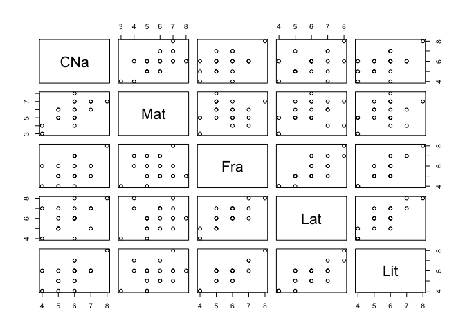

    corrplot(cor(Notas))

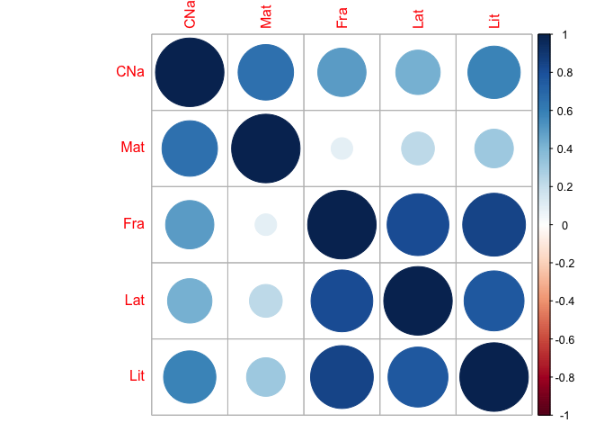

Como habíamos visto, los valores propios corresponden la varianzas
explicadas de cada componente y los vectores propios son sus direcciones
o pesos (*loadings*). Es decir:

    fc <- function(x) return((x-mean(x)))
    Notasc <- apply(Notas,2,fc) #Datos centrados
    S <- cov(Notas*19/20) # Matriz de covarianza
    VarLoad <- eigen(S) # valores y vectores propios
    VarLoad

    ## eigen() decomposition
    ## $values
    ## [1] 3.4101492921 1.4993716587 0.3696656364 0.1987624245 0.1128009882
    ## 
    ## $vectors
    ##               [,1]          [,2]          [,3]           [,4]
    ## [1,] -0.3953451592  0.3310292215  0.6615512339 -0.47595391778
    ## [2,] -0.3488287919  0.7977235811 -0.3708461436  0.17998543200
    ## [3,] -0.4822572131 -0.3715412245  0.2152088238  0.01712248334
    ## [4,] -0.5040057271 -0.2987146178 -0.5998377625 -0.46491466261
    ## [5,] -0.4852080858 -0.1636564643  0.1367586327  0.72431642911
    ##               [,5]
    ## [1,]  0.2644611364
    ## [2,] -0.2683914010
    ## [3,] -0.7633983768
    ## [4,]  0.2842478134
    ## [5,]  0.4409676429

Ahora podemos calcular los puntajes de los componetes por individuo:

    Notasc%*%VarLoad$vectors #scores

    ##                 [,1]           [,2]           [,3]           [,4]
    ##  [1,] -0.27915410925  1.91357104210  0.86033137179  0.39423401618
    ##  [2,]  0.70813893856 -0.85053394112 -0.24246638023 -0.18593762063
    ##  [3,]  0.33756163267  0.02001624672 -1.42835911004 -0.48798933458
    ##  [4,] -0.73664346905  2.08155078392 -0.77190376815  0.58525870335
    ##  [5,] -1.42059398462  0.14687700095  0.24671081421 -0.69845825769
    ##  [6,]  0.46309907684 -2.44165782575 -0.99625060032  0.36943263165
    ##  [7,]  1.20919379300 -0.34393456309  0.27892119116  0.98617098774
    ##  [8,]  1.34557308684  0.61744548226 -0.22868358511  0.44183999063
    ##  [9,] -0.65467151952 -1.05470240838  0.77105231013  0.07954737405
    ## [10,] -0.17241430640 -0.68316118387  0.55584348636  0.06242489070
    ## [11,]  0.09739340863  1.44748366709 -0.53781625726 -0.31904315776
    ## [12,]  2.66186717763  0.35491958994 -0.20980489800 -0.47958435382
    ## [13,] -0.03603501256  0.27821886148  0.04823871009 -0.48190610641
    ## [14,] -4.60370426057 -0.09348019176  0.64151305499  0.02353641883
    ## [15,] -0.38781467713  1.28382720283 -0.40105762457  0.40527327135
    ## [16,]  4.25887564776 -1.27284217598  0.47017391773  0.10131336257
    ## [17,] -1.79906226753 -2.61351168928  0.07898156147 -0.30595095406
    ## [18,] -1.99271412428 -0.71934990932 -0.06287296322  0.51893457255
    ## [19,]  2.77052774551  0.98466342922  1.05158409836 -0.49062360899
    ## [20,] -1.76942277653  0.94460058205 -0.12413532937 -0.51847282569
    ##                  [,5]
    ##  [1,]  0.282362039405
    ##  [2,] -0.629895637701
    ##  [3,]  0.149359151376
    ##  [4,]  0.033757315293
    ##  [5,]  0.355850690443
    ##  [6,]  0.099250083227
    ##  [7,]  0.290222568625
    ##  [8,] -0.419136475367
    ##  [9,] -0.687865235070
    ## [10,]  0.075533141682
    ## [11,] -0.138818926606
    ## [12,]  0.171685659485
    ## [13,] -0.633825902311
    ## [14,] -0.008693228407
    ## [15,]  0.302148716340
    ## [16,]  0.159759511770
    ## [17,]  0.589989435666
    ## [18,] -0.231041179799
    ## [19,]  0.151898982550
    ## [20,]  0.087459289397

El porcentaje de la varianza explicada por cada componente es:

    VarLoad$values/(sum(VarLoad$values))

    ## [1] 0.60996275850 0.26818792805 0.06612093841 0.03555201440 0.02017636063

Verifiquemos nuestros resultados usando la función `princomp` de `R`:

    result1 <- princomp(Notas,cor=FALSE)
    summary(result1)

    ## Importance of components:
    ##                              Comp.1       Comp.2        Comp.3
    ## Standard deviation     1.8946321104 1.2562985141 0.62379621878
    ## Proportion of Variance 0.6099627585 0.2681879281 0.06612093841
    ## Cumulative Proportion  0.6099627585 0.8781506866 0.94427162497
    ##                              Comp.4        Comp.5
    ## Standard deviation     0.4574096684 0.34458363620
    ## Proportion of Variance 0.0355520144 0.02017636063
    ## Cumulative Proportion  0.9798236394 1.00000000000

    result1$loadings

    ## 
    ## Loadings:
    ##     Comp.1 Comp.2 Comp.3 Comp.4 Comp.5
    ## CNa -0.395  0.331  0.662 -0.476  0.264
    ## Mat -0.349  0.798 -0.371  0.180 -0.268
    ## Fra -0.482 -0.372  0.215        -0.763
    ## Lat -0.504 -0.299 -0.600 -0.465  0.284
    ## Lit -0.485 -0.164  0.137  0.724  0.441
    ## 
    ##                Comp.1 Comp.2 Comp.3 Comp.4 Comp.5
    ## SS loadings       1.0    1.0    1.0    1.0    1.0
    ## Proportion Var    0.2    0.2    0.2    0.2    0.2
    ## Cumulative Var    0.2    0.4    0.6    0.8    1.0

    result1$sdev

    ##       Comp.1       Comp.2       Comp.3       Comp.4       Comp.5 
    ## 1.8946321104 1.2562985141 0.6237962188 0.4574096684 0.3445836362

    str(result1)

    ## List of 7
    ##  $ sdev    : Named num [1:5] 1.895 1.256 0.624 0.457 0.345
    ##   ..- attr(*, "names")= chr [1:5] "Comp.1" "Comp.2" "Comp.3" "Comp.4" ...
    ##  $ loadings: loadings [1:5, 1:5] -0.395 -0.349 -0.482 -0.504 -0.485 ...
    ##   ..- attr(*, "dimnames")=List of 2
    ##   .. ..$ : chr [1:5] "CNa" "Mat" "Fra" "Lat" ...
    ##   .. ..$ : chr [1:5] "Comp.1" "Comp.2" "Comp.3" "Comp.4" ...
    ##  $ center  : Named num [1:5] 5.8 5.7 5.6 6.05 5.65
    ##   ..- attr(*, "names")= chr [1:5] "CNa" "Mat" "Fra" "Lat" ...
    ##  $ scale   : Named num [1:5] 1 1 1 1 1
    ##   ..- attr(*, "names")= chr [1:5] "CNa" "Mat" "Fra" "Lat" ...
    ##  $ n.obs   : int 20
    ##  $ scores  : num [1:20, 1:5] -0.279 0.708 0.338 -0.737 -1.421 ...
    ##   ..- attr(*, "dimnames")=List of 2
    ##   .. ..$ : NULL
    ##   .. ..$ : chr [1:5] "Comp.1" "Comp.2" "Comp.3" "Comp.4" ...
    ##  $ call    : language princomp(x = Notas, cor = FALSE)
    ##  - attr(*, "class")= chr "princomp"

    plot(result1)

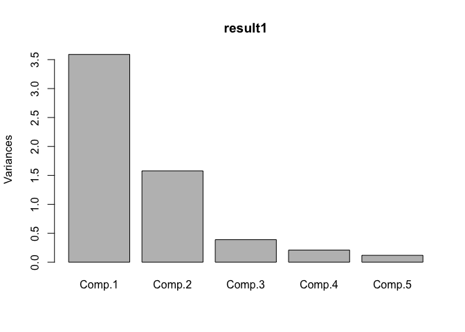

    biplot(result1)

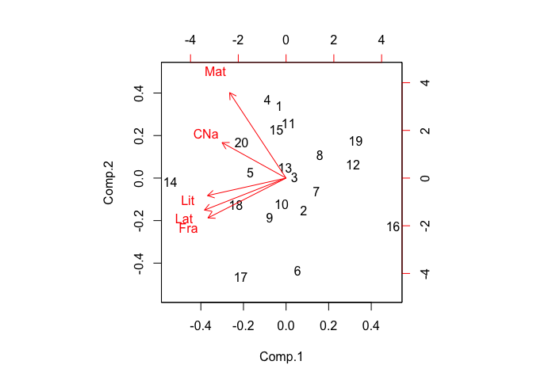

#### FactoMineR

En este paquete tenemos la función `PCA` que nos brinda la misma
información anterior además de otros temas interesantes:

    library(FactoMineR)
    result <- PCA(Notas,graph=FALSE,scale.unit = FALSE)
    plot(result,choix="var")

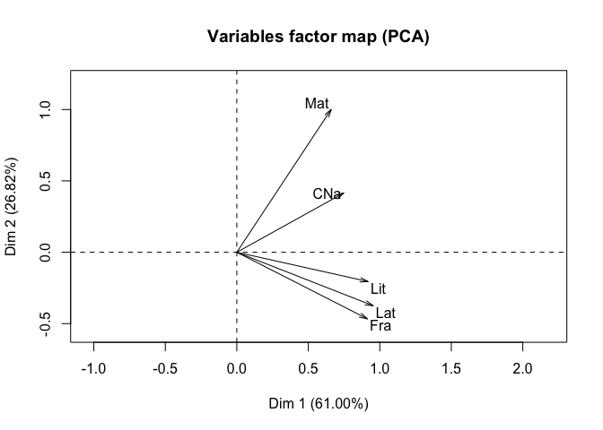

    summary(result)

    ## 
    ## Call:
    ## PCA(X = Notas, scale.unit = FALSE, graph = FALSE) 
    ## 
    ## 
    ## Eigenvalues
    ##                        Dim.1   Dim.2   Dim.3   Dim.4   Dim.5
    ## Variance               3.590   1.578   0.389   0.209   0.119
    ## % of var.             60.996  26.819   6.612   3.555   2.018
    ## Cumulative % of var.  60.996  87.815  94.427  97.982 100.000
    ## 
    ## Individuals (the 10 first)
    ##         Dist    Dim.1    ctr   cos2    Dim.2    ctr   cos2    Dim.3    ctr
    ## 1   |  2.171 |  0.279  0.109  0.017 |  1.914 11.600  0.777 |  0.860  9.511
    ## 2   |  1.310 | -0.708  0.698  0.292 | -0.851  2.292  0.422 | -0.242  0.755
    ## 3   |  1.554 | -0.338  0.159  0.047 |  0.020  0.001  0.000 | -1.428 26.216
    ## 4   |  2.411 |  0.737  0.756  0.093 |  2.082 13.726  0.745 | -0.772  7.656
    ## 5   |  1.648 |  1.421  2.811  0.743 |  0.147  0.068  0.008 |  0.247  0.782
    ## 6   |  2.705 | -0.463  0.299  0.029 | -2.442 18.887  0.815 | -0.996 12.753
    ## 7   |  1.648 | -1.209  2.037  0.539 | -0.344  0.375  0.044 |  0.279  1.000
    ## 8   |  1.617 | -1.346  2.522  0.692 |  0.617  1.208  0.146 | -0.229  0.672
    ## 9   |  1.617 |  0.655  0.597  0.164 | -1.055  3.524  0.425 |  0.771  7.639
    ## 10  |  0.903 |  0.172  0.041  0.036 | -0.683  1.479  0.573 |  0.556  3.970
    ##       cos2  
    ## 1    0.157 |
    ## 2    0.034 |
    ## 3    0.845 |
    ## 4    0.102 |
    ## 5    0.022 |
    ## 6    0.136 |
    ## 7    0.029 |
    ## 8    0.020 |
    ## 9    0.227 |
    ## 10   0.379 |
    ## 
    ## Variables
    ##        Dim.1    ctr   cos2    Dim.2    ctr   cos2    Dim.3    ctr   cos2  
    ## CNa |  0.749 15.630  0.584 |  0.416 10.958  0.180 |  0.413 43.765  0.177 |
    ## Mat |  0.661 12.168  0.289 |  1.002 63.636  0.665 | -0.231 13.753  0.035 |
    ## Fra |  0.914 23.257  0.732 | -0.467 13.804  0.191 |  0.134  4.631  0.016 |
    ## Lat |  0.955 25.402  0.731 | -0.375  8.923  0.113 | -0.374 35.981  0.112 |
    ## Lit |  0.919 23.543  0.822 | -0.206  2.678  0.041 |  0.085  1.870  0.007 |

    sum(sqrt(result$eig[,1]))

    ## [1] 4.576720148

    result$var

    ## $coord
    ##            Dim.1         Dim.2          Dim.3           Dim.4
    ## CNa 0.7490336333  0.4158715191  0.41267315824  0.217705923700
    ## Mat 0.6609022302  1.0021789496 -0.23133242211 -0.082327076765
    ## Fra 0.9137000014 -0.4667666883  0.13424645052 -0.007831989429
    ## Lat 0.9549054344 -0.3752747305 -0.37417652811  0.212656461653
    ## Lit 0.9192908195 -0.2056013729  0.08530951796 -0.331309337648
    ##              Dim.5
    ## CNa -0.09112898003
    ## Mat  0.09248328490
    ## Fra  0.26305458853
    ## Lat -0.09794714511
    ## Lit -0.15195023385
    ## 
    ## $cor
    ##            Dim.1         Dim.2          Dim.3           Dim.4
    ## CNa 0.7644792508  0.4244470918  0.42118277843  0.222195177936
    ## Mat 0.5378346073  0.8155616628 -0.18825565526 -0.066996824916
    ## Fra 0.8557584574 -0.4371670576  0.12573332081 -0.007335330175
    ## Lat 0.8549487620 -0.3359920833 -0.33500883749  0.190396213151
    ## Lit 0.9069054417 -0.2028313564  0.08416016393 -0.326845688886
    ##              Dim.5
    ## CNa -0.09300812577
    ## Mat  0.07526182988
    ## Fra  0.24637319529
    ## Lat -0.08769432809
    ## Lit -0.14990304593
    ## 
    ## $cos2
    ##            Dim.1         Dim.2          Dim.3            Dim.4
    ## CNa 0.5844285248 0.18015533375 0.177394932843 0.04937069709786
    ## Mat 0.2892660648 0.66514082585 0.035440191736 0.00448857454878
    ## Fra 0.7323225374 0.19111503622 0.015808867962 0.00005380706878
    ## Lat 0.7309373856 0.11289068001 0.112230921193 0.03625071798233
    ## Lit 0.8224774801 0.04114055915 0.007082933192 0.10682810434354
    ##              Dim.5
    ## CNa 0.008650511459
    ## Mat 0.005664343037
    ## Fra 0.060699751357
    ## Lat 0.007690295179
    ## Lit 0.022470923180
    ## 
    ## $contrib
    ##           Dim.1        Dim.2        Dim.3          Dim.4        Dim.5
    ## CNa 15.62977949 10.958034549 43.765003507 22.65321318478  6.993969269
    ## Mat 12.16815261 63.636291183 13.752686221  3.23947557312  7.203394416
    ## Fra 23.25720196 13.804288151  4.631483783  0.02931794359 58.277708163
    ## Lat 25.40217729  8.923042287 35.980534128 21.61456435081  8.079681941
    ## Lit 23.54268865  2.678343829  1.870292362 52.46342894770 19.445246213

    loadings<-sweep(result$var$coord,2,sqrt(result$eig[1:5,1]),FUN="/")


    result$var$coord # correlacion entre las variables y los componentes

    ##            Dim.1         Dim.2          Dim.3           Dim.4
    ## CNa 0.7490336333  0.4158715191  0.41267315824  0.217705923700
    ## Mat 0.6609022302  1.0021789496 -0.23133242211 -0.082327076765
    ## Fra 0.9137000014 -0.4667666883  0.13424645052 -0.007831989429
    ## Lat 0.9549054344 -0.3752747305 -0.37417652811  0.212656461653
    ## Lit 0.9192908195 -0.2056013729  0.08530951796 -0.331309337648
    ##              Dim.5
    ## CNa -0.09112898003
    ## Mat  0.09248328490
    ## Fra  0.26305458853
    ## Lat -0.09794714511
    ## Lit -0.15195023385

    result$eig # Descomposicion de la varianza por componente

    ##          eigenvalue percentage of variance
    ## comp 1 3.5896308338           60.996275850
    ## comp 2 1.5782859566           26.818792805
    ## comp 3 0.3891217226            6.612093841
    ## comp 4 0.2092236047            3.555201440
    ## comp 5 0.1187378823            2.017636063
    ##        cumulative percentage of variance
    ## comp 1                       60.99627585
    ## comp 2                       87.81506866
    ## comp 3                       94.42716250
    ## comp 4                       97.98236394
    ## comp 5                      100.00000000

    result$ind$dist # Distancias de los individuos al centro de la nube

    ##            1            2            3            4            5 
    ## 2.1714050751 1.3095800854 1.5540270268 2.4114311104 1.6477257053 
    ##            6            7            8            9           10 
    ## 2.7046256673 1.6477257053 1.6170961629 1.6170961629 0.9027735043 
    ##           11           12           13           14           15 
    ## 1.5858751527 2.7413500324 0.8455767263 4.6491934784 1.4882876066 
    ##           16           17           18           19           20 
    ## 4.4738126917 3.2426840734 2.1943108257 3.1646484797 2.0772578078

    result$ind$contrib # Contribucion de los individuos a la construccion de los componentes

    ##              Dim.1           Dim.2          Dim.3          Dim.4
    ## 1   0.108544611300 11.600414100874  9.51077807229  3.71421904596
    ## 2   0.698485136117  2.291751953992  0.75541844792  0.82621649714
    ## 3   0.158718070364  0.001269257104 26.21557251771  5.69088729179
    ## 4   0.755848756630 13.726453206997  7.65615735022  8.18568608157
    ## 5   2.810995562739  0.068342664139  0.78209750726 11.65843448550
    ## 6   0.298722577479 18.886605792775 12.75327488900  3.26159348754
    ## 7   2.036629526451  0.374745093551  0.99964903480 23.24147933238
    ## 8   2.521940299530  1.207762515967  0.67197716122  4.66540516705
    ## 9   0.596990078246  3.524067250331  7.63927622730  0.15122062173
    ## 10  0.041406337350  1.478531824997  3.96999143720  0.09312684829
    ## 11  0.013212328069  6.637608849502  3.71665612323  2.43252993942
    ## 12  9.869450647514  0.399065564757  0.56560830032  5.49653928190
    ## 13  0.001808712637  0.245220882066  0.02990032445  5.54988753984
    ## 14 29.521270988874  0.027683659655  5.28804967508  0.01323853999
    ## 15  0.209492606291  5.221526174803  2.06679823939  3.92514087211
    ## 16 25.264466769699  5.132552812133  2.84054448889  0.24529730880
    ## 17  4.508297917412 21.638801642860  0.08015598577  2.23698435953
    ## 18  5.531083508286  1.639323627899  0.05079399678  6.43553319238
    ## 19 10.691662101309  3.071566545951 14.20929559814  5.75249446636
    ## 20  4.360973463701  2.826706579648  0.19800462302  6.42408564071
    ##              Dim.5
    ## 1   3.357324542421
    ## 2  16.707747628043
    ## 3   0.939386641433
    ## 4   0.047986216083
    ## 5   5.332321555556
    ## 6   0.414803549916
    ## 7   3.546852010565
    ## 8   7.397613193282
    ## 9  19.924499759730
    ## 10  0.240245799404
    ## 11  0.811480464561
    ## 12  1.241219949896
    ## 13 16.916895709007
    ## 14  0.003182312951
    ## 15  3.844343733830
    ## 16  1.074766582444
    ## 17 14.657812963608
    ## 18  2.247809448532
    ## 19  0.971606552422
    ## 20  0.322101386316

    result$var$contrib # Contribucion de las variables a la construccion de los componentes

    ##           Dim.1        Dim.2        Dim.3          Dim.4        Dim.5
    ## CNa 15.62977949 10.958034549 43.765003507 22.65321318478  6.993969269
    ## Mat 12.16815261 63.636291183 13.752686221  3.23947557312  7.203394416
    ## Fra 23.25720196 13.804288151  4.631483783  0.02931794359 58.277708163
    ## Lat 25.40217729  8.923042287 35.980534128 21.61456435081  8.079681941
    ## Lit 23.54268865  2.678343829  1.870292362 52.46342894770 19.445246213

    result$var$cos2

    ##            Dim.1         Dim.2          Dim.3            Dim.4
    ## CNa 0.5844285248 0.18015533375 0.177394932843 0.04937069709786
    ## Mat 0.2892660648 0.66514082585 0.035440191736 0.00448857454878
    ## Fra 0.7323225374 0.19111503622 0.015808867962 0.00005380706878
    ## Lat 0.7309373856 0.11289068001 0.112230921193 0.03625071798233
    ## Lit 0.8224774801 0.04114055915 0.007082933192 0.10682810434354
    ##              Dim.5
    ## CNa 0.008650511459
    ## Mat 0.005664343037
    ## Fra 0.060699751357
    ## Lat 0.007690295179
    ## Lit 0.022470923180

### Ejemplo

#### Paso 1: recopilación de datos

Trabajemos los datos de los resultados de las competencias de heptatlón
en Seúl 1988

    library(HSAUR)
    data("heptathlon")

Las variables son

-   hurdles: vallas 100m
-   highjump: salto alto
-   shot: tiro
-   run200m: velocidad 200m
-   longjump: salto largo
-   javelin: lanzamiento de javalina
-   run800m: velocidad 800m
-   score: puntaje

#### Paso 2: Explorar y preparar los datos

Resumimos la variable score:

    summary(heptathlon$score)

    ##    Min. 1st Qu.  Median    Mean 3rd Qu.    Max. 
    ##  4566.0  5746.0  6137.0  6090.6  6351.0  7291.0

Ahora las variables que generaron el score

    cor(heptathlon[,-8])

    ##                  hurdles        highjump          shot       run200m
    ## hurdles   1.000000000000 -0.811402536405 -0.6513346878  0.7737205435
    ## highjump -0.811402536405  1.000000000000  0.4407861399 -0.4876636847
    ## shot     -0.651334687799  0.440786139937  1.0000000000 -0.6826704342
    ## run200m   0.773720543490 -0.487663684735 -0.6826704342  1.0000000000
    ## longjump -0.912133616590  0.782442273246  0.7430730041 -0.8172052997
    ## javelin  -0.007762548851  0.002153015774  0.2689888370 -0.3330427216
    ## run800m   0.779257109727 -0.591162822519 -0.4196195716  0.6168100616
    ##                longjump         javelin        run800m
    ## hurdles  -0.91213361659 -0.007762548851  0.77925710973
    ## highjump  0.78244227325  0.002153015774 -0.59116282252
    ## shot      0.74307300414  0.268988836967 -0.41961957162
    ## run200m  -0.81720529970 -0.333042721640  0.61681006159
    ## longjump  1.00000000000  0.067108409346 -0.69951115666
    ## javelin   0.06710840935  1.000000000000  0.02004908795
    ## run800m  -0.69951115666  0.020049087945  1.00000000000

    library(psych)
    pairs.panels(cor(heptathlon[,-8]))

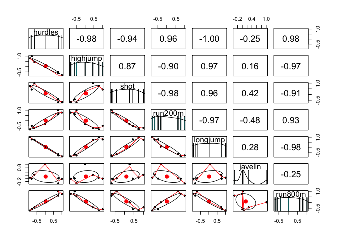

    heptathlon[,-8]

<script data-pagedtable-source type="application/json">
{"columns":[{"label":[""],"name":["_rn_"],"type":[""],"align":["left"]},{"label":["hurdles"],"name":[1],"type":["dbl"],"align":["right"]},{"label":["highjump"],"name":[2],"type":["dbl"],"align":["right"]},{"label":["shot"],"name":[3],"type":["dbl"],"align":["right"]},{"label":["run200m"],"name":[4],"type":["dbl"],"align":["right"]},{"label":["longjump"],"name":[5],"type":["dbl"],"align":["right"]},{"label":["javelin"],"name":[6],"type":["dbl"],"align":["right"]},{"label":["run800m"],"name":[7],"type":["dbl"],"align":["right"]}],"data":[{"1":"12.69","2":"1.86","3":"15.80","4":"22.56","5":"7.27","6":"45.66","7":"128.51","_rn_":"Joyner-Kersee (USA)"},{"1":"12.85","2":"1.80","3":"16.23","4":"23.65","5":"6.71","6":"42.56","7":"126.12","_rn_":"John (GDR)"},{"1":"13.20","2":"1.83","3":"14.20","4":"23.10","5":"6.68","6":"44.54","7":"124.20","_rn_":"Behmer (GDR)"},{"1":"13.61","2":"1.80","3":"15.23","4":"23.92","5":"6.25","6":"42.78","7":"132.24","_rn_":"Sablovskaite (URS)"},{"1":"13.51","2":"1.74","3":"14.76","4":"23.93","5":"6.32","6":"47.46","7":"127.90","_rn_":"Choubenkova (URS)"},{"1":"13.75","2":"1.83","3":"13.50","4":"24.65","5":"6.33","6":"42.82","7":"125.79","_rn_":"Schulz (GDR)"},{"1":"13.38","2":"1.80","3":"12.88","4":"23.59","5":"6.37","6":"40.28","7":"132.54","_rn_":"Fleming (AUS)"},{"1":"13.55","2":"1.80","3":"14.13","4":"24.48","5":"6.47","6":"38.00","7":"133.65","_rn_":"Greiner (USA)"},{"1":"13.63","2":"1.83","3":"14.28","4":"24.86","5":"6.11","6":"42.20","7":"136.05","_rn_":"Lajbnerova (CZE)"},{"1":"13.25","2":"1.77","3":"12.62","4":"23.59","5":"6.28","6":"39.06","7":"134.74","_rn_":"Bouraga (URS)"},{"1":"13.75","2":"1.86","3":"13.01","4":"25.03","5":"6.34","6":"37.86","7":"131.49","_rn_":"Wijnsma (HOL)"},{"1":"13.24","2":"1.80","3":"12.88","4":"23.59","5":"6.37","6":"40.28","7":"132.54","_rn_":"Dimitrova (BUL)"},{"1":"13.85","2":"1.86","3":"11.58","4":"24.87","5":"6.05","6":"47.50","7":"134.93","_rn_":"Scheider (SWI)"},{"1":"13.71","2":"1.83","3":"13.16","4":"24.78","5":"6.12","6":"44.58","7":"142.82","_rn_":"Braun (FRG)"},{"1":"13.79","2":"1.80","3":"12.32","4":"24.61","5":"6.08","6":"45.44","7":"137.06","_rn_":"Ruotsalainen (FIN)"},{"1":"13.93","2":"1.86","3":"14.21","4":"25.00","5":"6.40","6":"38.60","7":"146.67","_rn_":"Yuping (CHN)"},{"1":"13.47","2":"1.80","3":"12.75","4":"25.47","5":"6.34","6":"35.76","7":"138.48","_rn_":"Hagger (GB)"},{"1":"14.07","2":"1.83","3":"12.69","4":"24.83","5":"6.13","6":"44.34","7":"146.43","_rn_":"Brown (USA)"},{"1":"14.39","2":"1.71","3":"12.68","4":"24.92","5":"6.10","6":"37.76","7":"138.02","_rn_":"Mulliner (GB)"},{"1":"14.04","2":"1.77","3":"11.81","4":"25.61","5":"5.99","6":"35.68","7":"133.90","_rn_":"Hautenauve (BEL)"},{"1":"14.31","2":"1.77","3":"11.66","4":"25.69","5":"5.75","6":"39.48","7":"133.35","_rn_":"Kytola (FIN)"},{"1":"14.23","2":"1.71","3":"12.95","4":"25.50","5":"5.50","6":"39.64","7":"144.02","_rn_":"Geremias (BRA)"},{"1":"14.85","2":"1.68","3":"10.00","4":"25.23","5":"5.47","6":"39.14","7":"137.30","_rn_":"Hui-Ing (TAI)"},{"1":"14.53","2":"1.71","3":"10.83","4":"26.61","5":"5.50","6":"39.26","7":"139.17","_rn_":"Jeong-Mi (KOR)"},{"1":"16.42","2":"1.50","3":"11.78","4":"26.16","5":"4.88","6":"46.38","7":"163.43","_rn_":"Launa (PNG)"}],"options":{"columns":{"min":{},"max":[10]},"rows":{"min":[10],"max":[10]},"pages":{}}}
  </script>

El *sentido* de los datos podría ser un problema. Podemos hacer que
estos *apunten* a un mismo sentido:

    heptathlon$hurdles <- with(heptathlon, max(hurdles)-hurdles)
    heptathlon$run200m <- with(heptathlon, max(run200m)-run200m)
    heptathlon$run800m <- with(heptathlon, max(run800m)-run800m)
    score <- which(colnames(heptathlon) == "score")
    pairs.panels(heptathlon[,-score])

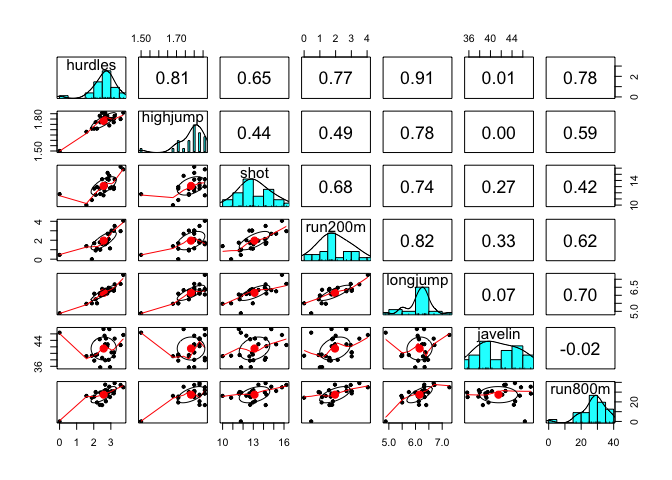

#### Paso 3: entrenar un modelo en los datos

Ajustamos un PCA:

    heptathlon_pca <- prcomp(heptathlon[, -score], scale = TRUE)
    cbind(predict(heptathlon_pca)[,1])

    ##                                [,1]
    ## Joyner-Kersee (USA) -4.121447626360
    ## John (GDR)          -2.882185934840
    ## Behmer (GDR)        -2.649633765991
    ## Sablovskaite (URS)  -1.343351209678
    ## Choubenkova (URS)   -1.359025695543
    ## Schulz (GDR)        -1.043847470922
    ## Fleming (AUS)       -1.100385638572
    ## Greiner (USA)       -0.923173638862
    ## Lajbnerova (CZE)    -0.530250688783
    ## Bouraga (URS)       -0.759819023916
    ## Wijnsma (HOL)       -0.556268302152
    ## Dimitrova (BUL)     -1.186453832101
    ## Scheider (SWI)       0.015461226409
    ## Braun (FRG)          0.003774222557
    ## Ruotsalainen (FIN)   0.090747708938
    ## Yuping (CHN)        -0.137225439803
    ## Hagger (GB)          0.171128651449
    ## Brown (USA)          0.519252645741
    ## Mulliner (GB)        1.125481832771
    ## Hautenauve (BEL)     1.085697646191
    ## Kytola (FIN)         1.447055499153
    ## Geremias (BRA)       2.014029620424
    ## Hui-Ing (TAI)        2.880298635279
    ## Jeong-Mi (KOR)       2.970118606982
    ## Launa (PNG)          6.270021971628

    plot(heptathlon_pca)


#### Paso 4: evaluar el rendimiento del modelo

Obtenemos la correlación entre el primer componente y los puntajes
oficiales:

    cor(heptathlon$score, heptathlon_pca$x[,1])

    ## [1] -0.9910977748

    plot(heptathlon$score, heptathlon_pca$x[,1])

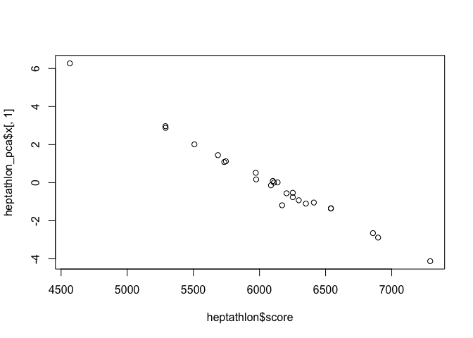

#### Paso 5: mejorando el ajuste

Una de las alternativas más usadas es probar con diferentes rotaciones
de los ejes.

**Bonus**

    dm <- dist(heptathlon[,-8])
    par(mfrow = c(1,3))
    plot(cs <- hclust(dm, method = "single"))
    plot(cc <- hclust(dm, method = "complete"))
    plot(ca <- hclust(dm, method = "average"))

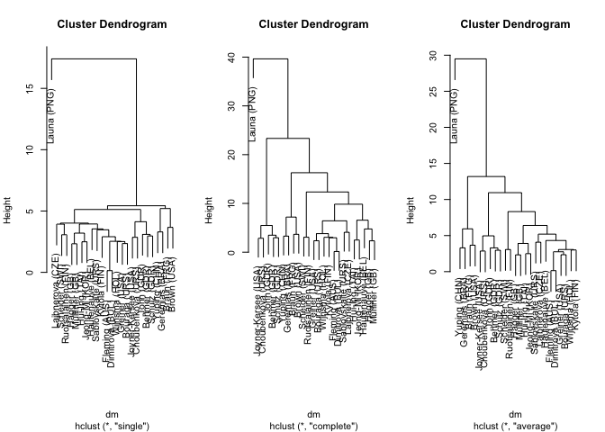

Aprendizaje no supervizado (Clustering)
=======================================

> La agrupación en clúster es una tarea de aprendizaje automático no
> supervisada que divide automáticamente los datos en grupos o
> agrupaciones de elementos similares.

-   La agrupación se usa para el descubrimiento de conocimiento en lugar
    de la predicción. Proporciona una idea de las agrupaciones naturales
    encontradas en los datos.

-   Las muestras no etiquetadas reciben una etiqueta de grupo y se
    deducen por completo de las relaciones dentro de los datos.

-   El problema es que las etiquetas de clase obtenidas de un
    clasificador no supervisado carecen de significado intrínseco.
    **Depende de ti aplicar una etiqueta procesable y significativa**

Por ejemplo, veamos la relación entre las publicaciones de matemáticas y
estadística y las de ciencias computacionales:

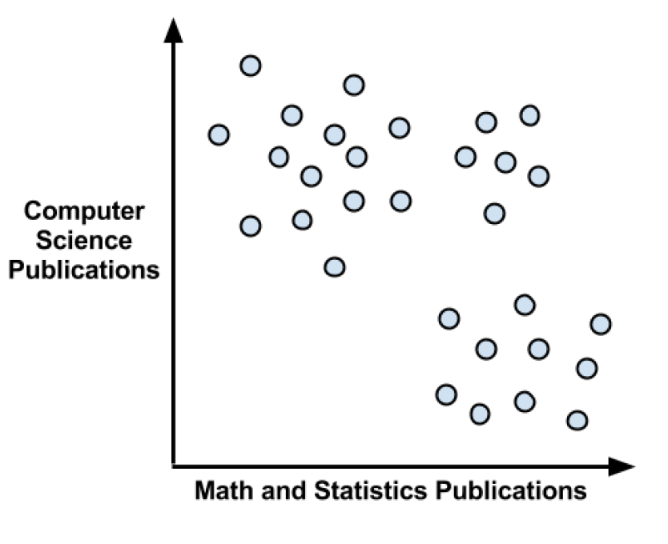

Como se esperaba, parece haber un patrón aquí. Podríamos adivinar que la
esquina superior izquierda, que representa a personas con muchas
publicaciones de informática, pero pocos artículos sobre matemáticas,
podría ser un grupo de científicos informáticos.


kmedias
-------

> El algoritmo k-means es quizás el método de agrupación más utilizado.
> Después de haber sido estudiado durante varias décadas, sirve como
> base para muchas técnicas de agrupación más sofisticadas.

> El objetivo es minimizar las diferencias dentro de cada grupo y
> maximizar las diferencias entre los clústeres.

### Algoritmo

1.  Calcular la Matriz Global de distancias.
2.  Seleccionar, los *k* patrones más alejados, como atractores
    iniciales.
3.  Calcular y almacenar la distancia entre cada patrón y cada uno de
    los k patrones atractores
4.  Particionar el espacio en grupos, asignando cada patrón al grupo del
    atractor más cercano
5.  Calcular, para cada grupo definido, su centroide
6.  Considerar los centroides recién calculados como nuevos patrones
    atractores
7.  Regresar al paso (3)
8.  Terminar cuando el conjunto de centroides sea idéntico que el de la
    iteración anterior

### Ejemplo

#### Paso 1: recopilación de datos

Tenemos información de tasas (por cada 100 personas) de tipos de
crímenes por cada estado de USA.

    www <- "ftp://stat.ethz.ch/Teaching/Datasets/WBL/crime2.dat"
    crime <- read.csv(www,sep="")
    str(crime)

    ## 'data.frame':    50 obs. of  7 variables:
    ##  $ murder    : num  14.2 10.8 9.5 8.8 11.5 6.3 4.2 6 10.2 11.7 ...
    ##  $ rape      : num  25.2 51.6 34.2 27.6 49.4 42 16.8 24.9 39.6 31.1 ...
    ##  $ robbery   : num  96.8 96.8 138.2 83.2 287 ...
    ##  $ assault   : num  278 284 312 203 358 ...
    ##  $ burglary  : num  1136 1332 2346 973 2139 ...
    ##  $ larceny   : num  1882 3370 4467 1862 3500 ...
    ##  $ auto.theft: num  281 753 440 183 664 ...

#### Paso 2: Explorar y preparar los datos

¿Qué estados superan 15 en su tasa de homicidios?

    subset(crime, murder > 15)

<script data-pagedtable-source type="application/json">
{"columns":[{"label":[""],"name":["_rn_"],"type":[""],"align":["left"]},{"label":["murder"],"name":[1],"type":["dbl"],"align":["right"]},{"label":["rape"],"name":[2],"type":["dbl"],"align":["right"]},{"label":["robbery"],"name":[3],"type":["dbl"],"align":["right"]},{"label":["assault"],"name":[4],"type":["dbl"],"align":["right"]},{"label":["burglary"],"name":[5],"type":["dbl"],"align":["right"]},{"label":["larceny"],"name":[6],"type":["dbl"],"align":["right"]},{"label":["auto.theft"],"name":[7],"type":["dbl"],"align":["right"]}],"data":[{"1":"15.5","2":"30.9","3":"142.9","4":"335.5","5":"1165.5","6":"2469.9","7":"337.7","_rn_":"LOU"},{"1":"15.8","2":"49.1","3":"323.1","4":"355.0","5":"2453.1","6":"4212.6","7":"559.2","_rn_":"NEV"}],"options":{"columns":{"min":{},"max":[10]},"rows":{"min":[10],"max":[10]},"pages":{}}}
  </script>

    sapply(crime, var)

    ##          murder            rape         robbery         assault 
    ##     14.95190204    115.76963673   7805.46932245  10050.67387755 
    ##        burglary         larceny      auto.theft 
    ## 187017.94161633 526943.45046531  37401.40073878

    rge <- sapply(crime, function(x) diff(range(x))) # obtendo el rango
    crime_s <- sweep(crime, 2, rge, FUN = "/") # divido para el rango
    sapply(crime_s, mean)

    ##       murder         rape      robbery      assault     burglary 
    ## 0.4995973154 0.6040845070 0.2701763553 0.4785956965 0.6436990533 
    ##      larceny   auto.theft 
    ## 0.8276647560 0.3791563724

#### Paso 3: entrenar un modelo en los datos

Agrupamos

    kmeans(crime_s, centers = 2)$centers * rge

    ##         murder        rape      robbery      assault     burglary
    ## 1  6.029032258 205.7563835  369.1262932 358.56549081  22.30253821
    ## 2 27.883362769 379.1532617 1326.2163533  10.01142874 385.70094800
    ##        larceny   auto.theft
    ## 1  314.4328118 1076.0215459
    ## 2 2039.2474964  451.8736842

¿Qué pasa al multiplicar por `rge`?

#### Paso 4: evaluar el rendimiento del modelo

Gráfico de codo

    n <- nrow(crime_s)
    wss <- rep(0, 6)
    wss[1] <- (n - 1) * sum(sapply(crime_s, var))
    for (i in 2:6)
      wss[i] <- sum(kmeans(crime_s, centers = i)$withinss)

    plot(1:6, wss, type = "b", xlab = "Num de Grupos",
           ylab = "Suma de cuadrados dentro de los grupos")

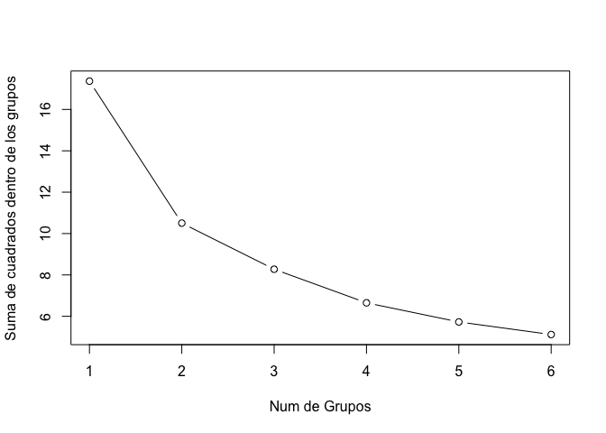

#### Paso 5: mejorando el ajuste

Uno de los determinantes de los algorimos de agrupación es el número de
grupos. Podría modificar k en función de algún criterio.

kmedoides
---------

### Algoritmo:

1.  Seleccionar una función de comparación entre patrones. Por ejemplo,
    si se trata de variables cuantitativas se suele usar la distancia
    euclideana
2.  Calcular la Matriz Global de semejanza/diferencia, esto es, la
    matriz de distancias.
3.  Seleccionar, los *k* patrones más alejados, como atractores
    iniciales.
4.  Calcular y almacenar la semejanza/diferencia entre cada patrón y
    cada uno de los k patrones atractores
5.  Particionar el espacio en grupos, asignando cada patrón al grupo del
    atractor más cercano
6.  Calcular, para cada grupo definido, su medoide
7.  Considerar los medoides recién calculados como nuevos patrones
    atractores
8.  Regresar al paso (4)
9.  Terminar cuando el conjunto de medoides sea idéntico que el de la
    iteración anterior

La última partición obtenida, (idéntica a la de la iteración anterior)
es la respuesta final del algoritmo.

<!-- ## Clasificación jerárquica -->
<!-- ## Redes neuronales -->
#### Paso 1: recopilación de datos

#### Paso 2: Explorar y preparar los datos

#### Paso 3: entrenar un modelo en los datos

Los pasos anteriores son los mismos realizados en kmeans. Ahora
ajustamos un kmedoides:

    library(cluster)
    pamx <- pam(crime_s, 2)

#### Paso 4: evaluar el rendimiento del modelo

Gráficamente:

    library(fpc)
    clusplot(pam(x=crime_s,k=2))

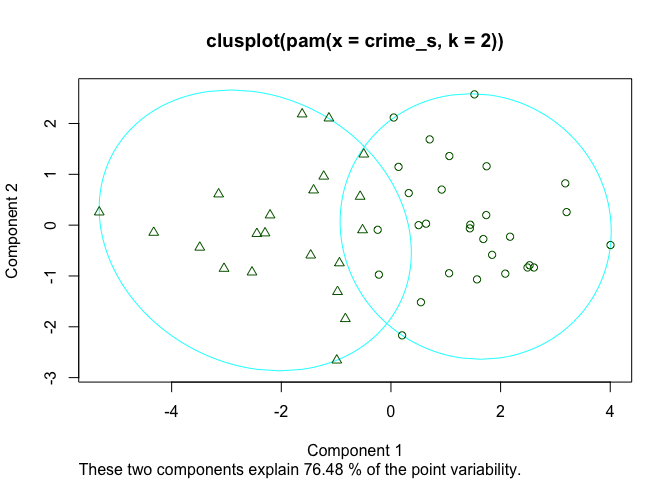

#### Paso 5: mejorando el ajuste

    print(pamk(crime_s,krange=1:5)$nc)

    ## [1] 2

Referencias
===========

Fritsch, Stefan, and Frauke Guenther. 2016. *Neuralnet: Training of
Neural Networks*. <https://CRAN.R-project.org/package=neuralnet>.

Mingers, John. 1989. “An Empirical Comparison of Selection Measures for
Decision-Tree Induction.” *Machine Learning* 3 (4). Springer: 319–42.

Venables, W. N., and B. D. Ripley. 2002. *Modern Applied Statistics with
S*. Fourth. New York: Springer. <http://www.stats.ox.ac.uk/pub/MASS4>.

[1] Teoría obtenida de Peña, D. *Análisis de datos multivariantes*
(2002). Referencias de `FactoMineR` vienen de Husson, F. *Exploratory
multivariate analysis by example using R* (2017)
