-   [Caso 1: Estudiando salarios](#caso-1-estudiando-salarios)
    -   [Los datos](#los-datos)
    -   [Explorando los datos](#explorando-los-datos)
    -   [Regresión lineal simple](#regresion-lineal-simple)
    -   [Transformación de variables](#transformacion-de-variables)
    -   [Regresión lineal múltiple](#regresion-lineal-multiple)
    -   [Modelo Bayesiano para el
        Promedio](#modelo-bayesiano-para-el-promedio)
    -   [Predicción](#prediccion)
    -   [Prediccion con BAS](#prediccion-con-bas)
-   [Caso 2: Seleccionando la película
    ideal](#caso-2-seleccionando-la-pelicula-ideal)
    -   [Los datos](#los-datos-1)
    -   [Regresión lineal múltiple](#regresion-lineal-multiple-1)
    -   [El modelo Bayesiano](#el-modelo-bayesiano)
-   [Referencias](#referencias)

<!-- https://rpubs.com/mfondoum/bayesian_linear_regression -->
**Paquetes de esta sección**

    if(!require(ISLR)){install.packages("rio")}
    if(!require(ISLR)){install.packages("statsr")}
    if(!require(ISLR)){install.packages("MASS")}
    if(!require(ISLR)){install.packages("dplyr")}
    if(!require(ISLR)){install.packages("ggplot2")}
    if(!require(ISLR)){install.packages("BAS")}
    if(!require(ISLR)){install.packages("pdp")}

En el campo de la economía laboral, el estudio de ingresos y salarios
proporciona información sobre temas que van desde la discriminación de
género hasta los beneficios de la educación superior. Analizaremos datos
salariales de corte transversal para practicar el uso de métodos
bayesianos como *BIC* y regresión Bayesiana para construir modelos
predictivos parsimoniosos.

Caso 1: Estudiando salarios
===========================

Los datos
---------

Los datos que se utilizarán en este laboratorio se recopilaron como una
muestra aleatoria de 935 encuestados en todo Estados Unidos. Este
conjunto de datos se publicó como parte de la serie *Instructional Stata
Datasets for Econometrics* del Departamento de Economía del Boston
College (Wooldridge 2000).

    setwd("~/Documents/Consultorias&Cursos/DataLectures")
    library(rio)
    wage <- import("wage2.dta")

> 1.  ¿Es este un estudio observacional o un experimento?

Explorando los datos
--------------------

Al igual que con cualquier conjunto de datos nuevo, un buen lugar para
comenzar es el análisis de datos exploratorios estándar. Comenzaremos
con la variable de salario, ya que será la variable de respuesta en
nuestros modelos.

    summary(wage$wage)

    ##    Min. 1st Qu.  Median    Mean 3rd Qu.    Max. 
    ##   115.0   669.0   905.0   957.9  1160.0  3078.0

    plot(wage$wage, type = "l")
    library(ggplot2)

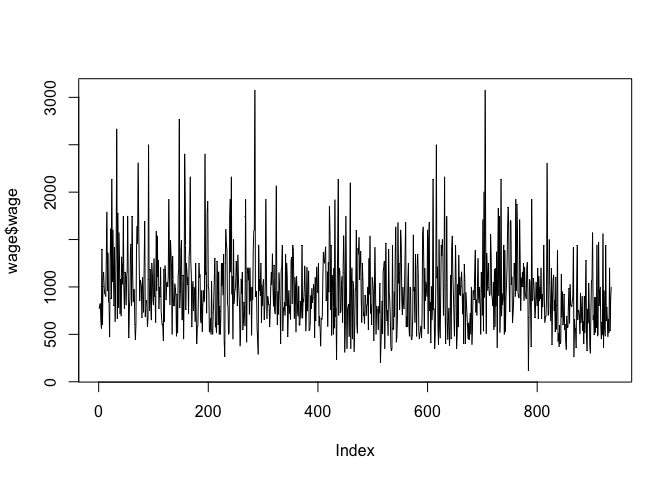

    ggplot(data = wage, aes(x=wage))+geom_histogram(binwidth = 60)

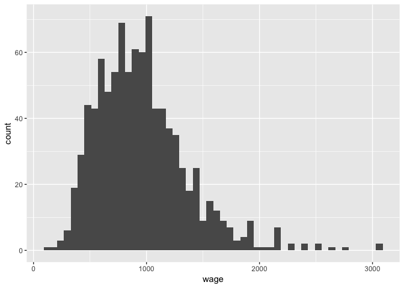

> 1.  Cuántas personas ganan menos de USD 500?

Exploremos la relación entre el nivel de educación y el número de horas
de trabajo como predictores del salario.

    ggplot(data = wage, aes(y=wage, x=exper))+geom_point()+labs(x="Experiencia", y="Salario semenal USD", title="Salario semanal por experiencia")

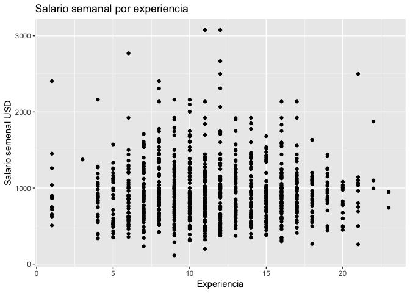

    ggplot(data = wage, aes(y=wage, x=educ))+geom_point()+labs(x="Educación", y="Salario semenal USD", title="Salario semanal por educación")

Regresión lineal simple
-----------------------

Una posible explicación simplista de la variación en los salarios que
vemos en los datos es que las personas más inteligentes ganan más
dinero. La siguiente gráfica visualiza un diagrama de dispersión entre
el salario semanal y la puntuación de IQ.

    ggplot(data = wage, aes(x = IQ, y = wage)) + geom_point()

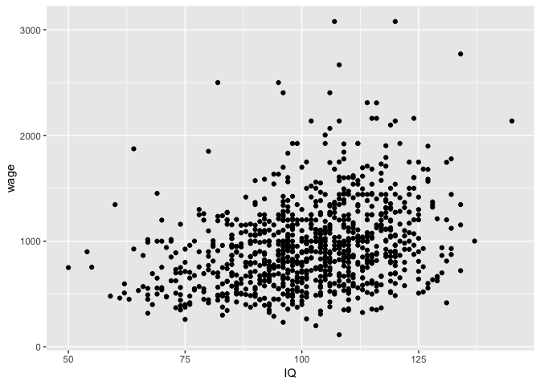

Esta trama es bastante ruidosa. Si bien puede haber una ligera relación
lineal positiva entre la puntuación de IQ y el salario, IQ es, en el
mejor de los casos, un predictor bruto de los salarios. Podemos
cuantificar esto ajustando una regresión lineal simple.

    m_wage_iq = lm(wage ~ IQ, data = wage)
    m_wage_iq$coefficients

    ## (Intercept)          IQ 
    ##  116.991565    8.303064

    summary(m_wage_iq)$sigma

    ## [1] 384.7667

Bajo el modelo:

*w**a**g**e**i* = *α* + *β* ⋅ *I**Q**i* + *ϵ**i*

si *ϵ**i* ∼ *N*(0, *σ*2) y la apriori de
referencia *p*(*α*, *β*, *σ*2)∝1/*σ*2 son usadas,
entonces las medias posteriores bayesianas y las desviaciones estándar
**serán iguales a las estimaciones frecuentistas y los errores
estándar**, respectivamente.

La especificación del modelo bayesiano supone que los errores se
distribuyen normalmente con una variación constante. Al igual que con el
enfoque frecuentista, verificamos este supuesto al examinar la
distribución de los residuos para el modelo. Si los residuos son
altamente no normales o sesgados, se viola el supuesto y cualquier
inferencia posterior no es válida.

> 1.  Examine los residuos de m\_wage\_iq. ¿Es válido el supuesto de
>     errores distribuidos normalmente?

    qqnorm(m_wage_iq$residuals)
    qqline(m_wage_iq$residuals)

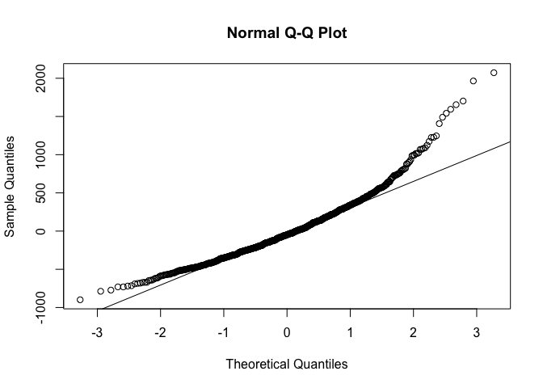

    hist(m_wage_iq$residuals)

No, ya que la distribución de los residuos del modelo es sesgada a la
derecha.

> Ejercicio: vuelva a montar el modelo, esta vez utilizando `educ`
> (educación) como variable independiente. ¿Cambia tu respuesta de la
> anterior?

    m_wage_educ <- lm(wage ~ educ, data = wage)
    m_wage_educ$coefficients

    ## (Intercept)        educ 
    ##   146.95244    60.21428

    summary(m_wage_educ)$sigma

    ## [1] 382.3203

    qqnorm(m_wage_educ$residuals)
    qqline(m_wage_educ$residuals)

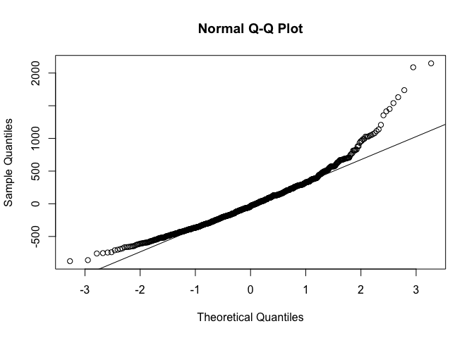

    hist(m_wage_educ$residuals)

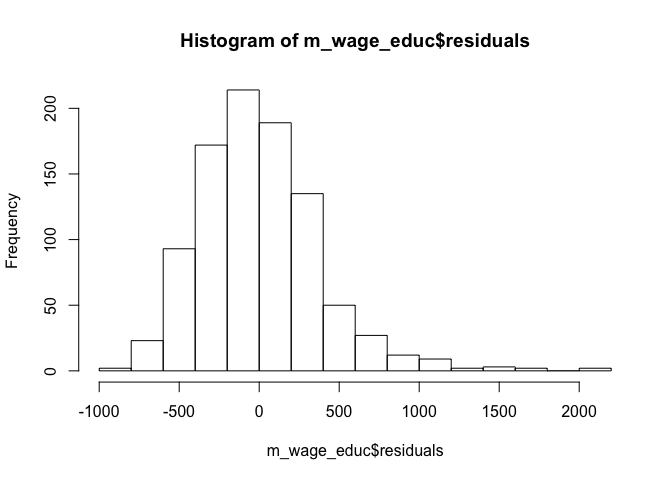

Se puede llegar a la misma conclusión de que los residuos de este modelo
lineal se distribuyen casi normalmente con
*ϵ**i* ∼ *N*(0, *σ*2) y, por lo tanto, se puede
hacer una inferencia adicional basada en este modelo lineal.

Transformación de variables
---------------------------

Una forma de acomodar el sesgo a la derecha en los datos es transformar
con el logaritmo (natural) de la variable dependiente. Ten en cuenta que
esto solo es posible si la variable es estrictamente positiva, ya que el
registro de valor negativo no está definido y el registro log(0)= − ∞.

    m_lwage_iq = lm(lwage ~ IQ, data = wage)

> Ejercicio: Examina los residuos de este modelo. ¿Es razonable el
> supuesto de residuos normalmente distribuidos?

    hist(m_lwage_iq$residuals, breaks = 30)

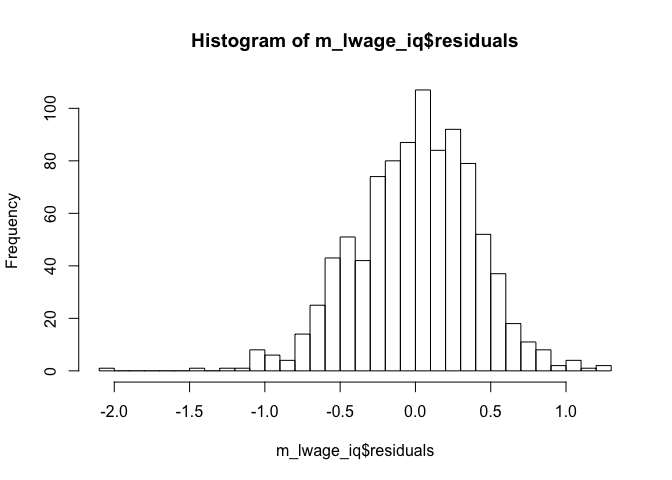

    qqnorm(m_lwage_iq$residuals)
    qqline(m_lwage_iq$residuals)

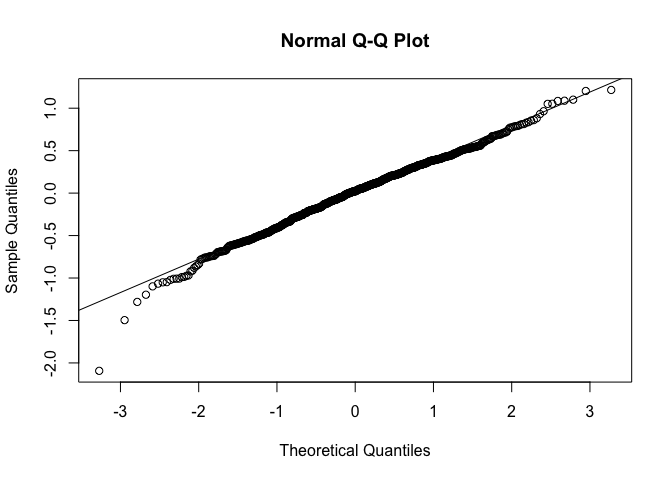

Asumiremos normalidad.

Recuerde que la distribución posterior de *α* y *β* dada *σ*2
es normal, pero marginalmente sigue una distribución *t* con
*n* − *p* − 1 grados de libertad. En este caso, *p* = 1, ya que *I**Q*
es el único predictor del log del salario incluido en nuestro modelo.

Por lo tanto, tanto *α* como *β* tendrán una parte posterior que seguirá
una distribución *t* de 933 grados de libertad, ya que los *d**f* es tan
grande que estas distribuciones serán aproximadamente normales.

> 1.  Bajo la referencia apriori
>     *p*(*α*, *β*, *σ*2)∝1/*σ*2, dé un intervalo
>     creíble posterior del 95% para *β*, el coeficiente de IQ.

    iq_mean_estimate <- coef(summary(m_lwage_iq))["IQ", "Estimate"]
    iq_sd <- coef(summary(m_lwage_iq))["IQ", "Std. Error"]
    qnorm(c(0.025, 0.975), mean = iq_mean_estimate, sd=iq_sd)

    ## [1] 0.007103172 0.010511141

> Ejercicio: el coeficiente de IQ es muy pequeño, lo que se espera ya
> que es improbable que un aumento de un punto en la puntuación de
> coeficiente intelectual tenga un alto efecto multiplicador sobre el
> salario. Una forma de hacer que el coeficiente sea más interpretable
> es estandarizar el coeficiente intelectual antes de colocarlo en el
> modelo. A partir de este nuevo modelo, ¿se estima que un aumento en el
> coeficiente intelectual de 1 desviación estándar (15 puntos) aumentará
> el salario en qué porcentaje?

Si el IQ está estandarizado usando la función `scale`, un aumento de IQ
de 15 puntos causaría un aumento de salario de ...

    library(dplyr)
    wage1 <- mutate(wage, siq=scale(IQ))

    m_lwage_scaled_iq <- lm(lwage ~ siq, data = wage1)
    coef(summary(m_lwage_scaled_iq))["siq", "Estimate"]*15+coef(summary(m_lwage_scaled_iq))["(Intercept)", "Estimate"]

    ## [1] 8.767568

Regresión lineal múltiple
-------------------------

Es evidente que el salario puede explicarse por muchos factores
predictivos, como la experiencia, la educación y el coeficiente
intelectual. Podemos incluir todas las covariables relevantes en un
modelo de regresión en un intento de explicar la mayor variación
salarial posible.

    m_lwage_full = lm(lwage ~ . - wage, data = wage)

> 1.  Desde el modelo, todo lo demás constante, ¿a quién esperaría ganar
>     más: un hombre afro casado o un hombre no afro soltero?

Todo lo demás constante, el hombre afro casado obtendrá el multiplicador
inferior a su salario en comparación con el hombre no afro soltero.

    married_coef <- coef(summary(m_lwage_full))["married", "Estimate"]
    black_coef <- coef(summary(m_lwage_full))["black", "Estimate"]

    married_black <- married_coef*1+black_coef*1

    married_black

    ## [1] 0.09561891

El **Criterio de Información Bayesiano (BIC)**, que es una métrica que
se puede usar para la selección del modelo.

BIC se basa en el ajuste del modelo, mientras que al mismo tiempo
penaliza el número de parámetros en proporción al tamaño de la muestra.
Podemos calcular el BIC del modelo lineal completo usando el siguiente
comando:

    BIC(m_lwage_full)

    ## [1] 586.3732

Eliminamos variable a variable para comparar modelos:

    m_lwage_nobrthord = lm(lwage ~ . -wage -brthord, data = na.omit(wage))
    BIC(m_lwage_nobrthord)

    ## [1] 582.4815

Para hacer esto de forma automática,

    library(MASS)
    m_lwage_full1 <- lm(wage ~. -wage, data = na.omit(wage))

    n <- nrow(na.omit(wage))

    final_model <- stepAIC(m_lwage_full1, direction = "backward", k=log(n), trace = 0)

    summary(final_model)

    ## 
    ## Call:
    ## lm(formula = wage ~ hours + tenure + lwage, data = na.omit(wage))
    ## 
    ## Residuals:
    ##     Min      1Q  Median      3Q     Max 
    ## -172.57  -63.43  -35.43   23.39 1065.78 
    ## 
    ## Coefficients:
    ##               Estimate Std. Error t value Pr(>|t|)    
    ## (Intercept) -5546.2383    84.7839 -65.416  < 2e-16 ***
    ## hours           1.9072     0.6548   2.913   0.0037 ** 
    ## tenure         -4.1285     0.9372  -4.405 1.23e-05 ***
    ## lwage         951.0113    11.5041  82.667  < 2e-16 ***
    ## ---
    ## Signif. codes:  0 '***' 0.001 '**' 0.01 '*' 0.05 '.' 0.1 ' ' 1
    ## 
    ## Residual standard error: 120.1 on 659 degrees of freedom
    ## Multiple R-squared:  0.9131, Adjusted R-squared:  0.9127 
    ## F-statistic:  2307 on 3 and 659 DF,  p-value: < 2.2e-16

Modelo Bayesiano para el Promedio
---------------------------------

> El Modelo Bayesiano de Promedio (BMA) es una aplicación de la
> inferencia bayesiana a los problemas de selección del modelo,
> estimación combinada y predicción que produce un criterio de elección
> del modelo sencillo y predicciones con menos riesgo.

A menudo, varios modelos son igualmente plausibles y elegir solo uno
ignora la incertidumbre inherente involucrada en la elección de las
variables para incluir en el modelo. Una forma de solucionar este
problema es implementar BMA, en el que se promedian varios modelos para
obtener los coeficientes posteriores y las predicciones a partir de
nuevos datos.

    library(BAS)
    wage_no_na = na.omit(wage)
    bma_lwage = bas.lm(lwage ~ . -wage, data = wage_no_na,
                       prior = "BIC", 
                       modelprior = uniform())
    bma_lwage

    ## 
    ## Call:
    ## bas.lm(formula = lwage ~ . - wage, data = wage_no_na, prior = "BIC", 
    ##     modelprior = uniform())
    ## 
    ## 
    ##  Marginal Posterior Inclusion Probabilities: 
    ## Intercept      hours         IQ        KWW       educ      exper  
    ##   1.00000    0.85540    0.89732    0.34790    0.99887    0.70999  
    ##    tenure        age    married      black      south      urban  
    ##   0.70389    0.52468    0.99894    0.34636    0.32029    1.00000  
    ##      sibs    brthord      meduc      feduc  
    ##   0.04152    0.12241    0.57339    0.23274

    summary(bma_lwage)

    ##           P(B != 0 | Y)    model 1       model 2       model 3
    ## Intercept    1.00000000     1.0000     1.0000000     1.0000000
    ## hours        0.85540466     1.0000     1.0000000     1.0000000
    ## IQ           0.89732380     1.0000     1.0000000     1.0000000
    ## KWW          0.34789711     0.0000     0.0000000     0.0000000
    ## educ         0.99887165     1.0000     1.0000000     1.0000000
    ## exper        0.70999264     0.0000     1.0000000     1.0000000
    ## tenure       0.70388732     1.0000     1.0000000     1.0000000
    ## age          0.52467706     1.0000     1.0000000     0.0000000
    ## married      0.99894489     1.0000     1.0000000     1.0000000
    ## black        0.34636476     0.0000     0.0000000     0.0000000
    ## south        0.32028820     0.0000     0.0000000     0.0000000
    ## urban        0.99999983     1.0000     1.0000000     1.0000000
    ## sibs         0.04152242     0.0000     0.0000000     0.0000000
    ## brthord      0.12241283     0.0000     0.0000000     0.0000000
    ## meduc        0.57339273     1.0000     1.0000000     1.0000000
    ## feduc        0.23274081     0.0000     0.0000000     0.0000000
    ## BF                   NA     1.0000     0.5219484     0.5182767
    ## PostProbs            NA     0.0455     0.0237000     0.0236000
    ## R2                   NA     0.2710     0.2767000     0.2696000
    ## dim                  NA     9.0000    10.0000000     9.0000000
    ## logmarg              NA -1490.0531 -1490.7032396 -1490.7102989
    ##                 model 4       model 5
    ## Intercept     1.0000000     1.0000000
    ## hours         1.0000000     1.0000000
    ## IQ            1.0000000     1.0000000
    ## KWW           1.0000000     0.0000000
    ## educ          1.0000000     1.0000000
    ## exper         1.0000000     0.0000000
    ## tenure        1.0000000     1.0000000
    ## age           0.0000000     1.0000000
    ## married       1.0000000     1.0000000
    ## black         0.0000000     1.0000000
    ## south         0.0000000     0.0000000
    ## urban         1.0000000     1.0000000
    ## sibs          0.0000000     0.0000000
    ## brthord       0.0000000     0.0000000
    ## meduc         1.0000000     1.0000000
    ## feduc         0.0000000     0.0000000
    ## BF            0.4414349     0.4126566
    ## PostProbs     0.0201000     0.0188000
    ## R2            0.2763000     0.2762000
    ## dim          10.0000000    10.0000000
    ## logmarg   -1490.8707777 -1490.9381925

La impresión del modelo y el resumen nos da la probabilidad de inclusión
del modelo posterior para cada variable y los modelos más probables.

Por ejemplo, la probabilidad posterior de que las horas se incluyan en
el modelo es de 0.855. Además, el modelo más probable, que tiene una
probabilidad posterior de 0.0455, incluye un intercepto, horas
trabajadas, IQ, educación, permanencia, edad, estado civil, vida urbana
y educación de la madre.

Si bien una probabilidad posterior de 0.0455 parece pequeña, es mucho
mayor que la probabilidad apriori uniforme que se le asigna, ya que hay
216 modelos posibles.

También es posible visualizar la *distribución posterior* de los
coeficientes bajo el enfoque BAS. Graficamos la distribución posterior
de los coeficientes de `IQ` y `sibs` a continuación.

    par(mfrow = c(1,2))
    coef_lwage = coefficients(bma_lwage)
    plot(coef_lwage, subset = c(3,13), ask=FALSE)

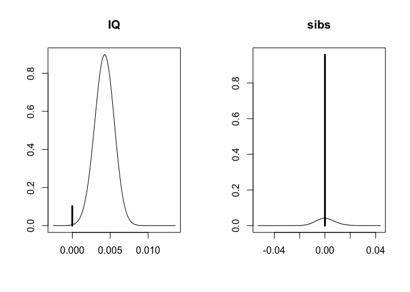

También podemos proporcionar intervalos confiables del 95% para estos
coeficientes:

    confint(coef_lwage)

    ##                    2.5%       97.5%          beta
    ## Intercept  6.787915e+00 6.841263690  6.814297e+00
    ## hours     -9.301686e-03 0.000000000 -5.307999e-03
    ## IQ         0.000000e+00 0.006300709  3.798331e-03
    ## KWW       -1.247249e-06 0.008390459  1.960580e-03
    ## educ       2.270690e-02 0.066132850  4.407076e-02
    ## exper      0.000000e+00 0.021163076  1.002641e-02
    ## tenure     0.000000e+00 0.012842305  5.935700e-03
    ## age        0.000000e+00 0.025662128  8.965975e-03
    ## married    1.207075e-01 0.302115915  2.092941e-01
    ## black     -1.904361e-01 0.000000000 -4.418635e-02
    ## south     -1.039652e-01 0.000000000 -2.217579e-02
    ## urban      1.368202e-01 0.261088614  1.981221e-01
    ## sibs       0.000000e+00 0.000000000  2.184531e-05
    ## brthord   -1.995655e-02 0.000000000 -1.947067e-03
    ## meduc      0.000000e+00 0.022925716  8.671710e-03
    ## feduc      0.000000e+00 0.015405658  2.512592e-03
    ## attr(,"Probability")
    ## [1] 0.95
    ## attr(,"class")
    ## [1] "confint.bas"

    plot(confint(coef_lwage, parm = 2:5))

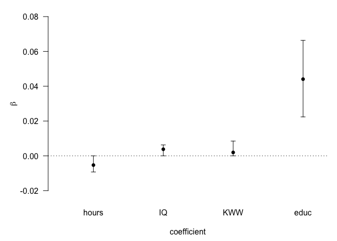

    ## NULL

Usaremos un conjunto de datos reducido que excluye el número de
hermanos, el orden de nacimiento y la educación de los padres.

    wage_red = wage %>% dplyr::select(-sibs, -brthord, -meduc, -feduc)

    bma_wage_red <- bas.lm(lwage ~ . -wage, data = wage_red, na.action = "na.omit", prior = "BIC", modelprior = uniform())

    bma_wage_red

    ## 
    ## Call:
    ## bas.lm(formula = lwage ~ . - wage, data = wage_red, na.action = "na.omit", 
    ##     prior = "BIC", modelprior = uniform())
    ## 
    ## 
    ##  Marginal Posterior Inclusion Probabilities: 
    ## Intercept      hours         IQ        KWW       educ      exper  
    ##    1.0000     0.8692     0.9172     0.3217     1.0000     0.9335  
    ##    tenure        age    married      black      south      urban  
    ##    0.9980     0.1786     0.9999     0.9761     0.8149     1.0000

De acuerdo con este conjunto de datos reducido, según BAS, la edad tiene
la menor probabilidad marginal posterior de inclusión.

    summary(bma_wage_red)

    ##           P(B != 0 | Y)    model 1       model 2       model 3
    ## Intercept     1.0000000     1.0000     1.0000000     1.0000000
    ## hours         0.8691892     1.0000     1.0000000     1.0000000
    ## IQ            0.9171606     1.0000     1.0000000     1.0000000
    ## KWW           0.3216995     0.0000     1.0000000     0.0000000
    ## educ          1.0000000     1.0000     1.0000000     1.0000000
    ## exper         0.9334843     1.0000     1.0000000     1.0000000
    ## tenure        0.9980015     1.0000     1.0000000     1.0000000
    ## age           0.1786252     0.0000     0.0000000     0.0000000
    ## married       0.9999368     1.0000     1.0000000     1.0000000
    ## black         0.9761347     1.0000     1.0000000     1.0000000
    ## south         0.8148859     1.0000     1.0000000     0.0000000
    ## urban         1.0000000     1.0000     1.0000000     1.0000000
    ## BF                   NA     1.0000     0.5089216     0.2629792
    ## PostProbs            NA     0.3311     0.1685000     0.0871000
    ## R2                   NA     0.2708     0.2751000     0.2634000
    ## dim                  NA    10.0000    11.0000000     9.0000000
    ## logmarg              NA -2275.4209 -2276.0963810 -2276.7566000
    ##                 model 4       model 5
    ## Intercept     1.0000000     1.0000000
    ## hours         1.0000000     0.0000000
    ## IQ            1.0000000     1.0000000
    ## KWW           0.0000000     0.0000000
    ## educ          1.0000000     1.0000000
    ## exper         1.0000000     1.0000000
    ## tenure        1.0000000     1.0000000
    ## age           1.0000000     0.0000000
    ## married       1.0000000     1.0000000
    ## black         1.0000000     1.0000000
    ## south         1.0000000     1.0000000
    ## urban         1.0000000     1.0000000
    ## BF            0.2032218     0.1823136
    ## PostProbs     0.0673000     0.0604000
    ## R2            0.2737000     0.2628000
    ## dim          11.0000000     9.0000000
    ## logmarg   -2277.0143771 -2277.1229466

Cambiemos la distribución apriori

    bma_lwage_full <- bas.lm(lwage ~. -wage, data = wage, prior = "ZS-null", modelprior = beta.binomial(1,1))
    bma_lwage_full

    ## 
    ## Call:
    ## bas.lm(formula = lwage ~ . - wage, data = wage, prior = "ZS-null", 
    ##     modelprior = beta.binomial(1, 1))
    ## 
    ## 
    ##  Marginal Posterior Inclusion Probabilities: 
    ## Intercept      hours         IQ        KWW       educ      exper  
    ##    1.0000     0.9792     0.9505     0.6671     0.9998     0.8951  
    ##    tenure        age    married      black      south      urban  
    ##    0.9040     0.7093     0.9998     0.7160     0.6904     1.0000  
    ##      sibs    brthord      meduc      feduc  
    ##    0.3939     0.5329     0.7575     0.5360

    summary(bma_lwage_full)

    ##           P(B != 0 | Y)     model 1     model 2     model 3 model 4
    ## Intercept     1.0000000  1.00000000  1.00000000  1.00000000  1.0000
    ## hours         0.9791805  1.00000000  1.00000000  1.00000000  1.0000
    ## IQ            0.9504649  1.00000000  1.00000000  1.00000000  1.0000
    ## KWW           0.6670581  1.00000000  1.00000000  1.00000000  1.0000
    ## educ          0.9998424  1.00000000  1.00000000  1.00000000  1.0000
    ## exper         0.8950911  1.00000000  1.00000000  1.00000000  1.0000
    ## tenure        0.9040154  1.00000000  1.00000000  1.00000000  1.0000
    ## age           0.7092838  1.00000000  1.00000000  1.00000000  1.0000
    ## married       0.9997881  1.00000000  1.00000000  1.00000000  1.0000
    ## black         0.7160065  1.00000000  1.00000000  1.00000000  1.0000
    ## south         0.6903761  1.00000000  1.00000000  1.00000000  1.0000
    ## urban         1.0000000  1.00000000  1.00000000  1.00000000  1.0000
    ## sibs          0.3938831  1.00000000  1.00000000  0.00000000  0.0000
    ## brthord       0.5329256  1.00000000  1.00000000  1.00000000  0.0000
    ## meduc         0.7575461  1.00000000  1.00000000  1.00000000  1.0000
    ## feduc         0.5359832  1.00000000  0.00000000  1.00000000  0.0000
    ## BF                   NA  0.01282536  0.06040359  0.04899544  1.0000
    ## PostProbs            NA  0.07380000  0.02320000  0.01880000  0.0126
    ## R2                   NA  0.29250000  0.29140000  0.29090000  0.2882
    ## dim                  NA 16.00000000 15.00000000 15.00000000 13.0000
    ## logmarg              NA 76.00726699 77.55689145 77.34757008 80.3636
    ##             model 5
    ## Intercept  1.000000
    ## hours      1.000000
    ## IQ         1.000000
    ## KWW        1.000000
    ## educ       1.000000
    ## exper      1.000000
    ## tenure     1.000000
    ## age        1.000000
    ## married    1.000000
    ## black      1.000000
    ## south      1.000000
    ## urban      1.000000
    ## sibs       0.000000
    ## brthord    1.000000
    ## meduc      1.000000
    ## feduc      0.000000
    ## BF         0.227823
    ## PostProbs  0.012500
    ## R2         0.289600
    ## dim       14.000000
    ## logmarg   78.884412

El modelo *naive* con todas las variables incluidas tiene una
probabilidad posterior mayor que 0.5. (Usamos una apriori Zellner-Siow
para los coeficientes y una apriori Beta-Binomial (1,1) para los
modelos)

> Ejercicio: Grafique la distribución posterior del coeficiente de edad,
> utilizando el conjunto de datos `wage_red`.

    par(mfrow = c(1,1))

    coef_bma_wage_red <- coefficients(bma_wage_red)

    plot(coef_bma_wage_red, subset =c(8), ask = FALSE)

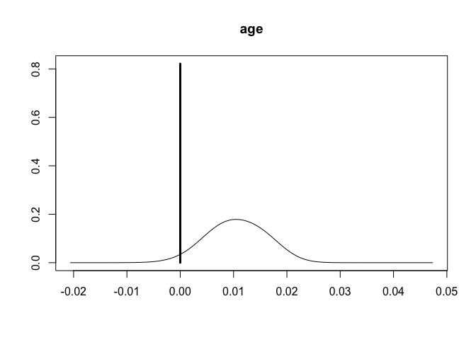

Predicción
----------

Una ventaja clave de las estadísticas bayesianas es la predicción y la
interpretación probabilística de las predicciones. Gran parte de la
predicción bayesiana se realiza mediante técnicas de simulación, algunas
de las cuales se analizaron cerca del final de este módulo. Esto se
aplica a menudo en modelos de regresión, aunque trabajaremos a través de
un ejemplo con solo un término de intercepción.

Supongamos que observa cuatro observaciones numéricas de *y*, que son 2,
2, 0 y 0 respectivamente con media muestral $\\bar{y} = 1$ y varianza
muestral *s*2 = 4/3. Suponiendo que
*y* ∼ *N*(*μ*, *σ*2), bajo la referencia anterior
*p*(*μ*, *σ*2)∝1/*σ*2, nuestra parte posterior se
convierte en

*p*(*μ*, *σ*2)∝1/*σ*2

que se centra en la media de la muestra y

1/*σ*2, *y* ∼ *G**a**m**m**a*(*α* = 3/2, *β* = 4/2)

donde *α* = (*n* − 1)/2 y *β* = *s*2(*n* − 1)/2 = 2.

Para obtener la distribución predictiva para *y*5, primero
podemos simular *σ*2 desde su parte posterior y luego *μ*
seguido de *y*5. Nuestros sorteos de *y*5 serán de
la distribución predictiva posterior para una nueva observación. El
siguiente ejemplo extrae 100000 veces de la distribución predictiva
posterior de *y*5.

    set.seed(314)
    N = 100000
    phi = rgamma(N,3/2,2)
    sigma2 = 1/phi
    mu = rnorm(N, 1, sqrt(sigma2/4))
    y_5 = rnorm(N, mu, sqrt(sigma2))

Podemos ver una estimación de la distribución predictiva, mirando la
versión suavizada del histograma de los datos simulados:

    hist(y_5, prob=T, breaks=30, xlab=expression(y[5]), main="")

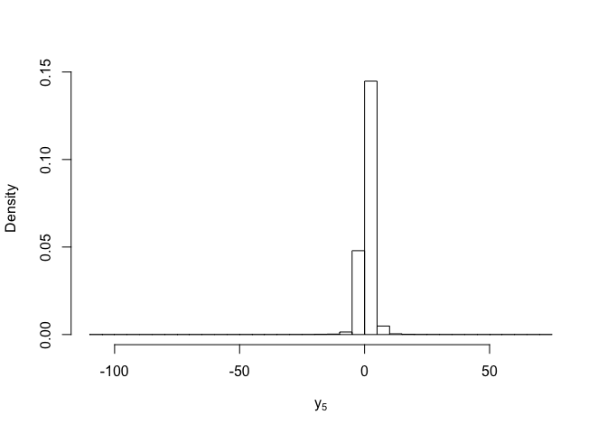

Un intervalo creíble central del 95% para una nueva observación es el
intervalo (*L*, *U*) donde *P*(*Y*5 &lt; *L* ∣ *Y*)=.05/2 y
*P*(*Y*5 &gt; *U* ∣ *Y*)=.05/2). En este caso, L es el
cuantil de 0.025 y *U* es el cuantil de 0.975. Podemos obtener esos
valores usando la función de cuantiles para encontrar los cuantiles de
muestra para 0.025 y 0.975 de *y*5.

Estimamos intervalos de credibilidad:

    quantile(y_5, probs = c(0.025, 0.975))

    ##      2.5%     97.5% 
    ## -3.109585  5.132511

> Ejercicio: en el ejemplo simple anterior, es posible utilizar la
> integración para calcular posterior analítica. En este caso, es una
> distribución *t* escalada con 3 grados de libertad (*n* − 1) con media
> 1 y escala =*s*2(1 + 1/*n*). Grafique la densidad empírica
> de y junto con la densidad real de la distribución *t*. ¿Cómo se
> comparan?

    par(mfrow = c(1,1))
    den_of_y <-  density(y_5)
    plot(den_of_y)

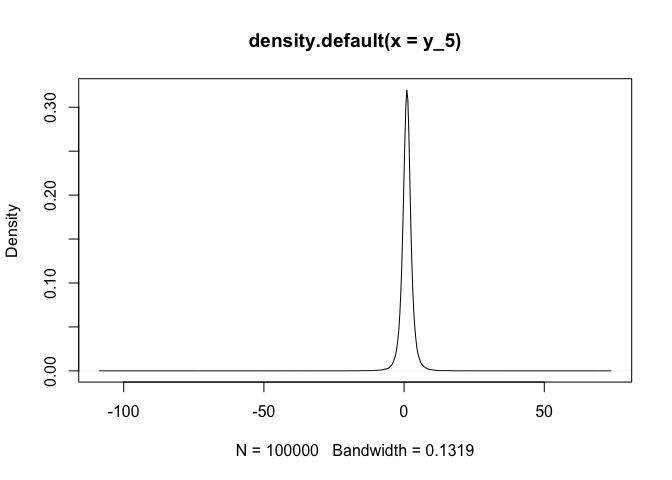

Prediccion con BAS
------------------

La simulación usa BAS para construir intervalos predictivos, mientras
que la inferencia exacta a menudo es posible con intervalos predictivos
bajo selección del modelo.

Volviendo al conjunto de datos salariales, encontremos valores
predictivos bajo el mejor modelo predictivo, el que tiene predicciones
más cercanas a BMA y las desviaciones estándar posteriores
correspondientes.

    BPM_pred_lwage =  predict(bma_lwage, estimator="BPM", se.fit=TRUE)
    bma_lwage$namesx[BPM_pred_lwage$bestmodel+1]

    ##  [1] "Intercept" "hours"     "IQ"        "KWW"       "educ"     
    ##  [6] "exper"     "tenure"    "age"       "married"   "urban"    
    ## [11] "meduc"

Podemos comparar esto con el modelo de mayor probabilidad que
encontramos anteriormente y el Modelo de probabilidad media (MPM)

    MPM_pred_lwage =  predict(bma_lwage, estimator="MPM")
    bma_lwage$namesx[MPM_pred_lwage$bestmodel+1]

    ##  [1] "Intercept" "hours"     "IQ"        "educ"      "exper"    
    ##  [6] "tenure"    "age"       "married"   "urban"     "meduc"

El `MPM` incluye exper además de todas las variables como el `HPM`
(*highest probability model*), mientras que el
`BPM incluye kwh además de todas las variables en el`MPM\` (*median
probability model*).

> Ejercicio: utilizando los datos reducidos, ¿qué covariables se
> incluyen en el mejor modelo predictivo, el modelo de probabilidad
> mediana y el modelo de probabilidad posterior más alto?

Vamos a ver qué características llevan a los salarios más altos con el
modelo BPM.

    opt = which.max(BPM_pred_lwage$fit)
    t(wage_no_na[opt, ])

    ##                283
    ## wage    1586.00000
    ## hours     40.00000
    ## IQ       127.00000
    ## KWW       48.00000
    ## educ      16.00000
    ## exper     16.00000
    ## tenure    12.00000
    ## age       37.00000
    ## married    1.00000
    ## black      0.00000
    ## south      0.00000
    ## urban      1.00000
    ## sibs       4.00000
    ## brthord    4.00000
    ## meduc     16.00000
    ## feduc     16.00000
    ## lwage      7.36897

Se puede obtener un intervalo creíble del 95% para predecir los salarios
logarítmicos con

    ci_lwage = confint(BPM_pred_lwage, parm="pred")
    ci_lwage[opt,]

    ##     2.5%    97.5%     pred 
    ## 6.661857 8.056463 7.359160

Para volver a traducir a salarios, podemos exponenciar el intervalo.

    exp(ci_lwage[opt,])

    ##      2.5%     97.5%      pred 
    ##  782.0015 3154.1155 1570.5169

para obtener un intervalo de predicción del 95% para los salarios de un
individuo con covariables en los niveles del individuo especificado por
`opt`

    BMA_pred_lwage =  predict(bma_lwage, estimator="BMA", se.fit=TRUE)
    ci_bma_lwage = confint(BMA_pred_lwage, estimator="BMA")
    opt_bma = which.max(BMA_pred_lwage$fit)
    exp(ci_bma_lwage[opt_bma,])

    ##      2.5%     97.5%      pred 
    ##  733.3446 2989.2077 1494.9900

Caso 2: Seleccionando la película ideal
=======================================

Los datos
---------

En nuestro conjunto de datos, hay una muestra aleatoria de 651 películas
que se estrenaron en los cines de Estados Unidos en el período
1970-2016. Los datos se obtuvieron de Rotten Tomatoes y IMDB. El
conjunto de datos contiene 32 características de cada película, incluido
el género, la calificación de la MPAA, el estudio de producción y si
recibieron nominaciones al Oscar, entre otras características. Así que
ahora, podemos preguntarnos:

> ¿Se puede predecir la popularidad de una película considerando algunas
> de sus características, como el tipo, el género, la calificación de la
> MPAA, el número de votos de IMDB y si ha ganado un premio?

Antes de continuar con el desarrollo de cualquier modelo, debemos
responder dos preguntas: ¿Se pueden generalizar nuestros resultados?
¿Qué tipo de inferencia se puede hacer con el conjunto de datos actual?

Para la primera pregunta, podemos notar que las películas incluidas en
este conjunto de datos fueron muestreadas aleatoriamente de las dos
fuentes mencionadas anteriormente y no se creó ningún sesgo por el
método de muestreo, como consecuencia, podemos asumir que los resultados
obtenidos pueden generalizarse a todas las películas estadounidenses
lanzadas entre 1970 y 2016.

Por otro lado, este es un estudio observacional, por lo que las
relaciones que se pueden encontrar a partir de estos datos indican
asociación, pero no causalidad.

**Antes de empezar...**

¿Qué entendemos por *popularidad* de una película? Nuestro conjunto de
datos incluye una muestra de películas de dos fuentes diferentes y
tenemos dos variables que potencialmente podrían usarse como
popularidad: `audience_score` (puntuación de audiencia en Rotten
Tomatoes) e `imdb_rating` (clasificación en IMDB).

Así que sigamos adelante y analicemos un poco más estas dos variables.
En primer lugar, comprobaremos si estas variables muestran una
correlación entre ellas. Para hacer esto, vamos a trazar ambas variables
en un diagrama de dispersión:

    load(url("https://stat.duke.edu/~mc301/data/movies.Rdata")) 

    # Remove the confidence interval
    ggplot(movies, aes(x=audience_score, y=imdb_rating)) + 
      geom_point()+
      geom_smooth(method=lm, se=FALSE)

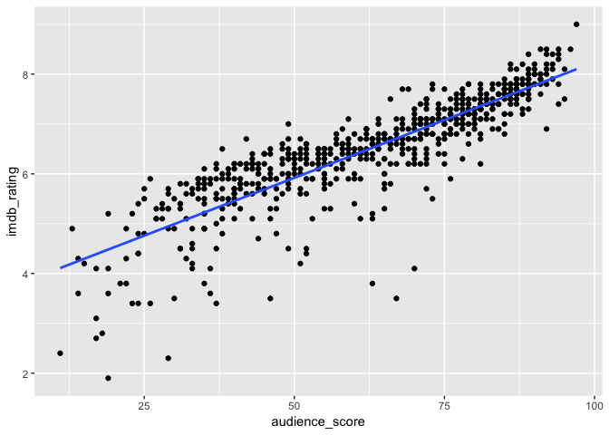

Podemos ver que la gráfica muestra una posible correlación positiva
entre las dos variables. Confirmaremos esto utilizando la función cor
para calcular numéricamente la correlación:

    cor(movies$audience_score, movies$imdb_rating)

    ## [1] 0.8648652

     ggplot(movies, aes(x=imdb_rating)) +geom_histogram(fill="lightgreen", alpha = 0.7)+theme_bw()+labs(x = "Imdb rating", y= "Count", title = "Districion de Imdb rating")

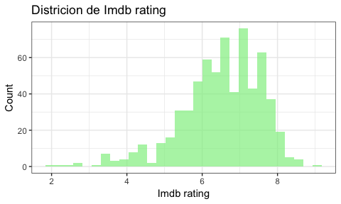

    library(gridExtra)
    # grid.newpage()
    grid.table(movies %>% summarise(mean = round(mean(imdb_rating), 3), 
                sd = round(sd(imdb_rating), 3), 
                median = median(imdb_rating), 
                IQR = IQR(imdb_rating), 
                min = min(imdb_rating), 
                max = max(imdb_rating)))

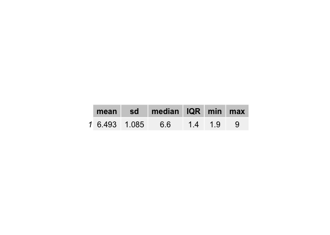

Entonces, podemos hacer lo mismo para `audience_score`:

    ggplot(movies, aes(x=audience_score)) +

      geom_histogram(fill="lightgreen", alpha = 0.7)+

      theme_bw()+

      labs(x = "Audience score", y= "Count", title = "Distribución de Imdb rating")

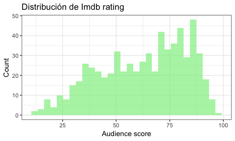

    library(gridExtra)
    # grid.newpage()
    grid.table(movies %>% summarise(mean = round(mean(audience_score), 3), 
                sd = round(sd(audience_score), 3), 
                median = median(audience_score), 
                IQR = IQR(audience_score), 
                min = min(audience_score), 
                max = max(audience_score)))

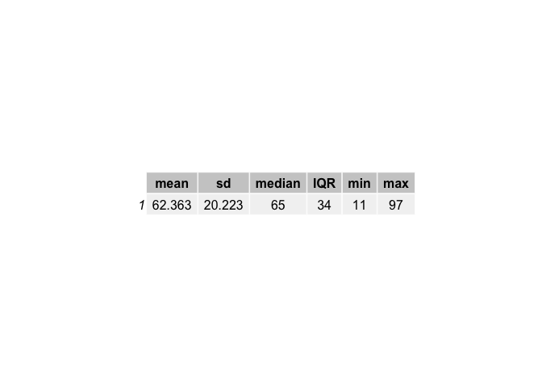

Podemos ver que la variable `imbd_rating` muestra una distribución
cercana a la normal con un sesgo ligeramente a la izquierda con una
media de 6.493 y una mediana de 6.00. Por otro lado, la variable
`audience_score` muestra una distribución más uniforme con una media de
62.36 y una mediana de 65.00. Debido a su distribución, elegiremos
considerar solo `imdb_rating`.

Ya habiendo elegido la variable respuesta, podemos analizar la
interacción entre nuestras variables exploratorias y la respuesta. Para
esta tarea, podemos trazar diagramas de caja o de dispersión según si la
variable exploratoria es numérica o categórica.

    movies_interesting <- movies[,c("imdb_num_votes",
                                   "imdb_rating","best_pic_win"
                                   ,"best_dir_win","best_actress_win",
                                   "best_actor_win")]

    p1 <- ggplot(movies_interesting, aes(x=imdb_num_votes, y = imdb_rating))+
      geom_point(colour = "blue", alpha = 0.5)+
      theme_bw()+
      geom_smooth()+
      labs(x = "Number votes", y= "Imdb rating", fill = "won_oscar")+ 
      theme(axis.text.x=element_text(angle=90, hjust = 1, vjust = 0))+
      theme(legend.position="none")

    p2 <- ggplot(movies_interesting, aes(x=best_pic_win, y = imdb_rating, fill = best_pic_win))+
      geom_boxplot(alpha = 0.7)+
      theme_bw()+
      labs(x = "Film_won_Oscar", y= "Imdb rating", fill = "best_pic_win")+ 
      theme(axis.text.x=element_text(angle=90, hjust = 1, vjust = 0))+
      theme(legend.position="none")

    p3 <- ggplot(movies_interesting, aes(x=best_dir_win, y = imdb_rating, fill = best_dir_win))+
      geom_boxplot(alpha = 0.7)+
      theme_bw()+
      labs(x = "Director_won_Oscar", y= "Imdb rating", fill = "best_dir_win")+ 
      theme(axis.text.x=element_text(angle=90, hjust = 1, vjust = 0))+
      theme(legend.position="none")

      

    p4 <- ggplot(movies_interesting, aes(x=best_actress_win, y = imdb_rating, fill = best_actress_win))+
      geom_boxplot(alpha = 0.7)+
      theme_bw()+
      labs(x = "Actress_won_Oscar", y= "Imdb rating", fill = "best_actress_win")+ 
      theme(axis.text.x=element_text(angle=90, hjust = 1, vjust = 0))+
      theme(legend.position="none")

    p5 <- ggplot(movies_interesting, aes(x=best_actor_win, y = imdb_rating, fill = best_actor_win))+
    geom_boxplot(alpha = 0.7)+
    theme_bw()+
    labs(x = "Actor_won_Oscar", y= "Imdb rating", fill = "best_actor_win")+ 
    theme(axis.text.x=element_text(angle=90, hjust = 1, vjust = 0))+
    theme(legend.position="none")

    pdp::grid.arrange(p1, p2, p3, p4, p5, nrow = 3)

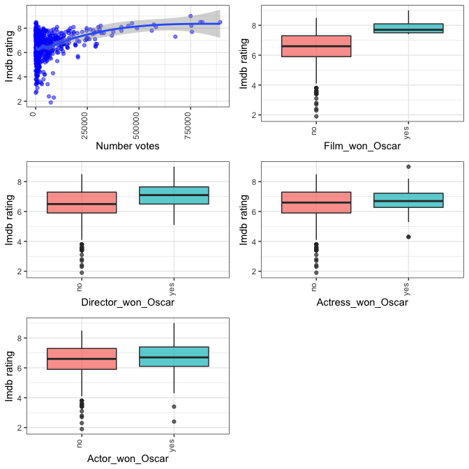

De las figuras y el resumen descriptivo obtenido, se puede ver que, en
nuestro conjunto de datos, las películas que ganaron un Oscar o el
director que alguna vez ganó un Oscar parecen tener una calificación
visiblemente más alta.

Por otra parte, el número de votos muestra una débil asociación positiva
con la calificación de IMDB. Por último, las variables `best_actor_win`
y `best_actress_win` parecen tener la misma distribución y una
asociación similar con imdb\_rating, por lo que combinaremos estas dos
variables en una nueva llamada `main_oscar_win`.

Regresión lineal múltiple
-------------------------

    movies$main_oscar_win <-with(movies,ifelse(best_actress_win=="yes" & best_actor_win=="yes",1,0))
    movies$log_votes <- log(movies$imdb_num_votes)

    fullmodel <- lm(imdb_rating ~genre+best_pic_win+best_dir_win+main_oscar_win+log_votes+mpaa_rating, 
              data = movies)

    summary(fullmodel)

    ## 
    ## Call:
    ## lm(formula = imdb_rating ~ genre + best_pic_win + best_dir_win + 
    ##     main_oscar_win + log_votes + mpaa_rating, data = movies)
    ## 
    ## Residuals:
    ##     Min      1Q  Median      3Q     Max 
    ## -3.9776 -0.3924  0.0599  0.5228  2.2455 
    ## 
    ## Coefficients:
    ##                                 Estimate Std. Error t value Pr(>|t|)    
    ## (Intercept)                     3.578692   0.327689  10.921  < 2e-16 ***
    ## genreAnimation                 -0.452476   0.326523  -1.386 0.166317    
    ## genreArt House & International  1.032678   0.255350   4.044 5.90e-05 ***
    ## genreComedy                     0.052675   0.140268   0.376 0.707390    
    ## genreDocumentary                2.197595   0.189450  11.600  < 2e-16 ***
    ## genreDrama                      0.895294   0.119302   7.504 2.11e-13 ***
    ## genreHorror                    -0.008115   0.208779  -0.039 0.969008    
    ## genreMusical & Performing Arts  1.682459   0.267600   6.287 6.04e-10 ***
    ## genreMystery & Suspense         0.548061   0.155698   3.520 0.000463 ***
    ## genreOther                      0.800534   0.235298   3.402 0.000711 ***
    ## genreScience Fiction & Fantasy -0.165852   0.298679  -0.555 0.578897    
    ## best_pic_winyes                 0.357394   0.342296   1.044 0.296835    
    ## best_dir_winyes                 0.267523   0.142505   1.877 0.060939 .  
    ## main_oscar_win                  0.357461   0.193798   1.845 0.065579 .  
    ## log_votes                       0.285337   0.022914  12.453  < 2e-16 ***
    ## mpaa_ratingNC-17               -0.195868   0.634905  -0.309 0.757804    
    ## mpaa_ratingPG                  -0.554522   0.229586  -2.415 0.016005 *  
    ## mpaa_ratingPG-13               -0.949921   0.233828  -4.062 5.47e-05 ***
    ## mpaa_ratingR                   -0.592969   0.227328  -2.608 0.009311 ** 
    ## mpaa_ratingUnrated             -0.107480   0.260162  -0.413 0.679653    
    ## ---
    ## Signif. codes:  0 '***' 0.001 '**' 0.01 '*' 0.05 '.' 0.1 ' ' 1
    ## 
    ## Residual standard error: 0.8381 on 631 degrees of freedom
    ## Multiple R-squared:  0.4205, Adjusted R-squared:  0.403 
    ## F-statistic:  24.1 on 19 and 631 DF,  p-value: < 2.2e-16

Revisemos si tenemos el problema de multicolinealidad:

    car::vif(fullmodel)

    ##                    GVIF Df GVIF^(1/(2*Df))
    ## genre          2.609093 10        1.049118
    ## best_pic_win   1.155063  1        1.074739
    ## best_dir_win   1.161042  1        1.077516
    ## main_oscar_win 1.036515  1        1.018094
    ## log_votes      1.362577  1        1.167295
    ## mpaa_rating    2.433478  5        1.093006

El modelo Bayesiano
-------------------

    movies_bas <- bas.lm(imdb_rating ~genre+best_pic_win+best_dir_win+main_oscar_win+log_votes+mpaa_rating, 
              data = movies,method = "MCMC",
                         prior = "ZS-null",
                         modelprior = uniform())

Veamos los resultados

    summary(movies_bas)

    ##                                P(B != 0 | Y)  model 1     model 2
    ## Intercept                          1.0000000   1.0000   1.0000000
    ## genreAnimation                     0.9999996   1.0000   1.0000000
    ## genreArt House & International     0.9999996   1.0000   1.0000000
    ## genreComedy                        0.9999996   1.0000   1.0000000
    ## genreDocumentary                   0.9999996   1.0000   1.0000000
    ## genreDrama                         0.9999996   1.0000   1.0000000
    ## genreHorror                        0.9999996   1.0000   1.0000000
    ## genreMusical & Performing Arts     0.9999996   1.0000   1.0000000
    ## genreMystery & Suspense            0.9999996   1.0000   1.0000000
    ## genreOther                         0.9999996   1.0000   1.0000000
    ## genreScience Fiction & Fantasy     0.9999996   1.0000   1.0000000
    ## best_pic_winyes                    0.2490807   0.0000   0.0000000
    ## best_dir_winyes                    0.6172068   1.0000   1.0000000
    ## main_oscar_win                     0.4382420   0.0000   1.0000000
    ## log_votes                          0.9999899   1.0000   1.0000000
    ## mpaa_ratingNC-17                   0.9993662   1.0000   1.0000000
    ## mpaa_ratingPG                      0.9993662   1.0000   1.0000000
    ## mpaa_ratingPG-13                   0.9993662   1.0000   1.0000000
    ## mpaa_ratingR                       0.9993662   1.0000   1.0000000
    ## mpaa_ratingUnrated                 0.9993662   1.0000   1.0000000
    ## BF                                        NA   1.0000   0.7112807
    ## PostProbs                                 NA   0.2945   0.2095000
    ## R2                                        NA   0.4163   0.4195000
    ## dim                                       NA  18.0000  19.0000000
    ## logmarg                                   NA 130.8190 130.4782750
    ##                                    model 3   model 4     model 5
    ## Intercept                        1.0000000   1.00000   1.0000000
    ## genreAnimation                   1.0000000   1.00000   1.0000000
    ## genreArt House & International   1.0000000   1.00000   1.0000000
    ## genreComedy                      1.0000000   1.00000   1.0000000
    ## genreDocumentary                 1.0000000   1.00000   1.0000000
    ## genreDrama                       1.0000000   1.00000   1.0000000
    ## genreHorror                      1.0000000   1.00000   1.0000000
    ## genreMusical & Performing Arts   1.0000000   1.00000   1.0000000
    ## genreMystery & Suspense          1.0000000   1.00000   1.0000000
    ## genreOther                       1.0000000   1.00000   1.0000000
    ## genreScience Fiction & Fantasy   1.0000000   1.00000   1.0000000
    ## best_pic_winyes                  0.0000000   0.00000   1.0000000
    ## best_dir_winyes                  0.0000000   0.00000   0.0000000
    ## main_oscar_win                   0.0000000   1.00000   0.0000000
    ## log_votes                        1.0000000   1.00000   1.0000000
    ## mpaa_ratingNC-17                 1.0000000   1.00000   1.0000000
    ## mpaa_ratingPG                    1.0000000   1.00000   1.0000000
    ## mpaa_ratingPG-13                 1.0000000   1.00000   1.0000000
    ## mpaa_ratingR                     1.0000000   1.00000   1.0000000
    ## mpaa_ratingUnrated               1.0000000   1.00000   1.0000000
    ## BF                               0.4280718   0.40646   0.2488817
    ## PostProbs                        0.1264000   0.12000   0.0739000
    ## R2                               0.4108000   0.41460   0.4137000
    ## dim                             17.0000000  18.00000  18.0000000
    ## logmarg                        129.9704987 129.91869 129.4281856

Veamos un gráfico el lod-odd del ranking de modelos posterior

    image(movies_bas, rotate=F)

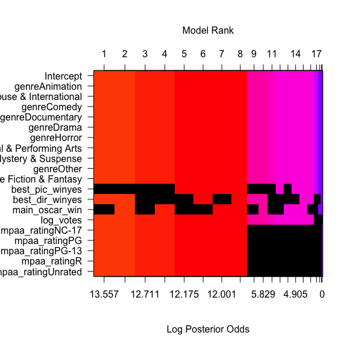

Ahora podemos obtener las estimaciones de los coeficientes y las
desviaciones estándar bajo BMA para poder examinar las distribuciones
marginales de los coeficientes algunas variables.

    coef_movies <- coef(movies_bas)

    par(mfrow=c(3,2))
    plot(coef_movies, subset = c(1, 2, 3, 4, 9, 10), ask=F)

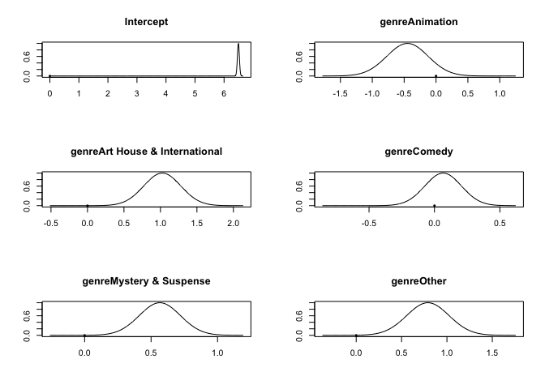

Por último, podemos obtener intervalos creíbles al 95% (la probabilidad
de que la media verdadera esté contenida dentro de un intervalo dado es
de 0.95)

    confint(coef_movies)

    ##                                        2.5%       97.5%        beta
    ## Intercept                       6.426456499  6.55671877  6.49308756
    ## genreAnimation                 -1.094704592  0.19181464 -0.44774411
    ## genreArt House & International  0.508915377  1.51262956  1.02557784
    ## genreComedy                    -0.220807004  0.32955206  0.06632049
    ## genreDocumentary                1.787005835  2.53203438  2.17898132
    ## genreDrama                      0.655135951  1.12406669  0.89997018
    ## genreHorror                    -0.425403957  0.39524141 -0.00170733
    ## genreMusical & Performing Arts  1.125247035  2.17783349  1.66760827
    ## genreMystery & Suspense         0.245499930  0.86040208  0.56586260
    ## genreOther                      0.311122330  1.23646706  0.79003480
    ## genreScience Fiction & Fantasy -0.750340845  0.42347536 -0.15685365
    ## best_pic_winyes                -0.004359436  0.88594907  0.11648065
    ## best_dir_winyes                 0.000000000  0.51007810  0.19105262
    ## main_oscar_win                  0.000000000  0.63640358  0.16056148
    ## log_votes                       0.241472949  0.33188604  0.28790336
    ## mpaa_ratingNC-17               -1.479019748  1.02011874 -0.19687799
    ## mpaa_ratingPG                  -0.989341725 -0.08244174 -0.53256922
    ## mpaa_ratingPG-13               -1.407886777 -0.48568200 -0.93591859
    ## mpaa_ratingR                   -1.032992182 -0.13532808 -0.57983212
    ## mpaa_ratingUnrated             -0.622634161  0.40045009 -0.10114952
    ## attr(,"Probability")
    ## [1] 0.95
    ## attr(,"class")
    ## [1] "confint.bas"

Una salida gráfica

    par(mfrow = c(2,2))
    plot(movies_bas,  ask=F)

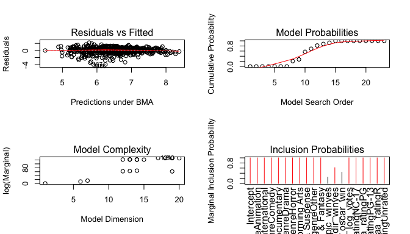

Referencias
===========

<https://cran.r-project.org/web/packages/BAS/vignettes/BAS-vignette.html>
