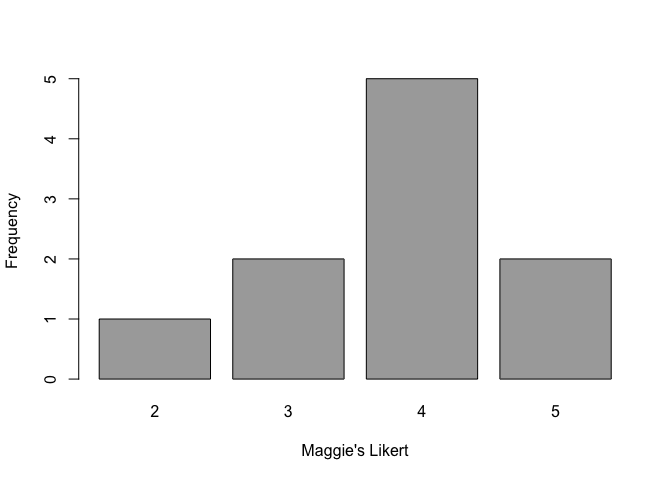
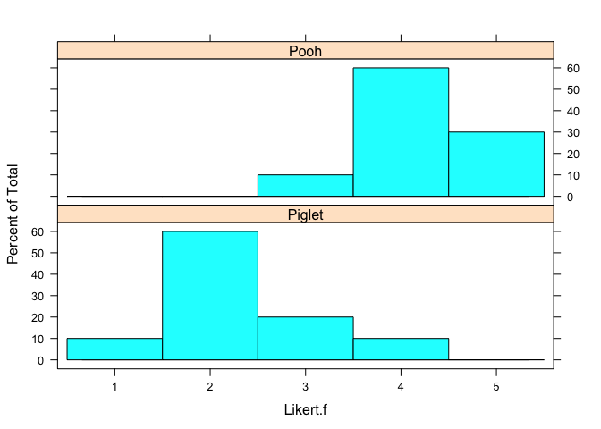

-   [Introducción a las pruebas no
    paramétricas](#introduccion-a-las-pruebas-no-parametricas)
    -   [Ventajas de las pruebas no
        paramétricas](#ventajas-de-las-pruebas-no-parametricas)
    -   [Desventajas de las pruebas no
        paramétricas](#desventajas-de-las-pruebas-no-parametricas)
    -   [Interpretación de las pruebas no
        paramétricas](#interpretacion-de-las-pruebas-no-parametricas)
    -   [Tamaño del efecto](#tamano-del-efecto)
-   [Prueba de Wilcoxon Signed-rank de una
    muestra](#prueba-de-wilcoxon-signed-rank-de-una-muestra)
    -   [Ejemplo de una prueba de Wilcoxon de una
        muestra](#ejemplo-de-una-prueba-de-wilcoxon-de-una-muestra)
    -   [Ejercicios](#ejercicios)
-   [Prueba de signos para datos de una
    muestra](#prueba-de-signos-para-datos-de-una-muestra)
    -   [Ejemplo de prueba de signo de una
        muestra](#ejemplo-de-prueba-de-signo-de-una-muestra)
    -   [Prueba de signo con el paquete
        `BSDA`](#prueba-de-signo-con-el-paquete-bsda)
    -   [Prueba de signo con el paquete
        `DescTools`](#prueba-de-signo-con-el-paquete-desctools)
-   [Prueba U de Mann-Whitney de dos
    muestras](#prueba-u-de-mann-whitney-de-dos-muestras)
    -   [Ejemplo de prueba U de Mann-Whitney de dos
        muestras](#ejemplo-de-prueba-u-de-mann-whitney-de-dos-muestras)
    -   [Ejemplo de prueba U de Mann-Whitney de dos
        muestras](#ejemplo-de-prueba-u-de-mann-whitney-de-dos-muestras-1)
    -   [Tamaño del efecto](#tamano-del-efecto-1)
-   [Referencias](#referencias)

-   La idea principal de la inferencia no paramétrica es usar los datos
    para inferir una cantidad desconocida haciendo la menor cantidad de
    supuestos posible.

-   En términos generales, un procedimiento no paramétrico es un
    procedimiento estadístico que tiene algunas propiedades deseables
    que requiere de relativamente pocos supuestos en relación a la
    población subyacente de los cuales se obtiene los datos.

-   Savage (1962) designó al año 1936 como el verdadero comienzo del
    tema de las estadística no paramétrica, marcado por la publicación
    del artículo de Hotelling y Pabst (1936) sobre la correlación de
    rangos.

-   Métodos para estadística no paramétrica para una o dos muestras se
    desarrolla aproximadamente desde 1945 con Wilcoxon.

-   A principios de 1970, se desarrolla todo el componente teórico para
    modelos lineales generalizados, que genalizan estos métodos. Por
    eso, se los suele llamar *rank-based methods*.

-   Ventajas de las técnicas no paramétricas:

    -   Requieren pocos supuestos de la población subyacente de los que
        se obtiene los datos. En particular, supera el supuesto de
        normalidad.
    -   Sin acudir al supuesto de normalidad, estos métodos permiten
        obtener p-valores para las pruebas, intervalos de confianza,
        probabilidad *coverage*, etc.
    -   Frecuentemente (no siempre), estos métodos son más fáciles de
        aplicar y entender.
    -   Usualmente, los procedimientos no paramétricos son solo un poco
        menos eficientes que su contraparte basada en la normal. Y puede
        ser mucho más eficiente cuando la normalidad de la población
        subyacente no se cumple.
    -   Son relativamente insensibles a observaciones *outlier*.
    -   Métodos como jaknife y bootstrap se usan en contextos bastante
        complicados, donde los métodos paramétricos no podrían ser
        implementados.

<!-- http://rcompanion.org/handbook/F_01.html -->
**Paquetes usados en esta sección**

-   `effsize`

El siguiente comando instala el paquete si aún no lo tienes instalado:

    if(!require(effsize)){install.packages("effsize")}

Introducción a las pruebas no paramétricas
==========================================

Los tests presentados en este apartado son principalmente basados en el
rango (*rank*).

Por ejemplo, imaginemos que tenemos las alturas de ocho estudiantes en
centímetros

    Height <- c(110,132,137,139,140,142,142,145)
    names(Height) <- letters[1:8]
    Height

    ##   a   b   c   d   e   f   g   h 
    ## 110 132 137 139 140 142 142 145

    rank(Height)

    ##   a   b   c   d   e   f   g   h 
    ## 1.0 2.0 3.0 4.0 5.0 6.5 6.5 8.0

*a* tiene la altura más pequeña, entonces se ranquea como 1. *b* tiene
la siguiente altua más pequeña, entonces se ranquea como 2, y así
sucesivamente. Nota que *f* y *g* empatan en los lugares 6 y 7, entonces
comparten el ranking 6.5.

Nota también que el valor de *a* es ligeramente menor que los demás, y
su ranqueo es 1. La información de la altura como tal se ha perdido, y
solo queda el ranking relativos en el ranqueo. Es decir, si el valor de
la altura de *a* cambia a 100 o 5, el ranqueo queda igual.

La ventaja de usar estas pruebas basadas en rangos es que no hacen
muchas suposiciones sobre la distribución de los datos. En cambio, sus
conclusiones se basan en los rangos relativos de valores en los grupos
que se están probando.

Ventajas de las pruebas no paramétricas
---------------------------------------

-   Las pruebas más usadas suelen ser familiares, tal que tu contraparte
    puede estar familiarizado con los términos.
-   Son adecuadas para variables dependientes de intervalo/ratio u
    ordinales.
-   Su naturaleza no paramétrica lo hace adecuado para datos que no
    cumplen los supuestos del enfoque paramétrico. Esto incluye datos
    que son sesgados, no normales, tienen atípicos, o posiblemente
    censurados. Los datos censurados son aquellos donde hay un límite
    superior o inferior a los valores. Por ejemplo, si las edades
    menores de 5 años se reportan como un grupo de *menores de 5 años*.

Desventajas de las pruebas no paramétricas
------------------------------------------

-   Estas pruebas suelen tener el nombre de sus autores, con nombres
    como Mann-Whitney, Kruskal-Wallis y Wilcoxon. Puede ser difícil
    recordar estos nombres, o recordar qué prueba se usa en qué
    situación.

-   La mayoría de las pruebas no paramétricas tradicionales están
    limitadas por los tipos de diseños experimentales que pueden
    abordar. Por lo general, se limitan a una comparación de grupos
    independientes de una vía (por ejemplo, Kruskal-Wallis), o al diseño
    de bloques completos sin réplicas para muestras pareadas (por
    ejemplo, Friedman). El enfoque de transformación de rangos
    alineados, sin embargo, permite diseños más complicados.

-   Es probable que encuentren mucha información contradictoria en
    diferentes fuentes sobre las hipótesis y supuestos de estas pruebas.
    En particular, los autores a menudo tratan las hipótesis de algunas
    pruebas como correspondientes a las **pruebas de medianas**, y luego
    enumeran los supuestos de la prueba como correspondientes a estas
    hipótesis. Sin embargo, si esto no se explica explícitamente, el
    resultado es que diferentes fuentes enumeran diferentes supuestos
    que los datos deben cumplir para que la prueba sea válida. Esto crea
    una confusión innecesaria en la mente de los estudiantes que tratan
    de emplear correctamente estas pruebas.

Interpretación de las pruebas no paramétricas
---------------------------------------------

En general, estas pruebas determinan si existe una diferencia
*sistemática* entre los grupos. Esto puede deberse a una diferencia en
la ubicación (por ejemplo, la mediana) o en la forma o amplitud de la
distribución de los datos. Con las pruebas de Mann-Whitney y
Kruskal-Wallis, la diferencia entre grupos (que es de interés) **es la
probabilidad de que una observación de un grupo sea mayor que una
observación de otro grupo**. Si esta probabilidad es 0.50, esto se
denomina *igualdad estocástica*, y cuando esta probabilidad está lejos
de 0.50, a veces se llama *dominancia estocástica*.

*Nota técnica opcional*: sin supuestos adicionales sobre la distribución
de los datos, las pruebas de Mann-Whitney y Kruskal-Wallis no evalúan
hipótesis sobre las medianas del grupo. Mangiafico (2015) y McDonald
(2014) en la sección *Referencias* proporcionan un ejemplo de una prueba
significativa de Kruskal-Wallis donde los grupos tienen medianas
idénticas, pero difieren en su dominio estocástico.

Tamaño del efecto
-----------------

Las estadísticas de tamaño del efecto para las pruebas no paramétricas
tradicionales incluyen el *delta* de Cliff y la *A* de Vargha y Delaney
para Mann-Whitney, y el *coeficiente de determinación* de Freeman
(Freeman, 1965) para Kruskal-Wallis. También hay una estadística *r*
para Mann-Whitney y la prueba de rango con signo emparejado. La *W* de
Kendall se puede usar para la prueba de Friedman.

Un par de recursos accesibles sobre el tamaño del efecto para estas
pruebas son Tomczak y Tomczak (2014) y King y Rosopa (2010).

Algunas estadísticas de tamaño del efecto determinan el grado en que un
grupo tiene datos con rangos más altos que otros grupos. Tienden a
variar de 0 (los grupos tienen datos que son estocásticamente iguales) a
1 (**un grupo domina estocásticamente**). Se relacionan con la
probabilidad de que un valor de un grupo sea mayor que un valor de otro
grupo.

Como medidas basadas en rangos, estas estadísticas de tamaño del efecto
no indican la diferencia en valores absolutos entre grupos. Es decir, si
reemplazara los 5 en el segundo ejemplo a continuación por 100, el valor
de las estadísticas de tamaño del efecto no cambiaría, porque en
cualquier caso los 5 o 100 son los números mejor clasificados. Para una
interpretación práctica de los resultados, generalmente es importante
considerar los valores absolutos de los datos, como con las estadísticas
descriptivas.

Por ejemplo, sean *X* = {*x*1, …, *x**m*} y
*Y* = {*y*1, …, *y**n*} dos muestras, la delta de
Cliff se define como:

$$
\\delta(i,j) = \\begin{cases}
    +1       & \\quad \\text{si } x\_i&gt;y\_j\\\\
    -1  & \\quad \\text{si } x\_i&lt;y\_j\\\\
    0  & \\quad \\text{si } x\_i=y\_j
  \\end{cases}
$$

Y el efecto se calcula:

$$
\\delta = \\sum\_{i = 1}^{m}\\sum\_{j = 1}^{n}\\delta(i,j)
$$

    library(effsize)

    A = c(1,1,1, 2,2,2, 3,3,3, 4,4,4)
    B = c(1,1,1, 2,2,2, 3,3,3, 4,4,4)

    cliff.delta(B, A)

    ## 
    ## Cliff's Delta
    ## 
    ## delta estimate: 0 (negligible)
    ## 95 percent confidence interval:
    ##      lower      upper 
    ## -0.4398889  0.4398889

    ### Esto corresponde a un VDA de 0.5,
    ###  La probablidad de que una observación en B sea mayor que 
    ### una observación en A

    A = c(1,1,1, 2,2,2, 3,3,3, 4,4,4)
    B = c(2,2,2, 3,3,3, 4,4,4, 5,5,5)

    cliff.delta(B, A)

    ## 
    ## Cliff's Delta
    ## 
    ## delta estimate: 0.4375 (medium)
    ## 95 percent confidence interval:
    ##       lower       upper 
    ## -0.02692382  0.74658736

    ### Esto corresponde a un VDA de 0.719,
    ###  La probablidad de que una observación en B sea mayor que 
    ### una observación en A

    A = c(1,1,1, 2,2,2, 3,3,3, 4,4,4)
    B = c(3,3,3, 4,4,4, 5,5,5, 6,6,6)

    cliff.delta(B, A)

    ## 
    ## Cliff's Delta
    ## 
    ## delta estimate: 0.75 (large)
    ## 95 percent confidence interval:
    ##     lower     upper 
    ## 0.3835975 0.9123954

    ### Esto corresponde a un VDA de 0.875,
    ###  La probablidad de que una observación en B sea mayor que 
    ### una observación en A

    A = c(1,1,1, 2,2,2, 3,3,3, 4,4,4)
    B = c(5,5,5, 6,6,6, 7,7,7, 8,8,8)

    cliff.delta(B, A)

    ## 
    ## Cliff's Delta
    ## 
    ## delta estimate: 1 (large)
    ## 95 percent confidence interval:
    ##     lower     upper 
    ## 0.9833595 1.0000000

    ### Esto corresponde a un VDA de 1,
    ###  La probablidad de que una observación en B sea mayor que 
    ### una observación en A

Prueba de Wilcoxon Signed-rank de una muestra
=============================================

Las pruebas de una muestra son útiles para comparar un conjunto de
valores con un valor predeterminado dado. Por ejemplo, uno podría
preguntarse si un conjunto de puntajes Likert de cinco puntos son
significativamente diferentes de un puntaje "predeterminado" o "neutral"
de 3. Otro uso podría ser comparar un conjunto actual de valores con un
valor publicado previamente.

La prueba de Wilcoxon de una muestra es una prueba basada en la
clasificación que comienza con el cálculo de la diferencia entre los
valores observados y el valor predeterminado. Debido a la resta
involucrada en los cálculos, se asume que los datos son intervalos. Es
decir, con los datos tipo Likert en esta prueba, se asume que los datos
son numéricos. Para datos puramente ordinales, se podría utilizar la
prueba de *signos de una muestra* en su lugar.

La **hipótesis nula** para la prueba es que los datos son **simétricos
respecto al valor predeterminado** (excepto que la prueba se realiza en
rangos una vez que se determinan las distancias de las observaciones del
valor predeterminado).

Un resultado significativo sugiere que los datos (clasificados) son
simétricos respecto de otro valor o están lo suficientemente sesgados en
una dirección. En cualquier caso, esto sugiere que la ubicación de los
datos es diferente del valor predeterminado elegido.

Sin más suposiciones sobre la distribución de los datos, la prueba no es
una prueba de la mediana.

**Datos Apropiados**

-   Datos de una muesta
-   Datos de intervalo o razón

**Hipótesis**

-   *H**o*: La población de la cual se toma la muestra es simétrica
    respecto al valor predeterminado.
-   *H**a*: (dos colas): La población a partir de la cual se muestrearon
    los datos no es simétrica respecto al valor predeterminado.

**Interpretación**

Informar resultados significativos como por ejemplo *Las puntuaciones de
Likert fueron significativamente diferentes de un valor neutral de 3* es
aceptable.

**Nota del nombre del test**

Los nombres utilizados para la prueba de rango con signo de Wilcoxon de
una muestra y pruebas similares pueden ser confusos. Se puede usar la
*prueba de signos*, aunque la prueba de signos es una prueba diferente.
Tanto la *prueba de rango con signo* como la *prueba de signo* se usan a
veces para referirse a pruebas de una muestra o de dos muestras.

El mejor consejo es usar un nombre específico para la prueba que se está
utilizando.

**Otras notas**

Algunos autores recomiendan esta prueba solo en los casos en que los
datos son simétricos. Tengo entendido que este requisito es solo para
que la prueba se considere una prueba de la mediana.

Para datos ordinales o para una prueba específicamente sobre la mediana,
se puede usar la prueba de signos.

**Paquetes usados en esta sección**

-   psych
-   FSA
-   rcompanion
-   coin

<!-- -->

    if(!require(psych)){install.packages("psych")}
    if(!require(FSA)){install.packages("FSA")}
    if(!require(rcompanion)){install.packages("rcompanion")}
    if(!require(coin)){install.packages("coin")}

Ejemplo de una prueba de Wilcoxon de una muestra
------------------------------------------------

Este ejemplo usa los datos de Maggie Simpson.

El ejemplo responde a la pregunta: *¿Son las puntuaciones de Maggie
significativamente diferentes de una puntuación neutral de 3?*

La prueba se realizará con la función `wilcox.test`, que produce un
valor *p* para la hipótesis, así como una pseudo-mediana y un intervalo
de confianza.

    Input =("
      Speaker          Rater  Likert
     'Maggie Simpson'   1         3
     'Maggie Simpson'   2         4
     'Maggie Simpson'   3         5
     'Maggie Simpson'   4         4
     'Maggie Simpson'   5         4
     'Maggie Simpson'   6         4
     'Maggie Simpson'   7         4
     'Maggie Simpson'   8         3
     'Maggie Simpson'   9         2
     'Maggie Simpson'  10         5     
    ")

    Data = read.table(textConnection(Input),header=TRUE)

    ### Crear una nueva variable que contiene las puntuaciones de Likert como un factor ordenado

    Data$Likert.f = factor(Data$Likert,
                           ordered = TRUE)

    ###  Chequeamos el data frame

    library(psych)

    headTail(Data)

    str(Data)

    ## 'data.frame':    10 obs. of  4 variables:
    ##  $ Speaker : Factor w/ 1 level "Maggie Simpson": 1 1 1 1 1 1 1 1 1 1
    ##  $ Rater   : int  1 2 3 4 5 6 7 8 9 10
    ##  $ Likert  : int  3 4 5 4 4 4 4 3 2 5
    ##  $ Likert.f: Ord.factor w/ 4 levels "2"<"3"<"4"<"5": 2 3 4 3 3 3 3 2 1 4

    summary(Data)

    ##            Speaker       Rater           Likert     Likert.f
    ##  Maggie Simpson:10   Min.   : 1.00   Min.   :2.00   2:1     
    ##                      1st Qu.: 3.25   1st Qu.:3.25   3:2     
    ##                      Median : 5.50   Median :4.00   4:5     
    ##                      Mean   : 5.50   Mean   :3.80   5:2     
    ##                      3rd Qu.: 7.75   3rd Qu.:4.00           
    ##                      Max.   :10.00   Max.   :5.00

    ### Retiramos los objetos innecesarios

    rm(Input)

**Resumen de las puntuaciones Likert como factores**

Tenga en cuenta que la variable que queremos contar es Likert.f, que es
una variable de factor. Los recuentos para Likert.f se tabulan de forma
cruzada sobre los valores de `Speaker`. La función `prop.table` traduce
una tabla en proporciones. La opción `margin = 1` indica que las
proporciones se calculan para cada fila.

    xtabs( ~ Speaker + Likert.f,
           data = Data)

    ##                 Likert.f
    ## Speaker          2 3 4 5
    ##   Maggie Simpson 1 2 5 2

    XT = xtabs( ~ Speaker + Likert.f,
               data = Data)

    prop.table(XT,
               margin = 1)

    ##                 Likert.f
    ## Speaker            2   3   4   5
    ##   Maggie Simpson 0.1 0.2 0.5 0.2

**Gráficamente**

    XT = xtabs(~ Likert.f,
              data=Data)

    barplot(XT,  
            col="dark gray",
            xlab="Maggie's Likert",
            ylab="Frequency")

**Resumen de las puntuaciones Likert como numéricos**

    library(FSA)

    Summarize(Likert ~ Speaker,                                                     
              data=Data,
              digits=3)

*Test de Wilcoxon de una muestra*

En la función `wilcox.test`, la opción `mu` indica el valor del valor
predeterminado para comparar. En este ejemplo, `Data$Likert` es el
conjunto de valores de una muestra en el que se realiza la prueba. Para
el significado de otras opciones, consulte `?wilcox.test`.

    wilcox.test(Data$Likert,
                mu=3,
                conf.int=TRUE,
                conf.level=0.95)

    ## 
    ##  Wilcoxon signed rank test with continuity correction
    ## 
    ## data:  Data$Likert
    ## V = 32.5, p-value = 0.04007
    ## alternative hypothesis: true location is not equal to 3
    ## 95 percent confidence interval:
    ##  3.000044 4.500083
    ## sample estimates:
    ## (pseudo)median 
    ##       4.000032

    ### Nota el valor p del resultado 

    ###  Tendrás una advertencia como  "cannot compute exact p-value with ties"    
    ###  Puedes ignorar eso, o usar la opcion exact=FALSE.

    ### Nota que el resultado tambien produce una pseudo mediana
    ###   y un intervalo de confianza si se usa la opcion conf.int=TRUE.

**Tamaño del efecto**

No tengo conocimiento de ninguna estadística de tamaño de efecto
establecida para la prueba de rango con signo de Wilcoxon de una
muestra. Sin embargo, puede tener sentido utilizar una estadística
análoga a la *r* utilizada en la prueba de Mann-Whitney.

La siguiente interpretación está basada en mi intuición personal. No se
pretende que sea universal.

    library(rcompanion)

    wilcoxonOneSampleR(Data$Likert,
                       mu=3)

    ##     r 
    ## 0.681

    #Pequeño si 0.10 <= r < 0.40
    #Mediano si 0.40 <= r <= 0.60
    #Pequeño si r>60

Ejercicios
----------

1.  Teniendo en cuenta los datos de Maggie Simpson,

<!-- -->

1.  ¿Cuál fue su puntuación media?

2.  ¿Cuáles fueron el primer y tercer cuartil de sus puntuaciones?

3.  De acuerdo con la prueba de rango con signo de Wilcoxon de una
    muestra, ¿son sus puntajes significativamente diferentes de un
    puntaje neutral de 3?

4.  ¿Es útil el resultado del intervalo de confianza de la prueba para
    responder la pregunta anterior?

5.  En general, ¿cómo resumiría sus resultados? Asegúrese de abordar la
    implicación práctica de sus puntuaciones en comparación con una
    puntuación neutral de 3.

6.  ¿Estos resultados reflejan lo que usted esperaría de ver el gráfico
    de barras?

<!-- -->

1.  Brian Griffin quiere evaluar el nivel de educación de los
    estudiantes en su curso de escritura creativa para adultos. Quiere
    saber el nivel de educación medio de su clase, y si el nivel de
    educación de su clase es diferente del nivel de licenciatura típico.

Brian usó la siguiente tabla para codificar sus datos.

<table>
<thead>
<tr class="header">
<th>Instructor</th>
<th>Student</th>
<th>Education</th>
</tr>
</thead>
<tbody>
<tr class="odd">
<td>Brian Griffin</td>
<td>a</td>
<td>3</td>
</tr>
<tr class="even">
<td>Brian Griffin</td>
<td>b</td>
<td>2</td>
</tr>
<tr class="odd">
<td>Brian Griffin</td>
<td>c</td>
<td>3</td>
</tr>
<tr class="even">
<td>Brian Griffin</td>
<td>d</td>
<td>3</td>
</tr>
<tr class="odd">
<td>Brian Griffin</td>
<td>e</td>
<td>3</td>
</tr>
<tr class="even">
<td>Brian Griffin</td>
<td>f</td>
<td>3</td>
</tr>
<tr class="odd">
<td>Brian Griffin</td>
<td>g</td>
<td>4</td>
</tr>
<tr class="even">
<td>Brian Griffin</td>
<td>h</td>
<td>5</td>
</tr>
<tr class="odd">
<td>Brian Griffin</td>
<td>i</td>
<td>3</td>
</tr>
<tr class="even">
<td>Brian Griffin</td>
<td>j</td>
<td>4</td>
</tr>
<tr class="odd">
<td>Brian Griffin</td>
<td>k</td>
<td>3</td>
</tr>
<tr class="even">
<td>Brian Griffin</td>
<td>l</td>
<td>2</td>
</tr>
</tbody>
</table>

Para cada uno de los siguientes, responda la pregunta y muestre el
resultado de los análisis que usó para responder la pregunta.

1.  ¿Cuál era el nivel medio de educación? (¡Asegúrese de informar el
    nivel de educación, no solo el código numérico!)

2.  ¿Cuáles fueron el primer y tercer cuartil para el nivel educativo?

3.  De acuerdo con la prueba de Wilcoxon de una muestra, ¿son los
    niveles de educación significativamente diferentes de los niveles de
    un bachiller típico?

4.  ¿Es útil el resultado del intervalo de confianza de la prueba para
    responder la pregunta anterior?

5.  En general, ¿cómo resumiría los resultados? Asegúrese de abordar las
    implicaciones prácticas.

6.  Grafica los datos de Brian tal que te ayude a visualizar los datos.

7.  ¿Los resultados reflejan lo que usted esperaría de mirar el gráfico?

Prueba de signos para datos de una muestra
==========================================

La prueba del signo de una muestra compara el número de observaciones
mayor o menor que el valor predeterminado sin tener en cuenta la
magnitud de la diferencia entre cada observación y el valor
predeterminado. La prueba tiene un propósito similar al de la prueba de
rango con signo de Wilcoxon de una muestra, pero mira específicamente el
valor de la mediana y no se ve afectada por la distribución de los
datos.

La prueba se realiza con la función `SIGN.test` en el paquete `BSDA` o
la función `SignTest` en el paquete `DescTools`. Estas funciones
producen un valor *p* para la hipótesis, así como la mediana y el
intervalo de confianza de la mediana para los datos.

**Datos apropiados**

-   datos de una muestra
-   Los datos son ordinales, intervalos o relaciones.

**Hipótesis**

-   Hipótesis nula: la mediana de la población de la cual se extrajo la
    muestra es igual al valor predeterminado.
-   Hipótesis alternativa (de dos colas): la mediana de la población de
    la que se extrajo la muestra no es igual al valor predeterminado.

**Interpretación**

Resultados significativos como por ejemplo *Las puntuaciones de Likert
fueron significativamente diferentes de un valor predeterminado de 3* es
aceptable. Como es, por ejemplo, *Las puntuaciones medianas de Likert
fueron significativamente diferentes de un valor predeterminado de 3*

**Paquetes de esta sección**

-   `BSDA`
-   `DescTools`

Los siguientes comandos instalarán estos paquetes si aún no están
instalados:

    if(!require(BSDA)){install.packages("BSDA")}
    if(!require(DescTools)){install.packages("DescTools")}

Ejemplo de prueba de signo de una muestra
-----------------------------------------

    Input =("
      Speaker           Rater     Likert
     'Maggie Simpson'   1         3
     'Maggie Simpson'   2         4
     'Maggie Simpson'   3         5
     'Maggie Simpson'   4         4
     'Maggie Simpson'   5         4
     'Maggie Simpson'   6         4
     'Maggie Simpson'   7         4
     'Maggie Simpson'   8         3
     'Maggie Simpson'   9         2
     'Maggie Simpson'  10         5
    ")

    Data = read.table(textConnection(Input),header=TRUE)

    ###  Chequeamos el data frame

    library(psych)

    headTail(Data)

    str(Data)

    ## 'data.frame':    10 obs. of  3 variables:
    ##  $ Speaker: Factor w/ 1 level "Maggie Simpson": 1 1 1 1 1 1 1 1 1 1
    ##  $ Rater  : int  1 2 3 4 5 6 7 8 9 10
    ##  $ Likert : int  3 4 5 4 4 4 4 3 2 5

    summary(Data)

    ##            Speaker       Rater           Likert    
    ##  Maggie Simpson:10   Min.   : 1.00   Min.   :2.00  
    ##                      1st Qu.: 3.25   1st Qu.:3.25  
    ##                      Median : 5.50   Median :4.00  
    ##                      Mean   : 5.50   Mean   :3.80  
    ##                      3rd Qu.: 7.75   3rd Qu.:4.00  
    ##                      Max.   :10.00   Max.   :5.00

    ### Removemos los objetos innecesarios

    rm(Input)

Prueba de signo con el paquete `BSDA`
-------------------------------------

Tenga en cuenta que `Data$Likert` es el dato de una muestra, y `md = 3`
indica el valor predeterminado para comparar.

    library(BSDA)

    SIGN.test(Data$Likert,
              md = 3)

    ## 
    ##  One-sample Sign-Test
    ## 
    ## data:  Data$Likert
    ## s = 7, p-value = 0.07031
    ## alternative hypothesis: true median is not equal to 3
    ## 95 percent confidence interval:
    ##  3.000000 4.675556
    ## sample estimates:
    ## median of x 
    ##           4 
    ## 
    ## Achieved and Interpolated Confidence Intervals: 
    ## 
    ##                   Conf.Level L.E.pt U.E.pt
    ## Lower Achieved CI     0.8906      3 4.0000
    ## Interpolated CI       0.9500      3 4.6756
    ## Upper Achieved CI     0.9785      3 5.0000

    ### Mediana y el intervalo de confianza

Prueba de signo con el paquete `DescTools`
------------------------------------------

Tenga en cuenta que `Data$Likert` es el dato de una muestra, y `md = 3`
indica el valor predeterminado para comparar.

    library(DescTools)

    SignTest(Data$Likert,
              mu = 3)

    ## 
    ##  One-sample Sign-Test
    ## 
    ## data:  Data$Likert
    ## S = 7, number of differences = 8, p-value = 0.07031
    ## alternative hypothesis: true median is not equal to 3
    ## 97.9 percent confidence interval:
    ##  3 5
    ## sample estimates:
    ## median of the differences 
    ##                         4

    ### Mediana e intervalo de confianza

Prueba U de Mann-Whitney de dos muestras
========================================

**Cuánto usar este test**

La prueba U de Mann-Whitney de dos muestras es una prueba basada en
rangos que compara valores para dos grupos. Un resultado significativo
sugiere que los valores para los dos grupos son diferentes. Es
equivalente a una prueba de suma de rangos de Wilcoxon de dos muestras.

Sin más suposiciones sobre la distribución de los datos, la prueba de
Mann-Whitney no aborda hipótesis sobre las medianas de los grupos. En
cambio, la prueba aborda si es probable que una observación en un grupo
sea mayor que una observación en el otro. Esto a veces se declara como
prueba si una muestra tiene un dominio estocástico en comparación con la
otra.

La prueba asume que las observaciones son independientes. Es decir, no
es apropiado para observaciones pareadas o datos de mediciones
repetidas.

La prueba se realiza con la función wilcox.test.

Las estadísticas de tamaño de efecto apropiadas incluyen Vargha y
Delaney A, Cliff´s delta, entre otras.

**Datos apropiados**

-   Dos muestras de datos. Es decir, datos unidireccionales solo con dos
    grupos

-   La variable dependiente es ordinal, intervalo o relación

-   La variable independiente es un factor con dos niveles. Es decir,
    dos grupos.

-   Las observaciones entre grupos son independientes. Es decir, datos
    de medidas no pareadas o repetidas.

-   Para ser una prueba de medianas, las distribuciones de valores para
    cada grupo deben ser de forma y distribución similares. De lo
    contrario, la prueba es típicamente una prueba de igualdad
    estocástica.

**Hipótesis**

-   Hipótesis nula: los dos grupos se muestrean de poblaciones con
    distribuciones idénticas. Típicamente, las poblaciones muestreadas
    exhiben igualdad estocástica.

-   Hipótesis alternativa (de dos caras): los dos grupos se muestrean de
    poblaciones con diferentes distribuciones. Típicamente, una muestra
    de población exhibe dominancia estocástica.

**Interpretación**

Los resultados significativos se pueden informar como, por ejemplo, "Los
valores para el grupo A fueron significativamente diferentes de los del
grupo B".

**Otras notas y pruebas alternativas.**

La prueba U de Mann-Whitney puede considerarse equivalente a la prueba
de Kruskal-Wallis con solo dos grupos.

La prueba de mediana de Mood compara las medianas de dos grupos. Se
describe en su propio capítulo.

Para los datos ordinales, una alternativa es usar modelos de enlaces
acumulativos, que se describen más adelante en este libro.

**Paquetes usandos en esta sección**

Los paquetes utilizados en este capítulo incluyen:

-   `psych`
-   `FSA`
-   `celosía`
-   `rcompanion`
-   `moneda`
-   `DescTools`
-   `effsize`

Los siguientes comandos instalarán estos paquetes si aún no están
instalados:

    if(!require(psych)){install.packages("psych")}
    if(!require(FSA)){install.packages("FSA")}
    if(!require(lattice)){install.packages("lattice")}
    if(!require(rcompanion)){install.packages("rcompanion")}
    if(!require(coin)){install.packages("coin")}
    if(!require(DescTools)){install.packages("DescTools")}
    if(!require(effsize)){install.packages("effsize")}

Ejemplo de prueba U de Mann-Whitney de dos muestras
---------------------------------------------------

Este ejemplo usa los datos de Pooh y Piglet.

Responde a la pregunta: *¿Son las puntuaciones de Pooh
significativamente diferentes de las de Piglet?*

La prueba U de Mann-Whitney se realiza con la función `wilcox.test`, que
produce un valor *p* para la hipótesis. Primero se resumen y examinan
los datos utilizando gráficos de barras para cada grupo.

    Input =("
     Speaker  Likert
     Pooh      3
     Pooh      5
     Pooh      4
     Pooh      4
     Pooh      4
     Pooh      4
     Pooh      4
     Pooh      4
     Pooh      5
     Pooh      5
     Piglet    2
     Piglet    4
     Piglet    2
     Piglet    2
     Piglet    1
     Piglet    2
     Piglet    3
     Piglet    2
     Piglet    2
     Piglet    3
    ")

    Data = read.table(textConnection(Input),header=TRUE)

    ### Crear una nueva variable que contiene los puntajes Likert como un factor ordenado

    Data$Likert.f = factor(Data$Likert,
                           ordered = TRUE)

    ###  Chequeamos el data frame

    library(psych)

    headTail(Data)

    str(Data)

    ## 'data.frame':    20 obs. of  3 variables:
    ##  $ Speaker : Factor w/ 2 levels "Piglet","Pooh": 2 2 2 2 2 2 2 2 2 2 ...
    ##  $ Likert  : int  3 5 4 4 4 4 4 4 5 5 ...
    ##  $ Likert.f: Ord.factor w/ 5 levels "1"<"2"<"3"<"4"<..: 3 5 4 4 4 4 4 4 5 5 ...

    summary(Data)

    ##    Speaker       Likert     Likert.f
    ##  Piglet:10   Min.   :1.00   1:1     
    ##  Pooh  :10   1st Qu.:2.00   2:6     
    ##              Median :3.50   3:3     
    ##              Mean   :3.25   4:7     
    ##              3rd Qu.:4.00   5:3     
    ##              Max.   :5.00

    ### Quitamos objetos innecesarios

    rm(Input)

**Resumen de las puntuaciones Likert como factores**

Tenga en cuenta que la variable que queremos contar es `Likert.f`, que
es una variable de factor. Los conteos para `Likert.f` se tabulan de
forma cruzada sobre los valores de Speaker. La función prop.table
traduce una tabla en proporciones. La opción `margin = 1` indica que las
proporciones se calculan para cada fila.

    xtabs( ~ Speaker + Likert.f,
           data = Data)

    ##         Likert.f
    ## Speaker  1 2 3 4 5
    ##   Piglet 1 6 2 1 0
    ##   Pooh   0 0 1 6 3

    XT = xtabs( ~ Speaker + Likert.f,
                data = Data)

    prop.table(XT,
               margin = 1)

    ##         Likert.f
    ## Speaker    1   2   3   4   5
    ##   Piglet 0.1 0.6 0.2 0.1 0.0
    ##   Pooh   0.0 0.0 0.1 0.6 0.3

**Gráfico de barras por grupo**

    library(lattice)

    histogram(~ Likert.f | Speaker,
              data=Data,
              layout=c(1,2)      #  columns and rows of individual plots
              )

**Resumen de las puntuaciones Likert como numéricos**

    library(FSA)
     
    Summarize(Likert ~ Speaker,
              data=Data,
              digits=3)

Ejemplo de prueba U de Mann-Whitney de dos muestras
---------------------------------------------------

Este ejemplo usa la notación que indica que Likert es la variable
dependiente y Speaker es la variable independiente. La opción `data =`
indica el marco de datos que contiene las variables. Para el revisar
otras opciones, consulte `? wilcox.test`.

    wilcox.test(Likert ~ Speaker,
                data=Data)

    ## 
    ##  Wilcoxon rank sum test with continuity correction
    ## 
    ## data:  Likert by Speaker
    ## W = 5, p-value = 0.0004713
    ## alternative hypothesis: true location shift is not equal to 0

Tamaño del efecto
-----------------

Las estadísticas del tamaño del efecto para la prueba de Mann-Whitney
informan el grado en que un grupo tiene datos con rangos más altos que
el otro grupo. Se relacionan con la probabilidad de que un valor de un
grupo sea mayor que un valor del otro grupo. A diferencia de los valores
de *p*, no se ven afectados por el tamaño de la muestra.

Vargha y Delaney's A son relativamente fáciles de entender. Informa la
probabilidad de que un valor de un grupo sea mayor que un valor del otro
grupo. Un valor de 0.50 indica que los dos grupos son estocásticamente
iguales. Un valor de 1 indica que el primer grupo muestra la dominación
estocástica completa sobre el otro grupo, y un valor de 0 indica la
dominación estocástica completa por el segundo grupo.

La delta de Cliff se relaciona linealmente con Vargha y la de Delaney A.
Su rango varía de −1 a 1, y 0 indica la igualdad estocástica de los dos
grupos. 1 indica que un grupo muestra la dominación estocástica completa
sobre el otro grupo, y un valor de –1 indica la dominación estocástica
completa del otro grupo. Su valor absoluto será numéricamente igual al
theta de Freeman.

Una estadística de tamaño de efecto común para la prueba de Mann-Whitney
es *r*, que es el valor *Z* de la prueba dividido por el número total de
observaciones. Como se escribe aquí, *r* varía de 0 a cerca de 1. En
algunas formulaciones, varía de –1 a 1.

La tau-b de Kendall a veces se usa, y varía de aproximadamente −1 a 1.

El theta de Freeman y el épsilon al cuadrado se usan generalmente cuando
hay más de dos grupos, con la prueba de Kruskal-Wallis, pero también se
pueden emplear en el caso de dos grupos.

La interpretación de los tamaños del efecto necesariamente varía según
la disciplina y las expectativas del experimento, pero para los estudios
de comportamiento, las pautas propuestas por Cohen (1988) a veces se
siguen. Las siguientes pautas se basan en los valores de la literatura e
intuición personal. No deben ser considerados universales.

Las interpretaciones para el delta de Vargha y Delaney y el delta de
Cliff provienen de Vargha y Delaney (2000).

<table>
<thead>
<tr class="header">
<th>Efecto</th>
<th>Pequeño</th>
<th>Medio</th>
<th>Alto</th>
</tr>
</thead>
<tbody>
<tr class="odd">
<td>r</td>
<td>0.10 – &lt; 0.30</td>
<td>0.30 – &lt; 0.50</td>
<td>≥ 0.50</td>
</tr>
<tr class="even">
<td>tau-b</td>
<td>0.10 – &lt; 0.30</td>
<td>0.30 – &lt; 0.50</td>
<td>≥ 0.50</td>
</tr>
<tr class="odd">
<td>Cliff’s delta</td>
<td>0.11 – &lt; 0.28</td>
<td>0.28 – &lt; 0.43</td>
<td>≥ 0.43</td>
</tr>
<tr class="even">
<td>Vargha and Delaney’s A</td>
<td>0.56 – &lt; 0.64</td>
<td>0.64 – &lt; 0.71</td>
<td>≥ 0.71</td>
</tr>
<tr class="odd">
<td></td>
<td>&gt; 0.34 – 0.44</td>
<td>&gt; 0.29 – 0.34</td>
<td>≤ 0.29</td>
</tr>
<tr class="even">
<td>Freeman’s theta</td>
<td>0.11 – &lt; 0.34</td>
<td>0.34 – &lt; 0.58</td>
<td>≥ 0.58</td>
</tr>
<tr class="odd">
<td>epsilon-squared</td>
<td>0.01 – &lt; 0.08</td>
<td>0.08 – &lt; 0.26</td>
<td>≥ 0.26</td>
</tr>
</tbody>
</table>

**Vargha and Delaney’s A**

    library(effsize)

    VD.A(d = Data$Likert, 
         f = Data$Speaker)

    ## 
    ## Vargha and Delaney A
    ## 
    ## A estimate: 0.05 (large)

    library(rcompanion)

    vda(Likert ~ Speaker, data=Data)

    ##  VDA 
    ## 0.05

    library(rcompanion)

    vda(Likert ~ Speaker, data=Data, ci=TRUE)

**Cliff’s delta**

    library(effsize)

    cliff.delta(d = Data$Likert, 
                f = Data$Speaker)

    ## 
    ## Cliff's Delta
    ## 
    ## delta estimate: -0.9 (large)
    ## 95 percent confidence interval:
    ##      lower      upper 
    ## -0.9801533 -0.5669338

    library(rcompanion)

    cliffDelta(Likert ~ Speaker, data=Data)

    ## Cliff.delta 
    ##        -0.9

    library(rcompanion)

    cliffDelta(Likert ~ Speaker, data=Data, ci=TRUE)

    ### Note: Los intervalos se calculan con Bootstrap.

**r**

    library(rcompanion)

    wilcoxonR(x = Data$Likert, 
              g = Data$Speaker)

    ##     r 
    ## 0.791

    library(rcompanion)

    wilcoxonR(x  = Data$Likert, 
              g  = Data$Speaker,
              ci = TRUE)

    ### Note: Los intervalos se calculan con Bootstrap.

**tau-b**

    library(DescTools)

    KendallTauB(x = Data$Likert,
                y = as.numeric(Data$Speaker))

    ## [1] 0.7397954

    library(DescTools)

    KendallTauB(x = Data$Likert,
                y = as.numeric(Data$Speaker),
                conf.level = 0.95)

    ##     tau_b    lwr.ci    upr.ci 
    ## 0.7397954 0.6074611 0.8721298

**Freeman’s theta**

    library(rcompanion)

    freemanTheta(x = Data$Likert, 
                 g = Data$Speaker)

    ## Freeman.theta 
    ##           0.9

    library(rcompanion)

    freemanTheta(x  = Data$Likert, 
                 g  = Data$Speaker,
                 ci = TRUE)

    ### Note: Los intervalos se calculan con Bootstrap.

**epsilon-squared**

    library(rcompanion)

    epsilonSquared(x = Data$Likert, 
                   g = Data$Speaker)

    ## epsilon.squared 
    ##           0.658

    library(rcompanion)

    epsilonSquared(x  = Data$Likert, 
                   g  = Data$Speaker,
                   ci = TRUE)

    ### Note: Los intervalos se calculan con Bootstrap.

Referencias
===========

Freeman, L.C. 1965. Elementary Applied Statitics: For Students in
Behavioral Science. John Wiley & Sons. New York.

King, B.M., P.J. Rosopa, and E.W. Minium. 2018. Some (Almost)
Assumption-Free Tests. In Statistical Reasoning in the Behavioral
Sciences, 7th ed. Wiley.

“Kruskal–Wallis Test” in Mangiafico, S.S. 2015. An R Companion for the
Handbook of Biological Statistics, version 1.09.
rcompanion.org/rcompanion/d\_06.html.

“Kruskal–Wallis Test” in McDonald, J.H. 2014. Handbook of Biological
Statistics. www.biostathandbook.com/kruskalwallis.html.

Tomczak, M. and Tomczak, E. 2014. The need to report effect size
estimates revisited. An overview of some recommended measures of effect
size. Trends in Sports Sciences 1(21):1–25.
www.tss.awf.poznan.pl/files/3\_Trends\_Vol21\_2014\_\_no1\_20.pdf.
