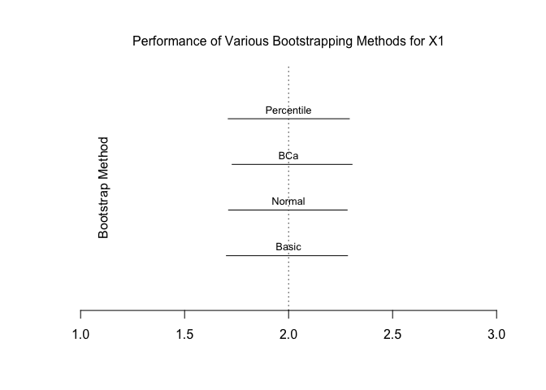
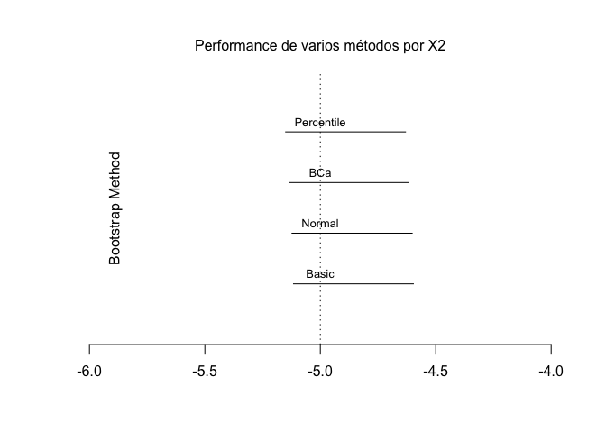
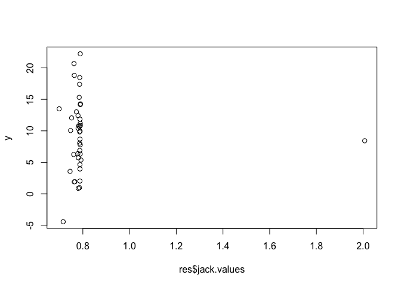

-   [Bootstrap](#bootstrap)
    -   [El Principio Bootstrap](#el-principio-bootstrap)
    -   [Tipos de bootstrap](#tipos-de-bootstrap)
    -   [Bootstrap para datos i.i.d.](#bootstrap-para-datos-i.i.d.)
    -   [Ejemplo](#ejemplo)
-   [Jacknife](#jacknife)

**Paquetes de esta sección**

    if(!require(boot)){install.packages("boot")}

    ## Loading required package: boot

    if(!require(bootstrap)){install.packages("bootstrap")}

    ## Loading required package: bootstrap

Bootstrap
=========

El Principio Bootstrap
----------------------

> Recrear la relación entre la *población* y la *muestra*, considerando
> la muestra como un epítome de la población subyacente, y por
> remuestreo de ella (adecuadamente), generar la *muestra bootstrap*,
> que sirve como un análogo de la muestra dada.

-   Si el mecanismo de remuestreo se elige apropiadamente, entonces se
    espera que el *remuestreo*, junto con la muestra en cuestión,
    reflejen la relación original entre la población y la muestra.

-   La ventaja es que ahora se puede evitar el problema de tener que
    lidiar con la *población*, y en su lugar, se utilice la *muestra* y
    los *remuestreos*, para abordar cuestiones de inferencia estadística
    con respecto a las cantidades desconocidas de la población.

El principio de bootstrap aborda el problema de no tener un conocimiento
completo de la población, para hacer inferencia acerca del estimador
$\\hat{\\theta}$.

1.  El primer paso consiste en la construcción de un estimador de
    $\\mathcal{F}(\\hat{\\mathcal{F}})$ desde las observaciones
    disponibles *X*1…*X**n*, el cual proporciona
    una imagen representativa de la población.

2.  El siguiente paso consiste en la generación de variables aleatorias
    i.i.d. *X*1\*…*X**n*\*
    del estimador $\\hat{\\mathcal{F}}$ (condicionada a las
    observaciones 𝒳*n*), el cual cumple el rol de la
    *muestra* para la versión bootstrap del problema original.

Por lo tanto, la *versión bootstrap* del estimador $\\hat{\\theta}$
basado en la muestra original *X*1…*X**n* está
dada por $\\hat{\\theta}^{\*}$, obtenido mediante la sustitución de
*X*1…*X**n* por
*X*1\*…*X**n*\*.

Tipos de bootstrap
------------------

-   Paramétrico: Si se supone que ℱ pertenece a un modelo paramétrico
    ℱ*θ* : *θ* ∈ *Θ*, entonces,
    $\\mathcal{F} = \\mathcal{F}\_{\\hat{\\theta}}$, donde
    $\\hat{\\theta}$ es un estimador de *θ*.

-   No paramétrico: Si no se hace ninguna hipótesis sobre ℱ, entonces,
    $\\hat{\\mathcal{F}} = \\hat{\\mathcal{F}}\_{n}$, donde
    $\\hat{\\mathcal{F}}\_{n}$ es la función de distribución empírica.

> Método plug-in: Si se desea estimar una cantidad *θ* = *T*(ℱ), que
> depende de la función de distribución ℱ de los datos, el método
> *plug-in* (o sustitución),
> $$
> \\hat{\\theta} = T(\\hat{\\mathcal{F}\_n});
> $$
>  donde F es sustituido por la función de distribución empírica
> $\\hat{\\mathcal{F}\_n}$.

> Función de distribución empírica ($\\hat{\\mathcal{F}\_n}$): La
> $\\hat{\\mathcal{F}\_n}$ de la m.a.(*n*), asigna probabilidad
> $\\frac{1}{n}$ a cada valor *X**i* con *i* = 1, …, *n*,
> $$
> \\hat{\\mathcal{F}\_n} = \\frac{1}{n}\\sum\_{i = 1}^{n} \\mathbb{I}(X\_i\\leq x\_i)
> $$
>  donde 𝕀 es la función indicatriz.

Bootstrap para datos i.i.d.
---------------------------

-   Desarrollado por Efron (1979), también llamada bootstrap ordinario.
    Sirve para estimar o aproximar la distribución del estadístico y sus
    características.

-   Asume que ℱ es la F.D. de una muestra
    **X***n* = (*X*1…,*X**n*)*T*
    y se quiere estudiar un estadístico
    *T**n* = *t**n*(**X***n*, ℱ) y sus
    características (sesgo, varianza, error estándar, etc.).

-   En el método bootstrap, se va a fabricar versiones bootstrap de
    *T**n* utilizando la misma forma funcional sustituyendo ℱ
    por $\\hat{\\mathcal{F}}\_n$, y la muestra **X***n* por
    muestras con distribución $\\hat{\\mathcal{F}}\_n$ en vez de ℱ.

-   De esta manera a partir de la muestra dada
    **X***n* = (*X*1…,*X**n*)*T*
    , se selecciona una muestra aleatoria simple
    **X***m*\* = (*X*1\*…,*X**m*\*)*T*
    de tamaño *m* con reemplazo de **X***n*, llamada muestra
    bootstrap. Así, son variables aleatorias i.i.d., con distribución
    $\\hat{\\mathcal{F}}\_n$.

Ejemplo
-------

    set.seed(23434)
    x1 <- rnorm(40,0,1)
    x2 <- rnorm(40,0,1)
    y <- 10 + x1*2 - 5*x2 + rnorm(40,0,1)

    reg.1 <- lm(y ~ x1 + x2)
    summary(reg.1)

    ## 
    ## Call:
    ## lm(formula = y ~ x1 + x2)
    ## 
    ## Residuals:
    ##      Min       1Q   Median       3Q      Max 
    ## -1.80172 -0.77731 -0.02077  0.77349  1.67730 
    ## 
    ## Coefficients:
    ##             Estimate Std. Error t value Pr(>|t|)    
    ## (Intercept)  10.0211     0.1589   63.07   <2e-16 ***
    ## x1            1.9965     0.1339   14.91   <2e-16 ***
    ## x2           -4.8735     0.1507  -32.33   <2e-16 ***
    ## ---
    ## Signif. codes:  0 '***' 0.001 '**' 0.01 '*' 0.05 '.' 0.1 ' ' 1
    ## 
    ## Residual standard error: 0.996 on 37 degrees of freedom
    ## Multiple R-squared:  0.9724, Adjusted R-squared:  0.9709 
    ## F-statistic: 652.3 on 2 and 37 DF,  p-value: < 2.2e-16

Ahora usamos el paquete `boot`.

    #install.packages("boot")
    library(boot)

Definimos el conjunto de datos:

    my.data <- as.data.frame(cbind(y,x1,x2))

Intentemos calcular intervalos de confianza del 95%. El paquete
bootstrap funciona escribiendo primero una función para llamar a los
resultados de regresión, luego ejecutando el comando `boot` y luego
analizando los resultados. Llamaremos a nuestro programa para buscar
nuestra estadístico *bootstrap*:

    bootstrap <- function(formula, data, regressors) {
        dat <- data[regressors,]    # obtiene la muestra
        reg <- lm(formula, data = dat) # corre la regresión
        return(coef(reg)) # necesitamos estos coeficientes
    }

Ahora ejecutamos un gran número de repeticiones (normalmente 1000 o más)
en nuestra regresión con `my.data, y obtenemos el estadístico`boot\`
escrita anteriormente

    bs.res <- boot(R = 1000, formula = y~x1 + x2 , data = my.data, statistic = bootstrap)
    print(bs.res)  # nota que todo se graba

    ## 
    ## ORDINARY NONPARAMETRIC BOOTSTRAP
    ## 
    ## 
    ## Call:
    ## boot(data = my.data, statistic = bootstrap, R = 1000, formula = y ~ 
    ##     x1 + x2)
    ## 
    ## 
    ## Bootstrap Statistics :
    ##      original        bias    std. error
    ## t1* 10.021085 -9.421023e-03   0.1571571
    ## t2*  1.996487 -5.075856e-06   0.1455193
    ## t3* -4.873461 -1.117615e-02   0.1328371

Con la función `boot.ci`, podemos llamar a 5 tipos diferentes de salidas
de intervalo de confianza para usar. A continuación se presentan cuatro
de ellos. Tenga en cuenta que llamaré al índice de los resultados:

    bs.res$t0 # index

    ## (Intercept)          x1          x2 
    ##   10.021085    1.996487   -4.873461

**Bootstrap básico**

    bs.basic.x1 <- boot.ci(bs.res, type = "basic", index = 2) # 95% para la variable x1
    bs.basic.x1

    ## BOOTSTRAP CONFIDENCE INTERVAL CALCULATIONS
    ## Based on 1000 bootstrap replicates
    ## 
    ## CALL : 
    ## boot.ci(boot.out = bs.res, type = "basic", index = 2)
    ## 
    ## Intervals : 
    ## Level      Basic         
    ## 95%   ( 1.701,  2.283 )  
    ## Calculations and Intervals on Original Scale

    bs.basic.x2 <- boot.ci(bs.res, type = "basic", index = 3) # 95% para la variable x2
    bs.basic.x2

    ## BOOTSTRAP CONFIDENCE INTERVAL CALCULATIONS
    ## Based on 1000 bootstrap replicates
    ## 
    ## CALL : 
    ## boot.ci(boot.out = bs.res, type = "basic", index = 3)
    ## 
    ## Intervals : 
    ## Level      Basic         
    ## 95%   (-5.116, -4.597 )  
    ## Calculations and Intervals on Original Scale

**Percentiles bootstrap (BCa)**

    bs.bca.x1 <- boot.ci(bs.res, type = "bca", index = 2)
    bs.bca.x1

    ## BOOTSTRAP CONFIDENCE INTERVAL CALCULATIONS
    ## Based on 1000 bootstrap replicates
    ## 
    ## CALL : 
    ## boot.ci(boot.out = bs.res, type = "bca", index = 2)
    ## 
    ## Intervals : 
    ## Level       BCa          
    ## 95%   ( 1.728,  2.305 )  
    ## Calculations and Intervals on Original Scale

    bs.bca.x2 <- boot.ci(bs.res, type = "bca", index = 3)
    bs.bca.x2

    ## BOOTSTRAP CONFIDENCE INTERVAL CALCULATIONS
    ## Based on 1000 bootstrap replicates
    ## 
    ## CALL : 
    ## boot.ci(boot.out = bs.res, type = "bca", index = 3)
    ## 
    ## Intervals : 
    ## Level       BCa          
    ## 95%   (-5.134, -4.618 )  
    ## Calculations and Intervals on Original Scale

    bs.bca.x2 <- boot.ci(bs.res, type = "bca", index = 3)
    bs.bca.x2

    ## BOOTSTRAP CONFIDENCE INTERVAL CALCULATIONS
    ## Based on 1000 bootstrap replicates
    ## 
    ## CALL : 
    ## boot.ci(boot.out = bs.res, type = "bca", index = 3)
    ## 
    ## Intervals : 
    ## Level       BCa          
    ## 95%   (-5.134, -4.618 )  
    ## Calculations and Intervals on Original Scale

**Normal**

    bs.norm.x1 <- boot.ci(bs.res, type = "norm", index = 2)
    bs.norm.x1

    ## BOOTSTRAP CONFIDENCE INTERVAL CALCULATIONS
    ## Based on 1000 bootstrap replicates
    ## 
    ## CALL : 
    ## boot.ci(boot.out = bs.res, type = "norm", index = 2)
    ## 
    ## Intervals : 
    ## Level      Normal        
    ## 95%   ( 1.711,  2.282 )  
    ## Calculations and Intervals on Original Scale

    bs.norm.x2 <- boot.ci(bs.res, type = "norm", index = 3)
    bs.norm.x2

    ## BOOTSTRAP CONFIDENCE INTERVAL CALCULATIONS
    ## Based on 1000 bootstrap replicates
    ## 
    ## CALL : 
    ## boot.ci(boot.out = bs.res, type = "norm", index = 3)
    ## 
    ## Intervals : 
    ## Level      Normal        
    ## 95%   (-5.123, -4.602 )  
    ## Calculations and Intervals on Original Scale

**Intervalos de percentiles**

    bs.perc.x1 <- boot.ci(bs.res, type = "perc", index = 2)
    bs.perc.x1

    ## BOOTSTRAP CONFIDENCE INTERVAL CALCULATIONS
    ## Based on 1000 bootstrap replicates
    ## 
    ## CALL : 
    ## boot.ci(boot.out = bs.res, type = "perc", index = 2)
    ## 
    ## Intervals : 
    ## Level     Percentile     
    ## 95%   ( 1.710,  2.292 )  
    ## Calculations and Intervals on Original Scale

    bs.perc.x2 <- boot.ci(bs.res, type = "perc", index = 3)
    bs.perc.x2

    ## BOOTSTRAP CONFIDENCE INTERVAL CALCULATIONS
    ## Based on 1000 bootstrap replicates
    ## 
    ## CALL : 
    ## boot.ci(boot.out = bs.res, type = "perc", index = 3)
    ## 
    ## Intervals : 
    ## Level     Percentile     
    ## 95%   (-5.150, -4.631 )  
    ## Calculations and Intervals on Original Scale

Vamos a trazar estos diversos intervalos de confianza para ver cómo
difieren. Tenga en cuenta que estoy extrayendo los CI superiores e
inferiores de la llamada al método *b**s*.*m**e**t**h**o**d*.*x*1. ¡Es
un dolor, ya que la ubicación de ul y II DIFIERE a través de los
métodos!

Para *X*1

    plot(NULL, type = "l", xlim = c(1,3),ylim = c(0,5), ylab = NA, axes = FALSE, xlab = NA)
      lines(c(bs.basic.x1$basic[4], bs.basic.x1$basic[5]), c(1,1))  # añadimos nivel de cnfianza
        text(2, 1.2, "Basic", xpd = T, cex = .8)     #añadimos nombres
        
        lines(c(bs.norm.x1$norm[2], bs.norm.x1$norm[3]), c(2,2))
        
        text(2, 2.2, "Normal", xpd = T, cex = .8)
      
        lines(c(bs.bca.x1$bca[4], bs.bca.x1$bca[5]), c(3,3))
        
        text(2, 3.2, "BCa", xpd = T, cex = .8)
        
        lines(c(bs.perc.x1$perc[4], bs.perc.x1$perc[5]), c(4,4))
        
        text(2, 4.2, "Percentile", xpd = T, cex = .8)
        
        abline(v = 2.0, lty = 3, col = "black") #  añado
        
        axis(side = 1)  # add x axis
        
        mtext(side = 2, "Bootstrap Method", line = -3)    # label side
        
        mtext(side = 3, "Performance of Various Bootstrapping Methods for X1", line = 1)   # añadimos titulo

**Para *X*2**

    bs.basic.x2 <- boot.ci(bs.res, type = "basic", index = 3) # 95% for variable x2
    bs.basic.x2

    ## BOOTSTRAP CONFIDENCE INTERVAL CALCULATIONS
    ## Based on 1000 bootstrap replicates
    ## 
    ## CALL : 
    ## boot.ci(boot.out = bs.res, type = "basic", index = 3)
    ## 
    ## Intervals : 
    ## Level      Basic         
    ## 95%   (-5.116, -4.597 )  
    ## Calculations and Intervals on Original Scale

    plot(NULL, type = "l", xlim = c(-6,-4),ylim = c(0,5), ylab = NA, axes = FALSE, xlab = NA)
    lines(c(bs.basic.x2$basic[4], bs.basic.x2$basic[5]), c(1,1))  # add the 95% confidence intervals
    text(-5, 1.2, "Basic", xpd = T, cex = .8)     # add the names
    lines(c(bs.norm.x2$norm[2], bs.norm.x2$norm[3]), c(2,2))
    text(-5, 2.2, "Normal", xpd = T, cex = .8)
    lines(c(bs.bca.x2$bca[4], bs.bca.x2$bca[5]), c(3,3))
    text(-5, 3.2, "BCa", xpd = T, cex = .8)
    lines(c(bs.perc.x2$perc[4], bs.perc.x2$perc[5]), c(4,4))
    text(-5, 4.2, "Percentile", xpd = T, cex = .8)
    abline(v = -5.0, lty = 3, col = "black") #  añada vertial
    axis(side = 1)  # add x axis
    mtext(side = 2, "Bootstrap Method", line = -3)    # tamaño de etiqueta
    mtext(side = 3, "Performance de varios métodos por X2", line = 1)   # add a title

Al menos en este ejemplo, los intervalos de confianza parecen ser muy
similares en el tipo de método BOOT.

Jacknife
========

Jackknifing puede ser útil para analizar si las observaciones
influyentes están afectando nuestras estimaciones. Funciona mediante el
uso de un proceso de iteración dejar-uno-fuera. Primera carga en la
librería bootstrap:

Para usar la función jackknife, necesitamos tener un vector que
seleccionemos de los datos, así como también alguna función "theta" a la
que especificamos a la que llama esta función.

Para mostrar esto el cuchillo de caza en acción, vamos a reemplazar una
observación con un valor atípico grande:

    x1[10] <- 10 # reemplaz el 10th x1 observación con 10
    my.data <- as.data.frame(cbind(y,x1,x2))

    plot(y,x1)

Tenga en cuenta la forma atípica en la parte superior de la
distribución.

    reg.jack <- lm(y ~ x1 + x2)
    summary(reg.jack)

    ## 
    ## Call:
    ## lm(formula = y ~ x1 + x2)
    ## 
    ## Residuals:
    ##     Min      1Q  Median      3Q     Max 
    ## -6.6224 -0.9929 -0.0083  1.2703  5.1754 
    ## 
    ## Coefficients:
    ##             Estimate Std. Error t value Pr(>|t|)    
    ## (Intercept)   9.8528     0.3364  29.287  < 2e-16 ***
    ## x1            0.7877     0.1697   4.642 4.23e-05 ***
    ## x2           -4.9889     0.3171 -15.734  < 2e-16 ***
    ## ---
    ## Signif. codes:  0 '***' 0.001 '**' 0.01 '*' 0.05 '.' 0.1 ' ' 1
    ## 
    ## Residual standard error: 2.096 on 37 degrees of freedom
    ## Multiple R-squared:  0.8779, Adjusted R-squared:  0.8713 
    ## F-statistic:   133 on 2 and 37 DF,  p-value: < 2.2e-16

Observe cuánto ha cambiado nuestra estimación del coeficiente (era ∼ 2,
ahora ∼ 0.8). Así que es bastante claro que este extremo atípico está
alterando drásticamente nuestros resultados.

Para Jackknife, primero creamos la función theta. especificamos los
datos, el coeficiente y el coeficiente de no entrada, que nos gustaría

    theta <- function(x, dat, coefficient){
        coef(lm(reg.jack , data = dat[x,]))[coefficient] }

Luego ejecuta el jackknife, usando el programa theta, para obtener el x1
coeff.

    library(bootstrap)
    res <- jackknife(1:length(x1), theta, dat = my.data, coefficient = "x1")

    print(res)

    ## $jack.se
    ## [1] 1.206817
    ## 
    ## $jack.bias
    ##        x1 
    ## 0.7376129 
    ## 
    ## $jack.values
    ##  [1] 0.7476185 0.7887048 0.7889221 0.7875193 0.7452521 0.7860689 0.7876873
    ##  [8] 0.7621247 0.7890683 2.0069654 0.7885327 0.7860024 0.7725170 0.7877010
    ## [15] 0.7804501 0.7843675 0.7876708 0.7870409 0.6987357 0.7875269 0.7632969
    ## [22] 0.7881386 0.7792951 0.7868219 0.7655709 0.7853704 0.7519223 0.7823062
    ## [29] 0.7888674 0.7862499 0.7917846 0.7609885 0.7797582 0.7892338 0.7785516
    ## [36] 0.7631919 0.7808075 0.7158900 0.7896992 0.7862236
    ## 
    ## $call
    ## jackknife(x = 1:length(x1), theta = theta, dat = my.data, coefficient = "x1")

Si llamamos `res`, obtenemos una salida del jackknifed, es decir, el
sesgo, así como los valores para cada observación individual:

    res

    ## $jack.se
    ## [1] 1.206817
    ## 
    ## $jack.bias
    ##        x1 
    ## 0.7376129 
    ## 
    ## $jack.values
    ##  [1] 0.7476185 0.7887048 0.7889221 0.7875193 0.7452521 0.7860689 0.7876873
    ##  [8] 0.7621247 0.7890683 2.0069654 0.7885327 0.7860024 0.7725170 0.7877010
    ## [15] 0.7804501 0.7843675 0.7876708 0.7870409 0.6987357 0.7875269 0.7632969
    ## [22] 0.7881386 0.7792951 0.7868219 0.7655709 0.7853704 0.7519223 0.7823062
    ## [29] 0.7888674 0.7862499 0.7917846 0.7609885 0.7797582 0.7892338 0.7785516
    ## [36] 0.7631919 0.7808075 0.7158900 0.7896992 0.7862236
    ## 
    ## $call
    ## jackknife(x = 1:length(x1), theta = theta, dat = my.data, coefficient = "x1")

Note la observación en 10. Esto es más fácil si lo graficamos:

    plot(res$jack.values,y)

Aunque ´Jackknife´ podría considerarse más intuitivo, es un método más
antiguo, más fácil (en el poder de la computación) que abarca el
arranque. Probablemente se debe usar el programa de arranque, aunque el
navaja es bueno para examinar esos valores atípicos.
