-   [Puntos de influencia](#puntos-de-influencia)
    -   [Distinción entre los valores atípicos y las observaciones de
        alto
        apalancamiento](#distincion-entre-los-valores-atipicos-y-las-observaciones-de-alto-apalancamiento)
        -   [Ejemplo 1](#ejemplo-1)
        -   [Ejemplo 2](#ejemplo-2)
        -   [Ejemplo 3](#ejemplo-3)
        -   [Ejemplo 4](#ejemplo-4)
        -   [Resumen](#resumen)
-   [Regresión Robusta](#regresion-robusta)
    -   [Introducción](#introduccion)
        -   [Ejemplo](#ejemplo)
    -   [Más estimaciones Robustas](#mas-estimaciones-robustas)
        -   [Regresión robusta simple](#regresion-robusta-simple)
        -   [Regresión robusta múltiple](#regresion-robusta-multiple)
-   [Estrategia para tratar datos
    problemáticos](#estrategia-para-tratar-datos-problematicos)
-   [Referencias](#referencias)

Puntos de influencia
====================

Vamos a aprender cómo las observaciones de datos pueden influir
potencialmente de diferentes maneras.

Si una observación tiene un *valor de respuesta que es muy diferente del
valor predicho en base a un modelo*, entonces esa observación se llama
un **valor atípico**.

Por otro lado, si una observación tiene una combinación particularmente
inusual de valores de predictores (por ejemplo, un predictor tiene un
valor muy diferente para esa observación en comparación con todas las
otras observaciones de datos), se dice que esa observación tiene un alto
*leverage*.

Por lo tanto, hay una distinción entre los valores atípicos y las
observaciones de alto *leverage*, y cada una puede impactar nuestros
análisis de regresión de manera diferente.

También es posible que una observación sea un valor atípico y un alto
*leverage* Por lo tanto, es importante saber cómo detectar valores
atípicos y puntos de datos de alto *leverage*.

Una vez que hemos identificado puntos atípicos y/o puntos de datos de
alto *leverage*, debemos determinar si los puntos realmente tienen una
influencia indebida en nuestro modelo. Esta lección aborda todos estos
problemas utilizando las siguientes medidas:

-   *leverages*
-   residuos
-   residuos *studentized * (algunos softwares lo denomina residuos
    estandarizados)
-   Residuos eliminados (no estandarizados) (o errores de predicción de
    PRESS)
-   residuos de student eliminados

Distinción entre los valores atípicos y las observaciones de alto apalancamiento
--------------------------------------------------------------------------------

-   Un valor atípico es un punto de datos cuya respuesta y no sigue la
    tendencia general del resto de los datos.

-   Un punto de datos tiene un alto leverage si tiene valores de
    predictor *x* *extremos*.
    -   Con un solo predictor, un valor x extremo es simplemente uno que es particularmente alto o bajo. 

    -   Con múltiples predictores, los valores extremos de $x$ pueden ser particularmente altos o bajos para uno o más predictores, o pueden ser combinaciones "inusuales" de valores de predictores (por ejemplo, con dos predictores que están correlacionados positivamente, una combinación inusual de valores de predictores podría ser una alta valor de un predictor emparejado con un valor bajo del otro predictor).

Ten en cuenta que, para nuestros propósitos, **consideramos que un punto
de datos es un valor atípico solo si es extremo con respecto a los otros
valores de *y*, no los valores de *x***.

Un punto de datos es influyente si influye indebidamente en cualquier
parte de un análisis de regresión, como las respuestas pronosticadas,
los coeficientes de pendiente estimados o los resultados de la prueba de
hipótesis.

Los valores atípicos y los puntos de datos de alto leverage tienen el
potencial de ser influyentes, pero generalmente tenemos que investigar
más para determinar **si son o no realmente influyentes**.

Una ventaja del caso en el que solo tenemos un predictor es que podemos
ver gráficos de dispersión simples para identificar cualquier valor
atípico y puntos de datos influyentes. Veamos algunos ejemplos que
deberían ayudar a aclarar la distinción entre los dos tipos de valores
extremos.

### Ejemplo 1

Según las definiciones anteriores, ¿cree que el siguiente conjunto de
datos contiene valores atípicos? ¿O, cualquier punto de datos de alto
leverage?

    Input <- (
      "
    Row x   y
    1   0.1 -0.0716
    2   0.45401 4.1673
    3   1.09765 6.5703
    4   1.27936 13.815
    5   2.20611 11.4501
    6   2.50064 12.9554
    7   3.0403  20.1575
    8   3.23583 17.5633
    9   4.45308 26.0317
    10  4.1699  22.7573
    11  5.28474 26.303
    12  5.59238 30.6885
    13  5.92091 33.9402
    14  6.66066 30.9228
    15  6.79953 34.11
    16  7.97943 44.4536
    17  8.41536 46.5022
    18  8.71607 50.0568
    19  8.70156 46.5475
    20  9.16463 45.7762
      "
    )
    d1 = read.table(textConnection(Input),header=TRUE)
    d1 <- d1[,-1]
    plot(d1)

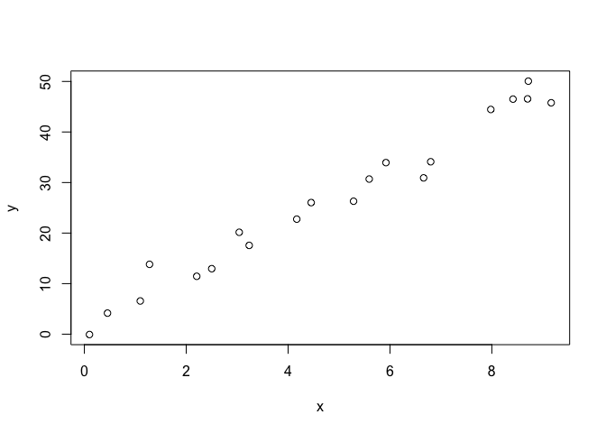

¡Exacto! Todos los puntos de datos **siguen la tendencia general del
resto de los datos**, por lo que **no hay valores atípicos** (en la
dirección *y*). Y, ninguno de los puntos de datos es extremo con
respecto a *x*, por lo que no hay puntos de alto leverage. En general,
ninguno de los puntos de datos parece ser influyente con respecto a la
ubicación de la línea de mejor ajuste

### Ejemplo 2

Ahora, ¿qué hay de este ejemplo? ¿Cree que el siguiente conjunto de
datos contiene algún valor atípico? ¿O, cualquier punto de datos de alto
leverage?

    Input <- (
      "
    Row x   y
    1   0.1 -0.0716
    2   0.45401 4.1673
    3   1.09765 6.5703
    4   1.27936 13.815
    5   2.20611 11.4501
    6   2.50064 12.9554
    7   3.0403  20.1575
    8   3.23583 17.5633
    9   4.45308 26.0317
    10  4.1699  22.7573
    11  5.28474 26.303
    12  5.59238 30.6885
    13  5.92091 33.9402
    14  6.66066 30.9228
    15  6.79953 34.11
    16  7.97943 44.4536
    17  8.41536 46.5022
    18  8.71607 50.0568
    19  8.70156 46.5475
    20  9.16463 45.7762
    21  4   40  
      "
    )
    d2 = read.table(textConnection(Input),header=TRUE)
    d2 <- d2[,-1]
    plot(d2)
    points(d2[21,],col = "red")

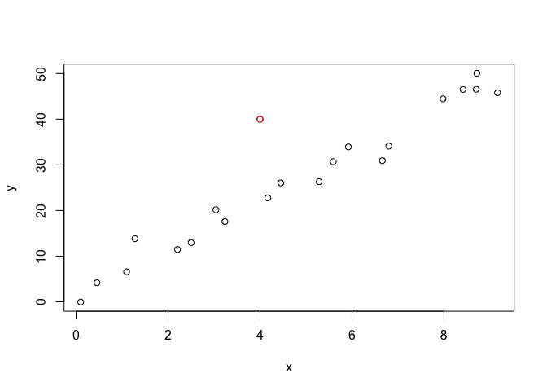

¡Por supuesto! Debido a que el punto de datos rojo no sigue la tendencia
general del resto de los datos, se consideraría un valor atípico.

Sin embargo, este punto no tiene un valor *x* extremo, por lo que no
tiene un alto leverage.

¿Es el punto de datos rojo influyente? Una forma fácil de determinar si
el punto de datos es influyente es encontrar la mejor línea de ajuste
dos veces: una vez con el punto de datos rojo incluido y una vez con el
punto de datos rojo excluido.

La siguiente gráfica ilustra las dos mejores líneas de ajuste:

    pp <- 21

    m1 <- lm(y~x,data = d2)
    m2 <- lm(y~x,data = d2[-pp,])

    plot(d2)
    abline(coef(m1),col = "red")
    abline(coef(m2),col = "blue")

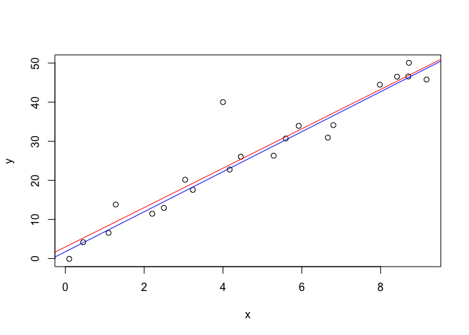

    summary(m1)

    ## 
    ## Call:
    ## lm(formula = y ~ x, data = d2)
    ## 
    ## Residuals:
    ##    Min     1Q Median     3Q    Max 
    ## -5.587 -2.620 -1.077  1.157 16.893 
    ## 
    ## Coefficients:
    ##             Estimate Std. Error t value Pr(>|t|)    
    ## (Intercept)   2.9576     2.0091   1.472    0.157    
    ## x             5.0373     0.3633  13.865 2.18e-11 ***
    ## ---
    ## Signif. codes:  0 '***' 0.001 '**' 0.01 '*' 0.05 '.' 0.1 ' ' 1
    ## 
    ## Residual standard error: 4.711 on 19 degrees of freedom
    ## Multiple R-squared:  0.9101, Adjusted R-squared:  0.9053 
    ## F-statistic: 192.2 on 1 and 19 DF,  p-value: 2.179e-11

    summary(m2)

    ## 
    ## Call:
    ## lm(formula = y ~ x, data = d2[-pp, ])
    ## 
    ## Residuals:
    ##     Min      1Q  Median      3Q     Max 
    ## -4.8911 -1.7580 -0.0998  1.7552  5.5365 
    ## 
    ## Coefficients:
    ##             Estimate Std. Error t value Pr(>|t|)    
    ## (Intercept)   1.7322     1.1205   1.546     0.14    
    ## x             5.1169     0.2003  25.551 1.35e-15 ***
    ## ---
    ## Signif. codes:  0 '***' 0.001 '**' 0.01 '*' 0.05 '.' 0.1 ' ' 1
    ## 
    ## Residual standard error: 2.592 on 18 degrees of freedom
    ## Multiple R-squared:  0.9732, Adjusted R-squared:  0.9717 
    ## F-statistic: 652.8 on 1 and 18 DF,  p-value: 1.353e-15

Aún es difícil decir si hay puntos influyentes, o si estamos frente a un
outlier.

Evaluemos los resultados:

-   El valor de *R*2 ha disminuido ligeramente, pero la
    relación entre *y* y *x* todavía se consideraría fuerte.

-   El error estándar de *b*1, que se utiliza para calcular
    nuestro intervalo de confianza para *β*1, es mayor cuando
    se incluye el punto de datos rojo, lo que aumenta el ancho de
    nuestro intervalo de confianza. Puede recordar que el error estándar
    de *b*1 depende de la media cuadrada de error MSE, que
    cuantifica la diferencia entre las respuestas observadas y
    pronosticadas. Debido a que el punto de datos rojo es un valor
    atípico, en la dirección *y*, aumenta el error estándar de
    *b*1, no porque el punto de datos sea influyente de
    ninguna manera.

-   En cada caso, el valor p para la prueba
    *H*0 : *β*1 = 0 es menor que 0.001. En
    cualquier caso, podemos concluir que hay evidencia suficiente en el
    nivel de 0.05 para concluir que, en la población, *x* está
    relacionada con *y*.

En resumen, las respuestas pronosticadas, los coeficientes de pendiente
estimados y los resultados de las pruebas de hipótesis no se ven
afectados por la inclusión del punto de datos rojo. Por lo tanto, el
punto de datos no se considera influyente. **En resumen, el punto de
datos rojo no es influyente y no tiene un alto apalancamiento, pero es
un valor atípico**.

### Ejemplo 3

Ahora, ¿qué hay de este ejemplo? ¿Crees que el siguiente conjunto de
datos contiene algún valor atípico? ¿O, cualquier punto de datos de alto
leverage?

    Input <- (
      "
    Row x   y
    1   0.1 -0.0716
    2   0.45401 4.1673
    3   1.09765 6.5703
    4   1.27936 13.815
    5   2.20611 11.4501
    6   2.50064 12.9554
    7   3.0403  20.1575
    8   3.23583 17.5633
    9   4.45308 26.0317
    10  4.1699  22.7573
    11  5.28474 26.303
    12  5.59238 30.6885
    13  5.92091 33.9402
    14  6.66066 30.9228
    15  6.79953 34.11
    16  7.97943 44.4536
    17  8.41536 46.5022
    18  8.71607 50.0568
    19  8.70156 46.5475
    20  9.16463 45.7762
    21  14  68
      "
    )
    d3 = read.table(textConnection(Input),header=TRUE)
    d3 <- d3[,-1]
    plot(d3)
    points(d3[21,],col = "red")

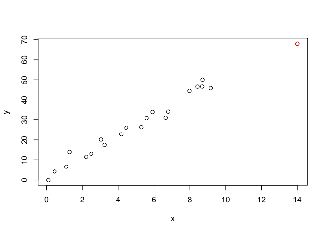

En este caso, el punto de datos rojo sigue la tendencia general del
resto de los datos. Por lo tanto, no se considera un valor atípico aquí.

Sin embargo, este punto tiene un valor *x* extremo, por lo que tiene un
alto leverage ¿Es el punto de datos rojo influyente? Ciertamente, parece
estar muy alejado del resto de los datos (en la dirección *x*), pero ¿es
eso suficiente para hacer que los datos sean influyentes en este caso?

La siguiente gráfica ilustra dos líneas de mejor ajuste: una obtenida
cuando se incluye el punto de datos rojo y otra obtenida cuando se
excluye el punto de datos rojo:

    pp <- 21

    m1 <- lm(y~x,data = d3)
    m2 <- lm(y~x,data = d3[-pp,])

    plot(d3)
    abline(coef(m1),col = "red")
    abline(coef(m2),col = "blue")

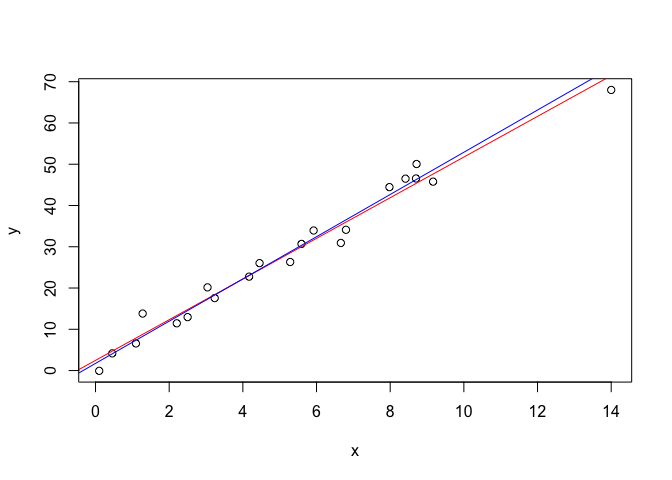

    summary(m1)

    ## 
    ## Call:
    ## lm(formula = y ~ x, data = d3)
    ## 
    ## Residuals:
    ##     Min      1Q  Median      3Q     Max 
    ## -4.3636 -1.8607 -0.5376  2.2987  5.0434 
    ## 
    ## Coefficients:
    ##             Estimate Std. Error t value Pr(>|t|)    
    ## (Intercept)   2.4679     1.0757   2.294   0.0333 *  
    ## x             4.9272     0.1719  28.661   <2e-16 ***
    ## ---
    ## Signif. codes:  0 '***' 0.001 '**' 0.01 '*' 0.05 '.' 0.1 ' ' 1
    ## 
    ## Residual standard error: 2.709 on 19 degrees of freedom
    ## Multiple R-squared:  0.9774, Adjusted R-squared:  0.9762 
    ## F-statistic: 821.4 on 1 and 19 DF,  p-value: < 2.2e-16

    summary(m2)

    ## 
    ## Call:
    ## lm(formula = y ~ x, data = d3[-pp, ])
    ## 
    ## Residuals:
    ##     Min      1Q  Median      3Q     Max 
    ## -4.8911 -1.7580 -0.0998  1.7552  5.5365 
    ## 
    ## Coefficients:
    ##             Estimate Std. Error t value Pr(>|t|)    
    ## (Intercept)   1.7322     1.1205   1.546     0.14    
    ## x             5.1169     0.2003  25.551 1.35e-15 ***
    ## ---
    ## Signif. codes:  0 '***' 0.001 '**' 0.01 '*' 0.05 '.' 0.1 ' ' 1
    ## 
    ## Residual standard error: 2.592 on 18 degrees of freedom
    ## Multiple R-squared:  0.9732, Adjusted R-squared:  0.9717 
    ## F-statistic: 652.8 on 1 and 18 DF,  p-value: 1.353e-15

Evaluemos los resultados:

-   El valor de *R*2 apenas ha cambiado, aumentando solo
    ligeramente de 97.3% a 97.7%. En cualquier caso, la relación entre
    *y* y *x* se considera fuerte.
-   El error estándar de b1 es aproximadamente el mismo en cada caso:
    0.172 cuando se incluye el punto de datos rojo, y 0.200 cuando se
    excluye el punto de datos rojo. Por lo tanto, el ancho de los
    intervalos de confianza para *β*1 no se vería afectado en
    gran medida por la existencia del punto de datos rojo. Puede tomar
    nota de que esto se debe a que el punto de datos no es un MSE
    extremadamente impactante.
-   En cada caso, el valor P para la prueba
    *H*0 : *β*1 = 0 es menor que 0.001. En
    cualquier caso, podemos concluir que hay evidencia suficiente en el
    nivel de 0.05 para concluir que, en la población, *x* está
    relacionada con *y*.

En resumen, las respuestas pronosticadas, los coeficientes de pendiente
estimados y los resultados de las pruebas de hipótesis no se ven
afectados por la inclusión del punto de datos rojo. Por lo tanto, el
punto de datos no se considera influyente. En resumen, **el punto de
datos rojo no es influyente, ni es un valor atípico, pero tiene un alto
apalancamiento**.

### Ejemplo 4

Un último ejemplo! ¿Crees que el siguiente conjunto de datos contiene
algún valor atípico? ¿O, cualquier punto de datos de alto leverage?

    Input <- (
      "
    Row x   y
    1   0.1 -0.0716
    2   0.45401 4.1673
    3   1.09765 6.5703
    4   1.27936 13.815
    5   2.20611 11.4501
    6   2.50064 12.9554
    7   3.0403  20.1575
    8   3.23583 17.5633
    9   4.45308 26.0317
    10  4.1699  22.7573
    11  5.28474 26.303
    12  5.59238 30.6885
    13  5.92091 33.9402
    14  6.66066 30.9228
    15  6.79953 34.11
    16  7.97943 44.4536
    17  8.41536 46.5022
    18  8.71607 50.0568
    19  8.70156 46.5475
    20  9.16463 45.7762
    21  13  15
      "
    )
    d4 = read.table(textConnection(Input),header=TRUE)
    d4 <- d4[,-1]
    plot(d4)
    points(d4[21,],col = "red")

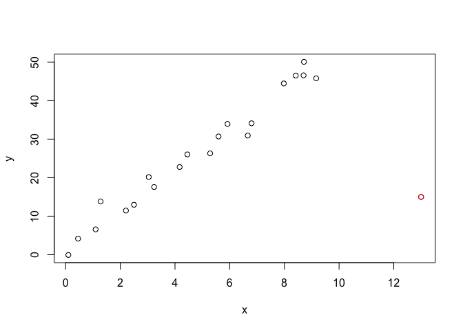

Así es, en este caso, el punto de datos rojo es ciertamente un valor
atípico y tiene un alto leverage.

El punto de datos rojo no sigue la tendencia general del resto de los
datos y también tiene un valor x extremo. Y, en este caso el punto de
datos rojo es influyente.

Las dos líneas de mejor ajuste: una obtenida cuando se incluye el punto
de datos rojo y otra obtenida cuando se excluye el punto de datos rojo:

    pp <- 21

    m1 <- lm(y~x,data = d4)
    m2 <- lm(y~x,data = d4[-pp,])

    plot(d3)
    abline(coef(m1),col = "red")
    abline(coef(m2),col = "blue")

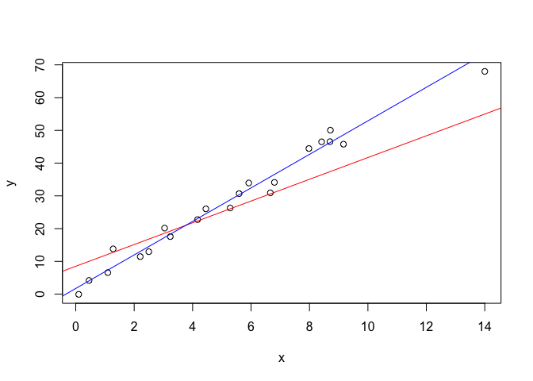

    summary(m1)

    ## 
    ## Call:
    ## lm(formula = y ~ x, data = d4)
    ## 
    ## Residuals:
    ##     Min      1Q  Median      3Q     Max 
    ## -36.662  -3.851   1.063   5.779  12.617 
    ## 
    ## Coefficients:
    ##             Estimate Std. Error t value Pr(>|t|)    
    ## (Intercept)   8.5046     4.2224   2.014 0.058374 .  
    ## x             3.3198     0.6862   4.838 0.000114 ***
    ## ---
    ## Signif. codes:  0 '***' 0.001 '**' 0.01 '*' 0.05 '.' 0.1 ' ' 1
    ## 
    ## Residual standard error: 10.45 on 19 degrees of freedom
    ## Multiple R-squared:  0.5519, Adjusted R-squared:  0.5284 
    ## F-statistic: 23.41 on 1 and 19 DF,  p-value: 0.0001143

    summary(m2)

    ## 
    ## Call:
    ## lm(formula = y ~ x, data = d4[-pp, ])
    ## 
    ## Residuals:
    ##     Min      1Q  Median      3Q     Max 
    ## -4.8911 -1.7580 -0.0998  1.7552  5.5365 
    ## 
    ## Coefficients:
    ##             Estimate Std. Error t value Pr(>|t|)    
    ## (Intercept)   1.7322     1.1205   1.546     0.14    
    ## x             5.1169     0.2003  25.551 1.35e-15 ***
    ## ---
    ## Signif. codes:  0 '***' 0.001 '**' 0.01 '*' 0.05 '.' 0.1 ' ' 1
    ## 
    ## Residual standard error: 2.592 on 18 degrees of freedom
    ## Multiple R-squared:  0.9732, Adjusted R-squared:  0.9717 
    ## F-statistic: 652.8 on 1 and 18 DF,  p-value: 1.353e-15

Evaluemos los resultados:

-   El valor *R*2 ha disminuido sustancialmente de 97.32% a
    55.19%. Si incluimos el punto de datos rojo, concluimos que la
    relación entre *y* y *x* es solo moderadamente fuerte, mientras que
    si excluimos el punto de datos rojo, concluimos que la relación
    entre y y x es muy fuerte.
-   El error estándar de b1 es casi 3.5 veces mayor cuando se incluye el
    punto de datos rojo, que aumenta de 0.200 a 0.686. Este aumento
    tendría un efecto sustancial en el ancho de nuestro intervalo de
    confianza para *β*1. Nuevamente, el aumento se debe a que
    el punto de datos rojo es un valor atípico, en la dirección *y*.
-   En cada caso, el valor P para la prueba
    *H*0 : *β*1 = 0 es menor que 0.001. En ambos
    casos, podemos concluir que existe evidencia suficiente en el nivel
    de 0.05 para concluir que, en la población, x está relacionada
    con y. Tenga en cuenta, sin embargo, que el estadístico t disminuye
    drásticamente de 25.55 a 4.84 al incluir el punto de datos rojo.

Aquí, las respuestas predichas y los coeficientes de pendiente estimados
se ven claramente afectados por la presencia del punto de datos rojo. Si
bien el punto de datos no afectó el significado de la prueba de
hipótesis, el estadístico *t* cambió dramáticamente. En este caso, el
punto de datos rojo se considera un leverage alto y un valor atípico, y
también resultó ser influyente.

### Resumen

Los ejemplos anteriores, a través del uso de gráficos simples, han
resaltado la distinción entre valores atípicos y puntos de datos de alto
apalancamiento.

Hubo valores atípicos en los ejemplos 2 y 4. Hubo puntos de datos de
alto leverage en los ejemplos 3 y 4. Sin embargo, solo en el ejemplo 4
el punto de datos que era tanto un valor atípico como un punto de
apalancamiento alto resultó ser influyente. Es decir, **no todos los
puntos de datos de apalancamiento atípicos o altos influyen de manera
importante en el análisis de regresión**.

Es su trabajo como analista de regresión determinar siempre si su
análisis de regresión está indebidamente influenciado por uno o más
puntos de datos.

Regresión Robusta
=================

La regresión robusta es una alternativa a la regresión de mínimos
cuadrados cuando los datos están contaminados con valores atípicos u
observaciones influyentes, y también se puede utilizar para detectar
observaciones influyentes.

**Paquetes de esta sección**

    if(!require(foreign)){install.packages("foreign")}
    if(!require(robustbase)){install.packages("robustbase")}
    if(!require(MASS)){install.packages("MASS")}
    if(!require(robust)){install.packages("robust")}
    if(!require(quantreg)){install.packages("quantreg")}

Introducción
------------

Comencemos nuestra discusión sobre regresión robusta con algunos
términos en regresión lineal.

-   **Residuos**: la diferencia entre el valor predicho (basado en la
    ecuación de regresión) y el valor real observado.

-   **Outlier**: en regresión lineal, un outlier es una observación con
    un gran residual (error). En otras palabras, es una observación cuyo
    valor de variable dependiente es inusual dado su valor en las
    variables predictoras. Un valor atípico puede indicar una
    peculiaridad de la muestra o puede indicar un error de entrada de
    datos u otro problema.

-   **Apalancamiento** (leverage): una observación con un valor extremo
    en una variable predictiva es un punto con alto apalancamiento. El
    *leverage* es una medida de cuánto se desvía una variable
    independiente de su media. Los puntos de alto *leverage* pueden
    tener una gran efecto en la estimación de los coeficientes de
    regresión.

-   **Influencia**: se dice que una observación es influyente si la
    eliminación de la observación cambia sustancialmente la estimación
    de los coeficientes de regresión. Se puede pensar en la influencia
    como el producto del *leverage* y el valor atípico.

-   **Distancia de Cook (o D de Cook)**: una medida que combina la
    información de *leverage* y el residuo de la observación.

La regresión robusta se puede utilizar en cualquier **situación en la
que usaría la regresión de mínimos cuadrados**. Al ajustar una regresión
de mínimos cuadrados, es posible que encontremos algunos valores
atípicos o puntos de datos de alto *leverage*.

Hemos decidido que estos puntos de datos **no son errores de entrada de
datos, ni de una población diferente a la mayoría de nuestros datos**.
Por lo tanto, no tenemos ninguna razón convincente para excluirlos del
análisis.

La regresión robusta puede ser una buena estrategia, ya que es un
**compromiso entre la exclusión de estos puntos por completo del
análisis y la inclusión de todos los puntos** de datos y el tratamiento
de todos ellos por igual en la regresión OLS.

La idea de una regresión robusta es **sopesar las observaciones de
manera diferente según el comportamiento de estas observaciones**. En
términos generales, es una forma de regresión de mínimos cuadrados
ponderada y re-ponderada.

El comando `rlm` en el comando del paquete `MASS` implementa varias
versiones de regresión robusta. En esta sección, mostraremos la
estimación *M* con ponderación de Huber y bisquare. Estos dos son muy
estándar.

La estimación *M* define una función de ponderación tal que la ecuación
de estimación se convierte en

$$
\\sum\_{i = 1}^nw\_i(y\_i-x'b)x\_i'=0.
$$

Pero los pesos dependen de los residuos y los residuos de los pesos. La
ecuación se resuelve utilizando los **mínimos cuadrados reponderados
iterativamente** (*Iteratively Reweighted Least Squares - IRLS*).

Por ejemplo, la matriz de coeficientes en la iteración *j* es

*B**j* = \[*X*′*W**j* − 1*X*\]−1*X*′*W**j* − 1*Y*

donde **los subíndices indican la matriz en una iteración particular (no
filas o columnas)**. El proceso continúa hasta que converge.

En la ponderación de Huber, las observaciones con pequeños residuos
obtienen un peso de 1 y cuanto mayor sea el residuo, menor será el peso.
Esto se define por la función de peso

$$
w(e) =
\\left\\{
\\begin{array}{rl}
1 \\quad \\mbox{for} \\quad |e| \\leq k \\\\ \\dfrac{k}{|e|} \\quad \\mbox{for} \\quad |e| &gt; k \\\\
\\end{array}
\\right.
$$

Con la ponderación *bisquare*, todos los casos con un residuo distinto
de cero se reducen al menos un poco.

### Ejemplo

Para nuestro análisis de datos utilizaremos el conjunto de datos de
delitos que aparece en *Statistical Methods for Social Sciences*,
Tercera edición de Alan Agresti y Barbara Finlay (Prentice Hall, 1997).

Las variables son

-   identificación del estado (`sid`),
-   nombre del estado (`state`),
-   delitos violentos por 100,000 personas (`crime`),
-   asesinatos por 1,000,000 (`murder`),
-   el porcentaje de la población que vive en áreas metropolitanas
    (`pctmetro`),
-   el porcentaje de la población que es blanco (`pctwhite`),
-   porcentaje de la población con educación secundaria o superior
    (`pcths`),
-   porcentaje de la población que vive bajo la línea de pobreza
    (`poverty`) y  
-   porcentaje de la población que son padres solteros (`single`).

Tiene 51 observaciones. Vamos a utilizar la `poverty` y `single` para
predecir el `crime`.

    cdata <- read.dta("https://stats.idre.ucla.edu/stat/data/crime.dta")
    summary(cdata)

    ##       sid          state               crime            murder      
    ##  Min.   : 1.0   Length:51          Min.   :  82.0   Min.   : 1.600  
    ##  1st Qu.:13.5   Class :character   1st Qu.: 326.5   1st Qu.: 3.900  
    ##  Median :26.0   Mode  :character   Median : 515.0   Median : 6.800  
    ##  Mean   :26.0                      Mean   : 612.8   Mean   : 8.727  
    ##  3rd Qu.:38.5                      3rd Qu.: 773.0   3rd Qu.:10.350  
    ##  Max.   :51.0                      Max.   :2922.0   Max.   :78.500  
    ##     pctmetro         pctwhite         pcths          poverty     
    ##  Min.   : 24.00   Min.   :31.80   Min.   :64.30   Min.   : 8.00  
    ##  1st Qu.: 49.55   1st Qu.:79.35   1st Qu.:73.50   1st Qu.:10.70  
    ##  Median : 69.80   Median :87.60   Median :76.70   Median :13.10  
    ##  Mean   : 67.39   Mean   :84.12   Mean   :76.22   Mean   :14.26  
    ##  3rd Qu.: 83.95   3rd Qu.:92.60   3rd Qu.:80.10   3rd Qu.:17.40  
    ##  Max.   :100.00   Max.   :98.50   Max.   :86.60   Max.   :26.40  
    ##      single     
    ##  Min.   : 8.40  
    ##  1st Qu.:10.05  
    ##  Median :10.90  
    ##  Mean   :11.33  
    ##  3rd Qu.:12.05  
    ##  Max.   :22.10

En la mayoría de los casos, comenzamos ejecutando una regresión OLS y
realizando algunos diagnósticos. Comenzaremos ejecutando una regresión
OLS y observando diagramas de diagnóstico que examinan los residuos, los
valores ajustados, la distancia de Cook y el *leverage*.

    summary(ols <- lm(crime ~ poverty + single, data = cdata))

    ## 
    ## Call:
    ## lm(formula = crime ~ poverty + single, data = cdata)
    ## 
    ## Residuals:
    ##     Min      1Q  Median      3Q     Max 
    ## -811.14 -114.27  -22.44  121.86  689.82 
    ## 
    ## Coefficients:
    ##              Estimate Std. Error t value Pr(>|t|)    
    ## (Intercept) -1368.189    187.205  -7.308 2.48e-09 ***
    ## poverty         6.787      8.989   0.755    0.454    
    ## single        166.373     19.423   8.566 3.12e-11 ***
    ## ---
    ## Signif. codes:  0 '***' 0.001 '**' 0.01 '*' 0.05 '.' 0.1 ' ' 1
    ## 
    ## Residual standard error: 243.6 on 48 degrees of freedom
    ## Multiple R-squared:  0.7072, Adjusted R-squared:  0.695 
    ## F-statistic: 57.96 on 2 and 48 DF,  p-value: 1.578e-13

    opar <- par(mfrow = c(2,2), oma = c(0, 0, 1.1, 0))
    plot(ols, las = 1)

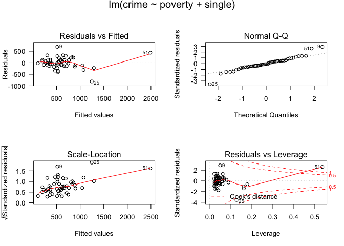

    par(opar)

A partir de estos gráficos, podemos identificar las observaciones 9, 25
y 51 como posiblemente problemáticas para nuestro modelo. Podemos
observar estas observaciones para ver qué estados representan.

    cdata[c(9, 25, 51), 1:2]

DC, Florida y Mississippi tienen un alto *leverage* o grandes residuos.
Podemos mostrar las observaciones que tienen valores relativamente
grandes de la D de Cook. Un punto de corte convencional es 4/*n*, donde
*n* es el número de observaciones en el conjunto de datos. Usaremos este
criterio para seleccionar los valores a mostrar.

    d1 <- cooks.distance(ols)
    r <- stdres(ols)
    a <- cbind(cdata, d1, r)
    a[d1 > 4/51, ]

Probablemente deberíamos eliminar DC, ya que ni siquiera es un estado.
Lo incluimos en el análisis solo para mostrar que tiene una gran D de
Cook y demostrar cómo lo manejará `rlm`.

Ahora vamos a ver los residuos. Generaremos una nueva variable llamada
`absr1`, que es el valor absoluto de los residuos (porque el signo del
residuo no importa). Luego imprimimos las diez observaciones con los
valores residuales absolutos más altos.

    rabs <- abs(r)
    a <- cbind(cdata, d1, r, rabs)
    asorted <- a[order(-rabs), ]
    asorted[1:10, ]

Ahora vamos a correr nuestra primera regresión robusta. La regresión
robusta se realiza por mínimos cuadrados re-ponderados iterados (IRLS).
El comando para ejecutar una regresión robusta es `rlm` en el paquete
`MASS`.

Hay varias funciones de ponderación que se pueden utilizar para IRLS.
Primero vamos a utilizar los pesos de Huber en este ejemplo. Luego
veremos los pesos finales creados por el proceso IRLS. Esto puede ser
muy útil.

    summary(rr.huber <- rlm(crime ~ poverty + single, data = cdata))

    ## 
    ## Call: rlm(formula = crime ~ poverty + single, data = cdata)
    ## Residuals:
    ##     Min      1Q  Median      3Q     Max 
    ## -846.09 -125.80  -16.49  119.15  679.94 
    ## 
    ## Coefficients:
    ##             Value      Std. Error t value   
    ## (Intercept) -1423.0373   167.5899    -8.4912
    ## poverty         8.8677     8.0467     1.1020
    ## single        168.9858    17.3878     9.7186
    ## 
    ## Residual standard error: 181.8 on 48 degrees of freedom

    hweights <- data.frame(state = cdata$state, resid = rr.huber$resid, weight = rr.huber$w)
    hweights2 <- hweights[order(rr.huber$w), ]
    hweights2[1:15, ]

Podemos ver que aproximadamente, a medida que disminuye el residuo
absoluto, el peso aumenta. En otras palabras, los casos con una gran
cantidad de residuos tienden a ser de baja ponderación.

Este resultado nos muestra que la observación para Mississippi será la
de mayor peso. Florida también tendrá una baja de peso. Todas las
observaciones que no se muestran arriba tienen un peso de 1. En la
regresión OLS, todos los casos tienen un peso de 1. Por lo tanto,
cuantos más casos en la regresión robusta tengan un peso cercano a uno,
más cerca estarán los resultados del OLS y las regresiones robustas.

A continuación, vamos a ejecutar el mismo modelo, pero utilizando la
función de ponderación bisquare. De nuevo, podemos mirar los pesos.

    rr.bisquare <- rlm(crime ~ poverty + single, data=cdata, psi = psi.bisquare)
    summary(rr.bisquare)

    ## 
    ## Call: rlm(formula = crime ~ poverty + single, data = cdata, psi = psi.bisquare)
    ## Residuals:
    ##     Min      1Q  Median      3Q     Max 
    ## -905.59 -140.97  -14.98  114.65  668.38 
    ## 
    ## Coefficients:
    ##             Value      Std. Error t value   
    ## (Intercept) -1535.3338   164.5062    -9.3330
    ## poverty        11.6903     7.8987     1.4800
    ## single        175.9303    17.0678    10.3077
    ## 
    ## Residual standard error: 202.3 on 48 degrees of freedom

    biweights <- data.frame(state = cdata$state, resid = rr.bisquare$resid, weight = rr.bisquare$w)
    biweights2 <- biweights[order(rr.bisquare$w), ]
    biweights2[1:15, ]

Podemos ver que el peso otorgado a Mississippi es dramáticamente más
bajo usando la función de ponderación bisquare que la función de
ponderación de Huber y las estimaciones de los parámetros de estos dos
métodos de ponderación diferentes difieren.

Al comparar los resultados de una regresión OLS regular y una regresión
robusta, si los resultados son muy diferentes, lo más probable es que
desee utilizar los resultados de la regresión robusta.

Las grandes diferencias sugieren que los parámetros del modelo están
siendo altamente influenciados por valores atípicos. Diferentes
funciones tienen ventajas e inconvenientes. Las ponderaciones de Huber
pueden tener dificultades con los valores atípicos graves, y las
ponderaciones de bisquared pueden tener dificultades para converger o
pueden dar múltiples soluciones.

Como puede ver, los resultados de los dos análisis son bastante
diferentes, especialmente con respecto a los coeficientes de individual
y la constante (intercepto).

Si bien normalmente no estamos interesados en la constante, si se
hubiera centrado una o ambas variables predictoras, la constante sería
útil. Por otro lado, notará que la `poverty` no es estadísticamente
significativa en ninguno de los análisis, mientras que la `single` es
significativa en ambos análisis.

**Cosas para considerar**

    La regresión robusta **no aborda los problemas de heterogeneidad de la varianza**. Este problema se puede solucionar mediante el uso de funciones en el paquete de `sandwich` después de la función `lm`.

    Los ejemplos que se muestran aquí han presentado el código R para la estimación de M. Hay otras opciones de estimación disponibles en `rlm` y otros comandos y paquetes de R: Cuadrados menos recortados con `ltsReg` en el paquete `robustbase` y MM con `rlm`.

Más estimaciones Robustas
-------------------------

Como hemos mencionado en los apartados anteriores, el ajuste de la
regresión lineal es sensible al incumplimiento de los supuestos del
modelo y a la presencia de datos extremos. Esto implica que la
estimación de los parámetros y los test de hipótesis del modelo se ven
afectados por estos problemas. Además, aunque queramos solventar el
problema de los supuestos modelando mediante regresiones no paramétricas
o con alguna distribución que no sea la normal para el término de los
errores (ej. mediante modelos GLM), la presencia de datos extremos
afecta a estos tipo de modelos alternativos.

Por ello veremos las técnicas de regresión robustas que son menos
sensibles a estos problemas.

Los procedimientos de regresión robusta son de dos tipos:

1.  Aquellos que cambian los estimadores clásicos por sus análogos
    robustos, como es la media bi-ponderada, la media winsorizada, la
    media recortada o la mediana. Por ejemplo:

-   **regresión por media bi-ponderada** (función `bireg`),
-   **regresión winsorizada** (función `winreg`),
-   **regresión por mínimos cuadrados recortados** (*least trimmed
    squares*, **LTS**; con la función `ltsreg`, `ltsgreg`, `lmrob` o
    `ltsReg` del paquete `robustbase`)
-   **regresión por mínimas medianas de cuadrados** (*least median of
    squares*, LMS; con la función `lmsreg` o `lqs` del paquete
    `robustbase`).

1.  Aquellos que utilizan otras funciones para minimizar los residuos.
    Estos modelos de regresión robustos utilizan técnicas de mínimas
    desviaciones absolutas (least absolute deviations, LAD) o mínimos
    errores absolutos (least absolute residuals, LAR), en lugar de las
    técnicas de mínimos cuadrados ordinarios (Ordinary Least Squares,
    OLS). Eso quiere decir que las estimaciones de los coeficientes son
    aquellas que **minimizan la suma de valores absolutos de los
    residuales en lugar de la suma de residuales al cuadrado**. Por
    ejemplo:

-   **regresión de Huber** (función `rlm`, paquete *MASS*). Es sensible
    a puntos de leverage.
-   **regresión B-robusta óptima** (función `bmreg`).

**Aplicación en R**

Se recomienda principalmente las siguientes funciones de R:

-   `lmrob` Regresión LTS. `library(robustbase)`
-   `lqs` Regresión con estimadores LMS y LTS. `library(MASS)`
-   `rlm` Regresión con MM-estimadores. `library(MASS)`
-   `lmRob` Regresión con MS- y S-estimadores. `library(robust)`

### Regresión robusta simple

*Ejemplo*

Continuamos con los datos `phones` del paquete `MASS` donde *x* son los
años (1950-1973) e *y* el número de llamadas realizadas en Bélgica.
Vamos a ajustar varios modelos de regresión robusta y graficarlos para
su comparación.

    library(MASS)
    library(robust)
    library(robustbase)

    x=phones$year
    y=phones$calls

    fitLS=lm(y~x)

    # recta de Huber
    # elige por defecto el valor constante "tuning" k2=1.345
    fitH=rlm(y~x, k2=1.345, scale.eset="MAD")
    fitHMM=rlm(y~x, method="MM") #estimador bicuadrado
    # LMS
    fitLMS=lqs(y~x,data=,method="lms")
    # LTS
    # si se usa lmsreg o ltsreg se fuerza a "lms" y "lts", respectivamente.
    fitLTS=lqs(y~x,data=,method="lts") #por defecto usa lts
    # LAD
    library(quantreg)
    fitLAD=rq(y~x,data=,tau=0.5)
    # S-estimador
    fitS=lqs(y~x, method="S")
    # MM-estimador
    fitMM=rlm(y~x, method="MM")

    #graficamos --------
    plot(x,y,xlab="year", ylab="call",type = "p", pch=20, cex=.5)
    abline(fitLS,col = 1)
    abline(fitH,col = 2)
    abline(fitLAD,col = 3)
    abline(fitLTS,col = 4)
    abline(fitLMS,col = 5)
    abline(fitS,col = 6)
    abline(fitMM,col = 7)

    legend(50,200,c("LS", "Huber", "LAD","LTS","LMS","S-estimador","MM-estimador" ),lty=rep(1,7),
    col = c(1,2,3,4,5,6,7))

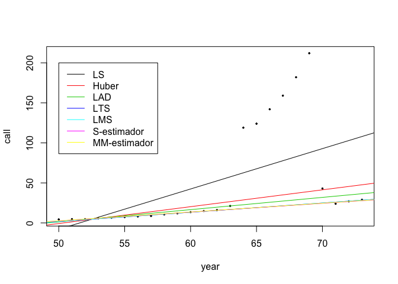

Observamos que todas las rectas son robustas a excepción de la recta de
Huber (Huber) y la regresión lineal simple (LS).

### Regresión robusta múltiple

*Ejemplo*

Utilizaremos nuevamente el conjunto de datos `stackloss` que corresponde
a datos de una fábrica de oxidación de amonio (*N**H*3) a ácido nítrico
(*H**N**O*3). Son 21 observaciones de 4 variables: flujo del aire (Air
Flow; representa la tasa de operación en la fábrica), temperatura del
agua ( Water Temp), concentración de ácido (por 1000 menos 500; es
decir, un valor de 89 corresponde a 58.9%) (Acid Conc.), y la variable
dependiente pérdida (stack.loss; es una medida -inversa- de la
eficiencia de la planta).

    library(car)
    library(MASS)
    data(stackloss)
    head(stackloss)

    # por mínimos cuadrados (LS) --------
    fitLSs=lm(stackloss[,4] ~ stackloss[,1] + stackloss[,2] + stackloss[,3])
    # o lm(stack.loss ~ ., data=stackloss)
    summary(fitLSs)

    ## 
    ## Call:
    ## lm(formula = stackloss[, 4] ~ stackloss[, 1] + stackloss[, 2] + 
    ##     stackloss[, 3])
    ## 
    ## Residuals:
    ##     Min      1Q  Median      3Q     Max 
    ## -7.2377 -1.7117 -0.4551  2.3614  5.6978 
    ## 
    ## Coefficients:
    ##                Estimate Std. Error t value Pr(>|t|)    
    ## (Intercept)    -39.9197    11.8960  -3.356  0.00375 ** 
    ## stackloss[, 1]   0.7156     0.1349   5.307  5.8e-05 ***
    ## stackloss[, 2]   1.2953     0.3680   3.520  0.00263 ** 
    ## stackloss[, 3]  -0.1521     0.1563  -0.973  0.34405    
    ## ---
    ## Signif. codes:  0 '***' 0.001 '**' 0.01 '*' 0.05 '.' 0.1 ' ' 1
    ## 
    ## Residual standard error: 3.243 on 17 degrees of freedom
    ## Multiple R-squared:  0.9136, Adjusted R-squared:  0.8983 
    ## F-statistic:  59.9 on 3 and 17 DF,  p-value: 3.016e-09

Realizamos el diagnóstico del modelo.

    avPlots(fitLSs, ask=F)

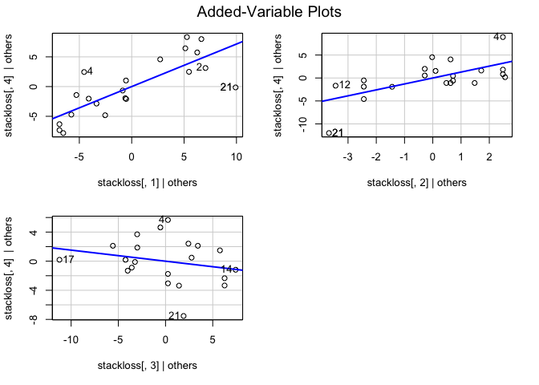

    par(mfrow = c(2,2))
    plot(fitLSs) #varios outliers

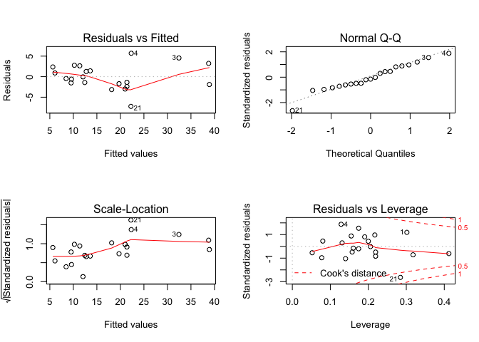

Observamos que los casos 3, 4 y 21 son outliers. Vamos a realizar
regresiones robustas para disminuir la influencia de estos puntos.

    # por Huber ----------
    fitHs=rlm(stackloss[,4] ~ stackloss[,1] + stackloss[,2] + stackloss[,3])
    # o rlm(stack.loss ~ ., data=stackloss)
    summary(fitHs)

    ## 
    ## Call: rlm(formula = stackloss[, 4] ~ stackloss[, 1] + stackloss[, 2] + 
    ##     stackloss[, 3])
    ## Residuals:
    ##      Min       1Q   Median       3Q      Max 
    ## -8.91753 -1.73127  0.06187  1.54306  6.50163 
    ## 
    ## Coefficients:
    ##                Value    Std. Error t value 
    ## (Intercept)    -41.0265   9.8073    -4.1832
    ## stackloss[, 1]   0.8294   0.1112     7.4597
    ## stackloss[, 2]   0.9261   0.3034     3.0524
    ## stackloss[, 3]  -0.1278   0.1289    -0.9922
    ## 
    ## Residual standard error: 2.441 on 17 degrees of freedom

    # para S_estimador ---------
    lqs(stack.loss ~ ., data=stackloss)

    ## Call:
    ## lqs.formula(formula = stack.loss ~ ., data = stackloss)
    ## 
    ## Coefficients:
    ## (Intercept)     Air.Flow   Water.Temp   Acid.Conc.  
    ##  -3.581e+01    7.500e-01    3.333e-01   -8.723e-17  
    ## 
    ## Scale estimates 0.8482 0.8645

    lqs(stack.loss ~ ., data=stackloss, method="S")

    ## Call:
    ## lqs.formula(formula = stack.loss ~ ., data = stackloss, method = "S")
    ## 
    ## Coefficients:
    ## (Intercept)     Air.Flow   Water.Temp   Acid.Conc.  
    ##   -35.94141      0.82227      0.43750     -0.07031  
    ## 
    ## Scale estimates 1.912

    # para MM-estimador ---------
    rlm(stack.loss ~ ., data=stackloss, method="MM")

    ## Call:
    ## rlm(formula = stack.loss ~ ., data = stackloss, method = "MM")
    ## Converged in 11 iterations
    ## 
    ## Coefficients:
    ## (Intercept)    Air.Flow  Water.Temp  Acid.Conc. 
    ## -41.5230426   0.9388404   0.5794523  -0.1129150 
    ## 
    ## Degrees of freedom: 21 total; 17 residual
    ## Scale estimate: 1.91

    # otra opción para MM-estimadores
    library(robustbase)
    lmrob(stack.loss ~ ., data=stackloss)

    ## 
    ## Call:
    ## lmrob(formula = stack.loss ~ ., data = stackloss)
    ##  \--> method = "MM"
    ## Coefficients:
    ## (Intercept)     Air.Flow   Water.Temp   Acid.Conc.  
    ##    -41.5246       0.9388       0.5796      -0.1129

Graficamos el peso que el modelo de regresion de Huber le da a los casos
que son *outliers*.

    plot(fitHs$w, ylab="Huber Weight")
    smallweights <- which(fitHs$w < 0.8)
    showLabels(1:45, fitHs$w, rownames(stackloss), method=smallweights, cex.=.6)

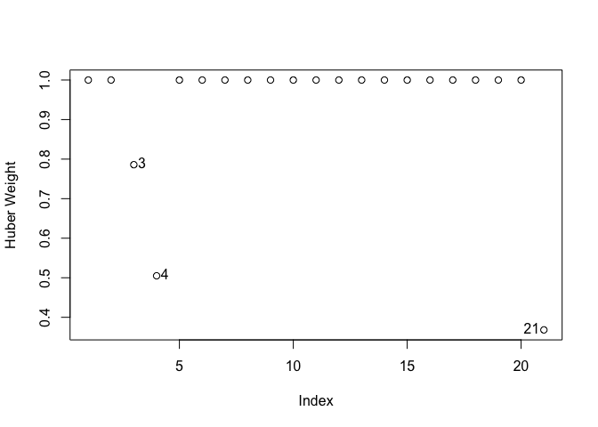

    ## [1]  3  4 21

Vemos que estos casos pasan a tener un peso inferior a 1.

Estrategia para tratar datos problemáticos
==========================================

En primer lugar, compruebe si hay errores de datos obvios:

    Si el error es solo una entrada de datos o un error de recopilación de datos, corríjalo.
    Si el punto de datos no es representativo de la población de estudio deseada, elimínelo.
    Si el punto de datos es un error de procedimiento e invalida la medición, elimínelo.

Considere la posibilidad de que podría haber malformado su modelo de
regresión:

    ¿Te has dejado algún predictor importante?
    ¿Deberías considerar agregar algunos términos de interacción?
    ¿Hay alguna no linealidad que necesita ser modelada?

Si la no linealidad es un problema, una posibilidad es simplemente
reducir el alcance de su modelo. Si reduce el alcance de su modelo, debe
asegurarse de reportarlo, para que los lectores no usen mal su modelo.

Decida si la eliminación de puntos de datos está justificada o no:

    No elimine puntos de datos simplemente porque no se ajustan a su modelo de regresión preconcebida.
    Debe tener una buena razón objetiva para eliminar puntos de datos.
    Si elimina cualquier dato después de haberlo recopilado, justifíquelo y describalo en sus informes.
    Si no está seguro de qué hacer con un punto de datos, analícelos dos veces (una vez con y una vez sin el punto de datos) e informe los resultados de ambos análisis.

Primero, ante todo, y finalmente: está bien usar su sentido común y
conocimiento sobre la situación.

R CRAN tiene un excelente material para realizar análisis de puntos
influyentes:
<https://cran.r-project.org/web/packages/olsrr/vignettes/influence_measures.html>

Referencias
===========

    Li, G. 1985. Robust regression. In Exploring Data Tables, Trends, and Shapes, ed. D. C. Hoaglin, F. Mosteller, and J. W. Tukey, Wiley.

    John Fox, Applied regression analysis, linear models, and related models, Sage publications, Inc, 1997

    UCLA: https://stats.idre.ucla.edu/r/dae/robust-regression/

    Penn State University: https://science.psu.edu/
