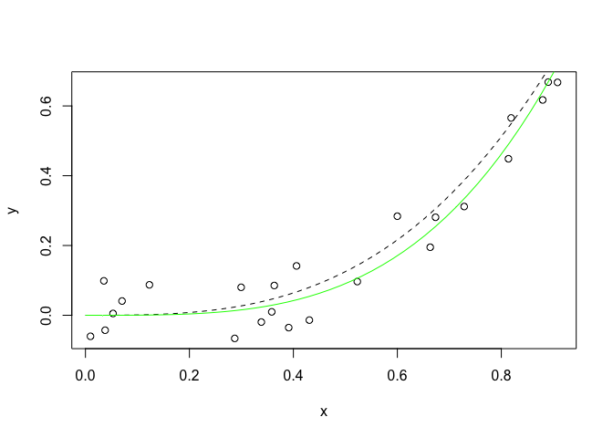
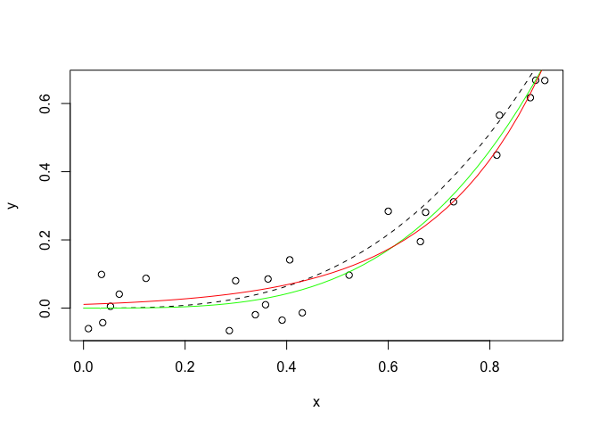
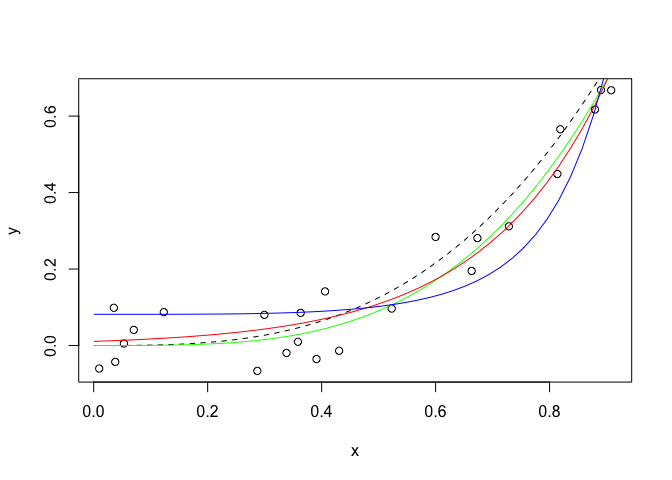
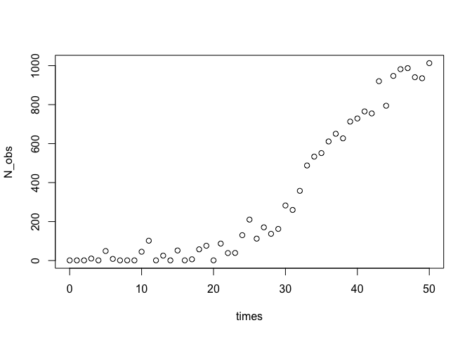
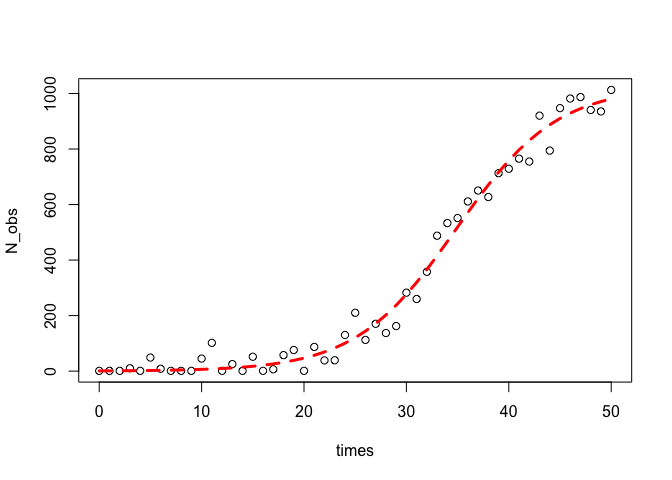

-   [Mínimos cuadrados no lineales](#minimos-cuadrados-no-lineales)
-   [La función `nls`](#la-funcion-nls)
    -   [Ejemplo: crecimiento
        poblacional](#ejemplo-crecimiento-poblacional)
    -   [Ejemplo: Cobb-Douglas](#ejemplo-cobb-douglas)
    -   [Taller](#taller)

**Paquetes de esta sección**

    if(!require(deSolve)){install.packages("deSolve")}

Todos los modelos que hemos analizado hasta ahora han sido lineales en
los parámetros (es decir, lineales en los beta). El modelo de regresión
final fue solo una combinación lineal de predictores de orden superior.

Ahora estamos interesados en estudiar el **modelo de regresión no
lineal**:

*Y* = *f*(**X**, *β*)+*ϵ*

donde **X** es un vector de *p* predictores, *β* es un vector de *k*
parámetros, *f*(⋅) es una función de regresión conocida y *ϵ* es un
término de error cuya distribución puede o no ser normal.

Observe que ya no necesariamente tenemos la dimensión del vector de
parámetros simplemente uno mayor que el número de predictores. Algunos
ejemplos de modelos de regresión no lineal son:

$$
y\_{i}=\\frac{e^{\\beta\_{0}+\\beta\_{1}x\_{i}}}{1+e^{\\beta\_{0}+\\beta\_{1}x\_{i}}}+\\epsilon\_{i}
$$

$$
y\_{i}=\\frac{\\beta\_{0}+\\beta\_{1}x\_{i}}{1+\\beta\_{2}e^{\\beta\_{3}x\_{i}}}+\\epsilon\_{i} 
$$

*y**i* = *β*0 + (0.4 − *β*0)*e*−*β*1(*x**i* − 5) + *ϵ**i*

Sin embargo, hay algunos modelos no lineales que en realidad se llaman
intrínsecamente lineales porque se pueden hacer lineales en los
parámetros mediante una simple transformación. Por ejemplo:

$$
Y=\\frac{\\beta\_{0}X}{\\beta\_{1}+X}
$$

puede ser re escrito como:

$$
\\frac{1}{Y}=\\frac{1}{\\beta\_{0}}+\\frac{\\beta\_{1}}{\\beta\_{0}}\\frac{1}{X}
$$

$$
\\frac{1}{Y}=\\theta\_{0}+\\theta\_{1}\\frac{1}{X}
$$

Lo cual es lineal en los parámetros transformados *θ* y *θ*. En tales
casos, la transformación de un modelo a su forma lineal a menudo
proporciona mejores procedimientos de inferencia e intervalos de
confianza, pero uno debe ser consciente de los efectos que la
transformación tiene en la distribución de los errores.

Mínimos cuadrados no lineales
-----------------------------

Volviendo a los casos en los que no es posible transformar el modelo a
una forma lineal, considere la configuración

*Y**i* = *f*(**X***i*, *β*)+*ϵ**i*,

donde *ϵ* es iid normal con media 0 y varianza constante. Para esta
configuración, podemos confiar en parte de la teoría de los mínimos
cuadrados. Para otros términos de error no normales, se deben emplear
diferentes técnicas.

Primero, sea

$$
Q=\\sum\_{i=1}^{n}(y\_{i}-f(\\textbf{X}\_{i},\\beta))^{2}.
$$

Para hallar:

$$
\\hat{\\beta}=\\arg\\min\_{\\beta}Q,
$$

Primero encontramos cada una de las derivadas parciales de *Q* con
respecto a *β**j*. Luego, establecemos cada una de las
derivadas parciales igual a 0 y los parámetros *β**k* son
reemplazados por $\\hat{\\beta}\_k$ Las funciones a resolver no son
lineales en los parámetros $\\hat{\\beta}\_k$ estimados y, a menudo, son
difíciles de resolver, incluso en los casos más simples. Por lo tanto, a
menudo se emplean métodos numéricos iterativos. ¡Aún más dificultades
surgen en que pueden ser posibles múltiples soluciones!

Los algoritmos para la estimación de mínimos cuadrados no lineales
incluyen:

-   El **método de Newton**, un método clásico basado en un enfoque de
    gradiente pero que puede ser computacionalmente desafiante y muy
    dependiente de *buenos* valores iniciales.
-   El **algoritmo de Gauss-Newton**, una modificación del método de
    Newton que proporciona una buena aproximación de la solución a la
    que debería haber llegado el método de Newton pero que no está
    garantizado que converja.
-   El **método de Levenberg-Marquardt**, que puede resolver las
    dificultades de cálculo que surgen con los otros métodos, pero puede
    requerir una tediosa búsqueda del valor óptimo de un parámetro de
    ajuste.

La función `nls`
----------------

Sirve para encontrar parámetros en funciones no lineales. Veamos.

**Ajuste de una curva**

Se desea ajustar:

*y*(*θ*)=*x**θ* + *ϵ**i*

donde *ϵ**i* sigue una distribución uniforme.

    len <- 24
    x = runif(len)
    y = x^3 + runif(len, min = -0.1, max = 0.1)
    plot(x, y)
    s <- seq(from = 0, to = 1, length = 50)
    lines(s, s^3, lty = 2)

    df <- data.frame(x, y)
    m <- nls(y ~ I(x^power), data = df, start = list(power = 1), trace = T)

    ## 2.171339 :  1
    ## 0.4329879 :  2.024274
    ## 0.1077673 :  2.996584
    ## 0.08514068 :  3.41466
    ## 0.08494079 :  3.460847
    ## 0.08494068 :  3.46191
    ## 0.08494068 :  3.461925

    lines(s, predict(m, list(x = s)), col = "green")

Veamos los resultados:

    summary(m)

    ## 
    ## Formula: y ~ I(x^power)
    ## 
    ## Parameters:
    ##       Estimate Std. Error t value Pr(>|t|)    
    ## power   3.4619     0.2034   17.02 1.57e-14 ***
    ## ---
    ## Signif. codes:  0 '***' 0.001 '**' 0.01 '*' 0.05 '.' 0.1 ' ' 1
    ## 
    ## Residual standard error: 0.06077 on 23 degrees of freedom
    ## 
    ## Number of iterations to convergence: 6 
    ## Achieved convergence tolerance: 2.337e-07

**Calculando el R cuadrado**

    (RSS.p <- sum(residuals(m)^2))  # Suma de cuadrados de los residuos

    ## [1] 0.08494068

    (TSS <- sum((y - mean(y))^2))  # Suma total de residuos

    ## [1] 1.339307

    (1 - (RSS.p/TSS))  # R-squared measure

    ## [1] 0.9365786

**Ajuste a una función exponencial**

Redefinamos el modelo *m* de modo que sea exponencial y volvamos a
calcular los resultados:

    m.exp <- nls(y ~ I(a*exp(b*x)), data = df, start = list(a = 0.5, b = 0.5), trace = T)

    ## 5.3919 :  0.5 0.5
    ## 1.04576 :  0.1999632 1.0029056
    ## 0.5731493 :  0.06203321 1.88607605
    ## 0.4385577 :  0.03720827 2.58651451
    ## 0.3376843 :  0.0243573 3.1842392
    ## 0.2839713 :  0.01170157 4.09839191
    ## 0.09872662 :  0.009088909 4.879685875
    ## 0.09312738 :  0.0108801 4.5928474
    ## 0.09260363 :  0.01073063 4.62796511
    ## 0.09260322 :  0.01077568 4.62294361
    ## 0.09260321 :  0.01076973 4.62360837
    ## 0.09260321 :  0.01077053 4.62352079

    plot(x, y)
    lines(s, s^3, lty = 2)
    lines(s, predict(m, list(x = s)), col = "green")
    lines(s, predict(m.exp, list(x = s)), col = "red")

De lo anterior, podemos ver que una función exponencial, con la forma
*y* = *α**e**β**x* también se ajusta bien a los datos, aunque
la curva parece demasiado pronunciada hacia el lado derecho de la
gráfica .

Para probar si este modelo se ajusta mejor a los datos, podemos volver a
ejecutar el R cuadrado:

    (RSS.p <- sum(residuals(m.exp)^2))  # Suma de cuadrados de los residuos

    ## [1] 0.09260321

    (TSS <- sum((y - mean(y))^2))  # Suma total de residuos

    ## [1] 1.339307

    1 - (RSS.p/TSS)  # R-squared 

    ## [1] 0.9308574

Está claro que la curva exponencial se ajusta menos a los datos.

**Ajustando datos a una función predefinida**

Podemos usar la función `nls` para alterar de manera iterativa cualquier
número de coeficientes en cualquier función que nos interese usar.

Asumamos brevemente que la relación *y* y *x* no es en realidad cúbica
sino exponencial, con la siguiente forma:
*y* = *e**a* + *b**s**i**n*(*x*). La función se puede definir
utilizando el método genérico.

    exp.eq <- function(x, a, b) {
        exp(1)^(a + b * sin(x^4))
    }
    exp.eq(2, 1, 3)  # Hacemos una prueba de la ecuación

    ## [1] 1.146014

Ahora que se ha definido esta forma funcional, `nls` se puede usar para
encontrar los coeficientes que mejor reflejan los datos:

    m.sinexp <- nls(y ~ exp.eq(x, a, b), data = df, start = list(a = 1, b = 1), 
        trace = T)

    ## 231.3187 :  1 1
    ## 28.56773 :  0.01421235 1.21368219
    ## 3.192399 :  -0.9435624  1.7057105
    ## 0.4207919 :  -1.809356  2.580268
    ## 0.2108704 :  -2.396008  3.433440
    ## 0.2071917 :  -2.518839  3.611481
    ## 0.2071468 :  -2.502452  3.577870
    ## 0.2071439 :  -2.506924  3.586487
    ## 0.2071437 :  -2.505806  3.584323
    ## 0.2071437 :  -2.506089  3.584870
    ## 0.2071437 :  -2.506017  3.584732
    ## 0.2071437 :  -2.506035  3.584767

    plot(x, y)
    lines(s, s^3, lty = 2)
    lines(s, predict(m, list(x = s)), col = "green")
    lines(s, predict(m.exp, list(x = s)), col = "red")
    lines(s, predict(m.sinexp, list(x = s)), col = "blue")

Claramente, la función exponencial final era tonta y no se ajustaba bien
a los datos. Sin embargo, nos mostró cómo podemos usar la función `nls`
para ajustar nuestras funciones predefinidas a los datos existentes.

**El Problema de los valores iniciales**

Encontrar buenos valores iniciales es muy importante en la regresión no
lineal para permitir que el algoritmo del modelo converja. Si se
establece valores de parámetros iniciales completamente fuera del rango
de los valores de los parámetros potenciales, el algoritmo fallará o
devolverá parámetros no sensitivos como, por ejemplo, devolver una tasa
de crecimiento de 1000 cuando el valor real es 1.04.

La mejor manera de encontrar el valor inicial correcto es hacer una
*inspecci´pon gráfica* de los datos, representándolos y basándose en el
entendimiento que tiene de la ecuación para encontrar valores de inicio
aproximados para los parámetros.

### Ejemplo: crecimiento poblacional

Es muy común que diferentes campos científicos utilicen diferentes
parametrizaciones (es decir, diferentes ecuaciones) para el mismo
modelo, un ejemplo es el modelo de crecimiento logístico de la
población, en ecología se usa la siguiente forma:

$$
N\_{t} = \\frac{K\*N\_{0}\*e^{r\*t}}{K + N\_{0} \* (e^{r\*t} – 1)}
$$

Siendo *N**t* el número de individuos en el momento *t*, *r*
siendo la tasa de crecimiento de la población y *K* la capacidad de
carga. Podemos reescribir esto como una ecuación diferencial:

*d**N*/*d**t* = *R* \* *N* \* (1 − *N*/*K*)

    library(deSolve)
    #simulamos el crecimiento exponencial con la ecuacion logistica y estimamos los parametros usando nls
    log_growth <- function(Time, State, Pars) {
      with(as.list(c(State, Pars)), {
        dN <- R*N*(1-N/K)
        return(list(c(dN)))
      })
    }
    #los parametros para la ecuacion logistica
    pars  <- c(R=0.2,K=1000)
    # los parametros iniciales
    N_ini  <- c(N=1)
    #los pasos de tiempo para evaluar la funcion ode
    times <- seq(0, 50, by = 1)
    #la ecuaciones diferenciales ordinarias (ODE)
    out   <- ode(N_ini, times, log_growth, pars)
    # agregamos variaciones aleatorias
    N_obs<-out[,2]+rnorm(51,0,50)
    # quitamos los valores mayores que 1
    N_obs<-ifelse(N_obs<1,1,N_obs)
    #plot
    plot(times,N_obs)

Esta parte fue solo para simular algunos datos con un error aleatorio,
ahora viene la parte difícil para estimar los valores iniciales.

Ahora R tiene una función incorporada para estimar los valores iniciales
para el parámetro de una ecuación logística (`SSlogis`) pero usa la
siguiente ecuación:

$$
N\_{t} = \\frac{\\alpha}{1+e^{\\frac{xmid-t}{scale}}}
$$

    #encontramos los parametros de la ecuacion
    SS<-getInitial(N_obs~SSlogis(times,alpha,xmid,scale),data=data.frame(N_obs=N_obs,times=times))

Usamos la función `getInitial` que proporciona algunas conjeturas
iniciales sobre los valores de los parámetros en función de los datos.
Pasamos a esta función un modelo de inicio automático (`SSlogis`) que
toma como argumento un vector de entrada (los valores de *t* donde se
evaluará la función), y los nombres de los tres parámetros para la
ecuación logística.

Sin embargo, como los `SSlogis` utilizan una parametrización diferente,
necesitamos usar un poco de álgebra para pasar de los valores estimados
de inicio automático devueltos desde `SSlogis` a los que están en la
ecuación que queremos usar.

    #usamos una parametrizacion diferente
    K_start<-SS["alpha"]
    R_start<-1/SS["scale"]
    N0_start<-SS["alpha"]/(exp(SS["xmid"]/SS["scale"])+1)
    #la formula del modelo
    log_formula<-formula(N_obs~K*N0*exp(R*times)/(K+N0*(exp(R*times)-1)))
    #ajustamos el modelo
    m<-nls(log_formula,start=list(K=K_start,R=R_start,N0=N0_start))
    #parametros estimados
    summary(m)

    ## 
    ## Formula: N_obs ~ K * N0 * exp(R * times)/(K + N0 * (exp(R * times) - 1))
    ## 
    ## Parameters:
    ##           Estimate Std. Error t value Pr(>|t|)    
    ## K.alpha  1.025e+03  3.068e+01  33.422   <2e-16 ***
    ## R.scale  2.041e-01  1.342e-02  15.210   <2e-16 ***
    ## N0.alpha 8.286e-01  3.561e-01   2.327   0.0242 *  
    ## ---
    ## Signif. codes:  0 '***' 0.001 '**' 0.01 '*' 0.05 '.' 0.1 ' ' 1
    ## 
    ## Residual standard error: 43.28 on 48 degrees of freedom
    ## 
    ## Number of iterations to convergence: 0 
    ## Achieved convergence tolerance: 2.339e-06

    #bondad de ajuste
    cor(N_obs,predict(m))

    ## [1] 0.9931462

Graficamos

    plot(times,N_obs)
    lines(times,predict(m),col="red",lty=2,lwd=3)

### Ejemplo: Cobb-Douglas

El modelo:

*Y**i* = *β*1*X*2*i**β*2*X*3*i**β*3*e**u**i*

donde

-   *Y*: producción
-   *X*2: insumo trabajo
-   *X*3: insumo capital
-   *u*: término de perturbación
-   *e*: base del logaritmo

Notemos que el modelo es multiplicativo, si tomamos la derivada
obetenemos un modelo más familiar respecto a la regresión lineal
múltiple:

*l**n**Y**i* = *l**n**β*1 + *β*2*l**n*(*X*2*i*)+*β*3*l**n*(*X*3*i*)+*u**i*

    uu <- "https://raw.githubusercontent.com/vmoprojs/DataLectures/master/tabla7_3.csv"
    # datos <- read.csv(file="tabla7_3.csv",sep=";",dec=".",header=TRUE)
    datos <- read.csv(url(uu),sep=";",dec=".",header=TRUE)

    W <- log(datos$X2)

    K <- log(datos$X3)

    LY <- log(datos$Y)

    reg.1 <- lm(LY~W+K)
    summary(reg.1)

    ## 
    ## Call:
    ## lm(formula = LY ~ W + K)
    ## 
    ## Residuals:
    ##      Min       1Q   Median       3Q      Max 
    ## -0.15919 -0.02917  0.01179  0.04087  0.09640 
    ## 
    ## Coefficients:
    ##             Estimate Std. Error t value Pr(>|t|)    
    ## (Intercept)  -3.3387     2.4491  -1.363 0.197845    
    ## W             1.4987     0.5397   2.777 0.016750 *  
    ## K             0.4899     0.1020   4.801 0.000432 ***
    ## ---
    ## Signif. codes:  0 '***' 0.001 '**' 0.01 '*' 0.05 '.' 0.1 ' ' 1
    ## 
    ## Residual standard error: 0.0748 on 12 degrees of freedom
    ## Multiple R-squared:  0.8891, Adjusted R-squared:  0.8706 
    ## F-statistic: 48.08 on 2 and 12 DF,  p-value: 1.864e-06

Si se desea evaluar la hipótesis *β*2 + *β*3 = 1,
se usa (`vcov(fit.model)`):

$$
t = \\frac{(\\hat{\\beta}\_2+\\hat{\\beta}\_3)-1}{\\sqrt{var(\\hat{\\beta}\_2)+var(\\hat{\\beta}\_3)+2cov(\\hat{\\beta}\_2,\\hat{\\beta}\_3})}
$$

Si se desea estimar el modelo de forma no lineal, tenemos

    produccion <- function(a,b1,b2,X2,X3)
    {
      y <- a * (X2^(b1)) * (X3^(b2))
      y
    }

    # nls(produccion(a,b1,b2,X2,X3), data=datos, start =
    #       c(a=exp(-3.6529493),b1=1.0376775,b2 = 0.7187662), trace = TRUE)

    cd.nls <- nls(Y~a * (X2^(b1)) * (X3^(b2)), data=datos, start =
          c(a=exp(-3.3),b1=1.1,b2 = 0.4), trace = TRUE)

    ## 8708132824 :  0.03688317 1.10000000 0.40000000
    ## 8675849643 :  0.02100187 1.18968838 0.40929049
    ## 8587365262 :  0.01442634 1.26102994 0.41656110
    ## 8419670086 :  0.008348122 1.368361221 0.427335004
    ## 7881005064 :  0.005458484 1.494727501 0.439617864
    ## 6583036265 :  0.0059799 1.5761620 0.4469403
    ## 4808546360 :  0.008585682 1.604184859 0.449075421
    ## 2619382635 :  0.01335838 1.61312719 0.44961401
    ## 663361319 :  0.0205383 1.6148192 0.4496652
    ## 28677021 :  0.0277159 1.6147623 0.4496533
    ## 28676896 :  0.02771594 1.61477622 0.44965674

    summary(cd.nls)

    ## 
    ## Formula: Y ~ a * (X2^(b1)) * (X3^(b2))
    ## 
    ## Parameters:
    ##    Estimate Std. Error t value Pr(>|t|)    
    ## a   0.02772    0.05775   0.480  0.63990    
    ## b1  1.61478    0.42800   3.773  0.00266 ** 
    ## b2  0.44966    0.07430   6.052 5.74e-05 ***
    ## ---
    ## Signif. codes:  0 '***' 0.001 '**' 0.01 '*' 0.05 '.' 0.1 ' ' 1
    ## 
    ## Residual standard error: 1546 on 12 degrees of freedom
    ## 
    ## Number of iterations to convergence: 10 
    ## Achieved convergence tolerance: 3.735e-07

### Taller

Recuerde que el error en los mínimos cuadrados ordinarios es aditivo. Si
no cuenta con esa estructura, busque la forma función que lo sea.

Considere la siguiente ecuación:

$$
Y = \\frac{\\epsilon}{1+e^{\\beta\_1X\_1+\\beta\_2X\_2}}
$$

*l**o**g*(*Y*)= − *l**o**g*(1 + *e**β*1*X*1 + *β*2*X*2)+*l**o**g*(*ϵ*)

La segunda ecuación es la versión transformada que usaremos para la
estimación.

-   Usando como semilla =1, simule 100 valores de *X*1 y
    *X*2 con distribución uniforme entre 0 y 1.
-   Usando el modelo propuesto, simule valores de *Y* donde *a* = 0.8 y
    *b* = 0.5.
-   El ruido tiene distribución normal con media cero y varianza 1.

Debe obteener los siguientes resultados:

    ## 
    ## Formula: log(Y) ~ -log(1 + exp(a * X1 + b * X2))
    ## 
    ## Parameters:
    ##   Estimate Std. Error t value Pr(>|t|)   
    ## a   0.8470     0.2697   3.141  0.00223 **
    ## b   0.5962     0.2718   2.193  0.03065 * 
    ## ---
    ## Signif. codes:  0 '***' 0.001 '**' 0.01 '*' 0.05 '.' 0.1 ' ' 1
    ## 
    ## Residual standard error: 0.6517 on 98 degrees of freedom
    ## 
    ## Number of iterations to convergence: 3 
    ## Achieved convergence tolerance: 2.299e-06
