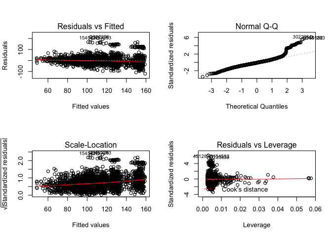
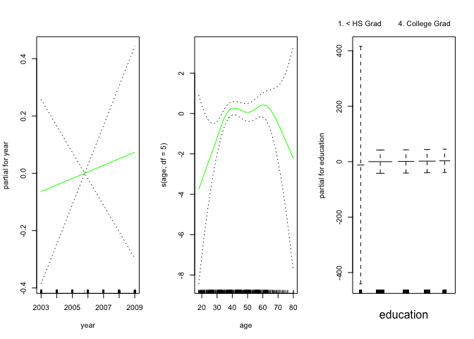
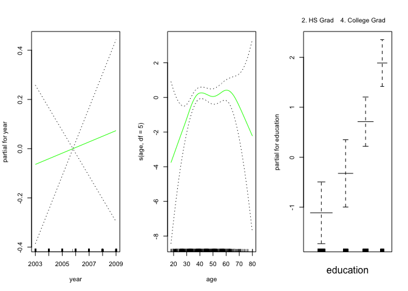

-   [GAMs en regresión](#gams-en-regresion)
    -   [Ejemplo](#ejemplo)
-   [Ventajas y desventajas de los
    GAMs](#ventajas-y-desventajas-de-los-gams)
-   [GAMS en clasificación](#gams-en-clasificacion)
    -   [Ejemplo](#ejemplo-1)

**Paquetes de esta sección**

    if(!require(ISLR)){install.packages("ISLR")}
    if(!require(gam)){install.packages("gam")}

<!-- An Introduction to Statistical Learning: 270-272 -->
<!-- https://statistical-programming.com/lowess-r-smoothing-function/ -->
-   Proveen un marco general para extender el modelo linear estándar
    permitiéndo funciones no lineales para cada variable, conservando
    *aditividad*.

-   Tal como los modelos lineales, los modelos GAM pueden aplicarse a
    respuestas cuantitativas o cualitativas. Veremos un ejemplo en cada
    caso.

GAMs en regresión
=================

Una forma de extnder el modelo de regresión lineal,

*y**i* = *β*0 + *β*1*x**i*1 + … + *β**p**x**i**p* + *ϵ**i*

para permitir relaciones no lineales entre cara caracerística y la
respuesta es reemplazar cada componente lineal
*β**j**x**i**j* con una función no lineal
*f**j*(*x**i**j*) (suave). Podemos escribir el
modelo como:

$$
y\_i= \\beta\_0 + \\sum\_{j=1}^{p}f\_j(x\_{ij})+\\epsilon\_i
$$

=*β*0 + *f*1(*x**i*1)+*f*2(*x**i*2)+⋯+*f**p*(*x**i**p*)*ϵ**i*

Notemos que es *aditivo* porque podemos calcular funciones separadas
para cada variable y luego agregar todas las contribuciones.

Lo que hemos revisado de *polinomios locales* puede usarse sin problema
para especificar cada función.

Ejemplo
-------

Ajustemos el modelo:

*w**a**g**e* = *β*0 + *f*1(*y**e**a**r*)+*f*2(*a**g**e*)+*f*3(*e**d**u**c**a**t**i**o**n*)+*ϵ*

Cargamos y revisamos los datos:

    library(ISLR)
    data("Wage")
    str(Wage)

    ## 'data.frame':    3000 obs. of  11 variables:
    ##  $ year      : int  2006 2004 2003 2003 2005 2008 2009 2008 2006 2004 ...
    ##  $ age       : int  18 24 45 43 50 54 44 30 41 52 ...
    ##  $ maritl    : Factor w/ 5 levels "1. Never Married",..: 1 1 2 2 4 2 2 1 1 2 ...
    ##  $ race      : Factor w/ 4 levels "1. White","2. Black",..: 1 1 1 3 1 1 4 3 2 1 ...
    ##  $ education : Factor w/ 5 levels "1. < HS Grad",..: 1 4 3 4 2 4 3 3 3 2 ...
    ##  $ region    : Factor w/ 9 levels "1. New England",..: 2 2 2 2 2 2 2 2 2 2 ...
    ##  $ jobclass  : Factor w/ 2 levels "1. Industrial",..: 1 2 1 2 2 2 1 2 2 2 ...
    ##  $ health    : Factor w/ 2 levels "1. <=Good","2. >=Very Good": 1 2 1 2 1 2 2 1 2 2 ...
    ##  $ health_ins: Factor w/ 2 levels "1. Yes","2. No": 2 2 1 1 1 1 1 1 1 1 ...
    ##  $ logwage   : num  4.32 4.26 4.88 5.04 4.32 ...
    ##  $ wage      : num  75 70.5 131 154.7 75 ...

Ajustamos el modelo con *splines naturales* (cúbicos) para las dos
primeras funciones y una constante para cada nivel de la tercera usando
variables dicotómicas:

    library(gam)
    gam1 <- lm(wage ~ ns(year, 4) + ns(age, 5) + education, data = Wage)
    summary(gam1)

    ## 
    ## Call:
    ## lm(formula = wage ~ ns(year, 4) + ns(age, 5) + education, data = Wage)
    ## 
    ## Residuals:
    ##      Min       1Q   Median       3Q      Max 
    ## -120.513  -19.608   -3.583   14.112  214.535 
    ## 
    ## Coefficients:
    ##                             Estimate Std. Error t value Pr(>|t|)    
    ## (Intercept)                   46.949      4.704   9.980  < 2e-16 ***
    ## ns(year, 4)1                   8.625      3.466   2.488  0.01289 *  
    ## ns(year, 4)2                   3.762      2.959   1.271  0.20369    
    ## ns(year, 4)3                   8.127      4.211   1.930  0.05375 .  
    ## ns(year, 4)4                   6.806      2.397   2.840  0.00455 ** 
    ## ns(age, 5)1                   45.170      4.193  10.771  < 2e-16 ***
    ## ns(age, 5)2                   38.450      5.076   7.575 4.78e-14 ***
    ## ns(age, 5)3                   34.239      4.383   7.813 7.69e-15 ***
    ## ns(age, 5)4                   48.678     10.572   4.605 4.31e-06 ***
    ## ns(age, 5)5                    6.557      8.367   0.784  0.43328    
    ## education2. HS Grad           10.983      2.430   4.520 6.43e-06 ***
    ## education3. Some College      23.473      2.562   9.163  < 2e-16 ***
    ## education4. College Grad      38.314      2.547  15.042  < 2e-16 ***
    ## education5. Advanced Degree   62.554      2.761  22.654  < 2e-16 ***
    ## ---
    ## Signif. codes:  0 '***' 0.001 '**' 0.01 '*' 0.05 '.' 0.1 ' ' 1
    ## 
    ## Residual standard error: 35.16 on 2986 degrees of freedom
    ## Multiple R-squared:  0.293,  Adjusted R-squared:  0.2899 
    ## F-statistic:  95.2 on 13 and 2986 DF,  p-value: < 2.2e-16

Vemos que el modelo es significativo. Veamos puntos de influencia:

    par(mfrow = c(2,2))
    plot(gam1)

    par(mfrow = c(1,1))

Ahora las relaciones entre las variables

    par(mfrow = c(1,3))
    plot.Gam(gam1, se = TRUE, col = "red",all.terms = TRUE)

    par(mfrow = c(1,1))

-   El panel de la izquierda indica que manteniendo la edad y la
    educación fijas, el salario tiende a aumentar ligeramente con el
    año; esto puede ser debido a la inflación.

-   El panel central indica que la educación y el año se mantienen
    fijos, el salario tiende a ser más alto para los valores intermedios
    de la edad, y más bajo para los muy jóvenes y muy viejos.

-   El panel de la derecha indica que el año y la edad se mantienen
    fijos, el salario tiende a aumentar con la educación: Cuanto más
    educada es una persona, mayor es su salario, en promedio. Todos
    estos hallazgos son intuitivos.

> Backfitting: Este método se ajusta a un modelo que involucra múltiples
> predictores mediante la actualización repetida del ajuste para cada
> predictor de uno en uno, manteniendo los otros fijos. La belleza de
> este enfoque es que cada vez que actualizamos una función, simplemente
> aplicamos el método de ajuste para esa variable a un residuo parcial
> (*r**i* = *y**i* − *f*1(*x**i*1)−*f*2(*x**i*2)).

Ventajas y desventajas de los GAMs
==================================

-   Los GAM nos permiten ajustar un *f**j* no lineal en cada
    *X**j*, de modo que podamos modelar automáticamente las
    relaciones no lineales que la regresión lineal estándar fallará.
    Esto significa que no necesitamos probar manualmente diferentes
    transformaciones en cada variable individualmente.

-   Los ajustes no lineales pueden potencialmente hacer predicciones más
    precisas para la respuesta Y.

-   Debido a que el modelo es aditivo, aún podemos examinar el efecto de
    cada *X**j* en *Y* individualmente mientras mantenemos
    todas las demás variables fijas. Por lo tanto, si estamos
    interesados en la inferencia, los GAM proporcionan una
    representación útil.

-   La suavidad de la función *f**j* para la variable
    *X**j* se puede resumir mediante grados de libertad.

-   La principal limitación de los GAM es que el modelo está restringido
    para ser aditivo. Con muchas variables, las interacciones
    importantes se pueden perder. Sin embargo, al igual que con la
    regresión lineal, podemos agregar manualmente términos de
    *X**j* × *X**k*. Además, podemos agregar
    funciones de interacción de baja dimensión de la forma
    *f**j**k*(*X**j*, *X**k*) en el
    modelo; dichos términos pueden ajustarse utilizando suavizadores
    bidimensionales, como la regresión local, o splines bidimensionales
    (no se tratan aquí).

GAMS en clasificación
=====================

También se pueden usar cuando la respuesta es cualitativa. Se asume que
*Y* toma valores cero o uno, y sea *p*(*X*)=*P**r*(*Y* = 1|*X*) la
probabilidad condicional dado los preditores de que *Y* sea 1. Recodemos
el modelo logístico:

$$
log\\left(\\frac{p(X)}{1-p(X)}\\right) = \\beta\_0+\\beta\_1X\_1+\\cdots+\\beta\_pX\_p
$$

El *logit* es el logaritmo de los *odds* de *P**r*(*Y* = 1|*X*) vs
*P**r*(*Y* = 0|*X*) que se representa como una función lineal de los
predictores en la ecuación anterior.

Se puede extender usando relaciones no lineales de los predictores.

$$
log\\left(\\frac{p(X)}{1-p(X)}\\right) = \\beta\_0+f\_1(X\_1)+\\cdots+f\_p(X\_p)
$$

Esta ecuación representa un modelo GAM logístico.

Ejemplo
-------

Ajustamos un GAM a los datos de Salario para predecir la probabilidad de
que los ingresos de una persona superen los $250, 000 por año. El GAM
que ajustamos toma la forma.

$$
log\\left(\\frac{p(X)}{1-p(X)}\\right) = \\beta\_0+\\beta\_1\\texttt{year}+f\_1(\\texttt{age})+f\_3(\\texttt{education})
$$

donde

*p*(*X*)=*P**r*(`wage` &gt; 250|`year,age,education`)

    gam.lr <- gam(I(wage > 250) ~ year + s(age, df = 5) + education, 
                  family = binomial, data = Wage)
    summary(gam.lr)

    ## 
    ## Call: gam(formula = I(wage > 250) ~ year + s(age, df = 5) + education, 
    ##     family = binomial, data = Wage)
    ## Deviance Residuals:
    ##      Min       1Q   Median       3Q      Max 
    ## -0.58206 -0.26780 -0.12341 -0.08241  3.31242 
    ## 
    ## (Dispersion Parameter for binomial family taken to be 1)
    ## 
    ##     Null Deviance: 730.5345 on 2999 degrees of freedom
    ## Residual Deviance: 602.4588 on 2989 degrees of freedom
    ## AIC: 624.4586 
    ## 
    ## Number of Local Scoring Iterations: 16 
    ## 
    ## Anova for Parametric Effects
    ##                  Df  Sum Sq Mean Sq F value  Pr(>F)    
    ## year              1    0.48  0.4845  0.5995 0.43883    
    ## s(age, df = 5)    1    3.83  3.8262  4.7345 0.02964 *  
    ## education         4   65.81 16.4514 20.3569 < 2e-16 ***
    ## Residuals      2989 2415.55  0.8081                    
    ## ---
    ## Signif. codes:  0 '***' 0.001 '**' 0.01 '*' 0.05 '.' 0.1 ' ' 1
    ## 
    ## Anova for Nonparametric Effects
    ##                Npar Df Npar Chisq  P(Chi)  
    ## (Intercept)                                
    ## year                                       
    ## s(age, df = 5)       4     10.364 0.03472 *
    ## education                                  
    ## ---
    ## Signif. codes:  0 '***' 0.001 '**' 0.01 '*' 0.05 '.' 0.1 ' ' 1

Veamos las relaciones entre las variables:

    par(mfrow = c(1, 3))
    plot(gam.lr, se = TRUE, col = "green")

    par(mfrow = c(1, 1))

El ajuste resultante se muestra en la figura. El último panel parece
sospechoso, con intervalos de confianza muy amplios para el nivel `<HS`,
veamos

    with(Wage,table(education, I(wage > 250)))

    ##                     
    ## education            FALSE TRUE
    ##   1. < HS Grad         268    0
    ##   2. HS Grad           966    5
    ##   3. Some College      643    7
    ##   4. College Grad      663   22
    ##   5. Advanced Degree   381   45

No hay unos para esa categoría: ningún individuo con menos de una
educación secundaria gana más de $ 250, 000 por año. Re ajustamos el
modelo:

    gam.lr.s <- gam(I(wage > 250) ~ year + s(age, df = 5) + education,
                    family = binomial, data = Wage, 
                    subset = (education != "1. < HS Grad"))
    summary(gam.lr.s)

    ## 
    ## Call: gam(formula = I(wage > 250) ~ year + s(age, df = 5) + education, 
    ##     family = binomial, data = Wage, subset = (education != "1. < HS Grad"))
    ## Deviance Residuals:
    ##     Min      1Q  Median      3Q     Max 
    ## -0.5821 -0.2760 -0.1415 -0.1072  3.3124 
    ## 
    ## (Dispersion Parameter for binomial family taken to be 1)
    ## 
    ##     Null Deviance: 715.5412 on 2731 degrees of freedom
    ## Residual Deviance: 602.4588 on 2722 degrees of freedom
    ## AIC: 622.4586 
    ## 
    ## Number of Local Scoring Iterations: 11 
    ## 
    ## Anova for Parametric Effects
    ##                  Df  Sum Sq Mean Sq F value    Pr(>F)    
    ## year              1    0.48  0.4845  0.5459   0.46004    
    ## s(age, df = 5)    1    3.83  3.8262  4.3116   0.03795 *  
    ## education         3   65.80 21.9339 24.7166 8.933e-16 ***
    ## Residuals      2722 2415.55  0.8874                      
    ## ---
    ## Signif. codes:  0 '***' 0.001 '**' 0.01 '*' 0.05 '.' 0.1 ' ' 1
    ## 
    ## Anova for Nonparametric Effects
    ##                Npar Df Npar Chisq  P(Chi)  
    ## (Intercept)                                
    ## year                                       
    ## s(age, df = 5)       4     10.364 0.03472 *
    ## education                                  
    ## ---
    ## Signif. codes:  0 '***' 0.001 '**' 0.01 '*' 0.05 '.' 0.1 ' ' 1

Evaluemos los resultados:

    par(mfrow = c(1, 3))
    plot(gam.lr.s, se = TRUE, col = "green")

Los tres paneles tienen la misma escala vertical. Esto nos permite
evaluar visualmente las contribuciones relativas de cada una de las
variables. Observamos que la edad y la educación tienen un efecto mucho
mayor que el año en la probabilidad de ser una fuente de ingresos
elevada.
