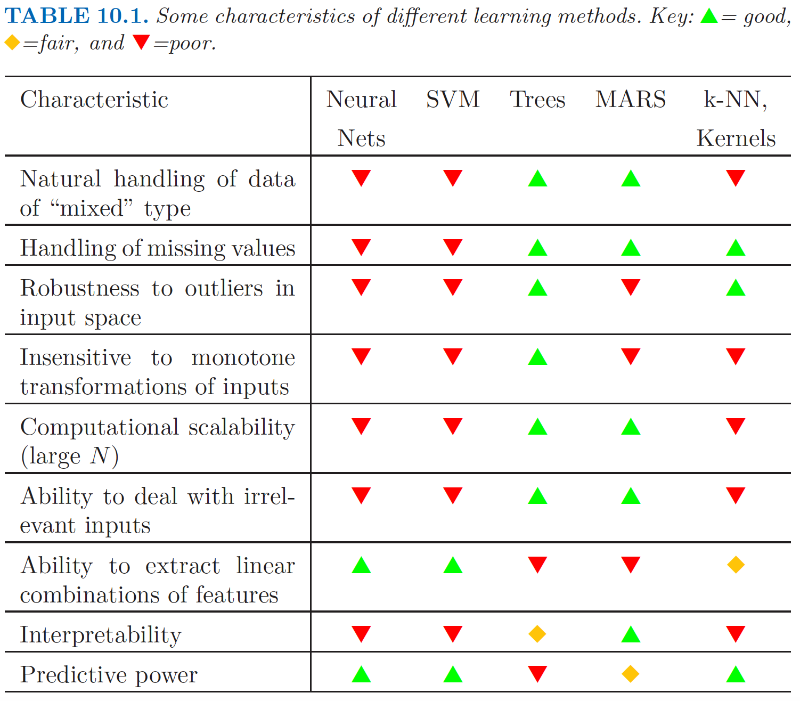
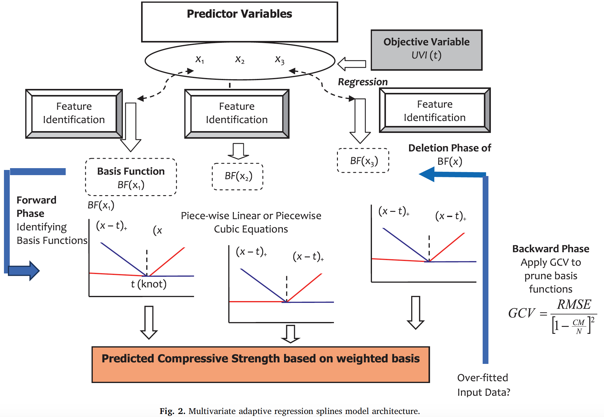
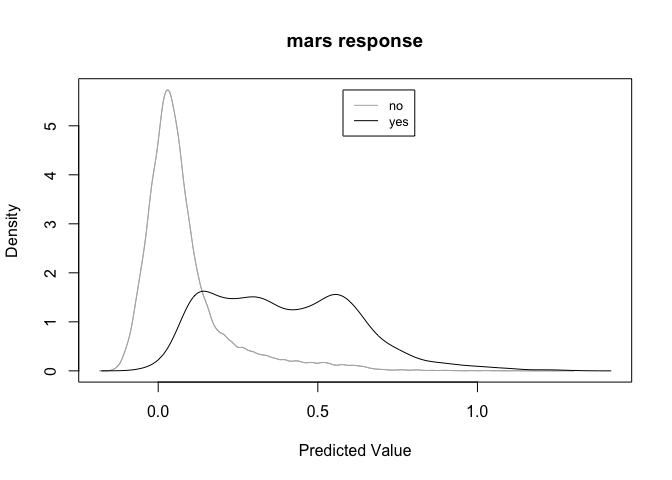
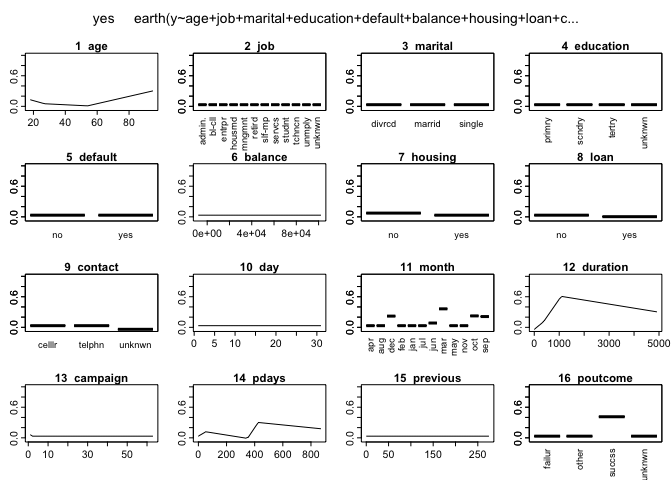

-   [Introducción](#introduccion)
    -   [¿Por qué usar modelos MARS?](#por-que-usar-modelos-mars)
    -   [La estrucura de MARS](#la-estrucura-de-mars)
-   [Ejemplo 1](#ejemplo-1)
    -   [Output](#output)
    -   [Tu turno](#tu-turno)

<!-- http://uc-r.github.io/mars -->
**Paquetes de esta sección**

    if(!require(ISLR)){install.packages("earth")}
    if(!require(ISLR)){install.packages("caret")}
    if(!require(ISLR)){install.packages("AmesHousing")}

<!-- An Introduction to Statistical Learning: 270-272 -->
<!-- https://statistical-programming.com/lowess-r-smoothing-function/ -->
-   En las clases pasadas hemos revisado extensiones de la regresión
    linear (nls, regresión polinómica, entre otras).

-   Existen otras variaciones como la regresión *Ridge*, *LASSO* y
    *Elastic NET* (algunas se verán en el módulo de Aprendizaje
    Automático).

Introducción
============

-   En estadística, MARS es una forma de regresión lineal introducida
    por Jorome Friedan en 1991.

-   MARS es una técnica de regresión no paramétrica y puede ser vista
    como una extensión de los modelos lineales que automáticamente no
    linealidades e interacciones entre variables.

-   El término *MARS* está protegido por derechos de autor y pertenece a
    *Salford Systems*.

-   Para evitar violentar esos derechos, las implementaciones abiertas
    de MARS se suelen llamar *Earth* (El paquete `earth` en R, por
    ejemplo).

-   La Regresión Spline adaptativa multivariante (*Multivariate adaptive
    regression spline* - MARS)

¿Por qué usar modelos MARS?
---------------------------

-   MARS es ideal para usuarios que prefieren obtener resultados
    similares a la regresión tradicional mientras capturan no
    linealidades e interacciones necesarias.

-   MARS revela patrones importantes en los datos que otras técnicas
    suelen fallar en revelar.

-   MARS construye su modelo uniendo pedazos de líneas rectas que
    mantienen su propia pendiente.

-   Esto permite que se detecte cualquier patrón en los datos.

-   Se puede utilizar para cuando se tiene variables de respuesta
    cuantitativa y cualitativa.

-   MARS realiza (todo automático y con gran velocidad):
    -   selección de variables.
    -   transformación de variables.
    -   detección de interacciones.
    -   testeo

**Áreas donde ha mostrado ser una técnica exitosa**

-   Predicción de demanda de electricidad de companías generadoras.
-   Relacionar puntajes de satisfacción del cliente con las
    especificaciones técnicas del producto.
-   Modelización en sistemas de información geográfica.



-   MARS es una técnica de regresión muy versátil y es una herramienta
    necesaria en nuestra caja de herramientas en Analítica de Datos.

La estrucura de MARS
--------------------



Ejemplo 1
=========

Cargamos los datos:

    library(earth)
    load("~/Documents/Consultorias&Cursos/DataLectures/banckfull.RData")

Construimos el modelo basado en los datos:

    mars <- earth(y~age+job+marital+education+default+balance+housing+
    loan+contact+day+month+duration+campaign+pdays+previous+poutcome,
    data=bankfull,pmethod="backward",nprune=20, nfold=10)

Notemos los argumentos usando en la función:

-   `pmethod`: Es el método para podar las variables regresoras. Las
    opciones son `backward`, `forward`, `cv` (se necesita especificar
    `nfold`), y `exhaustive`.
-   `nprune`: Numero máximo de funciones base que se usan.

<!-- http://www.visionday.dk/VD12/posters/M6.pdf -->
En resumen, para plantear el modelo, necesitamos 3 elementos:

1.  Definir el modelo (como en cualquier regresión)
2.  Definir el método de testeo (`pmethod`)
3.  Número de funciones base (`nprune`) y de interacciones (`degree`)

Veamos el resumen:

    summary(mars,digit=3)

    ## Call:
    ##             earth(formula=y~age+job+marital+education+default+balance+housin...),
    ##             data=bankfull, pmethod="backward", nprune=20, nfold=10)
    ## 
    ##                  coefficients
    ## (Intercept)            0.7775
    ## housingyes            -0.0408
    ## loanyes               -0.0294
    ## contactunknown        -0.0713
    ## monthdec               0.1876
    ## monthjun               0.0519
    ## monthmar               0.3301
    ## monthoct               0.1916
    ## monthsep               0.1789
    ## poutcomesuccess        0.3809
    ## h(age-27)              0.0072
    ## h(54-age)              0.0087
    ## h(duration-375)        0.0003
    ## h(1080-duration)      -0.0004
    ## h(duration-1080)      -0.0004
    ## h(2-campaign)          0.0268
    ## h(pdays-53)           -0.0020
    ## h(349-pdays)          -0.0016
    ## h(pdays-349)           0.0061
    ## h(pdays-425)          -0.0044
    ## 
    ## Selected 20 of 22 terms, and 13 of 42 predictors
    ## Termination condition: RSq changed by less than 0.001 at 22 terms
    ## Importance: duration, poutcomesuccess, monthmar, housingyes, monthoct, ...
    ## Number of terms at each degree of interaction: 1 19 (additive model)
    ## GCV 0.0707  RSS 3192  GRSq 0.315  RSq 0.316  CVRSq 0.316
    ## 
    ## Note: the cross-validation sd's below are standard deviations across folds
    ## 
    ## Cross validation:   nterms 24.10 sd 2.23    nvars 16.00 sd 2.40
    ## 
    ##      CVRSq    sd     ClassRate    sd     MaxErr   sd
    ##      0.316 0.016         0.901 0.005      -1.32 1.18

El gráfico de resultado:

    plotd(mars)



El GCV (generalized cross validation) es

$$
GCV = \\frac{RSS}{N\\times (1-Num.Par.Efectivos/N)^2}
$$

donde RSS es la suma de cuadrados de los residuos medidos en los datos
de entrenamiento y N es el número de observaciones.

*N**u**m*.*P**a**r*.*E**f**e**c**t**i**v**o**s* = *N**u**m**e**r**o**T**e**r**m**i**n**o**s**M**A**R**S* + *P**e**n**a**l**i**d**a**d* × (*N**u**m**e**r**o**T**e**r**m**i**n**o**s**M**A**R**S* − 1)/2

La penalidad es alrededor de 2 o 3, pero se puede elegir la penalidad.

Output
------

El objeto de resultado es un `earth.object` que contiene mucha
información (ver `help(earth.object`).

    str(mars)

    ## List of 39
    ##  $ rss                      : num 3192
    ##  $ rsq                      : num 0.316
    ##  $ gcv                      : num 0.0707
    ##  $ grsq                     : num 0.315
    ##  $ bx                       : num [1:45211, 1:20] 1 1 1 1 1 1 1 1 1 1 ...
    ##   ..- attr(*, "dimnames")=List of 2
    ##   .. ..$ : NULL
    ##   .. ..$ : chr [1:20] "(Intercept)" "h(duration-1080)" "h(1080-duration)" "poutcomesuccess" ...
    ##  $ dirs                     : num [1:22, 1:42] 0 0 0 0 0 0 0 0 0 1 ...
    ##   ..- attr(*, "dimnames")=List of 2
    ##   .. ..$ : chr [1:22] "(Intercept)" "h(duration-1080)" "h(1080-duration)" "poutcomesuccess" ...
    ##   .. ..$ : chr [1:42] "age" "jobblue-collar" "jobentrepreneur" "jobhousemaid" ...
    ##  $ cuts                     : num [1:22, 1:42] 0 0 0 0 0 0 0 0 0 54 ...
    ##   ..- attr(*, "dimnames")=List of 2
    ##   .. ..$ : chr [1:22] "(Intercept)" "h(duration-1080)" "h(1080-duration)" "poutcomesuccess" ...
    ##   .. ..$ : chr [1:42] "age" "jobblue-collar" "jobentrepreneur" "jobhousemaid" ...
    ##  $ selected.terms           : num [1:20] 1 2 3 4 5 6 7 8 9 11 ...
    ##  $ prune.terms              : num [1:20, 1:20] 1 1 1 1 1 1 1 1 1 1 ...
    ##  $ fitted.values            : num [1:45211, 1] 0.0261 -0.0314 -0.074 -0.0597 0.0452 ...
    ##   ..- attr(*, "dimnames")=List of 2
    ##   .. ..$ : NULL
    ##   .. ..$ : chr "yes"
    ##  $ residuals                : num [1:45211, 1] -0.0261 0.0314 0.074 0.0597 -0.0452 ...
    ##   ..- attr(*, "dimnames")=List of 2
    ##   .. ..$ : NULL
    ##   .. ..$ : chr "yes"
    ##  $ coefficients             : num [1:20, 1] 0.777457 -0.000382 -0.000402 0.380944 0.330111 ...
    ##   ..- attr(*, "dimnames")=List of 2
    ##   .. ..$ : chr [1:20] "(Intercept)" "h(duration-1080)" "h(1080-duration)" "poutcomesuccess" ...
    ##   .. ..$ : chr "yes"
    ##  $ rss.per.response         : num 3192
    ##  $ rsq.per.response         : num 0.316
    ##  $ gcv.per.response         : num 0.0707
    ##  $ grsq.per.response        : num 0.315
    ##  $ rss.per.subset           : num [1:20] 4670 3880 3497 3433 3378 ...
    ##  $ gcv.per.subset           : num [1:20] 0.1033 0.0858 0.0774 0.076 0.0747 ...
    ##  $ leverages                : num [1:45211] 0.000243 0.000165 0.000299 0.000194 0.00025 ...
    ##  $ pmethod                  : chr "backward"
    ##  $ nprune                   : num 20
    ##  $ penalty                  : num 2
    ##  $ nk                       : num 85
    ##  $ thresh                   : num 0.001
    ##  $ termcond                 : int 4
    ##  $ weights                  : NULL
    ##  $ call                     : language earth(formula = y ~ age + job + marital + education + default + balance +      housing + loan + contact + day + m| __truncated__ ...
    ##  $ namesx.org               : chr [1:16] "age" "job" "marital" "education" ...
    ##  $ namesx                   : chr [1:16] "age" "job" "marital" "education" ...
    ##  $ terms                    :Classes 'terms', 'formula'  language y ~ age + job + marital + education + default + balance + housing +      loan + contact + day + month + duration | __truncated__ ...
    ##   .. ..- attr(*, "variables")= language list(y, age, job, marital, education, default, balance, housing, loan,      contact, day, month, duration, campai| __truncated__
    ##   .. ..- attr(*, "factors")= int [1:17, 1:16] 0 1 0 0 0 0 0 0 0 0 ...
    ##   .. .. ..- attr(*, "dimnames")=List of 2
    ##   .. .. .. ..$ : chr [1:17] "y" "age" "job" "marital" ...
    ##   .. .. .. ..$ : chr [1:16] "age" "job" "marital" "education" ...
    ##   .. ..- attr(*, "term.labels")= chr [1:16] "age" "job" "marital" "education" ...
    ##   .. ..- attr(*, "order")= int [1:16] 1 1 1 1 1 1 1 1 1 1 ...
    ##   .. ..- attr(*, "intercept")= int 1
    ##   .. ..- attr(*, "response")= int 1
    ##   .. ..- attr(*, ".Environment")=<environment: R_GlobalEnv> 
    ##   .. ..- attr(*, "predvars")= language list(y, age, job, marital, education, default, balance, housing, loan,      contact, day, month, duration, campai| __truncated__
    ##   .. ..- attr(*, "dataClasses")= Named chr [1:17] "factor" "numeric" "factor" "factor" ...
    ##   .. .. ..- attr(*, "names")= chr [1:17] "y" "age" "job" "marital" ...
    ##  $ xlevels                  :List of 9
    ##   ..$ job      : chr [1:12] "admin." "blue-collar" "entrepreneur" "housemaid" ...
    ##   ..$ marital  : chr [1:3] "divorced" "married" "single"
    ##   ..$ education: chr [1:4] "primary" "secondary" "tertiary" "unknown"
    ##   ..$ default  : chr [1:2] "no" "yes"
    ##   ..$ housing  : chr [1:2] "no" "yes"
    ##   ..$ loan     : chr [1:2] "no" "yes"
    ##   ..$ contact  : chr [1:3] "cellular" "telephone" "unknown"
    ##   ..$ month    : chr [1:12] "apr" "aug" "dec" "feb" ...
    ##   ..$ poutcome : chr [1:4] "failure" "other" "success" "unknown"
    ##  $ levels                   : chr [1:2] "no" "yes"
    ##  $ cv.list                  :List of 10
    ##   ..$ fold1 :List of 29
    ##   .. ..$ rss              : num 2853
    ##   .. ..$ rsq              : num 0.321
    ##   .. ..$ gcv              : num 0.0702
    ##   .. ..$ grsq             : num 0.32
    ##   .. ..$ dirs             : num [1:27, 1:42] 0 0 0 0 0 0 0 0 0 1 ...
    ##   .. .. ..- attr(*, "dimnames")=List of 2
    ##   .. .. .. ..$ : chr [1:27] "(Intercept)" "h(duration-1080)" "h(1080-duration)" "poutcomesuccess" ...
    ##   .. .. .. ..$ : chr [1:42] "age" "jobblue-collar" "jobentrepreneur" "jobhousemaid" ...
    ##   .. ..$ cuts             : num [1:27, 1:42] 0 0 0 0 0 0 0 0 0 54 ...
    ##   .. .. ..- attr(*, "dimnames")=List of 2
    ##   .. .. .. ..$ : chr [1:27] "(Intercept)" "h(duration-1080)" "h(1080-duration)" "poutcomesuccess" ...
    ##   .. .. .. ..$ : chr [1:42] "age" "jobblue-collar" "jobentrepreneur" "jobhousemaid" ...
    ##   .. ..$ selected.terms   : num [1:25] 1 2 3 4 5 6 7 8 9 10 ...
    ##   .. ..$ fitted.values    : num [1:40707, 1] 0.0398 -0.0362 -0.0535 0.0433 -0.0284 ...
    ##   .. .. ..- attr(*, "dimnames")=List of 2
    ##   .. .. .. ..$ : NULL
    ##   .. .. .. ..$ : chr "yes"
    ##   .. ..$ coefficients     : num [1:25, 1] 0.764983 -0.000368 -0.000398 0.382113 0.300055 ...
    ##   .. .. ..- attr(*, "dimnames")=List of 2
    ##   .. .. .. ..$ : chr [1:25] "(Intercept)" "h(duration-1080)" "h(1080-duration)" "poutcomesuccess" ...
    ##   .. .. .. ..$ : chr "yes"
    ##   .. ..$ rss.per.response : num 2853
    ##   .. ..$ rsq.per.response : num 0.321
    ##   .. ..$ gcv.per.response : num 0.0702
    ##   .. ..$ grsq.per.response: num 0.32
    ##   .. ..$ rss.per.subset   : num [1:27] 4203 3496 3151 3091 3041 ...
    ##   .. ..$ gcv.per.subset   : num [1:27] 0.1033 0.0859 0.0774 0.076 0.0747 ...
    ##   .. ..$ leverages        : num [1:40707] 0.000309 0.00019 0.000219 0.000299 0.000181 ...
    ##   .. ..$ pmethod          : chr "backward"
    ##   .. ..$ nprune           : NULL
    ##   .. ..$ penalty          : num 2
    ##   .. ..$ nk               : num 85
    ##   .. ..$ thresh           : num 0.001
    ##   .. ..$ termcond         : int 4
    ##   .. ..$ weights          : NULL
    ##   .. ..$ call             : language earth(x = infold.x, y = infold.y, weights = infold.weights, wp = wp,      subset = subset, pmethod = if (pmethod | __truncated__ ...
    ##   .. ..$ namesx.org       : chr [1:42] "age" "jobblue-collar" "jobentrepreneur" "jobhousemaid" ...
    ##   .. ..$ namesx           : chr [1:42] "age" "jobblue-collar" "jobentrepreneur" "jobhousemaid" ...
    ##   .. ..$ levels           : num [1:2] 0 1
    ##   .. ..$ icross           : int 1
    ##   .. ..$ ifold            : int 1
    ##   .. ..- attr(*, "class")= chr "earth"
    ##   ..$ fold2 :List of 29
    ##   .. ..$ rss              : num 2837
    ##   .. ..$ rsq              : num 0.325
    ##   .. ..$ gcv              : num 0.0699
    ##   .. ..$ grsq             : num 0.323
    ##   .. ..$ dirs             : num [1:27, 1:42] 0 0 0 0 0 0 0 0 0 1 ...
    ##   .. .. ..- attr(*, "dimnames")=List of 2
    ##   .. .. .. ..$ : chr [1:27] "(Intercept)" "h(duration-1081)" "h(1081-duration)" "poutcomesuccess" ...
    ##   .. .. .. ..$ : chr [1:42] "age" "jobblue-collar" "jobentrepreneur" "jobhousemaid" ...
    ##   .. ..$ cuts             : num [1:27, 1:42] 0 0 0 0 0 0 0 0 0 54 ...
    ##   .. .. ..- attr(*, "dimnames")=List of 2
    ##   .. .. .. ..$ : chr [1:27] "(Intercept)" "h(duration-1081)" "h(1081-duration)" "poutcomesuccess" ...
    ##   .. .. .. ..$ : chr [1:42] "age" "jobblue-collar" "jobentrepreneur" "jobhousemaid" ...
    ##   .. ..$ selected.terms   : num [1:25] 1 2 3 4 5 6 7 8 9 10 ...
    ##   .. ..$ fitted.values    : num [1:40707, 1] 0.0205 -0.0404 -0.0587 -0.068 0.0403 ...
    ##   .. .. ..- attr(*, "dimnames")=List of 2
    ##   .. .. .. ..$ : NULL
    ##   .. .. .. ..$ : chr "yes"
    ##   .. ..$ coefficients     : num [1:25, 1] 1.033083 -0.000398 -0.00041 0.377652 0.293664 ...
    ##   .. .. ..- attr(*, "dimnames")=List of 2
    ##   .. .. .. ..$ : chr [1:25] "(Intercept)" "h(duration-1081)" "h(1081-duration)" "poutcomesuccess" ...
    ##   .. .. .. ..$ : chr "yes"
    ##   .. ..$ rss.per.response : num 2837
    ##   .. ..$ rsq.per.response : num 0.325
    ##   .. ..$ gcv.per.response : num 0.0699
    ##   .. ..$ grsq.per.response: num 0.323
    ##   .. ..$ rss.per.subset   : num [1:27] 4203 3491 3143 3083 3032 ...
    ##   .. ..$ gcv.per.subset   : num [1:27] 0.1033 0.0858 0.0772 0.0758 0.0745 ...
    ##   .. ..$ leverages        : num [1:40707] 0.000275 0.000192 0.000225 0.000227 0.000303 ...
    ##   .. ..$ pmethod          : chr "backward"
    ##   .. ..$ nprune           : NULL
    ##   .. ..$ penalty          : num 2
    ##   .. ..$ nk               : num 85
    ##   .. ..$ thresh           : num 0.001
    ##   .. ..$ termcond         : int 4
    ##   .. ..$ weights          : NULL
    ##   .. ..$ call             : language earth(x = infold.x, y = infold.y, weights = infold.weights, wp = wp,      subset = subset, pmethod = if (pmethod | __truncated__ ...
    ##   .. ..$ namesx.org       : chr [1:42] "age" "jobblue-collar" "jobentrepreneur" "jobhousemaid" ...
    ##   .. ..$ namesx           : chr [1:42] "age" "jobblue-collar" "jobentrepreneur" "jobhousemaid" ...
    ##   .. ..$ levels           : num [1:2] 0 1
    ##   .. ..$ icross           : int 1
    ##   .. ..$ ifold            : int 2
    ##   .. ..- attr(*, "class")= chr "earth"
    ##   ..$ fold3 :List of 29
    ##   .. ..$ rss              : num 2855
    ##   .. ..$ rsq              : num 0.321
    ##   .. ..$ gcv              : num 0.0703
    ##   .. ..$ grsq             : num 0.319
    ##   .. ..$ dirs             : num [1:24, 1:42] 0 0 0 0 0 0 0 0 0 1 ...
    ##   .. .. ..- attr(*, "dimnames")=List of 2
    ##   .. .. .. ..$ : chr [1:24] "(Intercept)" "h(duration-1074)" "h(1074-duration)" "poutcomesuccess" ...
    ##   .. .. .. ..$ : chr [1:42] "age" "jobblue-collar" "jobentrepreneur" "jobhousemaid" ...
    ##   .. ..$ cuts             : num [1:24, 1:42] 0 0 0 0 0 0 0 0 0 54 ...
    ##   .. .. ..- attr(*, "dimnames")=List of 2
    ##   .. .. .. ..$ : chr [1:24] "(Intercept)" "h(duration-1074)" "h(1074-duration)" "poutcomesuccess" ...
    ##   .. .. .. ..$ : chr [1:42] "age" "jobblue-collar" "jobentrepreneur" "jobhousemaid" ...
    ##   .. ..$ selected.terms   : num [1:22] 1 2 3 4 5 6 7 8 9 10 ...
    ##   .. ..$ fitted.values    : num [1:40683, 1] 0.0347 -0.0419 -0.0584 -0.0535 0.0288 ...
    ##   .. .. ..- attr(*, "dimnames")=List of 2
    ##   .. .. .. ..$ : NULL
    ##   .. .. .. ..$ : chr "yes"
    ##   .. ..$ coefficients     : num [1:22, 1] 0.479848 -0.000412 -0.000395 0.380151 0.330093 ...
    ##   .. .. ..- attr(*, "dimnames")=List of 2
    ##   .. .. .. ..$ : chr [1:22] "(Intercept)" "h(duration-1074)" "h(1074-duration)" "poutcomesuccess" ...
    ##   .. .. .. ..$ : chr "yes"
    ##   .. ..$ rss.per.response : num 2855
    ##   .. ..$ rsq.per.response : num 0.321
    ##   .. ..$ gcv.per.response : num 0.0703
    ##   .. ..$ grsq.per.response: num 0.319
    ##   .. ..$ rss.per.subset   : num [1:24] 4203 3489 3135 3078 3030 ...
    ##   .. ..$ gcv.per.subset   : num [1:24] 0.1033 0.0858 0.0771 0.0757 0.0745 ...
    ##   .. ..$ leverages        : num [1:40683] 0.000304 0.000188 0.000221 0.000225 0.000293 ...
    ##   .. ..$ pmethod          : chr "backward"
    ##   .. ..$ nprune           : NULL
    ##   .. ..$ penalty          : num 2
    ##   .. ..$ nk               : num 85
    ##   .. ..$ thresh           : num 0.001
    ##   .. ..$ termcond         : int 4
    ##   .. ..$ weights          : NULL
    ##   .. ..$ call             : language earth(x = infold.x, y = infold.y, weights = infold.weights, wp = wp,      subset = subset, pmethod = if (pmethod | __truncated__ ...
    ##   .. ..$ namesx.org       : chr [1:42] "age" "jobblue-collar" "jobentrepreneur" "jobhousemaid" ...
    ##   .. ..$ namesx           : chr [1:42] "age" "jobblue-collar" "jobentrepreneur" "jobhousemaid" ...
    ##   .. ..$ levels           : num [1:2] 0 1
    ##   .. ..$ icross           : int 1
    ##   .. ..$ ifold            : int 3
    ##   .. ..- attr(*, "class")= chr "earth"
    ##   ..$ fold4 :List of 29
    ##   .. ..$ rss              : num 2864
    ##   .. ..$ rsq              : num 0.319
    ##   .. ..$ gcv              : num 0.0705
    ##   .. ..$ grsq             : num 0.317
    ##   .. ..$ dirs             : num [1:25, 1:42] 0 0 0 0 0 0 0 0 0 1 ...
    ##   .. .. ..- attr(*, "dimnames")=List of 2
    ##   .. .. .. ..$ : chr [1:25] "(Intercept)" "h(duration-1064)" "h(1064-duration)" "poutcomesuccess" ...
    ##   .. .. .. ..$ : chr [1:42] "age" "jobblue-collar" "jobentrepreneur" "jobhousemaid" ...
    ##   .. ..$ cuts             : num [1:25, 1:42] 0 0 0 0 0 0 0 0 0 54 ...
    ##   .. .. ..- attr(*, "dimnames")=List of 2
    ##   .. .. .. ..$ : chr [1:25] "(Intercept)" "h(duration-1064)" "h(1064-duration)" "poutcomesuccess" ...
    ##   .. .. .. ..$ : chr [1:42] "age" "jobblue-collar" "jobentrepreneur" "jobhousemaid" ...
    ##   .. ..$ selected.terms   : num [1:24] 1 2 3 4 5 6 7 8 9 10 ...
    ##   .. ..$ fitted.values    : num [1:40700, 1] 0.0252 -0.0314 -0.0477 -0.0582 0.05 ...
    ##   .. .. ..- attr(*, "dimnames")=List of 2
    ##   .. .. .. ..$ : NULL
    ##   .. .. .. ..$ : chr "yes"
    ##   .. ..$ coefficients     : num [1:24, 1] 1.034929 -0.000381 -0.000393 0.375185 -0.049756 ...
    ##   .. .. ..- attr(*, "dimnames")=List of 2
    ##   .. .. .. ..$ : chr [1:24] "(Intercept)" "h(duration-1064)" "h(1064-duration)" "poutcomesuccess" ...
    ##   .. .. .. ..$ : chr "yes"
    ##   .. ..$ rss.per.response : num 2864
    ##   .. ..$ rsq.per.response : num 0.319
    ##   .. ..$ gcv.per.response : num 0.0705
    ##   .. ..$ grsq.per.response: num 0.317
    ##   .. ..$ rss.per.subset   : num [1:25] 4203 3498 3159 3102 3052 ...
    ##   .. ..$ gcv.per.subset   : num [1:25] 0.1033 0.0859 0.0776 0.0762 0.075 ...
    ##   .. ..$ leverages        : num [1:40700] 0.000269 0.000179 0.000211 0.000213 0.000286 ...
    ##   .. ..$ pmethod          : chr "backward"
    ##   .. ..$ nprune           : NULL
    ##   .. ..$ penalty          : num 2
    ##   .. ..$ nk               : num 85
    ##   .. ..$ thresh           : num 0.001
    ##   .. ..$ termcond         : int 4
    ##   .. ..$ weights          : NULL
    ##   .. ..$ call             : language earth(x = infold.x, y = infold.y, weights = infold.weights, wp = wp,      subset = subset, pmethod = if (pmethod | __truncated__ ...
    ##   .. ..$ namesx.org       : chr [1:42] "age" "jobblue-collar" "jobentrepreneur" "jobhousemaid" ...
    ##   .. ..$ namesx           : chr [1:42] "age" "jobblue-collar" "jobentrepreneur" "jobhousemaid" ...
    ##   .. ..$ levels           : num [1:2] 0 1
    ##   .. ..$ icross           : int 1
    ##   .. ..$ ifold            : int 4
    ##   .. ..- attr(*, "class")= chr "earth"
    ##   ..$ fold5 :List of 29
    ##   .. ..$ rss              : num 2879
    ##   .. ..$ rsq              : num 0.315
    ##   .. ..$ gcv              : num 0.071
    ##   .. ..$ grsq             : num 0.313
    ##   .. ..$ dirs             : num [1:23, 1:42] 0 0 0 0 0 0 0 0 0 1 ...
    ##   .. .. ..- attr(*, "dimnames")=List of 2
    ##   .. .. .. ..$ : chr [1:23] "(Intercept)" "h(duration-1077)" "h(1077-duration)" "poutcomesuccess" ...
    ##   .. .. .. ..$ : chr [1:42] "age" "jobblue-collar" "jobentrepreneur" "jobhousemaid" ...
    ##   .. ..$ cuts             : num [1:23, 1:42] 0 0 0 0 0 0 0 0 0 52 ...
    ##   .. .. ..- attr(*, "dimnames")=List of 2
    ##   .. .. .. ..$ : chr [1:23] "(Intercept)" "h(duration-1077)" "h(1077-duration)" "poutcomesuccess" ...
    ##   .. .. .. ..$ : chr [1:42] "age" "jobblue-collar" "jobentrepreneur" "jobhousemaid" ...
    ##   .. ..$ selected.terms   : num [1:22] 1 2 3 4 5 6 7 8 9 10 ...
    ##   .. ..$ fitted.values    : num [1:40658, 1] 0.0463 -0.0457 -0.0571 -0.0559 -0.0325 ...
    ##   .. .. ..- attr(*, "dimnames")=List of 2
    ##   .. .. .. ..$ : NULL
    ##   .. .. .. ..$ : chr "yes"
    ##   .. ..$ coefficients     : num [1:22, 1] 0.884661 -0.000364 -0.0004 0.377646 -0.04048 ...
    ##   .. .. ..- attr(*, "dimnames")=List of 2
    ##   .. .. .. ..$ : chr [1:22] "(Intercept)" "h(duration-1077)" "h(1077-duration)" "poutcomesuccess" ...
    ##   .. .. .. ..$ : chr "yes"
    ##   .. ..$ rss.per.response : num 2879
    ##   .. ..$ rsq.per.response : num 0.315
    ##   .. ..$ gcv.per.response : num 0.071
    ##   .. ..$ grsq.per.response: num 0.313
    ##   .. ..$ rss.per.subset   : num [1:23] 4203 3487 3151 3093 3047 ...
    ##   .. ..$ gcv.per.subset   : num [1:23] 0.1034 0.0858 0.0775 0.0761 0.075 ...
    ##   .. ..$ leverages        : num [1:40658] 0.000341 0.000192 0.00022 0.000244 0.000179 ...
    ##   .. ..$ pmethod          : chr "backward"
    ##   .. ..$ nprune           : NULL
    ##   .. ..$ penalty          : num 2
    ##   .. ..$ nk               : num 85
    ##   .. ..$ thresh           : num 0.001
    ##   .. ..$ termcond         : int 4
    ##   .. ..$ weights          : NULL
    ##   .. ..$ call             : language earth(x = infold.x, y = infold.y, weights = infold.weights, wp = wp,      subset = subset, pmethod = if (pmethod | __truncated__ ...
    ##   .. ..$ namesx.org       : chr [1:42] "age" "jobblue-collar" "jobentrepreneur" "jobhousemaid" ...
    ##   .. ..$ namesx           : chr [1:42] "age" "jobblue-collar" "jobentrepreneur" "jobhousemaid" ...
    ##   .. ..$ levels           : num [1:2] 0 1
    ##   .. ..$ icross           : int 1
    ##   .. ..$ ifold            : int 5
    ##   .. ..- attr(*, "class")= chr "earth"
    ##   ..$ fold6 :List of 29
    ##   .. ..$ rss              : num 2838
    ##   .. ..$ rsq              : num 0.325
    ##   .. ..$ gcv              : num 0.0698
    ##   .. ..$ grsq             : num 0.323
    ##   .. ..$ dirs             : num [1:29, 1:42] 0 0 0 0 0 0 0 0 0 1 ...
    ##   .. .. ..- attr(*, "dimnames")=List of 2
    ##   .. .. .. ..$ : chr [1:29] "(Intercept)" "h(duration-1122)" "h(1122-duration)" "poutcomesuccess" ...
    ##   .. .. .. ..$ : chr [1:42] "age" "jobblue-collar" "jobentrepreneur" "jobhousemaid" ...
    ##   .. ..$ cuts             : num [1:29, 1:42] 0 0 0 0 0 0 0 0 0 55 ...
    ##   .. .. ..- attr(*, "dimnames")=List of 2
    ##   .. .. .. ..$ : chr [1:29] "(Intercept)" "h(duration-1122)" "h(1122-duration)" "poutcomesuccess" ...
    ##   .. .. .. ..$ : chr [1:42] "age" "jobblue-collar" "jobentrepreneur" "jobhousemaid" ...
    ##   .. ..$ selected.terms   : num [1:26] 1 2 3 4 5 6 7 8 9 11 ...
    ##   .. ..$ fitted.values    : num [1:40738, 1] 0.0335 -0.065 -0.0536 0.0311 -0.0393 ...
    ##   .. .. ..- attr(*, "dimnames")=List of 2
    ##   .. .. .. ..$ : NULL
    ##   .. .. .. ..$ : chr "yes"
    ##   .. ..$ coefficients     : num [1:26, 1] 0.896758 -0.000395 -0.000394 0.376756 0.312692 ...
    ##   .. .. ..- attr(*, "dimnames")=List of 2
    ##   .. .. .. ..$ : chr [1:26] "(Intercept)" "h(duration-1122)" "h(1122-duration)" "poutcomesuccess" ...
    ##   .. .. .. ..$ : chr "yes"
    ##   .. ..$ rss.per.response : num 2838
    ##   .. ..$ rsq.per.response : num 0.325
    ##   .. ..$ gcv.per.response : num 0.0698
    ##   .. ..$ grsq.per.response: num 0.323
    ##   .. ..$ rss.per.subset   : num [1:29] 4204 3487 3142 3078 3029 ...
    ##   .. ..$ gcv.per.subset   : num [1:29] 0.1032 0.0856 0.0771 0.0756 0.0744 ...
    ##   .. ..$ leverages        : num [1:40738] 0.000342 0.000231 0.000248 0.000314 0.000193 ...
    ##   .. ..$ pmethod          : chr "backward"
    ##   .. ..$ nprune           : NULL
    ##   .. ..$ penalty          : num 2
    ##   .. ..$ nk               : num 85
    ##   .. ..$ thresh           : num 0.001
    ##   .. ..$ termcond         : int 4
    ##   .. ..$ weights          : NULL
    ##   .. ..$ call             : language earth(x = infold.x, y = infold.y, weights = infold.weights, wp = wp,      subset = subset, pmethod = if (pmethod | __truncated__ ...
    ##   .. ..$ namesx.org       : chr [1:42] "age" "jobblue-collar" "jobentrepreneur" "jobhousemaid" ...
    ##   .. ..$ namesx           : chr [1:42] "age" "jobblue-collar" "jobentrepreneur" "jobhousemaid" ...
    ##   .. ..$ levels           : num [1:2] 0 1
    ##   .. ..$ icross           : int 1
    ##   .. ..$ ifold            : int 6
    ##   .. ..- attr(*, "class")= chr "earth"
    ##   ..$ fold7 :List of 29
    ##   .. ..$ rss              : num 2850
    ##   .. ..$ rsq              : num 0.322
    ##   .. ..$ gcv              : num 0.0702
    ##   .. ..$ grsq             : num 0.32
    ##   .. ..$ dirs             : num [1:29, 1:42] 0 0 0 0 0 0 0 0 0 1 ...
    ##   .. .. ..- attr(*, "dimnames")=List of 2
    ##   .. .. .. ..$ : chr [1:29] "(Intercept)" "h(duration-1068)" "h(1068-duration)" "poutcomesuccess" ...
    ##   .. .. .. ..$ : chr [1:42] "age" "jobblue-collar" "jobentrepreneur" "jobhousemaid" ...
    ##   .. ..$ cuts             : num [1:29, 1:42] 0 0 0 0 0 0 0 0 0 52 ...
    ##   .. .. ..- attr(*, "dimnames")=List of 2
    ##   .. .. .. ..$ : chr [1:29] "(Intercept)" "h(duration-1068)" "h(1068-duration)" "poutcomesuccess" ...
    ##   .. .. .. ..$ : chr [1:42] "age" "jobblue-collar" "jobentrepreneur" "jobhousemaid" ...
    ##   .. ..$ selected.terms   : num [1:27] 1 2 3 4 5 6 7 8 9 10 ...
    ##   .. ..$ fitted.values    : num [1:40683, 1] 0.0403 -0.0486 -0.0667 -0.0583 0.0312 ...
    ##   .. .. ..- attr(*, "dimnames")=List of 2
    ##   .. .. .. ..$ : NULL
    ##   .. .. .. ..$ : chr "yes"
    ##   .. ..$ coefficients     : num [1:27, 1] 0.553303 -0.000338 -0.000397 0.370272 -0.049488 ...
    ##   .. .. ..- attr(*, "dimnames")=List of 2
    ##   .. .. .. ..$ : chr [1:27] "(Intercept)" "h(duration-1068)" "h(1068-duration)" "poutcomesuccess" ...
    ##   .. .. .. ..$ : chr "yes"
    ##   .. ..$ rss.per.response : num 2850
    ##   .. ..$ rsq.per.response : num 0.322
    ##   .. ..$ gcv.per.response : num 0.0702
    ##   .. ..$ grsq.per.response: num 0.32
    ##   .. ..$ rss.per.subset   : num [1:29] 4203 3496 3156 3098 3046 ...
    ##   .. ..$ gcv.per.subset   : num [1:29] 0.1033 0.0859 0.0776 0.0762 0.0749 ...
    ##   .. ..$ leverages        : num [1:40683] 0.000341 0.000204 0.000239 0.000257 0.000318 ...
    ##   .. ..$ pmethod          : chr "backward"
    ##   .. ..$ nprune           : NULL
    ##   .. ..$ penalty          : num 2
    ##   .. ..$ nk               : num 85
    ##   .. ..$ thresh           : num 0.001
    ##   .. ..$ termcond         : int 4
    ##   .. ..$ weights          : NULL
    ##   .. ..$ call             : language earth(x = infold.x, y = infold.y, weights = infold.weights, wp = wp,      subset = subset, pmethod = if (pmethod | __truncated__ ...
    ##   .. ..$ namesx.org       : chr [1:42] "age" "jobblue-collar" "jobentrepreneur" "jobhousemaid" ...
    ##   .. ..$ namesx           : chr [1:42] "age" "jobblue-collar" "jobentrepreneur" "jobhousemaid" ...
    ##   .. ..$ levels           : num [1:2] 0 1
    ##   .. ..$ icross           : int 1
    ##   .. ..$ ifold            : int 7
    ##   .. ..- attr(*, "class")= chr "earth"
    ##   ..$ fold8 :List of 29
    ##   .. ..$ rss              : num 2868
    ##   .. ..$ rsq              : num 0.318
    ##   .. ..$ gcv              : num 0.0707
    ##   .. ..$ grsq             : num 0.316
    ##   .. ..$ dirs             : num [1:23, 1:42] 0 0 0 0 0 0 0 0 0 1 ...
    ##   .. .. ..- attr(*, "dimnames")=List of 2
    ##   .. .. .. ..$ : chr [1:23] "(Intercept)" "h(duration-1080)" "h(1080-duration)" "poutcomesuccess" ...
    ##   .. .. .. ..$ : chr [1:42] "age" "jobblue-collar" "jobentrepreneur" "jobhousemaid" ...
    ##   .. ..$ cuts             : num [1:23, 1:42] 0 0 0 0 0 0 0 0 0 55 ...
    ##   .. .. ..- attr(*, "dimnames")=List of 2
    ##   .. .. .. ..$ : chr [1:23] "(Intercept)" "h(duration-1080)" "h(1080-duration)" "poutcomesuccess" ...
    ##   .. .. .. ..$ : chr [1:42] "age" "jobblue-collar" "jobentrepreneur" "jobhousemaid" ...
    ##   .. ..$ selected.terms   : num [1:22] 1 2 3 4 5 6 7 8 9 10 ...
    ##   .. ..$ fitted.values    : num [1:40671, 1] -0.0424 -0.061 -0.0518 0.0272 -0.0353 ...
    ##   .. .. ..- attr(*, "dimnames")=List of 2
    ##   .. .. .. ..$ : NULL
    ##   .. .. .. ..$ : chr "yes"
    ##   .. ..$ coefficients     : num [1:22, 1] 0.36951 -0.00039 -0.0004 0.38879 0.32078 ...
    ##   .. .. ..- attr(*, "dimnames")=List of 2
    ##   .. .. .. ..$ : chr [1:22] "(Intercept)" "h(duration-1080)" "h(1080-duration)" "poutcomesuccess" ...
    ##   .. .. .. ..$ : chr "yes"
    ##   .. ..$ rss.per.response : num 2868
    ##   .. ..$ rsq.per.response : num 0.318
    ##   .. ..$ gcv.per.response : num 0.0707
    ##   .. ..$ grsq.per.response: num 0.316
    ##   .. ..$ rss.per.subset   : num [1:23] 4203 3494 3144 3087 3039 ...
    ##   .. ..$ gcv.per.subset   : num [1:23] 0.1033 0.0859 0.0773 0.0759 0.0747 ...
    ##   .. ..$ leverages        : num [1:40671] 0.000187 0.000221 0.000229 0.000291 0.000182 ...
    ##   .. ..$ pmethod          : chr "backward"
    ##   .. ..$ nprune           : NULL
    ##   .. ..$ penalty          : num 2
    ##   .. ..$ nk               : num 85
    ##   .. ..$ thresh           : num 0.001
    ##   .. ..$ termcond         : int 4
    ##   .. ..$ weights          : NULL
    ##   .. ..$ call             : language earth(x = infold.x, y = infold.y, weights = infold.weights, wp = wp,      subset = subset, pmethod = if (pmethod | __truncated__ ...
    ##   .. ..$ namesx.org       : chr [1:42] "age" "jobblue-collar" "jobentrepreneur" "jobhousemaid" ...
    ##   .. ..$ namesx           : chr [1:42] "age" "jobblue-collar" "jobentrepreneur" "jobhousemaid" ...
    ##   .. ..$ levels           : num [1:2] 0 1
    ##   .. ..$ icross           : int 1
    ##   .. ..$ ifold            : int 8
    ##   .. ..- attr(*, "class")= chr "earth"
    ##   ..$ fold9 :List of 29
    ##   .. ..$ rss              : num 2851
    ##   .. ..$ rsq              : num 0.322
    ##   .. ..$ gcv              : num 0.0703
    ##   .. ..$ grsq             : num 0.32
    ##   .. ..$ dirs             : num [1:29, 1:42] 0 0 0 0 0 0 0 0 0 1 ...
    ##   .. .. ..- attr(*, "dimnames")=List of 2
    ##   .. .. .. ..$ : chr [1:29] "(Intercept)" "h(duration-1243)" "h(1243-duration)" "poutcomesuccess" ...
    ##   .. .. .. ..$ : chr [1:42] "age" "jobblue-collar" "jobentrepreneur" "jobhousemaid" ...
    ##   .. ..$ cuts             : num [1:29, 1:42] 0 0 0 0 0 0 0 0 0 54 ...
    ##   .. .. ..- attr(*, "dimnames")=List of 2
    ##   .. .. .. ..$ : chr [1:29] "(Intercept)" "h(duration-1243)" "h(1243-duration)" "poutcomesuccess" ...
    ##   .. .. .. ..$ : chr [1:42] "age" "jobblue-collar" "jobentrepreneur" "jobhousemaid" ...
    ##   .. ..$ selected.terms   : num [1:27] 1 2 3 4 5 6 7 8 9 10 ...
    ##   .. ..$ fitted.values    : num [1:40665, 1] 0.0361 -0.0444 -0.0644 -0.0547 0.0341 ...
    ##   .. .. ..- attr(*, "dimnames")=List of 2
    ##   .. .. .. ..$ : NULL
    ##   .. .. .. ..$ : chr "yes"
    ##   .. ..$ coefficients     : num [1:27, 1] 0.633038 -0.000422 -0.000403 0.374605 0.286513 ...
    ##   .. .. ..- attr(*, "dimnames")=List of 2
    ##   .. .. .. ..$ : chr [1:27] "(Intercept)" "h(duration-1243)" "h(1243-duration)" "poutcomesuccess" ...
    ##   .. .. .. ..$ : chr "yes"
    ##   .. ..$ rss.per.response : num 2851
    ##   .. ..$ rsq.per.response : num 0.322
    ##   .. ..$ gcv.per.response : num 0.0703
    ##   .. ..$ grsq.per.response: num 0.32
    ##   .. ..$ rss.per.subset   : num [1:29] 4203 3494 3154 3096 3046 ...
    ##   .. ..$ gcv.per.subset   : num [1:29] 0.1034 0.0859 0.0776 0.0762 0.0749 ...
    ##   .. ..$ leverages        : num [1:40665] 0.000334 0.000201 0.000239 0.000249 0.000318 ...
    ##   .. ..$ pmethod          : chr "backward"
    ##   .. ..$ nprune           : NULL
    ##   .. ..$ penalty          : num 2
    ##   .. ..$ nk               : num 85
    ##   .. ..$ thresh           : num 0.001
    ##   .. ..$ termcond         : int 4
    ##   .. ..$ weights          : NULL
    ##   .. ..$ call             : language earth(x = infold.x, y = infold.y, weights = infold.weights, wp = wp,      subset = subset, pmethod = if (pmethod | __truncated__ ...
    ##   .. ..$ namesx.org       : chr [1:42] "age" "jobblue-collar" "jobentrepreneur" "jobhousemaid" ...
    ##   .. ..$ namesx           : chr [1:42] "age" "jobblue-collar" "jobentrepreneur" "jobhousemaid" ...
    ##   .. ..$ levels           : num [1:2] 0 1
    ##   .. ..$ icross           : int 1
    ##   .. ..$ ifold            : int 9
    ##   .. ..- attr(*, "class")= chr "earth"
    ##   ..$ fold10:List of 29
    ##   .. ..$ rss              : num 2870
    ##   .. ..$ rsq              : num 0.317
    ##   .. ..$ gcv              : num 0.0707
    ##   .. ..$ grsq             : num 0.316
    ##   .. ..$ dirs             : num [1:22, 1:42] 0 0 0 0 0 0 0 0 0 1 ...
    ##   .. .. ..- attr(*, "dimnames")=List of 2
    ##   .. .. .. ..$ : chr [1:22] "(Intercept)" "h(duration-1130)" "h(1130-duration)" "poutcomesuccess" ...
    ##   .. .. .. ..$ : chr [1:42] "age" "jobblue-collar" "jobentrepreneur" "jobhousemaid" ...
    ##   .. ..$ cuts             : num [1:22, 1:42] 0 0 0 0 0 0 0 0 0 55 ...
    ##   .. .. ..- attr(*, "dimnames")=List of 2
    ##   .. .. .. ..$ : chr [1:22] "(Intercept)" "h(duration-1130)" "h(1130-duration)" "poutcomesuccess" ...
    ##   .. .. .. ..$ : chr [1:42] "age" "jobblue-collar" "jobentrepreneur" "jobhousemaid" ...
    ##   .. ..$ selected.terms   : num [1:21] 1 2 3 4 5 6 7 8 9 10 ...
    ##   .. ..$ fitted.values    : num [1:40687, 1] 0.0213 -0.0312 -0.0577 0.0385 -0.0181 ...
    ##   .. .. ..- attr(*, "dimnames")=List of 2
    ##   .. .. .. ..$ : NULL
    ##   .. .. .. ..$ : chr "yes"
    ##   .. ..$ coefficients     : num [1:21, 1] 0.411938 -0.000404 -0.000397 0.385701 0.322927 ...
    ##   .. .. ..- attr(*, "dimnames")=List of 2
    ##   .. .. .. ..$ : chr [1:21] "(Intercept)" "h(duration-1130)" "h(1130-duration)" "poutcomesuccess" ...
    ##   .. .. .. ..$ : chr "yes"
    ##   .. ..$ rss.per.response : num 2870
    ##   .. ..$ rsq.per.response : num 0.317
    ##   .. ..$ gcv.per.response : num 0.0707
    ##   .. ..$ grsq.per.response: num 0.316
    ##   .. ..$ rss.per.subset   : num [1:22] 4204 3495 3142 3087 3039 ...
    ##   .. ..$ gcv.per.subset   : num [1:22] 0.1033 0.0859 0.0772 0.0759 0.0747 ...
    ##   .. ..$ leverages        : num [1:40687] 0.000272 0.000183 0.000215 0.000286 0.000344 ...
    ##   .. ..$ pmethod          : chr "backward"
    ##   .. ..$ nprune           : NULL
    ##   .. ..$ penalty          : num 2
    ##   .. ..$ nk               : num 85
    ##   .. ..$ thresh           : num 0.001
    ##   .. ..$ termcond         : int 4
    ##   .. ..$ weights          : NULL
    ##   .. ..$ call             : language earth(x = infold.x, y = infold.y, weights = infold.weights, wp = wp,      subset = subset, pmethod = if (pmethod | __truncated__ ...
    ##   .. ..$ namesx.org       : chr [1:42] "age" "jobblue-collar" "jobentrepreneur" "jobhousemaid" ...
    ##   .. ..$ namesx           : chr [1:42] "age" "jobblue-collar" "jobentrepreneur" "jobhousemaid" ...
    ##   .. ..$ levels           : num [1:2] 0 1
    ##   .. ..$ icross           : int 1
    ##   .. ..$ ifold            : int 10
    ##   .. ..- attr(*, "class")= chr "earth"
    ##  $ cv.nterms.selected.by.gcv: Named num [1:11] 25 25 22 24 22 26 27 22 27 21 ...
    ##   ..- attr(*, "names")= chr [1:11] "fold1" "fold2" "fold3" "fold4" ...
    ##  $ cv.nvars.selected.by.gcv : Named num [1:11] 18 18 13 17 14 18 18 13 18 13 ...
    ##   ..- attr(*, "names")= chr [1:11] "fold1" "fold2" "fold3" "fold4" ...
    ##  $ cv.groups                : int [1:45211, 1:2] 1 1 1 1 1 1 1 1 1 1 ...
    ##   ..- attr(*, "dimnames")=List of 2
    ##   .. ..$ : NULL
    ##   .. ..$ : chr [1:2] "cross" "fold"
    ##  $ cv.rsq.tab               : num [1:11, 1:2] 0.324 0.292 0.296 0.339 0.333 ...
    ##   ..- attr(*, "dimnames")=List of 2
    ##   .. ..$ : chr [1:11] "fold1" "fold2" "fold3" "fold4" ...
    ##   .. ..$ : chr [1:2] "yes" "mean"
    ##  $ cv.maxerr.tab            : num [1:11, 1:2] 1.08 1.12 -1.07 -1.07 1.05 ...
    ##   ..- attr(*, "dimnames")=List of 2
    ##   .. ..$ : chr [1:11] "fold1" "fold2" "fold3" "fold4" ...
    ##   .. ..$ : chr [1:2] "yes" "max"
    ##  $ cv.class.rate.tab        : num [1:11, 1:2] 0.902 0.895 0.902 0.907 0.905 ...
    ##   ..- attr(*, "dimnames")=List of 2
    ##   .. ..$ : NULL
    ##   .. ..$ : chr [1:2] "yes" "mean"
    ##  - attr(*, "class")= chr "earth"

De todos este conjunto, vamos a destacar 3 elementos

1.  Importancia de las variables
2.  Funciones base (modelo resultado)
3.  Curvas y superficie (contribución)

**Importancia de las variables**

    library(caret)
    varImp( mars  ) 

<script data-pagedtable-source type="application/json">
{"columns":[{"label":[""],"name":["_rn_"],"type":[""],"align":["left"]},{"label":["Overall"],"name":[1],"type":["dbl"],"align":["right"]}],"data":[{"1":"100.000000","_rn_":"duration"},{"1":"68.109084","_rn_":"poutcomesuccess"},{"1":"45.171762","_rn_":"monthmar"},{"1":"40.087272","_rn_":"housingyes"},{"1":"35.114270","_rn_":"monthoct"},{"1":"31.401977","_rn_":"contactunknown"},{"1":"27.823303","_rn_":"monthsep"},{"1":"24.185852","_rn_":"age"},{"1":"21.090675","_rn_":"monthjun"},{"1":"16.010587","_rn_":"pdays"},{"1":"14.461722","_rn_":"monthdec"},{"1":"12.631608","_rn_":"campaign"},{"1":"5.779968","_rn_":"loanyes"},{"1":"0.000000","_rn_":"job"},{"1":"0.000000","_rn_":"marital"},{"1":"0.000000","_rn_":"education"},{"1":"0.000000","_rn_":"default"},{"1":"0.000000","_rn_":"balance"},{"1":"0.000000","_rn_":"housing"},{"1":"0.000000","_rn_":"loan"},{"1":"0.000000","_rn_":"contact"},{"1":"0.000000","_rn_":"day"},{"1":"0.000000","_rn_":"month"},{"1":"0.000000","_rn_":"previous"},{"1":"0.000000","_rn_":"poutcome"}],"options":{"columns":{"min":{},"max":[10]},"rows":{"min":[10],"max":[10]},"pages":{}}}
  </script>

**Funciones Base**

    mars$coefficients

    ##                            yes
    ## (Intercept)       0.7774569240
    ## h(duration-1080) -0.0003818948
    ## h(1080-duration) -0.0004020631
    ## poutcomesuccess   0.3809444003
    ## monthmar          0.3301108826
    ## housingyes       -0.0407997273
    ## monthoct          0.1916481210
    ## contactunknown   -0.0712999709
    ## monthsep          0.1788583816
    ## h(54-age)         0.0087017318
    ## h(duration-375)   0.0003026388
    ## monthjun          0.0518693660
    ## h(2-campaign)     0.0268377535
    ## monthdec          0.1876019796
    ## h(pdays-349)      0.0061454449
    ## h(349-pdays)     -0.0015968138
    ## h(age-27)         0.0071639964
    ## h(pdays-53)      -0.0020353430
    ## h(pdays-425)     -0.0043865936
    ## loanyes          -0.0293712807

**Curvas y superficie**

    plotmo( mars,  all1 = T   ) 

    ##  plotmo grid:    age         job marital education default balance housing
    ##                   39 blue-collar married secondary      no     448     yes
    ##  loan  contact day month duration campaign pdays previous poutcome
    ##    no cellular  16   may      180        2    -1        0  unknown



Tu turno
--------

<!-- Ajusta el modelo usando como respuesta `default` -->
Sobre los datos `ames_train` ajusta un modelo MARS que tenga como
variable dependiente al precio de venta `Sale_Price`.

<!-- http://uc-r.github.io/mars-->
    library(rsample)
    # Create training (70%) and test (30%) sets for the AmesHousing::make_ames() data.
    # Use set.seed for reproducibility

    set.seed(123)
    ames_split <- initial_split(AmesHousing::make_ames(), prop = .7, strata = "Sale_Price")
    ames_train <- training(ames_split)
    ames_test  <- testing(ames_split)

<!-- ```{r} -->
<!-- # Fit a basic MARS model -->
<!-- mars1 <- earth( -->
<!--   Sale_Price ~ .,   -->
<!--   data = ames_train    -->
<!-- ) -->
<!-- ``` -->
