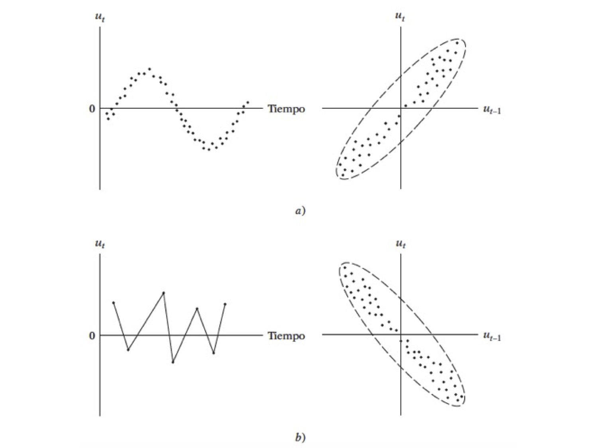

<script type="text/x-mathjax-config">
    MathJax.Hub.Config({ TeX: { equationNumbers: {autoNumber: "all"} } });
  </script>
---
<!--
La revisión metodológica aquí vertida se basa en [@Wang_2012].
-->

```{r setup, include=FALSE}
knitr::opts_chunk$set(echo = TRUE,warning = FALSE,message = FALSE)
knitr::opts_knit$set(root.dir = normalizePath("/Users/victormoralesonate/Documents/Consultorias&Cursos/DataLectures")) 
```

Los contenidos de este material se basa principalemente en @schumacker2015using. Las referencias o extensiones necesarias se citarán conforme se desarrolla el material.

## Supuestos de RLM

#### Librerías usadas en esta sección

```{r}
library(AER)
library(sandwich)
library(lmtest)
library(lmSupport)
```

### Multicolinealidad

#### El problema:

$$
\hat{\beta}=(X'X)^{-1}X'Y
$$
- Se tiene un problema en cuanto a la transpuesta de la matriz $(X'X)$

- Perfecta: Si se tiene este tipo, el modelo simplemente no toma en cuenta esta variable
- Imperfecta: El cáclulo de la inversa es computacionalmente exigente


#### Posibles causas

- El método de recolección de información
- Restricciones en el modelo o en la población objeto de muestreo
- Especificación del modelo	
- Un modelo sobredetermindado
- Series de tiempo

#### ¿Cuál es la naturaleza de la multicolinealidad?

**Causas**
- ¿Cuáles son sus consecuencias prácticas?

**Incidencia en los errores estándar y sensibilidad**

- ¿Cómo se detecta?

**Pruebas**


#### ¿Qué medidas pueden tomarse para aliviar el problema de multicolinealidad?

- No hacer nada
- Eliminar variables
- Transformación de variables
- Añadir datos a la muestra
- Componentes principales, factores, entre otros

#### ¿Cómo se detecta?

- Un $R^{2}$ elevado pero con pocas razones $t$ significativas
- Regresiones auxiliares (Pruebas de Klein)
- Factor de inflación de la varianza
$$
VIF = \frac{1}{(1-R^2)}
$$

#### Ejemplo 1

- Haremos uso del paquete AER
- Abrir la tabla 10.8
- Ajusta el modelo

donde 

- $X_1$ índice implícito de deflación de precios para el PIB, 
- $X_2$ es el PIB (en millones de dólares), 
- $X_3$ número de desempleados (en miles), 
- $X_4$ número de personas enlistadas en las fuerzas armadas, 
- $X_5$ población no institucionalizada mayor de 14 años de edad
- $X_6$ año (igual a 1 para 1947, 2 para 1948 y 16 para 1962).

$$
Y_{i} = \beta_{0}+\beta_{1}X_{1}+\beta_{2}X_{2}+\beta_{3}X_{3} + \beta_{4}X_{4}+\beta_{5}X_{5}+u_{i}\nonumber
$$

- Analice los resultados


```{r,echo=TRUE,warning=FALSE,message=FALSE}
uu <- "https://raw.githubusercontent.com/vmoprojs/DataLectures/master/tabla10_8.csv"
datos<- read.csv(url(uu),sep=";",header=TRUE)
```

Agreguemos el tiempo:
 - Las correlaciones muy altas también suelen ser síntoma de multicolinealidad

```{r}
ajuste.2 <- lm(Y~X1+X2+X3+X4+X5+TIME,data = datos)
summary(ajuste.2)

with(datos,cor(cbind(X1,X2,X3,X4,X5,TIME)))
```

- Prueba de Klein: Se basa en realizar regresiones auxiliares de *todas contra todas* las variables regresoras.
- Si el $R^{2}$ de la regresión aux es mayor que la global, esa variable regresora podría ser la que genera multicolinealidad
- ¿Cuántas regresiones auxiliares se tiene en un modelo en general?


Regresemos una de las variables
```{r}
ajuste.3<- lm(X1~X2+X3+X4+X5+TIME,data = datos)
summary(ajuste.3)

tolerancia<-1-0.9923
```


**Factor de inflación de la varianza**

Si este valor es mucho mayor que 10 y se podría concluir que si hay multicolinealidad

```{r}
vif <- 1/tolerancia
vif
```

Ahora vamos a usar el paquete `AER`:
```{r,message=FALSE,warning=FALSE}
library(AER)
```


```{r}
vif1 <- vif(ajuste.2)
Raux <- (vif1-1)/vif1
Rglobal <- 0.9955

Rglobal-Raux
```


Se podría no hacer nada ante este problema. O se puede tratar con transformaciones. Deflactamos el PIB: `PIB_REAL <- X2/X1`

```{r}
# La variable X5 (población) 
# esta correlacionada con el tiempo
PIB_REAL <- datos$X2/datos$X1
ajuste.4<-lm(Y~PIB_REAL+X3+X4, data = datos)
summary(ajuste.4)
vif(ajuste.4)

ajuste.5<-lm(Y~PIB_REAL+X3+X4,data = datos)
summary(ajuste.5)
vif(ajuste.5)
```

### Heterocedasticidad

Ocurre cuando la varianza no es constante.

¿Cuál es la naturaleza de la heterocedasticidad?

- Modelos de aprendizaje de los errores: con el paso del tiempo, las personas cometen menos errores de comportamiento. Es decir que la varianza disminuye.
- Ingreso direccional: Es probable que la varianza aumente con el ingreso dado que el aumento del ingreso se tiene más opciones del cómo disponer de él.


- Técnicas de recolección de datos: si la técnica mejora, es probable que la varianza se reduzca.
- Datos atípicos o aberrantes: Sensibilidad en las estimaciones 
- Especificaciones del modelo: Omisión de variables importantes en el modelo.
- Asimentría: Surge a partir de la distribución de una o más regresoras en el modelo. Ejemplo: Distribución del ingreso *generalmente inequitativo*


#### ¿Cómo detectarla?

Método gráfico


Veamos las pruebas de detección en un ejemplo

- Abrir la base de datos *wage1* de Wooldrigde

```{r,echo=TRUE,message=FALSE,warning=FALSE}
uu <- "https://raw.githubusercontent.com/vmoprojs/DataLectures/master/wage1.csv"
datos <- read.csv(url(uu),header=FALSE)
names(datos) <- c("wage",  "educ",  "exper",  "tenure",    
               "nonwhite",	"female",	"married",	
               "numdep",	"smsa",	"northcen",	"south",
               "west",	"construc",	"ndurman",	"trcommpu",
               "trade",	"services",	"profserv",	"profocc",
               "clerocc",	"servocc",	"lwage",	"expersq",
               "tenursq")

casados <- (1-datos$female)*datos$married  # female 1=mujer  married=1 casado
casadas <- (datos$female)*datos$married
solteras <- (datos$female)*(1-datos$married)
solteros <- (1-datos$female)*(1-datos$married)
```

- Correr el modelo
$$
lwage = \beta_{0}+\beta_{1}casados+\beta_{2}casadas+\beta_{3}solteras +\beta_{4}educ+\beta_{5}exper+\beta_{6}expersq +\beta_{7}tenure+\beta_{8}tenuresq+u_{i}
$$
- Hacer un gráfico de los valores  estimados y los residuos al cuadrado


### Prueba de Breusch Pagan

- Correr un modelo de los residuos al cuadrado regresado en las variables explicativas del modelo global.
$$
sqresid = \beta_{0}+\beta_{1}casados+\beta_{2}casadas+\beta_{3}solteras +\beta_{4}educ+\beta_{5}exper+\beta_{6}expersq +\beta_{7}tenure+\beta_{8}tenuresq+u_{i}
$$
- `bptest(objeto)`: si el pvalor es inferior a $0.05$, `Ho: Homocedasticidad`


El códgio en `R` es:

```{r,message=FALSE,warning=FALSE}
ajuste1 <- lm(lwage~casados+casadas+solteras+educ+exper+
                  expersq+tenure+tenursq,data = datos)

summary(ajuste1)
residuos <- resid(ajuste1)
sqresid <- residuos^2
y_techo <- fitted(ajuste1)
plot(y_techo,sqresid) 

plot(fitted(ajuste1),resid(ajuste1))

# Usando el "default" de R:
par(mfrow=c(2,2))
plot(ajuste1)
par(mfrow=c(1,1))


library(sandwich)
library(lmtest)
#install.packages("lmSupport")
library(lmSupport)

# Test para ver si hay heterocedasticidad
residuos <- resid(ajuste1)
sqresid <- (residuos)^2
ajuste2 <- lm(sqresid~casados+casadas+solteras+educ+exper+expersq+tenure+tenursq,data = datos)
summary(ajuste2)


# F =1.662 y pvalue=0.105 NO EXISTE HETEROCEDASTICIDAD
#Breusch-Pagan test

'bptest es igual a hettest en STATA'
bptest(ajuste1)
```

Para estimar errores robustos (como `robust` en stata):

```{r}
coeftest(ajuste1, vcovHC(ajuste1,"HC0"))
```


### Autocorrelación


- ¿Cuál es la naturaleza de la autocorrelación?
- ¿Cuáles son las consecuencias teóricas y prácticas de la autocorrelación?
- ¿Cómo remediar el problema de la autocorrelación?

> *Autocorrelación:* correlación entre miembros de series de observaciones ordenadas en el tiempo [como en datos de series de tiempo] o en el espacio [como en datos de corte transversal]:

$$
E(u_i,u_j) \neq 0 \\
i \neq j
$$
El supuesto es:
$$
cov(u_i,u_j|x_i,x_j)  = E(u_i,u_j) = 0 \\
i \neq j
$$


- Datos atípicos o aberrantes: Sensibilidad en las estimaciones 
- Especificaciones del modelo: Omisión de variables importantes en el modelo.
- Asimentría: Surge a partir de la distribución de una o más regresoras en el modelo. Ejemplo: Distribución del ingreso *generalmente inequitativo*


#### Cómo detectarla sesgos de especificación

Método gráfico




Veamos las pruebas de detección en un ejemplo

#### Ejemplo

Abrir la `tabla 12.4`. Veamos los datos en forma gráfica, y corramos el modelo:

- Y, índices de remuneración real por hora
- X, producción por hora X

```{r,echo=TRUE,warning=FALSE,message=FALSE}
uu <- "https://raw.githubusercontent.com/vmoprojs/DataLectures/master/tabla12_4.csv"
datos1<- read.csv(url(uu), sep=";",dec=".", header=T)
```

```{r}
#Indice de compensacion real (salario real)
plot(datos1$X,datos1$Y)

ajuste.indice<-lm(Y~X,data = datos1)
summary(ajuste.indice)
```


Revisemos si hay autocorelación:

```{r}
residuos<- resid(ajuste.indice)
plot(residuos,t="l",xlab="Tiempo")
par(mfrow = c(2,2))
plot(ajuste.indice)
par(mfrow = c(1,1))
```

-   Los datos NO DEBEN TENER UN PATRON (si tienen patron, algo anda mal)
-   En este caso se tiene un curva cuadrática, el modelo podría estar mal especificado.
-   Podría ser que el modelo no se lineal o estar correlacionado


Veamos si se trata de una función cuadrática y cúbica

```{r}
ajuste2 <- lm(Y~X+I(X^2),data = datos1)
summary(ajuste2)

ajuste3 <- lm(Y~X+I(X^2)+I(X^3),data = datos1)
summary(ajuste3)
```


Nos quedamos con el `ajuste2`.

El gráfico de los valores ajustados, muestra que se ha eliminado el patron inicial

```{r}
par(mfrow = c(2,2))
plot(ajuste2)  
par(mfrow = c(1,1))

residuos2 <- resid(ajuste2)
plot(residuos2,t="l",xlab="Tiempo")
points(residuos2)
abline(h=0,col="blue")
```


¿Cómo debe ser el gráfico?

```{r}
aleatorios=rnorm(40,0,1)
plot(aleatorios,t="l",xlab="Tiempo")
points(aleatorios)
abline(h=0,col="blue")
```

¿Se parece?

Ejemplo: Pruebas


> $H_o$: No hay autocorrelación


```{r}
dwtest(ajuste2)
```

¿Cuál es la conclusión?

Otra prueba:

```{r}
# Ajuste Breuch Godfrey (Ho: No hay autocorrelación)
bgtest(ajuste2,order=4)
```


## Análisis Discriminante

#### Librerías usadas en esta técnica

```{r}
library(car)
library(vegan)
library(mvnormtest)
library(MASS)
library(klaR)
```


<!-- https://rpubs.com/gabrielmartos/discriminantR -->

El **análisis discriminante lineal (LDA)** y el discriminante lineal de Fisher relacionado son métodos utilizados en estadística, reconocimiento de patrones y aprendizaje automático para **encontrar una combinación lineal de características** que separa **dos o más clases de objetos o eventos**. La combinación resultante se puede usar como un clasificador lineal o, más comúnmente, para la **reducción de dimensionalidad antes de la clasificación posterior**.


Considere un conjunto de observaciones $x$ (también llamadas características, atributos, variables o medidas) para cada muestra de un objeto o evento con una clase conocida $y\in \{0,1\}$. Este conjunto de muestras se llama **conjunto de entrenamiento**. El problema de clasificación es **encontrar un buen predictor** para la clase $y$ de cualquier muestra de la misma distribución (no necesariamente del conjunto de entrenamiento), dado solo una observación $x$.


### Objetivos

-   Determinar si existen diferencias significativas entre los perfiles de un conjunto de variables de dos o más grupos definidos a priori.

-   Determinar cuál de las variables independientes cuantifica mejor las diferencias entre un grupo u otro.

-   Establecer un procedimiento para clasificar a un individuo en base a los valores de un conjunto de variables independientes.


### Posibles aplicaciones

-   **Predicción de bancarrota**: en la predicción de bancarrota basada en razones contables y otras variables financieras, el análisis discriminante lineal fue el primer método estadístico aplicado para explicar sistemáticamente qué empresas entraron en bancarrota vs. sobrevivieron.

-   **Comercialización**: en marketing, el análisis discriminante solía utilizarse para determinar los factores que distinguen diferentes tipos de clientes y/o productos sobre la base de encuestas u otras formas de datos recopilados.

-   **Estudios biomédicos**: la principal aplicación del análisis discriminante en medicina es la evaluación del estado de gravedad de un paciente y el pronóstico del desenlace de la enfermedad. Por ejemplo, durante el análisis retrospectivo, los pacientes se dividen en grupos según la gravedad de la enfermedad, forma leve, moderada y grave. Luego, se estudian los resultados de los análisis clínicos y de laboratorio para revelar las variables que son estadísticamente diferentes en los grupos estudiados. Usando estas variables, se construyen funciones discriminantes que ayudan a clasificar objetivamente la enfermedad en un futuro paciente en una forma leve, moderada o severa.

### Comparación con otras técnicas

La técnica más común para establecer relaciones, predecir y explicar variables son las técnicas de regresión. **El problema está cuando la variable a explicar no es una variable medible (o métrica)**; en este caso existen dos tipos de análisis con los que resolver el problema, el análisis discriminante y la regresión logística. En ambos análisis tendremos una variable dependiente categórica y varias variables independientes numéricas. 

En muchas ocasiones la variable categórica consta de dos grupos o clasificaciones (por ejemplo, bancarrota-no bancarrota). En otras situaciones la variable categórica tendrá tres o más subgrupos (e.g. bajo, medio y alto nivel de cierta dosis). La regresión logística o logito, en su forma básica está restringida a dos grupos frente al análisis discriminante que vale para más de dos.

### Supuestos

-   La *variable dependiente* (grupos) debe ser categórica en la que el número de grupos puede ser de dos o más, pero han de ser **mutuamente excluyentes y exhaustivos**. Aunque la variable dependiente puede ser originariamente numérica y que el investigador la cuantifique en términos de categorías.

-   Las *variables independientes* numéricas se seleccionan identificando las variables en una investigación previa o mediante información a priori, de tal manera que se sepa que esas variables son importantes para predecir en qué grupo estará la variable dependiente. Se puede utilizar el análisis cluster para formar los grupos, pero se recomienda seguir los siguientes pasos: dividir los datos en 2 grupos, aplicar el análisis cluster en uno de ellos y utilizar los resultados en el DA para el segundo grupo de datos.

-   Con respecto al *tamaño de las muestras*, se suele recomendar que los tamaños de cada grupo no sean muy diferentes, ya que con esto la probabilidad de pertenecer a un grupo o a otro puede variar considerablemente. Se necesita que al menos tengamos 4 o 5 veces más observaciones por grupo que el número de variables que utilicemos. Además, el número de observaciones en el grupo más pequeño debe ser mayor que el número de variables.

-   También existen dos hipótesis previas que deben ser contrastadas, estas son: la **normalidad multivariante** y la de la **estructura de varianzas-covarianzas desconocidas pero iguales** (*homogeneidad de varianzas* entre grupos). Los datos que no cumplen el supuesto de normalidad pueden causar problemas en la estimación y en ese caso se sugiere utilizar la regresión logística. Si existen grandes desviaciones en las varianzas, se puede solucionar con la ampliación de la muestra o con técnicas de clasificación cuadráticas. **La homogeneidad de varianzas significa que la relación entre variables debe ser similar para los distintos grupos**. Por tanto, una variable no puede tener el mismo valor para todas las observaciones dentro de un grupo.

-   Los datos además no deben presentar *multicolinealidad*, es decir, que dos o más variables independientes estén muy relacionadas. Si las variables tienen un valor de correlación de $0.9$ o mayor se debe eliminar una de ellas.

-   También se supone *linealidad* entre las variables ya que se utiliza la matriz de covarianza.

Si no se cumplen los supuestos de normalidad y homogeneidad, podemos utilizar una transformación logarítmica o de la raíz cuadrada (entre otras).

### El modelo

El análisis discriminante implica un valor teórico como combinación lineal de dos o más variables independientes que discrimine entre los grupos definidos a priori. La discriminación se lleva a cabo estableciendo las ponderaciones del valor teórico de cada variable, de tal forma que **maximicen la varianza entre-grupos frente a la intra-grupos**. La combinación lineal o función discriminante, toma la siguiente forma: 

$$D_i = a +W_1X_{1,i} +W_2X_{2,i} + \ldots +W_nX_{n,i}$$

donde: $D_i$ es la puntuación discriminante (grupo de pertenencia) del individuo i-ésimo; a es una constante; $W_j$ es la ponderación de la variable j-ésima. El resultado de esta función será para un conjunto de variables $X1, \ldots,Xn$ un valor de $D$ que discrimine al individuo en un grupo u otro. Destacamos que el análisis discriminante **proporcionará una función discriminate menos que los subgrupos que tengamos**, es decir, si la variable categórica tiene dos subgrupos, obtendremos una función discriminante, si tiene tres subgrupos obtendremos dos y así sucesivamente. 

### Ejemplo 1: clasificación de vinos

En este primer caso de estudio, el conjunto de datos del vino, tenemos 13 concentraciones químicas que describen muestras de vino de tres cultivos.


```{r}
library(car)
# install.packages('rattle')
uu <- "https://gist.githubusercontent.com/tijptjik/9408623/raw/b237fa5848349a14a14e5d4107dc7897c21951f5/wine.csv"
wine <- read.csv(url(uu))
head(wine)
scatterplotMatrix(wine[2:6])
```

El propósito del análisis discriminante lineal (LDA) en este ejemplo es encontrar las combinaciones lineales de las variables originales (las 13 concentraciones químicas aquí) que proporcionan la mejor separación posible entre los grupos (variedades de vino aquí) en nuestro conjunto de datos. El análisis discriminante lineal también se conoce como **análisis discriminante canónico**, o simplemente **análisis discriminante**.


### Supuestos:

**Homogeneidad de varianzas multivariante**

```{r}
library(vegan)
# seleccionamos las variables ambientales a analizar 
env.pars2 <- as.matrix(wine[, 2:14])
# verificamos la homogeneidad multivariada de las matrices de covarianza intra-grupo
env.pars2.d1 <- dist(env.pars2)
env.MHV <- betadisper(env.pars2.d1, wine$Wine)
anova(env.MHV)
permutest(env.MHV)
```

*Conclusión*: rechazo la hipótesis nula de homogeneidad intra-grupo. Se podría hacer transformaciones logarítmicas para enfrentar este asunto.


**Normalidad multivariante**

```{r}
library(mvnormtest)
mshapiro.test(t(env.pars2))
```

Rechazamos la $H_o$ de normalidad multivariante


**Multicolinealidad**

```{r}
as.dist(cor(env.pars2))
```


```{r}
library(MASS)
wine.lda <- lda(Wine ~ ., data=wine)
wine.lda
```


Esto significa que la primera función discriminante es una combinación lineal de las variables: 
$$-0.403*Alcohol + 0.165*Malic \dots - 0.003*Proline$$. 

Por conveniencia, el valor de cada función discriminante (por ejemplo, la primera función discriminante) se escala de modo que su valor medio sea cero y su varianza sea uno.

La *proporción de traza* que se imprime cuando escribe `wine.lda` (la variable devuelta por la función `lda()`) es la separación porcentual lograda por cada función discriminante. Por ejemplo, para los datos del vino obtenemos los mismos valores que acabamos de calcular ($68.75\%$ y $31.25\%$).


**Histrogramas de resultado**

Una buena forma de mostrar los resultados de un análisis discriminante lineal (LDA) es hacer un histograma apilado de los valores de la función discriminante para las muestras de diferentes grupos (diferentes variedades de vino en nuestro ejemplo).

Podemos hacer esto usando la función `ldahist()` en `R`. Por ejemplo, para hacer un histograma apilado de los valores de la primera función discriminante para muestras de vino de los tres diferentes cultivares de vino, escribimos:

```{r}
wine.lda.values <- predict(wine.lda)
ldahist(data = wine.lda.values$x[,1], g=wine$Wine)
```


usando la segunda función discriminante:

```{r}
ldahist(data = wine.lda.values$x[,2], g=wine$Wine)
```


**Gráficos de las funciones discriminantes**

```{r}
plot(wine.lda.values$x[,1],wine.lda.values$x[,2]) # se realiza el grafico
text(wine.lda.values$x[,1],wine.lda.values$x[,2],wine$Wine,cex=0.7,pos=4,col="red") # agregamos etiiquetas


spe.class <- predict(wine.lda)$class
(spe.table <-table(wine$Wine, spe.class))
```


### Ejemplo 2: Admisiones

El conjunto de datos proporciona datos de admisión para los solicitantes a las escuelas de posgrado en los negocios. El objetivo es usar los puntajes de GPA y GMAT para predecir la probabilidad de admisión (admitir, no admitir y límite).


```{r}
url <- 'http://www.biz.uiowa.edu/faculty/jledolter/DataMining/admission.csv'
admit <- read.csv(url)

head(admit)
```

Realizamos un gráfico de los datos:

```{r}
adm <- data.frame(admit)
plot(adm$GPA,adm$GMAT,col=adm$De)
```


### Supuestos:

**Homogeneidad de varianzas multivariante**

```{r}
library(vegan)
# seleccionamos las variables ambientales a analizar 
env.pars2 <- as.matrix(adm[, 1:2])
# verificamos la homogeneidad multivariada de las matrices de covarianza intra-grupo
env.pars2.d1 <- dist(env.pars2)
env.MHV <- betadisper(env.pars2.d1, adm$De)
anova(env.MHV)
permutest(env.MHV)
```

Conclusión: no rechazo la hipótesis nula de homogeneidad intra-grupo. 

**Normalidad multivariante**

```{r}
library(mvnormtest)
mshapiro.test(t(env.pars2))
```

No rechazamos la $H_o$ de normalidad multivariante


**Multicolinealidad**

```{r}
as.dist(cor(env.pars2))
```


```{r}
library(MASS)
m1 <- lda(De~.,adm)
m1
```


Comenta los resultados.

Realizamos una predicción:

```{r}
predict(m1,newdata=data.frame(GPA=3.21,GMAT=497))
```


**Análisis discrimante cuadrático**: Se trata de un procedimiento más robusto que el lineal, y es útil **cuando las matrices de covarianza no son iguales**. Se basa en la distancia de Mahalanobis al cuadrado respecto al centro del grupo.

```{r}
m2 <- qda(De~.,adm)
m2
```

Realizamos la predicción

```{r}
predict(m2,newdata=data.frame(GPA=3.21,GMAT=497))
```


**¿Qué modelo es el mejor?** 

Para responder a esta pregunta, evaluamos el análisis discriminante lineal seleccionando aleatoriamente $60$ de $85$ estudiantes, estimando los parámetros en los datos de entrenamiento y clasificando a los $25$ estudiantes restantes de la muestra retenida. Repetimos esto $100$ veces

```{r}
n <- 85
nt <- 60
neval <-n-nt
rep <- 100

### LDA
set.seed(123456789)
errlin <- dim(rep)
for (k in 1:rep) {
train <- sample(1:n,nt)
## linear discriminant analysis
m1 <- lda(De~.,adm[train,])
predict(m1,adm[-train,])$class
tablin <- table(adm$De[-train],predict(m1,adm[-train,])$class)
errlin[k] <- (neval-sum(diag(tablin)))/neval
}
merrlin <- mean(errlin) #media del error lineal
merrlin
```


Ahora en el QDA:

```{r}
### QDA
set.seed(123456789)
errqda <- dim(rep)
for (k in 1:rep) {
train <- sample(1:n,nt)
## quadratic discriminant analysis
m1 <- qda(De~.,adm[train,])
predict(m1,adm[-train,])$class
tablin <- table(adm$De[-train],predict(m1,adm[-train,])$class)
errqda[k] <- (neval-sum(diag(tablin)))/neval
}
merrqda <- mean(errlin)
merrqda
```

Logramos una tasa de clasificación errónea del $10.2\%$ en ambos casos. `R` también nos da algunas herramientas de visualización. Por ejemplo en la librería `klaR`:

```{r}
# Gráficos exploratorios para LDA or QDA
#install.packages('klaR')
library(klaR)
partimat(De~.,data=adm,method="lda") 
partimat(De~.,data=adm,method="qda") 
```


### Ejemplo 3: Score de crédito de un banco alemán


El conjunto de datos de crédito alemán se obtuvo del [Repositorio de aprendizaje automático UCI](https://archive.ics.uci.edu/ml/index.php). El conjunto de datos, que contiene atributos y resultados sobre 1000 solicitudes de préstamo, fue proporcionado en 1994 por el Profesor Dr. Hans Hofmann del Institut fuer Statistik und Oekonometrie de la Universidad de Hamburgo. Ha servido como un importante conjunto de datos de prueba para varios algoritmos de puntuación de crédito. Una descripción de las variables se da en `germancreditDescription.docx` de `DataLectures`. Comenzamos cargando los datos:


```{r}
## read data 
credit <- read.csv("http://www.biz.uiowa.edu/faculty/jledolter/DataMining/germancredit.csv")
head(credit,2) # Mira la codificación en el lugar indicado
```

Como se puede ver, solo las variables: duración, cantidad, plazos y edad son numéricas. Con los restantes (indicadores) los supuestos de una distribución normal serían, en el mejor de los casos, débiles; por lo tanto, estas variables no se consideran aquí.


```{r}
cred1 <- credit[, c("Default","duration","amount","installment","age")]
head(cred1)
summary(cred1)
```

Transformemos los datos en un data.frame


```{r}
cred1 <- data.frame(cred1)
```


-   Realiza las pruebas de los supuestos y comenta los resultados
-   Estima y compara lda con qda
-   Estima la matriz de confusión
-   ¿Usarías este modelo para una aplicación real?


## Análisis de correlación canónica (CCA)

Para ilustrar el método vamos a usar el ejemplo 10.2.3 con el conjunto de datos de la tabla 5.1.1 de @mardia1979.

Los datos son:

-   $l_1$: longitud de la cabeza del primer hijo
-   $l_2$: longitud de la cabeza del segundo hijo
-   $b_1$: amplitud (*breadth*) de la cabeza del primer hijo
-   $b_2$: amplitud (*breadth*) de la cabeza del segundo hijo


Supongamos que $\boldsymbol{x}$ es un vector aleatorio de dimensión $q$ y $\boldsymbol{y}$ es un vector aleatorio de dimensión $p$. También supongamos que $\boldsymbol{x}$ e $\boldsymbol{y}$  tienen medias $\boldsymbol{\mu}$ y $\boldsymbol{\nu}$, y que 

$$
E \left \{(\boldsymbol{x-\mu})(\boldsymbol{x-\mu})' \right\} = \boldsymbol{\Sigma}_{11}
$$

$$
E \left \{(\boldsymbol{y-\mu})(\boldsymbol{y-\mu})' \right\} = \boldsymbol{\Sigma}_{22}
$$

$$
E \left \{(\boldsymbol{x-\mu})(\boldsymbol{y-\mu})' \right\} = \boldsymbol{\Sigma}_{12}=\boldsymbol{\Sigma}_{21}
$$

En `R`, usando estos datos tenemos:

```{r}
uu = "http://www1.maths.leeds.ac.uk/~charles/mva-data/headlengthandbreadth.dat"
datos = read.csv(url(uu),sep = "")

fz <- function(x)
{
  return ( (x-mean(x))/sd(x))
}

datos = apply(datos,2,fz)

(S11 = cov(datos[,1:2]))
(S22 = cov(datos[,3:4]))
(S12 = S21 = cov(datos[,])[1:2,3:4])
```

Ahora consideramos las dos combinaciones lineales $\eta = \boldsymbol{a'x}$ y $\phi = \boldsymbol{b'y}$. La correlación entre $\eta$ y $\phi$ es

$$
\rho(\boldsymbol{a,b}) = \frac{\boldsymbol{a'\Sigma_{12}b}}{(\boldsymbol{a'\Sigma_{11}ab'\Sigma_{22}b})^{1/2}}
$$
La notación $\rho(\boldsymbol{a,b})$ se usa para enfatizar que la correlación cambia según los valores elegidos de $\boldsymbol{a}$ y $\boldsymbol{b}$.

El objetivo es encontrar los vectores $\boldsymbol{a}$ y $\boldsymbol{b}$ que **maximizan** $\rho(\boldsymbol{a,b})$, que es equivalente a


$$
max_{\boldsymbol{a,b}} \boldsymbol{a'\Sigma_{12}b}
$$
sujeto a 

$$
\boldsymbol{a'\Sigma_{11}a} = \boldsymbol{b'\Sigma_{22}b}=1
$$
**Solución**

Sea 

$$
\boldsymbol{K = \Sigma_{11}^{-1}\Sigma_{12}\Sigma_{22}^{-1}}
$$

En `R`

```{r}
K = eigen(S11)$vectors %*% sqrt(solve(diag(eigen(S11)$values))) %*% solve(eigen(S11)$vectors) %*%
  S12 %*%
  eigen(S22)$vectors %*% sqrt(solve(diag(eigen(S22)$values))) %*% solve(eigen(S22)$vectors)
```


Ahora fijamos $\boldsymbol{N_1 = KK'}$ y $\boldsymbol{N_2 = K'K}$ y 

$$
\boldsymbol{M_1 = \Sigma_{11}^{-1}N_{1}\Sigma_{11}^{-1}} 
$$
$$
\boldsymbol{M_2 = \Sigma_{22}^{-1}N_{2}\Sigma_{22}^{-1}} 
$$


En `R`

```{r}
(N1 = K%*%t(K))
(N2 = t(K)%*%(K))


(M1 = solve(S11)%*%S12%*%solve(S22)%*%S21)
(M2 = solve(S22)%*%S21%*%solve(S11)%*%S12)
```

**Definición**

Sea $\boldsymbol{a}_i = \boldsymbol{\Sigma_{11}^{-1/2}\alpha_{i}}$ y $\boldsymbol{b}_i = \boldsymbol{\Sigma_{22}^{-1/2}\beta_{i}}$ para $i = 1\ldots k$ ($k = rank(\boldsymbol{K})$), entonces

a.  Los vectores $\boldsymbol{a}_i$ y $\boldsymbol{b}_i$ son los iésimos **vectores canónicos** para $\boldsymbol{x}$ y $\boldsymbol{y}$ respectivamente.

b.  $\boldsymbol{\alpha_i}$ y $\boldsymbol{\beta_i}$ son los vectores propios de $\boldsymbol{N_1}$ y $\boldsymbol{N_2}$ respectivamente.

c.  Las variables aleatorias $\eta_i=\boldsymbol{a_1'x}$ y $\phi_i=\boldsymbol{b_1'y}$ son las iésimas **variables de correlación canónicas**.

d.  $\rho_i=\lambda_i^{1/2}$ es e iésimo **coeficiente de correlación canónico**.

En `R`

```{r}
#a_1 a_2
eigen(S11)$vectors %*% sqrt(solve(diag(eigen(S11)$values))) %*% solve(eigen(S11)$vectors)%*%
  eigen(N1)$vectors

#b_1 b_2
eigen(S22)$vectors %*% sqrt(solve(diag(eigen(S22)$values))) %*% solve(eigen(S22)$vectors)%*%
  eigen(N2)$vectors
```


De tal manera que las primeras variables de correlación canónica son

$$
\eta_1 = -0.552l_1-0.522b_1
$$
 y 
 
$$
\phi_1 = 0.505l_2+0.538b_2
$$

Los coeficientes de correlación canónica son:

```{r}
sqrt(eigen(M1)$values) # Canonical correlation coefficients
```


### Supuestos

-   Normalidad (uni y multivariante dentro de $\boldsymbol{x}$ e $\boldsymbol{y}$)
-   Linealidad (la no linealidad afecta las correlaciones)
-   Igual varianza

Note que este método no refleja relaciones no lineales en los datos.

### Un ejemplo en R

Usamos los datos `LifeCyclesSavings` para examinar ratio de ahorros (ahorros/ingreso) del ciclo de vida  desde 1960 hasta 1970.

El conjunto de datos tiene 50 observaciones y 5 variables: 

-   sr = aggregate personal savings; 
-   pop15 = % population under 15; 
-   pop75 = % population over 75; 
-   dpi = disposable income; 
-   ddpi = % growth rate of dpi

```{r}
library(CCA)
?LifeCycleSavings
```

Para correr el análisis de correlación canónica, primero investiguemos más de la función `cancor()`

```{r}
?cancor
```

Veamos los datos

```{r}
data("LifeCycleSavings")
head(LifeCycleSavings)
```

El análisis

```{r}
pop <- LifeCycleSavings[,2:3]
oec <- LifeCycleSavings[,-(2:3)]
cancor(pop,oec)
```


Ahora usaremos el paquete `CCA` para obtener las matrices de correlación canónica

```{r}
library(CCA)
matcor(pop,oec)
```

Ahora las correlaciones canónicas para función canónica

```{r}
(res.cc <- cc(pop,oec))
```

Una evaluación visual

```{r}
plt.cc(res.cc, type ="i")  # argumento type ="i" imprime los países individualmente
```


Los cuatro cuadrantes muestran una agrupación de los países en función de su índice de ahorro del ciclo de vida (ahorro personal dividido por el ingreso disponible) de 1960 a 1970. Japón tiene una proporción más alta en la primera dimensión que Irlanda, por lo que Japón está ahorrando más que lo que gasta.

### Significancia


```{r}
library(yacca)
cca.fit <- cca(pop,oec)
F.test.cca(cca.fit)
```


La primera correlación canónica, $r = .82$, es estadísticamente significativa ($F = 13.49$, $df = 6.90$, $p <.0001$). La segunda correlación canónica no informa una prueba $F$, lo cual no es infrecuente en el análisis de correlación canónica, ya que la primera variante canónica suele ser la única que es estadísticamente significativa.

# Referencias

