-   [Supuestos de RLM](#supuestos-de-rlm)
-   [Análisis Discriminante](#analisis-discriminante)
-   [Análisis de correlación canónica
    (CCA)](#analisis-de-correlacion-canonica-cca)
-   [Análisis de componentes
    principales](#analisis-de-componentes-principales)
-   [Análisis Factorial](#analisis-factorial)
-   [Referencias](#referencias)

------------------------------------------------------------------------

<!--
La revisión metodológica aquí vertida se basa en [@Wang_2012].
-->
Los contenidos de este material se basa principalemente en Schumacker
(2015). Las referencias o extensiones necesarias se citarán conforme se
desarrolla el material.

Supuestos de RLM
----------------

#### Librerías usadas en esta sección

    library(AER)
    library(sandwich)
    library(lmtest)
    library(lmSupport)

### Multicolinealidad

#### El problema:

*β̂* = (*X*′*X*) − 1*X*′*Y*
 - Se tiene un problema en cuanto a la transpuesta de la matriz
(*X*′*X*)

-   Perfecta: Si se tiene este tipo, el modelo simplemente no toma en
    cuenta esta variable
-   Imperfecta: El cáclulo de la inversa es computacionalmente exigente

#### Posibles causas

-   El método de recolección de información
-   Restricciones en el modelo o en la población objeto de muestreo
-   Especificación del modelo
-   Un modelo sobredetermindado
-   Series de tiempo

#### ¿Cuál es la naturaleza de la multicolinealidad?

**Causas** - ¿Cuáles son sus consecuencias prácticas?

**Incidencia en los errores estándar y sensibilidad**

-   ¿Cómo se detecta?

**Pruebas**

#### ¿Qué medidas pueden tomarse para aliviar el problema de multicolinealidad?

-   No hacer nada
-   Eliminar variables
-   Transformación de variables
-   Añadir datos a la muestra
-   Componentes principales, factores, entre otros

#### ¿Cómo se detecta?

-   Un *R*2 elevado pero con pocas razones *t* significativas
-   Regresiones auxiliares (Pruebas de Klein)
-   Factor de inflación de la varianza
    $$
    VIF = \\frac{1}{(1-R^2)}
    $$

#### Ejemplo 1

-   Haremos uso del paquete AER
-   Abrir la tabla 10.8
-   Ajusta el modelo

donde

-   *X*1 índice implícito de deflación de precios para el
    PIB,
-   *X*2 es el PIB (en millones de dólares),
-   *X*3 número de desempleados (en miles),
-   *X*4 número de personas enlistadas en las fuerzas
    armadas,
-   *X*5 población no institucionalizada mayor de 14 años de
    edad
-   *X*6 año (igual a 1 para 1947, 2 para 1948 y 16 para
    1962).

*Y**i* = *β*0 + *β*1*X*1 + *β*2*X*2 + *β*3*X*3 + *β*4*X*4 + *β*5*X*5 + *u**i*

-   Analice los resultados

<!-- -->

    uu <- "https://raw.githubusercontent.com/vmoprojs/DataLectures/master/tabla10_8.csv"
    datos<- read.csv(url(uu),sep=";",header=TRUE)

Agreguemos el tiempo: - Las correlaciones muy altas también suelen ser
síntoma de multicolinealidad

    ajuste.2 <- lm(Y~X1+X2+X3+X4+X5+TIME,data = datos)
    summary(ajuste.2)

    ## 
    ## Call:
    ## lm(formula = Y ~ X1 + X2 + X3 + X4 + X5 + TIME, data = datos)
    ## 
    ## Residuals:
    ##    Min     1Q Median     3Q    Max 
    ## -381.7 -167.6   13.7  105.5  488.9 
    ## 
    ## Coefficients:
    ##               Estimate Std. Error t value Pr(>|t|)   
    ## (Intercept)  6.727e+04  2.324e+04   2.895  0.02005 * 
    ## X1          -2.051e+00  8.710e+00  -0.235  0.81974   
    ## X2          -2.733e-02  3.317e-02  -0.824  0.43385   
    ## X3          -1.952e+00  4.767e-01  -4.095  0.00346 **
    ## X4          -9.582e-01  2.162e-01  -4.432  0.00219 **
    ## X5           5.134e-02  2.340e-01   0.219  0.83181   
    ## TIME         1.585e+03  4.827e+02   3.284  0.01112 * 
    ## ---
    ## Signif. codes:  0 '***' 0.001 '**' 0.01 '*' 0.05 '.' 0.1 ' ' 1
    ## 
    ## Residual standard error: 295.6 on 8 degrees of freedom
    ## Multiple R-squared:  0.9955, Adjusted R-squared:  0.9921 
    ## F-statistic: 295.8 on 6 and 8 DF,  p-value: 6.041e-09

    with(datos,cor(cbind(X1,X2,X3,X4,X5,TIME)))

    ##             X1        X2         X3         X4        X5      TIME
    ## X1   1.0000000 0.9936689  0.5917342  0.4689737 0.9833160 0.9908435
    ## X2   0.9936689 1.0000000  0.5752804  0.4587780 0.9896976 0.9947890
    ## X3   0.5917342 0.5752804  1.0000000 -0.2032852 0.6747642 0.6465669
    ## X4   0.4689737 0.4587780 -0.2032852  1.0000000 0.3712428 0.4222098
    ## X5   0.9833160 0.9896976  0.6747642  0.3712428 1.0000000 0.9957420
    ## TIME 0.9908435 0.9947890  0.6465669  0.4222098 0.9957420 1.0000000

-   Prueba de Klein: Se basa en realizar regresiones auxiliares de
    *todas contra todas* las variables regresoras.
-   Si el *R*2 de la regresión aux es mayor que la global,
    esa variable regresora podría ser la que genera multicolinealidad
-   ¿Cuántas regresiones auxiliares se tiene en un modelo en general?

Regresemos una de las variables

    ajuste.3<- lm(X1~X2+X3+X4+X5+TIME,data = datos)
    summary(ajuste.3)

    ## 
    ## Call:
    ## lm(formula = X1 ~ X2 + X3 + X4 + X5 + TIME, data = datos)
    ## 
    ## Residuals:
    ##      Min       1Q   Median       3Q      Max 
    ## -18.8602  -4.3277  -0.3175   4.3726  14.8438 
    ## 
    ## Coefficients:
    ##               Estimate Std. Error t value Pr(>|t|)  
    ## (Intercept)  1.529e+03  7.288e+02   2.098   0.0653 .
    ## X2           2.543e-03  9.453e-04   2.690   0.0248 *
    ## X3           3.056e-02  1.514e-02   2.019   0.0742 .
    ## X4           1.011e-02  7.559e-03   1.337   0.2140  
    ## X5          -1.263e-02  7.903e-03  -1.598   0.1445  
    ## TIME        -1.621e+01  1.766e+01  -0.918   0.3826  
    ## ---
    ## Signif. codes:  0 '***' 0.001 '**' 0.01 '*' 0.05 '.' 0.1 ' ' 1
    ## 
    ## Residual standard error: 11.31 on 9 degrees of freedom
    ## Multiple R-squared:  0.9923, Adjusted R-squared:  0.9881 
    ## F-statistic: 232.5 on 5 and 9 DF,  p-value: 3.127e-09

    tolerancia<-1-0.9923

**Factor de inflación de la varianza**

Si este valor es mucho mayor que 10 y se podría concluir que si hay
multicolinealidad

    vif <- 1/tolerancia
    vif

    ## [1] 129.8701

Ahora vamos a usar el paquete `AER`:

    library(AER)

    vif1 <- vif(ajuste.2)
    Raux <- (vif1-1)/vif1
    Rglobal <- 0.9955

    Rglobal-Raux

    ##           X1           X2           X3           X4           X5 
    ##  0.003181137 -0.003829181  0.026533869  0.254649059 -0.001623122 
    ##         TIME 
    ## -0.003160352

Se podría no hacer nada ante este problema. O se puede tratar con
transformaciones. Deflactamos el PIB: `PIB_REAL <- X2/X1`

    # La variable X5 (población) 
    # esta correlacionada con el tiempo
    PIB_REAL <- datos$X2/datos$X1
    ajuste.4<-lm(Y~PIB_REAL+X3+X4, data = datos)
    summary(ajuste.4)

    ## 
    ## Call:
    ## lm(formula = Y ~ PIB_REAL + X3 + X4, data = datos)
    ## 
    ## Residuals:
    ##     Min      1Q  Median      3Q     Max 
    ## -760.29 -197.71  -53.69  234.77  603.15 
    ## 
    ## Coefficients:
    ##               Estimate Std. Error t value Pr(>|t|)    
    ## (Intercept) 42716.5646   710.1206  60.154 3.31e-15 ***
    ## PIB_REAL       72.0074     3.3286  21.633 2.30e-10 ***
    ## X3             -0.6810     0.1693  -4.023  0.00201 ** 
    ## X4             -0.8392     0.2206  -3.805  0.00292 ** 
    ## ---
    ## Signif. codes:  0 '***' 0.001 '**' 0.01 '*' 0.05 '.' 0.1 ' ' 1
    ## 
    ## Residual standard error: 389 on 11 degrees of freedom
    ## Multiple R-squared:  0.9893, Adjusted R-squared:  0.9864 
    ## F-statistic: 339.5 on 3 and 11 DF,  p-value: 4.045e-11

    vif(ajuste.4)

    ## PIB_REAL       X3       X4 
    ## 3.054580 2.346489 2.318500

    ajuste.5<-lm(Y~PIB_REAL+X3+X4,data = datos)
    summary(ajuste.5)

    ## 
    ## Call:
    ## lm(formula = Y ~ PIB_REAL + X3 + X4, data = datos)
    ## 
    ## Residuals:
    ##     Min      1Q  Median      3Q     Max 
    ## -760.29 -197.71  -53.69  234.77  603.15 
    ## 
    ## Coefficients:
    ##               Estimate Std. Error t value Pr(>|t|)    
    ## (Intercept) 42716.5646   710.1206  60.154 3.31e-15 ***
    ## PIB_REAL       72.0074     3.3286  21.633 2.30e-10 ***
    ## X3             -0.6810     0.1693  -4.023  0.00201 ** 
    ## X4             -0.8392     0.2206  -3.805  0.00292 ** 
    ## ---
    ## Signif. codes:  0 '***' 0.001 '**' 0.01 '*' 0.05 '.' 0.1 ' ' 1
    ## 
    ## Residual standard error: 389 on 11 degrees of freedom
    ## Multiple R-squared:  0.9893, Adjusted R-squared:  0.9864 
    ## F-statistic: 339.5 on 3 and 11 DF,  p-value: 4.045e-11

    vif(ajuste.5)

    ## PIB_REAL       X3       X4 
    ## 3.054580 2.346489 2.318500

### Heterocedasticidad

Ocurre cuando la varianza no es constante.

¿Cuál es la naturaleza de la heterocedasticidad?

-   Modelos de aprendizaje de los errores: con el paso del tiempo, las
    personas cometen menos errores de comportamiento. Es decir que la
    varianza disminuye.
-   Ingreso direccional: Es probable que la varianza aumente con el
    ingreso dado que el aumento del ingreso se tiene más opciones del
    cómo disponer de él.

-   Técnicas de recolección de datos: si la técnica mejora, es probable
    que la varianza se reduzca.
-   Datos atípicos o aberrantes: Sensibilidad en las estimaciones
-   Especificaciones del modelo: Omisión de variables importantes en el
    modelo.
-   Asimentría: Surge a partir de la distribución de una o más
    regresoras en el modelo. Ejemplo: Distribución del ingreso
    *generalmente inequitativo*

#### ¿Cómo detectarla?

Método gráfico

Veamos las pruebas de detección en un ejemplo

-   Abrir la base de datos *wage1* de Wooldrigde

<!-- -->

    uu <- "https://raw.githubusercontent.com/vmoprojs/DataLectures/master/wage1.csv"
    datos <- read.csv(url(uu),header=FALSE)
    names(datos) <- c("wage",  "educ",  "exper",  "tenure",    
                   "nonwhite",  "female",   "married",  
                   "numdep",    "smsa", "northcen", "south",
                   "west",  "construc", "ndurman",  "trcommpu",
                   "trade", "services", "profserv", "profocc",
                   "clerocc",   "servocc",  "lwage",    "expersq",
                   "tenursq")

    casados <- (1-datos$female)*datos$married  # female 1=mujer  married=1 casado
    casadas <- (datos$female)*datos$married
    solteras <- (datos$female)*(1-datos$married)
    solteros <- (1-datos$female)*(1-datos$married)

-   Correr el modelo
    *l**w**a**g**e* = *β*0 + *β*1*c**a**s**a**d**o**s* + *β*2*c**a**s**a**d**a**s* + *β*3*s**o**l**t**e**r**a**s* + *β*4*e**d**u**c* + *β*5*e**x**p**e**r* + *β*6*e**x**p**e**r**s**q* + *β*7*t**e**n**u**r**e* + *β*8*t**e**n**u**r**e**s**q* + *u**i*
-   Hacer un gráfico de los valores estimados y los residuos al cuadrado

### Prueba de Breusch Pagan

-   Correr un modelo de los residuos al cuadrado regresado en las
    variables explicativas del modelo global.
    *s**q**r**e**s**i**d* = *β*0 + *β*1*c**a**s**a**d**o**s* + *β*2*c**a**s**a**d**a**s* + *β*3*s**o**l**t**e**r**a**s* + *β*4*e**d**u**c* + *β*5*e**x**p**e**r* + *β*6*e**x**p**e**r**s**q* + *β*7*t**e**n**u**r**e* + *β*8*t**e**n**u**r**e**s**q* + *u**i*
-   `bptest(objeto)`: si el pvalor es inferior a 0.05,
    `Ho: Homocedasticidad`

El códgio en `R` es:

    ajuste1 <- lm(lwage~casados+casadas+solteras+educ+exper+
                      expersq+tenure+tenursq,data = datos)

    summary(ajuste1)

    ## 
    ## Call:
    ## lm(formula = lwage ~ casados + casadas + solteras + educ + exper + 
    ##     expersq + tenure + tenursq, data = datos)
    ## 
    ## Residuals:
    ##      Min       1Q   Median       3Q      Max 
    ## -1.89697 -0.24060 -0.02689  0.23144  1.09197 
    ## 
    ## Coefficients:
    ##               Estimate Std. Error t value Pr(>|t|)    
    ## (Intercept)  0.3213780  0.1000090   3.213 0.001393 ** 
    ## casados      0.2126756  0.0553572   3.842 0.000137 ***
    ## casadas     -0.1982677  0.0578355  -3.428 0.000656 ***
    ## solteras    -0.1103502  0.0557421  -1.980 0.048272 *  
    ## educ         0.0789103  0.0066945  11.787  < 2e-16 ***
    ## exper        0.0268006  0.0052428   5.112 4.50e-07 ***
    ## expersq     -0.0005352  0.0001104  -4.847 1.66e-06 ***
    ## tenure       0.0290875  0.0067620   4.302 2.03e-05 ***
    ## tenursq     -0.0005331  0.0002312  -2.306 0.021531 *  
    ## ---
    ## Signif. codes:  0 '***' 0.001 '**' 0.01 '*' 0.05 '.' 0.1 ' ' 1
    ## 
    ## Residual standard error: 0.3933 on 517 degrees of freedom
    ## Multiple R-squared:  0.4609, Adjusted R-squared:  0.4525 
    ## F-statistic: 55.25 on 8 and 517 DF,  p-value: < 2.2e-16

    residuos <- resid(ajuste1)
    sqresid <- residuos^2
    y_techo <- fitted(ajuste1)
    plot(y_techo,sqresid) 

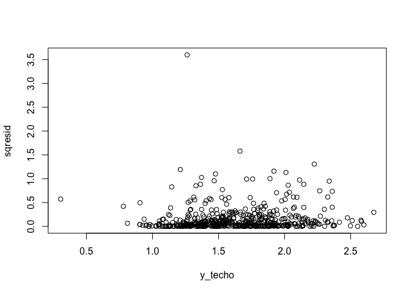

    plot(fitted(ajuste1),resid(ajuste1))

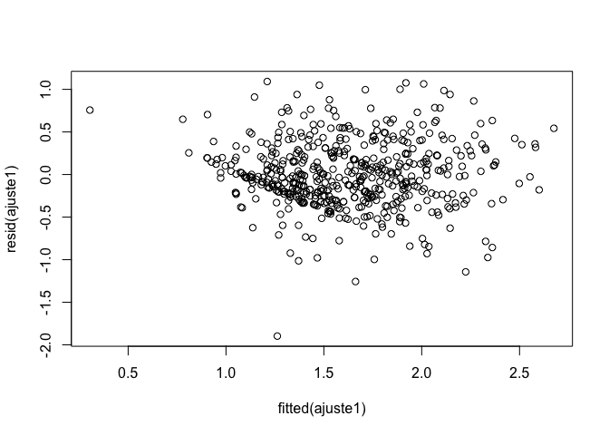

    # Usando el "default" de R:
    par(mfrow=c(2,2))
    plot(ajuste1)

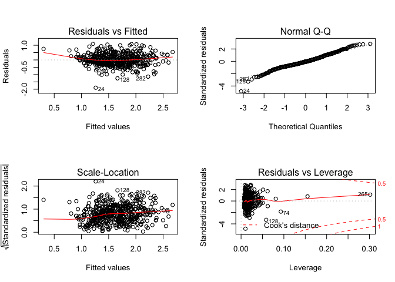

    par(mfrow=c(1,1))

    library(sandwich)
    library(lmtest)
    #install.packages("lmSupport")
    library(lmSupport)

    # Test para ver si hay heterocedasticidad
    residuos <- resid(ajuste1)
    sqresid <- (residuos)^2
    ajuste2 <- lm(sqresid~casados+casadas+solteras+educ+exper+expersq+tenure+tenursq,data = datos)
    summary(ajuste2)

    ## 
    ## Call:
    ## lm(formula = sqresid ~ casados + casadas + solteras + educ + 
    ##     exper + expersq + tenure + tenursq, data = datos)
    ## 
    ## Residuals:
    ##     Min      1Q  Median      3Q     Max 
    ## -0.2346 -0.1237 -0.0887  0.0202  3.4689 
    ## 
    ## Coefficients:
    ##               Estimate Std. Error t value Pr(>|t|)   
    ## (Intercept)  5.029e-02  6.893e-02   0.729  0.46603   
    ## casados     -4.870e-02  3.816e-02  -1.276  0.20241   
    ## casadas     -5.147e-02  3.986e-02  -1.291  0.19727   
    ## solteras     4.162e-03  3.842e-02   0.108  0.91379   
    ## educ         3.849e-03  4.614e-03   0.834  0.40462   
    ## exper        1.008e-02  3.614e-03   2.790  0.00546 **
    ## expersq     -2.071e-04  7.611e-05  -2.720  0.00674 **
    ## tenure       4.763e-04  4.661e-03   0.102  0.91864   
    ## tenursq      8.670e-05  1.594e-04   0.544  0.58672   
    ## ---
    ## Signif. codes:  0 '***' 0.001 '**' 0.01 '*' 0.05 '.' 0.1 ' ' 1
    ## 
    ## Residual standard error: 0.2711 on 517 degrees of freedom
    ## Multiple R-squared:  0.02507,    Adjusted R-squared:  0.009989 
    ## F-statistic: 1.662 on 8 and 517 DF,  p-value: 0.105

    # F =1.662 y pvalue=0.105 NO EXISTE HETEROCEDASTICIDAD
    #Breusch-Pagan test

    'bptest es igual a hettest en STATA'

    ## [1] "bptest es igual a hettest en STATA"

    bptest(ajuste1)

    ## 
    ##  studentized Breusch-Pagan test
    ## 
    ## data:  ajuste1
    ## BP = 13.189, df = 8, p-value = 0.1055

Para estimar errores robustos (como `robust` en stata):

    coeftest(ajuste1, vcovHC(ajuste1,"HC0"))

    ## 
    ## t test of coefficients:
    ## 
    ##                Estimate  Std. Error t value  Pr(>|t|)    
    ## (Intercept)  0.32137805  0.10852844  2.9612 0.0032049 ** 
    ## casados      0.21267564  0.05665095  3.7541 0.0001937 ***
    ## casadas     -0.19826765  0.05826506 -3.4029 0.0007186 ***
    ## solteras    -0.11035021  0.05662552 -1.9488 0.0518632 .  
    ## educ         0.07891029  0.00735096 10.7347 < 2.2e-16 ***
    ## exper        0.02680057  0.00509497  5.2602 2.111e-07 ***
    ## expersq     -0.00053525  0.00010543 -5.0770 5.360e-07 ***
    ## tenure       0.02908752  0.00688128  4.2270 2.800e-05 ***
    ## tenursq     -0.00053314  0.00024159 -2.2068 0.0277671 *  
    ## ---
    ## Signif. codes:  0 '***' 0.001 '**' 0.01 '*' 0.05 '.' 0.1 ' ' 1

### Autocorrelación

-   ¿Cuál es la naturaleza de la autocorrelación?
-   ¿Cuáles son las consecuencias teóricas y prácticas de la
    autocorrelación?
-   ¿Cómo remediar el problema de la autocorrelación?

> *Autocorrelación:* correlación entre miembros de series de
> observaciones ordenadas en el tiempo \[como en datos de series de
> tiempo\] o en el espacio \[como en datos de corte transversal\]:

$$
E(u\_i,u\_j) \\neq 0 \\\\
i \\neq j
$$
 El supuesto es:
$$
cov(u\_i,u\_j|x\_i,x\_j)  = E(u\_i,u\_j) = 0 \\\\
i \\neq j
$$

-   Datos atípicos o aberrantes: Sensibilidad en las estimaciones
-   Especificaciones del modelo: Omisión de variables importantes en el
    modelo.
-   Asimentría: Surge a partir de la distribución de una o más
    regresoras en el modelo. Ejemplo: Distribución del ingreso
    *generalmente inequitativo*

#### Cómo detectarla sesgos de especificación

Método gráfico

 

Veamos las pruebas de detección en un ejemplo

#### Ejemplo

Abrir la `tabla 12.4`. Veamos los datos en forma gráfica, y corramos el
modelo:

-   Y, índices de remuneración real por hora
-   X, producción por hora X

<!-- -->

    uu <- "https://raw.githubusercontent.com/vmoprojs/DataLectures/master/tabla12_4.csv"
    datos1<- read.csv(url(uu), sep=";",dec=".", header=T)

    #Indice de compensacion real (salario real)
    plot(datos1$X,datos1$Y)

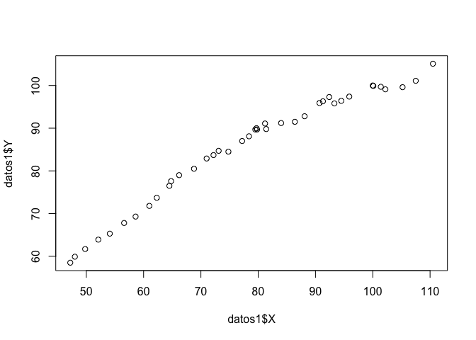

    ajuste.indice<-lm(Y~X,data = datos1)
    summary(ajuste.indice)

    ## 
    ## Call:
    ## lm(formula = Y ~ X, data = datos1)
    ## 
    ## Residuals:
    ##    Min     1Q Median     3Q    Max 
    ## -5.138 -2.130  0.364  2.201  3.632 
    ## 
    ## Coefficients:
    ##             Estimate Std. Error t value Pr(>|t|)    
    ## (Intercept)  29.5192     1.9424   15.20   <2e-16 ***
    ## X             0.7137     0.0241   29.61   <2e-16 ***
    ## ---
    ## Signif. codes:  0 '***' 0.001 '**' 0.01 '*' 0.05 '.' 0.1 ' ' 1
    ## 
    ## Residual standard error: 2.676 on 38 degrees of freedom
    ## Multiple R-squared:  0.9584, Adjusted R-squared:  0.9574 
    ## F-statistic: 876.5 on 1 and 38 DF,  p-value: < 2.2e-16

Revisemos si hay autocorelación:

    residuos<- resid(ajuste.indice)
    plot(residuos,t="l",xlab="Tiempo")

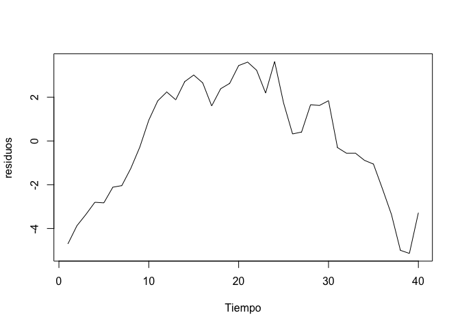

    par(mfrow = c(2,2))
    plot(ajuste.indice)

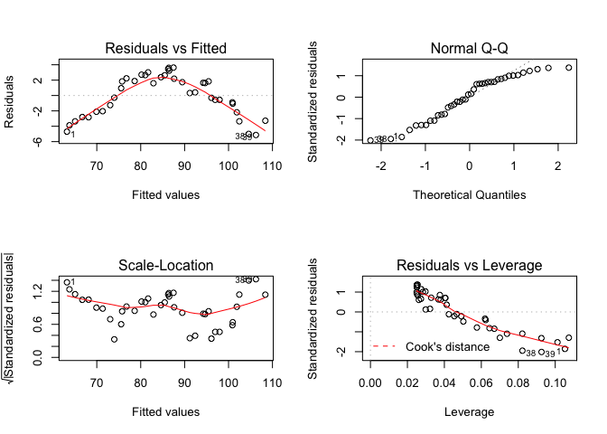

    par(mfrow = c(1,1))

-   Los datos NO DEBEN TENER UN PATRON (si tienen patron, algo anda mal)
-   En este caso se tiene un curva cuadrática, el modelo podría estar
    mal especificado.
-   Podría ser que el modelo no se lineal o estar correlacionado

Veamos si se trata de una función cuadrática y cúbica

    ajuste2 <- lm(Y~X+I(X^2),data = datos1)
    summary(ajuste2)

    ## 
    ## Call:
    ## lm(formula = Y ~ X + I(X^2), data = datos1)
    ## 
    ## Residuals:
    ##      Min       1Q   Median       3Q      Max 
    ## -1.58580 -0.76248  0.09209  0.68442  2.63570 
    ## 
    ## Coefficients:
    ##               Estimate Std. Error t value Pr(>|t|)    
    ## (Intercept) -1.622e+01  2.955e+00  -5.489 3.09e-06 ***
    ## X            1.949e+00  7.799e-02  24.987  < 2e-16 ***
    ## I(X^2)      -7.917e-03  4.968e-04 -15.936  < 2e-16 ***
    ## ---
    ## Signif. codes:  0 '***' 0.001 '**' 0.01 '*' 0.05 '.' 0.1 ' ' 1
    ## 
    ## Residual standard error: 0.9669 on 37 degrees of freedom
    ## Multiple R-squared:  0.9947, Adjusted R-squared:  0.9944 
    ## F-statistic:  3483 on 2 and 37 DF,  p-value: < 2.2e-16

    ajuste3 <- lm(Y~X+I(X^2)+I(X^3),data = datos1)
    summary(ajuste3)

    ## 
    ## Call:
    ## lm(formula = Y ~ X + I(X^2) + I(X^3), data = datos1)
    ## 
    ## Residuals:
    ##      Min       1Q   Median       3Q      Max 
    ## -1.63265 -0.79419  0.06568  0.66627  2.43810 
    ## 
    ## Coefficients:
    ##               Estimate Std. Error t value Pr(>|t|)    
    ## (Intercept) -2.222e+01  1.344e+01  -1.653 0.107060    
    ## X            2.196e+00  5.466e-01   4.018 0.000286 ***
    ## I(X^2)      -1.119e-02  7.178e-03  -1.559 0.127658    
    ## I(X^3)       1.398e-05  3.054e-05   0.458 0.649958    
    ## ---
    ## Signif. codes:  0 '***' 0.001 '**' 0.01 '*' 0.05 '.' 0.1 ' ' 1
    ## 
    ## Residual standard error: 0.9774 on 36 degrees of freedom
    ## Multiple R-squared:  0.9947, Adjusted R-squared:  0.9943 
    ## F-statistic:  2272 on 3 and 36 DF,  p-value: < 2.2e-16

Nos quedamos con el `ajuste2`.

El gráfico de los valores ajustados, muestra que se ha eliminado el
patron inicial

    par(mfrow = c(2,2))
    plot(ajuste2)  

    par(mfrow = c(1,1))

    residuos2 <- resid(ajuste2)
    plot(residuos2,t="l",xlab="Tiempo")
    points(residuos2)
    abline(h=0,col="blue")

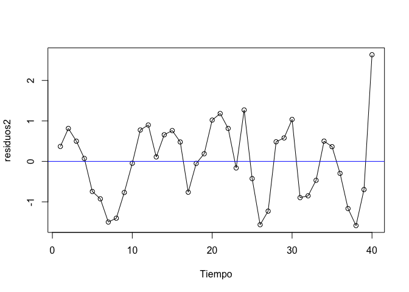

¿Cómo debe ser el gráfico?

    aleatorios=rnorm(40,0,1)
    plot(aleatorios,t="l",xlab="Tiempo")
    points(aleatorios)
    abline(h=0,col="blue")

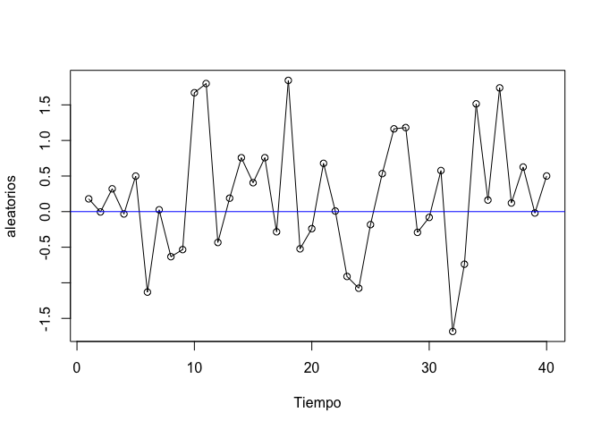

¿Se parece?

Ejemplo: Pruebas

> *H**o*: No hay autocorrelación

    dwtest(ajuste2)

    ## 
    ##  Durbin-Watson test
    ## 
    ## data:  ajuste2
    ## DW = 1.03, p-value = 0.0001178
    ## alternative hypothesis: true autocorrelation is greater than 0

¿Cuál es la conclusión?

Otra prueba:

    # Ajuste Breuch Godfrey (Ho: No hay autocorrelación)
    bgtest(ajuste2,order=4)

    ## 
    ##  Breusch-Godfrey test for serial correlation of order up to 4
    ## 
    ## data:  ajuste2
    ## LM test = 14.945, df = 4, p-value = 0.004817

Análisis Discriminante
----------------------

#### Librerías usadas en esta técnica

    library(car)
    library(vegan)
    library(mvnormtest)
    library(MASS)
    library(klaR)

<!-- https://rpubs.com/gabrielmartos/discriminantR -->
El **análisis discriminante lineal (LDA)** y el discriminante lineal de
Fisher relacionado son métodos utilizados en estadística, reconocimiento
de patrones y aprendizaje automático para **encontrar una combinación
lineal de características** que separa **dos o más clases de objetos o
eventos**. La combinación resultante se puede usar como un clasificador
lineal o, más comúnmente, para la **reducción de dimensionalidad antes
de la clasificación posterior**.

Considere un conjunto de observaciones *x* (también llamadas
características, atributos, variables o medidas) para cada muestra de un
objeto o evento con una clase conocida *y* ∈ {0, 1}. Este conjunto de
muestras se llama **conjunto de entrenamiento**. El problema de
clasificación es **encontrar un buen predictor** para la clase *y* de
cualquier muestra de la misma distribución (no necesariamente del
conjunto de entrenamiento), dado solo una observación *x*.

### Objetivos

-   Determinar si existen diferencias significativas entre los perfiles
    de un conjunto de variables de dos o más grupos definidos a priori.

-   Determinar cuál de las variables independientes cuantifica mejor las
    diferencias entre un grupo u otro.

-   Establecer un procedimiento para clasificar a un individuo en base a
    los valores de un conjunto de variables independientes.

### Posibles aplicaciones

-   **Predicción de bancarrota**: en la predicción de bancarrota basada
    en razones contables y otras variables financieras, el análisis
    discriminante lineal fue el primer método estadístico aplicado para
    explicar sistemáticamente qué empresas entraron en bancarrota
    vs. sobrevivieron.

-   **Comercialización**: en marketing, el análisis discriminante solía
    utilizarse para determinar los factores que distinguen diferentes
    tipos de clientes y/o productos sobre la base de encuestas u otras
    formas de datos recopilados.

-   **Estudios biomédicos**: la principal aplicación del análisis
    discriminante en medicina es la evaluación del estado de gravedad de
    un paciente y el pronóstico del desenlace de la enfermedad. Por
    ejemplo, durante el análisis retrospectivo, los pacientes se dividen
    en grupos según la gravedad de la enfermedad, forma leve, moderada y
    grave. Luego, se estudian los resultados de los análisis clínicos y
    de laboratorio para revelar las variables que son estadísticamente
    diferentes en los grupos estudiados. Usando estas variables, se
    construyen funciones discriminantes que ayudan a clasificar
    objetivamente la enfermedad en un futuro paciente en una forma leve,
    moderada o severa.

### Comparación con otras técnicas

La técnica más común para establecer relaciones, predecir y explicar
variables son las técnicas de regresión. **El problema está cuando la
variable a explicar no es una variable medible (o métrica)**; en este
caso existen dos tipos de análisis con los que resolver el problema, el
análisis discriminante y la regresión logística. En ambos análisis
tendremos una variable dependiente categórica y varias variables
independientes numéricas.

En muchas ocasiones la variable categórica consta de dos grupos o
clasificaciones (por ejemplo, bancarrota-no bancarrota). En otras
situaciones la variable categórica tendrá tres o más subgrupos
(e.g. bajo, medio y alto nivel de cierta dosis). La regresión logística
o logito, en su forma básica está restringida a dos grupos frente al
análisis discriminante que vale para más de dos.

### Supuestos

-   La *variable dependiente* (grupos) debe ser categórica en la que el
    número de grupos puede ser de dos o más, pero han de ser
    **mutuamente excluyentes y exhaustivos**. Aunque la variable
    dependiente puede ser originariamente numérica y que el investigador
    la cuantifique en términos de categorías.

-   Las *variables independientes* numéricas se seleccionan
    identificando las variables en una investigación previa o mediante
    información a priori, de tal manera que se sepa que esas variables
    son importantes para predecir en qué grupo estará la variable
    dependiente. Se puede utilizar el análisis cluster para formar los
    grupos, pero se recomienda seguir los siguientes pasos: dividir los
    datos en 2 grupos, aplicar el análisis cluster en uno de ellos y
    utilizar los resultados en el DA para el segundo grupo de datos.

-   Con respecto al *tamaño de las muestras*, se suele recomendar que
    los tamaños de cada grupo no sean muy diferentes, ya que con esto la
    probabilidad de pertenecer a un grupo o a otro puede variar
    considerablemente. Se necesita que al menos tengamos 4 o 5 veces más
    observaciones por grupo que el número de variables que utilicemos.
    Además, el número de observaciones en el grupo más pequeño debe ser
    mayor que el número de variables.

-   También existen dos hipótesis previas que deben ser contrastadas,
    estas son: la **normalidad multivariante** y la de la **estructura
    de varianzas-covarianzas desconocidas pero iguales** (*homogeneidad
    de varianzas* entre grupos). Los datos que no cumplen el supuesto de
    normalidad pueden causar problemas en la estimación y en ese caso se
    sugiere utilizar la regresión logística. Si existen grandes
    desviaciones en las varianzas, se puede solucionar con la ampliación
    de la muestra o con técnicas de clasificación cuadráticas. **La
    homogeneidad de varianzas significa que la relación entre variables
    debe ser similar para los distintos grupos**. Por tanto, una
    variable no puede tener el mismo valor para todas las observaciones
    dentro de un grupo.

-   Los datos además no deben presentar *multicolinealidad*, es decir,
    que dos o más variables independientes estén muy relacionadas. Si
    las variables tienen un valor de correlación de 0.9 o mayor se debe
    eliminar una de ellas.

-   También se supone *linealidad* entre las variables ya que se utiliza
    la matriz de covarianza.

Si no se cumplen los supuestos de normalidad y homogeneidad, podemos
utilizar una transformación logarítmica o de la raíz cuadrada (entre
otras).

### El modelo

El análisis discriminante implica un valor teórico como combinación
lineal de dos o más variables independientes que discrimine entre los
grupos definidos a priori. La discriminación se lleva a cabo
estableciendo las ponderaciones del valor teórico de cada variable, de
tal forma que **maximicen la varianza entre-grupos frente a la
intra-grupos**. La combinación lineal o función discriminante, toma la
siguiente forma:

*D**i* = *a* + *W*1*X*1, *i* + *W*2*X*2, *i* + … + *W**n**X**n*, *i*

donde: *D**i* es la puntuación discriminante (grupo de
pertenencia) del individuo i-ésimo; a es una constante;
*W**j* es la ponderación de la variable j-ésima. El resultado
de esta función será para un conjunto de variables *X*1, …, *X**n* un
valor de *D* que discrimine al individuo en un grupo u otro. Destacamos
que el análisis discriminante **proporcionará una función discriminate
menos que los subgrupos que tengamos**, es decir, si la variable
categórica tiene dos subgrupos, obtendremos una función discriminante,
si tiene tres subgrupos obtendremos dos y así sucesivamente.

### Ejemplo 1: clasificación de vinos

En este primer caso de estudio, el conjunto de datos del vino, tenemos
13 concentraciones químicas que describen muestras de vino de tres
cultivos.

    library(car)
    # install.packages('rattle')
    uu <- "https://gist.githubusercontent.com/tijptjik/9408623/raw/b237fa5848349a14a14e5d4107dc7897c21951f5/wine.csv"
    wine <- read.csv(url(uu))
    head(wine)

    scatterplotMatrix(wine[2:6])

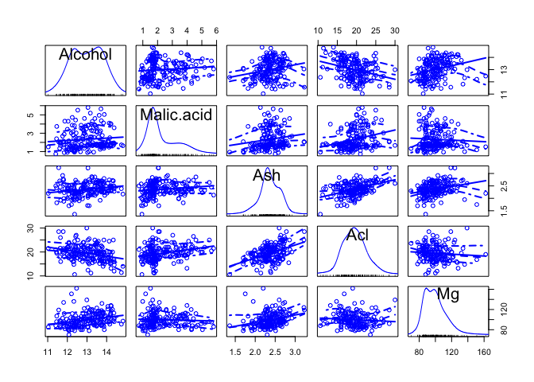

El propósito del análisis discriminante lineal (LDA) en este ejemplo es
encontrar las combinaciones lineales de las variables originales (las 13
concentraciones químicas aquí) que proporcionan la mejor separación
posible entre los grupos (variedades de vino aquí) en nuestro conjunto
de datos. El análisis discriminante lineal también se conoce como
**análisis discriminante canónico**, o simplemente **análisis
discriminante**.

### Supuestos:

**Homogeneidad de varianzas multivariante**

    library(vegan)
    # seleccionamos las variables ambientales a analizar 
    env.pars2 <- as.matrix(wine[, 2:14])
    # verificamos la homogeneidad multivariada de las matrices de covarianza intra-grupo
    env.pars2.d1 <- dist(env.pars2)
    env.MHV <- betadisper(env.pars2.d1, wine$Wine)
    anova(env.MHV)

    permutest(env.MHV)

    ## 
    ## Permutation test for homogeneity of multivariate dispersions
    ## Permutation: free
    ## Number of permutations: 999
    ## 
    ## Response: Distances
    ##            Df  Sum Sq Mean Sq      F N.Perm Pr(>F)    
    ## Groups      2  190082   95041 8.3286    999  0.001 ***
    ## Residuals 175 1997003   11411                         
    ## ---
    ## Signif. codes:  0 '***' 0.001 '**' 0.01 '*' 0.05 '.' 0.1 ' ' 1

*Conclusión*: rechazo la hipótesis nula de homogeneidad intra-grupo. Se
podría hacer transformaciones logarítmicas para enfrentar este asunto.

**Normalidad multivariante**

    library(mvnormtest)
    mshapiro.test(t(env.pars2))

    ## 
    ##  Shapiro-Wilk normality test
    ## 
    ## data:  Z
    ## W = 0.83696, p-value = 7.846e-13

Rechazamos la *H**o* de normalidad multivariante

**Multicolinealidad**

    as.dist(cor(env.pars2))

    ##                           Alcohol   Malic.acid          Ash          Acl
    ## Malic.acid            0.094396941                                       
    ## Ash                   0.211544596  0.164045470                          
    ## Acl                  -0.310235137  0.288500403  0.443367187             
    ## Mg                    0.270798226 -0.054575096  0.286586691 -0.083333089
    ## Phenols               0.289101123 -0.335166997  0.128979538 -0.321113317
    ## Flavanoids            0.236814928 -0.411006588  0.115077279 -0.351369860
    ## Nonflavanoid.phenols -0.155929467  0.292977133  0.186230446  0.361921719
    ## Proanth               0.136697912 -0.220746187  0.009651935 -0.197326836
    ## Color.int             0.546364195  0.248985344  0.258887259  0.018731981
    ## Hue                  -0.071747197 -0.561295689 -0.074666889 -0.273955223
    ## OD                    0.072343187 -0.368710428  0.003911231 -0.276768549
    ## Proline               0.643720037 -0.192010565  0.223626264 -0.440596931
    ##                                Mg      Phenols   Flavanoids
    ## Malic.acid                                                 
    ## Ash                                                        
    ## Acl                                                        
    ## Mg                                                         
    ## Phenols               0.214401235                          
    ## Flavanoids            0.195783770  0.864563500             
    ## Nonflavanoid.phenols -0.256294049 -0.449935301 -0.537899612
    ## Proanth               0.236440610  0.612413084  0.652691769
    ## Color.int             0.199950006 -0.055136418 -0.172379398
    ## Hue                   0.055398196  0.433681335  0.543478566
    ## OD                    0.066003936  0.699949365  0.787193902
    ## Proline               0.393350849  0.498114880  0.494193127
    ##                      Nonflavanoid.phenols      Proanth    Color.int
    ## Malic.acid                                                         
    ## Ash                                                                
    ## Acl                                                                
    ## Mg                                                                 
    ## Phenols                                                            
    ## Flavanoids                                                         
    ## Nonflavanoid.phenols                                               
    ## Proanth                      -0.365845099                          
    ## Color.int                     0.139057013 -0.025249931             
    ## Hue                          -0.262639631  0.295544253 -0.521813193
    ## OD                           -0.503269596  0.519067096 -0.428814942
    ## Proline                      -0.311385188  0.330416700  0.316100113
    ##                               Hue           OD
    ## Malic.acid                                    
    ## Ash                                           
    ## Acl                                           
    ## Mg                                            
    ## Phenols                                       
    ## Flavanoids                                    
    ## Nonflavanoid.phenols                          
    ## Proanth                                       
    ## Color.int                                     
    ## Hue                                           
    ## OD                    0.565468293             
    ## Proline               0.236183447  0.312761075

    library(MASS)
    wine.lda <- lda(Wine ~ ., data=wine)
    wine.lda

    ## Call:
    ## lda(Wine ~ ., data = wine)
    ## 
    ## Prior probabilities of groups:
    ##         1         2         3 
    ## 0.3314607 0.3988764 0.2696629 
    ## 
    ## Group means:
    ##    Alcohol Malic.acid      Ash      Acl       Mg  Phenols Flavanoids
    ## 1 13.74475   2.010678 2.455593 17.03729 106.3390 2.840169  2.9823729
    ## 2 12.27873   1.932676 2.244789 20.23803  94.5493 2.258873  2.0808451
    ## 3 13.15375   3.333750 2.437083 21.41667  99.3125 1.678750  0.7814583
    ##   Nonflavanoid.phenols  Proanth Color.int       Hue       OD   Proline
    ## 1             0.290000 1.899322  5.528305 1.0620339 3.157797 1115.7119
    ## 2             0.363662 1.630282  3.086620 1.0562817 2.785352  519.5070
    ## 3             0.447500 1.153542  7.396250 0.6827083 1.683542  629.8958
    ## 
    ## Coefficients of linear discriminants:
    ##                               LD1           LD2
    ## Alcohol              -0.403399781  0.8717930699
    ## Malic.acid            0.165254596  0.3053797325
    ## Ash                  -0.369075256  2.3458497486
    ## Acl                   0.154797889 -0.1463807654
    ## Mg                   -0.002163496 -0.0004627565
    ## Phenols               0.618052068 -0.0322128171
    ## Flavanoids           -1.661191235 -0.4919980543
    ## Nonflavanoid.phenols -1.495818440 -1.6309537953
    ## Proanth               0.134092628 -0.3070875776
    ## Color.int             0.355055710  0.2532306865
    ## Hue                  -0.818036073 -1.5156344987
    ## OD                   -1.157559376  0.0511839665
    ## Proline              -0.002691206  0.0028529846
    ## 
    ## Proportion of trace:
    ##    LD1    LD2 
    ## 0.6875 0.3125

Esto significa que la primera función discriminante es una combinación
lineal de las variables:
 − 0.403 \* *A**l**c**o**h**o**l* + 0.165 \* *M**a**l**i**c*… − 0.003 \* *P**r**o**l**i**n**e*
.

Por conveniencia, el valor de cada función discriminante (por ejemplo,
la primera función discriminante) se escala de modo que su valor medio
sea cero y su varianza sea uno.

La *proporción de traza* que se imprime cuando escribe `wine.lda` (la
variable devuelta por la función `lda()`) es la separación porcentual
lograda por cada función discriminante. Por ejemplo, para los datos del
vino obtenemos los mismos valores que acabamos de calcular (68.75% y
31.25%).

**Histrogramas de resultado**

Una buena forma de mostrar los resultados de un análisis discriminante
lineal (LDA) es hacer un histograma apilado de los valores de la función
discriminante para las muestras de diferentes grupos (diferentes
variedades de vino en nuestro ejemplo).

Podemos hacer esto usando la función `ldahist()` en `R`. Por ejemplo,
para hacer un histograma apilado de los valores de la primera función
discriminante para muestras de vino de los tres diferentes cultivares de
vino, escribimos:

    wine.lda.values <- predict(wine.lda)
    ldahist(data = wine.lda.values$x[,1], g=wine$Wine)

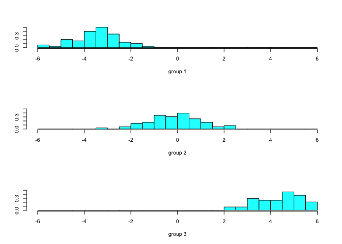

usando la segunda función discriminante:

    ldahist(data = wine.lda.values$x[,2], g=wine$Wine)

**Gráficos de las funciones discriminantes**

    plot(wine.lda.values$x[,1],wine.lda.values$x[,2]) # se realiza el grafico
    text(wine.lda.values$x[,1],wine.lda.values$x[,2],wine$Wine,cex=0.7,pos=4,col="red") # agregamos etiiquetas

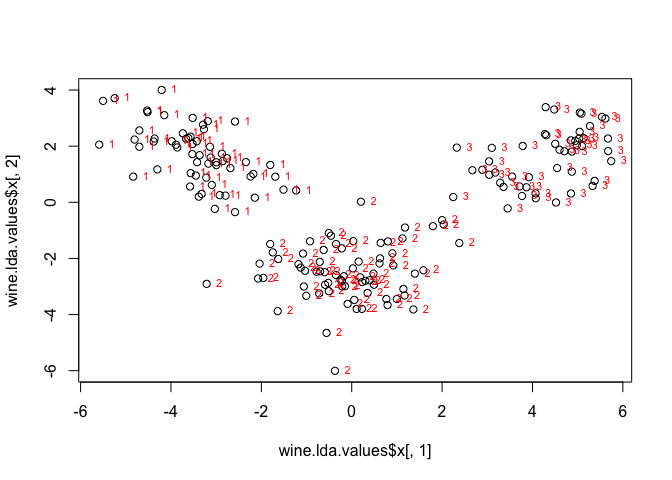

    spe.class <- predict(wine.lda)$class
    (spe.table <-table(wine$Wine, spe.class))

    ##    spe.class
    ##      1  2  3
    ##   1 59  0  0
    ##   2  0 71  0
    ##   3  0  0 48

### Ejemplo 2: Admisiones

El conjunto de datos proporciona datos de admisión para los solicitantes
a las escuelas de posgrado en los negocios. El objetivo es usar los
puntajes de GPA y GMAT para predecir la probabilidad de admisión
(admitir, no admitir y límite).

    url <- 'http://www.biz.uiowa.edu/faculty/jledolter/DataMining/admission.csv'
    admit <- read.csv(url)

    head(admit)

Realizamos un gráfico de los datos:

    adm <- data.frame(admit)
    plot(adm$GPA,adm$GMAT,col=adm$De)

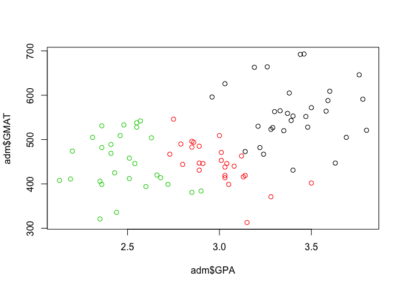

### Supuestos:

**Homogeneidad de varianzas multivariante**

    library(vegan)
    # seleccionamos las variables ambientales a analizar 
    env.pars2 <- as.matrix(adm[, 1:2])
    # verificamos la homogeneidad multivariada de las matrices de covarianza intra-grupo
    env.pars2.d1 <- dist(env.pars2)
    env.MHV <- betadisper(env.pars2.d1, adm$De)
    anova(env.MHV)

    permutest(env.MHV)

    ## 
    ## Permutation test for homogeneity of multivariate dispersions
    ## Permutation: free
    ## Number of permutations: 999
    ## 
    ## Response: Distances
    ##           Df Sum Sq Mean Sq      F N.Perm Pr(>F)
    ## Groups     2   6224  3112.0 2.4009    999  0.101
    ## Residuals 82 106285  1296.2

Conclusión: no rechazo la hipótesis nula de homogeneidad intra-grupo.

**Normalidad multivariante**

    library(mvnormtest)
    mshapiro.test(t(env.pars2))

    ## 
    ##  Shapiro-Wilk normality test
    ## 
    ## data:  Z
    ## W = 0.98854, p-value = 0.6623

No rechazamos la *H**o* de normalidad multivariante

**Multicolinealidad**

    as.dist(cor(env.pars2))

    ##            GPA
    ## GMAT 0.4606332

    library(MASS)
    m1 <- lda(De~.,adm)
    m1

    ## Call:
    ## lda(De ~ ., data = adm)
    ## 
    ## Prior probabilities of groups:
    ##     admit    border  notadmit 
    ## 0.3647059 0.3058824 0.3294118 
    ## 
    ## Group means:
    ##               GPA     GMAT
    ## admit    3.403871 561.2258
    ## border   2.992692 446.2308
    ## notadmit 2.482500 447.0714
    ## 
    ## Coefficients of linear discriminants:
    ##              LD1         LD2
    ## GPA  5.008766354  1.87668220
    ## GMAT 0.008568593 -0.01445106
    ## 
    ## Proportion of trace:
    ##    LD1    LD2 
    ## 0.9673 0.0327

Comenta los resultados.

Realizamos una predicción:

    predict(m1,newdata=data.frame(GPA=3.21,GMAT=497))

    ## $class
    ## [1] admit
    ## Levels: admit border notadmit
    ## 
    ## $posterior
    ##       admit    border     notadmit
    ## 1 0.5180421 0.4816015 0.0003563717
    ## 
    ## $x
    ##        LD1      LD2
    ## 1 1.252409 0.318194

**Análisis discrimante cuadrático**: Se trata de un procedimiento más
robusto que el lineal, y es útil **cuando las matrices de covarianza no
son iguales**. Se basa en la distancia de Mahalanobis al cuadrado
respecto al centro del grupo.

    m2 <- qda(De~.,adm)
    m2

    ## Call:
    ## qda(De ~ ., data = adm)
    ## 
    ## Prior probabilities of groups:
    ##     admit    border  notadmit 
    ## 0.3647059 0.3058824 0.3294118 
    ## 
    ## Group means:
    ##               GPA     GMAT
    ## admit    3.403871 561.2258
    ## border   2.992692 446.2308
    ## notadmit 2.482500 447.0714

Realizamos la predicción

    predict(m2,newdata=data.frame(GPA=3.21,GMAT=497))

    ## $class
    ## [1] admit
    ## Levels: admit border notadmit
    ## 
    ## $posterior
    ##       admit    border     notadmit
    ## 1 0.9226763 0.0768693 0.0004544468

**¿Qué modelo es el mejor?**

Para responder a esta pregunta, evaluamos el análisis discriminante
lineal seleccionando aleatoriamente 60 de 85 estudiantes, estimando los
parámetros en los datos de entrenamiento y clasificando a los 25
estudiantes restantes de la muestra retenida. Repetimos esto 100 veces

    n <- 85
    nt <- 60
    neval <-n-nt
    rep <- 100

    ### LDA
    set.seed(123456789)
    errlin <- dim(rep)
    for (k in 1:rep) {
    train <- sample(1:n,nt)
    ## linear discriminant analysis
    m1 <- lda(De~.,adm[train,])
    predict(m1,adm[-train,])$class
    tablin <- table(adm$De[-train],predict(m1,adm[-train,])$class)
    errlin[k] <- (neval-sum(diag(tablin)))/neval
    }
    merrlin <- mean(errlin) #media del error lineal
    merrlin

    ## [1] 0.0916

Ahora en el QDA:

    ### QDA
    set.seed(123456789)
    errqda <- dim(rep)
    for (k in 1:rep) {
    train <- sample(1:n,nt)
    ## quadratic discriminant analysis
    m1 <- qda(De~.,adm[train,])
    predict(m1,adm[-train,])$class
    tablin <- table(adm$De[-train],predict(m1,adm[-train,])$class)
    errqda[k] <- (neval-sum(diag(tablin)))/neval
    }
    merrqda <- mean(errlin)
    merrqda

    ## [1] 0.0916

Logramos una tasa de clasificación errónea del 10.2% en ambos casos. `R`
también nos da algunas herramientas de visualización. Por ejemplo en la
librería `klaR`:

    # Gráficos exploratorios para LDA or QDA
    #install.packages('klaR')
    library(klaR)
    partimat(De~.,data=adm,method="lda") 

    partimat(De~.,data=adm,method="qda") 

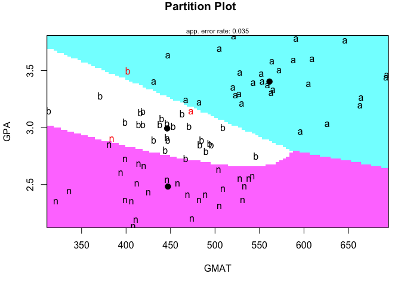

### Ejemplo 3: Score de crédito de un banco alemán

El conjunto de datos de crédito alemán se obtuvo del [Repositorio de
aprendizaje automático UCI](https://archive.ics.uci.edu/ml/index.php).
El conjunto de datos, que contiene atributos y resultados sobre 1000
solicitudes de préstamo, fue proporcionado en 1994 por el Profesor
Dr. Hans Hofmann del Institut fuer Statistik und Oekonometrie de la
Universidad de Hamburgo. Ha servido como un importante conjunto de datos
de prueba para varios algoritmos de puntuación de crédito. Una
descripción de las variables se da en `germancreditDescription.docx` de
`DataLectures`. Comenzamos cargando los datos:

    ## read data 
    credit <- read.csv("http://www.biz.uiowa.edu/faculty/jledolter/DataMining/germancredit.csv")
    head(credit,2) # Mira la codificación en el lugar indicado

Como se puede ver, solo las variables: duración, cantidad, plazos y edad
son numéricas. Con los restantes (indicadores) los supuestos de una
distribución normal serían, en el mejor de los casos, débiles; por lo
tanto, estas variables no se consideran aquí.

    cred1 <- credit[, c("Default","duration","amount","installment","age")]
    head(cred1)

    summary(cred1)

    ##     Default       duration        amount       installment   
    ##  Min.   :0.0   Min.   : 4.0   Min.   :  250   Min.   :1.000  
    ##  1st Qu.:0.0   1st Qu.:12.0   1st Qu.: 1366   1st Qu.:2.000  
    ##  Median :0.0   Median :18.0   Median : 2320   Median :3.000  
    ##  Mean   :0.3   Mean   :20.9   Mean   : 3271   Mean   :2.973  
    ##  3rd Qu.:1.0   3rd Qu.:24.0   3rd Qu.: 3972   3rd Qu.:4.000  
    ##  Max.   :1.0   Max.   :72.0   Max.   :18424   Max.   :4.000  
    ##       age       
    ##  Min.   :19.00  
    ##  1st Qu.:27.00  
    ##  Median :33.00  
    ##  Mean   :35.55  
    ##  3rd Qu.:42.00  
    ##  Max.   :75.00

Transformemos los datos en un data.frame

    cred1 <- data.frame(cred1)

-   Realiza las pruebas de los supuestos y comenta los resultados
-   Estima y compara lda con qda
-   Estima la matriz de confusión
-   ¿Usarías este modelo para una aplicación real?

Análisis de correlación canónica (CCA)
--------------------------------------

Para ilustrar el método vamos a usar el ejemplo 10.2.3 con el conjunto
de datos de la tabla 5.1.1 de Mardia, Kent, and Bibby (1979).

Los datos son:

-   *l*1: longitud de la cabeza del primer hijo
-   *l*2: longitud de la cabeza del segundo hijo
-   *b*1: amplitud (*breadth*) de la cabeza del primer hijo
-   *b*2: amplitud (*breadth*) de la cabeza del segundo hijo

Supongamos que **x** es un vector aleatorio de dimensión *q* y **y** es
un vector aleatorio de dimensión *p*. También supongamos que **x** e
**y** tienen medias **μ** y **ν**, y que

*E*{(**x** **−** **μ**)(**x** **−** **μ**)′} = **Σ**11

*E*{(**y** **−** **μ**)(**y** **−** **μ**)′} = **Σ**22

*E*{(**x** **−** **μ**)(**y** **−** **μ**)′} = **Σ**12 = **Σ**21

En `R`, usando estos datos tenemos:

    uu = "http://www1.maths.leeds.ac.uk/~charles/mva-data/headlengthandbreadth.dat"
    datos = read.csv(url(uu),sep = "")

    fz <- function(x)
    {
      return ( (x-mean(x))/sd(x))
    }

    datos = apply(datos,2,fz)

    (S11 = cov(datos[,1:2]))

    ##           l1        b1
    ## l1 1.0000000 0.7345555
    ## b1 0.7345555 1.0000000

    (S22 = cov(datos[,3:4]))

    ##           l2        b2
    ## l2 1.0000000 0.8392519
    ## b2 0.8392519 1.0000000

    (S12 = S21 = cov(datos[,])[1:2,3:4])

    ##           l2        b2
    ## l1 0.7107518 0.7039807
    ## b1 0.6931573 0.7085504

Ahora consideramos las dos combinaciones lineales *η* = **a****′****x**
y *ϕ* = **b****′****y**. La correlación entre *η* y *ϕ* es

$$
\\rho(\\boldsymbol{a,b}) = \\frac{\\boldsymbol{a'\\Sigma\_{12}b}}{(\\boldsymbol{a'\\Sigma\_{11}ab'\\Sigma\_{22}b})^{1/2}}
$$
 La notación *ρ*(**a****,** **b**) se usa para enfatizar que la
correlación cambia según los valores elegidos de **a** y **b**.

El objetivo es encontrar los vectores **a** y **b** que **maximizan**
*ρ*(**a****,** **b**), que es equivalente a

*m**a**x***a****,** **b****a****′****Σ****12****b**
 sujeto a

**a****′****Σ****11****a** = **b****′****Σ****22****b** = 1
 **Solución**

Sea

**K** **=** **Σ****11** **−** **1****/****2****Σ****12****Σ****22** **−** **1****/****2**

En `R`

    K = eigen(S11)$vectors %*% sqrt(solve(diag(eigen(S11)$values))) %*% solve(eigen(S11)$vectors) %*%
      S12 %*%
      eigen(S22)$vectors %*% sqrt(solve(diag(eigen(S22)$values))) %*% solve(eigen(S22)$vectors)

Ahora fijamos **N****1** **=** **K****K****′** y
**N****2** **=** **K****′****K** y

**M****1** **=** **Σ****11** **−** **1****/****2****N****1****Σ****11****1****/****2**
**M****2** **=** **Σ****22** **−** **1****/****2****N****2****Σ****22****1****/****2**

En `R`

    (N1 = K%*%t(K))

    ##           [,1]      [,2]
    ## [1,] 0.3192267 0.3093512
    ## [2,] 0.3093512 0.3054060

    (N2 = t(K)%*%(K))

    ##           [,1]      [,2]
    ## [1,] 0.3063796 0.3093714
    ## [2,] 0.3093714 0.3182531

    (M1 = solve(S11)%*%S12%*%solve(S22)%*%S21)

    ##           l2        b2
    ## l1 0.3213612 0.3206147
    ## b1 0.2980647 0.3029597

    (M2 = solve(S22)%*%S21%*%solve(S11)%*%S12)

    ##           l2        b2
    ## l2 0.3284513 0.3276745
    ## b2 0.2910913 0.2958697

**Definición**

Sea
**a***i* = **Σ****11** **−** **1****/****2****α****i**
y
**b***i* = **Σ****22** **−** **1****/****2****β****i**
para *i* = 1…*k* (*k* = *r**a**n**k*(**K**)), entonces

1.  Los vectores **a***i* y **b***i* son los
    iésimos **vectores canónicos** para **x** y **y** respectivamente.

2.  **α****i** y **β****i** son los vectores
    propios de **N****1** y **N****2**
    respectivamente.

3.  Las variables aleatorias
    *η**i* = **a****1****′****x** y
    *ϕ**i* = **b****1****′****y** son las iésimas
    **variables de correlación canónicas**.

4.  *ρ**i* = *λ**i*1/2 es e iésimo
    **coeficiente de correlación canónico**.

En `R`

    #a_1 a_2
    eigen(S11)$vectors %*% sqrt(solve(diag(eigen(S11)$values))) %*% solve(eigen(S11)$vectors)%*%
      eigen(N1)$vectors

    ##            [,1]      [,2]
    ## [1,] -0.5521896  1.366374
    ## [2,] -0.5215372 -1.378365

    #b_1 b_2
    eigen(S22)$vectors %*% sqrt(solve(diag(eigen(S22)$values))) %*% solve(eigen(S22)$vectors)%*%
      eigen(N2)$vectors

    ##           [,1]      [,2]
    ## [1,] 0.5044484 -1.768570
    ## [2,] 0.5382877  1.758566

De tal manera que las primeras variables de correlación canónica son

*η*1 =  − 0.552*l*1 − 0.522*b*1
 y

*ϕ*1 = 0.505*l*2 + 0.538*b*2

Los coeficientes de correlación canónica son:

    sqrt(eigen(M1)$values) # Canonical correlation coefficients

    ## [1] 0.78830930 0.05375324

### Supuestos

-   Normalidad (uni y multivariante dentro de **x** e **y**)
-   Linealidad (la no linealidad afecta las correlaciones)
-   Igual varianza

Note que este método no refleja relaciones no lineales en los datos.

### Un ejemplo en R

Usamos los datos `LifeCyclesSavings` para examinar ratio de ahorros
(ahorros/ingreso) del ciclo de vida desde 1960 hasta 1970.

El conjunto de datos tiene 50 observaciones y 5 variables:

-   sr = aggregate personal savings;
-   pop15 = % population under 15;
-   pop75 = % population over 75;
-   dpi = disposable income;
-   ddpi = % growth rate of dpi

<!-- -->

    library(CCA)
    ?LifeCycleSavings

Para correr el análisis de correlación canónica, primero investiguemos
más de la función `cancor()`

    ?cancor

Veamos los datos

    data("LifeCycleSavings")
    head(LifeCycleSavings)

El análisis

    pop <- LifeCycleSavings[,2:3]
    oec <- LifeCycleSavings[,-(2:3)]
    cancor(pop,oec)

    ## $cor
    ## [1] 0.8247966 0.3652762
    ## 
    ## $xcoef
    ##               [,1]        [,2]
    ## pop15 -0.009110856 -0.03622206
    ## pop75  0.048647514 -0.26031158
    ## 
    ## $ycoef
    ##              [,1]          [,2]          [,3]
    ## sr   0.0084710221  3.337936e-02 -5.157130e-03
    ## dpi  0.0001307398 -7.588232e-05  4.543705e-06
    ## ddpi 0.0041706000 -1.226790e-02  5.188324e-02
    ## 
    ## $xcenter
    ##   pop15   pop75 
    ## 35.0896  2.2930 
    ## 
    ## $ycenter
    ##        sr       dpi      ddpi 
    ##    9.6710 1106.7584    3.7576

Ahora usaremos el paquete `CCA` para obtener las matrices de correlación
canónica

    library(CCA)
    matcor(pop,oec)

    ## $Xcor
    ##            pop15      pop75
    ## pop15  1.0000000 -0.9084787
    ## pop75 -0.9084787  1.0000000
    ## 
    ## $Ycor
    ##             sr        dpi       ddpi
    ## sr   1.0000000  0.2203589  0.3047872
    ## dpi  0.2203589  1.0000000 -0.1294855
    ## ddpi 0.3047872 -0.1294855  1.0000000
    ## 
    ## $XYcor
    ##             pop15       pop75         sr        dpi        ddpi
    ## pop15  1.00000000 -0.90847871 -0.4555381 -0.7561881 -0.04782569
    ## pop75 -0.90847871  1.00000000  0.3165211  0.7869995  0.02532138
    ## sr    -0.45553809  0.31652112  1.0000000  0.2203589  0.30478716
    ## dpi   -0.75618810  0.78699951  0.2203589  1.0000000 -0.12948552
    ## ddpi  -0.04782569  0.02532138  0.3047872 -0.1294855  1.00000000

Ahora las correlaciones canónicas para función canónica

    (res.cc <- cc(pop,oec))

    ## $cor
    ## [1] 0.8247966 0.3652762
    ## 
    ## $names
    ## $names$Xnames
    ## [1] "pop15" "pop75"
    ## 
    ## $names$Ynames
    ## [1] "sr"   "dpi"  "ddpi"
    ## 
    ## $names$ind.names
    ##  [1] "Australia"      "Austria"        "Belgium"        "Bolivia"       
    ##  [5] "Brazil"         "Canada"         "Chile"          "China"         
    ##  [9] "Colombia"       "Costa Rica"     "Denmark"        "Ecuador"       
    ## [13] "Finland"        "France"         "Germany"        "Greece"        
    ## [17] "Guatamala"      "Honduras"       "Iceland"        "India"         
    ## [21] "Ireland"        "Italy"          "Japan"          "Korea"         
    ## [25] "Luxembourg"     "Malta"          "Norway"         "Netherlands"   
    ## [29] "New Zealand"    "Nicaragua"      "Panama"         "Paraguay"      
    ## [33] "Peru"           "Philippines"    "Portugal"       "South Africa"  
    ## [37] "South Rhodesia" "Spain"          "Sweden"         "Switzerland"   
    ## [41] "Turkey"         "Tunisia"        "United Kingdom" "United States" 
    ## [45] "Venezuela"      "Zambia"         "Jamaica"        "Uruguay"       
    ## [49] "Libya"          "Malaysia"      
    ## 
    ## 
    ## $xcoef
    ##              [,1]       [,2]
    ## pop15  0.06377599 -0.2535544
    ## pop75 -0.34053260 -1.8221811
    ## 
    ## $ycoef
    ##               [,1]          [,2]
    ## sr   -0.0592971550  0.2336554912
    ## dpi  -0.0009151786 -0.0005311762
    ## ddpi -0.0291942000 -0.0858752749
    ## 
    ## $scores
    ## $scores$xscores
    ##                       [,1]        [,2]
    ## Australia      -0.56253600  0.40390249
    ## Austria        -1.47152544 -0.87332319
    ## Belgium        -1.44772362 -1.03147293
    ## Bolivia         0.64585407 -0.58905269
    ## Brazil          0.95103425  0.86551308
    ## Canada         -0.40457624 -0.16057787
    ## Chile           0.62111144  0.55740907
    ## China           1.16878601  0.50796273
    ## Colombia        1.15651493 -0.68190575
    ## Costa Rica      1.19304831 -1.08123466
    ## Denmark        -1.23791620 -0.27758614
    ## Ecuador         1.09119961 -0.83511633
    ## Finland        -0.48857145  1.69786021
    ## France         -1.45930966 -1.84294039
    ## Germany        -1.11119865  1.06072429
    ## Greece         -0.87874295  0.93055884
    ## Guatamala       1.18358828 -0.18609424
    ## Honduras        1.36333825  0.02032415
    ## Iceland        -0.33557620 -1.16539024
    ## India           0.85064214  0.85175743
    ## Ireland        -0.89660448 -2.46031003
    ## Italy          -1.07829893  0.51703990
    ## Japan          -0.38486053  2.74651367
    ## Korea           0.89509245  0.83383808
    ## Luxembourg     -1.33690279  0.75116267
    ## Malta          -0.22287754  0.32393631
    ## Norway         -1.05180046 -0.19175733
    ## Netherlands    -0.98785900  0.88796621
    ## New Zealand    -0.45678604 -0.96933925
    ## Nicaragua       1.00339345 -0.54954583
    ## Panama          0.91241030 -0.15606348
    ## Paraguay        0.81170333  0.72072321
    ## Peru            0.92534657 -0.46157725
    ## Philippines     1.11184809 -0.69488593
    ## Portugal       -0.58059799  0.53923234
    ## South Africa   -0.19644195  0.82228337
    ## South Rhodesia  0.06108731  2.21221207
    ## Spain          -0.66521535  0.81212511
    ## Sweden         -1.63569355 -0.63352441
    ## Switzerland    -1.22912136  0.32265569
    ## Turkey          0.94434558  0.09809587
    ## Tunisia         1.07227152 -0.82338461
    ## United Kingdom -1.49174087 -0.95175452
    ## United States  -0.72389730 -0.73315394
    ## Venezuela       1.19569390 -0.32950372
    ## Zambia          1.23813259  0.58162543
    ## Jamaica         0.57631460 -0.50314665
    ## Uruguay        -0.58926282  0.98656605
    ## Libya           0.62443782 -1.77432308
    ## Malaysia        1.32844252 -0.09502380
    ## 
    ## $scores$yscores
    ##                        [,1]        [,2]
    ## Australia      -1.197582618 -0.16236396
    ## Austria        -0.514485534  0.33260994
    ## Belgium        -1.126047497  0.28011657
    ## Bolivia         1.175575433 -0.12494843
    ## Brazil          0.132491457  0.88183195
    ## Canada         -1.625987352 -1.08839364
    ## Chile           0.975882427 -1.79030274
    ## China           0.535391632  0.71855258
    ## Colombia        1.057642399 -0.59695499
    ## Costa Rica      0.543808669  0.67893036
    ## Denmark        -1.704368254  0.91924174
    ## Ecuador         1.155871496 -0.85121380
    ## Finland        -0.635218480  0.01315294
    ## France         -1.211470012  0.04020705
    ## Germany        -1.397266488 -0.01731182
    ## Greece          0.083021015  0.14211897
    ## Guatamala       1.209216281 -0.92679302
    ## Honduras        0.933602822  0.05262497
    ## Iceland        -0.150891245 -2.15783934
    ## India           1.036015081  0.57429510
    ## Ireland        -0.106933726  0.43825829
    ## Italy          -0.526164584  0.94515342
    ## Japan          -0.945445589  2.20814404
    ## Korea           1.100359257 -1.02841475
    ## Luxembourg     -1.205145263 -0.36666114
    ## Malta          -0.009000439  1.25130272
    ## Norway         -1.059225255 -0.45008336
    ## Netherlands    -0.989337775  0.49151632
    ## New Zealand    -0.349384397  0.20271478
    ## Nicaragua       0.892846437 -0.02931829
    ## Panama          0.807040147 -0.92369850
    ## Paraguay        1.344342456 -1.08273725
    ## Peru            0.557284192  1.34827236
    ## Philippines     0.740722188  1.38450895
    ## Portugal        0.206695290  0.61907452
    ## South Africa    0.375656978  0.71988759
    ## South Rhodesia  0.619330744  1.45344991
    ## Spain           0.167542079  0.61909114
    ## Sweden         -1.818231179 -1.75733210
    ## Switzerland    -1.628446935  0.32307189
    ## Turkey          0.948826794 -0.61162985
    ## Tunisia         1.267754398 -0.92230572
    ## United Kingdom -0.485816535 -0.66038997
    ## United States  -2.486211894 -1.91878127
    ## Venezuela       0.389454702  0.32762273
    ## Zambia          0.318834488  2.47265581
    ## Jamaica         0.591415820 -0.62589387
    ## Uruguay         0.391732707  0.24124982
    ## Libya           0.567959967 -0.77253487
    ## Malaysia        1.046343696 -0.81375377
    ## 
    ## $scores$corr.X.xscores
    ##             [,1]       [,2]
    ## pop15  0.9829821 -0.1837015
    ## pop75 -0.9697929 -0.2439299
    ## 
    ## $scores$corr.Y.xscores
    ##             [,1]        [,2]
    ## sr   -0.40500636  0.31259455
    ## dpi  -0.78728255 -0.09633306
    ## ddpi -0.03904398  0.05142128
    ## 
    ## $scores$corr.X.yscores
    ##             [,1]        [,2]
    ## pop15  0.8107603 -0.06710179
    ## pop75 -0.7998819 -0.08910177
    ## 
    ## $scores$corr.Y.yscores
    ##            [,1]       [,2]
    ## sr   -0.4910379  0.8557760
    ## dpi  -0.9545172 -0.2637266
    ## ddpi -0.0473377  0.1407737

Una evaluación visual

    plt.cc(res.cc, type ="i")  # argumento type ="i" imprime los países individualmente

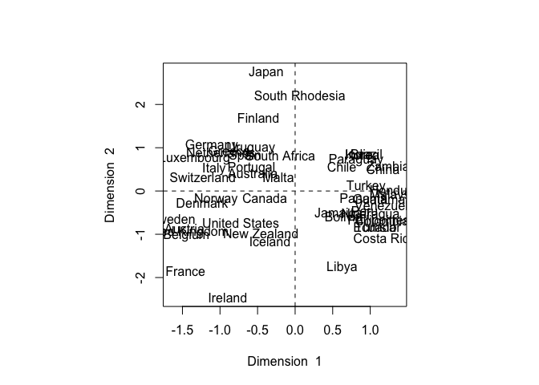

Los cuatro cuadrantes muestran una agrupación de los países en función
de su índice de ahorro del ciclo de vida (ahorro personal dividido por
el ingreso disponible) de 1960 a 1970. Japón tiene una proporción más
alta en la primera dimensión que Irlanda, por lo que Japón está
ahorrando más que lo que gasta.

### Significancia

    library(yacca)
    cca.fit <- cca(pop,oec)
    F.test.cca(cca.fit)

    ## 
    ##  F Test for Canonical Correlations (Rao's F Approximation)
    ## 
    ##          Corr        F   Num df Den df  Pr(>F)    
    ## CV 1  0.82480 13.49772  6.00000     90 7.3e-11 ***
    ## CV 2  0.36528       NA  2.00000     NA      NA    
    ## ---
    ## Signif. codes:  0 '***' 0.001 '**' 0.01 '*' 0.05 '.' 0.1 ' ' 1

La primera correlación canónica, *r* = .82, es estadísticamente
significativa (*F* = 13.49, *d**f* = 6.90, *p* &lt; .0001). La segunda
correlación canónica no informa una prueba *F*, lo cual no es
infrecuente en el análisis de correlación canónica, ya que la primera
variante canónica suele ser la única que es estadísticamente
significativa.

Análisis de componentes principales
-----------------------------------

### Planteamiento[1]

Se aplica a tablas de datos donde las filas son considerados como
individuos y las columnas como datos cuantitativos.

Más formalmente, se dispone de los valores de *p* variables y *n*
elementos dispuestos en una matriz **X** de dimensión *n* × *p*.

Siempre (casi) se usa la matriz centrada y/o estandarizada, los paquetes
suelen hacer este trabajo por nosostros. Supongamos que **X** ha sido
centrada, su matriz de varianza covarianza viene dada por
$\\frac{1}{n}\\mathbf{X'X}$.

¿Cómo encontrar un espacio de dimensión más reducida que represente
adeucadamente los datos?

### Notación

Se desea encontrar un subespacio de dimensión menor que *p* tal que al
proyectar sobre él los puntos conserven su estructura con la menor
distorsión posible.

Consideremos primero un subespacio de dimensión uno (una recta) obtenida
por un conjunto de *p* = 2 variables.

La siguiente figura indica el diagrama de dispersión y una recta que,
intuitivamente, proporciona un buen resumen de los datos, ya que las
proyecciones de los puntos sobre ella indican aproximadamente la
situación de los puntos en el plano.

<figure>
<figcaption>Ejemplo de la recta que minimiza las distancias ortogonales de los puntos a ella.</figcaption>
</figure>Si consideramos un punto **x****i** y una dirección
**a****1** = (*a*11, …, *a*1*p*)′,
definida por un vector **a****1** de norma unidad, la
proyección del punto **x****i** sobre esta dirección es el
escalar:

*z**i* = *a*11*x**i*1 + … + *a*1*p**x**i**p* = **a****1****′****x****i**

y el vector que representa esta proyección será
*z**i***a****1**. Llamando *r**i* a la
distancia entre el punto *x**i*, y su proyección sobre la
dirección **a****1**, este criterio implica:

$$
min\\sum\_{i = 1}^{n} r^2\_i = \\sum\_{i = 1}^{n} |\\mathbf{x\_i}-z\_i\\mathbf{a\_1}|^2
$$

donde | ⋅ | es la norma euclideana o módulo del vector.

Notemos que al proyectar cada punto sobre la recta se forma un triángulo
rectángulo donde la hipotenusa es la distancia al origen del punto al
origen, (**x****i****′****x****i**)1/2,
y los catetos la proyeccion del punto sobre la recta (*z**i*)
y la distancia entre el punto y su proyección (*r**i*). Por
el teorema de Pitágoras, podemos escribir:

(**x****i****′****x****i**) = *z**i*2 + *r**i*2

y sumando esta expresión para todos los puntos, se obtiene:

$$
\\sum\_{i=1}^{n}(\\mathbf{x\_i'x\_i}) = \\sum\_{i=1}^{n}z\_i^2+\\sum\_{i=1}^{n}r\_i^2
$$

Como el primer miembro es constante, minimizar $\\sum\_{i=1}^{n}r\_i^2$,
la suma de las distancias a la recta de todos los puntos, es equivalente
a maximizar $\\sum\_{i=1}^{n}z\_i^2$, la suma al cuadrado de los valores
de las proyecciones. Como las proyecciones *z**i* son
variables de media cero, **maximizar la suma de sus cuadrados equivale a
mazimizar su varianza**.

*¿Cómo es eso posible?*

### Cálculo del primer componente

El primer componente principal será la combinación lineal de las
variables originales que tenga varianza máxima. Los valores de este
primer componente en los *n* individuos se representarán por un vector
**z****1**, dado por

**z****1** = **X****a****1**

Como las variables originales tienen media cero también
**z****1** tendrá media nula. Su varianza será:

$$
Var(\\mathbf{z\_1}) = \\frac{1}{n}\\mathbf{z\_1^{'}z\_1} = \\frac{1}{n}\\mathbf{a\_1^{'}X'Xa\_1} = \\mathbf{a\_1^{'}Sa\_1}
$$

donde *S* es la matriz de varianzas y covarianzas de las observaciones.
Para que la maximización de la ecuación anterior tenga solución debemos
imponer una restricción al módulo del vector **a****1**, y,
sin pérdida de generalidad, impondremos que
**a****1****′****a****1** = 1. Usamos
para ello el multiplicador de Lagrange

*M* = **a****1****′****S****a****1** − *λ*(**a****1****′****a****1** − 1)

Se maximiza derivando respecto a los componentes de
**a****1** e igualando a cero. Entonces

$$
\\frac{\\partial M}{\\partial\\mathbf{a\_1}} = 2\\mathbf{Sa\_1}-2\\lambda\\mathbf{a\_1} = 0
$$

cuya solución es:

**S****a****1** = *λ***a****1**

que implica que **a****1** es un vector propio de la matriz **S**, y *λ*
su correspondiente valor propio. Para determinar qué valor propio de
**S** es la solución de la ecuación tendremos en cuenta que,
multiplicando por la izquierda por **a****′****1** esta
ecuación,

**a****1****′****S****a****1** = *λ***a****1****′****a****1** = *λ*

y concluimos, que *λ* es la varianza de **z****1**. Como esta
es la cantidad que queremos maximizar, *λ* será el mayor valor propio de
la matriz **S**. Su vector asociado, **a****1**, define los coeficientes
de cada variable en el primer componente principal.

### En R

El siguiente conjunto de datos corresponde a calificaciones de 20
estudiantes en 5 materias Ciencias Natuales (CNa), Matemáticas (Mat),
Francés (Fra), Latín (Lat) y Literatura (Lit)

    CNa <- c(7,5,5,6,7,4,5,5,6,6,6,5,6,8,6,4,6,6,6,7)
    Mat <- c(7,5,6,8,6,4,5,6,5,5,7,5,6,7,7,3,4,6,5,7)
    Fra <- c(5,6,5,5,6,6,5,5,7,6,5,4,6,8,5,4,7,7,4,6)
    Lat <- c(5,6,7,6,7,7,5,5,6,6,6,5,6,8,6,4,8,7,4,7)
    Lit <- c(6,5,5,6,6,6,6,5,6,6,5,4,5,8,6,4,7,7,4,6)
    Notas <- cbind(CNa,Mat,Fra,Lat,Lit)
    Notas

    ##       CNa Mat Fra Lat Lit
    ##  [1,]   7   7   5   5   6
    ##  [2,]   5   5   6   6   5
    ##  [3,]   5   6   5   7   5
    ##  [4,]   6   8   5   6   6
    ##  [5,]   7   6   6   7   6
    ##  [6,]   4   4   6   7   6
    ##  [7,]   5   5   5   5   6
    ##  [8,]   5   6   5   5   5
    ##  [9,]   6   5   7   6   6
    ## [10,]   6   5   6   6   6
    ## [11,]   6   7   5   6   5
    ## [12,]   5   5   4   5   4
    ## [13,]   6   6   6   6   5
    ## [14,]   8   7   8   8   8
    ## [15,]   6   7   5   6   6
    ## [16,]   4   3   4   4   4
    ## [17,]   6   4   7   8   7
    ## [18,]   6   6   7   7   7
    ## [19,]   6   5   4   4   4
    ## [20,]   7   7   6   7   6

Es pertiente empezar por un análisis explotario para tener una mejor
perspectiva de los datos:

    summary(Notas)

    ##       CNa           Mat           Fra           Lat            Lit      
    ##  Min.   :4.0   Min.   :3.0   Min.   :4.0   Min.   :4.00   Min.   :4.00  
    ##  1st Qu.:5.0   1st Qu.:5.0   1st Qu.:5.0   1st Qu.:5.00   1st Qu.:5.00  
    ##  Median :6.0   Median :6.0   Median :5.5   Median :6.00   Median :6.00  
    ##  Mean   :5.8   Mean   :5.7   Mean   :5.6   Mean   :6.05   Mean   :5.65  
    ##  3rd Qu.:6.0   3rd Qu.:7.0   3rd Qu.:6.0   3rd Qu.:7.00   3rd Qu.:6.00  
    ##  Max.   :8.0   Max.   :8.0   Max.   :8.0   Max.   :8.00   Max.   :8.00

Ahora algo gráfico:

    library(corrplot)
    plot(as.data.frame(Notas))

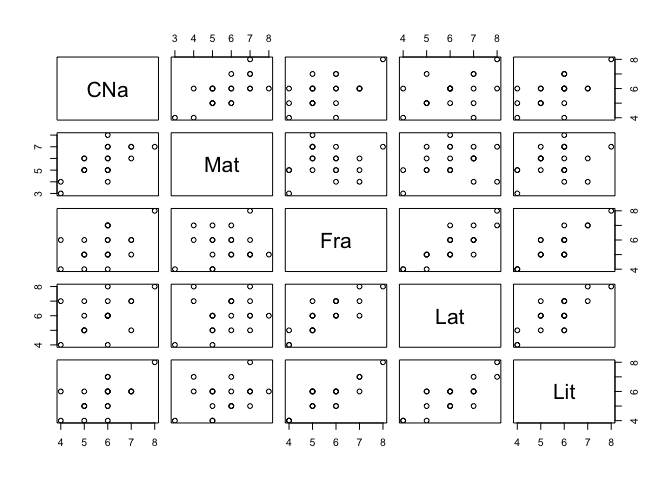

    corrplot(cor(Notas))

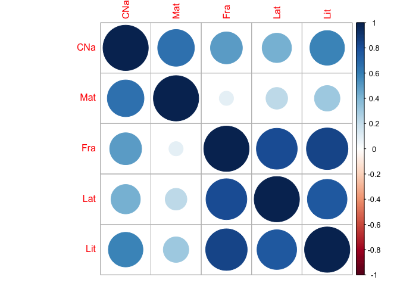

Como habíamos visto, los valores propios corresponden la varianzas
explicadas de cada componente y los vectores propios son sus direcciones
o pesos (*loadings*). Es decir:

    fc <- function(x) return((x-mean(x)))
    Notasc <- apply(Notas,2,fc) #Datos centrados
    S <- cov(Notas*19/20) # Matriz de covarianza
    VarLoad <- eigen(S) # valores y vectores propios
    VarLoad

    ## eigen() decomposition
    ## $values
    ## [1] 3.4101493 1.4993717 0.3696656 0.1987624 0.1128010
    ## 
    ## $vectors
    ##            [,1]       [,2]       [,3]        [,4]       [,5]
    ## [1,] -0.3953452  0.3310292  0.6615512 -0.47595392  0.2644611
    ## [2,] -0.3488288  0.7977236 -0.3708461  0.17998543 -0.2683914
    ## [3,] -0.4822572 -0.3715412  0.2152088  0.01712248 -0.7633984
    ## [4,] -0.5040057 -0.2987146 -0.5998378 -0.46491466  0.2842478
    ## [5,] -0.4852081 -0.1636565  0.1367586  0.72431643  0.4409676

Ahora podemos calcular los puntajes de los componetes por individuo:

    Notasc%*%VarLoad$vectors #scores

    ##              [,1]        [,2]        [,3]        [,4]         [,5]
    ##  [1,] -0.27915411  1.91357104  0.86033137  0.39423402  0.282362039
    ##  [2,]  0.70813894 -0.85053394 -0.24246638 -0.18593762 -0.629895638
    ##  [3,]  0.33756163  0.02001625 -1.42835911 -0.48798933  0.149359151
    ##  [4,] -0.73664347  2.08155078 -0.77190377  0.58525870  0.033757315
    ##  [5,] -1.42059398  0.14687700  0.24671081 -0.69845826  0.355850690
    ##  [6,]  0.46309908 -2.44165783 -0.99625060  0.36943263  0.099250083
    ##  [7,]  1.20919379 -0.34393456  0.27892119  0.98617099  0.290222569
    ##  [8,]  1.34557309  0.61744548 -0.22868359  0.44183999 -0.419136475
    ##  [9,] -0.65467152 -1.05470241  0.77105231  0.07954737 -0.687865235
    ## [10,] -0.17241431 -0.68316118  0.55584349  0.06242489  0.075533142
    ## [11,]  0.09739341  1.44748367 -0.53781626 -0.31904316 -0.138818927
    ## [12,]  2.66186718  0.35491959 -0.20980490 -0.47958435  0.171685659
    ## [13,] -0.03603501  0.27821886  0.04823871 -0.48190611 -0.633825902
    ## [14,] -4.60370426 -0.09348019  0.64151305  0.02353642 -0.008693228
    ## [15,] -0.38781468  1.28382720 -0.40105762  0.40527327  0.302148716
    ## [16,]  4.25887565 -1.27284218  0.47017392  0.10131336  0.159759512
    ## [17,] -1.79906227 -2.61351169  0.07898156 -0.30595095  0.589989436
    ## [18,] -1.99271412 -0.71934991 -0.06287296  0.51893457 -0.231041180
    ## [19,]  2.77052775  0.98466343  1.05158410 -0.49062361  0.151898983
    ## [20,] -1.76942278  0.94460058 -0.12413533 -0.51847283  0.087459289

El porcentaje de la varianza explicada por cada componente es:

    VarLoad$values/(sum(VarLoad$values))

    ## [1] 0.60996276 0.26818793 0.06612094 0.03555201 0.02017636

Verifiquemos nuestros resultados usando la función `princomp` de `R`:

    result1 <- princomp(Notas,cor=FALSE)
    summary(result1)

    ## Importance of components:
    ##                           Comp.1    Comp.2     Comp.3     Comp.4
    ## Standard deviation     1.8946321 1.2562985 0.62379622 0.45740967
    ## Proportion of Variance 0.6099628 0.2681879 0.06612094 0.03555201
    ## Cumulative Proportion  0.6099628 0.8781507 0.94427162 0.97982364
    ##                            Comp.5
    ## Standard deviation     0.34458364
    ## Proportion of Variance 0.02017636
    ## Cumulative Proportion  1.00000000

    result1$loadings

    ## 
    ## Loadings:
    ##     Comp.1 Comp.2 Comp.3 Comp.4 Comp.5
    ## CNa  0.395  0.331  0.662  0.476  0.264
    ## Mat  0.349  0.798 -0.371 -0.180 -0.268
    ## Fra  0.482 -0.372  0.215        -0.763
    ## Lat  0.504 -0.299 -0.600  0.465  0.284
    ## Lit  0.485 -0.164  0.137 -0.724  0.441
    ## 
    ##                Comp.1 Comp.2 Comp.3 Comp.4 Comp.5
    ## SS loadings       1.0    1.0    1.0    1.0    1.0
    ## Proportion Var    0.2    0.2    0.2    0.2    0.2
    ## Cumulative Var    0.2    0.4    0.6    0.8    1.0

    result1$sdev

    ##    Comp.1    Comp.2    Comp.3    Comp.4    Comp.5 
    ## 1.8946321 1.2562985 0.6237962 0.4574097 0.3445836

    str(result1)

    ## List of 7
    ##  $ sdev    : Named num [1:5] 1.895 1.256 0.624 0.457 0.345
    ##   ..- attr(*, "names")= chr [1:5] "Comp.1" "Comp.2" "Comp.3" "Comp.4" ...
    ##  $ loadings: 'loadings' num [1:5, 1:5] 0.395 0.349 0.482 0.504 0.485 ...
    ##   ..- attr(*, "dimnames")=List of 2
    ##   .. ..$ : chr [1:5] "CNa" "Mat" "Fra" "Lat" ...
    ##   .. ..$ : chr [1:5] "Comp.1" "Comp.2" "Comp.3" "Comp.4" ...
    ##  $ center  : Named num [1:5] 5.8 5.7 5.6 6.05 5.65
    ##   ..- attr(*, "names")= chr [1:5] "CNa" "Mat" "Fra" "Lat" ...
    ##  $ scale   : Named num [1:5] 1 1 1 1 1
    ##   ..- attr(*, "names")= chr [1:5] "CNa" "Mat" "Fra" "Lat" ...
    ##  $ n.obs   : int 20
    ##  $ scores  : num [1:20, 1:5] 0.279 -0.708 -0.338 0.737 1.421 ...
    ##   ..- attr(*, "dimnames")=List of 2
    ##   .. ..$ : NULL
    ##   .. ..$ : chr [1:5] "Comp.1" "Comp.2" "Comp.3" "Comp.4" ...
    ##  $ call    : language princomp(x = Notas, cor = FALSE)
    ##  - attr(*, "class")= chr "princomp"

    plot(result1)

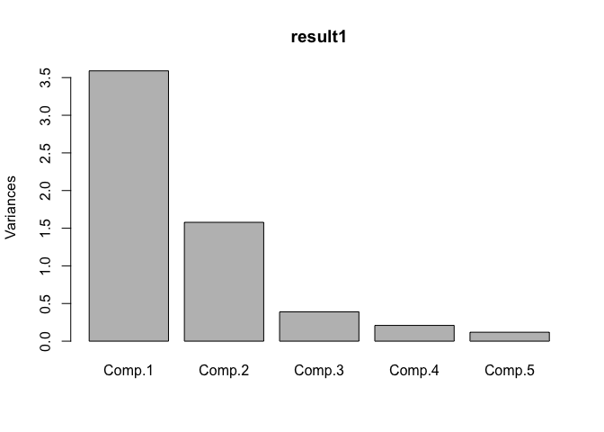

    biplot(result1)

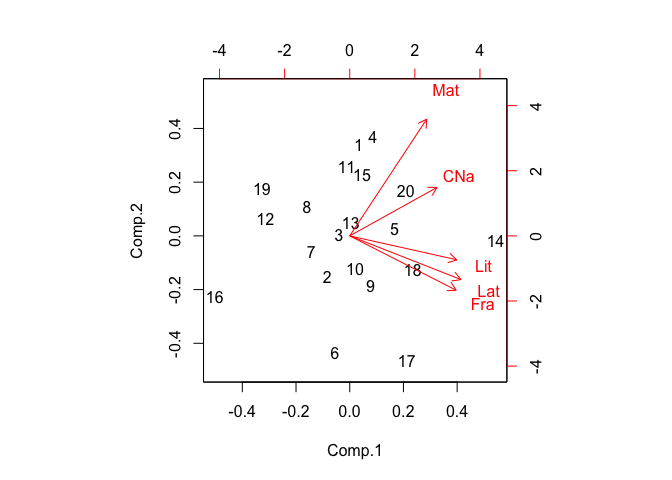

#### FactoMineR

En este paquete tenemos la función `PCA` que nos brinda la misma
información anterior además de otros temas interesantes:

    library(FactoMineR)
    result <- PCA(Notas,graph=FALSE,scale.unit = FALSE)
    plot(result,choix="var")

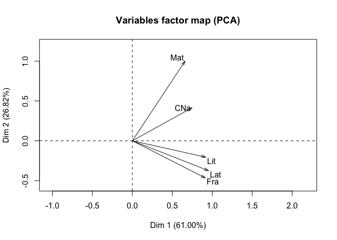

    summary(result)

    ## 
    ## Call:
    ## PCA(X = Notas, scale.unit = FALSE, graph = FALSE) 
    ## 
    ## 
    ## Eigenvalues
    ##                        Dim.1   Dim.2   Dim.3   Dim.4   Dim.5
    ## Variance               3.590   1.578   0.389   0.209   0.119
    ## % of var.             60.996  26.819   6.612   3.555   2.018
    ## Cumulative % of var.  60.996  87.815  94.427  97.982 100.000
    ## 
    ## Individuals (the 10 first)
    ##         Dist    Dim.1    ctr   cos2    Dim.2    ctr   cos2    Dim.3    ctr
    ## 1   |  2.171 |  0.279  0.109  0.017 |  1.914 11.600  0.777 |  0.860  9.511
    ## 2   |  1.310 | -0.708  0.698  0.292 | -0.851  2.292  0.422 | -0.242  0.755
    ## 3   |  1.554 | -0.338  0.159  0.047 |  0.020  0.001  0.000 | -1.428 26.216
    ## 4   |  2.411 |  0.737  0.756  0.093 |  2.082 13.726  0.745 | -0.772  7.656
    ## 5   |  1.648 |  1.421  2.811  0.743 |  0.147  0.068  0.008 |  0.247  0.782
    ## 6   |  2.705 | -0.463  0.299  0.029 | -2.442 18.887  0.815 | -0.996 12.753
    ## 7   |  1.648 | -1.209  2.037  0.539 | -0.344  0.375  0.044 |  0.279  1.000
    ## 8   |  1.617 | -1.346  2.522  0.692 |  0.617  1.208  0.146 | -0.229  0.672
    ## 9   |  1.617 |  0.655  0.597  0.164 | -1.055  3.524  0.425 |  0.771  7.639
    ## 10  |  0.903 |  0.172  0.041  0.036 | -0.683  1.479  0.573 |  0.556  3.970
    ##       cos2  
    ## 1    0.157 |
    ## 2    0.034 |
    ## 3    0.845 |
    ## 4    0.102 |
    ## 5    0.022 |
    ## 6    0.136 |
    ## 7    0.029 |
    ## 8    0.020 |
    ## 9    0.227 |
    ## 10   0.379 |
    ## 
    ## Variables
    ##        Dim.1    ctr   cos2    Dim.2    ctr   cos2    Dim.3    ctr   cos2  
    ## CNa |  0.749 15.630  0.584 |  0.416 10.958  0.180 |  0.413 43.765  0.177 |
    ## Mat |  0.661 12.168  0.289 |  1.002 63.636  0.665 | -0.231 13.753  0.035 |
    ## Fra |  0.914 23.257  0.732 | -0.467 13.804  0.191 |  0.134  4.631  0.016 |
    ## Lat |  0.955 25.402  0.731 | -0.375  8.923  0.113 | -0.374 35.981  0.112 |
    ## Lit |  0.919 23.543  0.822 | -0.206  2.678  0.041 |  0.085  1.870  0.007 |

    sum(sqrt(result$eig[,1]))

    ## [1] 4.57672

    result$var

    ## $coord
    ##         Dim.1      Dim.2       Dim.3        Dim.4       Dim.5
    ## CNa 0.7490336  0.4158715  0.41267316  0.217705924 -0.09112898
    ## Mat 0.6609022  1.0021789 -0.23133242 -0.082327077  0.09248328
    ## Fra 0.9137000 -0.4667667  0.13424645 -0.007831989  0.26305459
    ## Lat 0.9549054 -0.3752747 -0.37417653  0.212656462 -0.09794715
    ## Lit 0.9192908 -0.2056014  0.08530952 -0.331309338 -0.15195023
    ## 
    ## $cor
    ##         Dim.1      Dim.2       Dim.3       Dim.4       Dim.5
    ## CNa 0.7644793  0.4244471  0.42118278  0.22219518 -0.09300813
    ## Mat 0.5378346  0.8155617 -0.18825566 -0.06699682  0.07526183
    ## Fra 0.8557585 -0.4371671  0.12573332 -0.00733533  0.24637320
    ## Lat 0.8549488 -0.3359921 -0.33500884  0.19039621 -0.08769433
    ## Lit 0.9069054 -0.2028314  0.08416016 -0.32684569 -0.14990305
    ## 
    ## $cos2
    ##         Dim.1      Dim.2       Dim.3        Dim.4       Dim.5
    ## CNa 0.5844285 0.18015533 0.177394933 4.937070e-02 0.008650511
    ## Mat 0.2892661 0.66514083 0.035440192 4.488575e-03 0.005664343
    ## Fra 0.7323225 0.19111504 0.015808868 5.380707e-05 0.060699751
    ## Lat 0.7309374 0.11289068 0.112230921 3.625072e-02 0.007690295
    ## Lit 0.8224775 0.04114056 0.007082933 1.068281e-01 0.022470923
    ## 
    ## $contrib
    ##        Dim.1     Dim.2     Dim.3       Dim.4     Dim.5
    ## CNa 15.62978 10.958035 43.765004 22.65321318  6.993969
    ## Mat 12.16815 63.636291 13.752686  3.23947557  7.203394
    ## Fra 23.25720 13.804288  4.631484  0.02931794 58.277708
    ## Lat 25.40218  8.923042 35.980534 21.61456435  8.079682
    ## Lit 23.54269  2.678344  1.870292 52.46342895 19.445246

    loadings<-sweep(result$var$coord,2,sqrt(result$eig[1:5,1]),FUN="/")

    result$var$coord # correlacion entre las variables y los componentes

    ##         Dim.1      Dim.2       Dim.3        Dim.4       Dim.5
    ## CNa 0.7490336  0.4158715  0.41267316  0.217705924 -0.09112898
    ## Mat 0.6609022  1.0021789 -0.23133242 -0.082327077  0.09248328
    ## Fra 0.9137000 -0.4667667  0.13424645 -0.007831989  0.26305459
    ## Lat 0.9549054 -0.3752747 -0.37417653  0.212656462 -0.09794715
    ## Lit 0.9192908 -0.2056014  0.08530952 -0.331309338 -0.15195023

    result$eig # Descomposicion de la varianza por componente

    ##        eigenvalue percentage of variance cumulative percentage of variance
    ## comp 1  3.5896308              60.996276                          60.99628
    ## comp 2  1.5782860              26.818793                          87.81507
    ## comp 3  0.3891217               6.612094                          94.42716
    ## comp 4  0.2092236               3.555201                          97.98236
    ## comp 5  0.1187379               2.017636                         100.00000

    result$ind$dist # Distancias de los individuos al centro de la nube

    ##         1         2         3         4         5         6         7 
    ## 2.1714051 1.3095801 1.5540270 2.4114311 1.6477257 2.7046257 1.6477257 
    ##         8         9        10        11        12        13        14 
    ## 1.6170962 1.6170962 0.9027735 1.5858752 2.7413500 0.8455767 4.6491935 
    ##        15        16        17        18        19        20 
    ## 1.4882876 4.4738127 3.2426841 2.1943108 3.1646485 2.0772578

    result$ind$contrib # Contribucion de los individuos a la construccion de los componentes

    ##           Dim.1        Dim.2       Dim.3       Dim.4        Dim.5
    ## 1   0.108544611 11.600414101  9.51077807  3.71421905  3.357324542
    ## 2   0.698485136  2.291751954  0.75541845  0.82621650 16.707747628
    ## 3   0.158718070  0.001269257 26.21557252  5.69088729  0.939386641
    ## 4   0.755848757 13.726453207  7.65615735  8.18568608  0.047986216
    ## 5   2.810995563  0.068342664  0.78209751 11.65843449  5.332321556
    ## 6   0.298722577 18.886605793 12.75327489  3.26159349  0.414803550
    ## 7   2.036629526  0.374745094  0.99964903 23.24147933  3.546852011
    ## 8   2.521940300  1.207762516  0.67197716  4.66540517  7.397613193
    ## 9   0.596990078  3.524067250  7.63927623  0.15122062 19.924499760
    ## 10  0.041406337  1.478531825  3.96999144  0.09312685  0.240245799
    ## 11  0.013212328  6.637608850  3.71665612  2.43252994  0.811480465
    ## 12  9.869450648  0.399065565  0.56560830  5.49653928  1.241219950
    ## 13  0.001808713  0.245220882  0.02990032  5.54988754 16.916895709
    ## 14 29.521270989  0.027683660  5.28804968  0.01323854  0.003182313
    ## 15  0.209492606  5.221526175  2.06679824  3.92514087  3.844343734
    ## 16 25.264466770  5.132552812  2.84054449  0.24529731  1.074766582
    ## 17  4.508297917 21.638801643  0.08015599  2.23698436 14.657812964
    ## 18  5.531083508  1.639323628  0.05079400  6.43553319  2.247809449
    ## 19 10.691662101  3.071566546 14.20929560  5.75249447  0.971606552
    ## 20  4.360973464  2.826706580  0.19800462  6.42408564  0.322101386

    result$var$contrib # Contribucion de las variables a la construccion de los componentes

    ##        Dim.1     Dim.2     Dim.3       Dim.4     Dim.5
    ## CNa 15.62978 10.958035 43.765004 22.65321318  6.993969
    ## Mat 12.16815 63.636291 13.752686  3.23947557  7.203394
    ## Fra 23.25720 13.804288  4.631484  0.02931794 58.277708
    ## Lat 25.40218  8.923042 35.980534 21.61456435  8.079682
    ## Lit 23.54269  2.678344  1.870292 52.46342895 19.445246

    result$var$cos2

    ##         Dim.1      Dim.2       Dim.3        Dim.4       Dim.5
    ## CNa 0.5844285 0.18015533 0.177394933 4.937070e-02 0.008650511
    ## Mat 0.2892661 0.66514083 0.035440192 4.488575e-03 0.005664343
    ## Fra 0.7323225 0.19111504 0.015808868 5.380707e-05 0.060699751
    ## Lat 0.7309374 0.11289068 0.112230921 3.625072e-02 0.007690295
    ## Lit 0.8224775 0.04114056 0.007082933 1.068281e-01 0.022470923

### Ejemplo

#### Paso 1: recopilación de datos

Trabajemos los datos de los resultados de las competencias de heptatlón
en Seúl 1988

    library(HSAUR)
    data("heptathlon")

Las variables son

-   hurdles: vallas 100m
-   highjump: salto alto
-   shot: tiro
-   run200m: velocidad 200m
-   longjump: salto largo
-   javelin: lanzamiento de javalina
-   run800m: velocidad 800m
-   score: puntaje

#### Paso 2: Explorar y preparar los datos

Resumimos la variable score:

    summary(heptathlon$score)

    ##    Min. 1st Qu.  Median    Mean 3rd Qu.    Max. 
    ##    4566    5746    6137    6091    6351    7291

Ahora las variables que generaron el score

    cor(heptathlon[,-8])

    ##               hurdles     highjump       shot    run200m    longjump
    ## hurdles   1.000000000 -0.811402536 -0.6513347  0.7737205 -0.91213362
    ## highjump -0.811402536  1.000000000  0.4407861 -0.4876637  0.78244227
    ## shot     -0.651334688  0.440786140  1.0000000 -0.6826704  0.74307300
    ## run200m   0.773720543 -0.487663685 -0.6826704  1.0000000 -0.81720530
    ## longjump -0.912133617  0.782442273  0.7430730 -0.8172053  1.00000000
    ## javelin  -0.007762549  0.002153016  0.2689888 -0.3330427  0.06710841
    ## run800m   0.779257110 -0.591162823 -0.4196196  0.6168101 -0.69951116
    ##               javelin     run800m
    ## hurdles  -0.007762549  0.77925711
    ## highjump  0.002153016 -0.59116282
    ## shot      0.268988837 -0.41961957
    ## run200m  -0.333042722  0.61681006
    ## longjump  0.067108409 -0.69951116
    ## javelin   1.000000000  0.02004909
    ## run800m   0.020049088  1.00000000

    library(psych)
    pairs.panels(cor(heptathlon[,-8]))

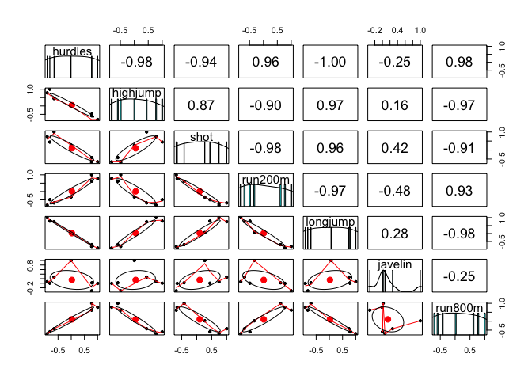

    heptathlon[,-8]

El *sentido* de los datos podría ser un problema. Podemos hacer que
estos *apunten* a un mismo sentido:

    heptathlon$hurdles <- with(heptathlon, max(hurdles)-hurdles)
    heptathlon$run200m <- with(heptathlon, max(run200m)-run200m)
    heptathlon$run800m <- with(heptathlon, max(run800m)-run800m)
    score <- which(colnames(heptathlon) == "score")
    pairs.panels(heptathlon[,-score])

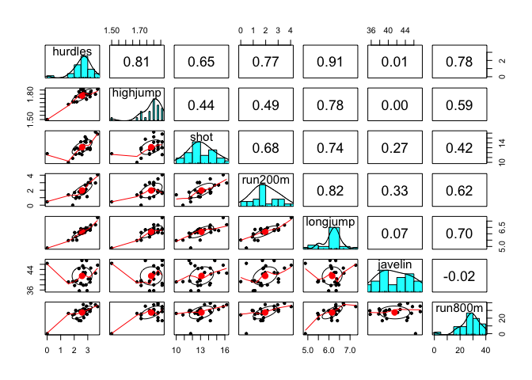

#### Paso 3: entrenar un modelo en los datos

Ajustamos un PCA:

    heptathlon_pca <- prcomp(heptathlon[, -score], scale = TRUE)
    cbind(predict(heptathlon_pca)[,1])

    ##                             [,1]
    ## Joyner-Kersee (USA) -4.121447626
    ## John (GDR)          -2.882185935
    ## Behmer (GDR)        -2.649633766
    ## Sablovskaite (URS)  -1.343351210
    ## Choubenkova (URS)   -1.359025696
    ## Schulz (GDR)        -1.043847471
    ## Fleming (AUS)       -1.100385639
    ## Greiner (USA)       -0.923173639
    ## Lajbnerova (CZE)    -0.530250689
    ## Bouraga (URS)       -0.759819024
    ## Wijnsma (HOL)       -0.556268302
    ## Dimitrova (BUL)     -1.186453832
    ## Scheider (SWI)       0.015461226
    ## Braun (FRG)          0.003774223
    ## Ruotsalainen (FIN)   0.090747709
    ## Yuping (CHN)        -0.137225440
    ## Hagger (GB)          0.171128651
    ## Brown (USA)          0.519252646
    ## Mulliner (GB)        1.125481833
    ## Hautenauve (BEL)     1.085697646
    ## Kytola (FIN)         1.447055499
    ## Geremias (BRA)       2.014029620
    ## Hui-Ing (TAI)        2.880298635
    ## Jeong-Mi (KOR)       2.970118607
    ## Launa (PNG)          6.270021972

    plot(heptathlon_pca)

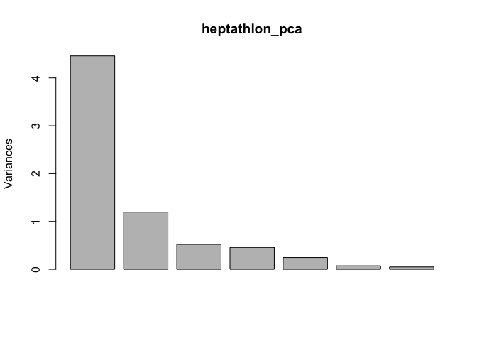

#### Paso 4: evaluar el rendimiento del modelo

Obtenemos la correlación entre el primer componente y los puntajes
oficiales:

    cor(heptathlon$score, heptathlon_pca$x[,1])

    ## [1] -0.9910978

    plot(heptathlon$score, heptathlon_pca$x[,1])

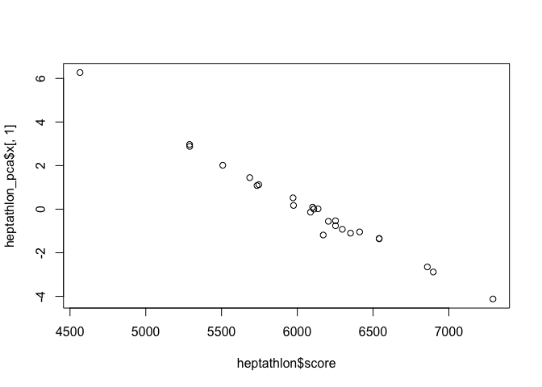

#### Paso 5: mejorando el ajuste

Una de las alternativas más usadas es probar con diferentes rotaciones
de los ejes.

**Bonus**

    dm <- dist(heptathlon[,-8])
    par(mfrow = c(1,3))
    plot(cs <- hclust(dm, method = "single"))
    plot(cc <- hclust(dm, method = "complete"))
    plot(ca <- hclust(dm, method = "average"))

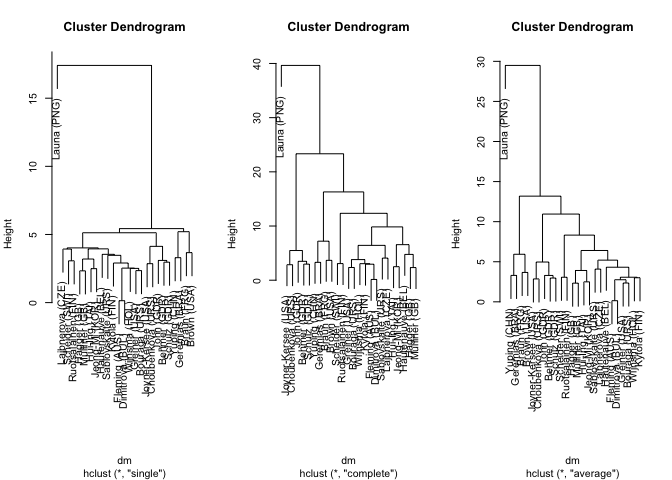

### ACP: Datos de *rating* de marca del consumidor

Estos datos son comunes en investigación de mercado, se refieren a
encuestas de percepción de marca.

Las preguntas suelen ser realizadas usando escalas de *Likert* como: *En
la escala del 1 al 10, donde 1 es menos y 10 es más, cuán \[adjetivo\]
es la \[marca\]?*

-   ¿Cuán de moda es la marca Metal?

#### Datos

Tenemos 10 marcas (de la *a* a la *j*) con 9 adjetivos para *N* = 100
clientes. Veamos los datos:

    brand.ratings <- read.csv("http://goo.gl/IQl8nc")
    head(brand.ratings)

Ahora una inspección de los datos:

    summary(brand.ratings)

    ##     perform           leader           latest            fun        
    ##  Min.   : 1.000   Min.   : 1.000   Min.   : 1.000   Min.   : 1.000  
    ##  1st Qu.: 1.000   1st Qu.: 2.000   1st Qu.: 4.000   1st Qu.: 4.000  
    ##  Median : 4.000   Median : 4.000   Median : 7.000   Median : 6.000  
    ##  Mean   : 4.488   Mean   : 4.417   Mean   : 6.195   Mean   : 6.068  
    ##  3rd Qu.: 7.000   3rd Qu.: 6.000   3rd Qu.: 9.000   3rd Qu.: 8.000  
    ##  Max.   :10.000   Max.   :10.000   Max.   :10.000   Max.   :10.000  
    ##                                                                     
    ##     serious          bargain           value            trendy     
    ##  Min.   : 1.000   Min.   : 1.000   Min.   : 1.000   Min.   : 1.00  
    ##  1st Qu.: 2.000   1st Qu.: 2.000   1st Qu.: 2.000   1st Qu.: 3.00  
    ##  Median : 4.000   Median : 4.000   Median : 4.000   Median : 5.00  
    ##  Mean   : 4.323   Mean   : 4.259   Mean   : 4.337   Mean   : 5.22  
    ##  3rd Qu.: 6.000   3rd Qu.: 6.000   3rd Qu.: 6.000   3rd Qu.: 7.00  
    ##  Max.   :10.000   Max.   :10.000   Max.   :10.000   Max.   :10.00  
    ##                                                                    
    ##      rebuy            brand    
    ##  Min.   : 1.000   a      :100  
    ##  1st Qu.: 1.000   b      :100  
    ##  Median : 3.000   c      :100  
    ##  Mean   : 3.727   d      :100  
    ##  3rd Qu.: 5.000   e      :100  
    ##  Max.   :10.000   f      :100  
    ##                   (Other):400

    str(brand.ratings)

    ## 'data.frame':    1000 obs. of  10 variables:
    ##  $ perform: int  2 1 2 1 1 2 1 2 2 3 ...
    ##  $ leader : int  4 1 3 6 1 8 1 1 1 1 ...
    ##  $ latest : int  8 4 5 10 5 9 5 7 8 9 ...
    ##  $ fun    : int  8 7 9 8 8 5 7 5 10 8 ...
    ##  $ serious: int  2 1 2 3 1 3 1 2 1 1 ...
    ##  $ bargain: int  9 1 9 4 9 8 5 8 7 3 ...
    ##  $ value  : int  7 1 5 5 9 7 1 7 7 3 ...
    ##  $ trendy : int  4 2 1 2 1 1 1 7 5 4 ...
    ##  $ rebuy  : int  6 2 6 1 1 2 1 1 1 1 ...
    ##  $ brand  : Factor w/ 10 levels "a","b","c","d",..: 1 1 1 1 1 1 1 1 1 1 ...

#### Reescalando los datos

    brand.sc <- brand.ratings
    brand.sc [ , 1:9] <- data.frame(scale(brand.ratings [ , 1:9]))
    summary(brand.sc)

    ##     perform            leader            latest             fun          
    ##  Min.   :-1.0888   Min.   :-1.3100   Min.   :-1.6878   Min.   :-1.84677  
    ##  1st Qu.:-1.0888   1st Qu.:-0.9266   1st Qu.:-0.7131   1st Qu.:-0.75358  
    ##  Median :-0.1523   Median :-0.1599   Median : 0.2615   Median :-0.02478  
    ##  Mean   : 0.0000   Mean   : 0.0000   Mean   : 0.0000   Mean   : 0.00000  
    ##  3rd Qu.: 0.7842   3rd Qu.: 0.6069   3rd Qu.: 0.9113   3rd Qu.: 0.70402  
    ##  Max.   : 1.7206   Max.   : 2.1404   Max.   : 1.2362   Max.   : 1.43281  
    ##                                                                          
    ##     serious           bargain             value             trendy        
    ##  Min.   :-1.1961   Min.   :-1.22196   Min.   :-1.3912   Min.   :-1.53897  
    ##  1st Qu.:-0.8362   1st Qu.:-0.84701   1st Qu.:-0.9743   1st Qu.:-0.80960  
    ##  Median :-0.1163   Median :-0.09711   Median :-0.1405   Median :-0.08023  
    ##  Mean   : 0.0000   Mean   : 0.00000   Mean   : 0.0000   Mean   : 0.00000  
    ##  3rd Qu.: 0.6036   3rd Qu.: 0.65279   3rd Qu.: 0.6933   3rd Qu.: 0.64914  
    ##  Max.   : 2.0434   Max.   : 2.15258   Max.   : 2.3610   Max.   : 1.74319  
    ##                                                                           
    ##      rebuy             brand    
    ##  Min.   :-1.0717   a      :100  
    ##  1st Qu.:-1.0717   b      :100  
    ##  Median :-0.2857   c      :100  
    ##  Mean   : 0.0000   d      :100  
    ##  3rd Qu.: 0.5003   e      :100  
    ##  Max.   : 2.4652   f      :100  
    ##                    (Other):400

Exploremos las correlaciones por parejas:

    library(corrplot)
    corrplot(cor(brand.sc [ , 1:9]) , order="hclust")

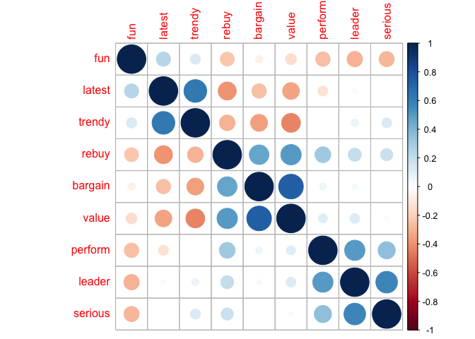

El argumento `order="hclust"` reordena las filas y las columnas de
acuerdo a la similaridad de las variables.

#### Media de los ratings por marca

    brand.mean <- aggregate (. ~ brand , data=brand.sc , mean)
    brand.mean

    rownames(brand.mean) <- brand.mean [ , 1] # la marca como nombre de filas
    brand.mean <- brand.mean [ , -1] # eliminamos la columna de marca
    brand.mean

Un *heatmap* es una forma útil de explorar estos datos porque se
grafican colores de acuerdo a la intensidad del valor:

    library(gplots)
    library(RColorBrewer)
    heatmap.2(as.matrix(brand.mean),
    col=brewer.pal(9, "GnBu") , trace="none" , key=FALSE , dend="none",
    main="\n\n\n\n\nAtributos de la marca")

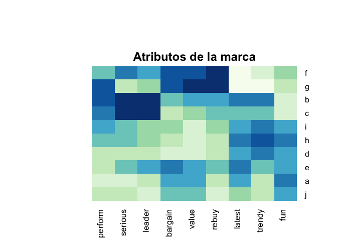

Las marcas *f* y *g* son similares, con altas calificaciones para
*recompra* y *valor*, pero bajas calificaciones para *lo último* y
*divertido*. Otros grupos de marcas similares son *b/c*, *i/h/d*, y
*a/j*.

### Análisis de componentes principales y mapas perceptuales

    brand.pc <- prcomp(brand.sc [ , 1:9])
    summary(brand.pc)

    ## Importance of components:
    ##                          PC1    PC2    PC3    PC4     PC5     PC6     PC7
    ## Standard deviation     1.726 1.4479 1.0389 0.8528 0.79846 0.73133 0.62458
    ## Proportion of Variance 0.331 0.2329 0.1199 0.0808 0.07084 0.05943 0.04334
    ## Cumulative Proportion  0.331 0.5640 0.6839 0.7647 0.83554 0.89497 0.93831
    ##                            PC8     PC9
    ## Standard deviation     0.55861 0.49310
    ## Proportion of Variance 0.03467 0.02702
    ## Cumulative Proportion  0.97298 1.00000

Un gráfico **scree** de una solución de PCA muestra la variación
sucesiva contabilizada por cada componente. Para los datos de
calificación de marca, la proporción se nivela en gran medida después
del tercer componente:

    plot(brand.pc , type="l")

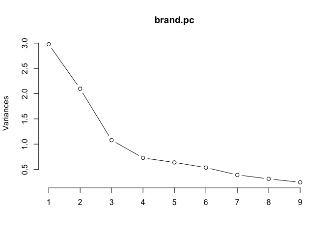

Un **biplot** de un intento inicial de análisis de componentes
principales para calificaciones de marcas de consumo: Aunque vemos
agrupaciones de adjetivos en las flechas de los *loadings* en rojo, y
obtenemos una idea de las áreas donde las clasificaciones se agrupan
(como áreas densas de puntos de observación), el gráfico sería más útil
si los datos se agregaran primero por marca

    brand.mu.pc <- prcomp(brand.mean , scale=TRUE)
    summary(brand.mu.pc)

    ## Importance of components:
    ##                           PC1    PC2    PC3     PC4     PC5     PC6
    ## Standard deviation     2.1345 1.7349 0.7690 0.61498 0.50983 0.36662
    ## Proportion of Variance 0.5062 0.3345 0.0657 0.04202 0.02888 0.01493
    ## Cumulative Proportion  0.5062 0.8407 0.9064 0.94842 0.97730 0.99223
    ##                            PC7     PC8     PC9
    ## Standard deviation     0.21506 0.14588 0.04867
    ## Proportion of Variance 0.00514 0.00236 0.00026
    ## Cumulative Proportion  0.99737 0.99974 1.00000

#### Mapas perceptuales de las marcas

Un *biplot* de la solución PCA para las *calificaciones medias* da un
mapa perceptual interpretable:

    biplot(brand.mu.pc , main="Brand positioning" , cex=c(1.5 , 1))

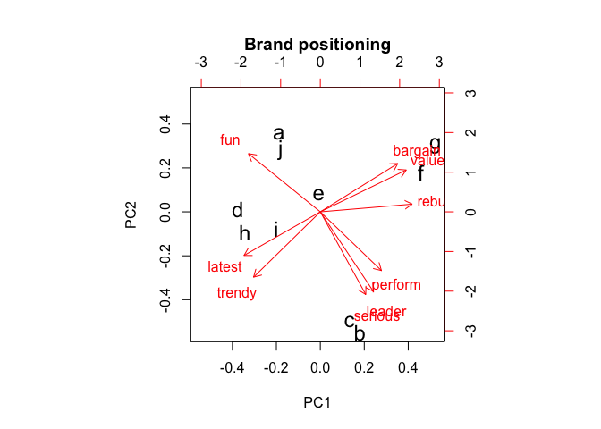

Las posiciones variables en los componentes son consistentes con PCA en
el conjunto completo de observaciones, y seguimos adelante para
interpretar el gráfico.

**¿Qué nos dice el mapa?**

Primero, interpretamos los grupos de adjetivos y las relaciones, y vemos
cuatro áreas con conjuntos bien diferenciados de adjetivos y marcas que
se encuentran cerca.

Las marcas *f* y *g* son altas en *valor*, por ejemplo, mientras que *a*
y *j* son relativamente altas en *diversión*, que es opuesta en
dirección a los adjetivos de liderazgo (*líder* y *serio*).

Con este mapa, uno podría *formular preguntas* y luego consultar los
*datos subyacentes* para responderlas.

Por ejemplo, suponga que usted es el gerente de la marca *e*. ¿Qué te
dice el mapa? Por un lado, su marca está en el centro y, por lo tanto,
*parece no estar bien diferenciada en ninguna de las dimensiones*. Eso
podría ser bueno o malo, dependiendo de sus objetivos estratégicos.

Si su objetivo es ser una marca segura que atraiga a muchos
consumidores, entonces podría ser deseable una posición relativamente
indiferenciada como *e*. Por otro lado, si desea que su marca tenga una
percepción fuerte y diferenciada, este hallazgo no sería deseado (pero
es importante saberlo).

¿Qué debe hacer con respecto a la posición de su marca *e*?

Nuevamente, depende de los objetivos estratégicos. *Si desea aumentar la
diferenciación*, una posibilidad sería tomar medidas para cambiar su
marca en alguna dirección en el mapa. Supongamos que *desea moverse en
la dirección de la marca c*. Puede observar las diferencias específicas
de *c* en los datos:

    brand.mean["c", ] - brand.mean["e", ]

Esto muestra que *e* es **relativamente más fuerte** que *c* en *value*
y *fun*, lo que sugiere reducir los mensajes u otros atributos que los
refuercen (suponiendo, por supuesto, que realmente desea avanzar en la
dirección de *c*). Del mismo modo, *c* es más fuerte en *perform* y
*serious*, por lo que podrían ser aspectos del producto o mensaje para
que e se fortalezca.

Otra opción sería no seguir a otra marca, sino *apuntar a un espacio
diferenciado donde ninguna marca esté posicionada*. En el biplot hay una
gran brecha entre el grupo *b* y *c* en la parte inferior del gráfico,
frente a *f* y *g* en la parte superior derecha. Esta área podría
describirse como el área de *value leader* o similar.

¿Cómo descubrimos cómo posicionarnos allí? Supongamos que la brecha
refleja aproximadamente el promedio de esas cuatro marcas. Podemos
encontrar ese promedio en las filas de las marcas, y luego tomar la
diferencia de *e* de ese promedio:

    colMeans(brand.mean[c("b", "c", "f", "g") , ]) - brand.mean["e" , ]

Esto sugiere que la marca *e* podría apuntar a la brecha al aumentar su
énfasis en el rendimiento (performance) al tiempo que reduce el énfasis
en *latest* y *fun*.

#### Precauciones

1.  Se debe elegir el nivel y el tipo de agregación cuidadosamente.
2.  Las relaciones son *estrictamente relativas a la categoría del
    producto* y las marcas y adjetivos que se prueban. En una categoría
    de producto diferente, o con diferentes marcas, los adjetivos como
    *fun* y *lider* podrían tener una relación muy diferente. A veces,
    simplemente *agregar o soltar una marca puede cambiar el mapa
    resultante significativamente porque las posiciones son relativas*.
    En otras palabras, *si una nueva marca ingresa al mercado (o el
    análisis de uno), las otras posiciones pueden cambiar
    sustancialmente*. También hay que confiar en que se han evaluado
    todas las percepciones clave (adjetivos, en este ejemplo).

Análisis Factorial
------------------

### Introducción

El Análisis Factorial (AF) es una método multivariante de reducción de
dimensionalidad. Tiene por objetivo expresar *p* variables observables
como una combinación lineal de *m* variables lantentes, denominadas
*factores*. El Análisis Factorial está dividido en dos: el AF
exporatorio (AFE), y el AF confirmatorio (AFC). El primer caso se usa
cuando el investigador no tiene ninguna hipótesis previa en cuanto a la
relación que guarda las variables observadas con los fatores latentes.
El segundo enfoque se utiliza cuando el investigador desea probar que un
factor específico provee un ajuste adecuado para las correlaciones entre
las variables observadas (Everitt 2011).

La distinción entre exploratorio y confirmatorio fue tomado de la
distinción hecha por Tuckey en sus análisis de datos (Izenman 2008). El
AFE fue introducido por Spearman en 1904, sin embargo fue solo el inicio
ya él solo introdujo el modelo de un factor.

El AF obtiene e interpreta los factores comunes a partir de la matriz de
correlaciones:

$$
\\mathbf{R} =
\\left( \\begin{array}{cccc}
1 & r\_{12} & \\cdots & r\_{1p} \\\\
r\_{21} & 1 & \\ldots & r\_{2p} \\\\
\\vdots & \\vdots & \\ddots & \\vdots \\\\
r\_{p1} & r\_{p2} & \\cdots & 1 \\\\
\\end{array} \\right)
$$

En los posterior nos referimos al AFE como AF.

### Análisis Factorial Exploratorio

#### Modelo Unifactorial

Sean *X*1, …, *X**p* variables observables. Este
modelo asume un único factor *F* que recoge la covariabilidad de todas
las variables, y *p* factores únicos
*U*1, …, *U**p*, uno para cada variable:

1.  
    *X**i* = *α**i**F* + *d**i**U**i*, *i* = 1, …, *p*

Supuestos:

-   Variables y factores están estandarizados.
-   Los *p* + 1 factores están incorrelacionados

Donde *α**i* es la saturación (*loadings*) de la variable
*X**i* en el factor *F*. A partir de (1) se tiene que

$$
\\alpha\_{i}^{2} + d\_{i}^{2} = 1 \\nonumber \\\\
cor(X\_i,F) = \\alpha\_i \\nonumber \\\\
cor(X\_i,X\_j) = \\alpha\_i \\alpha\_j, \\quad i \\neq j \\nonumber
$$

Entonces *α**i* es el coeficiente de correlación entre
*X**i* y el factor común. Además,
*α**i*2 tiene el nombre de *comunalidad*, denotada
por *h**i*2, es la proporción de la variabilidad
que se explica por *F* y la correlación entre
*X**i*, *X**j* sólo depende de las saturaciones
*α**i*, *α**j*

### Modelo Multifactorial

\#\#\#\#El modelo

En este caso las *X*1, …, *X**p* variables
observadas dependen de *m* factores comunes (variables latentes)
*F*1, …, *F**p* y *p* factores únicos
*U*1, …, *U**p*:

1.  
    $$
    \\begin{aligned}
    X\_1 & = & \\alpha\_{11}F\_1 + \\cdots + \\alpha\_{1m}Fm + d\_{1}U\_{1}   \\\\
    X\_2 & = & \\alpha\_{21}F\_1 + \\cdots + \\alpha\_{2m}Fm + d\_{2}U\_{2}  \\\\
    \\cdots & = & \\cdots  \\cdots   \\\\
    X\_p & = & \\alpha\_{p1}F\_1 + \\cdots + \\alpha\_{pm}Fm  + d\_{p}U\_{p} 
    \\end{aligned}
    $$

Supuestos:

1.  Los factores comunes y los factores únicos están incorrelacionados

$$
\\begin{aligned}
cor(F\_i; F\_j) &=& 0, \\quad i \\neq j = 1, \\ldots,m,  \\\\
cor(U\_i; U\_j) &=& 0, \\quad i \\neq j = 1, \\ldots , p.
\\end{aligned}
$$

1.  Los factores comunes están incorrelacionados con los factores únicos

$$
\\begin{aligned}
cor(F\_i; U\_j) &=& 0, \\quad i = 1, \\ldots , m,  j = 1, \\ldots , p.
\\end{aligned}
$$

1.  Tanto los factores comunes como los factores únicos son variables
    re- ducidas (media 0 y varianza 1).

#### La matriz factorial

Los elementos *α**i**j* de la matriz
**A****p** **×** **m** son las *saturaciones* de cada
variable *X**i* y el factor *F**j*:

$$
\\mathbf{A} =
\\left( \\begin{array}{cccc}
\\alpha\_{11} & \\cdots & \\alpha\_{1m} \\\\
\\alpha\_{21} &  \\ldots & \\alpha\_{2m} \\\\
\\vdots &  \\ddots & \\vdots \\\\
\\alpha\_{p1} &  \\cdots & \\alpha\_{pm} \\\\
\\end{array} \\right)
$$

El modelo factorial en forma matricial es:

**X** **=** **A****F** **+** **D****U**,

donde

-   **D** = *d**i**a**g*(*d*1, …, *d**p*) es la
    matriz diagonal con las saturaciones entre variables y factores
    únicos.

-   **X** = (*X*1, …, *X**p*)′
-   **F** = (*F*1, …, *F**m*)′
-   **U** = (*U*1, …, *U**p*)′

El AF tiene como principal objetivo encontrar e interpretar la matriz
factorial **A**.

#### Comunalidades

En el modelo AF se tiene que (Harman 1968):

*V**a**r*(*X**i*) = *α**i*12 + ⋯ + *α**i*22 + *d**i*2

de donde *α**i**j*2 es la parte de la variabilidad
de *X**i* debida al factor *F**j*.
*d**i*2 es la parte de la variabilidad explicada
exclusivamente por *U**i*.

Se le llama *comunalidad* de la variable *X**i* a:

*h**i*2 = *α**i*12 + ⋯ + *α**i**p*2

Asimismo, el término *d**i*2 es la *unicidad*.
Luego,

*v**a**r**i**a**b**i**l**i**d**a**d* = *c**o**m**u**n**a**l**i**d**a**d* + *u**n**i**c**i**d**a**d*

La comunalidad es la parte de la varibilidad explicada por los factores
comunes.

Finalmente, se le llama matriz de correlaciones reducida a la matriz de
correlaciones una vez que se sustituye las comunalidades en su diagonal:

$$
\\mathbf{R^{\*}} =
\\left( \\begin{array}{cccc}
h\_{1}^{2} & r\_{12} & \\cdots & r\_{1p} \\\\
r\_{21} & h\_{2}^{2} & \\ldots & r\_{2p} \\\\
\\vdots & \\vdots & \\ddots & \\vdots \\\\
r\_{p1} & r\_{p2} & \\cdots & h\_{p}^{2} \\\\
\\end{array} \\right)
$$

Se verifica entonces que:

1.  
    **R** = **R**\* + **D**2

### Estimación de la matriz factorial

#### Método del factor principal

El objetivo es estimar la matriz factorial de modo que los factores
expliquen la máxima varianza y sean incorrelacionados entre ellos.

Si **R****\*** **=** **U****Λ****U****′** es la
descomposición espectral de **R****\***; entonces la solución
del factor principal es

**A** **=** **U****Λ****1****/****2**

Una vez fijado el número *m* de factores, el algoritmo iterativo para
obtener la matriz factorial es:

-   Paso 0: **R** **=** **U****Λ****U****′** (*p* vectores propios de
    **R**).

-   Paso 1:

$$
\\left\\{ \\begin{array}{l}
\\mathbf{A\_1} = \\mathbf{U}\_{m}^{(1)}  (\\mathbf{\\Lambda}\_m)^{1/2} \\qquad \\textrm{($m$ primeros vectores propios)}\\\\
\\mathbf{R\_1} = diag(\\mathbf{A\_1A\_{1}^{'}}) +\\mathbf{R} - \\mathbf{I} \\qquad \\textrm{(matriz correlaciones reducida)} \\\\
\\mathbf{R\_1} = \\mathbf{U}^{(1)} \\mathbf{\\Lambda}^{(1)} \\mathbf{U}^{(1)'} \\qquad \\textrm{(p vectores propios de $\\mathbf{R\_1}$)}
\\end{array} \\right.
$$

-   Paso *i*

$$
\\left\\{ \\begin{array}{l}
\\mathbf{A\_i} = \\mathbf{U}\_{m}^{(i)}  (\\mathbf{\\Lambda}\_{m}^{(i)})^{1/2} \\\\
\\mathbf{R\_i} = diag(\\mathbf{A\_iA\_{i}^{'}}) +\\mathbf{R} - \\mathbf{I} \\qquad \\textrm{(repetir iterativamente)} \\\\
\\mathbf{R\_i} = \\mathbf{U}^{(i)} \\mathbf{\\Lambda}^{(i)} \\mathbf{U}^{(i)'} 
\\end{array} \\right.
$$

La matriz **A***i* converge a la matriz factorial **A**.

####  Ejemplo en R

La tabla de notas contiene calificaciones de 20 estudiantes en
diferentes ramos: Ciencias Naturales (CNa), Matemáticas (Mat), Francés
(Fra), Latín (Lat), Literatura (Lit).

    Notas

    ##       CNa Mat Fra Lat Lit
    ##  [1,]   7   7   5   5   6
    ##  [2,]   5   5   6   6   5
    ##  [3,]   5   6   5   7   5
    ##  [4,]   6   8   5   6   6
    ##  [5,]   7   6   6   7   6
    ##  [6,]   4   4   6   7   6
    ##  [7,]   5   5   5   5   6
    ##  [8,]   5   6   5   5   5
    ##  [9,]   6   5   7   6   6
    ## [10,]   6   5   6   6   6
    ## [11,]   6   7   5   6   5
    ## [12,]   5   5   4   5   4
    ## [13,]   6   6   6   6   5
    ## [14,]   8   7   8   8   8
    ## [15,]   6   7   5   6   6
    ## [16,]   4   3   4   4   4
    ## [17,]   6   4   7   8   7
    ## [18,]   6   6   7   7   7
    ## [19,]   6   5   4   4   4
    ## [20,]   7   7   6   7   6

A continuación se aplican los pasos del algoritmo iterativo en R. Se
asume que se desea extraer 2 factores:

    # Paso 0
    m <- 2
    Z <- cor(Notas)
    R = eigen(Z) # (p vectores propios de R)

    # Paso 1
    # (m primeros vectores propios)
    A1 = R$vectors[, 1:m]%*%sqrt(diag(R$values[1:m])) 
    # (matriz correlaciones reducida)
    R1 = diag(diag(A1%*%t(A1))) + Z - diag(dim(Z)[1]) 
    # (p vectores propios de R1)
    R1 = eigen(R1) 
    Ri <- R1

    # Paso i
    # i <- 1
    for (i in 1:20)
    {
      Ai = Ri$vectors[, 1:m]%*%sqrt(diag(Ri$values[1:m])) 
      Ri = diag(diag(Ai%*%t(Ai))) + Z - diag(dim(Z)[1]) 
      Ri = eigen(Ri)   
    }

Asimismo, se usa una función implementada en la librería `psych` para
realizar AF:

    library(psych)
    mod1 <- factor.pa(cor(Notas),rotate="none",nfactors = 2,fm="pa")

Finalmente, se comparan los resultados obtenidos:

-   Valores propios de los factores

<!-- -->

    Ri$values

    ## [1]  2.97079743  1.03158170  0.06091878  0.01341729 -0.07571943

    mod1$values

    ## [1] 2.970780e+00 1.027559e+00 6.133076e-02 1.298371e-02 2.220446e-16

-   Comunalidades

<!-- -->

    diag(Ai%*%t(Ai))

    ## [1] 0.6410135 0.8803149 0.9611618 0.6933440 0.8251615

    mod1$communality

    ##  CNa  Mat  Fra  Lat  Lit 
    ## 0.64 0.88 0.96 0.69 0.82

-   Loadings

<!-- -->

    Ai

    ##            [,1]       [,2]
    ## [1,] -0.6974571  0.3931501
    ## [2,] -0.4848866  0.8032434
    ## [3,] -0.8959732 -0.3979871
    ## [4,] -0.7997993 -0.2316573
    ## [5,] -0.8982017 -0.1356290

    mod1$loadings

    ## 
    ## Loadings:
    ##     PA1    PA2   
    ## CNa  0.698  0.395
    ## Mat  0.484  0.801
    ## Fra  0.896 -0.398
    ## Lat  0.800 -0.231
    ## Lit  0.898 -0.135
    ## 
    ##                  PA1   PA2
    ## SS loadings    2.971 1.028
    ## Proportion Var 0.594 0.206
    ## Cumulative Var 0.594 0.800

    Ri$values # Valores propios de los factores

    ## [1]  2.97079743  1.03158170  0.06091878  0.01341729 -0.07571943

    diag(Ai%*%t(Ai)) # Comunalidades

    ## [1] 0.6410135 0.8803149 0.9611618 0.6933440 0.8251615

    Ai # Loadings

    ##            [,1]       [,2]
    ## [1,] -0.6974571  0.3931501
    ## [2,] -0.4848866  0.8032434
    ## [3,] -0.8959732 -0.3979871
    ## [4,] -0.7997993 -0.2316573
    ## [5,] -0.8982017 -0.1356290

Se puede apreciar que, a pesar de ligeros cambios debido a la precisión
de la máqina, todos los valores coinciden.

#### Método de la máxima verosimilitud

Este método se puede apreciar como un problema de estimación de la
matriz de covarianzas **Σ**, donde **Σ** se descompone :

**Σ** = **A****A****′** + *V*

Donde **V** = **D**2 ((3)). Se asumen que las *n*
observaciones de las *p* variables provienen de una distribución normal
con **μ** **=** **0**, el logaritmo de la función de verosimilitud es:

$$
log L(\\mathbf{X},\\mathbf{\\mu},\\mathbf{\\Sigma}) = \\frac{n}{2} \\{ log|2\\pi \\Sigma| - tr(\\mathbf{\\Sigma}^{-1}\\mathbf{S})  \\}
$$

Cambiando de signo y modificando constantes, se trata de estimar **A** y
**V** tal que

*F**p*(**A**, **V**) = *l**o**g*|**Σ**| + *t**r*(**Σ** − 1**S**) − *l**o**g*|**S**| − *p*

sea mínimo, donde **S** es la matriz de covarianzas muestrales. Se
obtienen las derivadas parciales despecto a **A** y **V**:

$$
\\frac{\\partial F\_{p}}{\\partial \\mathbf{A}} = 2\\mathbf{\\Sigma}^{-1}(\\mathbf{\\Sigma}-\\mathbf{S})\\mathbf{\\Sigma}^{-1}\\mathbf{A}, \\nonumber \\\\
\\frac{\\partial F\_{p}}{\\partial \\mathbf{V}} = diag(\\mathbf{\\Sigma}^{-1}(\\mathbf{\\Sigma-S})\\mathbf{\\Sigma}^{-1}). \\nonumber
$$

Las ecuaciones a resolver para obtener los estimadores de **A** y **V**
son:

1.  
    **Σ** − 1(**Σ** − **S**)**Σ** − 1**A** = **0**,  *d**i**a**g*(**Σ** − 1(**Σ** **−** **S**)**Σ** − 1) = **0**

Sujeto a:

**Σ** = **A****A****′** + *V*,  **A****′****V** **−** **1****A** *e**s* *d**i**a**g**o**n**a**l*

En resumen, se trata de encontrar el espacio de los factores comunes.
Las ecuaciones en (4) no tienen solución explícita, se usa entonces un
método iterativo.

#### Rotaciones de factores

Obtener la matriz factorial es el primer paso del AF. El objetivo
práctico es poder hacer alguna interpretación de los factores obtenidos.
En gerenal, la matriz obtenida de manera directa no ofrece dicha
interpretabilidad. Esto debido a que los factores suelen estar
corelacionados con casi todas las variables. Es por esta razón que se
realiza la *rotación factorial*, para poder interpretar los factores.
Este es un procedimiento en el que, a partir de la matriz factorial, se
obtiene la *matriz factorial rotada*, de más facil lectura.

Así como existen diferentes modos de extracción de los factores, también
los hay para realizar la rotación. En todos estos métodos las
comunalidades y porcentaje de varianza explicada no cambia, solo cambia
el porcentaje de varianza atribuido a cada uno de los factores. Se
listan a continuación los más utilizados:

-   *Método varimax*. Método de rotación ortogonal que minimiza el
    número de variables que tienen saturaciones altas en cada factor.
    Simplifica la interpretación de los factores.

-   *Criterio Oblimin directo*. Método para la rotación oblicua (no
    ortogonal). Si delta es igual a cero (el valor por defecto) las
    soluciones son las más oblicuas. A medida que delta se va haciendo
    más negativo, los factores son menos oblicuos. Para anular el valor
    por defecto 0 para delta, introduzca un número menor o igual que
    0,8.

-   *Método quartimax*. Método de rotación que minimiza el número de
    factores necesarios para explicar cada variable. Simplifica la
    interpretación de las variables observadas.

-   *Método equamax*. Método de rotación que es combinación del método
    varimax, que simplifica los factores, y el método quartimax, que
    simplifica las variables. Se minimiza tanto el número de variables
    que saturan alto en un factor como el número de factores necesarios
    para explicar una variable.

-   *Rotación Promax*. Rotación oblicua que permite que los factores
    estén correlacionados. Esta rotación se puede calcular más
    rápidamente que una rotación oblimin directa, por lo que es útil
    para conjuntos de datos grandes.

El método más usado es *varimax*.

#### Interpretación de los factores

Para la interpretación de factores, se citan las sugerencias de
Bisquerra (Cuadras 2014):

1.  Estudiar la composición de las saturaciones factoriales
    significativas de cada factor (considerando tanto sus valores
    positivos como negativos). Para estudiar estas saturaciones
    factoriales, y a efectos prácticos recomienda: (1) la representación
    gráfica de los ejes factoriales (las variables saturadas de un
    factor aparecerán agrupadas); (2) ordenar las variables en función
    del peso de los factores, de tal manera que en la matriz factorial
    rotada aparezcan agrupadas las variables con ponderaciones altas
    para el mismo factor; y (3), eliminar las saturaciones bajas
    ocupando sus espacios con espacios blancos.

2.  En aquellos casos en el que los factores incluyen variables, en
    principio, poco significativas respecto al conjunto de las que
    sintetizaba, se puede incluir el análisis de la representatividad de
    la variable en cuestión en el conjunto de la estructura factorial,
    esto es, se considerará su comunalidad.

3.  Intentar dar un nombre a los factores. Éste debe adecuarse a la
    estructura de las saturaciones, esto es, conociendo su contenido.
    Indudablemente en esta última fase juega un importante papel el
    marco teórico en el que debe apoyarse toda investigación.

### AF: Un ejemplo en R

#### Máxima Verosimilitud

La función `fractanal` realiza AF usando el método de máxima
verosimilitud. En este ejemplo se extrae 2 factores:

    rownames(Notas) <- LETTERS[1:nrow(Notas)]
    names(Notas) <- c("CNa","Mat","Fra","Lat","Lit")

    # Análisis Factorial con Máxima Verosimilitud
    # entra los datos y se extrae 3 factores, 
    # se usa la rotación VARIMAX 
    fit <- factanal(Notas, 2, rotation="varimax")
    print(fit, digits=2, cutoff=.3, sort=TRUE)

    ## 
    ## Call:
    ## factanal(x = Notas, factors = 2, rotation = "varimax")
    ## 
    ## Uniquenesses:
    ##  CNa  Mat  Fra  Lat  Lit 
    ## 0.38 0.00 0.04 0.29 0.21 
    ## 
    ## Loadings:
    ##     Factor1 Factor2
    ## Fra 0.98           
    ## Lat 0.82           
    ## Lit 0.85           
    ## CNa 0.46    0.64   
    ## Mat         1.00   
    ## 
    ##                Factor1 Factor2
    ## SS loadings       2.56    1.52
    ## Proportion Var    0.51    0.30
    ## Cumulative Var    0.51    0.82
    ## 
    ## Test of the hypothesis that 2 factors are sufficient.
    ## The chi square statistic is 1.23 on 1 degree of freedom.
    ## The p-value is 0.268

    # gráfico de factor1 vs factor2 
    load <- fit$loadings[,1:2] 
    plot(load,type="n") # Gráfico de los factores
    text(load,labels=names(Notas),cex=.7) # Agrego los nombres de variables

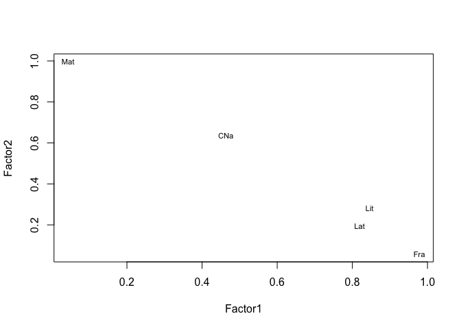

La opción `rotation` incluye `"varimax"`, `"promax"`, `"none"`. Se
agrega la opción `scores="regression"` o `"Barlett"` para generar los
factores. Se usa la opción `covmat` para ingresar la matriz de
correlación o covarianza directamente.

#### Método del factor principal

En la [sección](@ejR) se realizó una primera aproximación de este
método. Se abroda un par de detalles más en este ejemplo. La función
`factor.pa` en el paquete `psych` incluye varias opciones de estimación
de la matriz factorial, entre ellas, el método del factor principal.

    # Método del factor principal
    library(psych)
    fit <- factor.pa(Notas, nfactors=2, rotate="varimax")
    fit # Imprimo los resultados

    ## Factor Analysis using method =  pa
    ## Call: factor.pa(r = Notas, nfactors = 2, rotate = "varimax")
    ## Unstandardized loadings (pattern matrix) based upon covariance matrix
    ##      PA1  PA2   h2   u2   H2   U2
    ## CNa 0.42 0.68 0.64 0.36 0.64 0.36
    ## Mat 0.04 0.93 0.88 0.12 0.88 0.12
    ## Fra 0.98 0.08 0.96 0.04 0.96 0.04
    ## Lat 0.81 0.18 0.69 0.31 0.69 0.31
    ## Lit 0.85 0.31 0.82 0.18 0.82 0.18
    ## 
    ##                        PA1  PA2
    ## SS loadings           2.53 1.47
    ## Proportion Var        0.50 0.29
    ## Cumulative Var        0.50 0.80
    ## Proportion Explained  0.63 0.37
    ## Cumulative Proportion 0.63 1.00
    ## 
    ##  Standardized loadings (pattern matrix)
    ##     item  PA1  PA2   h2   u2
    ## CNa    1 0.42 0.68 0.64 0.36
    ## Mat    2 0.04 0.94 0.88 0.12
    ## Fra    3 0.98 0.08 0.96 0.04
    ## Lat    4 0.81 0.18 0.69 0.31
    ## Lit    5 0.85 0.31 0.82 0.18
    ## 
    ##                  PA1  PA2
    ## SS loadings     2.52 1.47
    ## Proportion Var  0.50 0.29
    ## Cumulative Var  0.50 0.80
    ## Cum. factor Var 0.63 1.00
    ## 
    ## Mean item complexity =  1.2
    ## Test of the hypothesis that 2 factors are sufficient.
    ## 
    ## The degrees of freedom for the null model are  10  and the objective function was  3.66 with Chi Square of  60.31
    ## The degrees of freedom for the model are 1  and the objective function was  0.11 
    ## 
    ## The root mean square of the residuals (RMSR) is  0.02 
    ## The df corrected root mean square of the residuals is  0.07 
    ## 
    ## The harmonic number of observations is  20 with the empirical chi square  0.19  with prob <  0.66 
    ## The total number of observations was  20  with Likelihood Chi Square =  1.62  with prob <  0.2 
    ## 
    ## Tucker Lewis Index of factoring reliability =  0.863
    ## RMSEA index =  0.233  and the 90 % confidence intervals are  0 0.67
    ## BIC =  -1.37
    ## Fit based upon off diagonal values = 1
    ## Measures of factor score adequacy             
    ##                                                    PA1  PA2
    ## Correlation of (regression) scores with factors   0.98 0.94
    ## Multiple R square of scores with factors          0.97 0.89
    ## Minimum correlation of possible factor scores     0.94 0.78

Los datos de entrada puede ser la matriz de datos original o la matriz
de covarianza/correlación. Las rotaciones pueden ser todas las
mecionadas en [esta sección](#rotate), entre otras.

#### Determinar el número de factores

Una decisión crucial en el AF es determinar el número de factores a
extraerse. El paquete \`nFactors ofrece un conjunto de rutinas para
direccionar esta decisión. Desde luego, cualquier solución factorial
debe ser interpretable para ser de utilidad.

    # Determinar el # de factores a extraer
    library(nFactors)
    ev <- eigen(cor(Notas)) # obtiene los eigenvalues
    ap <- parallel(subject=nrow(Notas),var=ncol(Notas),
      rep=100,cent=.05)
    nS <- nScree(x=ev$values, aparallel=ap$eigen$qevpea)
    plotnScree(nS)

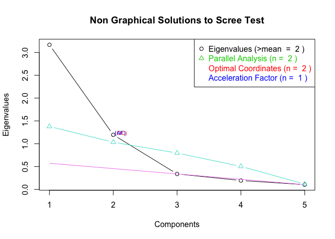

En este caso, se sugiere que el número de factores sea 2.

\#\#\#\#Más recursos en R

El paquete `FactoMineR` ofrece un gran número de funciones para AF.
Incluye el uso de variables cualitativas y cuantitativas. Aquí un
ejemplo de los tipos de gráficos que se puede crear con este paquete:

    # PCA Variable Factor Map 
    library(FactoMineR)
    result <- PCA(Notas,graph=FALSE)
    plot(result,choix="var")

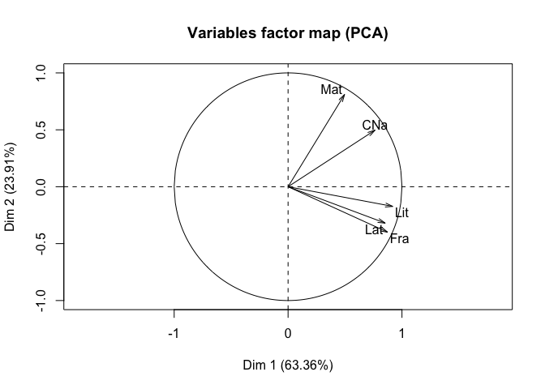

Finalmente, el paquete `GPARotation` ofrece un gran número de opciones
de rotación.

Referencias
===========

Cuadras, C. 2014. *Nuevos Métodos de Análisis Multivariante*. CMC
Editions, España.

Everitt, B. 2011. *An Introduction to Applied Multivariate Analysis with
R*. Springer.

Harman, H. 1968. *Modern Factor Analysis*. University of Chicago Press.

Izenman, A. 2008. *Modern Multivariate Statistical Techniques*.
Springer.

Mardia, Kanti, J. Kent, and J. Bibby. 1979. *Multivariate Analysis*.
First. New York: Academic Press.

Schumacker, Randall E. 2015. *Using R with Multivariate Statistics*.
Sage Publications.

[1] Teoría obtenida de Peña, D. *Análisis de datos multivariantes*
(2002). Referencias de `FactoMineR` vienen de Husson, F. *Exploratory
multivariate analysis by example using R* (2017)
